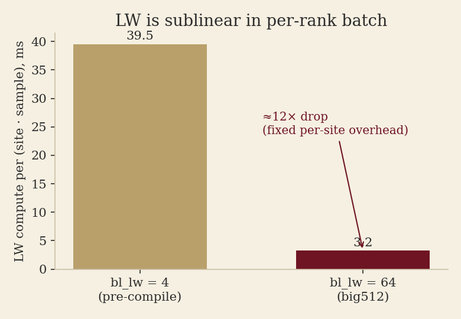

# 3-pool topology calibration — big512 regime (2026-06-03)

Config/topology-specific calibration of the generic `scripts/topology_search.py`
throughput screen. The generic tool takes calibration as **input**; this doc + the
reproduction script `scripts/repro_big512_topology_search.py` are the record of the
specific numbers and what they say.

**Reproduce** (search + figures):

```bash
python scripts/repro_big512_topology_search.py                 # the search
python scripts/repro_big512_topology_search.py --plots docs/img/3pool_topology_calibration_2026-06-03/
```

## The step at the big512 regime


The three pools run lockstep, so `step ≈ max(pool compute) + overhead`. **LW is the pole**
(1244 ms) ≳ PPGD (1140) ≫ CI (579, the rest is NCCL-wait). The gap from the pole up to the
2358 ms step is **non-overlapped overhead ≈ 1114 ms — ~47% of the step**: cross-pool
comm / sync / bubbles, now nearly half the step and growing with rank count. That is the
standout optimization frontier beyond LW compute itself.

## Calibration (current code: vendored ComponentGPT2, LW+CI torch.compile, ckpt)

Per-pool **compute** from the `rebalance-6site` torch.profiler trace (job 38431, 112 ranks
LW64/CI16/PPGD32, B=256), via `scripts/analyze_3pool_trace.py`. Its per-rank batch_local
(lw 64 / ci 16 / ppgd 8, sites/block 6) is **identical to big512 production** (p-b6505e9c) —
big512 doubled both B and every pool's DDP — so the per-rank compute carries over exactly.
Step **wall** is from big512 production itself (224 ranks, ~2358 ms) so `overhead` reflects
the 224-rank cross-pool cost (the 112-rank trace's own wall is ~2138 ms).

| pool | compute (ms/step, per-rank) | batch_local |
|---|---|---|
| layerwise | 1244 | 64 (6 sites/block) |
| ppgd | 1140 | 8 |
| ci | 579 | 16 |

Derived: `k_ci=36.2`, `k_ppgd=142.5`, `k_lw_total=311` (ms), `overhead=1114` ms.

For B=512 / budget 224, **big512 (ci32/ppgd64/lw128) is already near throughput-optimal**
under current constraints — the hand-tuned topology holds up.

## Caveat: LW is sublinear in batch (don't over-trust the screen)



The per-(site·sample) LW cost fell **~12×** from bl_lw=4 (old calibration) to bl_lw=64 —
a large fixed per-site overhead (the serial recon loop), far more than compile's 2.74×. The
model's *linear* LW term therefore over-credits adding LW ranks (cf. the thin-block result:
+8.5%, not the modelled multiple). Calibrated here at bl_lw=64; trust the screen only near
that regime.

Other limits: the model is **LW-shape-blind** (`compute_lw` depends only on `n_lw`, not
sites/block — use a real sweep to pick thin vs fat blocks), and **overhead is
scale-dependent** (calibrated at 224 ranks). It's a screen, not a verdict — validate winners
with a real run.

## How to re-calibrate

1. Run a short profiling smoke (`torch_profile` on) at a representative topology, or reuse an
   existing trace under `$DATA/torch_profile/<job>/`.
2. `python scripts/analyze_3pool_trace.py <trace_dir>` → read the per-pool `compute` means
   and each pool's batch_local (from the run's topology).
3. Take the step **wall** from the production run's logged `train/perf/step_ms` at the scale
   you're searching.
4. Update the numbers in `scripts/repro_big512_topology_search.py` (or write a new repro
   script / JSON calibration) and re-run.
