# Quantities at a residual-stream site: prototype of the hypothesis loop (L0, token "a")

Run p-ba5a0c05 (-05 addsub decomposition of Llama-3.1-8B), step 40000, alive-only model (every
alive component of `addsub-05-filter-last-pos-ceiling` on at 1, dead components and the weight
delta off). Outputs: `~/out/pod-backup/p-ba5a0c05/analysis/quantities/L0/<site>_<hypothesis set>/`.

## Notation
- a: the first operand, an integer 1..100; the token position is t = 1 (the "a" token). With
  causal attention every activation at t = 1 is a function of a alone, so a site is a matrix
  over the 100 values of a.
- Site: the alive readers of one read point that are active at t = 1 (output CI on the original
  model > 0.01 somewhere on the (a, b) grid at t = 1; b the second operand, 1..100).
  Site 1 = L0 attention input (stream position l = 0, right after the embedding): 8 readers
  (1 q, 4 k, 3 v). Site 2 = L0 MLP input (l = 1, after L0's attention): 115 readers (53 gate,
  62 up).
- A_r(a): reader r's inner activation in the ||V|| = 1 gauge. rho(a): RMS of the residual
  stream at the site (a positive scalar per value of a). Raw read: rho(a) A_r(a) / mean(rho), the
  dot product of the reader's gain-folded direction with the raw stream, which is exactly linear
  in what was written to the stream. The fits target the raw read.
- Quantity: a hypothesised function of a with an encoding, given as a feature matrix
  Phi_q (100 x d_q). Fixed quantity: a reader reads all d_q columns together (a smooth curve, a
  circle). Menu quantity: a reader picks individual columns (one residue class, one interval,
  one token value).
- [P]: 1 if P holds, 0 otherwise. "a mod m = r": the residue class of a modulo m.

## Method (`hyp_fit.py`, `hypotheses.py`, `iterate.py`)
Each reader x (100 values) is fit greedily: start from a constant; each move adds a whole
fixed quantity or one column of a menu quantity; a move is kept if it lowers the description
length

  DL = (N/2) log2(RSS / N) + sum of move costs,

with N = 100, RSS the residual sum of squares, a move costing the quantity's bits the first
time a reader uses it (4 bits less if another reader of the site already uses it: quantities are
declared once and read many times), log2(menu size) for a menu item, and (1/2) log2 N per
weight. Diagnostics drive the next hypothesis set:
- shared residual structure: top singular values of the (100 x readers) residual matrix vs a
  null permuting each reader's residual over a (`residual_svd.png` shows the patterns);
- per reader: strongest periodic component (DFT), best single threshold, best smooth trend,
  each against its permutation null (flagged at the 95% level);
- outlier tokens: values of a with residual > 3 robust SDs in several readers.

## Walkthrough
Every number below is regenerated by `report_figures.py` (figures `figures/walk_*.png`, numbers
`walkthrough.json`). Two fit-quality numbers per iteration: the fraction of the site's raw-read
variance explained (all readers pooled), and the median over readers of the per-reader R^2.
Shared residual structure: the top singular value of the residual matrix, against the 95%
quantile of the permutation null. Flagged: readers with a periodic, threshold or smooth pattern
left in their residual (each test at the 95% level; with three tests per reader, about 15% of
readers are flagged by chance).

| site | hypothesis set | explained | median R^2 | residual top singular value (null) | flagged |
|---|---|---|---|---|---|
| 1 (8 readers) | s1_v1: magnitude (log a, a), digit count, round numbers | 0.529 | 0.862 | 5.01 (4.35) | 3 |
| 1 | s1_v2: magnitude as a spline in log a | 0.540 | 0.877 | 5.01 (4.35) | 0 |
| 1 | s1_v3: + token identity menu | 0.679 | 0.900 | 4.03 (3.89) | 1 |
| 2 (115 readers) | s2_v1: + token identity, units digit, intervals, thresholds | 0.980 | 0.991 | 6.90 (6.88) | 19 |
| 2 | s2_v2: + residues mod 3..12, residue x ramp, soft bumps, soft thresholds | 0.986 | 0.991 | 3.89 (3.90) | 19 |

**Step 0: look at the readers.** `figures/site2_raw.png` shows the 115 raw reads at site 2:
single spikes, comb patterns every 10, windows of a few consecutive values, steps, smooth
curves. `figures/rho.png` and `figures/site1_raw_vs_post.png` show why the fits target raw reads
(rho rises like log a; dividing by it hides the magnitude signal).

**Site 1, iterations 1 to 3** (`figures/walk_site1_iterations.png`; rows 1-2: s1_v1 fit and
residual, rows 3-4: s1_v3).
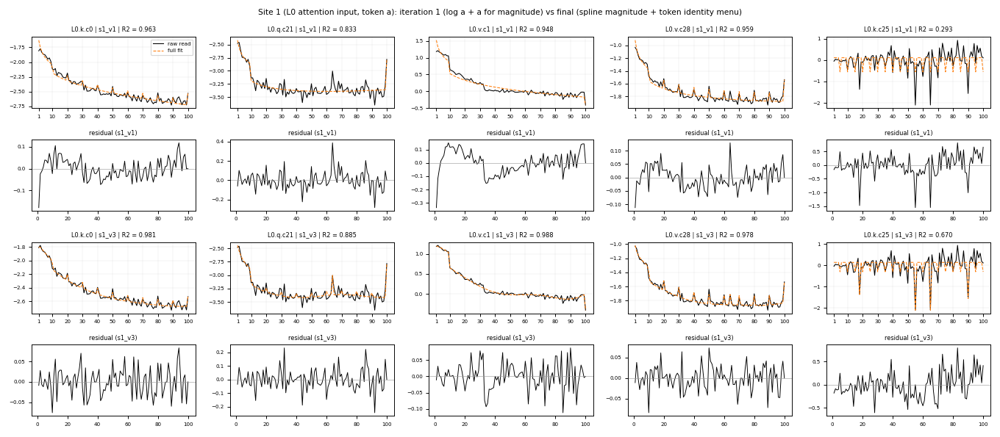
- s1_v1 fits the magnitude with log a and a. The residual of v.c1 keeps a smooth hump (positive
  for a in 10..30, negative near a = 35): the reader's curve flattens at a ~ 35, which no mix of
  log a and a reproduces.
- s1_v2 replaces them with a free smooth curve (cubic spline in log a, 6 dimensions); v.c1's
  residual loses the hump (R^2 0.948 under s1_v1, 0.988 under s1_v3, which keeps this curve).
- s1_v3 adds the token identity as a menu (one indicator per value of a). The k readers (k.c25,
  k.c115) take the tokens 55, 65, 90 and 18, which stand out in several readers at once; their R^2
  rises to about 0.65-0.67. What is left in k.c25 is a slow rise above a ~ 70 at the edge of the
  null, and per-token jitter.

**Site 2, iteration 1.** The library from the raw plots (site 1's quantities, single tokens,
units-digit classes, intervals, thresholds) explains 98.0% and leaves the shared residual at the
null, but one reader is not explained at all: gate.c109, R^2 = 0.

**Site 2, iteration 2: finding divisibility by 3** (`figures/walk_site2_div3.png`).
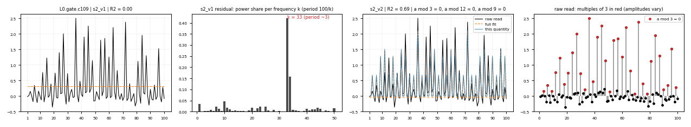
gate.c109's residual (panel 2) has 42% of its power at DFT frequency k = 33, a period of about 3
(100 / 33). The raw read (panel 4) is positive exactly on multiples of 3 (red), with amplitudes
that vary from one multiple to the next. Residues modulo divisors of 100 cannot express this, so
s2_v2 adds residue classes modulo 3, 4, 6, 7, 8, 9, 11, 12; gate.c109 then picks a mod 3 = 0
(refined by a mod 12 = 0 and a mod 9 = 0) and reaches R^2 = 0.69. The rest is the per-multiple
amplitude scatter. Under the strict criterion (a residue-0 class modulo 3, 6, 9 or 12) only
3 readers use divisibility by 3, and only gate.c109 clearly: up.c127 and gate.c49 use mod-12 /
mod-50 items alongside others. s2_v2 also adds residue classes times a linear ramp in a (the
comb spikes grow with a in some readers) and soft-edged bumps and thresholds.

**The quantities found, with the readers they explain most** (`figures/walk_gallery_mlp.png`,
site 2; `figures/walk_gallery_attn.png`, site 1). Each row is one quantity; each panel one reader:
black the raw read, orange dashed the full fit, blue the part of the fit that comes from this
quantity (shifted to the reader's mean). The title gives the reader's R^2, the quantity's share
(variance of its part of the fit over the variance of the raw read) and the items it uses.
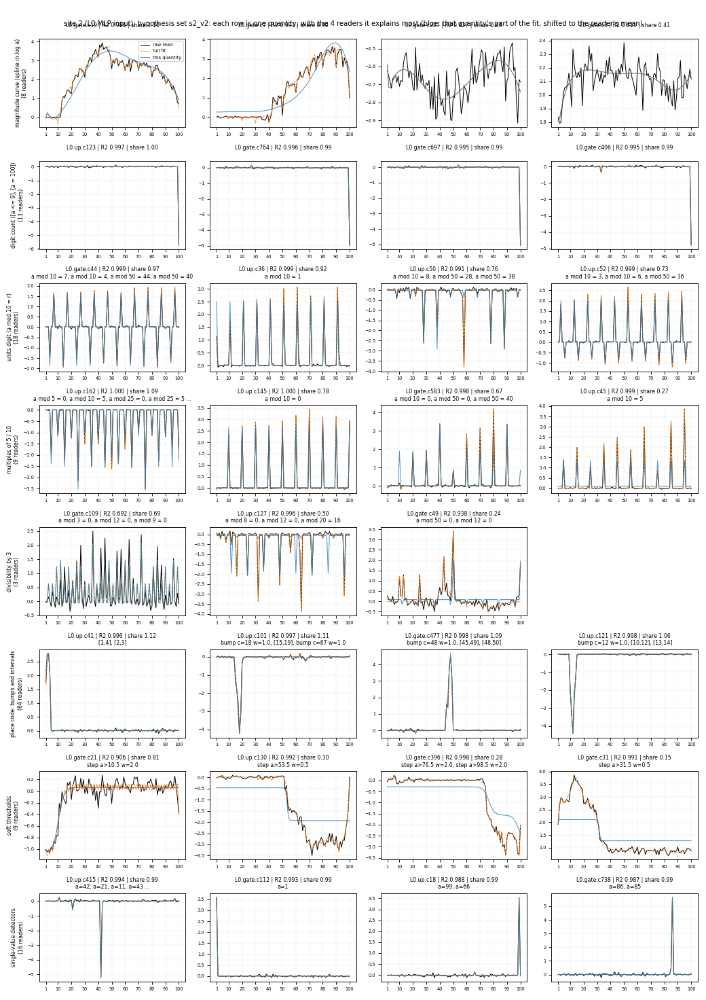
- Magnitude curve (8 readers): smooth rises, falls and broad humps (gate.c19 peaks near a = 45,
  gate.c7 rises from a ~ 45); gate.c227 and gate.c3 are slow drifts under per-token jitter
  (R^2 0.43 and 0.41).
- Digit count (13 readers): the four strongest are [a = 100] detectors (R^2 above 0.99).
- Units digit (18 readers): combs every 10, often two digits of opposite sign in one reader
  (gate.c44: +7 and -4; up.c52: +3 and -6).
- Multiples of 5 / 10 (9 readers): combs on a mod 10 = 0 or 5, with amplitudes varying per
  multiple (up.c162, gate.c583), corrected by token items.
- Divisibility by 3 (3 readers; see above).
- Place code (64 readers): narrow windows and bumps, one per reader, anywhere in 1..100 (up.c41:
  a in 1..4, up.c101: a in 15..19, gate.c477: a in 45..50, up.c121: a in 10..14).
- Soft thresholds (9 readers): the one-/two-digit boundary (gate.c21, a > 10.5) and steps at
  a ~ 53, 76, 31.
- Single-value detectors (16 readers that use nothing but token items): one value each, e.g.
  a = 42, 1, 99, 86, R^2 about 0.99.
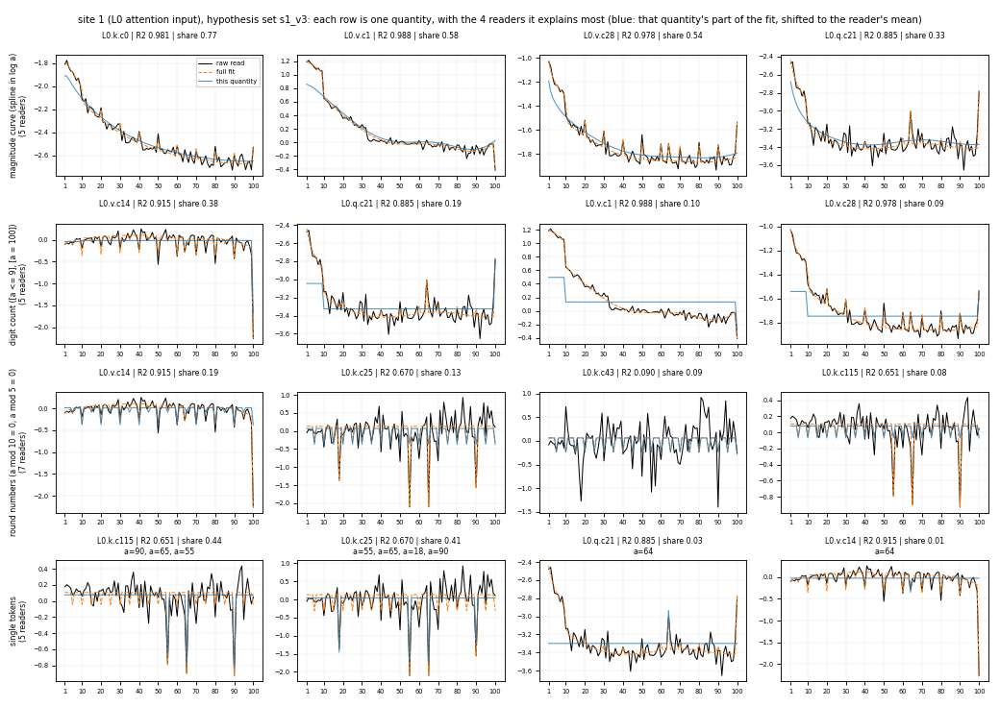

Per-reader R^2 across iterations: `figures/walk_r2.png`.
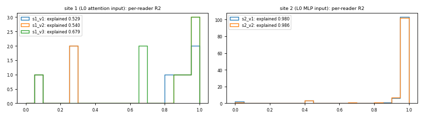

**Caveat on attributing a fit to quantities.** The smooth curve, bumps, intervals, thresholds and
digit count overlap as function spaces, so a reader can fit two of them with large terms of
opposite sign; the "share" of each is then not meaningful (it exceeds 1). The gallery shows
readers whose share is at most 1.2 where possible. A summary that is unambiguous needs an
orthogonal hierarchy of quantities (point 3 of the summary below and the limits section).

## What the loop found
**rho is itself a quantity.** rho(a) rises like log a from 0.0072 (a = 2) to about 0.0105
(`figures/rho.png`): the embedding norm encodes magnitude. Dividing by it hides or flips the
magnitude signal in post-norm activations (`figures/site1_raw_vs_post.png`: L0.k.c0's raw read
falls steadily with a, its post-norm activation is flat), hence the raw-read target.

**Site 1, L0 attention input** (final set `s1_v3`; raw-read variance explained 68%, median
reader R^2 0.90, `figures/site1_fit.png`):

| quantity | readers | note |
|---|---|---|
| magnitude: smooth curve in log a (6-dim spline) | 5 (k.c0, q.c21, v.c1, v.c14, v.c28) | v1 used log a and a; v.c1 decays to 0 at a ~ 35, which needed a free smooth curve |
| digit count: [a <= 9], [a = 100] | 5 (same) | |
| round numbers: [a mod 10 = 0], [a mod 5 = 0] | 4 | k.c25, k.c115: down-spikes at 55, 65, 90 |
| token identity, a few values (18, 55, 64, 65, 90) | 5 | idiosyncratic tokens shared across readers |

The unexplained 32% sits almost entirely in three k readers (k.c25, k.c43, k.c115) whose signal
at this position is mostly per-token jitter; the remaining shared pattern (a slow rise above
a ~ 70) is at the edge of the permutation null.

**Site 2, L0 MLP input** (`s2_v1` -> `s2_v2`; explained 98.6%, median R^2 0.991, residual top
singular value at the null, 19/115 readers flagged by the pattern tests, about the 17 expected
by chance):

| quantity | readers | encoding / support |
|---|---|---|
| token identity (single values) | 96 | many readers are single-value detectors, and residue / interval readers use a few token items to correct per-token amplitudes |
| place code of the magnitude: intervals and soft bumps | 48 + 42 | centres spread over the whole range 1..100 (counts per decade 8, 24, 22, 17, 15, 18, 22, 13, 16, 15) |
| residue classes | 41 | units digit (a mod 10 = r): every r = 0..9 read by 3-7 readers, often two digits with opposite signs in one reader (gate.c44: +7 / -4; up.c52: +3 / -6); multiples of 5 |
| divisibility by 3 (a mod 3 = 0, refined by mod 9, 12) | 3 (clearly 1: gate.c109) | found from the residual: gate.c109 had R^2 = 0 under v1 and a dominant period-3 component (DFT frequency 33) |
| residue class x linear ramp in a | 20 | small unique share (0.9%): the residue spikes' amplitudes drift with a |
| digit count | 13 | large unique share where used (44%) |
| magnitude: smooth curve | 8 | |
| soft thresholds | 9 | e.g. a > 10.5 (the one-/two-digit boundary) |

**Where site 2's structure comes from: the embedding, not L0's attention.** At t = 1 the stream
at site 2 is the token embedding plus the writes of L0's alive o components, and each reader's
raw read splits exactly into the two parts (virtual weights; the split reproduces the raw read
to 5e-5 relative error). For every one of the 115 readers the embedding part carries
essentially all the variance over a (median share 1.00) and the attention part essentially none
(median 0.00). So the single values, residue classes, divisibility by 3 and the place code are
already in the token embeddings; site 1's 8 attention readers simply read few of them, while the
115 MLP readers read many. The quantities are therefore properties of the embedding geometry,
and the same hypothesis set should explain the token embedding vectors directly (one 4096-vector per value of a = 1..100).

## Principled summary of the quantities
1. **A quantity is a partition plus a geometry.** On a finite domain, a categorical quantity is
   a partition of the values of a (residue classes, intervals, digit count); its encoding is
   where the class representatives sit in the stream. Summarise it by the class-mean vectors
   m_c (mean of the raw stream over the values in class c) and their Gram matrix G_cc' =
   m_c . m_c' (c, c' classes): a simplex (one-hot), a circle, a line or a half-circle can be
   read off G, for instance by multidimensional scaling. Hypotheses that span the same function
   space are the same quantity: the units-digit indicators and the Fourier modes k = 10, 20,
   30, 40, 50 of a encode the same partition; only G distinguishes a circle from a simplex.
2. **Support.** Record which classes are actually represented (read with a non-zero weight, or
   with ||m_c|| above the within-class scatter). This captures partial representations (the
   half-circle case).
3. **Within-class scatter vs noise.** Per-token amplitude differences inside a class (the
   residue readers' spikes) are either noise or real token identity. Treat them as noise
   unless they are shared across readers beyond chance (the outlier-token and SVD tests), and
   then name the shared tokens explicitly.
4. **One currency for fidelity and compression.** Report, per site: bits of the summary
   (quantity definitions + per-reader items) against bits of the residual, alongside two
   baselines: "token identity only" (every reader is 100 free weights) and "constant". Two
   hypothesis sets compare on total DL; a new quantity is accepted only if it lowers DL beyond
   what revising an existing one achieves. That is the "add or revise" decision of the loop.
5. **Stopping rule.** Stop when the residual's top singular value is within the permutation
   null and the count of pattern-flagged readers is at the false-positive rate (both hold at
   site 2).
6. **Downstream check (not done yet).** Rebuild the stream from the summary (each quantity's
   class means) and check the readers' activations and the final KL through the rest of the
   model. A summary that keeps R^2 but loses behaviour is missing a quantity the readers'
   residual hides.

## Limits of this first pass
- The greedy search with per-reader menus can over-use token items (96 readers at site 2). A
  joint fit that ties the readers of one quantity to a shared class geometry (point 1) would
  replace many per-reader token corrections with one per-quantity representation.
- Hypotheses came from me looking at plots; the library (`hypotheses.py`) records each
  iteration with its rationale, which is the trace an automated agent should also produce.

## V2: quantities as directions in the reader span
Code: `v2.py` (model and fit), `v2_report.py` (tables, figures, `v2_results.json`).

**Model.** Notation, in addition to the above:
- x(a) in R^4096: the raw residual stream at the site for operand value a; X (100 x 4096).
- V~_r = gamma_l * V^_r: reader r's gain-folded unit read direction; S = span{V~_r} over the n
  active readers of the site, k = dim S; Q (4096 x k): an orthonormal basis of S.
- Z = X Q (100 x k): the stream in reader-span coordinates; W = Q^T [V~_1 ... V~_n] (k x n), so
  the readers' raw reads are Y = Z W (checked: relative error 1e-4 at site 1, 4e-5 at site 2).
- A quantity q: a feature map phi_q(a) in R^{d_q}, stacked into Phi_q (100 x d_q), and its
  directions D_q (k x d_q). The hypothesis is Z = 1 mu^T + sum_q Phi_q D_q^T + E, with mu in
  R^k the mean over a and E the residual. A reader's predicted raw read is the projection
  sum_q Phi_q D_q^T W: no per-reader selection.
- Feature maps used: one-hot ([a = v], one direction per value); a circle (cos theta, sin theta,
  theta = 2 pi j a / 10 for the period-10 harmonic j = 1..5); class indicators (a mod 10, a mod 3,
  tens digit floor(a / 10) for a = 10..99); a smooth curve of unknown shape with r directions
  (reduced-rank regression of the residual on a 6-function cubic spline basis in log a); a fine
  place code (a 25-function cubic spline basis in a, all directions).
- Embedding reference: the same model on the raw embedding at l = 0 with all 4096 dimensions
  (Z = X, no readers), i.e. the stream before any reader selects a subspace.

**Fit and scores.** Quantities are fit stagewise in a fixed order (each on the residual of the
earlier ones), so a quantity's variance is its increment given the earlier ones. Variance is
measured in the reader metric (on Y) at sites 1 and 2 and in the stream metric (on Z) for the
embedding. Chance level of a stage: d features fit to a residual with df remaining degrees of
freedom (df = 99 minus the dimensions already used) capture d / df of it in expectation even if
they carry nothing, which matters here: with 100 values of a, any 10-dimensional feature set
explains about 10%. Generalisation: 10-fold cross-validation over values of a (directions fit on
90 values, the held-out values' reads predicted from their features); a one-hot quantity cannot
predict a held-out value, a structured one can.

**Variance explained per quantity, against chance** (increment / chance; `figures/v2_variance.png`):

| quantity (dims) | embedding (stream) | site 1 (reader) | site 2 (reader) |
|---|---|---|---|
| magnitude curve (1) | 0.063 / 0.010 | **0.317** / 0.010 | **0.154** / 0.010 |
| 2 more smooth dims in log a (2) | 0.065 / 0.019 | 0.044 / 0.014 | **0.132** / 0.017 |
| one digit [a <= 9] (1) | 0.002 / 0.009 | 0.001 / 0.007 | 0.003 / 0.007 |
| a mod 10, circle j = 1 (2) | 0.038 / 0.018 | 0.022 / 0.013 | 0.052 / 0.015 |
| a mod 10, harmonics j = 2..5 (7) | 0.109 / 0.063 | **0.176** / 0.046 | **0.144** / 0.050 |
| a mod 3 (2) | 0.020 / 0.017 | 0.008 / 0.010 | 0.012 / 0.012 |
| tens digit (9) | 0.121 / 0.075 | 0.066 / 0.046 | **0.155** / 0.054 |
| place code, smooth in a (24) | 0.143 / 0.186 | 0.122 / 0.117 | 0.162 / 0.111 |
| one-hot remainder (the rest) | 0.439 | 0.244 | 0.184 |
| cross-validated R^2, all structured stages | -0.17 | 0.33 | 0.33 |

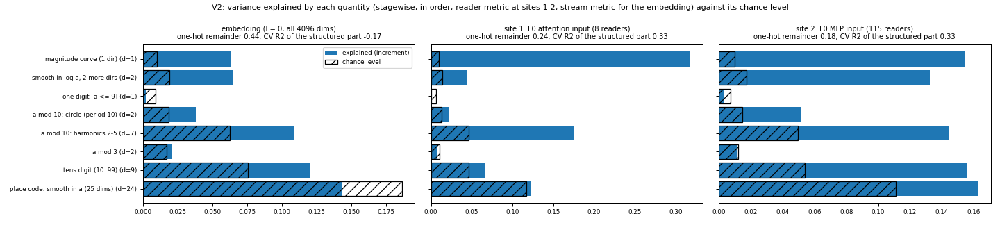

**Order check.** Fitting the place code right after the smooth magnitude (`place_first` in
`v2_results.json`) removes the excess of the tens digit (site 2: +0.102 -> -0.025) and of the
mod-10 circle j = 1 (+0.037 -> -0.007), while the place code's excess rises (+0.052 -> +0.199).
The excess of the smooth magnitude dims and of the mod-10 harmonics j = 2..5 does not depend on
the order (+0.095 -> +0.103 at site 2, +0.130 -> +0.115 at site 1). So three things are
identified: a smooth magnitude (3 directions at site 2), the units digit, and a decade-scale
structure whose form (tens-digit classes, a period-10 circle, or a finer place code) these
hypotheses cannot tell apart, because the spline place code (knots every ~4 values) also spans
period-10 oscillations.

**The units digit is a simplex, not a circle** (`figures/v2_units_geometry.png`). After removing
the smooth dims, the variance per period-10 harmonic is roughly flat at the embedding and at
site 2 (site 2: 0.073, 0.070, 0.045, 0.057, 0.031 for j = 1..5; j = 5 has one dimension, the
others two), and the singular values of the ten class means decay slowly (site 2: 1.00, 0.87,
0.81, 0.77, 0.76, ...): each units digit has its own direction, as in a one-hot code over the
ten digits. A circle would put the variance in j = 1 alone. 0 and 5 sit apart from the other
digits at all three places, the round-number structure of V1. At site 1 the 8 readers see
mostly j = 2 and j = 4 (0.110 and 0.129; periods 5 and 2.5), i.e. a mod 5, and the class-mean
spectrum is low-dimensional (1.00, 0.32, 0.26, 0.12).
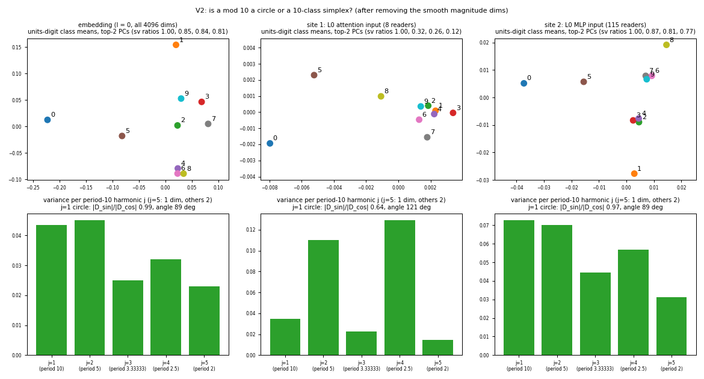

**Smooth magnitude** (`figures/v2_smooth_and_residual.png`, top). At site 1 one saturating curve
(steep for a <= 30, flat above) carries 32% of the readers' variance. At site 2 and in the
embedding three smooth dims are present: a hump peaking near a = 20, a curve with a minimum near
a = 50, and a third with a sharp feature at a <= 10.
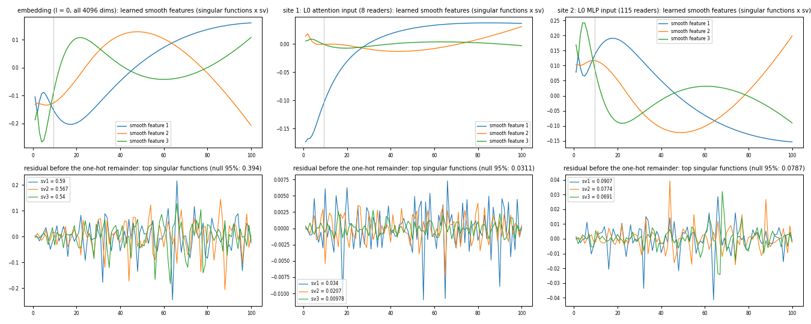

**What does not survive the shared-direction model.** a mod 3 is at chance at every site
(divisibility by 3 was one reader in V1); the one-digit flag adds nothing after the smooth dims.

**What is left.** The one-hot remainder (token-specific directions, one per value of a) carries
44% of the embedding's variance, 24% of the reads at site 1 and 18% at site 2. Before it, the
residual's top singular value is above the permutation null at site 2 (0.091 vs 0.079) and in the
embedding (0.59 vs 0.39), at the null at site 1 (0.034 vs 0.031); the top residual singular
functions (bottom of the figure above) are spiky, without a visible pattern in a.

**Per-reader fit at site 2** (`figures/v2_readers.png`, `figures/v2_reader_r2.png`). The
structured quantities predict the comb, magnitude and window readers closely (gate.c19, gate.c7,
gate.c44, up.c52, up.c145: R^2 0.98-0.99; up.c101: 0.87) but not the single-value detectors
(up.c415, a = 42: 0.35). In-sample R^2 must be read against chance: the full structured model has
48 dims (in-sample chance 0.48 per reader), median 0.82; a compact model (magnitude 3 + a mod 10
9 + tens digit 9 = 21 dims, chance 0.21) has median 0.43. Cross-validated over held-out values
of a, the median reader R^2 is 0.14 (full) and -0.01 (compact); 38% of the readers have a
held-out R^2 above 0.5 with the full model, 19% with the compact one. Many site-2 readers detect
one value or a narrow window of a, which no quantity shared across values can predict.
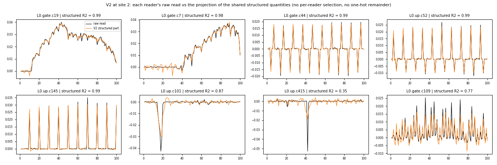

**The split of the full-rank token code at L0 (token a).** The embedding of a is full rank in the
stream. In the shared-direction view it splits into: a smooth magnitude (3 directions), a
units-digit simplex (9 directions, 0 and 5 apart), a decade-scale structure, and token-specific
directions (the largest part). Site 1's 8 attention readers span 8 dimensions and see mostly the
saturating magnitude curve and a mod 5; site 2's 115 MLP readers see all of it, including the
token-specific directions that the single-value detectors read.

**V1 vs V2.** V1 let each reader pick its own items (single tokens, intervals, residue classes)
and reached 98.6% at site 2; V2 forces every reader to read the same quantity directions, which
is what makes a quantity a property of the stream rather than of a reader, and measures
generalisation across values of a. The two agree on what is there (magnitude, units digit and
round numbers, decade-scale structure, many single-value detectors) and V2 removes divisibility
by 3 as a stream quantity.

**Limits of V2.** Stagewise attribution depends on the order where feature spaces overlap (the
order check above). In 4096 dimensions with 100 values of a, directions estimated from 90 values
are mostly noise, so the embedding's cross-validated R^2 is negative and not informative; a
ridge penalty or a lower-dimensional reference would be needed there.

## V2 across layers (token a)
Code: `v2_layers.py` (sweep), `v2_sets.py` (hypothesis sets), `v2_feature_test.py` (permutation
test of one candidate feature on the residual), `v2_layers_features.py` (figure). Numbers:
`layers_<set>.json`, `feature_test_*.json`.

**Sites.** Every read point of the network at token position t = 1: the attention input of block
b (stream position l = 2b, readers q, k, v) and its MLP input (l = 2b + 1, readers gate, up), for
b = 0..31, restricted to the readers active at t = 1. 63 sites (L31's MLP has no active reader at
t = 1); 3 to 115 readers per site. Each site is fit as in V2 (shared directions in the reader
span, stagewise, reader metric, chance level, 10-fold cross-validation over values of a).

**Loop.**
1. The L0 set (`L0_set`) at every site (`figures/v2_layers_base_overview.png`). The residual
   before the one-hot remainder stays above its permutation null at most sites (top singular
   value / null 1.2-1.6), and its power peaks at frequencies k = 25, 14-15, 12, 17, 22 over a
   (k: number of periods in a = 1..100).
2. Residues a mod 4, 6, 7, 8, 9 (`residues_set`), the moduli whose DFT signatures fall at those
   k: rejected. Below chance at every site (mod 6-9: -0.005 to -0.051), mod 4 at most +0.023
   (L20.attn, L24.attn, L25.attn); held-out R^2 decreases.
3. The residual's top singular function, read directly (`figures/v2_layers_new_features.png`,
   top two panels):
   - at L14-L31 it is the same function at most sites (median |correlation| with L26.mlp's 0.86):
     positive on all 12 multiples of 8, negative on the even numbers = 2 mod 4, near 0 on odd
     numbers: the **2-adic valuation** of a (the exponent of the largest power of 2 dividing a);
   - at L1-L13 its largest values include the **repdigits** 22, 33, 44, 66 (a = 11 x digit), with
     other values (23, 56) as large.
   Token frequency (proxy: log token id, i.e. BPE merge rank) does not match it (|correlation|
   <= 0.15).
4. Permutation test of each feature against the residual of the L0 set (`v2_feature_test.py`):
   the share of the residual's variance along the feature's part outside the L0 set's span, vs
   500 permutations of the feature over a (`figures/v2_layers_new_features.png`, bottom).
   - 2-adic valuation, one direction carrying min(v2(a), 4): p < 0.01 at 41 of 63 sites; share
     8-32% at L16-L31 (null about 0.7%), 3-8% at L0.mlp-L5 (sites where it was not found, so not
     selection-biased).
   - Repdigit indicator: p < 0.01 at L0.mlp-L4.mlp (2.5-9.5%) and L12.mlp-L18.attn (3-10.5%),
     not after L18.
5. Final set (`final_set`) = L0 set + both features as one direction each, fit last before the
   remainder (`figures/v2_layers_final_overview.png`).

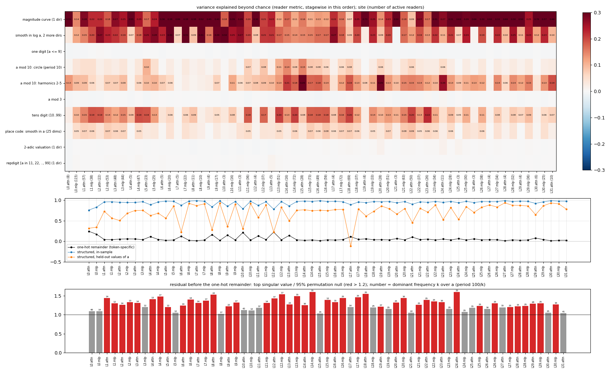
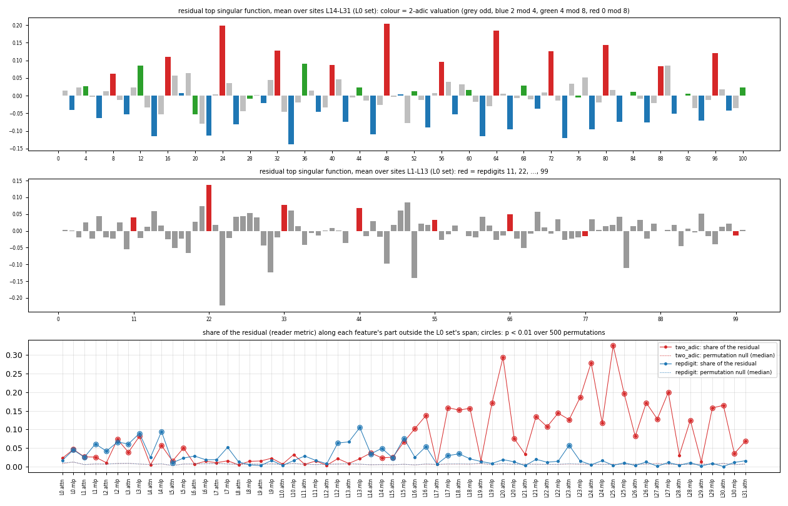

**Results (final set).**

| | L0 (2 sites) | L1-L13 (26 sites) | L14-L31 (35 sites) |
|---|---|---|---|
| one-hot remainder (token-specific), median share of reads | 0.207 | 0.045 | 0.036 |
| structured part, in-sample R^2 (median) | 0.79 | 0.96 | 0.96 |
| structured part, held-out values of a (median) | 0.33 | 0.68 | 0.79 |
| residual top singular value / null (median) | 1.09 | 1.31 | 1.25 |

| quantity (dims) | median increment | median excess over chance | sites with excess > 0.02 (of 63) |
|---|---|---|---|
| magnitude curve (1) | 0.281 | +0.271 | 63 |
| 2 more smooth dims in log a (2) | 0.197 | +0.180 | 60 |
| one digit [a <= 9] (1) | 0.002 | -0.003 | 0 |
| a mod 10, circle j = 1 (2) | 0.036 | +0.028 | 45 |
| a mod 10, harmonics j = 2..5 (7) | 0.134 | +0.102 | 57 |
| a mod 3 (2) | 0.004 | -0.002 | 0 |
| tens digit (9) | 0.137 | +0.102 | 57 |
| place code, smooth in a (24) | 0.093 | +0.044 | 48 |
| 2-adic valuation (1) | 0.001 | +0.000 | 0 (max 0.014, L20.attn) |
| repdigit (1) | 0.001 | +0.000 | 0 (max 0.013, L13.attn) |

- **After L0 the token-specific part nearly disappears from what the readers read**: the one-hot
  remainder drops from 0.18-0.24 at L0 to a median 0.04, and the structured quantities predict
  held-out values of a (median 0.68-0.79 from L1 on, vs 0.33 at L0). The readers after L0 read
  the number through shared quantities, not through token-specific directions.
- **The same quantities run through the whole network at token a**: the magnitude (1 + 2 smooth
  directions), the units digit and the tens digit / decade-scale structure have an excess over
  chance at nearly every site. a mod 3 and the one-digit flag never do.
- **The units digit becomes strongest in the middle** (harmonics j = 2..5 excess up to 0.30 at
  L15.attn and L20.attn; the period-10 circle j = 1 excess 0.06-0.15 at L13-L18).
- **Two new quantities, small but significant**: the 2-adic valuation (mainly L16-L31) and
  repdigits (L0-L4 and L12-L18). Each is about 1% of the reads at most (largest increments
  0.014 and 0.013); they matter as structure in the residual, not as variance.
- **Low held-out R^2 at a few attention sites with 3-11 readers** (L6, L8, L9, L10, L12, L17
  attention inputs: -0.12 to 0.36). These are small reader spans where per-site estimates are
  noisy; their one-hot remainder is also higher (0.11-0.22).
- **Unexplained**: after the final set the residual is still above its permutation null at most
  sites (median ratio 1.25-1.31), with dominant frequencies k = 25 (period 4) at L15-L29 and
  k = 12-17 at L1-L14. The next iteration of the loop starts there.
