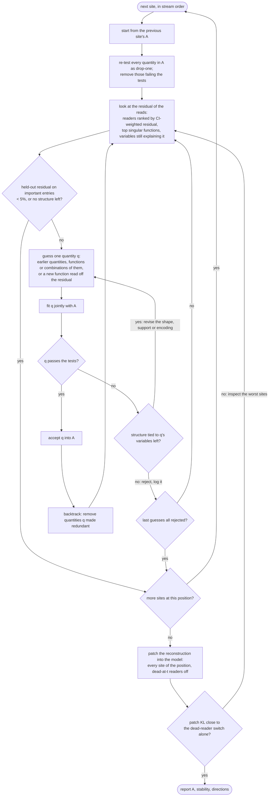

# Quantities read at every residual-stream site (addsub decomposition, run p-ba5a0c05)

Which functions of the prompt ("quantities") the readers of each residual-stream read site respond
to, at each token position, found by fitting hypotheses as shared directions in the readers' span
and validated by a closed patching test.

**Replication** (data under `~/out/pod-backup/p-ba5a0c05/analysis/`):
1. `../virtual_weights/compute.py` (component vectors `virtual_weights/{index,vectors}.npz`),
   `../virtual_weights/collect_alive_only.py` (alive-only residual stream
   `virtual_weights/alive_only/resid.npy`), `../virtual_weights/build_heatmap.py` (also writes the
   per-position CI maxima `virtual_weights/ci_positions.npz` and the per-component grids the
   explorer applet reuses); sbatch files alongside.
2. `sbatch qagent/qprep.sbatch <t>` for t = 1..4 (per-site data `quantities/qagent/site_data_t<t>.npz`).
3. `sbatch qagent/qloop.sbatch <t>` (fits), `sbatch --array=0-9 qagent/qloop.sbatch <t>` (nested
   selection, one held-out fold per task), then `sbatch qagent/qloop.sbatch <t> --combine`.
4. `sbatch qagent/qpatch.sbatch <t>` (closed patching test, GPU), `sbatch qagent/qdirs.sbatch <t>`
   (stream directions), `python qagent/qmap.py` (figures), `sbatch qagent/qapplet.sbatch`
   (explorer applet).
`qagent/AGENT.md` holds the protocol for an agent refining the fits by hand (`qinspect.py`).

Data: `~/out/pod-backup/p-ba5a0c05/analysis/quantities/qagent/` (`qloop_t<t>.json`: accepted lists,
scores, decision logs; `recon_t<t>.npz`; `patch_t<t>_alive.json`; `dirs_t<t>.{json,npz}`). Run
p-ba5a0c05, alive-only model (all 11604 alive components on, dead components and the weight delta
off).

**Notation.** Prompt "a op b =" with operands a, b (integers 1..100) and op in {+, -}; derived
integers s = a + b, d = a - b, r = the result (s or d by op); u_a, u_b = units digits of a and b.
Token position t: 1 = a, 2 = op, 3 = b, 4 = "=". Domain of t: the distinct inputs at t (t = 1: a,
100 rows; t = 2: (op, a), 200; t = 3, 4: (op, a, b), 20000). Site: the readers (q, k, v at an
attention input; gate, up at an MLP input) of block c = 0..31 that are causally important
somewhere at t (CI > 0.01 on some prompt), written "Lc.attn" / "Lc.mlp". A reader's raw read is
the stream x (4096-vector) dotted with its gain-folded unit read direction; its inner activation
is the raw read divided by rho, the stream's RMS. A quantity is a function of (op, a, b) with a
stated encoding (one direction for a scalar, cos and sin for a circle "circle period P of x" =
angle 2 pi x / P, one indicator per class for "classes", one Gaussian bump per centre for a place
code); "[op = -] x q" is q on subtraction prompts and 0 on addition prompts. Drop-one excess of q
at a site: the share of the readers' read variance that q explains beyond all other accepted
quantities, minus the share expected by chance for its number of dimensions.

## Procedure

The loop at one site (`qagent/AGENT.md`; `qloop.py` runs it automatically with the fixed
candidate pool in place of the agent's guesses). A is the site's accepted list of quantities;
"the tests" are (i)-(iii) below; important entries are (reader, domain row) pairs with CI > 0.01;
a reader's CI-weighted residual is the sum over the domain of CI x residual^2; dead-at-t readers
are alive elsewhere but have CI <= 0.01 at t on every prompt.

`qloop.py`: an automatic loop over a fixed candidate pool (`qfeat.pool`). The raw reads of all
readers of a site are fit jointly (ridge) from the features of the accepted quantities. A
quantity belongs in a site's list when (i) it adds at least 0.2% of the reads' variance, (ii) this
exceeds chance, and (iii) the held-out R^2 of the list is higher with it than without it. At each
site in stream order: start from the previous site's list, remove what fails (i)-(iii) as a
drop-one test, add the best candidate by excess per dimension that passes (i)-(iii), and stop when
none passes or the held-out residual on important entries (CI > 0.01) is below 5% of the read
variance there. Held-out folds: values of a (t = 1, 2), (a, b) pairs with both ops (t = 3, 4), 10
folds; every held-out fit is centred on its training rows. rho is fit as a scalar from the same
features. Nested selection: the whole loop is rerun 10 times, each time without one fold, and each
fold is predicted from the list selected without it (nested held-out R^2); the stability of an
accepted quantity is the share of these 10 runs that select it at that site.

| t | sites fit | median dims | median R^2 in-sample / held-out (refit) / nested | median rho R^2 in-sample / nested |
|---|---|---|---|---|
| 1 (a) | 63 | 33 | 0.964 / 0.914 / 0.907 | 0.92 / 0.78 |
| 2 (op) | 64 | 39 | 0.971 / 0.956 / 0.951 | 0.90 / 0.77 |
| 3 (b) | 64 | 71.5 | 0.926 / 0.925 / 0.930 | 0.76 / 0.79 |
| 4 (=) | 63 (L0.attn reads the constant "=" embedding) | 67 | 0.947 / 0.947 / 0.947 | 0.72 / 0.71 |

## Closed patching test

`qpatch.py`, 2000 random prompts, alive-only model. At position t every site's readers get
reconstructed raw reads divided by a reconstructed rho, both functions of (op, a, b) through the
accepted quantities only; the readers dead at t (alive elsewhere, CI <= 0.01 at t on every prompt)
are switched off at t. With every site of the position patched, the stream at t reaches the rest
of the network only through the reconstruction. KL: at the last position, against the unpatched
alive-only model (answer accuracy unpatched 0.617). Exact: the stored raw reads and rho at every
site (wiring check). Nested held-out: quantities selected and fit without the prompt's fold. Mean:
every site's reads and rho at their domain means.

| t | dead-at-t readers off | KL of that alone | KL, exact | KL, reconstruction | KL, nested held-out | KL, mean | accuracy (reconstruction / nested held-out) |
|---|---|---|---|---|---|---|---|
| 1 (a) | 4212 | 0.0001 | 0.00004 | 0.0019 | 0.0051 | 1.12 | 0.614 / 0.612 |
| 2 (op) | 3928 | 0.00004 | 0.00003 | 0.0001 | 0.0003 | 0.69 | 0.6175 / 0.6165 |
| 3 (b) | 2355 | 0.00004 | 0.00001 | 0.0105 | 0.0105 | 1.14 | 0.6205 / 0.621 |
| 4 (=) | 3873 | 0.0001 | 0.00008 | 0.098 | 0.103 | 1.25 | 0.5915 / 0.591 |

Left: one site patched at a time (grey: mean patch, blue: reconstruction, orange: nested held-out
reconstruction); every run has the dead-at-t readers off, so the floor of each row is the KL of
that switch alone. Right: all sites of the position patched together. Sites whose mean patch costs
KL > 0.01: 6 at t = 1, 2 at t = 2, 6 at t = 3, 18 at t = 4; the reconstruction removes a median
99%, 99.8%, 98% and 91% of their mean-patch KL. At t = 4 these are the MLP inputs of L14-L31; the
worst is L20.mlp (0.050 against 0.078), then L28.mlp-L30.mlp (about 15% left).

## Where each quantity is read

Maps (`qmap.py`): rows are quantities, columns L0.attn, L0.mlp, ..., L31.mlp; colour: drop-one
excess, log scale; empty: not accepted; white dot: dependence > 0.9 (the quantity's features over
the domain are reproduced to R^2 > 0.9 by the other accepted quantities, so the readers cannot tell
it from that combination and its directions are not separable from theirs); red cross: stability
< 0.5.

- t = 1 (a). A place code of a (bumps every 5, width 2.5) is accepted at 62 of 63 sites, with the
  largest excess at every site (median 0.35). The units digit enters as the 10 units digit classes
  at L0-L7 and L16-L31, and at L8-L15 as a units digit circle (period 10) with parity and a mod 5
  classes. The 2-adic valuation (31 sites), a mod 3 (23) and repdigits (12) are accepted with
  excess below 0.04; a smooth magnitude curve in log a (28 sites) and log a (15) mostly with
  dependence > 0.9.

- t = 2 (op). L0-L4 read op alone (excess 0.96-1.0). From L4.mlp a's magnitude on subtraction
  prompts ([op = -] x a smooth curve in log a) carries most of the variance up to L7 and again at
  L12-L15 (up to 0.95); op-gated tens and units digit classes of a from L6-L7 (the tens classes up
  to 0.93 at L10); circles of period 100 and 50 of a and log a at L1-L10; a mod 5 classes from L3;
  a place code of a (on both ops) from L10.

- t = 3 (b). A place code of b at 63 of 64 sites (up to 0.30). The units digit of b enters as the
  10 classes at L0-L9 and L20-L31, and at L11-L19 as b mod 5 classes, a units digit circle and
  parity, as for a at t = 1. op is read at L0.mlp-L6 (excess 0.05-0.2). Quantities of a from L1
  (circles of period 100 and 50, log a). Combinations of a and b from L2: a circle of period 100 of
  d = a - b (to L31), a smooth magnitude of r (L2-L9), the sign of r; op-gated magnitudes of a and
  b from L6 (b's up to 0.24 at L12); a place code of r (bumps every 10, width 5) from L9 (up to
  0.14); op-gated units digit classes of b from L21 and tens digit classes of a at L24-L30.

- t = 4 (=). L0.mlp-L8: op (excess about 1 to L6). The operands arrive at L5 (log a, log b, a = 100,
  sign of r); a smooth magnitude of r and a circle of period 100 of r from L7; a's magnitude on
  subtraction prompts dominates L9-L15 (up to 1.0); a circle of period 100 of d from L10;
  quantities of b's units digit (b mod 5, circles of period 20, 50 and 10, parity) at L15-L19;
  from L16 the tens digit classes of r, from L19 the units digit classes of r (up to 0.19) and
  place codes of a and b, from L20 a place code of r (up to 0.31); units digit classes of d from
  L24 and of s at L24-L28. The carry [u_a + u_b >= 10] is no longer accepted anywhere (its
  increments are below 0.2%).

## Stream directions

`qdirs.py`, `dirs_t<t>.npz`. At a site the readers see the stream only through the span of their
read directions, so each accepted quantity's directions are taken from the joint fit inside that
span: the stream moves by d_qj (a 4096-vector) per unit of the quantity's feature j, and reader r
responds through the dot product of d_qj with its read direction. Saved per site and quantity: the
d_qj, an orthonormal basis of the directions along which the quantity's term varies (ranked by
that variance), and every reader's response and share of read variance. Dependence > 0.9 (see the
maps) holds for 17%, 12%, 5% and 6% of the (site, quantity) pairs at t = 1-4.

## Explorer applet

`qapplet.py` + `qapplet.html` -> `~/out/pod-backup/p-ba5a0c05/analysis/quantities/applet/index.html`
(local, open in a browser; 390 MB of per-site data loaded on demand). The quantity map of a
position (click a cell to show that quantity at that site); a rotatable 3D scatter of the stream
divided by rho at the site, one point per domain row, on three axes chosen as (quantity, dimension
ranked by variance) and orthonormalised in order, with floor shadows; arrows for the readers with
at least 10% of their read variance from an axis quantity (their read directions projected on the
axes, top 12); colour by a quantity's value, a reader's inner activation or its CI; (a, b) grids of
the displayed readers' inner activations at t.

## Effect of the code-review fixes

Compared with the previous run (permutation tests, no rho fit, held-out fits centred on all rows,
no nested selection):
- Retention now requires the same 0.2% minimum as acceptance, and permutation tests are gone
  (with 20000 domain rows they passed for any increment). The lists shrank from 1430 to 600
  (site, quantity) pairs at t = 3 and from 1175 to 499 at t = 4 (median drop-one excess of the
  removed pairs 0.0006 and 0.0009, against 0.006 and 0.005 for the kept ones); 277 -> 269 at t = 1
  and 406 -> 273 at t = 2. The all-sites reconstruction KL rose from 0.0075 to 0.0105 at t = 3 and
  from 0.080 to 0.098 at t = 4; t = 1, 2 are unchanged within 0.0006.
- Nested selection (fix 3) did not make quantities harder to find: the nested held-out R^2 is
  within 0.01 of the refit-only one at the median site (gaps 0.008, 0.004, -0.0004, 0.0003 at
  t = 1-4; the largest, 0.20, at t = 1 L12.attn), and the nested held-out patch is within 0.005 KL
  of the in-sample one. It does not by itself remove quantities (the reported lists are selected on
  all rows); it flags the ones a held-out fold changes: 21 of 269 pairs at t = 1, 33 of 273 at
  t = 2, 25 of 600 at t = 3, 22 of 499 at t = 4 have stability < 0.5. Most are alternative
  descriptions of the same structure, which the nested runs swap: a mod 5 classes + parity against
  the units digit classes (t = 1 L9-L10); a's magnitude against its tens digit classes on
  subtraction prompts (t = 2 L13-L15); circles of a against a's tens and units digit classes
  (t = 3 L28-L29); a place code of r against a smooth magnitude of r (t = 4 L11-L12).
- Closing the rho path and the exact patch: the all-sites exact patch reproduces the dead-reader
  switch alone (KL 1e-5 to 8e-5), so the wiring is right and the remaining patch KL is the
  reconstruction's.

**Limits.** The candidate pool is fixed (`qfeat.pool`) and includes quantities found on these
sites in earlier passes, so their acceptance is not an independent discovery; quantities outside
the pool cannot be found. Where two descriptions overlap, which one the full run accepts depends on
the greedy order (stability marks where it is fragile). The important-residual share measures
deviations from each reader's domain mean, i.e. what a mean patch would remove. rho is reconstructed
less well than the reads (nested R^2 0.71-0.79 at the median site).
