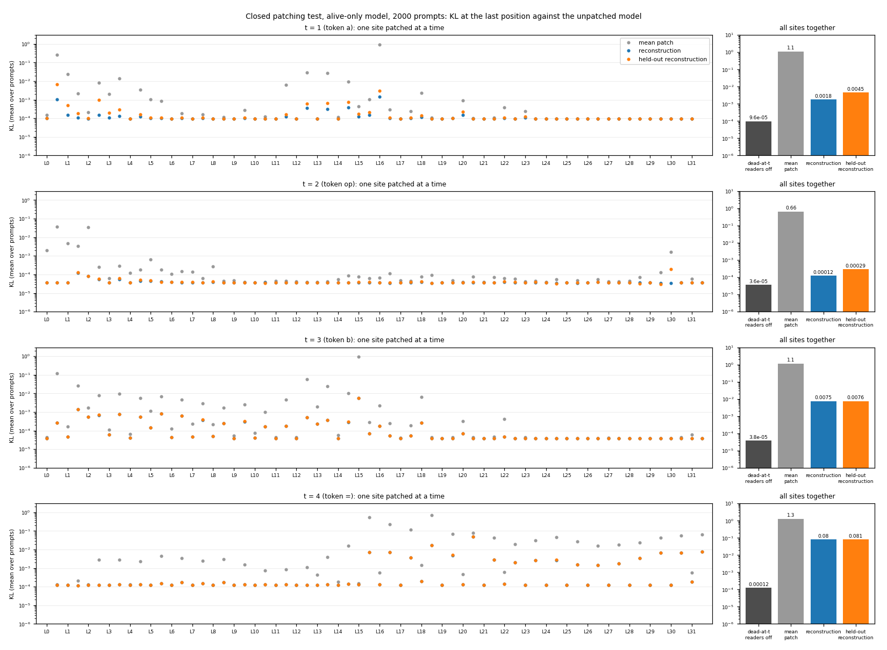
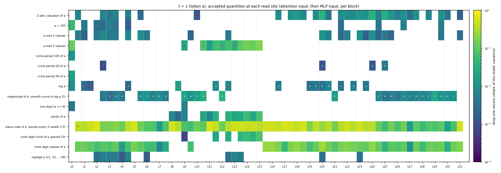
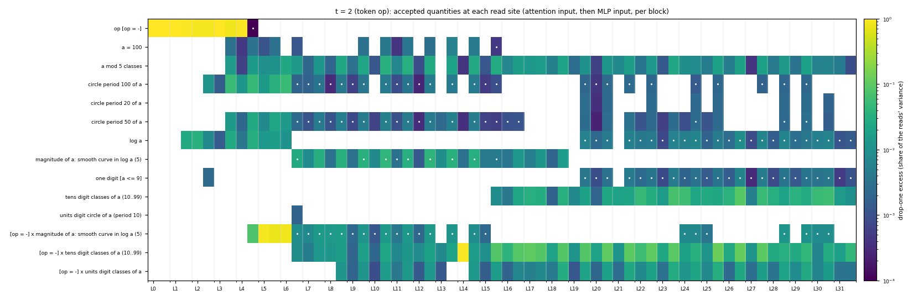
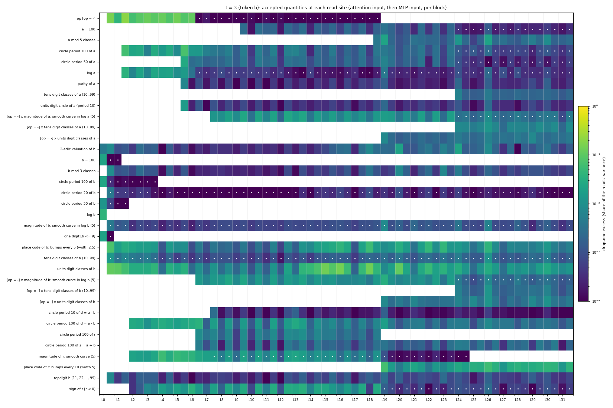
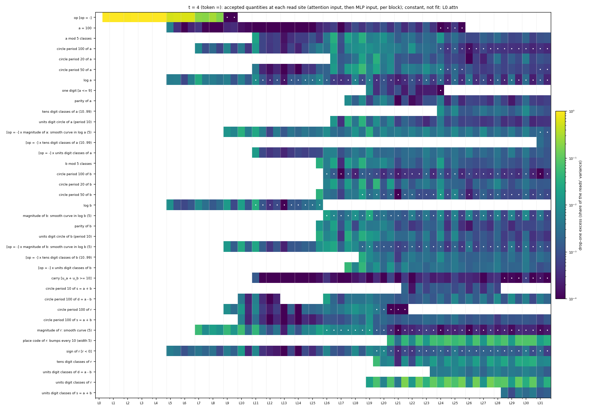

# Quantities read at every residual-stream site (addsub decomposition, run p-ba5a0c05)

Which functions of the prompt ("quantities") the readers of each residual-stream read site respond
to, at each token position, found by fitting hypotheses as shared directions in the readers' span
and validated by a closed patching test.

**Replication** (data under `~/out/pod-backup/p-ba5a0c05/analysis/`):
1. `../virtual_weights/compute.py` (component vectors `virtual_weights/{index,vectors}.npz`),
   `../virtual_weights/collect_alive_only.py` (alive-only residual stream
   `virtual_weights/alive_only/resid.npy`), `../virtual_weights/build_heatmap.py` (also writes the
   per-position CI maxima `virtual_weights/ci_positions.npz`); sbatch files alongside.
2. `sbatch qagent/qprep.sbatch <t>` for t = 1..4 (per-site data `quantities/qagent/site_data_t<t>.npz`).
3. `python qagent/qloop.py <t>` (fits, CPU), `python qagent/qpatch.py <t>` (closed patching test,
   GPU), `sbatch qagent/qdirs.sbatch <t>` (stream directions), `python qagent/qmap.py` (figures).
`qagent/AGENT.md` holds the protocol for an agent refining the fits by hand (`qinspect.py`).

Code: `qagent/` (instructions `qagent/AGENT.md`). Data:
`~/out/pod-backup/p-ba5a0c05/analysis/quantities/qagent/` (`qloop_t<t>.json`: accepted lists and
decision logs; `recon_t<t>.npz`; `patch_t<t>_alive.json`; `dirs_t<t>.{json,npz}`). Run p-ba5a0c05,
alive-only model (all 11604 alive components on, dead components and the weight delta off).

**Notation.** Prompt "a op b =" with operands a, b (integers 1..100) and op in {+, -}; derived
integers s = a + b, d = a - b, r = the result (s or d by op); u_a, u_b = units digits of a and b.
Token position t: 1 = a, 2 = op, 3 = b, 4 = "=". Site: the readers (q, k, v at an attention input;
gate, up at an MLP input) of block c = 0..31 that are causally important somewhere at t (CI > 0.01
on some prompt), written "Lc.attn" / "Lc.mlp". A quantity is a function of (op, a, b) with a stated
encoding (one direction for a scalar, cos and sin for a circle "circle period P of x" = angle
2 pi x / P, one indicator per class for "classes", one bump per centre for a place code);
"[op = -] x q" is q on subtraction prompts and 0 on addition prompts. Drop-one excess of q at a
site: the share of the readers' read variance that q explains beyond all other accepted
quantities, minus the share expected by chance for its number of dimensions.

**Procedure** (`qloop.py`, automatic loop over a fixed candidate pool, `qfeat.pool`). At each
site in stream order: start from the previous site's accepted list and drop what is not needed;
add the candidate with the largest excess per dimension while its increment is >= 0.2% of the
reads' variance and its permutation p < 0.01; stop when the held-out important residual (reads
on prompts where the reader's CI > 0.01) is below 5%. Domain of t: t = 1: a (100 rows); t = 2:
(op, a) (200); t = 3, 4: (op, a, b) (20000). Held-out folds: values of a (t = 1, 2), (a, b)
pairs (t = 3, 4).

| t | sites fit | median dims of the accepted list | median held-out R^2 of the reads |
|---|---|---|---|
| 1 (a) | 63 | 30 | 0.91 |
| 2 (op) | 64 | 36 | 0.95 |
| 3 (b) | 64 | 82 | 0.95 |
| 4 (=) | 63 (L0.attn is the "=" embedding, constant) | 61 | 0.95 |

**Closed patching test** (`qpatch.py`; 2000 random prompts; alive-only model). At position t every
site's readers get the reconstruction from the accepted quantities, a function of the prompt's
(op, a, b) only; the readers dead at t (alive elsewhere, CI <= 0.01 at t on every prompt) are
switched off at t, so the stream at t reaches the rest of the network only through the
reconstruction. KL: at the last position, against the unpatched alive-only model (accuracy
unpatched 0.617). Mean patch: every site's readers set to their mean over the domain.

| t | dead-at-t readers off | KL of that alone | KL, reconstruction | KL, held-out reconstruction | KL, mean patch | accuracy (reconstruction / held-out) |
|---|---|---|---|---|---|---|
| 1 (a) | 4212 | 0.0001 | 0.0018 | 0.0045 | 1.11 | 0.613 / 0.6145 |
| 2 (op) | 3928 | 0.00004 | 0.0001 | 0.0003 | 0.66 | 0.6175 / 0.6175 |
| 3 (b) | 2355 | 0.00004 | 0.0075 | 0.0076 | 1.12 | 0.6255 / 0.626 |
| 4 (=) | 3873 | 0.0001 | 0.080 | 0.081 | 1.27 | 0.599 / 0.598 |

Left: one site patched at a time (grey: mean patch, blue: reconstruction, orange: held-out
reconstruction); every run has the dead-at-t readers off, so the floor of each row is the KL of
that switch alone (dark bar on the right). Right: all sites of the position patched together. At
t = 4 the MLP inputs of L15-L31 are the sites that matter (mean patch KL 0.016-0.70); the
reconstruction leaves 1-15% of their mean-patch KL (L18.mlp 0.017 against 0.70), except L20.mlp
(0.049 against 0.078, 62%).

**Where each quantity is read.** Maps (rows: quantities; columns: L0.attn, L0.mlp, ..., L31.mlp;
colour: drop-one excess, log scale; empty: not accepted; white dot: dependence > 0.9, i.e. the
quantity's features over the domain are reproduced to R^2 > 0.9 by the other accepted
quantities, so the readers cannot tell it from that combination and its directions are not
separable from theirs; `qmap.py`, `qdirs.py`).

- t = 1 (a). A place code of a (bumps every 5, width 2.5) is accepted at 62 of 63 sites and
  carries the largest excess at every site from L4 on (0.2-0.6 of the read variance). The units
  digit enters as the 10 units digit classes at L0-L7 and L16-L31; at L9-L15 it enters instead as
  a units digit circle (period 10) with parity and a mod 5 classes. 2-adic valuation, a mod 3 and
  repdigit are accepted at 33, 23 and 15 sites with excess below 0.04. log a is accepted at 48
  sites, but at 47 of them its dependence is > 0.9 (the place code reproduces it).

- t = 2 (op). At L0-L4 the reads carry op alone (excess 0.9-1.0). From L4.mlp to L6.attn the
  largest term is a's magnitude on subtraction prompts ([op = -] x a smooth curve in log a,
  excess up to 0.87). From L6 on: op-gated tens and units digit classes of a, a mod 5 classes,
  circles of period 50 and 100 of a (L3-L30, mostly dependent on the others), and the tens digit
  classes of a on both ops from L15.

- t = 3 (b). Quantities of b from L0.mlp: units digit classes and a place code of b (the largest
  excess up to L18, up to 0.15), tens digit classes, b mod 3, 2-adic valuation, repdigit. op is
  read at L0.mlp-L6 (excess 0.05-0.2), then only with dependence > 0.9. Quantities of a from L1-L5
  (circles of period 100 and 50, log a, parity, units digit circle). Combinations of a and b from
  L2: a circle of period 100 of d = a - b, the sign of r, a smooth magnitude of r (L2-L24); a
  circle of period 100 of r (L6-L18) and of s = a + b (L6-L31). From L19 on: a place code of r
  (bumps every 10, width 5; excess up to 0.065) and op-gated units digit classes of a and b; from
  L24 op-gated tens digit classes of a and b.
  Several quantities of b accepted at L0-L1 stay in the list at nearly every later site with
  drop-one excess around 1e-4 to 1e-3 (circle period 20 of b, tens digit classes, smooth magnitude,
  all with dependence > 0.9): the loop keeps an inherited quantity while its drop-one permutation
  p < 0.01, and with 20000 domain rows that holds for very small increments (there is no minimum
  increment for keeping a quantity, only for adding one).

- t = 4 (=). L0.mlp-L4: op only (excess about 1; L0.attn reads the constant "=" embedding).
  Operands arrive from L5: log a, log b, a = 100 and the sign of r at L5; a smooth magnitude of r
  and a circle of period 100 of a from L7; op-gated magnitudes of a and b from L9; circles of
  period 100 of s, d and r at L9-L11; carry [u_a + u_b >= 10] from L11 (excess <= 0.0014); a mod
  5 classes and op-gated units digit classes of a from L11. Units digit quantities of b (circle,
  parity, b mod 5, circles of period 20 and 50) from L15-L16, of a from L16-L17. From L19: the
  units digit classes of r (excess up to 0.16, the largest from L19 on), the tens digit classes of
  r, from L20 a place code of r (bumps every 10, width 5; up to 0.084); units digit classes of d
  from L23 and of s from L28. This position leaves the largest patching KL (0.080).

**Stream directions** (`qdirs.py`, `dirs_t<t>.npz`). At a site the readers see the stream only
through the span of their read directions, so each accepted quantity's directions are taken from
the joint fit inside that span: the stream moves by d_qj (a 4096-vector) per unit of the
quantity's feature j, and reader r responds through the dot product of d_qj with its read
direction. Saved per site and quantity: the d_qj, an orthonormal basis of their span, and every
reader's response. Where a quantity's features are reproduced by the other accepted quantities'
features (dependence > 0.9: 22% of the (site, quantity) pairs at t = 1, 32% at t = 2, 29% at
t = 3, 23% at t = 4; mostly smooth magnitude curves, log a and circles that place codes and class
partitions also span), the readers cannot tell the quantity from that combination, and only the
directions of the combination are determined.

**Known issues** (code review of `qagent/`, not yet fixed or rerun):
- The patched activations divide the reconstructed raw reads by the RMS rho of the live patched
  stream, which still depends on the true stream at t (one scalar per site); the test is closed
  for the reads but not for rho.
- Held-out predictions use the mean of the reads over the whole domain, held-out rows included
  (slightly optimistic held-out R^2, mostly at t = 1 with 100 rows).
- Quantities are selected on all rows; the held-out R^2 refits the selected list only.
- Permutation p-values permute single rows, not the units held out together (values of a,
  (a, b) pairs), and do not correct for the search over the candidate pool.
- The patch test has no all-sites exact patch (exact reads at every site of the position).

**Limits.** The candidate pool is fixed (`qfeat.pool`) and includes quantities found on these
sites in earlier passes, so their acceptance is not an independent discovery; quantities outside
the pool cannot be found. Where two descriptions overlap (the units digit as 10 classes or as a
circle + parity + mod 5 classes; log a or the place code), which one is accepted depends on the
greedy order, and the dots mark where the readers cannot distinguish them.
