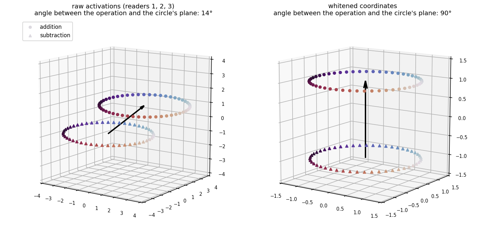
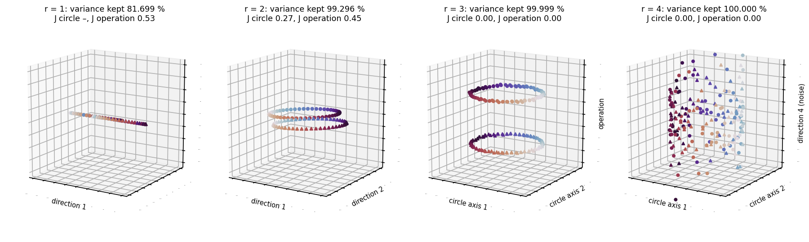
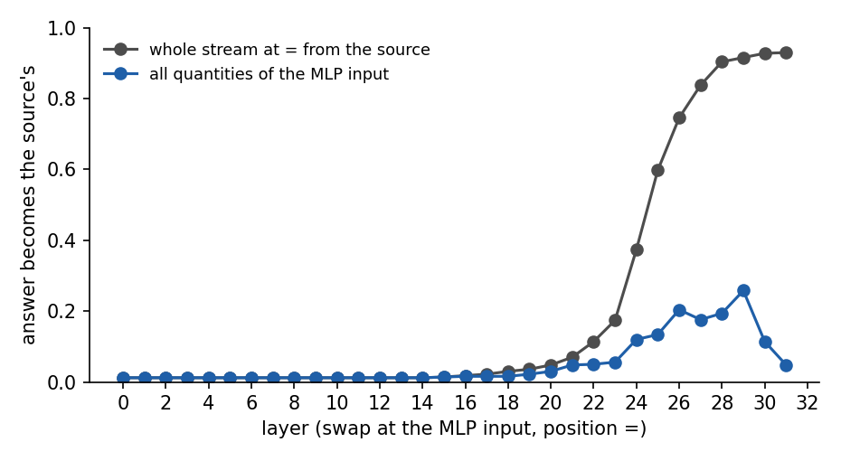
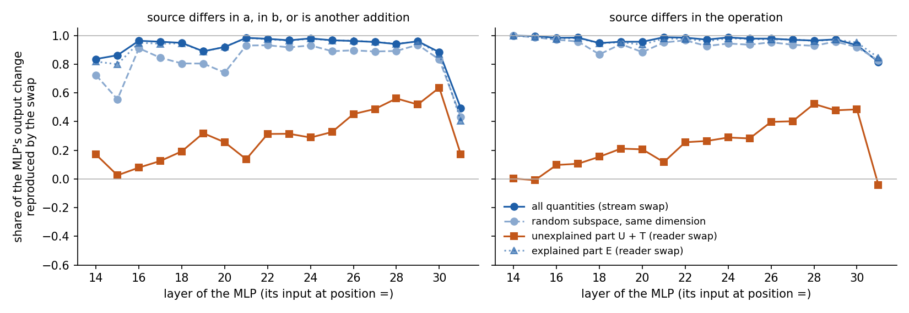
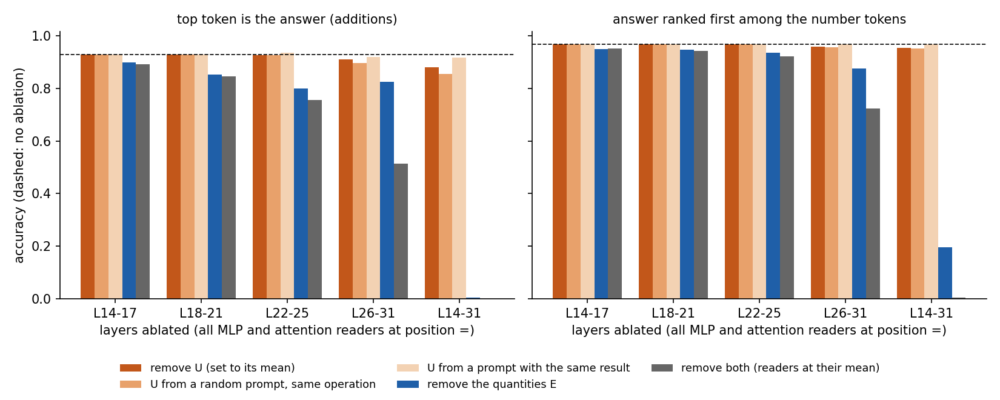
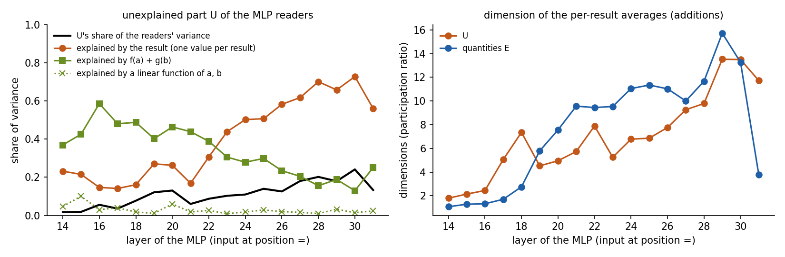

# What the readers read

*A label-free atlas of the quantities Llama-3.1-8B reads while it adds and subtracts, how they are
built, and whether they matter.*

Interactive version: https://claude.ai/artifact/FHwWcPdX6cjPSech1iGR3Z. Code:
`param_decomp/arith_repr/isa/`. Outputs: `<run>/analysis/arith_repr/atlas/`. Decomposition p-ba5a0c05,
step 40000, ceiling filter `addsub-05-filter-last-pos-ceiling`.

## In short

- **Readers read few, clean quantities.** Without using any labels, the components that read the
  residual stream can be summarised by 1,145 quantities at 256 read points: binary variables such as
  the operation, circles such as b mod 100, and larger quantities that mix several periods of one
  number. Named afterwards, they tell a readable story: b is copied to the `=` position at layer 15, a
  at layer 16, and the result is assembled from their periodic codes from layer 19 on.
- **Their construction can be traced.** Each quantity is a sum of identified component writes, and
  the writers compute it from earlier quantities: head 13 of layer 15 copies b's codes, head 21 of
  layer 16 copies a's, and an MLP component of layer 18 computes the result's parity as a product of
  an a code and b's parity.
- **They are what the network computes with.** Swapping the quantities of an MLP's input from another
  prompt reproduces 84-98 % of that MLP's response to the other prompt (layers 14-30), more than a
  random subspace of the same size. Removing them at `=` from layer 14 on makes the model stop
  answering (accuracy on additions 0.93 → 0.01).
- **What they miss is small.** The part of the readers they do not explain holds 2-24 % of the MLP
  readers' variance at `=`; removing it costs little (0.93 → 0.88), and what it carries is a little
  more information about the result.

## 1. The question

**The task.** The model reads prompts of the form `<BOS> a op b =`, with a and b whole numbers from 1
to 100 and op either + or −: 100 × 100 × 2 = 20,000 prompts. Each prompt is five tokens, and the
model keeps one running vector per token position. We call the five positions BOS, a, op, b and `=`.

**The residual stream.** At each position, the model carries a vector of d = 4096 numbers, the
*residual stream*. Each layer reads this vector, computes something, and adds its result back to it,
so the vector changes from layer to layer. We write x for one such vector: the stream of one prompt,
at one position, at one point in the network.

**Components and readers.** The decomposition splits every weight matrix of the model into small
pieces called *components*. Each component c has an input vector v_c (4096 numbers, what it reads)
and an output vector (what it writes). Its *inner activation* on a prompt is one number, h_c: the dot
product of v_c with the (normalised) stream it receives. The components of the q, k and v matrices
of an attention layer, and of the gate and up matrices of an MLP, read the residual stream directly;
we call them *readers*.

**Read points.** A *read point* is one group of readers at one position: the q, k and v readers of
one attention layer at position a, say, or the gate and up readers of one MLP at position `=`. There
are 32 layers × 2 sites (attention, MLP) × 4 positions (a, op, b, `=`) = 256 read points; BOS is left
out because its stream is the same for every prompt.

**What we want: quantities.** At a read point, each reader gives one number per prompt, so with n
readers each prompt yields a list of n numbers. These lists are highly redundant: dozens of readers
respond to the same few properties of the prompt. We want to summarise them by a short list of
*quantities*. A quantity is a rule that assigns to every prompt a small vector of k numbers (k = 1 to
4), its *value* on that prompt, computed as a linear combination of the readers' activations. Three
examples, with the values scaled so that each coordinate has average 0 and variance 1 over the
prompts:

- **A circle**, such as b mod 50. The value on a prompt is the 2-number vector
  (√2 cos(2π·b/50), √2 sin(2π·b/50)), a point on a circle of radius √2. Prompts with b = 3 and
  b = 53 get the same value; b = 28 gets the opposite point.
- **A binary variable**, such as the operation. The value is a single number, +1 on additions and −1
  on subtractions. Another example is b's mod-20 square wave: +1 when b mod 20 is below 10, −1
  otherwise.
- **A simplex**, such as a variable taking three values equally often. The value is a 2-number vector
  that is one of the three corners of an equilateral triangle centred on 0.

The value of a quantity is always a vector of numbers; a prompt is a string. The *shape* of a
quantity is the set of values it takes over all 20,000 prompts: a circle, two points, three corners.

For each quantity we also want: where it is written in the stream, which readers read it, whether the
same quantity is read at other read points, how the model builds it, and whether the model uses it.
The labels a, b, op and the result are never used to find the quantities; they are used afterwards,
only to name and check them.

## 2. The model we analyse

The analysis runs on the **components-only model**: the model rebuilt from the decomposition's
components that are active on each prompt (causal importance above 0.01), without the weight delta,
the part of the weights the components do not capture. Its predictions stay close to the original
model's (the average KL divergence between the two, at the last position, is 0.05). Its readers carry
the same patterns as the original model's with much less background, which makes quantities easier
to see; the original model is kept for comparison in the interactive version. It answers 92.8 % of the
additions and 22 % of the subtractions correctly, so the accuracies quoted below are on additions.

## 3. Finding quantities without labels

The method runs separately at each read point (steps 1-7), then connects read points (step 8) and
finally names the quantities (step 9). Throughout, i indexes prompts (i = 1 … N, N = 20,000), c
indexes the readers of the read point (c = 1 … n), and d = 4096 is the width of the stream.

| symbol | type | meaning |
|---|---|---|
| x_i | vector of d numbers | the stream of prompt i at the read point (the input of the layer's attention or MLP, at the point's position) |
| h_{i,c} | number | the inner activation of reader c on prompt i |
| g | vector of d numbers | the gain of the normalisation layer in front of the readers |
| v_c | vector of d numbers | reader c's input vector |
| a_{i,c} | number | reader c's activation on prompt i, made linear in the stream (step 1) |
| a_i | vector of n numbers | the activations of all the readers on prompt i |
| p_i | vector of r numbers | prompt i's activations on the r kept directions (step 3) |
| u_c | vector of r numbers | reader c on the kept directions, with a_{i,c} ≈ p_i · u_c (step 3) |
| W | r × k matrix | a candidate *frame*: k directions among the kept ones (step 5) |
| z_i | vector of k numbers | a quantity's value on prompt i (step 5) |

### Step 1. Make the readers linear in the stream

*Input:* the inner activations h_{i,c} and the streams x_i. *Output:* for every prompt and reader, a
number a_{i,c} that is an exact linear function of x_i.

Before a layer reads the stream, it normalises it: it divides x_i by its root mean square,
rms(x_i) = √(mean of the squares of its 4096 entries), and multiplies it entry by entry by the gain
g. So the inner activation is h_{i,c} = (x_i / rms(x_i) ⊙ g) · v_c, where ⊙ is the entry-by-entry
product. The division by rms(x_i) makes h_{i,c} a non-linear function of x_i, but multiplying it back
out removes it:

a_{i,c} = h_{i,c} × rms(x_i) = x_i · (g ⊙ v_c).

Each reader is now a fixed direction, g ⊙ v_c, read off the raw stream. This matters later: any
linear combination of the a_{i,c} is again a linear read of the stream, so every quantity found in
reader space can be mapped back to directions in the stream. There is no assumption here; it is an
identity (up to the small constant added inside the square root).

We then subtract each reader's average over the prompts, so that a_{i,c} measures how prompt i
differs from a typical prompt, and drop readers whose activation is constant over the prompts (their
variance is below 10⁻⁸ of the largest one): they carry no information about the prompt.

### Step 2. Split the prompts into a fit half and a held-out half

*Input:* the prompts' tokens. *Output:* two disjoint sets of prompts, the *fit* prompts and the
*held-out* prompts.

Every choice the method makes below (which directions to keep, which frames to accept) is fitted on
the fit prompts and checked on the held-out prompts. A structure that exists only in the particular
prompts it was fitted to fails the check; a real circle or a real binary variable passes it.

The split must be made over *distinct* prompts. The stream at a position depends only on the tokens
up to that position: at position a, only on a, so the 20,000 prompts give only 100 distinct streams;
at position op, 200. Two prompts with the same tokens up to the read position are therefore one
distinct prompt, and the split puts them on the same side. The distinct prompts are shuffled, and
each half keeps at most 4,000 of them: at position a, 50 fit and 50 held-out; at positions b and `=`,
4,000 and 4,000.

(An earlier version recognised identical prompts by rounding their activations to six decimals. The
stored activations differ slightly from one batch of prompts to the next, so it found 800 to 2,200
"distinct" prompts at position a instead of 100, and the held-out half repeated values of a that were
in the fit half. The check then passed frames it should have rejected.)

### Step 3. Choose the directions to keep

*Input:* the centred activations a_i and the split. *Output:* r directions in reader space, and for
every prompt the r numbers p_i: its activations along them.

**Principal directions.** Let C be the covariance matrix of the readers over the fit prompts (n × n),
with eigenvectors e_1, e_2, … (vectors of n numbers, length 1, perpendicular to each other) and
eigenvalues λ_1 ≥ λ_2 ≥ … . The projection a_i · e_j is a number per prompt; over the fit prompts its
variance is λ_j. These are the *principal directions*: e_1 is the direction along which the readers
vary most together, e_2 the next one, perpendicular to it, and so on. The readers are highly
redundant (30 readers of b mod 50 all vary along the same two directions), so a few principal
directions carry most of the variation.

**Which ones to keep.** Keep the leading directions for as long as the held-out prompts vary along
them about as much as the fit prompts: the variance of a_i · e_j over the held-out prompts must lie
between half and twice λ_j. A direction that describes only the particular fit prompts fails this
test. At position a, for example, the 50 fit prompts give at most 49 directions with any variation at
all, and the last of them describe nothing but those 50 points. At positions b and `=`, where there are
thousands of distinct prompts, every direction passes: at the layer-15 MLP input at `=`, all 154
directions of its 154 readers are kept.

The kept directions are not rescaled: p_{i,j} = a_i · e_j, for j = 1 … r, with variance λ_j. Reader c
is described by the r numbers u_{c,j} = e_{j,c} (entry c of each kept eigenvector), so that
a_{i,c} ≈ p_i · u_c, with equality when every direction is kept.

**Two rules that were tried and dropped.**
- *Keep only directions shared by several readers* (parallel analysis: shuffle each reader separately
  over the prompts, which keeps each reader alone and destroys what readers share, and keep the
  directions stronger than in the shuffled data). A direction read by a single reader can never pass,
  yet one component per quantity is what the cleanest decomposition would produce. On the example
  below it keeps a single direction and finds nothing.
- *Keep the directions whose variance is well above the rounding noise of the stored activations.*
  In this model almost every direction is far above the rounding noise: the small directions are
  small but real variation, so this rule keeps nearly everything, like no rule at all.

### Step 4. Background: uncorrelated quantities are perpendicular after standardising

The pursuit of step 5 finds quantities one at a time: once a quantity is found, it is removed and the
search goes on in what remains. This works because of a relation between two things that look
unrelated: whether two quantities are *correlated* over the prompts (a statistic), and whether the
directions that read them are *perpendicular* (geometry).

**The relation.** Standardising (also called whitening) rescales the principal directions so that
each has variance 1: y_{i,j} = p_{i,j} / √λ_j. (Dividing by the square root of λ_j, not by λ_j
itself: that is what makes the variance 1.) The coordinates of y_i then have average 0, variance 1,
and no correlation with each other. Any quantity whose value is a linear function of y_i can be
written z_i = Wᵀ y_i for some matrix W with k columns w_1 … w_k, each a vector of r numbers; coordinate
j of the quantity on prompt i is the number z_{i,j} = w_j · y_i. Take a second quantity,
z′_i = W′ᵀ y_i. The covariance over the prompts between coordinate j of z and coordinate j′ of z′ is

Cov = (1/N) Σ_i z_{i,j} z′_{i,j′} = Σ_m Σ_{m′} w_{j,m} w′_{j′,m′} × [ (1/N) Σ_i y_{i,m} y_{i,m′} ].

The bracket is the covariance between coordinates m and m′ of y_i, which is 1 when m = m′ and 0
otherwise, so the double sum collapses to Σ_m w_{j,m} w′_{j′,m} = w_j · w′_{j′}. The covariance (a
statistic over the 20,000 prompts) equals the dot product of the two reading directions (a property
of two vectors, with no prompts involved). So the quantities are uncorrelated exactly when the
columns of W are perpendicular to those of W′. For instance, with r = 2: w = (1, 0) and
w′ = (1, 1)/√2 read y_{i,1} and (y_{i,1} + y_{i,2})/√2, whose covariance is 1/√2 ≈ 0.71, and indeed
w · w′ = 1/√2.

Without standardising this fails. Two variables u and v, uncorrelated, each with variance 1, read by
two readers, the first reading u and the second u + v: in the readers' own coordinates, u moves the
pair of activations along (1, 1) and v along (0, 1), 45° apart, although u and v are uncorrelated.
After standardising, the two directions are at 90°.

Standardised coordinates are only defined up to a rotation: if y_i is standardised, so is Q y_i for
any rotation Q. So the principal axes need not be the quantities' axes (a circle has the same
variance in both of its directions, and any rotation of its plane is an equally good pair of axes):
the quantities still have to be searched for.

**A picture in three dimensions.** Take 200 made-up prompts: b from 1 to 100, each once with + and
once with −. Two quantities, uncorrelated over these prompts: the circle of b mod 50, whose value on a
prompt is the pair of numbers (cos 2πb/50, sin 2πb/50), and the operation, whose value is +1 or −1.
Three readers each mix these three numbers: reader 1 = 3 cos + 0.8 op, reader 2 = cos + sin + op,
reader 3 = 0.6 sin + 0.9 op. Each prompt then gives three activations, drawn as one point in 3D
(colour: b mod 50; dots: additions; triangles: subtractions).



On the left, the raw activations: the circle's values form two tilted ellipses, one per operation,
and the arrow along which the operation moves them (from the centre of the subtraction ellipse to the
centre of the addition ellipse) is only 14° away from the ellipses' plane. On the right, the
standardised coordinates: the ellipses have become round circles of radius √2, and the arrow is
perpendicular to their plane (90°). The right panel is rotated so that the arrow points up; a
rotation changes no length or angle.

**Why the pursuit does not standardise all the directions at once.** Standardising divides every
kept direction by its standard deviation, so a direction with almost no variation is blown up to the
size of a real signal. The same prompts, now read by four readers (the three above and a fourth,
0.5 cos + 0.3 op, which adds nothing new), each carrying a small independent noise (standard
deviation 0.01): the four principal directions hold 81.7 %, 17.6 %, 0.70 % and 0.001 % of the
variance, and the fourth is pure noise. Standardising r = 1, 2, 3 or 4 of them gives:



- **Too few directions (r = 1 or 2) cut the quantities.** With r = 2 the dropped direction holds only
  0.7 % of the variance, but it carries most of the circle's sine: the best circle scores J = 0.27
  and the operation's values are no longer ±1 (J = 0.45; J is defined in step 5, 0 means a perfect
  sphere). Small directions can matter.
- **With r = 3,** both quantities are intact (J = 0.00).
- **With r = 4,** nothing is lost, but the noise direction, 0.001 % of the variance, is blown up to
  variance 1: drawn against the circle's plane, it smears the circle into a cloud as tall as the
  circle is wide. On the real readers, standardising every direction made the search wander into such
  directions: it split circles into single axes, and at layers 24 and 28 did no better than a random
  subspace in the causal test of section 6.

So the pursuit keeps every direction that passes step 3 (the noise direction of this example passes
too: it varies as much on held-out prompts as on fit prompts), but never standardises them all.
It standardises only the handful of coordinates of each candidate quantity (step 5), and removes a
quantity by regression, which by the relation above removes exactly what is correlated with it. On
this example it finds the circle and the operation (J = 0.005 each). Parallel analysis keeps one
direction and finds nothing.

### Step 5. Sphere pursuit: find one quantity at a time

*Input:* the coordinates p_i, the reader directions u_c, the readers ordered from largest to smallest
variance. *Output:* a list of quantities, each with its value z_i (a vector of k numbers, k = 1 to 4)
on every prompt.

Two assumptions drive the search.

- **Each reader reads few quantities.** Looking at the readers' activations over the 100 × 100 grid
  of (a, b), almost every reader responds to one period of one operand, sometimes of both. So a
  reader's own activation is a good place to start looking for a quantity.
- **The values of most quantities all have the same length.** With each coordinate scaled to
  variance 1, the binary variable's value is always ±1 (length 1), the circle's value always has
  length √2, and the three-valued simplex's value always has length √2 too (a simplex of K values in
  K − 1 dimensions: length √(K − 1)). Call such a quantity a *sphere*: its values lie on a sphere
  centred on 0. A linear ramp in a, or a random mix of several quantities, does not have this property.

**A candidate and its score.** A candidate quantity is any k linear combinations of the kept
coordinates: the k numbers Wᵀ p_i per prompt, for an r × k matrix W. It is first *standardised*: its
average over the fit prompts is subtracted, and its k coordinates are transformed, with the k × k
covariance of the candidate over the fit prompts, so that they have variance 1 and no correlation.
This is the value z_i. Standardising inside the candidate is what turns an ellipse into a circle (the
3D picture above), without touching any other direction. The score measures how far the values are
from constant length:

J = variance over the prompts of ‖z_i‖², divided by 2k.

The division by 2k sets the scale: if the z_i were random Gaussian vectors with variance 1 in each
coordinate, ‖z_i‖² would follow a chi-square distribution with k degrees of freedom, whose variance
is 2k, so J = 1. For a sphere, ‖z_i‖² is the same for every prompt and J = 0. One axis of a circle
alone gives J = 0.25 (its value √2 cos θ has a varying square), so the full circle, k = 2, wins.

**The search.** The readers are visited from largest to smallest variance. For reader c:

1. If quantities found earlier already explain more than half of reader c's variance (computed on the
   fit prompts, after the removals of item 4), skip it.
2. For k = 1, 2, 3, 4, find the W with the lowest J on the fit prompts, by gradient descent started at
   reader c's own direction (plus random extra columns for k > 1, four random starts). A larger k is
   preferred only if it lowers J by more than 0.02. The gradient steps are taken in the unscaled
   coordinates p_i, so directions of small variance are explored slowly.
3. Accept the candidate if its J on the held-out prompts (standardised with the fit prompts'
   statistics) is below 0.5.
4. Split it if it holds several independent quantities (step 6), record the parts, and remove the
   candidate from the data by regression: subtract from p_i its best linear prediction from z_i (the
   coefficients fitted on the fit prompts). Every reader thereby loses exactly the part of its
   activation that is correlated with the quantity, which by step 4 is the same as removing the
   quantity's directions after standardising.

Example: at the layer-15 MLP input at `=`, the first quantity found starts from reader L15.gate.c9:
a 1-dimensional quantity with J = 0.00, a binary variable that turns out to be the operation.
Later readers lead to a 3-dimensional quantity with J = 0.07 (b's codes of several periods), a
2-dimensional one with J = 0.13 (b's parity) and a 4-dimensional one with J = 0.17 (b mod 10).

### Step 6. Split candidates that hold several quantities

*Input:* an accepted candidate. *Output:* one or more quantities.

Two independent spheres taken together also have constant length: if ‖z‖² and ‖z′‖² are both constant,
so is ‖z‖² + ‖z′‖². So a candidate accepted in step 5 may hold, say, the operation and b's square wave
together. For each way of cutting it into two parts (a sub-frame of k₁ ≤ k/2 directions with the
lowest J, from 16 random starts, and the rest), the cut is kept if both parts have J < 0.5 and their
squared lengths are not anti-correlated over the prompts (correlation above −0.1). The
anti-correlation test keeps real circles whole: for the circle's two axes, 2 cos²θ + 2 sin²θ = 2, so
when one squared length goes up the other goes down, correlation −1. When a part's squared length is
nearly constant (it varies by less than 20 % of its average, as for a binary variable), its
correlation with anything measures only noise, and the parts count as independent. Parts are split
again until no cut is kept.

### Step 7. What is recorded for each quantity

- **Its values** z_i on all 20,000 prompts.
- **Its pattern**, the d × k matrix P = average over prompts of (x_i − x̄) z_iᵀ, where x̄ is the average
  stream. Column j of P is the direction in which the stream moves, on average, as coordinate j of the
  quantity increases: where the quantity is *written*. Because z_i is a linear function of x_i (step
  1), there is also a d × k matrix F with z_i = Fᵀ (x_i − x̄), the *filter*: how the quantity is
  *read*. The two differ when other signals share the quantity's directions.
- **Its readers.** Reader c's *share* in a quantity is the fraction of the reader's variance (along
  the kept directions) that the quantity's values explain. Readers with a share of at least 0.25 are
  listed. A reader's *explained share* is its total share in all the quantities of the point; the rest
  is its unexplained share.
- **Relations to the point's other quantities.** Two uncorrelated quantities can still carry
  overlapping information: a mod 10 is a function of a mod 50. R²(i | j) measures how much quantity i
  is a function of quantity j: for each of 4000 prompts, average the values of i over the 20 other
  prompts closest in the values of j, and compare with the true value (1 − error variance / variance).
  It is 1 when j determines i, 0 when j says nothing about i, and it is not symmetric.

### Step 8. Find the same code at different read points

*Input:* the values of all quantities at all read points, on the same 20,000 prompts. *Output:*
groups of quantities, called *codes*, that carry the same information.

When head 13 of layer 15 copies b's codes from position b to position `=`, the same quantity appears
at both read points, possibly rotated. Two quantities, one with k values per prompt and one with k′,
are compared by their *canonical correlations*: the correlations, over the prompts, of the
best-matching linear combinations of their coordinates. Because each quantity's coordinates are
uncorrelated with variance 1, these are simply the singular values of the k × k′ table of
correlations between their coordinates. Two quantities belong to the same code when k = k′ and all k
canonical correlations are at least 0.8: each is then, up to noise, a rotation of the other. Codes
are the connected groups this relation forms. A quantity with fewer dimensions whose canonical
correlations with a larger one are all at least 0.8 (a circle inside a 3-dimensional frame that also
holds the operation) is recorded as *contained* in it, not as the same code.

### Step 9. Name the quantities, after the fact

*Input:* the values z_i and the labels of every prompt. *Output:* a name such as "b mod 50, circle".

- **Which label.** For each label (op, a, b, a + b, a − b, and the result: a + b on additions,
  a − b on subtractions), group the prompts by the label's value and replace each z_i by the average
  over its group. The share of the variance of z that survives, η², is 1 if the quantity is a
  function of the label and near 0 if it is unrelated. The quantity takes the label with the largest
  η².
- **Which period.** Average z over the prompts with the same value of the label mod 100, giving 100
  averages, and take their Fourier transform: the strength of each frequency f = 1 … 50. The strongest
  frequency f gives the period 100 / gcd(f, 100) (f = 2: period 50). If it holds at least half of the
  total strength, the name says "b mod 50"; otherwise "b (mixed periods)".
- **Which shape.** "binary" for k = 1 with J < 0.25, "circle" for k = 2, otherwise "k-dim".

A code takes the name of its member with the lowest J.

### Does it work?

The method was run on synthetic data where the answer is known (`synth.py`). A 512-number stream is
built from eleven quantities on the 10,000 (a, b) pairs, each written into its own random directions:
circles of a mod 50, b mod 50, a mod 10, b mod 10 and (a + b) mod 10, b's mod-20 square wave, a
five-valued simplex of a mod 5, a linear ramp in a, a checkerboard (the product of a's and b's square
waves), and two random tables of a and of b, plus noise. Some quantities are made to share directions.
The readers are like the real ones: most read one quantity, 8 read a mixture of a mod 50 and b mod 50,
14 read a mod 10 and b mod 10 together, and 40 read the random tables weakly. Recovery is measured as
the share of each true quantity's directions that the patterns of the best-matching quantity found
cover (1 = identical).

- On one construction (seed 0), the method finds exactly nine quantities, one per structured quantity
  and none for the random tables, each with the right dimension: the circles cover 98-100 % of their
  true directions, the square wave, the ramp and the checkerboard 97-99 %, and the simplex, found
  whole as a 4-dimensional quantity, 94 %.
- On a second construction (seed 1), it merges some of them: a mod 10 and b mod 10, which 14 readers
  read together, come back as one 4-dimensional quantity; (a + b) mod 10, the ramp and the
  checkerboard sit inside 3-dimensional quantities (each still covered at 95-99 %); and half of the
  simplex is found (47 %).
- Standardising every kept direction instead (the alternative of step 4) separates all of them on
  both constructions, except the simplex, which it splits into corners (48 %). On the real readers,
  though, it does worse (Appendix B): the pursuit trades some separation for fidelity.

## 4. What the atlas finds

At the 256 read points of the components-only model, the pursuit finds 1,145 quantities (983 in the
original model): 418 binary or 1-dimensional quantities, 301 2-dimensional (circles, mostly), 238
3-dimensional and 188 4-dimensional. They form 841 codes, 34 of them read at two read points or more.
On average the quantities explain 45 % of each reader's variation (35 % in the original model); the
rest is examined in section 7.

Followed through the network, the codes tell the story of the computation:

1. **The operation** becomes a binary flag at positions op and b in layer 0 and is read at 181 read
   points, at every layer.
2. **The operands are encoded at their own positions:** a mod 100, as a circle and as a binary
   variable, at positions a and op (layers 0-31); b mod 100 and b mod 50 at position b.
3. **They are copied to `=`:** b's codes from layer 15, a's from layer 16. At layers 16-18 the MLP
   inputs at `=` hold both operands' periodic codes: a mod 100, 50, 10, 5 and 2, and b mod 100, 50,
   20, 10, 5 and 2, several of them as 3- or 4-dimensional quantities that mix periods of one operand.
4. **The result appears from layer 19**, as codes of the result mod 100, 50, 5 and 2, joined by mod 20
   at layer 20 and mod 10 at layer 21; from about layer 24 many result codes mix several periods.

Before layer 15, the MLP inputs at `=` also hold faint quantities named after a, b or the result: the
`=` position picks up weak traces of the operands through the early attention layers. They are real
but tiny (section 5), and removing everything read at `=` before layer 14 changes nothing (section 7).

<!-- atlas-map -->

<!-- atlas-layer -->

## 5. How the codes are built

**Who writes each quantity.** In the components-only model, the stream at a position is exactly the
token embedding plus the writes of the active o and down components before it,
`x = e + Σ_c h_c m_c U_c` (m_c the mask, U_c the write vector; checked to within 1 %). Each quantity
is a fixed linear read of the stream, `z = Fᵀ (x − x̄)`, so each writer's share of it is exact, and the
shares of the embedding and of all writers add up to 1: between 0.98 and 1.02 for 1,097 of the 1,145
quantities (`writers.py`). The other 48 are the faint quantities at `=` before layer 16: their
variation is below what the 16-bit copy of the stream used here resolves, so the stored stream
reproduces them only in part.

**What each writer computes it from.** For each writer with at least 15 % of a quantity, a regression
on the quantities it can read, in the form the component can compute: linear for an attention writer
(its values are linear in the source streams), degree 2 for an MLP writer (its neurons are
`silu(g) · u`, so products of two quantities are within reach).

- **The operation.** Head 10 of layer 0 writes the flag at position b: its two components L0.o.c0
  and L0.o.c32 write 68 % and 32 % of the flag at the layer-0 MLP input there, each linearly from the
  flag at position op (R² 1.00). At `=`, MLP components rewrite it layer after layer, each from the
  flag already there (L14.down.c1 writes 20-47 % of the flag at the layer-15 and 16 inputs, R² 0.99).
- **b.** At position b its codes come from the embedding and the layer-0 MLP (b mod 100 at the
  layer-2 MLP input: 31-42 % embedding, 51-55 % layer-0 MLP). Head 13 of layer 15 copies them to `=`:
  the layer-15 attention writes 58-77 % of each of b's quantities at the layer-15 MLP input.
- **a.** Head 21 of layer 16 copies a's codes to `=`: the layer-16 attention writes 58-99 % of a's
  quantities at the layer-16 MLP input and 33-97 % at layers 17-18.
- **The result.** L18.down.c4 writes the result's parity (19 % of it at the layer-19 input, 30 % at
  layer 22), and computes it as a product: its activation is predicted by b's parity together with an
  a code (degree-2 R² 0.77, against 0.32 for b's parity alone). Later MLPs refresh the result codes
  from themselves: L21.down.c1 writes 49 % of the result's parity at the layer-22 input, computed from
  the parity already there (R² 0.91).

<!-- provenance -->

## 6. Do the quantities matter?

Being read is not being used. The test is an **interchange**: give a quantity the value it has on
another prompt, and see whether the network then behaves as if it had seen that prompt. The tests run
on an explicit forward pass of the components-only model with hooks on the stream and on the readers
(`components_model.py`; it reproduces the stored activations to within 1 % and the top token on
99.2 % of prompts).

**The swap.** Take a base prompt, 23 + 45, and a source prompt that differs in one input, 23 + 71. At
a read point, move the base stream so that the quantity reads the source's value:
`x' = x + ((x_src − x) F) (Pᵀ F)⁻¹ Pᵀ`, with F the quantity's filter (how it is read) and P its pattern
(where it is written). Moving along the pattern leaves the point's other quantities at their base
values, because uncorrelated quantities have `F₂ᵀ P = 0` (step 4 of section 3).

**The final answer is the wrong place to look.** Swapping all the quantities of an MLP input at `=`
moves the answer to the source's answer on at most 6 % of prompts up to layer 23, and on 12-26 % at
layers 24-29. Replacing the whole stream at `=` does not do much better until late:



Until about layer 24, later attention heads read the operands again at positions a and b, which
still hold the base prompt; after that, the answer sits in stream directions that the unembedding
reads and no later reader does, so no quantity describes them.

**The component that reads the quantities is the right place.** Run each MLP at `=` on its own, with
its masks held at the base prompt's, and ask how much of its response to the source (its output on
the source minus its output on the base) the swap reproduces: 1 means it responds exactly as to the
source's whole input, 0 not at all.



- All the quantities of an MLP's input reproduce 84-98 % of its response to the operands or the
  result at layers 14-30 (49 % at layer 31), and 95-100 % of its response to the operation.
- The baseline is a random subspace of the same dimension, moved the same way. It is not a null: its
  pattern favours the stream's largest-variance directions, and with 30 or so dimensions it already
  reproduces much of the response. The quantities beat it at every layer: by 0.30 at layer 15, 0.12
  to 0.18 at layers 14, 17, 18 and 20, and 0.03 to 0.09 elsewhere.
- Single codes carry large shares on their own. At layer 16, the 3-dimensional code of a mod 100
  reproduces 0.72 of the MLP's response to a (random subspace of the same dimension: 0.19); b mod 100
  reproduces 0.44 of its response to b (0.21). At layer 18, a mod 50 reproduces 0.30 of the response
  to a (0.08); at layer 20, the result mod 20 reproduces 0.32 of the response to another addition
  (0.19). The operation flag, one dimension, reproduces 97-100 % of the layer-14 and 15 MLPs'
  response to the operation (random: 0.03-0.73).
- The orange curve swaps what the quantities do not explain instead. It reproduces 3-19 % of the
  response at layers 14-18 and 14-64 % at layers 19-30: late MLPs also respond to structure the
  quantities miss (section 7).

## 7. What the quantities miss

**Splitting each reader.** Take one reader's activation at a read point (times the RMS, minus its
average). Its *explained part* E is the best least-squares combination of the point's quantities: for
a reader that follows b's mod-20 square wave plus a small bump at b = 7, E is the square wave and the
bump is left over. The leftover splits into U, the part inside the r directions kept in step 3, and T,
the part along the directions step 3 dropped. The three parts are uncorrelated, so their variances add
up. Averaged over the read points, E holds 70 %, U 25 % and T 5 % of the readers' variance. T is
non-zero only at positions a and op, where few directions are kept; at the MLP inputs at `=`, T is 0
and U holds 2-8 % at layers 14-18 and 6-24 % at layers 19-31. Removing T everywhere changes nothing
(KL 0.003, same accuracy).

**Is U load-bearing?** Each part is set to its average over the prompts (it then carries no
information about the prompt), or replaced by its value on another prompt, at the readers of a range
of layers at `=`.



- **One layer at a time, nothing breaks**, even with every reader of the layer at its mean (accuracy
  at worst 0.93 → 0.91): the layers back each other up. The same ablations at positions a, op and b,
  over all layers, cost at most 0.02, and everything read at `=` before layer 14 can be removed
  without effect.
- **The quantities carry the computation.** Over layers 14-31 at `=`, removing the quantities drops
  the accuracy on additions from 0.93 to 0.01: the model answers `?\n`, the token it gives when it
  does not answer, on 492 of 500 additions (the clean model: 4 %). Removing U instead costs little
  (0.93 → 0.88); among the number tokens the right answer is still ranked first on 95 % of prompts
  (97 % clean).
- **What U carries is result information.** Taking U from another prompt with the same result keeps
  the accuracy at 0.92; taking it from a random prompt with the same operation gives 0.85, slightly
  below removing it. A correction for interference would be specific to the operands and would not
  survive coming from 45 + 23 instead of 23 + 45.

**What U is.** Its dependence on the labels, over all 20,000 prompts:



- *Late (layers 24-30):* 50-73 % of U is a function of the result (one average per result value),
  and only 13-30 % a sum `f(a) + g(b)` of separate functions of the operands. Its per-result averages
  span 7-14 dimensions (participation ratio), about as many as the quantities' own result codes
  (10-16).
- *Middle (layers 16-18):* about half of U is a sum of separate functions of a and of b, and little of
  it (under 5 %) is linear in them.

**Whole components.** At `=` over layers 14-31, only 138 of the 2,484 readers are mostly unexplained
(the quantities explain less than 20 % of their variance), and they hold 0.9 % of the variance.
Setting them to their average costs nothing (accuracy 0.93); switching them off costs little (0.89),
less than switching off as many random readers (0.64).

**So** the quantities carry the computation: without them the model stops answering, while the part
they leave out is small, mostly redundant with them, and carries a little more result information,
mostly at late layers.

## 8. Limits and open problems

- **Merged quantities.** The pursuit sometimes merges quantities that the same readers read together:
  on synthetic data it can return two circles as one 4-dimensional quantity (section 3). Many of the
  real 3- and 4-dimensional quantities named "mixed periods" may be such merges.
- **Positions a and op.** With only 100 or 200 distinct prompts, half of them are available to fit;
  few directions are kept there (a median of 5.5 at position a) and the scores sit closer to the
  acceptance line.
- **Faint quantities.** The faint quantities at `=` before layer 16 vary below the resolution of the
  stored 16-bit stream, so their writers cannot be fully attributed.
- **Readouts.** The answer cannot validate a quantity before about layer 24; the consumer's output
  can, but only for MLPs, whose output depends on one position. The random baseline of the local test
  is not a null, and large quantities beat it by little.
- **Mixed readers and linking.** Readers that mix quantities (plaids, products) are split among
  several quantities. Codes transformed non-linearly between read points, or read together with
  another quantity at one of them, show up as separate codes; most codes are read at a single point.
- **Provenance** only sees the quantities found at the writer's input, and "a function of" misses
  relations that oscillate fast when noise blurs neighbouring values.
- The o and down components read the heads' outputs and the MLP neurons, not the residual stream, so
  they appear as writers, not readers.

## Appendix A. Details of the causal tests

- **Maps** (`interventions.py maps`): per read point, `F = G W` with G the kept readers' `g ⊙ V` and
  `W = lstsq(Hc, Z)`, `B = lstsq(Z, Hc)` for the explained part, and the leading principal directions
  of the readers for the split between U and T.
- **Local interchange** (`local`): 500 additions, sources differing in a, in b, in the operation, or
  another addition; the score is `1 − Σ|w − w_src|² / Σ|w_base − w_src|²`, with w_src the MLP's output
  on the source's input under the base masks. Swapping the stream RMS alone moves the output away from
  the source, so the RMS is not a channel.
- **Ablations** (`ablate layers|windows`): 500 additions and 500 subtractions; mean ablation sets a
  part to 0 (its average); resampling takes the part computed from another prompt's clean stream.
- **Label profile** (`labels`): shares of each part's variance explained by the operation, a, b, the
  result (as categories within each operation), the best additive `f_op(a) + g_op(b)`, and a linear
  function of a and b.

## Appendix B. What did not work, and why

- *Keeping only directions shared by several readers* (parallel analysis): drops directions read by a
  single reader, and on the 3D example keeps one direction and finds nothing.
- *Standardising every kept direction* (global whitening) with all directions kept: blows up tiny
  directions; on the real readers it split circles into single axes and, at layers 24 and 28, did no
  better than a random subspace in the local test. With few directions kept (parallel analysis) it
  worked, but inherited that rule's blind spot.
- *Keeping directions above the rounding noise:* there is no such floor in these readers; the rule
  keeps almost everything.
- *Recognising identical prompts by rounding their activations:* batch-to-batch noise in the stored
  activations made copies of the same prompt look distinct, so at positions a and op the held-out
  half repeated the fit half.
- *Splitting frames with four random starts:* too few to find a binary variable inside a
  3-dimensional frame; the 3D example came back as one quantity.
- *Log cosh ISA on the original model:* log cosh favours sparse directions, and the original model's
  background makes bumps sparser than circle axes.
- *Varimax plus grouping by anti-correlated squares:* nested periods of one operand (the square of a
  period-T coordinate has period T/2) chain into large groups.
- *Mutual information for relations:* on near-deterministic data a 3 % shared impurity gives 0.3 nats;
  `R²` measures the size of the dependence instead.
- *Looser linking across read points:* chains unrelated codes through axes many frames share.
- *Masked activations* (inner activation times the mask): gated, prompt-selective signals that are no
  longer linear reads of the stream.
- *Reading an interchange at the final answer:* see section 6.

## Appendix C. The first version of the atlas

The first version kept only the directions shared by several readers, standardised all of them, and
recognised identical prompts by rounding their activations (Appendix B). It found 832 quantities in
616 codes; its quantities reproduced 44-92 % of the MLPs' responses at layers 16-30 (against 84-98 %
now), and what it missed was large (up to 60 % of the late MLP readers' variance) and load-bearing:
removing it over layers 14-31 at `=` halved the accuracy (0.93 → 0.52, against 0.88 now). The part the
first version could not describe was mostly result information in codes it could not represent; the
current version captures most of it as quantities. The first version's outputs are kept next to the
current ones (`<run>/analysis/arith_repr/atlas/decomposed/`; the current version is in its `v2/`
folder).

## Appendix D. Reproducing

```
python -m param_decomp.arith_repr.isa.atlas prep|layer <l>|link <model>      # decomposed, original
python -m param_decomp.arith_repr.isa.writers masks|run <position>|provenance
python -m param_decomp.arith_repr.isa.interventions maps <l>|labels <l>|local  # CPU
python -m param_decomp.arith_repr.isa.interventions swap|ablate layers|ablate windows   # 1 GPU
python -m param_decomp.arith_repr.isa.synth <seed>                            # synthetic check
```

The GPU runs compile each new batch shape once (about 5 minutes); prompts run in chunks of 500, and a
persistent JAX compilation cache avoids recompiling across runs. Jobs should run from a node-local
copy of the package: a module edited just before a job starts can otherwise be read in its old
version from the network file system.
