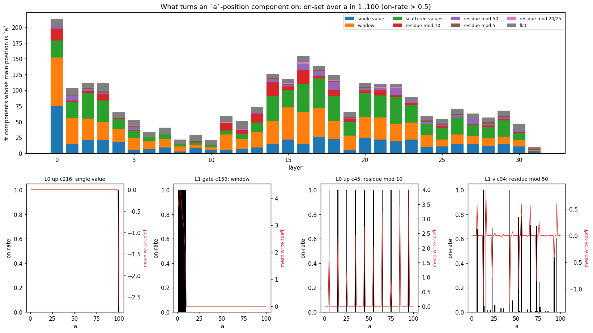

# What the components appear to do: a descriptive reading of the `a ± b =` decomposition

Decomposition `p-ba5a0c05` (`addsub-all-layers-4xh100-05`, step 40000), filter
`addsub-05-filter-last-pos-ceiling` (11,604 alive rank-1 components: down 4753, gate 2779,
up 2299, o 829, v 666, k 168, q 110). Prompts `<BOS> a op b =`, a, b in 1..100, both operations,
the full 100 x 100 grid (subtraction includes a < b). Companion of
[`report_representations.md`](report_representations.md) (which found the Fourier codes in
the residual stream); working notes in [`scratchpad_auto_interp.md`](scratchpad_auto_interp.md).

**Nothing here is an intervention.** Everything is read off the decomposition (U, V, the CI of
every component on every prompt/position, its inner activation `x·V`) and the original model's
activations and weights. The claims are what the components *appear* to do; section 7 lists
what each claim would need to be validated.

Figures: [`figures_auto_interp/`](figures_auto_interp/) (copies of the ones written by
`python -m param_decomp.arith_repr.autointerp.figures` to
`/mnt/nw/home/a.vigouroux/out/pod-backup/p-ba5a0c05/analysis/arith_repr/autointerp/figs/`, next to
the data they are drawn from). Code: `param_decomp/arith_repr/autointerp/`.

## 0. How a component is described

Components are **sparse**: an MLP component is on (CI > 0.01) on 3-6 % of the prompts at a given
position on average. So the most informative description of a component is its **on-set**
(which prompts switch it on), then the value of its write coefficient `w = inner · [CI > 0.01]`
inside the on-set (the decomposed model adds `w · U` to the site's output). Four descriptors,
all computed for every component, position and operation:

- **On-set label** — the coarsest function of (a, b) (a, b, res = a op b, each mod 2/5/10/20/50/100,
  digit pairs, carry, sign, …) whose class means explain the on/off pattern (R² within 90 % of
  the best; `pos4_tables.py`, `catalogue.py`), and, on a single quantity, a period/arc
  description (`onsets.py`: "a mod 10 in {3}", "a in 30..39", "a+b mod 100 in 1..9").
- **DFT of the write over the (a, b) torus** — energy on the four lines a-only, b-only, the
  a+b diagonal (functions of a+b mod 100) and the a−b diagonal, per period (`tuning.py`).
- **Code attribution** — the share of a Fourier code of the residual stream (at frequency k, of
  a, b, a+b or a−b, at a read point) that each upstream writer's `w · U` supplies
  (`code_attrib.py`; shares of all alive writers + embedding sum to 0.8-1.0, and to 0.96-1.02
  for the result codes, so the alive set accounts for them).
- **Direct logit effect** — `W_U · (g_final ⊙ U) / rms` on the tokens "0".."200", weighted by
  the component's write on each prompt, as a function of (token − correct answer)
  (`wiring.py`, `pos4_tables.py`).

Attention patterns are the original model's, recomputed from the stored residual stream and the
Llama weights (`attn_patterns.py`); a head is "carried" by the alive o components whose `V`
lies in it (median 79 % of an o component's `V` energy is in one head).

## 1. How the operands are stored and built (positions `a` and `b`)

**The components at the operand token are value-bin detectors.** Of the 2,565 components whose
main position is `a`, every one is on for a fixed set of values of `a` (the on-rate profile is
0/1: nothing else is visible at that position). The sets come in a few kinds, at every depth:

| on-set over a | count | examples |
|---|---|---|
| a single value | ~500 | L0 down c330: a = 89; L10 down c86: a = 52; L20 down c915: a = 9 |
| a window on the number line (width 2-17, often starting at a decade: x1 187, x0 124) | ~780 | L2 down c639: a in 2..15; L11 up c493: a in 1..9; L15 down c233: a in 75..84 |
| a residue class | ~330 | mod 10 (170, e.g. L0 gate c81: a ≡ 2; L13 gate c9: a ≡ 4 or 7), mod 50 (110, L17 down c165: a ≡ 13), mod 5 (32, L3 down c615: a ≡ 0), mod 20/25 (12) |
| a scattered set (unions of the above) | ~700 | L2 down c864: a in {95, 97, 98, 99} |

So **the same value is stored several times**: by magnitude bins of several widths (the tens
digit is a width-10 bin), by residue classes mod 10, 50 and 5, and by individual values. Summed
over components, `Σ_c w_c(a) U_c` is a piecewise-constant embedding of `a` that has, by
construction, a component along every period for which there are residue detectors — this is
what the residual-stream sweep saw as the `a:lin`, `a:5`, `a:10`, `a:50` codes.

**Construction** (code attribution at the `a` token, addition prompts, period-10 code shown in
[`code_attrib.png`](figures_auto_interp/code_attrib.png), rows `@a`):

| read point | who writes the a code (share of the Fourier code) |
|---|---|
| mlp_in.0 | token embedding 1.05 (all periods; linear + mod 5 dominant, as in the sweep) |
| mlp_in.1 | embedding 0.38-0.46, **L0 MLP 0.33 (periods 50/100) - 0.62 (period 2)** |
| mlp_in.3 | L0 MLP 0.16-0.36, L2 MLP 0.12-0.24, embedding ~0.2 |
| mlp_in.5 | spread over L0-L4 MLPs (0.1-0.25 each), embedding < 0.1 |
| mlp_in.12 | **L11 MLP re-writes the mod-10 code (0.31)**; mod 2 by L4/L11 |
| attn_in.16 / 18 (what L16H21 / L18H30 read) | **L11-L15 MLPs** (mod 10: L13 0.24, L14 0.20, L12 0.14) and L16-17 for attn_in.18 |

The `b` token is built the same way (embedding, then L0 MLP 0.45 of the mod-10 code at mlp_in.1,
L3-L4 MLPs), and re-written by the L12-L14 MLPs (0.15-0.27 of mod 10 at attn_in.15) just before
L15H13 reads it. **Attention writes nothing measurable into the operand codes at their own
token**: the codes are made locally by MLPs from the token embedding, and refreshed at L11-15
right before being copied.

Other things stored at the `b` token ([`grid_examples_pos3.png`](figures_auto_interp/grid_examples_pos3.png)): copies of `a`
(L1H24 attends `b`→`a` 0.54/0.72, L5H22 0.41; their o components are tuned to `a`), op flags
(L0H10, L0H1 attend `b`→op 0.91/0.78), and **comparators of a and b**: `a == b` detectors
(L2 q c53, L6 down c236, L18 down c141 — a thin diagonal, on both operations), "a ≈ b" and
"a > b" triangles on subtraction only (L4 v c22, L26 gate c596). The result is not computed at
`b` (as in the sweep).

## 2. How information moves between positions

Ranking heads by the activity of their alive o components at `=`, two heads do the
operand transport and a handful carry the operator:

| head | query → key (add / sub attention) | what the alive components move |
|---|---|---|
| **L15H13** (39 o, 29 v) | `=` → `b`: 0.91 / 0.63 | `b`: v components at the `b` token tuned to b mod 10 (14), b//10 (7), b; o components at `=` tuned b, b%10, b//10. Writes **0.75 of the b mod 2 code, 0.55 mod 5, 0.51 mod 10, 0.32 mod 20**, only ~0.1 of mod 50/100 at `=` (mlp_in.15). |
| **L16H21** (52 o, 20 v) | `=` → `a`: 0.91 / 0.58 (+0.19 on `b` for sub) | `a`: v components at `a` tuned a mod 10 (9), a; o components tuned a, a%10, a//10, a%20. Writes **0.85 of the a mod 2 code, 0.63 mod 5, 0.60 mod 10, 0.29 mod 20** at mlp_in.16. |
| L0H23, L1H6, L2H2 | `=` → op: 0.38-0.64 (L1H6 add 0.60 / sub 0.17) | the operator (their o components at `=` are op flags, section 5) |
| L18H30 (85 o) | `=` → BOS 0.52, b 0.25 (add) / b 0.49, BOS 0.33 (sub) | mixed: lin(a), tens(a,b), b; on-rate only 3-4 % |
| L13H7 (9 o) | `=` → `b` 0.67 (add) / `=` 0.43, `b` 0.30 (sub) | lin(a), tens(a,b), sign(a−b) |
| L20H2 (25 o) | `=` → `b` 0.34, `a` 0.14 (add) / `a` 0.35, `b` 0.33 (sub) | a, b on sub; its q component c131 is on for 79 % of sub and 8 % of add prompts |
| L1H24, L5H22 | `b` → `a` | a copy of `a` into the `b` token |
| L17H9, L24H10 | `b` → op | the operator into the `b` token |

The q and k components of L15H13 and L16H21 are on for every prompt (L15H13 q c138, k c13/c48;
L16H21 q c136, k c5/c122): **the routing is by position, not by value**. What the heads copy is
mostly the *short* periods (2, 5, 10: the last digit); the long periods and the magnitude of
the operands at `=` come in weaker and from several sources (L13-L15 MLPs at `=`, L13H7).

**Nothing about the result moves between positions**: the result codes at `=` are 96-102 % MLP
writes at `=` (section 3), and the attention writes into them are ≤ 0.02.

## 3. How the result is computed from the operands (at `=`, layers 15-24)

The DFT of the `=` writes over the (a, b) torus (left, addition) shows three regimes:

1. **L10-L16, operands side by side**: the writes are functions of `a` alone or `b` alone
   (a-only + b-only 0.75-0.85; b-only 0.78 at L15 when L15H13 lands, a 0.33 at L16 when L16H21
   lands). The inner activations of the gate/up components are **additive**: `f(a) + g(b)`
   explains 0.94-0.96 of their variance at L14-L18.
2. **L17-L18, the first combination**: the writes are neither additive nor diagonal. The on-sets
   in the units-digit plane (below) are **AND gates of digit classes** and **bands of the digit
   sum**. The first result code (mlp_in.19) is written by the **L18 MLP** (period 20: 0.49,
   period 2: 0.61, period 5: 0.39, period 10: 0.30) and the **L17 MLP** (period 10: 0.26,
   period 2: 0.30).
3. **L19-L30, the result**: the writes live on the a+b diagonal (0.39 at L19, 0.56 at L20,
   0.72-0.78 from L21); the inner activations of the gate/up components are now functions of the
   result (res R² 0.54 at L19-20, 0.86-0.91 from L21, additive share 0.07). Periods 50 and 100
   come first (L19), periods 10/20/5/2 by L20-21, then the mod-100 share keeps rising to L27.

The L17-L18 components that write the first result code, read on the units digits of a and b
(addition; [`digit_plane.png`](figures_auto_interp/digit_plane.png)):

- **Parity by an XOR of ANDs.** L17 down c67 is on iff *a odd AND b odd*, L17 down c22 iff *a odd
  AND b even*; L18 down c4 is on iff *a + b is even* (all even/even cells, 0.5-0.8 of odd/odd
  cells) and alone writes **61 %** of the (a+b) mod 2 code at mlp_in.19.
- **Rectangles** (conjunctions of a digit range and a b digit range): L17 down c52 is on for
  a mod 10 in 1-4 AND b mod 10 in 0-4; L16 gate c493 for a ≈ 50 AND b ≈ 55 (magnitudes).
- **Digit-sum bands**: L18 down c88 is on for a%10 + b%10 in about 4..8, L18 down c32 and L17 down
  c39 for other bands with a wrap at 10 — each is a range of the units sum 0..18, i.e. a joint
  code of the result's units digit *and* the carry.
- **Stripes**: L18 down c26 is on along (a+b) mod 5 stripes; L19 gate c41 on a lattice of digit
  pairs. Dense L18 components (c12, c21, c22, c25: on for 65-80 % of prompts) have write
  coefficients that are sinusoids of a+b with period ~50 (k = 2 peak on the diagonal) — they
  write the mod-50 circle that appears at mlp_in.19.

Reading: a gate/up component reads `f(a) + g(b)` from the residual (the operand codes side by
side) and its CI gate thresholds it, so its on-set is a region of the (a, b) plane — a
rectangle when f and g are range-like, a diagonal band when they are magnitude-like, a
lattice when they are periodic. The down components then combine several such regions (the
parity example is explicit), and their writes are functions of a+b. **From L19 on, the result
code is re-written layer after layer by MLPs reading the previous result code**: mlp_in.20 by
L19 (mod 10: 0.48) and L18; mlp_in.21 by L20 (mod 20: 0.60); mlp_in.23 by L21-22; mlp_in.26 by
L24-25 (mod 100: 0.33 from L25); mlp_in.29-31 by L28-30. Each re-write sharpens the long
periods (the fan-out from 2-D circles to 10-30 dimensions that the sweep saw at L26).

Where the tens digit comes from is less clean than the units: the tens-level components
(`tens(a,b)` on-sets at L16-L18, 69 at L16-18 on addition; `res//10` windows from L19) are
2-D blobs on the (a, b) grid (conjunctions of a magnitude range and a b magnitude range) and
diagonal bands of width ~10-30; no component was found that is a clean "carry" detector
(`carry` never wins the on-set label), the carry being folded into the digit-sum bands above.

## 4. How the result becomes the output token (at `=`, layers 20-31)

The late components at `=` are **result-window detectors**. On-set labels at L25-31
(addition): res mod 100 (667 components), res (525), res//10 (115), res mod 10 (96). Examples
([`curated_grids.png`](figures_auto_interp/curated_grids.png), [`grid_examples_L28-31.png`](figures_auto_interp/grid_examples_L28-31.png)): L30 gate c399 on for a+b in
101..109 *and* 2..9 (res mod 100 in 1..9); L29 up c549 for res mod 100 in 20..28 (the tens
digit 2); L29 gate c140 for res mod 100 in 80s; L28 up c218 for res mod 100 around 18..22; L22
down c6 for a+b = 100 exactly; thin single lines (one value mod 100) at L28-31.

Their down components write straight into the number logits: for the `=` down components of
L20-31, the correlation between a component's tuning over the result and its direct logit on
that result's token is 0.47 (median; 0.2 at L15-19, ~0 before; the best are 0.9+, e.g. L27
down c6 0.94, L29 down c132 0.94/0.93 add/sub). Summed by on-set family, relative to the
correct answer (figure above, addition):

| family (n) | direct effect on the token (answer + Δ) |
|---|---|
| res mod 10 (49) | +0.9 on **every** token with the right units digit (Δ = 0, ±10, ±20, …, ±100), slightly negative elsewhere |
| res mod 100 (280) | +2.0 at Δ = 0, +1.4 at Δ = ±100 (same last two digits), +0.85 at Δ = ±1, **negative at ±10** |
| res (205) | a narrow peak Δ ∈ [−2, 2] (+1.2 at 0), negative at −100 |
| res//10 (72), tens(a,b) (73) | a broad window Δ ∈ [−30, 30] (+1.1, +0.4 at 0), negative at ±100 |

So the answer token is picked by **intersecting factored votes**: the units digit (mod 10
family), the last two digits (mod 100 family, which cannot tell x from x ± 100), and a magnitude
estimate at two resolutions (the `res` and `res//10` families, whose windows exclude ±100 —
they are what resolves the hundreds). Summed over all late writers, the direct effect is +6.8
at the answer, +3.2 at ±1, +4.2 at −100 and +0.8 at +100: the hundreds are the weakest part of
the direct vote, consistent with the model's add errors on 110..199 being "res − 100" (4 %).
(The all-writer sum also carries a smooth "smaller numbers up, larger down" tilt that is not
tied to the answer.)

## 5. What the operation token does

Three things, all visible in the decomposition.

**(a) An op flag is carried to `=` from the start.** L0H23, L1H6 and L2H2 attend from `=` to
the op token (0.38-0.64); their o components at `=` are on for one operation only. From there,
a **relay of binary MLP components** at `=` — 1-4 per layer from L1 to L19 (104 components with
|on-rate(sub) − on-rate(add)| > 0.8, e.g. L6 down c11, L7 down c23, L8 down c928, L9 down c50,
L12 down c56, L13 down c127: on for 100 % of sub, 0 % of add; L11 down c11, L14 down c1: the
reverse) — keeps an "add"/"sub" flag in the residual. These flags are the top upstream writers
(by virtual weight × op difference) of the sub-only gate L15 c72 and up L15 c117.

**(b) Subtraction mirrors b's code at `=` (b → −b), in the L15 MLP.**

Take the class means of the `=` residual over b's 100 values, per operation, and their Fourier
coefficient `z_op(k)` (a vector in R^4096, complex). If subtraction carried the same code,
`z_sub = z_add`; if it carried the code of −b, `z_sub = conj(z_add)` (`op_phase.py`). At
mlp_in.15 — just after L15H13 copied b — the codes are the **same** (k = 10: |cos| 0.88 same,
0.08 mirrored). One layer later (attn_in.16, i.e. after L15's MLP at `=`) they are
**mirrored**: k = 10 same 0.14 / mirrored 0.57, k = 20 0.11 / 0.55, k = 1 0.16 / 0.30, k = 2 0.25 /
0.36; mirrored stays above same through L21. Controls: `a`'s code at `=` is never mirrored
(k = 10: 0.88 / 0.02 at mlp_in.16), and `b`'s code at its own token is never mirrored (the op
changes nothing there). The L15 MLP at `=` contains exactly the components this needs: **sub-only**
gate c72 (on 99 % sub / 0 % add), up c117 (99.8 % / 1 %), down c10 (93 % / 1 %), and sub-only
downs tuned to b: c64 (b mod 5, on 58 % of sub), c72 (b mod 10, 48 %), c80 (b, 25 %). The L15 MLP
writes 0.2-0.44 of b's mod 5/10/20 code at mlp_in.16-17 on both operations, i.e. it rewrites
the copied b code — as is on addition, mirrored on subtraction.

**(c) After the mirror, the same machinery computes a − b.** Because the b code at `=` is
mirrored on subtraction, a component that thresholds `f(a) + g(b)` into an a+b region on
addition thresholds `f(a) + g(−b)` into the *a−b* region on subtraction. This is what the grids
show ([`curated_grids.png`](figures_auto_interp/curated_grids.png), [`grid_examples_L19-22.png`](figures_auto_interp/grid_examples_L19-22.png)): the same L19-L30 components
draw anti-diagonal stripes (a+b) on addition and diagonal stripes (a−b) on subtraction (L19 gate
c0: a+b mod 50 → a−b; L21 up c13: res mod 10 in {5, 6, 7} on both; L22 down c6: a+b = 100 → a−b
≈ const; L30 gate c399: res mod 100 in 1..9 on both). On subtraction the writes move from the
a-only/b-only lines to the **a−b diagonal** at the same layers (0.24 at L19 → 0.40-0.45 from
L21), and the result-code writers are the same MLP layers (L17-L18 first, then L19-L30). The
residual-stream sweep's "result codes shared across operations (cos 0.9-0.97)" is this: one set
of result circles, reached from a+b or a−b depending on the sign of b's code.

Also op-dependent, but secondary: attention patterns of several heads change with the op
(L15H13 attends `b` 0.91 on add vs 0.63 on sub; L16H21 attends `b` 0.19 on sub; L18H30 and
L20H2 attend a/b much more on sub; L20H2's q component c131 is sub-mostly), and subtraction has
an early comparator (`a > b`, the triangle on-sets, a−b diagonal k = 1 energy 0.10-0.20 at
L10-14 on sub). On subtraction the model is also much weaker (53.9 % correct on a ≥ b, 44 % of
top-1 predictions are "?\n"; never "-" on a < b), and many late components are simply off on
sub (on-set label "unexplained" for 752 of the L27-31 `=` components on sub vs 252 on add).

## 6. One-paragraph summary

The operand tokens are embedded as sums of value-bin detectors (single values, number-line
windows, residue classes mod 10/50/5) built by the L0-L4 MLPs from the token embedding and
re-written by the L11-L15 MLPs. Position is the only routing key: L15H13 copies b and L16H21
copies a to `=`, mostly their short-period (last-digit) codes. The operator reaches `=` at L0-L2
and is held there by a relay of one-bit MLP components; on subtraction, sub-only components of
the L15 MLP mirror b's code (b → −b). The L16-L18 MLPs combine the two operand codes with
AND-gates of digit classes, digit-sum bands and parity XORs into the first result code (a
circle per period, at L19); the same components produce a−b on subtraction because b's code has
been mirrored. The L19-L30 MLPs re-write the result code layer after layer, moving it from
circles to narrow windows of res mod 100, and the late components write their window straight
into the number logits: the units digit, the last two digits and a two-resolution magnitude
estimate vote, and their intersection is the answer.

## 7. Caveats and what would validate each claim

- **Everything is correlational / direct-effect.** The attributions are *direct* contributions
  (writer → reader, writer → logits through the mean final-norm scale); indirect paths and the
  RMSNorm nonlinearity are ignored. The "who writes the code" shares add up to 0.8-1.0 (1.0 for
  the result codes), so the direct picture is nearly complete for the codes, but it does not
  show the codes are *used*.
- Activations are the **original model's** (CI evaluated on its activations; `w = inner·[CI >
  0.01]`), not the decomposed model's.
- On-set labels are group-R² fits of a fixed feature list; "unexplained" means none of those
  features fits, not that the component is meaningless (e.g. the many unlabelled sub components).
- Validation experiments suggested by each section: (1) ablate the L0-L4 value-bin detectors
  of `a` and check which Fourier codes vanish; (2) ablate/patch L15H13 and L16H21 at `=`;
  (3) ablate L18 down c4 (parity) and the digit-sum band components and check the (a+b) mod 2/10
  codes and accuracy per digit; (4) knock out the mod-10 / mod-100 / magnitude output families
  separately and look at the error types (units digit, ±100, ±10); (5) the op story: ablate the
  sub-only L15 MLP components on subtraction (predict: the model computes a+b), activate them on
  addition (predict: a−b), and patch the op-flag relay.
