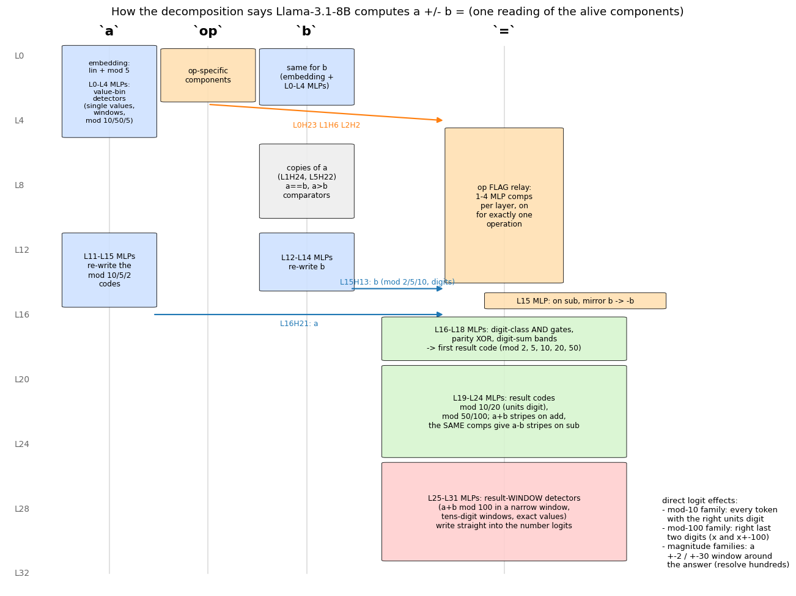
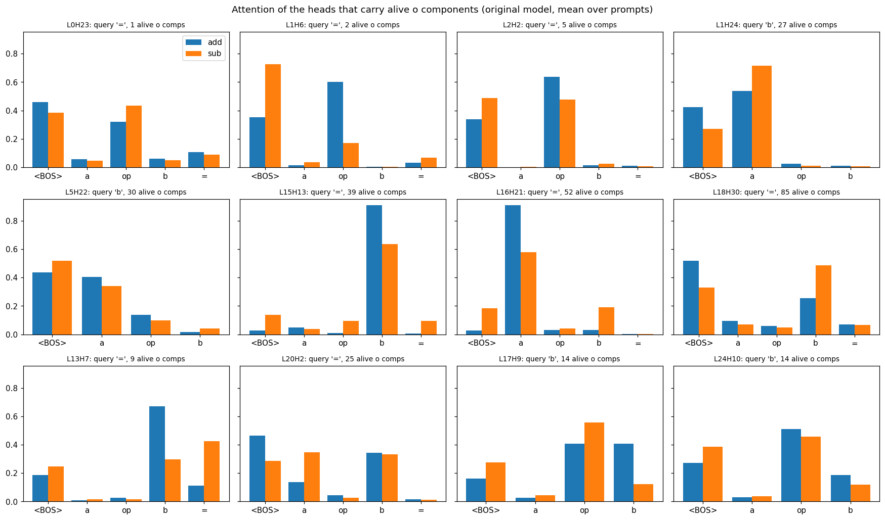
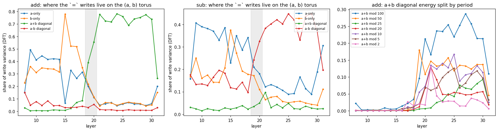
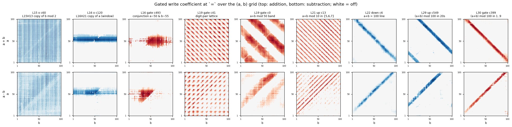
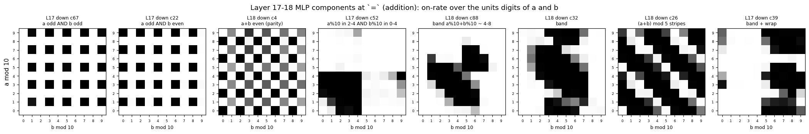
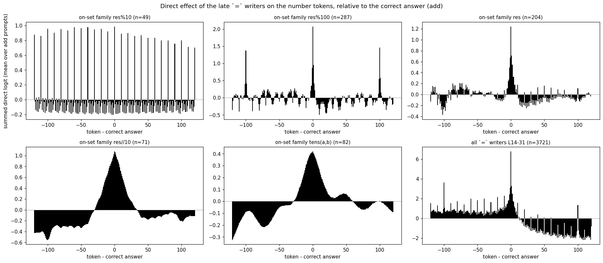
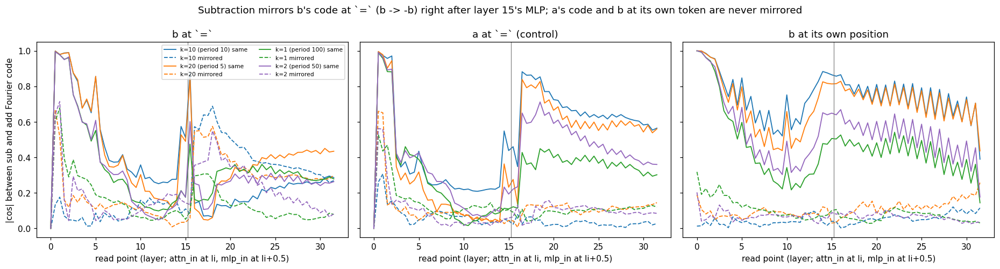

# What the components appear to do: a descriptive reading of the `a ± b =` decomposition

<!-- GENERATED by `python -m param_decomp.arith_repr.autointerp.report_md` from
param_decomp/arith_repr/autointerp/report_template.md — edit the template, not this file. -->

Decomposition `p-ba5a0c05` (`addsub-all-layers-4xh100-05`, step 40000), CI filter
`addsub-05-filter-last-pos-ceiling`: 11,604 alive rank-1 components (down 4753, gate 2779,
up 2299, o 829, v 666, k 168, q 110). Prompts `<BOS> a op b =` for every a, b in 1..100 and
both operations (subtraction includes a < b). Companion of
[`report_representations.md`](report_representations.md), which found the Fourier codes in the
residual stream; working notes in [`scratchpad_auto_interp.md`](scratchpad_auto_interp.md).

**Nothing here is an intervention.** Every claim is read off the decomposition (U, V, the CI of
every component on every prompt and position, its inner activation `x·V`) and the original
model's activations and weights. Each section states the claim, then **why** (the measurement
and the numbers), then the **complete list of components** involved, in collapsible blocks.
Very long catalogues are in [`auto_interp_appendix/`](auto_interp_appendix/).

<b>Method: what is measured, and how to read the tables</b>

**Why on-sets.** Components are sparse: an MLP component is on (CI > 0.01) on 3-6 % of the
prompts at a position on average, and its write coefficient `w = inner · [CI > 0.01]` is
dominated by *which* prompts turn it on. So each component is described first by its on-set,
then by what it writes.

**The measurements** (code in `param_decomp/arith_repr/autointerp/`):

- *On-set label* (`onset_tables.py`): for each component, position and operation, the ON
  indicator over the 10,000 prompts of that operation is regressed on the class means of each
  function in a fixed list (a, b, res, each mod 2/5/10/20/25/50/100, a//10, b//10, res//10, the
  units-digit pair, the tens-digit pair, carry/borrow, sign(a−b), res ≥ 100; only functions of
  the tokens visible at that position). The label is the function with the fewest classes whose
  adjusted R² is within 90 % of the best one.
- *Code shares* (`comp_codes.py`, `code_attrib.py`): the Fourier coefficient `z(k)` of the class
  means of the post-norm residual (what the next layer reads) over a quantity (a, b, or res) is
  a vector; a writer's contribution `w·U` (through the RMSNorm scale) has its own coefficient
  `z_c(k)`, and `Re<z, z_c>/|z|²` is the share of that code the component supplies. The shares
  of all alive writers plus the token embedding add up to 0.8-1.0 for the operand codes and to
  0.87-1.07 for the main periods (2, 5, 10, 20, 50, 100) of the result codes, so the alive
  components account for those codes. The weak mod-4 and mod-25 result codes are less well
  covered (0.33-0.60 at `mlp_in.19`).
- *Grid DFT* (`tuning.py`): the 2-D DFT of `w` over the (a mod 100, b mod 100) torus; energy on
  the a-only and b-only axes and on the a+b and a−b diagonals.
- *Direct logit effect* (`wiring.py`): `W_U · (g_final ⊙ U) / rms` on the tokens "0".."200",
  combined with the component's writes on each prompt.
- *Attention patterns* (`attn_patterns.py`): the original model's, recomputed from the stored
  residuals and the Llama weights. An o component is assigned to the head holding most of its
  `V` (median 79 % of the energy in one head).
- *Mirror test* (`op_phase.py`): per Fourier frequency, compares the sub code with the add code
  (`same`) and with its complex conjugate (`mirrored`, the code of −q).

**How to read the component tables.** `component` = layer, site kind, component index
(o/q components: the head holding most of their weight; k/v: the kv head). `on` = fraction of
the operation's 10,000 prompts on which the component's CI exceeds 0.01 at that position.
`on-set` = the coarsest function of (a, b) visible at the position that explains the on/off
pattern (adjusted R² within 90 % of the best function in a fixed list; `always` = on for > 95 %
of prompts, `unexplained` = no listed function reaches R² 0.5), then the on classes spelled out
completely (`res mod 100 in {1..9, 75}` = on when the result mod 100 is 1-9 or 75; `(tens) res in
{20..29}`; for digit-pair labels, the cells of the units- or tens-digit plane that are on, rows
with the same cells merged). `[coarser: …]` = a coarser period that already explains ≥ 80 % of
the on-rate profile along that quantity. `res` = a+b on addition, a−b on subtraction.
`writes` (o/down only) = the share of each Fourier code of a, b or res that the component's
write supplies, measured at the first read point after it (its contribution's projection on
that code over the code's squared norm, power-weighted over the harmonics of each period; codes
carrying < 0.1 % of the read input's variance and shares below 2 % are omitted; negative = the
component opposes the code). `(reads)` = a q/k/v/gate/up component (it writes into a head or
the MLP hidden layer, not the residual).

**Caveat on causality.** The CI function is a transformer over the whole prompt, so the
*gate* of a component at an early position can depend on later tokens (its inner activation
cannot: the model is causal). 268 of the components whose main position is `a`
have an on-set that differs between + and − prompts (list in section 1.1). In the decomposed
model the operator can therefore switch components at `a` on or off, which the original model
cannot do. The descriptions below report what the components do *given* the CI gate.

## Summary

1. **Operands** ([§1](#1-operands-at-their-own-tokens)): at the `a` and `b` tokens, each
   component is on for a fixed set of values: single values, windows on the number line (often
   one decade), or residue classes mod 10, 50, 5 or 20. The embedding plus the L0-L4 MLPs build
   the operand codes from these value sets; the L11-L15 MLPs rewrite them before they are copied.
2. **Movement** ([§2](#2-how-information-moves-between-positions)): L15H13 copies b and L16H21
   copies a to `=`, routing by position; they carry mostly the short periods (mod 2, 5, 10, 20).
   L0H23, L1H6 and L2H2 bring the operator to `=`.
3. **Result** ([§3](#3-how-the-result-is-computed)): the L16-L18 MLPs combine the two operand
   codes (AND gates of digit classes, a parity XOR, digit-sum bands) into the first result code
   read at L19; the L19-L30 MLPs rewrite it, each layer sharpening the long periods.
4. **Output** ([§4](#4-how-the-result-becomes-the-output-token)): the late components are
   windows on the result mod 100; their writes vote in the logits in factored form (units digit,
   last two digits, magnitude at two resolutions), and the intersection is the answer.
5. **Operator** ([§5](#5-what-the-operation-token-does)): a one-bit op flag is relayed at `=`
   from L0 to L19; on subtraction, sub-only components of the L15 MLP mirror b's code (b → −b);
   after that, the same result machinery produces a−b instead of a+b.
6. **Mechanisms and arrangements** ([report_mechanisms.md](report_mechanisms.md)): the components
   are grouped into 682 mechanisms (codes of one variable in one block, plus the same shape
   written again at other layers), with the conditions and checks behind each grouping, and the
   layer-by-layer geometry of the residue groups. The operand codes keep a simplex-like shape
   while drifting to new directions at every MLP; writers of the same variable write in
   near-orthogonal directions; the units digits of a and b are written by residue tilings at
   L0 and again at L11-L14.

---

## 1. Operands at their own tokens

### 1.1 The components at `a` are value-set detectors

**Claim.** Every component whose main position is `a` is on for a fixed set of values of `a`:
a single value, a window on the number line, a residue class, or a union of these. The same
value is therefore stored many times: by several magnitude bins, by residue classes of several
periods, and individually.

**Why.** At position 1 the model has seen only `<BOS>` and `a`, so the inner activation of
every component there is a function of `a` (verified: zero spread within each value of a). The
on-set labels confirm it: on addition prompts the label is a function of a for all but the
`always`/`unexplained` components, with median R² 1.00. The class counts below are from the
on-set spelled out along `a`.

| on-set class (operation where it is on more) | L0-1 | L2-4 | L5-9 | L10-14 | L15-19 | L20-24 | L25-31 | total |
|---|---|---|---|---|---|---|---|---|
| scattered values | 57 | 97 | 32 | 80 | 204 | 168 | 134 | 772 |
| window (one run) | 104 | 72 | 55 | 102 | 188 | 123 | 64 | 708 |
| single value | 80 | 48 | 29 | 39 | 85 | 90 | 73 | 444 |
| always | 23 | 29 | 46 | 41 | 39 | 35 | 52 | 265 |
| tens-digit set | 23 | 24 | 5 | 11 | 20 | 27 | 20 | 130 |
| residue mod 10 | 20 | 8 | 1 | 45 | 33 | 10 | 1 | 118 |
| residue mod 50 | 4 | 3 | 2 | 4 | 17 | 14 | 14 | 58 |
| residue mod 20 | 0 | 2 | 0 | 7 | 8 | 5 | 4 | 26 |
| residue mod 5 | 2 | 4 | 0 | 2 | 6 | 3 | 4 | 21 |
| unexplained | 2 | 0 | 8 | 0 | 0 | 1 | 0 | 11 |
| rarely on (< 0.5 %) | 2 | 1 | 1 | 0 | 0 | 2 | 2 | 8 |
| residue mod 25 | 0 | 0 | 0 | 0 | 1 | 2 | 1 | 4 |

- *single value* / *window* / *scattered values*: label `a` (100 classes), on-set one value, one
  run of values, or several runs;
- *tens-digit set*: label `a//10`, on for whole decades;
- *residue mod τ*: label `a%τ`, on for the listed residues of a mod τ.

The complete per-class lists are in [appendix A1](auto_interp_appendix/A1_a_token.md).

The 25 (of 268) `a`-position components whose on-rate differs most between + and − prompts

| component | on (add/sub) | on-set (add) | on-set (sub) |
|---|---|---|---|
| L8 k c72 (kv4) | 1% / 23% | unexplained (best R2 0.04) | unexplained (best R2 0.37) |
| L14 v c131 (kv7) | 29% / 47% | unexplained (best R2 0.49) | **a** (R2 0.88): a in {4, 31..49, 51..55, 61..63, 65, 74, 81..94, 96} |
| L18 v c124 (kv7) | 0 / 17% | off (on 0) | **a** (R2 1.00): a in {9, 19, 21, 29, 31, 39, 41, 47, 49, 51, 59, 61, 69, 79, 81, 89, 99} [coarser: a mod 20 in {1, 9, 19}, R2 0.80] |
| L18 v c107 (kv7) | 1% / 15% | unexplained (best R2 0.39) | **a** (R2 1.00): a in {12, 20..25, 32, 42..44, 52, 62, 72, 82} |
| L18 v c98 (kv7) | 9% / 22% | **a%10** (R2 0.88): a mod 10 in {6} | **a** (R2 0.99): a in {6, 16..18, 24, 26..28, 36..37, 45..48, 56..57, 66..67, 76, 86..87, 96} |
| L3 v c230 (kv1) | 0 / 12% | off (on 0) | **a** (R2 1.00): a in {63, 67..74, 77..79} |
| L27 v c152 (kv1) | 0 / 12% | off (on 0) | **a** (R2 1.00): a in {3..10, 12, 16, 24, 26} |
| L5 v c201 (kv5) | 39% / 28% | **a** (R2 0.78): a in {12, 16, 22, 24, 26, 28, 32, 34, 36, 38, 40, 42, 44, 46, 48, 52, 54, 56, 58, 60, 62, 64, 66, 68, 72, 74, 76, 78, 80, 82, 84, 86, 88, 90, 92, 94, 96, 98} [coarser: a mod 10 in {2, 4, 6, 8}, R2 0.82] | unexplained (best R2 0.48) |
| L5 v c190 (kv5) | 14% / 4% | **a** (R2 0.88): a in {4..18} | unexplained (best R2 0.21) |
| L18 v c91 (kv7) | 0 / 11% | off (on 0) | **a** (R2 0.99): a in {68..77, 79} |
| L5 v c13 (kv5) | 27% / 16% | **a//10** (R2 0.87): (tens) a in {74..100} | unexplained (best R2 0.48) |
| L22 v c239 (kv3) | 1% / 11% | **a** (R2 0.50): a in {31} | **a** (R2 0.98): a in {28..33, 52, 55..57, 85} |
| L15 k c81 (kv7) | 10% / 0 | **a** (R2 0.60): a in {86..88, 92..93, 96..98} | off (on 0) |
| L18 v c233 (kv7) | 2% / 12% | unexplained (best R2 0.32) | **a** (R2 1.00): a in {18..29} |
| L18 v c49 (kv7) | 2% / 11% | **a** (R2 0.54): a in {62, 82} | **a** (R2 0.99): a in {12, 22, 32, 42, 52, 61..62, 72, 82..83, 92} [coarser: a mod 50 in {12, 22, 32, 42}, R2 0.85] |
| L22 v c113 (kv3) | 3% / 12% | unexplained (best R2 0.42) | **a** (R2 1.00): a in {40..51} |
| L3 v c180 (kv1) | 3% / 12% | **a** (R2 0.99): a in {11, 51, 53} | **a** (R2 0.99): a in {11, 31, 41, 43, 46..47, 49, 51..53, 61, 81} |
| L5 v c48 (kv5) | 24% / 15% | **a** (R2 0.91): a in {66..89} | unexplained (best R2 0.46) |
| L22 v c15 (kv3) | 1% / 10% | **a** (R2 0.70): a in {6} | **a%10** (R2 1.00): a mod 10 in {6} |
| L22 v c192 (kv3) | 6% / 14% | **a** (R2 0.56): a in {34, 36..38} | **a** (R2 1.00): a in {30..42, 45} |
| L18 v c78 (kv7) | 1% / 9% | unexplained (best R2 0.13) | **a** (R2 0.98): a in {16, 24, 32, 36, 48, 52, 56, 64, 72} |
| L3 k c135 (kv1) | 9% / 1% | **a** (R2 1.00): a in {21, 50..52, 55..57, 62, 65} | **a** (R2 0.96): a in {55} |
| L18 v c211 (kv1) | 0 / 8% | off (on 0) | **a** (R2 1.00): a in {49, 51..57} |
| L3 k c80 (kv1) | 0 / 8% | off (on 0) | **a** (R2 0.90): a in {20, 41..42, 61..62, 70, 81} |
| L22 v c212 (kv3) | 0 / 8% | off (on 0) | **a** (R2 1.00): a in {20..27} |

Complete list: [appendix A1](auto_interp_appendix/A1_a_token.md#on-set-depends-on-the-operator).

### 1.2 Which components build which code of `a`

**Claim.** Before layer 0's MLP, the token embedding is the whole code (the earlier sweep
found its linear and mod-5 parts strongest). The layer-0 MLP then writes most of the mod 2/5/10
codes before layer 1 reads them: the mod-10 code at `mlp_in.1` comes from **ten L0 down
components, one per units digit** (c145: a ≡ 0, c36: 1, c81: 2, c52: 3, c62: 4, c45: 5, c55: 6,
c44: 7, c50: 8, c38: 9 mod 10). The same ten write the mod-2 code, and with c162 (a ≡ 0 mod 5)
the mod-5 code. The long periods come from tens-digit sets (c6: a in 51..100; c23: 1..39;
c22: 61..79). The L2-L4 MLPs add to them. By
layer 12, the L11 MLP has rewritten the mod-10 code, and at the point L16H21 reads `a`, the
code comes mainly from the L11-L15 MLPs. Attention writes nothing measurable into the `a` codes
at the `a` token.

**Why.** Code attribution at each read point along position `a`: the table in each block
gives, per period, the fraction of the code that each (layer, attention|MLP) group supplies and
the total explained. The collapsed lists give every component supplying at least 2 % of a
period's code, with its share and on-set. The value sets of the top writers are the residues of
that period, e.g. the mod-10 code at `mlp_in.1` is written by layer-0 components that detect
single units digits.

`mlp_in.0` at `a` (addition prompts): who writes the a code

| period | total explained | groups supplying ≥ 2 % |
|---|---|---|
| mod 100 | 1.05 | embedding +1.05 |
| mod 50 | 1.05 | embedding +1.05 |
| mod 25 | 1.05 | embedding +1.05 |
| mod 20 | 1.05 | embedding +1.05 |
| mod 10 | 1.05 | embedding +1.05 |
| mod 5 | 1.05 | embedding +1.05 |
| mod 4 | 1.06 | embedding +1.06 |
| mod 2 | 1.05 | embedding +1.05 |

`mlp_in.1` at `a` (addition prompts): who writes the a code

| period | total explained | groups supplying ≥ 2 % |
|---|---|---|
| mod 100 | 0.90 | L0 MLP +0.53, embedding +0.37 |
| mod 50 | 0.89 | L0 MLP +0.50, embedding +0.39 |
| mod 25 | 0.86 | L0 MLP +0.43, embedding +0.43 |
| mod 20 | 0.90 | L0 MLP +0.48, embedding +0.41 |
| mod 10 | 0.96 | L0 MLP +0.59, embedding +0.37 |
| mod 5 | 0.97 | L0 MLP +0.58, embedding +0.38 |
| mod 4 | 0.82 | embedding +0.51, L0 MLP +0.30 |
| mod 2 | 1.02 | L0 MLP +0.62, embedding +0.40 |

- **mod 100** (3 writers): L0 down c6 +9% ((tens) a in {51..100}); L0 down c5 +8% (a in {13..96}); L0 down c23 +5% ((tens) a in {1..39})
- **mod 50** (3 writers): L0 down c6 +4% ((tens) a in {51..100}); L0 down c23 +3% ((tens) a in {1..39}); L0 down c22 +2% ((tens) a in {61..79})
- **mod 25** (1 writers): L0 down c252 +2% ((tens) a in {1..9})
- **mod 20** (1 writers): L0 down c252 +3% ((tens) a in {1..9})
- **mod 10** (10 writers): L0 down c36 +7% (a mod 10 in {1}); L0 down c38 +6% (a mod 10 in {9}); L0 down c145 +5% (a mod 10 in {0}); L0 down c45 +4% (a mod 10 in {5}); L0 down c52 +4% (a mod 10 in {3}); L0 down c62 +4% (a mod 10 in {4}); L0 down c44 +4% (a mod 10 in {7}); L0 down c50 +4% (a mod 10 in {8}); L0 down c55 +4% (a mod 10 in {6}); L0 down c81 +4% (a mod 10 in {2})
- **mod 5** (11 writers): L0 down c162 +10% (a mod 5 in {0}); L0 down c36 +7% (a mod 10 in {1}); L0 down c38 +6% (a mod 10 in {9}); L0 down c45 +5% (a mod 10 in {5}); L0 down c145 +4% (a mod 10 in {0}); L0 down c62 +4% (a mod 10 in {4}); L0 down c55 +4% (a mod 10 in {6}); L0 down c50 +4% (a mod 10 in {8}); L0 down c44 +4% (a mod 10 in {7}); L0 down c52 +4% (a mod 10 in {3}); L0 down c81 +3% (a mod 10 in {2})
- **mod 4** (1 writers): L0 down c127 +7% (a in {16, 24, 32, 36, 48, 64, 72, 96})
- **mod 2** (10 writers): L0 down c36 +7% (a mod 10 in {1}); L0 down c38 +7% (a mod 10 in {9}); L0 down c52 +6% (a mod 10 in {3}); L0 down c44 +6% (a mod 10 in {7}); L0 down c45 +6% (a mod 10 in {5}); L0 down c50 +6% (a mod 10 in {8}); L0 down c55 +5% (a mod 10 in {6}); L0 down c62 +5% (a mod 10 in {4}); L0 down c145 +5% (a mod 10 in {0}); L0 down c81 +4% (a mod 10 in {2})

`mlp_in.2` at `a` (addition prompts): who writes the a code

| period | total explained | groups supplying ≥ 2 % |
|---|---|---|
| mod 100 | 0.81 | L0 MLP +0.39, embedding +0.26, L1 MLP +0.15 |
| mod 50 | 0.80 | L0 MLP +0.38, embedding +0.28, L1 MLP +0.13 |
| mod 25 | 0.74 | L0 MLP +0.34, embedding +0.31, L1 MLP +0.09 |
| mod 20 | 0.78 | L0 MLP +0.36, embedding +0.30, L1 MLP +0.12 |
| mod 10 | 0.84 | L0 MLP +0.45, embedding +0.29, L1 MLP +0.11 |
| mod 5 | 0.83 | L0 MLP +0.45, embedding +0.30, L1 MLP +0.08 |
| mod 4 | 0.66 | embedding +0.39, L0 MLP +0.25, L1 MLP +0.03 |
| mod 2 | 0.87 | L0 MLP +0.50, embedding +0.32, L1 MLP +0.05 |

- **mod 100** (5 writers): L0 down c6 +7% ((tens) a in {51..100}); L0 down c5 +6% (a in {13..96}); L1 down c96 +4% ((tens) a in {1..27}); L0 down c23 +3% ((tens) a in {1..39}); L1 down c17 +3% (always)
- **mod 50** (3 writers): L1 down c96 +4% ((tens) a in {1..27}); L0 down c6 +3% ((tens) a in {51..100}); L0 down c23 +2% ((tens) a in {1..39})
- **mod 20** (1 writers): L0 down c252 +2% ((tens) a in {1..9})
- **mod 10** (10 writers): L0 down c36 +6% (a mod 10 in {1}); L0 down c38 +4% (a mod 10 in {9}); L0 down c145 +4% (a mod 10 in {0}); L0 down c45 +3% (a mod 10 in {5}); L0 down c62 +3% (a mod 10 in {4}); L0 down c50 +3% (a mod 10 in {8}); L0 down c44 +3% (a mod 10 in {7}); L0 down c52 +3% (a mod 10 in {3}); L0 down c55 +3% (a mod 10 in {6}); L0 down c81 +3% (a mod 10 in {2})
- **mod 5** (11 writers): L0 down c162 +8% (a mod 5 in {0}); L0 down c36 +5% (a mod 10 in {1}); L0 down c38 +4% (a mod 10 in {9}); L0 down c45 +3% (a mod 10 in {5}); L0 down c145 +3% (a mod 10 in {0}); L0 down c62 +3% (a mod 10 in {4}); L0 down c55 +3% (a mod 10 in {6}); L0 down c50 +3% (a mod 10 in {8}); L0 down c44 +3% (a mod 10 in {7}); L0 down c52 +3% (a mod 10 in {3}); L0 down c81 +2% (a mod 10 in {2})
- **mod 4** (1 writers): L0 down c127 +6% (a in {16, 24, 32, 36, 48, 64, 72, 96})
- **mod 2** (10 writers): L0 down c36 +6% (a mod 10 in {1}); L0 down c38 +6% (a mod 10 in {9}); L0 down c52 +5% (a mod 10 in {3}); L0 down c44 +5% (a mod 10 in {7}); L0 down c45 +4% (a mod 10 in {5}); L0 down c50 +4% (a mod 10 in {8}); L0 down c62 +4% (a mod 10 in {4}); L0 down c55 +4% (a mod 10 in {6}); L0 down c145 +4% (a mod 10 in {0}); L0 down c81 +4% (a mod 10 in {2})

`mlp_in.3` at `a` (addition prompts): who writes the a code

| period | total explained | groups supplying ≥ 2 % |
|---|---|---|
| mod 100 | 0.74 | L2 MLP +0.25, L0 MLP +0.24, embedding +0.15, L1 MLP +0.09 |
| mod 50 | 0.72 | L0 MLP +0.24, L2 MLP +0.23, embedding +0.17, L1 MLP +0.08 |
| mod 25 | 0.65 | L0 MLP +0.22, L2 MLP +0.19, embedding +0.18, L1 MLP +0.06 |
| mod 20 | 0.68 | L0 MLP +0.25, embedding +0.18, L2 MLP +0.18, L1 MLP +0.08 |
| mod 10 | 0.74 | L0 MLP +0.31, embedding +0.18, L2 MLP +0.16, L1 MLP +0.07 |
| mod 5 | 0.76 | L0 MLP +0.29, L2 MLP +0.24, embedding +0.18, L1 MLP +0.05 |
| mod 4 | 0.56 | embedding +0.23, L0 MLP +0.17, L2 MLP +0.14 |
| mod 2 | 0.76 | L0 MLP +0.36, embedding +0.21, L2 MLP +0.15, L1 MLP +0.04 |

- **mod 100** (8 writers): L0 down c6 +5% ((tens) a in {51..100}); L0 down c5 +4% (a in {13..96}); L2 down c92 +4% ((tens) a in {70..100}); L2 down c11 +3% (a in {27..49}); L2 down c90 +3% (a in {11..32}); L2 down c79 +3% (a in {1..14}); L1 down c96 +2% ((tens) a in {1..27}); L0 down c23 +2% ((tens) a in {1..39})
- **mod 50** (6 writers): L2 down c92 +3% ((tens) a in {70..100}); L2 down c79 +3% (a in {1..14}); L2 down c90 +3% (a in {11..32}); L1 down c96 +2% ((tens) a in {1..27}); L0 down c6 +2% ((tens) a in {51..100}); L2 down c639 +2% (a in {2..15})
- **mod 25** (1 writers): L2 down c79 +2% (a in {1..14})
- **mod 20** (1 writers): L2 down c79 +3% (a in {1..14})
- **mod 10** (12 writers): L2 down c9 +4% (a in {1..2, 21, 31, 41, 51, 61, 71, 81, 91}); L0 down c36 +4% (a mod 10 in {1}); L0 down c38 +3% (a mod 10 in {9}); L2 down c147 +3% (a mod 50 in {0, 10, 20, 30, 40}); L0 down c145 +3% (a mod 10 in {0}); L0 down c45 +2% (a mod 10 in {5}); L0 down c50 +2% (a mod 10 in {8}); L0 down c62 +2% (a mod 10 in {4}); L0 down c52 +2% (a mod 10 in {3}); L0 down c55 +2% (a mod 10 in {6}); L0 down c44 +2% (a mod 10 in {7}); L0 down c81 +2% (a mod 10 in {2})
- **mod 5** (8 writers): L2 down c473 +12% (a mod 5 in {0}); L0 down c162 +6% (a mod 5 in {0}); L2 down c9 +4% (a in {1..2, 21, 31, 41, 51, 61, 71, 81, 91}); L0 down c36 +3% (a mod 10 in {1}); L0 down c38 +2% (a mod 10 in {9}); L2 down c147 +2% (a mod 50 in {0, 10, 20, 30, 40}); L0 down c145 +2% (a mod 10 in {0}); L0 down c45 +2% (a mod 10 in {5})
- **mod 4** (2 writers): L2 down c118 +6% (a in {16, 24, 32, 36, 44, 46, 48..49, 52, 54, 56, 64, 72, 74, 76, 84, 86, 88, 96}); L0 down c127 +4% (a in {16, 24, 32, 36, 48, 64, 72, 96})
- **mod 2** (13 writers): L0 down c36 +4% (a mod 10 in {1}); L0 down c38 +4% (a mod 10 in {9}); L2 down c118 +4% (a in {16, 24, 32, 36, 44, 46, 48..49, 52, 54, 56, 64, 72, 74, 76, 84, 86, 88, 96}); L0 down c52 +4% (a mod 10 in {3}); L0 down c44 +3% (a mod 10 in {7}); L0 down c50 +3% (a mod 10 in {8}); L0 down c45 +3% (a mod 10 in {5}); L2 down c9 +3% (a in {1..2, 21, 31, 41, 51, 61, 71, 81, 91}); L0 down c62 +3% (a mod 10 in {4}); L0 down c55 +3% (a mod 10 in {6}); L0 down c145 +3% (a mod 10 in {0}); L0 down c81 +3% (a mod 10 in {2}); … 1 more

`mlp_in.5` at `a` (addition prompts): who writes the a code

| period | total explained | groups supplying ≥ 2 % |
|---|---|---|
| mod 100 | 0.70 | L4 MLP +0.17, L3 MLP +0.16, L2 MLP +0.13, L0 MLP +0.12, embedding +0.07, L1 MLP +0.05 |
| mod 50 | 0.70 | L4 MLP +0.17, L3 MLP +0.17, L0 MLP +0.13, L2 MLP +0.11, embedding +0.08, L1 MLP +0.04 |
| mod 25 | 0.59 | L4 MLP +0.14, L3 MLP +0.12, L0 MLP +0.12, L2 MLP +0.10, embedding +0.08, L1 MLP +0.03 |
| mod 20 | 0.63 | L3 MLP +0.16, L0 MLP +0.13, L4 MLP +0.13, L2 MLP +0.09, embedding +0.08, L1 MLP +0.04 |
| mod 10 | 0.73 | L3 MLP +0.20, L0 MLP +0.17, L4 MLP +0.15, embedding +0.08, L2 MLP +0.08, L1 MLP +0.04 |
| mod 5 | 0.73 | L3 MLP +0.20, L0 MLP +0.16, L4 MLP +0.13, L2 MLP +0.12, embedding +0.09, L1 MLP +0.03 |
| mod 4 | 0.46 | embedding +0.11, L0 MLP +0.09, L4 MLP +0.09, L2 MLP +0.08, L3 MLP +0.08 |
| mod 2 | 0.83 | L4 MLP +0.25, L0 MLP +0.20, L3 MLP +0.19, embedding +0.10, L2 MLP +0.07 |

- **mod 100** (5 writers): L4 down c132 +3% (a in {2..23, 25}); L3 down c11 +3% (a in {47..49, 51..100}); L3 down c44 +3% (a in {2..23, 25}); L0 down c6 +3% ((tens) a in {51..100}); L0 down c5 +2% (a in {13..96})
- **mod 50** (3 writers): L4 down c132 +3% (a in {2..23, 25}); L3 down c44 +3% (a in {2..23, 25}); L4 down c158 +2% (a in {83..99})
- **mod 20** (1 writers): L4 down c127 +2% ((tens) a in {1..9})
- **mod 10** (6 writers): L4 down c66 +9% (a mod 10 in {6..9}); L3 down c63 +6% (a mod 10 in {5..7}); L3 down c136 +6% (a mod 10 in {2, 7..9}); L3 down c54 +3% (a mod 10 in {1, 9}); L0 down c36 +2% (a mod 10 in {1}); L2 down c9 +2% (a in {1..2, 21, 31, 41, 51, 61, 71, 81, 91})
- **mod 5** (8 writers): L4 down c43 +10% (a mod 5 in {0}); L3 down c615 +7% (a mod 5 in {0}); L2 down c473 +6% (a mod 5 in {0}); L3 down c68 +5% (a mod 50 in {4, 9, 13..14, 17, 19, 23..24, 27, 29, 33..34, 37, 39, 43..44, 49}); L0 down c162 +3% (a mod 5 in {0}); L3 down c54 +3% (a mod 10 in {1, 9}); L2 down c9 +2% (a in {1..2, 21, 31, 41, 51, 61, 71, 81, 91}); L3 down c63 +2% (a mod 10 in {5..7})
- **mod 4** (4 writers): L3 down c153 +4% (a in {12, 24, 36, 48, 72, 96}); L2 down c118 +3% (a in {16, 24, 32, 36, 44, 46, 48..49, 52, 54, 56, 64, 72, 74, 76, 84, 86, 88, 96}); L4 down c135 +3% (a mod 10 in {0, 2, 4, 6, 8}); L0 down c127 +2% (a in {16, 24, 32, 36, 48, 64, 72, 96})
- **mod 2** (7 writers): L4 down c135 +22% (a mod 10 in {0, 2, 4, 6, 8}); L3 down c54 +8% (a mod 10 in {1, 9}); L3 down c63 +3% (a mod 10 in {5..7}); L0 down c36 +2% (a mod 10 in {1}); L0 down c38 +2% (a mod 10 in {9}); L0 down c44 +2% (a mod 10 in {7}); L0 down c52 +2% (a mod 10 in {3})

`mlp_in.8` at `a` (addition prompts): who writes the a code

| period | total explained | groups supplying ≥ 2 % |
|---|---|---|
| mod 100 | 0.67 | L7 MLP +0.10, L5 MLP +0.10, L6 MLP +0.09, L4 MLP +0.09, L3 MLP +0.08, L0 MLP +0.07, L2 MLP +0.07, embedding +0.03, L1 MLP +0.03 |
| mod 50 | 0.66 | L4 MLP +0.10, L5 MLP +0.09, L7 MLP +0.09, L3 MLP +0.09, L6 MLP +0.08, L0 MLP +0.08, L2 MLP +0.07, embedding +0.04, L1 MLP +0.03 |
| mod 25 | 0.55 | L4 MLP +0.08, L0 MLP +0.07, L3 MLP +0.07, L6 MLP +0.07, L5 MLP +0.07, L7 MLP +0.07, L2 MLP +0.06, embedding +0.04, L1 MLP +0.02 |
| mod 20 | 0.58 | L3 MLP +0.10, L0 MLP +0.08, L4 MLP +0.08, L7 MLP +0.06, L5 MLP +0.06, L6 MLP +0.06, L2 MLP +0.05, embedding +0.04, L1 MLP +0.03 |
| mod 10 | 0.60 | L3 MLP +0.14, L0 MLP +0.12, L4 MLP +0.10, L2 MLP +0.05, L6 MLP +0.05, embedding +0.04, L5 MLP +0.04, L7 MLP +0.03, L1 MLP +0.03 |
| mod 5 | 0.57 | L3 MLP +0.12, L0 MLP +0.10, L4 MLP +0.09, L2 MLP +0.07, L5 MLP +0.07, embedding +0.05, L6 MLP +0.04 |
| mod 4 | 0.40 | L4 MLP +0.06, L0 MLP +0.06, L2 MLP +0.05, embedding +0.05, L3 MLP +0.05, L5 MLP +0.04, L6 MLP +0.04, L7 MLP +0.04 |
| mod 2 | 0.61 | L4 MLP +0.18, L0 MLP +0.13, L3 MLP +0.12, embedding +0.05, L2 MLP +0.05, L5 MLP +0.03, L6 MLP +0.02 |

- **mod 100** (3 writers): L7 down c5 +5% (a in {3..23, 25..31}); L6 down c25 +4% (a in {2..31}); L5 down c27 +3% (a in {2..31})
- **mod 50** (4 writers): L5 down c27 +3% (a in {2..31}); L7 down c5 +3% (a in {3..23, 25..31}); L6 down c25 +2% (a in {2..31}); L5 down c124 +2% (a in {1..12})
- **mod 20** (1 writers): L5 down c124 +2% (a in {1..12})
- **mod 10** (4 writers): L4 down c66 +7% (a mod 10 in {6..9}); L3 down c63 +4% (a mod 10 in {5..7}); L3 down c136 +4% (a mod 10 in {2, 7..9}); L3 down c54 +2% (a mod 10 in {1, 9})
- **mod 5** (7 writers): L4 down c43 +7% (a mod 5 in {0}); L5 down c28 +6% (a in {10, 15, 20, 25, 30, 35, 40, 45, 50, 52, 55, 60, 70, 75, 80, 90, 99..100}); L2 down c473 +4% (a mod 5 in {0}); L3 down c615 +4% (a mod 5 in {0}); L3 down c68 +3% (a mod 50 in {4, 9, 13..14, 17, 19, 23..24, 27, 29, 33..34, 37, 39, 43..44, 49}); L6 down c244 +2% (a in {40, 50, 60, 100}); L0 down c162 +2% (a mod 5 in {0})
- **mod 4** (3 writers): L3 down c153 +2% (a in {12, 24, 36, 48, 72, 96}); L2 down c118 +2% (a in {16, 24, 32, 36, 44, 46, 48..49, 52, 54, 56, 64, 72, 74, 76, 84, 86, 88, 96}); L5 down c332 +2% (a in {24, 36, 48, 72})
- **mod 2** (2 writers): L4 down c135 +17% (a mod 10 in {0, 2, 4, 6, 8}); L3 down c54 +5% (a mod 10 in {1, 9})

`mlp_in.12` at `a` (addition prompts): who writes the a code

| period | total explained | groups supplying ≥ 2 % |
|---|---|---|
| mod 100 | 0.65 | L11 MLP +0.14, L4 MLP +0.07, L0 MLP +0.06, L3 MLP +0.06, L5 MLP +0.06, L7 MLP +0.05, L6 MLP +0.05, L2 MLP +0.05, embedding +0.02, L1 MLP +0.02 |
| mod 50 | 0.66 | L11 MLP +0.16, L4 MLP +0.08, L0 MLP +0.07, L3 MLP +0.07, L5 MLP +0.05, L2 MLP +0.05, L7 MLP +0.05, L6 MLP +0.04, embedding +0.02, L10 MLP +0.02, L1 MLP +0.02 |
| mod 25 | 0.59 | L11 MLP +0.12, L0 MLP +0.07, L4 MLP +0.07, L3 MLP +0.06, L2 MLP +0.04, L5 MLP +0.04, L6 MLP +0.04, L7 MLP +0.04, L10 MLP +0.03, embedding +0.03 |
| mod 20 | 0.62 | L11 MLP +0.17, L0 MLP +0.08, L3 MLP +0.08, L4 MLP +0.06, L2 MLP +0.04, L5 MLP +0.03, L7 MLP +0.03, L1 MLP +0.03, L6 MLP +0.03, embedding +0.02 |
| mod 10 | 0.71 | L11 MLP +0.28, L3 MLP +0.10, L0 MLP +0.10, L4 MLP +0.08, L2 MLP +0.03, embedding +0.03, L1 MLP +0.02 |
| mod 5 | 0.63 | L11 MLP +0.20, L3 MLP +0.09, L0 MLP +0.09, L4 MLP +0.06, L2 MLP +0.05, L5 MLP +0.04, embedding +0.03 |
| mod 4 | 0.36 | L4 MLP +0.06, L0 MLP +0.05, L2 MLP +0.04, L3 MLP +0.04, L5 MLP +0.04, L7 MLP +0.03, embedding +0.03, L6 MLP +0.03, L10 MLP +0.02 |
| mod 2 | 0.67 | L4 MLP +0.15, L11 MLP +0.14, L9 MLP +0.11, L0 MLP +0.09, L3 MLP +0.08, embedding +0.03, L2 MLP +0.02 |

- **mod 100** (3 writers): L7 down c5 +2% (a in {3..23, 25..31}); L6 down c25 +2% (a in {2..31}); L11 down c10 +2% (a in {58..71})
- **mod 50** (2 writers): L11 down c31 +2% (a in {8..23}); L11 down c10 +2% (a in {58..71})
- **mod 20** (3 writers): L11 down c18 +3% (a in {50..62}); L11 down c22 +2% (a in {87..100}); L11 down c30 +2% (a in {68..79})
- **mod 10** (10 writers): L11 down c20 +8% (a mod 50 in {2, 11..12, 21..23, 31..33, 41..43}); L4 down c66 +6% (a mod 10 in {6..9}); L11 down c27 +5% (a mod 10 in {5}); L3 down c63 +4% (a mod 10 in {5..7}); L11 down c26 +4% (a in {4, 14, 23..24, 34, 42..44, 54, 64, 74, 84, 94}); L3 down c136 +3% (a mod 10 in {2, 7..9}); L11 down c42 +3% (a mod 10 in {0}); L11 down c36 +2% (a mod 10 in {7}); L11 down c40 +2% (a mod 20 in {8, 18}); L11 down c63 +2% (a mod 10 in {6})
- **mod 5** (9 writers): L4 down c43 +5% (a mod 5 in {0}); L11 down c27 +4% (a mod 10 in {5}); L11 down c20 +4% (a mod 50 in {2, 11..12, 21..23, 31..33, 41..43}); L11 down c42 +4% (a mod 10 in {0}); L5 down c28 +3% (a in {10, 15, 20, 25, 30, 35, 40, 45, 50, 52, 55, 60, 70, 75, 80, 90, 99..100}); L2 down c473 +3% (a mod 5 in {0}); L3 down c68 +3% (a mod 50 in {4, 9, 13..14, 17, 19, 23..24, 27, 29, 33..34, 37, 39, 43..44, 49}); L3 down c615 +3% (a mod 5 in {0}); L11 down c36 +2% (a mod 10 in {7})
- **mod 2** (6 writers): L4 down c135 +14% (a mod 10 in {0, 2, 4, 6, 8}); L9 down c64 +10% (a mod 50 in {9, 11, 13, 17, 19, 21, 23, 29, 31, 33, 37, 39, 41, 43, 47, 49}); L3 down c54 +4% (a mod 10 in {1, 9}); L11 down c26 +3% (a in {4, 14, 23..24, 34, 42..44, 54, 64, 74, 84, 94}); L11 down c42 +3% (a mod 10 in {0}); L11 down c63 +2% (a mod 10 in {6})

`attn_in.16` at `a` (addition prompts): who writes the a code

| period | total explained | groups supplying ≥ 2 % |
|---|---|---|
| mod 100 | 0.80 | L14 MLP +0.15, L15 MLP +0.14, L13 MLP +0.11, L12 MLP +0.07, L11 MLP +0.06, L0 MLP +0.05, L4 MLP +0.05, L3 MLP +0.04, L2 MLP +0.04, L5 MLP +0.03, L7 MLP +0.02, L6 MLP +0.02 |
| mod 50 | 0.81 | L15 MLP +0.13, L13 MLP +0.13, L14 MLP +0.12, L12 MLP +0.07, L11 MLP +0.07, L0 MLP +0.06, L4 MLP +0.05, L3 MLP +0.04, L2 MLP +0.03, L5 MLP +0.02 |
| mod 25 | 0.77 | L15 MLP +0.17, L14 MLP +0.13, L13 MLP +0.10, L12 MLP +0.06, L11 MLP +0.05, L0 MLP +0.05, L4 MLP +0.04, L3 MLP +0.04, L2 MLP +0.03 |
| mod 20 | 0.83 | L15 MLP +0.15, L12 MLP +0.14, L14 MLP +0.13, L13 MLP +0.12, L11 MLP +0.07, L0 MLP +0.06, L3 MLP +0.05, L4 MLP +0.03, L2 MLP +0.02 |
| mod 10 | 0.92 | L13 MLP +0.21, L14 MLP +0.16, L12 MLP +0.15, L11 MLP +0.09, L0 MLP +0.06, L3 MLP +0.06, L15 MLP +0.06, L4 MLP +0.05 |
| mod 5 | 0.89 | L13 MLP +0.20, L14 MLP +0.20, L12 MLP +0.10, L15 MLP +0.10, L11 MLP +0.07, L0 MLP +0.06, L3 MLP +0.05, L4 MLP +0.03, L2 MLP +0.02 |
| mod 4 | 0.66 | L15 MLP +0.26, L14 MLP +0.22, L12 MLP +0.03, L0 MLP +0.03, L13 MLP +0.02, L4 MLP +0.02 |
| mod 2 | 0.84 | L14 MLP +0.18, L13 MLP +0.13, L4 MLP +0.10, L0 MLP +0.07, L12 MLP +0.07, L9 MLP +0.06, L15 MLP +0.06, L11 MLP +0.06, L3 MLP +0.05, embedding +0.02 |

- **mod 100** (2 writers): L14 down c8 +5% ((tens) a in {1..40, 42, 44..48}); L13 down c10 +2% (a in {75..98})
- **mod 50** (1 writers): L13 down c10 +2% (a in {75..98})
- **mod 20** (2 writers): L12 down c9 +6% (a mod 20 in {10..14}); L12 down c73 +3% (a in {15..17, 35..37, 39, 55..59, 75..77, 79, 95..99})
- **mod 10** (17 writers): L13 down c11 +4% (a mod 10 in {8}); L13 down c9 +4% (a mod 10 in {7}); L4 down c66 +4% (a mod 10 in {6..9}); L12 down c31 +3% (a mod 10 in {5..7}); L14 down c14 +3% (a mod 10 in {4}); L13 down c38 +3% (a mod 10 in {0, 9}); L12 down c7 +3% (a mod 10 in {9}); L11 down c20 +3% (a mod 50 in {2, 11..12, 21..23, 31..33, 41..43}); L14 down c15 +3% (a mod 10 in {2}); L13 down c13 +3% (a mod 10 in {5}); L13 down c15 +3% (a mod 10 in {3}); L14 down c21 +3% (a mod 10 in {9}); … 5 more
- **mod 5** (14 writers): L15 down c70 +6% (a mod 5 in {0}); L14 down c18 +5% (a mod 5 in {0}); L13 down c13 +4% (a mod 10 in {5}); L13 down c9 +3% (a mod 10 in {7}); L14 down c14 +3% (a mod 10 in {4}); L13 down c15 +3% (a mod 10 in {3}); L13 down c11 +3% (a mod 10 in {8}); L12 down c7 +3% (a mod 10 in {9}); L14 down c15 +3% (a mod 10 in {2}); L12 down c19 +3% (a mod 10 in {0}); L14 down c21 +3% (a mod 10 in {9}); L12 down c15 +2% (a mod 10 in {1}); … 2 more
- **mod 4** (2 writers): L15 down c42 +20% (a in {12, 16, 24, 32, 36, 40, 44, 48, 56, 64, 72, 76, 80, 84, 96}); L14 down c42 +14% (a in {12, 18, 22, 32, 38, 42..43, 48, 58, 62, 72, 78, 82..83, 98})
- **mod 2** (14 writers): L4 down c135 +10% (a mod 10 in {0, 2, 4, 6, 8}); L9 down c64 +6% (a mod 50 in {9, 11, 13, 17, 19, 21, 23, 29, 31, 33, 37, 39, 41, 43, 47, 49}); L14 down c14 +4% (a mod 10 in {4}); L14 down c15 +3% (a mod 10 in {2}); L15 down c42 +3% (a in {12, 16, 24, 32, 36, 40, 44, 48, 56, 64, 72, 76, 80, 84, 96}); L14 down c21 +3% (a mod 10 in {9}); L13 down c15 +3% (a mod 10 in {3}); L14 down c33 +3% (a mod 10 in {6}); L13 down c9 +3% (a mod 10 in {7}); L3 down c54 +2% (a mod 10 in {1, 9}); L13 down c13 +2% (a mod 10 in {5}); L12 down c19 +2% (a mod 10 in {0}); … 2 more

`attn_in.18` at `a` (addition prompts): who writes the a code

| period | total explained | groups supplying ≥ 2 % |
|---|---|---|
| mod 100 | 0.84 | L16 MLP +0.18, L17 MLP +0.16, L14 MLP +0.09, L15 MLP +0.08, L13 MLP +0.07, L12 MLP +0.04, L11 MLP +0.04, L0 MLP +0.03, L4 MLP +0.03, L3 MLP +0.03, L2 MLP +0.02 |
| mod 50 | 0.83 | L17 MLP +0.16, L16 MLP +0.13, L15 MLP +0.08, L14 MLP +0.08, L13 MLP +0.08, L12 MLP +0.05, L11 MLP +0.05, L0 MLP +0.04, L4 MLP +0.03, L3 MLP +0.03, L2 MLP +0.02 |
| mod 25 | 0.80 | L17 MLP +0.16, L16 MLP +0.14, L15 MLP +0.11, L14 MLP +0.09, L13 MLP +0.07, L12 MLP +0.04, L11 MLP +0.04, L0 MLP +0.03, L4 MLP +0.03, L3 MLP +0.03 |
| mod 20 | 0.82 | L17 MLP +0.14, L16 MLP +0.11, L15 MLP +0.10, L12 MLP +0.09, L14 MLP +0.09, L13 MLP +0.08, L11 MLP +0.05, L0 MLP +0.04, L3 MLP +0.03, L4 MLP +0.02 |
| mod 10 | 0.90 | L13 MLP +0.17, L17 MLP +0.12, L14 MLP +0.12, L12 MLP +0.11, L16 MLP +0.09, L11 MLP +0.07, L0 MLP +0.05, L3 MLP +0.04, L4 MLP +0.03, L15 MLP +0.03 |
| mod 5 | 0.90 | L17 MLP +0.19, L13 MLP +0.14, L14 MLP +0.13, L16 MLP +0.11, L12 MLP +0.07, L15 MLP +0.06, L11 MLP +0.05, L0 MLP +0.04, L3 MLP +0.03 |
| mod 4 | 0.72 | L15 MLP +0.17, L14 MLP +0.15, L17 MLP +0.14, L16 MLP +0.14, L12 MLP +0.02, L0 MLP +0.02 |
| mod 2 | 0.85 | L14 MLP +0.13, L17 MLP +0.10, L13 MLP +0.10, L16 MLP +0.10, L4 MLP +0.08, L0 MLP +0.05, L12 MLP +0.05, L9 MLP +0.05, L15 MLP +0.04, L11 MLP +0.04, L3 MLP +0.04 |

- **mod 100** (5 writers): L14 down c8 +3% ((tens) a in {1..40, 42, 44..48}); L16 down c5 +3% ((tens) a in {32..100}); L16 down c9 +3% ((tens) a in {80, 82..100}); L17 down c58 +2% ((tens) a in {1..21}); L16 down c3 +2% (a in {32..58})
- **mod 50** (2 writers): L17 down c58 +2% ((tens) a in {1..21}); L16 down c9 +2% ((tens) a in {80, 82..100})
- **mod 20** (1 writers): L12 down c9 +4% (a mod 20 in {10..14})
- **mod 10** (12 writers): L13 down c11 +3% (a mod 10 in {8}); L13 down c9 +3% (a mod 10 in {7}); L16 down c34 +3% (a mod 10 in {8}); L4 down c66 +3% (a mod 10 in {6..9}); L12 down c31 +3% (a mod 10 in {5..7}); L14 down c14 +2% (a mod 10 in {4}); L12 down c7 +2% (a mod 10 in {9}); L13 down c38 +2% (a mod 10 in {0, 9}); L11 down c20 +2% (a mod 50 in {2, 11..12, 21..23, 31..33, 41..43}); L13 down c13 +2% (a mod 10 in {5}); L14 down c15 +2% (a mod 10 in {2}); L16 down c74 +2% (a mod 10 in {7})
- **mod 5** (10 writers): L17 down c8 +12% (a mod 5 in {0}); L15 down c70 +4% (a mod 5 in {0}); L16 down c50 +4% (a in {16, 21, 26, 31, 41, 46, 51, 61, 71, 76, 81, 86, 91}); L14 down c18 +3% (a mod 5 in {0}); L13 down c13 +3% (a mod 10 in {5}); L13 down c9 +2% (a mod 10 in {7}); L13 down c11 +2% (a mod 10 in {8}); L16 down c34 +2% (a mod 10 in {8}); L14 down c14 +2% (a mod 10 in {4}); L16 down c120 +2% (a mod 50 in {0, 10, 20, 25, 30, 40})
- **mod 4** (4 writers): L15 down c42 +13% (a in {12, 16, 24, 32, 36, 40, 44, 48, 56, 64, 72, 76, 80, 84, 96}); L14 down c42 +10% (a in {12, 18, 22, 32, 38, 42..43, 48, 58, 62, 72, 78, 82..83, 98}); L16 down c30 +7% (a in {24, 32, 36, 48, 64, 72, 96}); L17 down c66 +2% (a in {12, 24, 36, 42, 48, 72})
- **mod 2** (11 writers): L4 down c135 +8% (a mod 10 in {0, 2, 4, 6, 8}); L9 down c64 +5% (a mod 50 in {9, 11, 13, 17, 19, 21, 23, 29, 31, 33, 37, 39, 41, 43, 47, 49}); L16 down c34 +3% (a mod 10 in {8}); L14 down c14 +3% (a mod 10 in {4}); L15 down c42 +3% (a in {12, 16, 24, 32, 36, 40, 44, 48, 56, 64, 72, 76, 80, 84, 96}); L14 down c21 +2% (a mod 10 in {9}); L14 down c15 +2% (a mod 10 in {2}); L17 down c54 +2% (a in {6, 26, 36, 46, 56, 60, 66, 76, 86, 96}); L13 down c9 +2% (a mod 10 in {7}); L13 down c11 +2% (a mod 10 in {8}); L14 down c33 +2% (a mod 10 in {6})

`attn_in.20` at `a` (addition prompts): who writes the a code

| period | total explained | groups supplying ≥ 2 % |
|---|---|---|
| mod 100 | 0.85 | L16 MLP +0.13, L19 MLP +0.12, L17 MLP +0.11, L18 MLP +0.09, L14 MLP +0.07, L15 MLP +0.06, L13 MLP +0.05, L12 MLP +0.03, L0 MLP +0.03, L11 MLP +0.03, L4 MLP +0.03, L3 MLP +0.02, L2 MLP +0.02 |
| mod 50 | 0.82 | L17 MLP +0.11, L16 MLP +0.10, L19 MLP +0.09, L18 MLP +0.08, L15 MLP +0.07, L14 MLP +0.06, L13 MLP +0.06, L12 MLP +0.04, L11 MLP +0.04, L0 MLP +0.03, L4 MLP +0.03, L3 MLP +0.03 |
| mod 25 | 0.80 | L17 MLP +0.12, L16 MLP +0.10, L15 MLP +0.09, L19 MLP +0.08, L18 MLP +0.08, L14 MLP +0.07, L13 MLP +0.05, L12 MLP +0.03, L0 MLP +0.03, L11 MLP +0.03, L3 MLP +0.02, L4 MLP +0.02 |
| mod 20 | 0.81 | L17 MLP +0.10, L15 MLP +0.08, L12 MLP +0.08, L16 MLP +0.08, L14 MLP +0.07, L19 MLP +0.07, L13 MLP +0.06, L18 MLP +0.06, L11 MLP +0.04, L0 MLP +0.04, L3 MLP +0.03, L4 MLP +0.02 |
| mod 10 | 0.89 | L13 MLP +0.15, L12 MLP +0.10, L14 MLP +0.10, L17 MLP +0.10, L16 MLP +0.07, L19 MLP +0.07, L11 MLP +0.06, L18 MLP +0.05, L0 MLP +0.04, L3 MLP +0.04, L4 MLP +0.03, L15 MLP +0.03 |
| mod 5 | 0.88 | L17 MLP +0.14, L13 MLP +0.12, L14 MLP +0.11, L16 MLP +0.09, L19 MLP +0.08, L12 MLP +0.06, L18 MLP +0.06, L15 MLP +0.04, L11 MLP +0.04, L0 MLP +0.04, L3 MLP +0.03 |
| mod 4 | 0.70 | L15 MLP +0.13, L14 MLP +0.12, L17 MLP +0.11, L16 MLP +0.10, L19 MLP +0.08, L18 MLP +0.04 |
| mod 2 | 0.80 | L14 MLP +0.11, L13 MLP +0.08, L16 MLP +0.08, L17 MLP +0.08, L19 MLP +0.07, L4 MLP +0.07, L0 MLP +0.05, L12 MLP +0.05, L9 MLP +0.04, L18 MLP +0.04, L3 MLP +0.04, L11 MLP +0.03, L15 MLP +0.03 |

- **mod 100** (5 writers): L19 down c10 +3% (a in {64..100}); L19 down c13 +3% (a in {32..49, 51..99}); L18 down c13 +3% (a in {2..52, 55, 60, 75, 90, 100}); L14 down c8 +3% ((tens) a in {1..40, 42, 44..48}); L16 down c5 +2% ((tens) a in {32..100})
- **mod 20** (1 writers): L12 down c9 +4% (a mod 20 in {10..14})
- **mod 10** (7 writers): L13 down c9 +3% (a mod 10 in {7}); L13 down c11 +3% (a mod 10 in {8}); L19 down c52 +3% (a in {1..2, 21, 31, 41, 51, 61, 71, 81, 91}); L4 down c66 +2% (a mod 10 in {6..9}); L12 down c31 +2% (a mod 10 in {5..7}); L12 down c7 +2% (a mod 10 in {9}); L16 down c34 +2% (a mod 10 in {8})
- **mod 5** (6 writers): L17 down c8 +9% (a mod 5 in {0}); L19 down c47 +4% (a mod 50 in {0, 15, 20, 25, 30, 35, 40, 45}); L15 down c70 +3% (a mod 5 in {0}); L16 down c50 +3% (a in {16, 21, 26, 31, 41, 46, 51, 61, 71, 76, 81, 86, 91}); L14 down c18 +3% (a mod 5 in {0}); L13 down c13 +2% (a mod 10 in {5})
- **mod 4** (4 writers): L15 down c42 +10% (a in {12, 16, 24, 32, 36, 40, 44, 48, 56, 64, 72, 76, 80, 84, 96}); L14 down c42 +8% (a in {12, 18, 22, 32, 38, 42..43, 48, 58, 62, 72, 78, 82..83, 98}); L16 down c30 +5% (a in {24, 32, 36, 48, 64, 72, 96}); L19 down c206 +4% (a in {8, 16, 32, 40, 64, 80})
- **mod 2** (7 writers): L4 down c135 +7% (a mod 10 in {0, 2, 4, 6, 8}); L9 down c64 +4% (a mod 50 in {9, 11, 13, 17, 19, 21, 23, 29, 31, 33, 37, 39, 41, 43, 47, 49}); L16 down c34 +3% (a mod 10 in {8}); L14 down c21 +2% (a mod 10 in {9}); L14 down c14 +2% (a mod 10 in {4}); L14 down c15 +2% (a mod 10 in {2}); L13 down c9 +2% (a mod 10 in {7})

Complete list: [every component supplying ≥ 2 % of a a code, per read point and period](auto_interp_appendix/S1_code_builders.md).

### 1.3 The same for `b`, at the `b` token

**Claim.** b's codes are built the same way: the embedding, then the layer-0 MLP and the
L3-L4 MLPs. They are rewritten by the L12-L14 MLPs just before L15H13 reads them
(`attn_in.15`).

`attn_in.2` at `b` (addition prompts): who writes the b code

| period | total explained | groups supplying ≥ 2 % |
|---|---|---|
| mod 100 | 0.81 | L0 MLP +0.38, embedding +0.24, L1 MLP +0.19 |
| mod 50 | 0.80 | L0 MLP +0.39, embedding +0.24, L1 MLP +0.17 |
| mod 25 | 0.73 | L0 MLP +0.33, embedding +0.28, L1 MLP +0.12 |
| mod 20 | 0.81 | L0 MLP +0.40, embedding +0.25, L1 MLP +0.16 |
| mod 10 | 0.88 | L0 MLP +0.47, embedding +0.24, L1 MLP +0.17 |
| mod 5 | 0.86 | L0 MLP +0.46, embedding +0.25, L1 MLP +0.15 |
| mod 4 | 0.60 | embedding +0.35, L0 MLP +0.22, L1 MLP +0.03 |
| mod 2 | 0.82 | L0 MLP +0.46, embedding +0.26, L1 MLP +0.10 |

- **mod 100** (4 writers): L0 down c6 +9% ((tens) b in {54..100}); L0 down c5 +6% (b in {16..89, 91..92}); L1 down c12 +5% (a//10 in {1} -> b//10 in {0}; a//10 in {2} -> b//10 in {0,1,4,5,6,7,8,9}; a//10 in {3} -> b//10 in {0,1,2,3,4,5,6,7,8,9,10}; a//10 in {4,5} -> b//10 in {0,1,2,4,5,6,7,8,9,10}; a//10 in {6,7,8} -> b//10 in {0,1,2,5,6,7,8,9,10}; a//10 in {9,10} -> b//10 in {0,1,2,6,7,8,9,10}); L0 down c23 +4% ((tens) b in {1..39})
- **mod 50** (4 writers): L0 down c6 +4% ((tens) b in {54..100}); L1 down c12 +3% (a//10 in {1} -> b//10 in {0}; a//10 in {2} -> b//10 in {0,1,4,5,6,7,8,9}; a//10 in {3} -> b//10 in {0,1,2,3,4,5,6,7,8,9,10}; a//10 in {4,5} -> b//10 in {0,1,2,4,5,6,7,8,9,10}; a//10 in {6,7,8} -> b//10 in {0,1,2,5,6,7,8,9,10}; a//10 in {9,10} -> b//10 in {0,1,2,6,7,8,9,10}); L0 down c23 +2% ((tens) b in {1..39}); L0 down c22 +2% ((tens) b in {61..79})
- **mod 20** (2 writers): L1 down c62 +3% ((tens) b in {1..9}); L1 down c271 +2% ((tens) b in {55, 80..89})
- **mod 10** (14 writers): L1 down c140 +5% (b in {5, 15..16, 24..26, 35, 45, 55, 64..66, 75..76, 84..86, 95..96}); L0 down c38 +5% (b mod 10 in {9}); L0 down c44 +4% (b mod 10 in {7}); L0 down c52 +4% (b mod 10 in {3}); L0 down c45 +4% (b mod 10 in {5}); L0 down c55 +4% (b mod 10 in {6}); L0 down c81 +4% (b mod 10 in {2}); L0 down c62 +4% (b mod 10 in {4}); L0 down c36 +4% (b mod 10 in {1}); L0 down c50 +4% (b mod 10 in {8}); L0 down c145 +3% (b mod 10 in {0}); L1 down c356 +3% (b mod 10 in {9}); … 2 more
- **mod 5** (15 writers): L0 down c162 +5% (b mod 5 in {0}); L0 down c38 +5% (b mod 10 in {9}); L0 down c55 +4% (b mod 10 in {6}); L0 down c62 +4% (b mod 10 in {4}); L0 down c44 +4% (b mod 10 in {7}); L0 down c45 +4% (b mod 10 in {5}); L0 down c52 +4% (b mod 10 in {3}); L0 down c50 +4% (b mod 10 in {8}); L0 down c36 +4% (b mod 10 in {1}); L1 down c329 +4% (b mod 10 in {0}); L1 down c356 +4% (b mod 10 in {9}); L0 down c81 +3% (b mod 10 in {2}); … 3 more
- **mod 4** (1 writers): L0 down c127 +10% (b in {16, 24, 32, 36, 48, 56, 64, 72, 96})
- **mod 2** (13 writers): L0 down c52 +5% (b mod 10 in {3}); L0 down c44 +5% (b mod 10 in {7}); L0 down c38 +5% (b mod 10 in {9}); L0 down c50 +5% (b mod 10 in {8}); L0 down c55 +4% (b mod 10 in {6}); L0 down c45 +4% (b mod 10 in {5}); L0 down c62 +4% (b mod 10 in {4}); L0 down c36 +4% (b mod 10 in {1}); L1 down c401 +3% (b mod 10 in {7}); L0 down c81 +3% (b mod 10 in {2}); L1 down c356 +3% (b mod 10 in {9}); L0 down c145 +3% (b mod 10 in {0}); … 1 more

`attn_in.15` at `b` (addition prompts): who writes the b code

| period | total explained | groups supplying ≥ 2 % |
|---|---|---|
| mod 100 | 0.75 | L14 MLP +0.18, L13 MLP +0.13, L12 MLP +0.10, L11 MLP +0.05, L0 MLP +0.04, L4 MLP +0.03, L9 MLP +0.03, L10 MLP +0.03, L7 MLP +0.03, L3 MLP +0.02, L8 MLP +0.02, L5 MLP +0.02 |
| mod 50 | 0.71 | L14 MLP +0.17, L13 MLP +0.16, L12 MLP +0.10, L11 MLP +0.05, L0 MLP +0.04, L4 MLP +0.03, L3 MLP +0.03 |
| mod 25 | 0.61 | L14 MLP +0.16, L13 MLP +0.12, L12 MLP +0.08, L11 MLP +0.04, L0 MLP +0.03, L4 MLP +0.03 |
| mod 20 | 0.68 | L12 MLP +0.19, L14 MLP +0.13, L13 MLP +0.13, L0 MLP +0.04, L11 MLP +0.04, L3 MLP +0.02, L4 MLP +0.02 |
| mod 10 | 0.85 | L13 MLP +0.24, L14 MLP +0.17, L12 MLP +0.16, L11 MLP +0.08, L0 MLP +0.05, L3 MLP +0.04, L4 MLP +0.04, embedding +0.02 |
| mod 5 | 0.80 | L13 MLP +0.23, L14 MLP +0.20, L12 MLP +0.11, L11 MLP +0.06, L0 MLP +0.05, L3 MLP +0.04, embedding +0.03, L4 MLP +0.02 |
| mod 4 | 0.43 | L14 MLP +0.17, L12 MLP +0.07, L13 MLP +0.03, L4 MLP +0.03, L0 MLP +0.02, embedding +0.02 |
| mod 2 | 0.70 | L14 MLP +0.18, L13 MLP +0.12, L4 MLP +0.12, L12 MLP +0.06, L0 MLP +0.06, L11 MLP +0.04, L3 MLP +0.04, embedding +0.03 |

- **mod 100** (5 writers): L14 down c8 +3% ((tens) b in {1..39}); L14 down c0 +2% (always); L13 down c10 +2% (b in {75..99}); L14 down c34 +2% ((tens) b in {80, 82..100}); L12 down c68 +2% (a//10 in {1} -> b//10 in {0}; a//10 in {2} -> b//10 in {0,1}; a//10 in {3} -> b//10 in {0,1,2}; a//10 in {4} -> b//10 in {0,1,2,3}; a//10 in {5} -> b//10 in {0,1,2,3,4}; a//10 in {6,7} -> b//10 in {0,1,2,3,4,5}; a//10 in {8} -> b//10 in {0,1,2,3,4,5,6}; a//10 in {9} -> b//10 in {0,1,2,3,4,5,6,7}; a//10 in {10} -> b//10 in {0,1,2,3,4,5,6,7,8})
- **mod 50** (2 writers): L14 down c34 +3% ((tens) b in {80, 82..100}); L13 down c10 +3% (b in {75..99})
- **mod 20** (2 writers): L12 down c9 +9% (b mod 20 in {10..14}); L12 down c73 +5% (b mod 20 in {15..19})
- **mod 10** (16 writers): L13 down c38 +4% (b mod 10 in {0, 9}); L13 down c13 +4% (b mod 10 in {5}); L12 down c31 +4% (b mod 10 in {5..7}); L13 down c9 +4% (b mod 10 in {7}); L14 down c15 +3% (b mod 10 in {2}); L13 down c11 +3% (b mod 10 in {8}); L14 down c14 +3% (b mod 10 in {4}); L4 down c66 +3% (b mod 10 in {6..9}); L12 down c32 +3% (b mod 10 in {2..4}); L13 down c15 +3% (b mod 10 in {3}); L11 down c20 +3% (b mod 10 in {1..3}); L14 down c71 +3% (b mod 10 in {1}); … 4 more
- **mod 5** (12 writers): L13 down c13 +5% (b mod 10 in {5}); L13 down c9 +4% (b mod 10 in {7}); L14 down c15 +3% (b mod 10 in {2}); L14 down c14 +3% (b mod 10 in {4}); L13 down c15 +3% (b mod 10 in {3}); L13 down c11 +3% (b mod 10 in {8}); L14 down c18 +3% (b mod 10 in {0}); L14 down c21 +3% (b mod 10 in {9}); L13 down c38 +3% (b mod 10 in {0, 9}); L12 down c15 +3% (b mod 10 in {1}); L14 down c71 +2% (b mod 10 in {1}); L12 down c7 +2% (b mod 10 in {9})
- **mod 4** (2 writers): L14 down c42 +10% (b in {38, 58, 62, 78, 82..83, 98}); L12 down c9 +3% (b mod 20 in {10..14})
- **mod 2** (9 writers): L4 down c135 +12% (b mod 2 in {0}); L14 down c15 +4% (b mod 10 in {2}); L14 down c14 +4% (b mod 10 in {4}); L13 down c13 +3% (b mod 10 in {5}); L14 down c21 +3% (b mod 10 in {9}); L13 down c15 +3% (b mod 10 in {3}); L14 down c33 +3% (b mod 10 in {6}); L13 down c9 +2% (b mod 10 in {7}); L14 down c71 +2% (b mod 10 in {1})

`mlp_in.0` at `b` (addition prompts): who writes the b code

| period | total explained | groups supplying ≥ 2 % |
|---|---|---|
| mod 100 | 1.02 | embedding +1.02 |
| mod 50 | 1.02 | embedding +1.02 |
| mod 25 | 1.02 | embedding +1.02 |
| mod 20 | 1.02 | embedding +1.02 |
| mod 10 | 1.02 | embedding +1.02 |
| mod 5 | 1.02 | embedding +1.02 |
| mod 4 | 1.02 | embedding +1.02 |
| mod 2 | 1.02 | embedding +1.02 |

`mlp_in.1` at `b` (addition prompts): who writes the b code

| period | total explained | groups supplying ≥ 2 % |
|---|---|---|
| mod 100 | 0.93 | embedding +0.52, L0 MLP +0.41 |
| mod 50 | 0.92 | embedding +0.54, L0 MLP +0.38 |
| mod 25 | 0.91 | embedding +0.60, L0 MLP +0.30 |
| mod 20 | 0.93 | embedding +0.57, L0 MLP +0.35 |
| mod 10 | 0.99 | embedding +0.53, L0 MLP +0.46 |
| mod 5 | 1.00 | embedding +0.53, L0 MLP +0.46 |
| mod 4 | 0.86 | embedding +0.64, L0 MLP +0.22 |
| mod 2 | 1.00 | embedding +0.50, L0 MLP +0.50 |

- **mod 100** (3 writers): L0 down c6 +9% ((tens) b in {54..100}); L0 down c5 +6% (b in {16..89, 91..92}); L0 down c23 +4% ((tens) b in {1..39})
- **mod 50** (2 writers): L0 down c6 +4% ((tens) b in {54..100}); L0 down c23 +2% ((tens) b in {1..39})
- **mod 10** (10 writers): L0 down c38 +5% (b mod 10 in {9}); L0 down c145 +4% (b mod 10 in {0}); L0 down c36 +4% (b mod 10 in {1}); L0 down c44 +4% (b mod 10 in {7}); L0 down c50 +4% (b mod 10 in {8}); L0 down c45 +4% (b mod 10 in {5}); L0 down c52 +3% (b mod 10 in {3}); L0 down c62 +3% (b mod 10 in {4}); L0 down c55 +3% (b mod 10 in {6}); L0 down c81 +3% (b mod 10 in {2})
- **mod 5** (11 writers): L0 down c162 +7% (b mod 5 in {0}); L0 down c38 +5% (b mod 10 in {9}); L0 down c36 +4% (b mod 10 in {1}); L0 down c45 +4% (b mod 10 in {5}); L0 down c50 +4% (b mod 10 in {8}); L0 down c44 +3% (b mod 10 in {7}); L0 down c62 +3% (b mod 10 in {4}); L0 down c55 +3% (b mod 10 in {6}); L0 down c145 +3% (b mod 10 in {0}); L0 down c52 +3% (b mod 10 in {3}); L0 down c81 +3% (b mod 10 in {2})
- **mod 4** (1 writers): L0 down c127 +10% (b in {16, 24, 32, 36, 48, 56, 64, 72, 96})
- **mod 2** (11 writers): L0 down c38 +6% (b mod 10 in {9}); L0 down c44 +5% (b mod 10 in {7}); L0 down c52 +5% (b mod 10 in {3}); L0 down c50 +5% (b mod 10 in {8}); L0 down c45 +5% (b mod 10 in {5}); L0 down c55 +4% (b mod 10 in {6}); L0 down c62 +4% (b mod 10 in {4}); L0 down c36 +4% (b mod 10 in {1}); L0 down c81 +4% (b mod 10 in {2}); L0 down c145 +3% (b mod 10 in {0}); L0 down c127 +2% (b in {16, 24, 32, 36, 48, 56, 64, 72, 96})

`mlp_in.2` at `b` (addition prompts): who writes the b code

| period | total explained | groups supplying ≥ 2 % |
|---|---|---|
| mod 100 | 0.81 | embedding +0.32, L0 MLP +0.27, L1 MLP +0.20, L2 attn +0.02 |
| mod 50 | 0.79 | embedding +0.34, L0 MLP +0.25, L1 MLP +0.18 |
| mod 25 | 0.73 | embedding +0.39, L0 MLP +0.21, L1 MLP +0.10 |
| mod 20 | 0.77 | embedding +0.38, L0 MLP +0.24, L1 MLP +0.13 |
| mod 10 | 0.86 | embedding +0.37, L0 MLP +0.33, L1 MLP +0.15 |
| mod 5 | 0.86 | embedding +0.36, L0 MLP +0.33, L1 MLP +0.14, L2 attn +0.03 |
| mod 4 | 0.65 | embedding +0.44, L0 MLP +0.17, L1 MLP +0.03 |
| mod 2 | 0.84 | L0 MLP +0.38, embedding +0.37, L1 MLP +0.08 |

- **mod 100** (4 writers): L1 down c12 +8% (a//10 in {1} -> b//10 in {0}; a//10 in {2} -> b//10 in {0,1,4,5,6,7,8,9}; a//10 in {3} -> b//10 in {0,1,2,3,4,5,6,7,8,9,10}; a//10 in {4,5} -> b//10 in {0,1,2,4,5,6,7,8,9,10}; a//10 in {6,7,8} -> b//10 in {0,1,2,5,6,7,8,9,10}; a//10 in {9,10} -> b//10 in {0,1,2,6,7,8,9,10}); L0 down c6 +6% ((tens) b in {54..100}); L0 down c5 +4% (b in {16..89, 91..92}); L0 down c23 +3% ((tens) b in {1..39})
- **mod 50** (3 writers): L1 down c12 +4% (a//10 in {1} -> b//10 in {0}; a//10 in {2} -> b//10 in {0,1,4,5,6,7,8,9}; a//10 in {3} -> b//10 in {0,1,2,3,4,5,6,7,8,9,10}; a//10 in {4,5} -> b//10 in {0,1,2,4,5,6,7,8,9,10}; a//10 in {6,7,8} -> b//10 in {0,1,2,5,6,7,8,9,10}; a//10 in {9,10} -> b//10 in {0,1,2,6,7,8,9,10}); L0 down c6 +3% ((tens) b in {54..100}); L1 down c62 +3% ((tens) b in {1..9})
- **mod 25** (1 writers): L1 down c62 +3% ((tens) b in {1..9})
- **mod 20** (1 writers): L1 down c62 +3% ((tens) b in {1..9})
- **mod 10** (14 writers): L0 down c38 +4% (b mod 10 in {9}); L1 down c329 +3% (b mod 10 in {0}); L1 down c140 +3% (b in {5, 15..16, 24..26, 35, 45, 55, 64..66, 75..76, 84..86, 95..96}); L0 down c36 +3% (b mod 10 in {1}); L0 down c145 +3% (b mod 10 in {0}); L1 down c356 +3% (b mod 10 in {9}); L0 down c44 +3% (b mod 10 in {7}); L0 down c50 +3% (b mod 10 in {8}); L0 down c62 +3% (b mod 10 in {4}); L0 down c55 +3% (b mod 10 in {6}); L0 down c45 +2% (b mod 10 in {5}); L0 down c52 +2% (b mod 10 in {3}); … 2 more
- **mod 5** (13 writers): L0 down c162 +5% (b mod 5 in {0}); L1 down c329 +5% (b mod 10 in {0}); L0 down c38 +4% (b mod 10 in {9}); L0 down c36 +3% (b mod 10 in {1}); L0 down c45 +3% (b mod 10 in {5}); L0 down c55 +3% (b mod 10 in {6}); L1 down c356 +3% (b mod 10 in {9}); L0 down c62 +3% (b mod 10 in {4}); L0 down c145 +3% (b mod 10 in {0}); L0 down c50 +2% (b mod 10 in {8}); L0 down c44 +2% (b mod 10 in {7}); L0 down c52 +2% (b mod 10 in {3}); … 1 more
- **mod 4** (1 writers): L0 down c127 +7% (b in {16, 24, 32, 36, 48, 56, 64, 72, 96})
- **mod 2** (12 writers): L0 down c38 +5% (b mod 10 in {9}); L0 down c44 +4% (b mod 10 in {7}); L0 down c52 +4% (b mod 10 in {3}); L0 down c55 +3% (b mod 10 in {6}); L0 down c50 +3% (b mod 10 in {8}); L0 down c45 +3% (b mod 10 in {5}); L0 down c62 +3% (b mod 10 in {4}); L0 down c36 +3% (b mod 10 in {1}); L0 down c81 +3% (b mod 10 in {2}); L1 down c356 +3% (b mod 10 in {9}); L0 down c145 +3% (b mod 10 in {0}); L1 down c401 +2% (b mod 10 in {7})

`mlp_in.5` at `b` (addition prompts): who writes the b code

| period | total explained | groups supplying ≥ 2 % |
|---|---|---|
| mod 100 | 0.58 | L4 MLP +0.17, L3 MLP +0.12, L0 MLP +0.08, embedding +0.07, L2 MLP +0.07, L1 MLP +0.05 |
| mod 50 | 0.51 | L4 MLP +0.13, L3 MLP +0.10, L0 MLP +0.08, embedding +0.07, L2 MLP +0.05, L1 MLP +0.04 |
| mod 25 | 0.38 | L4 MLP +0.08, embedding +0.08, L0 MLP +0.07, L3 MLP +0.06, L2 MLP +0.04, L1 MLP +0.03 |
| mod 20 | 0.42 | L4 MLP +0.09, L0 MLP +0.08, L3 MLP +0.08, embedding +0.07, L2 MLP +0.04, L1 MLP +0.04 |
| mod 10 | 0.54 | L0 MLP +0.13, L3 MLP +0.12, L4 MLP +0.11, embedding +0.10, L1 MLP +0.05, L2 MLP +0.02 |
| mod 5 | 0.55 | L3 MLP +0.12, L0 MLP +0.11, embedding +0.10, L4 MLP +0.09, L2 MLP +0.05, L1 MLP +0.04 |
| mod 4 | 0.30 | embedding +0.10, L4 MLP +0.08, L0 MLP +0.06, L3 MLP +0.02, L2 MLP +0.02 |
| mod 2 | 0.64 | L4 MLP +0.25, L0 MLP +0.15, embedding +0.11, L3 MLP +0.10, L1 MLP +0.03 |

- **mod 100** (4 writers): L4 down c70 +4% (cmp(a,b)=-1: 0.03, cmp(a,b)=0: 0.00, cmp(a,b)=1: 0.96); L3 down c10 +4% ((tens) b in {1..70, 73, 75, 100}); L4 down c21 +3% ((tens) b in {68, 70..85, 87..100}); L0 down c6 +2% ((tens) b in {54..100})
- **mod 50** (1 writers): L4 down c327 +3% (b in {1..13})
- **mod 20** (1 writers): L4 down c327 +3% (b in {1..13})
- **mod 10** (4 writers): L4 down c66 +8% (b mod 10 in {6..9}); L3 down c63 +4% (b mod 10 in {5..7}); L3 down c136 +3% (b mod 10 in {7..9}); L3 down c54 +2% (b mod 10 in {1, 9})
- **mod 5** (4 writers): L4 down c43 +6% (b mod 50 in {0, 5, 10, 15, 20, 25, 30, 35, 40, 45}); L2 down c473 +4% (b mod 5 in {0}); L3 down c615 +4% (b mod 5 in {0}); L3 down c68 +3% (b mod 10 in {3..4, 9})
- **mod 4** (2 writers): L4 down c135 +4% (b mod 2 in {0}); L0 down c127 +3% (b in {16, 24, 32, 36, 48, 56, 64, 72, 96})
- **mod 2** (2 writers): L4 down c135 +24% (b mod 2 in {0}); L3 down c54 +5% (b mod 10 in {1, 9})

Complete list: [every component supplying ≥ 2 % of a b code, per read point and period](auto_interp_appendix/S1_code_builders.md).

**The same components encode whichever operand is at the current token.** Many of the writers
of b's codes at `b` are the very components that write a's codes at `a`, with the same value
set: e.g. L13 down c13 is on for a mod 10 = 5 at `a` and for b mod 10 = 5 at `b`; L12 down c9
for a mod 20 in 10..14 and b mod 20 in 10..14; L4 down c135 for even a and even b. The
419 components below have exactly the same on-set at both operand tokens
(the value set of a at `a` equals the value set of b at `b`, on addition prompts).

All 419 components with the same value set at both operand tokens

| component | on at a / at b (add) | on-set at `a` | on-set at `b` | writes at `a` | writes at `b` |
|---|---|---|---|---|---|
| L0 down c22 | 19% / 19% | (tens) a in {61..79} | (tens) b in {61..79} | a: mod100 +2%, mod50 +3% | b: mod100 +2%, mod50 +3% |
| L0 down c23 | 39% / 39% | (tens) a in {1..39} | (tens) b in {1..39} | a: mod100 +7%, mod50 +5% | b: mod100 +7%, mod50 +5% |
| L0 down c30 | 9% / 9% | a in {23..31} | b in {23..31} | a: mod50 +3%, mod25 +3%, mod20 +4% | b: mod50 +2%, mod25 +2%, mod20 +3% |
| L0 down c36 | 10% / 10% | a mod 10 in {1} | b mod 10 in {1} | a: mod10 +9%, mod5 +8%, mod2 +9% | b: mod10 +6%, mod5 +6%, mod2 +6% |
| L0 down c38 | 10% / 10% | a mod 10 in {9} | b mod 10 in {9} | a: mod10 +7%, mod5 +7%, mod2 +7% | b: mod10 +7%, mod5 +7%, mod2 +7% |
| L0 down c43 | 8% / 8% | a in {3..10} | b in {3..10} | a: mod25 +2%, mod20 +2% | - |
| L0 down c44 | 10% / 10% | a mod 10 in {7} | b mod 10 in {7} | a: mod10 +5%, mod5 +6%, mod2 +8% | b: mod10 +6%, mod5 +6%, mod2 +8% |
| L0 down c45 | 10% / 10% | a mod 10 in {5} | b mod 10 in {5} | a: mod10 +7%, mod5 +7%, mod2 +8% | b: mod10 +6%, mod5 +7%, mod2 +7% |
| L0 down c48 | 8% / 8% | a in {52..59} | b in {52..59} | a: mod50 +2%, mod20 +3% | b: mod20 +3% |
| L0 down c50 | 10% / 10% | a mod 10 in {8} | b mod 10 in {8} | a: mod10 +6%, mod5 +6%, mod2 +9% | b: mod10 +6%, mod5 +6%, mod2 +8% |
| L0 down c52 | 10% / 10% | a mod 10 in {3} | b mod 10 in {3} | a: mod10 +7%, mod5 +6%, mod2 +10% | b: mod10 +6%, mod5 +6%, mod2 +9% |
| L0 down c53 | 5% / 5% | a in {13..17} | b in {13..17} | - | - |
| L0 down c55 | 10% / 10% | a mod 10 in {6} | b mod 10 in {6} | a: mod10 +6%, mod5 +6%, mod2 +7% | b: mod10 +6%, mod5 +6%, mod2 +7% |
| L0 down c58 | 6% / 6% | a in {95..100} | b in {95..100} | - | - |
| L0 down c60 | 5% / 5% | a in {45..49} | b in {45..49} | - | - |
| L0 down c62 | 10% / 10% | a mod 10 in {4} | b mod 10 in {4} | a: mod10 +6%, mod5 +7%, mod2 +7% | b: mod10 +6%, mod5 +6%, mod2 +6% |
| L0 down c63 | 8% / 8% | a in {34..41} | b in {34..41} | a: mod20 +3% | b: mod20 +3% |
| L0 down c69 | 7% / 7% | a in {55..61} | b in {55..61} | a: mod20 +2% | - |
| L0 down c72 | 7% / 7% | a in {75..81} | b in {75..81} | a: mod20 +2% | b: mod20 +2% |
| L0 down c73 | 7% / 7% | a in {93..99} | b in {93..99} | a: mod20 +2% | b: mod20 +2% |
| L0 down c75 | 7% / 7% | a in {73..79} | b in {73..79} | - | b: mod20 +2% |
| L0 down c77 | 7% / 7% | a in {80..86} | b in {80..86} | - | - |
| L0 down c81 | 10% / 10% | a mod 10 in {2} | b mod 10 in {2} | a: mod10 +6%, mod5 +6%, mod2 +5% | b: mod10 +6%, mod5 +5%, mod2 +5% |
| L0 down c85 | 4% / 4% | a in {60..63} | b in {60..63} | - | - |
| L0 down c90 | 10% / 10% | a in {57..65, 67} | b in {57..65, 67} | a: mod20 +2% | b: mod20 +2% |
| L0 down c94 | 8% / 8% | a in {69..76} | b in {69..76} | a: mod25 +2%, mod20 +2% | b: mod25 +2% |
| L0 down c97 | 6% / 6% | a in {85..90} | b in {85..90} | a: mod20 +3% | b: mod20 +3% |
| L0 down c101 | 4% / 4% | a in {16..19} | b in {16..19} | - | - |
| L0 down c105 | 6% / 6% | a in {65..70} | b in {65..70} | a: mod20 +2% | - |
| L0 down c108 | 5% / 5% | a in {69..73} | b in {69..73} | - | - |
| L0 down c119 | 1% / 1% | a in {39} | b in {39} | - | - |
| L0 down c121 | 2% / 2% | a in {11..12} | b in {11..12} | - | - |
| L0 down c123 | 1% / 1% | (tens) a in {100} | (tens) b in {100} | - | - |
| L0 down c133 | 1% / 1% | a in {10} | b in {10} | - | - |
| L0 down c135 | 4% / 4% | a in {50..53} | b in {50..53} | - | - |
| L0 down c141 | 4% / 4% | a in {32..35} | b in {32..35} | - | - |
| L0 down c143 | 7% / 7% | a in {48..54} | b in {48..54} | a: mod25 +2%, mod20 +2% | b: mod25 +2%, mod20 +2% |
| L0 down c145 | 10% / 10% | a mod 10 in {0} | b mod 10 in {0} | a: mod10 +6%, mod5 +4%, mod2 +6% | b: mod10 +5%, mod5 +4%, mod2 +5% |
| L0 down c162 | 19% / 20% | a mod 5 in {0} | b mod 5 in {0} | a: mod5 +11% | b: mod5 +8% |
| L0 down c163 | 2% / 2% | a in {32, 64} | b in {32, 64} | - | - |
| L0 down c165 | 4% / 4% | a in {35, 37..39} | b in {35, 37..39} | - | - |
| L0 down c167 | 1% / 1% | a in {56} | b in {56} | - | - |
| L0 down c169 | 1% / 1% | a in {11} | b in {11} | - | - |
| L0 down c171 | 1% / 1% | a in {26} | b in {26} | - | - |
| L0 down c184 | 1% / 1% | a in {55} | b in {55} | - | - |
| L0 down c189 | 3% / 3% | a in {40..42} | b in {40..42} | - | - |
| L0 down c207 | 1% / 1% | a in {5} | b in {5} | - | - |
| L0 down c213 | 3% / 3% | a in {34..36} | b in {34..36} | - | - |
| L0 down c237 | 1% / 1% | a in {31} | b in {31} | - | - |
| L0 down c253 | 2% / 2% | a in {68..69} | b in {68..69} | - | - |
| L0 down c287 | 4% / 4% | a in {25..28} | b in {25..28} | - | - |
| L0 down c313 | 3% / 3% | a in {23..25} | b in {23..25} | - | - |
| L0 down c318 | 2% / 2% | a in {44, 88} | b in {44, 88} | - | - |
| L0 down c330 | 1% / 1% | a in {89} | b in {89} | - | - |
| L0 down c348 | 1% / 1% | a in {4} | b in {4} | - | - |
| L0 down c349 | 1% / 1% | a in {68} | b in {68} | - | - |
| L0 down c351 | 1% / 1% | a in {8} | b in {8} | - | - |
| L0 down c352 | 1% / 1% | a in {2} | b in {2} | - | - |
| L0 down c376 | 2% / 2% | a in {7, 77} | b in {7, 77} | - | - |
| L0 down c387 | 1% / 1% | a in {46} | b in {46} | - | - |
| L0 down c405 | 1% / 1% | (tens) a in {100} | (tens) b in {100} | - | - |
| L0 down c406 | 1% / 1% | a in {46} | b in {46} | - | - |
| L0 down c467 | 3% / 3% | a in {66, 77, 88} | b in {66, 77, 88} | - | - |
| L0 down c469 | 1% / 1% | a in {34} | b in {34} | - | - |
| L0 down c515 | 1% / 1% | a in {70} | b in {70} | - | - |
| L0 down c572 | 1% / 1% | a in {42} | b in {42} | - | - |
| L0 down c586 | 1% / 1% | a in {99} | b in {99} | - | - |
| L0 down c679 | 1% / 1% | a in {44} | b in {44} | - | - |
| L0 down c687 | 1% / 1% | a in {83} | b in {83} | - | - |
| L0 down c738 | 1% / 1% | a in {86} | b in {86} | - | - |
| L0 down c948 | 1% / 1% | a in {20} | b in {20} | - | - |
| L0 down c984 | 1% / 1% | a in {33} | b in {33} | - | - |
| L0 down c1020 | 1% / 1% | a in {91} | b in {91} | - | - |
| L0 gate c7 | 56% / 56% | a in {43..45, 47..49, 51..100} | b in {43..45, 47..49, 51..100} | (reads) | (reads) |
| L0 gate c19 | 88% / 88% | a in {13..100} | b in {13..100} | (reads) | (reads) |
| L0 gate c21 | 10% / 10% | a in {1..10} | b in {1..10} | (reads) | (reads) |
| L0 gate c22 | 17% / 17% | a in {62..77, 79} | b in {62..77, 79} | (reads) | (reads) |
| L0 gate c36 | 10% / 10% | a in {11, 21, 31, 38, 41, 51, 61, 71, 81, 91} | b in {11, 21, 31, 38, 41, 51, 61, 71, 81, 91} | (reads) | (reads) |
| L0 gate c38 | 10% / 10% | a mod 10 in {9} | b mod 10 in {9} | (reads) | (reads) |
| L0 gate c44 | 20% / 20% | a mod 10 in {4, 7} | b mod 10 in {4, 7} | (reads) | (reads) |
| L0 gate c49 | 2% / 2% | a mod 50 in {0} | b mod 50 in {0} | (reads) | (reads) |
| L0 gate c55 | 10% / 10% | a mod 10 in {6} | b mod 10 in {6} | (reads) | (reads) |
| L0 gate c59 | 8% / 8% | a in {17..24} | b in {17..24} | (reads) | (reads) |
| L0 gate c65 | 2% / 2% | a in {10..11} | b in {10..11} | (reads) | (reads) |
| L0 gate c72 | 4% / 4% | a in {75..78} | b in {75..78} | (reads) | (reads) |
| L0 gate c77 | 2% / 2% | a in {83..84} | b in {83..84} | (reads) | (reads) |
| L0 gate c81 | 10% / 10% | a mod 10 in {2} | b mod 10 in {2} | (reads) | (reads) |
| L0 gate c85 | 10% / 10% | a in {57..65, 67} | b in {57..65, 67} | (reads) | (reads) |
| L0 gate c86 | 1% / 1% | a in {41} | b in {41} | (reads) | (reads) |
| L0 gate c101 | 3% / 3% | a in {18, 38, 78} | b in {18, 38, 78} | (reads) | (reads) |
| L0 gate c104 | 8% / 8% | a in {93..100} | b in {93..100} | (reads) | (reads) |
| L0 gate c108 | 7% / 7% | a in {69..75} | b in {69..75} | (reads) | (reads) |
| L0 gate c112 | 1% / 1% | a in {1} | b in {1} | (reads) | (reads) |
| L0 gate c163 | 2% / 2% | a in {32, 64} | b in {32, 64} | (reads) | (reads) |
| L0 gate c167 | 11% / 11% | (tens) a in {49..59} | (tens) b in {49..59} | (reads) | (reads) |
| L0 gate c184 | 9% / 9% | a in {8, 18, 28, 38, 48, 55, 58, 78, 98} | b in {8, 18, 28, 38, 48, 55, 58, 78, 98} | (reads) | (reads) |
| L0 gate c213 | 8% / 8% | a in {32..39} | b in {32..39} | (reads) | (reads) |
| L0 gate c237 | 8% / 8% | a in {27..34} | b in {27..34} | (reads) | (reads) |
| L0 gate c262 | 1% / 1% | (tens) a in {100} | (tens) b in {100} | (reads) | (reads) |
| L0 gate c269 | 1% / 1% | a in {44} | b in {44} | (reads) | (reads) |
| L0 gate c349 | 10% / 10% | a mod 10 in {8} | b mod 10 in {8} | (reads) | (reads) |
| L0 gate c387 | 2% / 2% | a in {46..47} | b in {46..47} | (reads) | (reads) |
| L0 gate c396 | 26% / 26% | a in {75..100} | b in {75..100} | (reads) | (reads) |
| L0 gate c406 | 1% / 1% | (tens) a in {100} | (tens) b in {100} | (reads) | (reads) |
| L0 gate c456 | 3% / 3% | a in {15..17} | b in {15..17} | (reads) | (reads) |
| L0 gate c460 | 1% / 1% | a in {74} | b in {74} | (reads) | (reads) |
| L0 gate c462 | 1% / 1% | a in {5} | b in {5} | (reads) | (reads) |
| L0 gate c477 | 5% / 5% | a in {45..49} | b in {45..49} | (reads) | (reads) |
| L0 gate c697 | 1% / 1% | (tens) a in {100} | (tens) b in {100} | (reads) | (reads) |
| L0 gate c738 | 1% / 1% | a in {86} | b in {86} | (reads) | (reads) |
| L0 gate c744 | 1% / 1% | a in {52} | b in {52} | (reads) | (reads) |
| L0 gate c764 | 1% / 1% | (tens) a in {100} | (tens) b in {100} | (reads) | (reads) |
| L0 gate c795 | 2% / 2% | a in {68..69} | b in {68..69} | (reads) | (reads) |
| L0 gate c813 | 5% / 5% | a in {25..29} | b in {25..29} | (reads) | (reads) |
| L0 gate c834 | 1% / 1% | a in {90} | b in {90} | (reads) | (reads) |
| L0 up c5 | 74% / 74% | a in {26..99} | b in {26..99} | (reads) | (reads) |
| L0 up c6 | 18% / 18% | a in {82..99} | b in {82..99} | (reads) | (reads) |
| L0 up c18 | 1% / 1% | a in {99} | b in {99} | (reads) | (reads) |
| L0 up c29 | 1% / 1% | a in {68} | b in {68} | (reads) | (reads) |
| L0 up c36 | 10% / 10% | a mod 10 in {1} | b mod 10 in {1} | (reads) | (reads) |
| L0 up c38 | 3% / 3% | a in {49, 59, 69} | b in {49, 59, 69} | (reads) | (reads) |
| L0 up c41 | 4% / 4% | a in {1..4} | b in {1..4} | (reads) | (reads) |
| L0 up c43 | 3% / 3% | a in {7..9} | b in {7..9} | (reads) | (reads) |
| L0 up c44 | 1% / 1% | a in {87} | b in {87} | (reads) | (reads) |
| L0 up c45 | 10% / 10% | a mod 10 in {5} | b mod 10 in {5} | (reads) | (reads) |
| L0 up c48 | 1% / 1% | a in {54} | b in {54} | (reads) | (reads) |
| L0 up c52 | 19% / 20% | a mod 10 in {3, 6} | b mod 10 in {3, 6} | (reads) | (reads) |
| L0 up c53 | 2% / 2% | a in {13..14} | b in {13..14} | (reads) | (reads) |
| L0 up c55 | 1% / 1% | a in {46} | b in {46} | (reads) | (reads) |
| L0 up c62 | 1% / 1% | a in {34} | b in {34} | (reads) | (reads) |
| L0 up c63 | 1% / 1% | a in {38} | b in {38} | (reads) | (reads) |
| L0 up c72 | 8% / 8% | a in {73..80} | b in {73..80} | (reads) | (reads) |
| L0 up c73 | 1% / 1% | a in {98} | b in {98} | (reads) | (reads) |
| L0 up c75 | 1% / 1% | a in {77} | b in {77} | (reads) | (reads) |
| L0 up c90 | 1% / 1% | a in {62} | b in {62} | (reads) | (reads) |
| L0 up c91 | 5% / 5% | a in {9, 97..100} | b in {9, 97..100} | (reads) | (reads) |
| L0 up c97 | 7% / 7% | a in {85..91} | b in {85..91} | (reads) | (reads) |
| L0 up c101 | 4% / 4% | a in {16..19} | b in {16..19} | (reads) | (reads) |
| L0 up c105 | 2% / 2% | a in {66..67} | b in {66..67} | (reads) | (reads) |
| L0 up c119 | 7% / 7% | a in {35..41} | b in {35..41} | (reads) | (reads) |
| L0 up c121 | 5% / 5% | a in {10..14} | b in {10..14} | (reads) | (reads) |
| L0 up c123 | 1% / 1% | (tens) a in {100} | (tens) b in {100} | (reads) | (reads) |
| L0 up c130 | 46% / 46% | (tens) a in {54..99} | (tens) b in {54..99} | (reads) | (reads) |
| L0 up c133 | 1% / 1% | a in {10} | b in {10} | (reads) | (reads) |
| L0 up c135 | 4% / 4% | a in {49..52} | b in {49..52} | (reads) | (reads) |
| L0 up c145 | 10% / 10% | a mod 10 in {0} | b mod 10 in {0} | (reads) | (reads) |
| L0 up c148 | 1% / 1% | a in {22} | b in {22} | (reads) | (reads) |
| L0 up c162 | 20% / 20% | a mod 5 in {0} | b mod 5 in {0} | (reads) | (reads) |
| L0 up c167 | 1% / 1% | a in {56} | b in {56} | (reads) | (reads) |
| L0 up c170 | 5% / 5% | a in {41..45} | b in {41..45} | (reads) | (reads) |
| L0 up c171 | 9% / 9% | a in {23..31} | b in {23..31} | (reads) | (reads) |
| L0 up c182 | 3% / 3% | a in {1..3} | b in {1..3} | (reads) | (reads) |
| L0 up c207 | 1% / 1% | a in {5} | b in {5} | (reads) | (reads) |
| L0 up c216 | 1% / 1% | (tens) a in {100} | (tens) b in {100} | (reads) | (reads) |
| L0 up c237 | 1% / 1% | a in {31} | b in {31} | (reads) | (reads) |
| L0 up c252 | 11% / 11% | a in {1..11} | b in {1..11} | (reads) | (reads) |
| L0 up c265 | 27% / 27% | a in {10..36} | b in {10..36} | (reads) | (reads) |
| L0 up c266 | 3% / 3% | a in {6, 26, 66} | b in {6, 26, 66} | (reads) | (reads) |
| L0 up c318 | 4% / 4% | a in {33, 44, 55, 88} | b in {33, 44, 55, 88} | (reads) | (reads) |
| L0 up c348 | 2% / 2% | a in {4, 94} | b in {4, 94} | (reads) | (reads) |
| L0 up c351 | 2% / 2% | a in {8, 88} | b in {8, 88} | (reads) | (reads) |
| L0 up c376 | 2% / 2% | a in {7, 77} | b in {7, 77} | (reads) | (reads) |
| L0 up c391 | 5% / 5% | a in {13..17} | b in {13..17} | (reads) | (reads) |
| L0 up c415 | 1% / 1% | a in {42} | b in {42} | (reads) | (reads) |
| L0 up c423 | 1% / 1% | a in {1} | b in {1} | (reads) | (reads) |
| L0 up c467 | 1% / 1% | a in {99} | b in {99} | (reads) | (reads) |
| L0 up c477 | 1% / 1% | a in {74} | b in {74} | (reads) | (reads) |
| L0 up c592 | 1% / 1% | a in {2} | b in {2} | (reads) | (reads) |
| L1 down c118 | 2% / 2% | a in {82..83} | b in {82..83} | - | - |
| L1 down c210 | 3% / 3% | a in {87..89} | b in {87..89} | - | - |
| L1 down c251 | 2% / 2% | a in {8..9} | b in {8..9} | - | - |
| L1 down c365 | 9% / 9% | a in {46..54} | b in {46..54} | - | - |
| L1 down c401 | 10% / 10% | a mod 10 in {7} | b mod 10 in {7} | a: mod2 +2% | b: mod10 +3%, mod5 +2%, mod2 +3% |
| L1 down c454 | 3% / 3% | a in {91..93} | b in {91..93} | - | - |
| L1 down c525 | 10% / 10% | (tens) a in {40..49} | (tens) b in {40..49} | - | - |
| L1 down c546 | 1% / 1% | a in {48} | b in {48} | - | - |
| L1 down c885 | 4% / 4% | a in {75..78} | b in {75..78} | - | - |
| L1 down c964 | 8% / 8% | a in {32..39} | b in {32..39} | - | - |
| L1 gate c159 | 9% / 9% | (tens) a in {1..9} | (tens) b in {1..9} | (reads) | (reads) |
| L1 gate c205 | 2% / 2% | a in {82..83} | b in {82..83} | (reads) | (reads) |
| L1 gate c210 | 3% / 3% | a in {87..89} | b in {87..89} | (reads) | (reads) |
| L1 gate c251 | 2% / 2% | a in {8..9} | b in {8..9} | (reads) | (reads) |
| L1 gate c314 | 9% / 9% | a in {55..63} | b in {55..63} | (reads) | (reads) |
| L1 gate c483 | 1% / 1% | a in {44} | b in {44} | (reads) | (reads) |
| L1 gate c592 | 8% / 7% | a in {42..49} | b in {42..49} | (reads) | (reads) |
| L1 up c401 | 10% / 10% | a mod 10 in {7} | b mod 10 in {7} | (reads) | (reads) |
| L1 up c663 | 2% / 2% | a in {99..100} | b in {99..100} | (reads) | (reads) |
| L1 up c681 | 1% / 1% | a in {52} | b in {52} | (reads) | (reads) |
| L2 down c247 | 5% / 5% | a in {9..12, 99} | b in {9..12, 99} | - | - |
| L2 down c473 | 20% / 20% | a mod 5 in {0} | b mod 5 in {0} | a: mod5 +12% | b: mod5 +9% |
| L2 down c729 | 1% / 1% | (tens) a in {100} | (tens) b in {100} | - | - |
| L2 gate c9 | 2% / 2% | a in {1..2} | b in {1..2} | (reads) | (reads) |
| L2 gate c58 | 1% / 1% | a in {52} | b in {52} | (reads) | (reads) |
| L2 gate c162 | 1% / 1% | a in {19} | b in {19} | (reads) | (reads) |
| L2 gate c385 | 3% / 3% | a in {10..12} | b in {10..12} | (reads) | (reads) |
| L2 gate c428 | 4% / 4% | a in {26..29} | b in {26..29} | (reads) | (reads) |
| L2 gate c602 | 1% / 1% | a in {33} | b in {33} | (reads) | (reads) |
| L2 up c35 | 20% / 20% | a mod 5 in {0} | b mod 5 in {0} | (reads) | (reads) |
| L2 up c44 | 30% / 30% | (tens) a in {71..100} | (tens) b in {71..100} | (reads) | (reads) |
| L2 up c187 | 4% / 5% | a in {1..4} | b in {1..4} | (reads) | (reads) |
| L2 up c330 | 9% / 9% | (tens) a in {1..9} | (tens) b in {1..9} | (reads) | (reads) |
| L3 down c54 | 20% / 20% | a mod 10 in {1, 9} | b mod 10 in {1, 9} | a: mod10 +4%, mod5 +4%, mod2 +11% | b: mod10 +3%, mod5 +3%, mod2 +8% |
| L3 down c63 | 30% / 30% | a mod 10 in {5..7} | b mod 10 in {5..7} | a: mod10 +9%, mod5 +4%, mod2 +4% | b: mod10 +7%, mod5 +3%, mod2 +2% |
| L3 down c325 | 2% / 3% | a in {11..12} | b in {11..12} | - | - |
| L3 down c577 | 1% / 1% | a in {83} | b in {83} | - | - |
| L3 down c615 | 19% / 19% | a mod 5 in {0} | b mod 5 in {0} | a: mod5 +8% | b: mod5 +5% |
| L3 gate c34 | 20% / 20% | a mod 10 in {1, 9} | b mod 10 in {1, 9} | (reads) | (reads) |
| L3 gate c63 | 30% / 30% | a mod 10 in {5..7} | b mod 10 in {5..7} | (reads) | (reads) |
| L3 gate c68 | 29% / 30% | a mod 10 in {3..4, 9} | b mod 10 in {3..4, 9} | (reads) | (reads) |
| L3 gate c77 | 9% / 9% | a in {73..81} | b in {73..81} | (reads) | (reads) |
| L3 gate c111 | 20% / 20% | a mod 5 in {0} | b mod 5 in {0} | (reads) | (reads) |
| L3 gate c476 | 1% / 1% | a in {96} | b in {96} | (reads) | (reads) |
| L3 gate c736 | 1% / 1% | (tens) a in {100} | (tens) b in {100} | (reads) | (reads) |
| L3 up c361 | 1% / 1% | a in {83} | b in {83} | (reads) | (reads) |
| L3 up c871 | 1% / 1% | a in {64} | b in {64} | (reads) | (reads) |
| L4 down c66 | 39% / 38% | a mod 10 in {6..9} | b mod 10 in {6..9} | a: mod10 +13% | b: mod10 +12% |
| L4 down c237 | 6% / 7% | a in {17..22} | b in {17..22} | - | - |
| L4 gate c57 | 2% / 2% | a in {31, 52} | b in {31, 52} | (reads) | (reads) |
| L4 gate c66 | 39% / 39% | a mod 10 in {6..9} | b mod 10 in {6..9} | (reads) | (reads) |
| L4 gate c110 | 18% / 18% | a in {53..70} | b in {53..70} | (reads) | (reads) |
| L4 gate c134 | 1% / 1% | a in {52} | b in {52} | (reads) | (reads) |
| L4 gate c247 | 1% / 1% | a in {52} | b in {52} | (reads) | (reads) |
| L4 gate c248 | 1% / 1% | a in {55} | b in {55} | (reads) | (reads) |
| L4 gate c249 | 1% / 1% | a in {88} | b in {88} | (reads) | (reads) |
| L4 up c63 | 3% / 3% | a in {98..100} | b in {98..100} | (reads) | (reads) |
| L4 up c313 | 1% / 1% | (tens) a in {100} | (tens) b in {100} | (reads) | (reads) |
| L4 up c365 | 1% / 1% | a in {52} | b in {52} | (reads) | (reads) |
| L4 up c583 | 1% / 1% | a in {52} | b in {52} | (reads) | (reads) |
| L5 down c936 | 1% / 1% | (tens) a in {100} | (tens) b in {100} | - | - |
| L5 gate c164 | 1% / 1% | a in {99} | b in {99} | (reads) | (reads) |
| L5 gate c902 | 4% / 4% | a in {1..4} | b in {1..4} | (reads) | (reads) |
| L5 up c820 | 2% / 3% | a in {1..2} | b in {1..2} | (reads) | (reads) |
| L6 down c133 | 1% / 1% | (tens) a in {100} | (tens) b in {100} | - | - |
| L6 gate c133 | 1% / 1% | (tens) a in {100} | (tens) b in {100} | (reads) | (reads) |
| L6 gate c444 | 4% / 4% | a in {1..4} | b in {1..4} | (reads) | (reads) |
| L7 gate c192 | 1% / 1% | a in {52} | b in {52} | (reads) | (reads) |
| L7 up c199 | 1% / 1% | a in {52} | b in {52} | (reads) | (reads) |
| L9 gate c529 | 1% / 1% | a in {52} | b in {52} | (reads) | (reads) |
| L11 down c22 | 14% / 14% | a in {87..100} | b in {87..100} | a: mod20 +2% | - |
| L11 down c36 | 10% / 10% | a mod 10 in {7} | b mod 10 in {7} | a: mod10 +2%, mod5 +2% | - |
| L11 down c42 | 10% / 10% | a mod 10 in {0} | b mod 10 in {0} | a: mod10 +3%, mod5 +4%, mod2 +3% | - |
| L11 down c63 | 10% / 10% | a mod 10 in {6} | b mod 10 in {6} | a: mod10 +2%, mod2 +3% | - |
| L11 gate c16 | 16% / 17% | a in {8..23} | b in {8..23} | (reads) | (reads) |
| L11 gate c20 | 28% / 30% | a mod 10 in {1..3} | b mod 10 in {1..3} | (reads) | (reads) |
| L11 gate c22 | 11% / 11% | (tens) a in {90..100} | (tens) b in {90..100} | (reads) | (reads) |
| L11 gate c35 | 14% / 14% | a in {87..100} | b in {87..100} | (reads) | (reads) |
| L11 gate c36 | 10% / 10% | a mod 10 in {7} | b mod 10 in {7} | (reads) | (reads) |
| L11 gate c42 | 10% / 10% | a mod 10 in {0} | b mod 10 in {0} | (reads) | (reads) |
| L11 gate c63 | 10% / 10% | a mod 10 in {6} | b mod 10 in {6} | (reads) | (reads) |
| L12 down c7 | 10% / 10% | a mod 10 in {9} | b mod 10 in {9} | a: mod10 +5%, mod5 +5%, mod2 +3% | b: mod10 +3%, mod5 +4% |
| L12 down c9 | 25% / 25% | a mod 20 in {10..14} | b mod 20 in {10..14} | a: mod20 +10%, mod10 +3%, mod4 +4% | b: mod20 +13%, mod10 +4%, mod4 +4% |
| L12 down c15 | 10% / 10% | a mod 10 in {1} | b mod 10 in {1} | a: mod10 +4%, mod5 +6%, mod2 +3% | b: mod10 +4%, mod5 +5%, mod2 +2% |
| L12 down c17 | 17% / 17% | a in {69..85} | b in {69..85} | a: mod50 +2% | b: mod50 +3% |
| L12 down c19 | 10% / 10% | a mod 10 in {0} | b mod 10 in {0} | a: mod10 +5%, mod5 +4%, mod2 +2% | b: mod10 +3%, mod5 +2% |
| L12 down c31 | 30% / 30% | a mod 10 in {5..7} | b mod 10 in {5..7} | a: mod10 +4%, mod5 +2% | b: mod10 +5%, mod5 +3% |
| L12 down c76 | 7% / 7% | a in {33, 44, 55, 66, 77, 88, 99} | b in {33, 44, 55, 66, 77, 88, 99} | - | - |
| L12 gate c9 | 25% / 25% | a mod 20 in {10..14} | b mod 20 in {10..14} | (reads) | (reads) |
| L12 gate c15 | 11% / 10% | a mod 10 in {1} | b mod 10 in {1} | (reads) | (reads) |
| L12 gate c26 | 17% / 17% | a in {25..41} | b in {25..41} | (reads) | (reads) |
| L12 gate c32 | 50% / 50% | a mod 10 in {5..9} | b mod 10 in {5..9} | (reads) | (reads) |
| L12 gate c76 | 7% / 7% | a in {33, 44, 55, 66, 77, 88, 99} | b in {33, 44, 55, 66, 77, 88, 99} | (reads) | (reads) |
| L12 gate c224 | 9% / 9% | a in {92..100} | b in {92..100} | (reads) | (reads) |
| L12 gate c256 | 10% / 10% | (tens) a in {40..49} | (tens) b in {40..49} | (reads) | (reads) |
| L12 gate c465 | 10% / 10% | a mod 10 in {0} | b mod 10 in {0} | (reads) | (reads) |
| L12 up c73 | 23% / 25% | a mod 20 in {15..19} | b mod 20 in {15..19} | (reads) | (reads) |
| L13 down c9 | 10% / 10% | a mod 10 in {7} | b mod 10 in {7} | a: mod10 +6%, mod5 +5%, mod2 +4% | b: mod10 +6%, mod5 +5%, mod2 +3% |
| L13 down c11 | 10% / 10% | a mod 10 in {8} | b mod 10 in {8} | a: mod10 +5%, mod5 +5%, mod2 +3% | b: mod10 +4%, mod5 +5% |
| L13 down c13 | 10% / 10% | a mod 10 in {5} | b mod 10 in {5} | a: mod10 +4%, mod5 +6%, mod2 +3% | b: mod10 +5%, mod5 +7%, mod2 +4% |
| L13 down c15 | 10% / 10% | a mod 10 in {3} | b mod 10 in {3} | a: mod10 +4%, mod5 +5%, mod2 +4% | b: mod10 +4%, mod5 +5%, mod2 +4% |
| L13 down c20 | 17% / 18% | a in {50..66} | b in {50..66} | - | b: mod100 +2%, mod50 +2% |
| L13 down c24 | 14% / 14% | a in {1..14} | b in {1..14} | - | - |
| L13 down c38 | 20% / 20% | a mod 10 in {0, 9} | b mod 10 in {0, 9} | a: mod10 +4%, mod5 +3% | b: mod10 +6%, mod5 +4% |
| L13 down c51 | 10% / 10% | a mod 10 in {4} | b mod 10 in {4} | a: mod10 +2%, mod5 +2% | b: mod5 +2% |
| L13 down c76 | 4% / 4% | a in {1..4} | b in {1..4} | - | - |
| L13 down c92 | 10% / 10% | a mod 10 in {2} | b mod 10 in {2} | - | - |
| L13 down c105 | 10% / 10% | a mod 10 in {1} | b mod 10 in {1} | - | - |
| L13 down c161 | 2% / 2% | a in {99..100} | b in {99..100} | - | - |
| L13 down c187 | 2% / 2% | a in {33, 66} | b in {33, 66} | - | - |
| L13 down c433 | 1% / 1% | a in {75} | b in {75} | - | - |
| L13 gate c9 | 20% / 20% | a mod 10 in {4, 7} | b mod 10 in {4, 7} | (reads) | (reads) |
| L13 gate c11 | 10% / 10% | a mod 10 in {8} | b mod 10 in {8} | (reads) | (reads) |
| L13 gate c13 | 10% / 10% | a mod 10 in {5} | b mod 10 in {5} | (reads) | (reads) |
| L13 gate c23 | 15% / 15% | a in {31..45} | b in {31..45} | (reads) | (reads) |
| L13 gate c38 | 20% / 20% | a mod 10 in {0, 9} | b mod 10 in {0, 9} | (reads) | (reads) |
| L13 gate c51 | 20% / 20% | a mod 10 in {4, 7} | b mod 10 in {4, 7} | (reads) | (reads) |
| L13 gate c105 | 10% / 10% | a mod 10 in {1} | b mod 10 in {1} | (reads) | (reads) |
| L13 gate c133 | 1% / 1% | a in {66} | b in {66} | (reads) | (reads) |
| L13 gate c161 | 1% / 1% | (tens) a in {100} | (tens) b in {100} | (reads) | (reads) |
| L13 gate c163 | 2% / 2% | a in {8, 18} | b in {8, 18} | (reads) | (reads) |
| L13 gate c195 | 2% / 3% | a in {21..22} | b in {21..22} | (reads) | (reads) |
| L13 gate c309 | 1% / 1% | a in {66} | b in {66} | (reads) | (reads) |
| L13 gate c572 | 1% / 1% | a in {16} | b in {16} | (reads) | (reads) |
| L13 up c46 | 5% / 5% | a in {31..34, 52} | b in {31..34, 52} | (reads) | (reads) |
| L13 up c89 | 10% / 10% | a mod 10 in {0} | b mod 10 in {0} | (reads) | (reads) |
| L13 up c133 | 7% / 7% | a in {63..69} | b in {63..69} | (reads) | (reads) |
| L13 up c161 | 1% / 1% | (tens) a in {100} | (tens) b in {100} | (reads) | (reads) |
| L13 up c433 | 2% / 2% | a mod 50 in {25} | b mod 50 in {25} | (reads) | (reads) |
| L14 down c14 | 10% / 10% | a mod 10 in {4} | b mod 10 in {4} | a: mod10 +4%, mod5 +4%, mod2 +4% | b: mod10 +3%, mod5 +3%, mod2 +4% |
| L14 down c15 | 10% / 10% | a mod 10 in {2} | b mod 10 in {2} | a: mod10 +3%, mod5 +3%, mod2 +4% | b: mod10 +3%, mod5 +3%, mod2 +4% |
| L14 down c21 | 10% / 10% | a mod 10 in {9} | b mod 10 in {9} | a: mod10 +3%, mod5 +3%, mod2 +4% | b: mod10 +2%, mod5 +3%, mod2 +3% |
| L14 down c33 | 10% / 10% | a mod 10 in {6} | b mod 10 in {6} | a: mod10 +2%, mod5 +2%, mod2 +3% | b: mod2 +3% |
| L14 down c71 | 10% / 10% | a mod 10 in {1} | b mod 10 in {1} | a: mod10 +2%, mod5 +2%, mod2 +2% | b: mod10 +3%, mod5 +2%, mod2 +2% |
| L14 down c96 | 3% / 3% | a in {16..17, 64} | b in {16..17, 64} | - | - |
| L14 down c131 | 2% / 2% | a in {13..14} | b in {13..14} | - | - |
| L14 down c226 | 10% / 10% | a mod 10 in {5} | b mod 10 in {5} | - | - |
| L14 down c248 | 2% / 2% | a in {23..24} | b in {23..24} | - | - |
| L14 down c400 | 2% / 2% | a in {10, 100} | b in {10, 100} | - | - |
| L14 down c441 | 1% / 1% | a in {52} | b in {52} | - | - |
| L14 down c637 | 1% / 1% | a in {10} | b in {10} | - | - |
| L14 down c787 | 1% / 1% | a in {5} | b in {5} | - | - |
| L14 down c833 | 4% / 3% | a in {66..69} | b in {66..69} | - | - |
| L14 gate c14 | 10% / 10% | a mod 10 in {4} | b mod 10 in {4} | (reads) | (reads) |
| L14 gate c15 | 10% / 10% | a mod 10 in {2} | b mod 10 in {2} | (reads) | (reads) |
| L14 gate c21 | 10% / 10% | a mod 10 in {9} | b mod 10 in {9} | (reads) | (reads) |
| L14 gate c33 | 10% / 10% | a mod 10 in {6} | b mod 10 in {6} | (reads) | (reads) |
| L14 gate c34 | 20% / 20% | (tens) a in {80, 82..100} | (tens) b in {80, 82..100} | (reads) | (reads) |
| L14 gate c45 | 14% / 14% | a in {25..38} | b in {25..38} | (reads) | (reads) |
| L14 gate c71 | 10% / 10% | a mod 10 in {1} | b mod 10 in {1} | (reads) | (reads) |
| L14 gate c81 | 1% / 1% | (tens) a in {100} | (tens) b in {100} | (reads) | (reads) |
| L14 gate c170 | 9% / 10% | (tens) a in {1..9} | (tens) b in {1..9} | (reads) | (reads) |
| L14 gate c182 | 6% / 7% | a in {75..80} | b in {75..80} | (reads) | (reads) |
| L14 gate c213 | 6% / 6% | a in {69..74} | b in {69..74} | (reads) | (reads) |
| L14 gate c226 | 10% / 10% | a mod 10 in {5} | b mod 10 in {5} | (reads) | (reads) |
| L14 gate c248 | 4% / 5% | a in {21, 23..25} | b in {21, 23..25} | (reads) | (reads) |
| L14 gate c255 | 1% / 1% | (tens) a in {100} | (tens) b in {100} | (reads) | (reads) |
| L14 gate c627 | 7% / 7% | a in {63..69} | b in {63..69} | (reads) | (reads) |
| L14 gate c707 | 1% / 1% | a in {13} | b in {13} | (reads) | (reads) |
| L14 up c14 | 10% / 10% | a mod 10 in {4} | b mod 10 in {4} | (reads) | (reads) |
| L14 up c21 | 2% / 2% | a in {56..57} | b in {56..57} | (reads) | (reads) |
| L14 up c33 | 10% / 10% | a mod 10 in {6} | b mod 10 in {6} | (reads) | (reads) |
| L14 up c55 | 10% / 10% | a mod 10 in {1} | b mod 10 in {1} | (reads) | (reads) |
| L14 up c96 | 8% / 8% | a in {12..19} | b in {12..19} | (reads) | (reads) |
| L14 up c148 | 3% / 2% | a in {18..20} | b in {18..20} | (reads) | (reads) |
| L14 up c154 | 10% / 10% | a mod 10 in {0} | b mod 10 in {0} | (reads) | (reads) |
| L14 up c201 | 12% / 12% | a in {1..12} | b in {1..12} | (reads) | (reads) |
| L14 up c226 | 9% / 10% | a mod 10 in {5} | b mod 10 in {5} | (reads) | (reads) |
| L14 up c238 | 5% / 5% | a in {45..49} | b in {45..49} | (reads) | (reads) |
| L14 up c268 | 10% / 10% | a mod 10 in {9} | b mod 10 in {9} | (reads) | (reads) |
| L14 up c290 | 10% / 9% | a in {32, 34..42} | b in {32, 34..42} | (reads) | (reads) |
| L14 up c902 | 1% / 1% | a in {13} | b in {13} | (reads) | (reads) |
| L15 down c193 | 1% / 1% | (tens) a in {100} | (tens) b in {100} | - | - |
| L15 down c398 | 1% / 1% | (tens) a in {100} | (tens) b in {100} | - | - |
| L15 down c451 | 2% / 2% | a in {20..21} | b in {20..21} | - | - |
| L15 down c584 | 1% / 1% | a in {21} | b in {21} | - | - |
| L15 down c772 | 2% / 2% | a in {32..33} | b in {32..33} | - | - |
| L15 down c888 | 1% / 1% | a in {34} | b in {34} | - | - |
| L15 gate c105 | 1% / 1% | a in {96} | b in {96} | (reads) | (reads) |
| L15 gate c186 | 7% / 6% | a in {63..69} | b in {63..69} | (reads) | (reads) |
| L15 gate c212 | 1% / 1% | a in {52} | b in {52} | (reads) | (reads) |
| L15 gate c398 | 1% / 1% | (tens) a in {100} | (tens) b in {100} | (reads) | (reads) |
| L15 up c70 | 20% / 16% | a mod 5 in {0} | b mod 5 in {0} | (reads) | (reads) |
| L15 up c310 | 10% / 8% | a mod 10 in {9} | b mod 10 in {9} | (reads) | (reads) |
| L15 up c470 | 1% / 1% | a in {44} | b in {44} | (reads) | (reads) |
| L16 down c38 | 2% / 2% | a in {99..100} | b in {99..100} | - | - |
| L16 down c44 | 5% / 5% | a in {29..33} | b in {29..33} | - | - |
| L16 down c554 | 1% / 1% | a in {30} | b in {30} | - | - |
| L16 down c557 | 2% / 2% | a in {16, 96} | b in {16, 96} | - | - |
| L16 gate c9 | 15% / 15% | a in {86..100} | b in {86..100} | (reads) | (reads) |
| L16 gate c34 | 10% / 9% | a mod 10 in {8} | b mod 10 in {8} | (reads) | (reads) |
| L16 gate c637 | 1% / 1% | (tens) a in {100} | (tens) b in {100} | (reads) | (reads) |
| L16 up c557 | 2% / 2% | a in {16, 96} | b in {16, 96} | (reads) | (reads) |
| L16 v c39 (kv0) | 10% / 8% | a mod 10 in {0} | b mod 10 in {0} | (reads) | (reads) |
| L16 v c185 (kv5) | 10% / 6% | a mod 10 in {8} | b mod 10 in {8} | (reads) | (reads) |
| L17 down c8 | 20% / 19% | a mod 5 in {0} | b mod 5 in {0} | a: mod5 +12% | b: mod5 +9% |
| L17 down c167 | 1% / 1% | a in {4} | b in {4} | - | - |
| L17 down c212 | 4% / 4% | a in {61..63, 82} | b in {61..63, 82} | - | - |
| L17 down c249 | 1% / 1% | a in {54} | b in {54} | - | - |
| L17 down c465 | 2% / 1% | a in {44, 55} | b in {44, 55} | - | - |
| L17 down c779 | 1% / 1% | a in {33} | b in {33} | - | - |
| L17 gate c169 | 1% / 1% | a in {12} | b in {12} | (reads) | (reads) |
| L17 gate c497 | 1% / 1% | (tens) a in {100} | (tens) b in {100} | (reads) | (reads) |
| L17 up c8 | 20% / 19% | a mod 5 in {0} | b mod 5 in {0} | (reads) | (reads) |
| L17 up c779 | 2% / 2% | a in {32..33} | b in {32..33} | (reads) | (reads) |
| L17 up c865 | 1% / 1% | a in {99} | b in {99} | (reads) | (reads) |
| L18 down c460 | 1% / 1% | (tens) a in {100} | (tens) b in {100} | - | - |
| L18 gate c51 | 1% / 1% | (tens) a in {100} | (tens) b in {100} | (reads) | (reads) |
| L18 v c24 (kv7) | 10% / 10% | a mod 10 in {5} | b mod 10 in {5} | (reads) | (reads) |
| L18 v c54 (kv7) | 9% / 8% | a mod 10 in {1} | b mod 10 in {1} | (reads) | (reads) |
| L18 v c98 (kv7) | 9% / 7% | a mod 10 in {6} | b mod 10 in {6} | (reads) | (reads) |
| L18 v c130 (kv7) | 10% / 8% | a mod 10 in {9} | b mod 10 in {9} | (reads) | (reads) |
| L18 v c158 (kv7) | 10% / 10% | a mod 10 in {7} | b mod 10 in {7} | (reads) | (reads) |
| L18 v c159 (kv7) | 23% / 24% | a in {41..63} | b in {41..63} | (reads) | (reads) |
| L18 v c175 (kv7) | 10% / 8% | a mod 10 in {4} | b mod 10 in {4} | (reads) | (reads) |
| L18 v c213 (kv7) | 10% / 8% | a mod 10 in {8} | b mod 10 in {8} | (reads) | (reads) |
| L18 v c231 (kv7) | 10% / 9% | a mod 10 in {3} | b mod 10 in {3} | (reads) | (reads) |
| L19 down c700 | 1% / 1% | (tens) a in {100} | (tens) b in {100} | - | - |
| L19 gate c182 | 10% / 8% | a mod 10 in {9} | b mod 10 in {9} | (reads) | (reads) |
| L19 gate c700 | 1% / 1% | (tens) a in {100} | (tens) b in {100} | (reads) | (reads) |
| L20 down c41 | 9% / 9% | a mod 20 in {2, 12} | b mod 20 in {2, 12} | a: mod10 +2%, mod2 +2% | - |
| L20 gate c348 | 1% / 1% | a in {7} | b in {7} | (reads) | (reads) |
| L20 v c85 (kv0) | 1% / 1% | a in {52} | b in {52} | (reads) | (reads) |
| L21 down c81 | 10% / 9% | a mod 10 in {3} | b mod 10 in {3} | a: mod2 +2% | b: mod2 +2% |
| L21 down c188 | 1% / 1% | (tens) a in {100} | (tens) b in {100} | - | - |
| L21 down c194 | 10% / 10% | a mod 10 in {5} | b mod 10 in {5} | - | - |
| L21 down c219 | 2% / 2% | a in {2..3} | b in {2..3} | - | - |
| L21 down c326 | 2% / 2% | a in {13..14} | b in {13..14} | - | - |
| L21 down c426 | 1% / 1% | a in {27} | b in {27} | - | - |
| L21 gate c11 | 1% / 1% | (tens) a in {100} | (tens) b in {100} | (reads) | (reads) |
| L21 gate c81 | 10% / 10% | a mod 10 in {3} | b mod 10 in {3} | (reads) | (reads) |
| L21 gate c154 | 7% / 9% | a in {79..85} | b in {79..85} | (reads) | (reads) |
| L21 gate c256 | 10% / 10% | a mod 10 in {5} | b mod 10 in {5} | (reads) | (reads) |
| L21 gate c326 | 2% / 2% | a in {13..14} | b in {13..14} | (reads) | (reads) |
| L21 up c11 | 1% / 1% | (tens) a in {100} | (tens) b in {100} | (reads) | (reads) |
| L22 down c7 | 1% / 1% | (tens) a in {100} | (tens) b in {100} | - | - |
| L22 down c757 | 1% / 1% | (tens) a in {100} | (tens) b in {100} | - | - |
| L22 k c13 (kv5) | 1% / 1% | (tens) a in {100} | (tens) b in {100} | (reads) | (reads) |
| L23 down c126 | 1% / 1% | (tens) a in {100} | (tens) b in {100} | - | - |
| L23 gate c124 | 31% / 30% | (tens) a in {1..31} | (tens) b in {1..31} | (reads) | (reads) |
| L24 down c21 | 1% / 1% | (tens) a in {100} | (tens) b in {100} | - | - |
| L25 down c87 | 1% / 1% | (tens) a in {100} | (tens) b in {100} | - | - |
| L25 gate c0 | 1% / 1% | (tens) a in {100} | (tens) b in {100} | (reads) | (reads) |
| L27 down c5 | 18% / 16% | a mod 50 in {2..3, 22..23, 32..33, 42..43} | b mod 50 in {2..3, 22..23, 32..33, 42..43} | a: mod10 +7%, mod5 +2% | b: mod10 +2% |
| L27 gate c29 | 1% / 1% | (tens) a in {100} | (tens) b in {100} | (reads) | (reads) |
| L28 gate c174 | 10% / 8% | a mod 10 in {2} | b mod 10 in {2} | (reads) | (reads) |
| L29 down c465 | 1% / 1% | (tens) a in {100} | (tens) b in {100} | - | - |
| L29 gate c2 | 1% / 1% | (tens) a in {100} | (tens) b in {100} | (reads) | (reads) |
| L29 gate c164 | 1% / 1% | a in {64} | b in {64} | (reads) | (reads) |
| L30 down c15 | 1% / 1% | (tens) a in {100} | (tens) b in {100} | - | - |
| L31 v c218 (kv5) | 1% / 1% | (tens) a in {100} | (tens) b in {100} | (reads) | (reads) |

### 1.4 What else is at the `b` token

**Claim.** Besides b's own codes, the `b` token holds copies of a, comparisons of a and b,
and op flags. It does **not** hold the result.

**Why.** The on-set labels of the components whose main position is `b`, grouped:

| family (main position b) | components |
|---|---|
| digit-pair conjunction (units or tens of a and b) | 755 |
| off / off | 576 |
| off / unexplained | 471 |
| function of b only | 356 |
| function of the result | 204 |
| unexplained / unexplained | 175 |
| function of a only (a copied into the b token) | 173 |
| op flag (on for one operation only) | 171 |
| unexplained / off | 165 |
| comparator cmp(a,b) (a<b / a=b / a>b) | 68 |

- *Copies of a* are written by L1H24 and L5H22, which attend from `b` to `a` (0.54 / 0.72 and
  0.41 / 0.34 attention, add / sub; section 2).
- *Comparators* are on for one sign of a−b: `a == b` components (a thin diagonal, both
  operations) and `a > b` components (on subtraction).
- *Op flags* are on for exactly one operation (|on-rate(sub) − on-rate(add)| > 0.8). L0H10 and
  L0H1 attend from `b` to the op token (0.91 / 0.78).
- The result-labelled components are a handful, and the residual-stream sweep found no
  result code at this position.

function of a only (a copied into the b token): all 173 components

| component | on (add/sub) | on-set (add) | on-set (sub) | writes (add) | writes (sub) |
|---|---|---|---|---|---|
| L0 gate c14 | 100% / 100% | always | same | (reads) | same |
| L0 up c196 | 100% / 97% | always | same | (reads) | same |
| L0 o c0 (H10) | 100% / 100% | always | same | - | same |
| L1 down c26 | 77% / 99% | **tens(a,b)** (R2 0.74): a//10 in {1} -> b//10 in {1,2,3,4,6}; a//10 in {2} -> b//10 in {1,2,3,4,5,6,7,8,9}; a//10 in {3,4,5,6,7,8} -> b//10 in {1,2,3,4,5,6,7,8,9,10}; a//10 in {9} -> b//10 in {1,6,7,8,9,10}; a//10 in {10} -> b//10 in {6,7,8,9,10} | always | a: mod100 +2% | a: mod100 +5%, mod50 +2%; res: mod100 +8%, mod50 +5% |
| L1 down c86 | 34% / 0 | **a//10** (R2 0.84): (tens) a in {1..32} | off (on 0) | a: mod100 +5%, mod50 +3% | - |
| L1 down c98 | 10% / 11% | **a** (R2 0.82): a in {1..10} | **a** (R2 0.84): a in {1..12} | a: mod50 +3%, mod25 +3%, mod20 +4% | a: mod50 +2%, mod25 +3%, mod20 +3% |
| L1 down c362 | 1% / 1% | unexplained (best R2 0.43) | **a** (R2 0.91): a in {1} | - | same |
| L1 down c691 | 8% / 12% | **a** (R2 0.72): a in {40, 50, 60, 70, 80, 90, 100} [coarser: a mod 50 in {0, 30, 40}, R2 0.86] | **a%10** (R2 0.55): a mod 10 in {0} | a: mod5 +2% | - |
| L1 gate c12 | 73% / 99% | **a//10** (R2 0.83): (tens) a in {25, 29, 31..100} | always | (reads) | same |
| L1 gate c42 | 20% / 47% | **a** (R2 0.62): a in {8..27} | **a//10** (R2 0.80): (tens) a in {2..48} | (reads) | same |
| L1 gate c177 | 2% / 15% | unexplained (best R2 0.34) | **a** (R2 0.78): a in {6..19} | (reads) | same |
| L1 up c17 | 100% / 100% | always | same | (reads) | same |
| L1 up c91 | 0 / 13% | off (on 0) | **a** (R2 0.81): a in {2..12} | (reads) | same |
| L1 o c91 (H24) | 0 / 1% | off (on 0) | **a** (R2 0.83): a in {1} | - | same |
| L1 o c170 (H24) | 1% / 5% | unexplained (best R2 0.19) | **a** (R2 0.73): a in {6..9} | - | same |
| L1 o c175 (H24) | 2% / 4% | **a** (R2 0.53): a in {10..12} | **a** (R2 0.83): a in {9..12} | - | same |
| L1 o c180 (H24) | 1% / 5% | unexplained (best R2 0.23) | **a** (R2 0.60): a in {5..9} | - | same |
| L1 o c251 (H26) | 1% / 0 | **a** (R2 0.60): a in {90} | off (on 0) | - | same |
| L1 o c285 (H24) | 4% / 6% | **a** (R2 0.78): a in {1..4} | **a** (R2 0.84): a in {1..5} | - | same |
| L1 o c303 (H24) | 1% / 11% | unexplained (best R2 0.24) | **a** (R2 0.76): a in {10..23} | - | same |
| L1 o c463 (H24) | 49% / 51% | **a//10** (R2 0.86): (tens) a in {1..49} | **a//10** (R2 0.83): (tens) a in {1..49, 54} | a: mod100 +12%, mod50 +4% | a: mod100 +11%, mod50 +3%; res: mod100 +3% |
| L1 o c465 (H24) | 62% / 68% | **a//10** (R2 0.91): (tens) a in {39, 41..100} | **a//10** (R2 0.89): (tens) a in {33..100} | a: mod100 +22%, mod50 +11%, mod25 +7%, mod20 +5% | a: mod100 +22%, mod50 +12%, mod25 +7%, mod20 +6%; res: mod100 +5% |
| L1 o c491 (H5) | 100% / 100% | always | same | a: mod100 +12%, mod50 +5% | a: mod100 +12%, mod50 +4%; res: mod100 +13% |
| L2 down c1 | 100% / 100% | always | same | - | same |
| L2 down c100 | 0 / 1% | off (on 0) | **a//10** (R2 0.74): (tens) a in {100} | - | same |
| L2 down c314 | 0 / 10% | off (on 0) | **a//10** (R2 0.78): (tens) a in {1..9} | - | same |
| L2 down c561 | 1% / 1% | **a** (R2 0.62): a in {1} | **a** (R2 0.87): a in {1} | - | same |
| L2 gate c2 | 100% / 57% | always | **tens(a,b)** (R2 0.82): a//10 in {0} -> b//10 in {0,6,7,8,9,10}; a//10 in {1} -> b//10 in {0,1,6,7,8,9,10}; a//10 in {2} -> b//10 in {6,7,8,9,10}; a//10 in {3,9} -> b//10 in {5,6,7,8,9,10}; a//10 in {4,5,6,7,8} -> b//10 in {4,5,6,7,8,9,10}; a//10 in {10} -> b//10 in {3,4,5,6,7,8,9,10} | (reads) | same |
| L2 up c125 | 8% / 11% | **a//10** (R2 0.84): (tens) a in {1..9} | **a** (R2 0.84): a in {1..12} | (reads) | same |
| L2 o c15 (H17) | 99% / 99% | always | same | - | a: mod5 +3%, mod2 +2%; b: mod100 +3%; res: mod100 +4%, mod50 +6%, mod25 +7%, mod20 +7%, mod10 +7%, mod5 +6% |
| L2 o c184 (H17) | 21% / 1% | **a//10** (R2 0.79): (tens) a in {1..19, 24} | unexplained (best R2 0.08) | a: mod100 +5%, mod50 +6%, mod25 +4%, mod20 +5% | - |
| L3 down c7 | 100% / 100% | always | same | a: mod100 +3%, mod50 +2% | - |
| L3 down c300 | 11% / 4% | **a//10** (R2 0.79): (tens) a in {1..10, 12} | **a** (R2 0.58): a in {1..3} | a: mod50 +3%, mod25 +3%, mod20 +3% | - |
| L3 down c717 | 3% / 0 | **a** (R2 0.71): a in {1..3} | off (on 0) | - | same |
| L3 gate c18 | 100% / 100% | always | same | (reads) | same |
| L3 gate c197 | 1% / 5% | **a** (R2 0.60): a in {1} | unexplained (best R2 0.40) | (reads) | same |
| L3 gate c300 | 1% / 1% | **a** (R2 0.65): a in {1} | **a** (R2 0.94): a in {1} | (reads) | same |
| L3 up c100 | 100% / 59% | always | **tens(a,b)** (R2 0.72): a//10 in {0} -> b//10 in {0,1}; a//10 in {1} -> b//10 in {0,1,2}; a//10 in {2} -> b//10 in {0,1,2,3,4,5,6}; a//10 in {3} -> b//10 in {1,2,3,4,5,6,7,8}; a//10 in {4} -> b//10 in {2,3,4,5,6,7,8,9,10}; a//10 in {5,6,7,10} -> b//10 in {3,4,5,6,7,8,9,10}; a//10 in {8} -> b//10 in {4,5,6,7,8,9,10}; a//10 in {9} -> b//10 in {6,7,8,9,10} | (reads) | same |
| L3 up c205 | 100% / 100% | always | same | (reads) | same |
| L4 down c90 | 28% / 0 | **a//10** (R2 0.86): (tens) a in {1..30} | off (on 0) | a: mod100 +6%, mod50 +6%, mod20 +2% | - |
| L4 gate c15 | 100% / 96% | always | same | (reads) | same |
| L4 gate c43 | 100% / 23% | always | **tens(a,b)** (R2 0.72): a//10 in {0} -> b//10 in {0,1,2,3,4,5,6,7,8,9,10}; a//10 in {1} -> b//10 in {0,10}; a//10 in {2,3,4,5,6,7,8,9} -> b//10 in {0}; a//10 in {10} -> b//10 in {0,1,2,3,4,9,10} | (reads) | same |
| L4 o c59 (H3) | 10% / 0 | **a** (R2 0.58): a in {89..98} | off (on 0) | - | same |
| L4 v c127 (kv0) | 100% / 100% | always | same | (reads) | same |
| L5 down c36 | 9% / 0 | **a%10** (R2 0.69): a mod 10 in {0} | off (on 0) | a: mod10 +2%, mod5 +4% | - |
| L5 gate c21 | 99% / 33% | always | **tens(a,b)** (R2 0.66): a//10 in {2} -> b//10 in {1}; a//10 in {3} -> b//10 in {2,3}; a//10 in {4} -> b//10 in {3,4}; a//10 in {5} -> b//10 in {3,4,5}; a//10 in {6} -> b//10 in {3,4,5,6,7,8,9}; a//10 in {7,8} -> b//10 in {3,4,5,6,7,8,9,10}; a//10 in {9} -> b//10 in {6,7,8,9,10}; a//10 in {10} -> b//10 in {0,2,3,4,5,6,7,8,9,10} | (reads) | same |
| L5 gate c42 | 8% / 1% | **a//10** (R2 0.81): (tens) a in {1..8} | unexplained (best R2 0.48) | (reads) | same |
| L5 gate c62 | 15% / 10% | **a%50** (R2 0.75): a mod 50 in {0, 5, 10, 15, 20, 25, 30, 40} [coarser: a mod 5 in {0}, R2 0.82] | unexplained (best R2 0.35) | (reads) | same |
| L5 k c34 (kv7) | 100% / 60% | always | **tens(a,b)** (R2 0.77): a//10 in {0} -> b//10 in {2,3,4,5,6,7,8,9,10}; a//10 in {1} -> b//10 in {0,3,4,5,6,7,8,9,10}; a//10 in {2} -> b//10 in {0,1,5,6,7,8,9,10}; a//10 in {3} -> b//10 in {0,1,2,9,10}; a//10 in {4} -> b//10 in {0,1,2,3,10}; a//10 in {5,6,7} -> b//10 in {0,1,2,3,4}; a//10 in {8} -> b//10 in {0,1,2,3,4,5}; a//10 in {9} -> b//10 in {0,1,2,3,4,5,6,7}; a//10 in {10} -> b//10 in {0,1,2,3,4,5,6,7,8,10} | (reads) | same |
| L5 o c16 (H22) | 99% / 36% | always | **tens(a,b)** (R2 0.76): a//10 in {4} -> b//10 in {4,5,6,7}; a//10 in {5,7,10} -> b//10 in {3,4,5,6,7,8,9,10}; a//10 in {6} -> b//10 in {3,4,5,6,7,8,9}; a//10 in {8} -> b//10 in {4,5,6,7,8,9,10}; a//10 in {9} -> b//10 in {6,7,8,9,10} | a: mod100 +6% | a: mod100 +3% |
| L5 o c17 (H22) | 24% / 14% | **a//10** (R2 0.81): (tens) a in {76, 78..100} | **tens(a,b)** (R2 0.73): a//10 in {7} -> b//10 in {6,7,8,9}; a//10 in {8} -> b//10 in {5,6,7,8,9,10}; a//10 in {9} -> b//10 in {6,7,8,9,10}; a//10 in {10} -> b//10 in {0,3,4,5,6,7,8,9,10} | a: mod100 +4%, mod50 +6%, mod20 +3% | - |
| L5 o c27 (H22) | 70% / 37% | **a//10** (R2 0.78): (tens) a in {1..71} | **tens(a,b)** (R2 0.74): a//10 in {1} -> b//10 in {2,3}; a//10 in {2} -> b//10 in {2,3,4,5,6,7,8,9}; a//10 in {3,4} -> b//10 in {2,3,4,5,6,7,8,9,10}; a//10 in {5} -> b//10 in {3,4,5,6,7,8,9,10}; a//10 in {6} -> b//10 in {7,8,9,10} | a: mod100 +5% | - |
| L5 o c31 (H22) | 19% / 17% | **a** (R2 0.70): a in {22..40, 42, 44..45} | **tens(a,b)** (R2 0.73): a//10 in {2} -> b//10 in {1,2,3,4,5,6}; a//10 in {3} -> b//10 in {1,2,3,4,5,6,7,8}; a//10 in {4} -> b//10 in {3,4,5,6} | a: mod50 +4% | a: mod50 +3% |
| L5 o c53 (H22) | 14% / 18% | **a** (R2 0.48): a in {39, 41..45, 47..49, 51..54, 56} | **tens(a,b)** (R2 0.67): a//10 in {3} -> b//10 in {3,4}; a//10 in {4} -> b//10 in {2,3,4,5,6,7,8,9}; a//10 in {5} -> b//10 in {3,4,5,6,7,8,9,10} | - | same |
| L5 o c59 (H22) | 27% / 10% | **a//10** (R2 0.88): (tens) a in {1..28} | **tens(a,b)** (R2 0.51): a//10 in {0} -> b//10 in {1}; a//10 in {1} -> b//10 in {1,2,3}; a//10 in {2} -> b//10 in {2,3,4,5,6} | a: mod100 +3%, mod50 +3% | - |
| L5 o c78 (H22) | 13% / 2% | **a//10** (R2 0.68): (tens) a in {1..13, 15} | unexplained (best R2 0.45) | - | same |
| L5 o c158 (H22) | 34% / 22% | **a** (R2 0.59): a in {12, 16, 22, 24, 26, 28, 32, 34, 36, 38, 40, 42, 44, 46, 48, 52, 54, 56, 58, 60, 62, 64, 66, 68, 72, 74, 76, 78, 80, 82, 84, 86, 88, 92, 94, 96} [coarser: a mod 10 in {2, 4, 6, 8}, R2 0.80] | unexplained (best R2 0.37) | a: mod4 +7%, mod2 +26% | a: mod4 +3%, mod2 +18% |
| L5 o c303 (H22) | 16% / 10% | **a** (R2 0.76): a in {10, 18, 20, 30, 40, 50, 55, 60, 65, 70, 75, 80, 90, 100} [coarser: a mod 10 in {0}, R2 0.84] | unexplained (best R2 0.29) | a: mod10 +5%, mod5 +10%, mod2 +4% | - |
| L5 o c372 (H22) | 11% / 0 | **a** (R2 0.80): a in {20, 30, 40, 50, 55, 60, 65, 70, 75, 80, 90, 100} [coarser: a mod 50 in {0, 20, 30, 40}, R2 0.82] | off (on 0) | a: mod5 +3% | - |
| L5 q c126 (H31) | 100% / 95% | always | same | (reads) | same |
| L6 down c53 | 2% / 0 | **a** (R2 0.54): a in {90, 100} | off (on 0) | - | same |
| L6 down c181 | 0 / 6% | off (on 0) | **a** (R2 0.79): a in {1..6} | - | a: mod20 +2% |
| L6 o c85 (H24) | 100% / 100% | always | same | - | same |
| L6 o c161 (H16) | 1% / 0 | **a** (R2 0.53): a in {55} | off (on 0) | - | same |
| L6 o c192 (H8) | 17% / 0 | **a** (R2 0.78): a in {55, 80, 86, 88..100} | off (on 0) | a: mod50 +2% | - |
| L6 q c125 (H16) | 100% / 96% | always | same | (reads) | same |
| L7 down c551 | 15% / 0 | **a//10** (R2 0.70): (tens) a in {1..16} | off (on 0) | a: mod25 +3%, mod20 +3% | - |
| L7 gate c493 | 8% / 28% | **a** (R2 0.63): a in {1..8} | **tens(a,b)** (R2 0.73): a//10 in {0} -> b//10 in {1,2,3,4,5,6,7,8,9,10}; a//10 in {1} -> b//10 in {3,4,5,6,7,8,9,10}; a//10 in {2} -> b//10 in {5,6,7,8,9,10}; a//10 in {3} -> b//10 in {8,9,10}; a//10 in {4} -> b//10 in {10}; a//10 in {9} -> b//10 in {1,2,3,4,5,6} | (reads) | same |
| L7 up c169 | 2% / 0 | **a** (R2 0.75): a in {1..3} | off (on 0) | (reads) | same |
| L7 q c80 (H27) | 99% / 20% | always | **tens(a,b)** (R2 0.65): a//10 in {2} -> b//10 in {3}; a//10 in {3} -> b//10 in {4,5,6}; a//10 in {4} -> b//10 in {5,6,7}; a//10 in {5} -> b//10 in {6,7,8}; a//10 in {6} -> b//10 in {6,7,8,9}; a//10 in {7} -> b//10 in {7,8,9,10}; a//10 in {8} -> b//10 in {9,10}; a//10 in {10} -> b//10 in {8,9,10} | (reads) | same |
| L8 gate c357 | 10% / 0 | **a//10** (R2 0.70): (tens) a in {1..10} | off (on 0) | (reads) | same |
| L8 o c320 (H19) | 0 / 3% | off (on 0) | **a** (R2 0.53): a in {10..14} | - | same |
| L9 down c118 | 13% / 0 | **a//10** (R2 0.70): (tens) a in {89..99} | off (on 0) | a: mod50 +3%, mod20 +2% | - |
| L9 down c622 | 0 / 9% | off (on 0) | **a** (R2 0.54): a in {11, 13, 93..99} | - | a: mod20 +3% |
| L9 down c865 | 6% / 0 | **a** (R2 0.84): a in {1..7} | off (on 0) | a: mod20 +2% | - |
| L9 up c865 | 7% / 0 | **a** (R2 0.78): a in {1..7} | off (on 0) | (reads) | same |
| L10 down c34 | 0 / 8% | off (on 0) | **a** (R2 0.65): a in {93..99} | - | a: mod50 +3%, mod25 +2%, mod20 +3% |
| L10 down c384 | 8% / 0 | **a//10** (R2 0.72): (tens) a in {1..8} | off (on 0) | - | same |
| L10 up c99 | 21% / 1% | **a//10** (R2 0.73): (tens) a in {1..21} | unexplained (best R2 0.04) | (reads) | same |
| L10 up c227 | 0 / 7% | off (on 0) | **a** (R2 0.54): a in {93..99} | (reads) | same |
| L10 up c678 | 0 / 5% | off (on 0) | **a** (R2 0.60): a in {94..99} | (reads) | same |
| L11 down c512 | 0 / 7% | off (on 0) | **a** (R2 0.72): a in {93..99} | - | same |
| L11 down c663 | 11% / 0 | **a** (R2 0.69): a in {1..11} | off (on 0) | a: mod25 +2% | - |
| L11 o c15 (H26) | 0 / 5% | off (on 0) | **a** (R2 0.64): a in {93..99} | - | same |
| L12 down c669 | 28% / 0 | **a** (R2 0.50): a in {1..17, 19, 22..24, 28, 31..32} | off (on 0) | res: mod2 +3% | - |
| L13 down c14 | 100% / 84% | always | **tens(a,b)** (R2 0.58): a//10 in {0,1,3,10} -> b//10 in {0,1,2,3,4,5,6,7,8,9,10}; a//10 in {2} -> b//10 in {0,1,2,3,4,5,6,7,8,9}; a//10 in {4,5,6} -> b//10 in {1,2,3,4,5,6,7,8,9,10}; a//10 in {7} -> b//10 in {2,3,4,5,6,7,8,9,10}; a//10 in {8} -> b//10 in {3,4,5,6,7,8,9,10}; a//10 in {9} -> b//10 in {6,7,8,9,10} | - | same |
| L13 down c228 | 0 / 9% | off (on 0) | **a//10** (R2 0.77): (tens) a in {1..9} | - | same |
| L13 gate c558 | 0 / 7% | off (on 0) | **a** (R2 0.56): a in {93..99} | (reads) | same |
| L13 up c12 | 93% / 97% | unexplained (best R2 0.18) | always | (reads) | same |
| L13 k c52 (kv1) | 99% / 66% | always | **tens(a,b)** (R2 0.61): a//10 in {0} -> b//10 in {0,1}; a//10 in {1} -> b//10 in {0,1,2,3}; a//10 in {2} -> b//10 in {0,1,2,3,4,5,6,7,8,9}; a//10 in {3,4} -> b//10 in {1,2,3,4,5,6,7,8,9}; a//10 in {5} -> b//10 in {1,2,3,4,5,6,7,8,9,10}; a//10 in {6} -> b//10 in {3,4,5,6,7,8,9}; a//10 in {7,8} -> b//10 in {3,4,5,6,7,8,9,10}; a//10 in {9} -> b//10 in {6,7,8,9,10}; a//10 in {10} -> b//10 in {0,1,2,3,4,5,6,7,8,9,10} | (reads) | same |
| L14 down c649 | 0 / 6% | off (on 0) | **a** (R2 0.61): a in {93..99} | - | same |
| L14 up c87 | 0 / 7% | off (on 0) | **a** (R2 0.59): a in {93..99} | (reads) | same |
| L15 down c0 | 100% / 100% | always | same | a: mod5 +3% | a: mod100 +2%, mod50 +2%; res: mod50 +3%, mod25 +4%, mod20 +5% |
| L15 down c986 | 0 / 5% | off (on 0) | **a** (R2 0.63): a in {93..99} | - | same |
| L15 gate c236 | 1% / 13% | unexplained (best R2 0.23) | **a** (R2 0.64): a in {2..14, 16} | (reads) | same |
| L15 up c0 | 100% / 100% | always | same | (reads) | same |
| L15 up c34 | 100% / 100% | always | same | (reads) | same |
| L15 k c48 (kv3) | 100% / 100% | always | same | (reads) | same |
| L15 o c36 (H6) | 0 / 7% | off (on 0) | **a** (R2 0.69): a in {93..99} | - | same |
| L15 o c131 (H28) | 19% / 1% | **a//10** (R2 0.69): (tens) a in {80, 85..99} | **tens(a,b)** (R2 0.53): a//10 in {9} -> b//10 in {9,10} | a: mod100 +2%, mod50 +3% | - |
| L16 gate c46 | 100% / 95% | always | unexplained (best R2 0.23) | (reads) | same |
| L16 k c101 (kv2) | 95% / 28% | always | unexplained (best R2 0.47) | (reads) | same |
| L16 o c56 (H22) | 0 / 21% | off (on 0) | **a** (R2 0.71): a in {63..69, 71..85, 87} | - | same |
| L16 o c61 (H22) | 15% / 11% | **a//10** (R2 0.71): (tens) a in {1..14, 16} | **a//10** (R2 0.82): (tens) a in {1..10} | - | same |
| L16 o c91 (H22) | 1% / 37% | unexplained (best R2 0.10) | **a** (R2 0.66): a in {22..24, 26..59, 61..63} | - | same |
| L16 o c267 (H22) | 0 / 8% | off (on 0) | **a** (R2 0.78): a in {91..99} | - | same |
| L17 down c1 | 100% / 100% | always | same | - | same |
| L17 gate c6 | 51% / 100% | unexplained (best R2 0.41) | always | (reads) | same |
| L17 gate c57 | 0 / 5% | off (on 0) | **a** (R2 0.59): a in {93..99} | (reads) | same |
| L17 o c33 (H9) | 14% / 1% | **a** (R2 0.83): a in {86, 88..99} | **tens(a,b)** (R2 0.54): a//10 in {9} -> b//10 in {9} | a: mod100 +3%, mod50 +4%, mod25 +3%, mod20 +5% | - |
| L17 o c37 (H9) | 0 / 10% | off (on 0) | **a//10** (R2 0.74): (tens) a in {89..99} | - | a: mod100 +2%, mod50 +3%, mod25 +3%, mod20 +4% |
| L17 o c214 (H9) | 0 / 2% | off (on 0) | **a** (R2 0.70): a in {98..99} | - | same |
| L17 o c291 (H9) | 0 / 9% | off (on 0) | **a//10** (R2 0.93): (tens) a in {1..9} | - | same |
| L17 o c312 (H9) | 0 / 9% | off (on 0) | **a//10** (R2 0.92): (tens) a in {1..9} | - | same |
| L17 o c322 (H9) | 2% / 0 | **a** (R2 0.58): a in {90} | off (on 0) | - | same |
| L17 o c412 (H9) | 99% / 100% | always | same | - | res: mod50 +2%, mod25 +3%, mod20 +4% |
| L17 q c106 (H9) | 99% / 99% | always | same | (reads) | same |
| L18 down c68 | 0 / 5% | off (on 0) | **a** (R2 0.64): a in {93..99} | - | same |
| L18 up c17 | 98% / 95% | always | same | (reads) | same |
| L19 down c112 | 0 / 9% | off (on 0) | **a//10** (R2 0.90): (tens) a in {1..9} | - | same |
| L19 down c438 | 0 / 8% | off (on 0) | **a** (R2 0.73): a in {91..99} | - | a: mod50 +2%, mod25 +2%, mod20 +2% |
| L19 gate c18 | 100% / 100% | always | same | (reads) | same |
| L19 gate c37 | 0 / 11% | off (on 0) | **a//10** (R2 0.76): (tens) a in {1..9} | (reads) | same |
| L20 up c79 | 98% / 22% | always | unexplained (best R2 0.34) | (reads) | same |
| L21 down c93 | 8% / 1% | **a** (R2 0.67): a in {90..98} | **tens(a,b)** (R2 0.63): a//10 in {9} -> b//10 in {9,10}; a//10 in {10} -> b//10 in {9} | - | same |
| L21 gate c32 | 100% / 100% | always | same | (reads) | same |
| L21 gate c549 | 2% / 13% | unexplained (best R2 0.21) | **a** (R2 0.59): a in {87, 89..99} | (reads) | same |
| L21 o c10 (H21) | 13% / 0 | **a** (R2 0.65): a in {1..11, 13} | off (on 0) | - | same |
| L21 o c20 (H21) | 3% / 0 | **a** (R2 0.57): a in {55, 65} | off (on 0) | - | same |
| L22 down c64 | 7% / 0 | **a** (R2 0.70): a in {91..98} | off (on 0) | - | same |
| L22 down c396 | 0 / 5% | off (on 0) | **a** (R2 0.51): a in {1..5} | - | same |
| L22 down c1021 | 0 / 7% | off (on 0) | **a** (R2 0.66): a in {92..99} | - | same |
| L22 gate c2 | 97% / 99% | always | same | (reads) | same |
| L22 gate c95 | 0 / 17% | off (on 0) | **a//10** (R2 0.65): (tens) a in {1..10, 13..14, 16..17, 19} | (reads) | same |
| L22 up c31 | 17% / 0 | **a//10** (R2 0.68): (tens) a in {1..17, 19} | off (on 0) | (reads) | same |
| L22 o c0 (H24) | 26% / 8% | **a** (R2 0.62): a in {18, 20..21, 25, 30, 35, 40, 45, 50, 55, 60, 65, 70, 75, 80, 85, 90, 95, 100} [coarser: a mod 50 in {0, 10, 15, 18, 20, 25, 30, 35, 40, 45}, R2 0.82] | unexplained (best R2 0.15) | a: mod5 +4% | - |
| L22 o c2 (H24) | 87% / 32% | **a//10** (R2 0.58): (tens) a in {1..89} | unexplained (best R2 0.40) | - | same |
| L22 o c16 (H24) | 19% / 0 | **a** (R2 0.69): a in {3..10, 12..17, 19} | off (on 0) | - | same |
| L22 o c76 (H24) | 0 / 30% | off (on 0) | **a** (R2 0.60): a in {1, 4..10, 12..32} | - | same |
| L22 o c89 (H24) | 4% / 1% | **a** (R2 0.54): a in {90..91} | **tens(a,b)** (R2 0.52): a//10 in {9} -> b//10 in {9,10} | - | same |
| L22 o c120 (H24) | 9% / 1% | **a//10** (R2 0.84): (tens) a in {1..9} | unexplained (best R2 0.14) | a: mod50 +2%, mod25 +3%, mod20 +3% | - |
| L22 o c418 (H24) | 1% / 0 | **a** (R2 0.76): a in {90} | off (on 0) | - | same |
| L23 down c95 | 0 / 6% | off (on 0) | **a** (R2 0.69): a in {93..99} | - | same |
| L23 down c426 | 0 / 10% | off (on 0) | **a//10** (R2 0.81): (tens) a in {1..9} | - | same |
| L23 gate c184 | 22% / 10% | unexplained (best R2 0.34) | **a//10** (R2 0.71): (tens) a in {1..9} | (reads) | same |
| L23 gate c223 | 11% / 5% | **tens(a,b)** (R2 0.55): a//10 in {4,5,9} -> b//10 in {0}; a//10 in {6,7,8,10} -> b//10 in {0,1} | **a** (R2 0.61): a in {93..99} | (reads) | same |
| L24 down c172 | 0 / 4% | off (on 0) | **a** (R2 0.63): a in {94..99} | - | same |
| L24 up c275 | 100% / 52% | always | unexplained (best R2 0.43) | (reads) | same |
| L24 o c0 (H10) | 24% / 6% | **a** (R2 0.46): a in {1..10, 12..17, 88} | **a** (R2 0.48): a in {2, 4..9} | - | same |
| L24 o c79 (H10) | 4% / 0 | **a** (R2 0.78): a in {1..3} | off (on 0) | - | same |
| L25 down c193 | 1% / 0 | **a** (R2 0.65): a in {1} | off (on 0) | - | same |
| L25 down c894 | 0 / 8% | off (on 0) | **a** (R2 0.58): a in {93, 95..99} | - | same |
| L25 up c231 | 0 / 8% | off (on 0) | **a** (R2 0.68): a in {91..99} | (reads) | same |
| L25 o c10 (H31) | 0 / 28% | off (on 0) | **a** (R2 0.65): a in {58..69, 71..82, 84, 87, 100} | - | same |
| L26 down c235 | 0 / 2% | off (on 0) | **a** (R2 0.68): a in {97..99} | - | same |
| L28 down c213 | 15% / 18% | **a** (R2 0.54): a in {89..99} | unexplained (best R2 0.31) | - | same |
| L28 down c284 | 0 / 6% | off (on 0) | **a** (R2 0.69): a in {93..99} | - | same |
| L28 o c95 (H4) | 66% / 0 | **a** (R2 0.55): a in {3..4, 7, 9..10, 12..17, 19, 21..24, 26..29, 31..49, 51..54, 56..59, 61..64, 66..69, 71..74, 76..79, 82..83, 86..87, 90} | off (on 0) | a: mod5 +3% | - |
| L29 down c2 | 99% / 100% | always | same | - | b: mod5 +2%, mod4 +3%; res: mod100 +2%, mod50 +2%, mod25 +2%, mod20 +3% |
| L29 down c841 | 98% / 24% | always | unexplained (best R2 0.37) | - | same |
| L29 down c990 | 0 / 5% | off (on 0) | **a** (R2 0.55): a in {93, 95, 97..99} | - | same |
| L29 gate c266 | 100% / 100% | always | same | (reads) | same |
| L29 up c397 | 0 / 9% | off (on 0) | **a** (R2 0.60): a in {11, 93..99} | (reads) | same |
| L30 down c67 | 0 / 4% | off (on 0) | **a** (R2 0.79): a in {1..4} | - | same |
| L30 down c219 | 12% / 3% | **a** (R2 0.71): a in {89..98} | unexplained (best R2 0.25) | - | same |
| L30 down c245 | 0 / 9% | off (on 0) | **a//10** (R2 0.86): (tens) a in {1..9} | - | same |
| L30 gate c6 | 4% / 8% | unexplained (best R2 0.29) | **a//10** (R2 0.79): (tens) a in {1..8} | (reads) | same |
| L30 gate c39 | 10% / 3% | **a** (R2 0.68): a in {90..98} | unexplained (best R2 0.19) | (reads) | same |
| L30 gate c85 | 100% / 100% | always | same | (reads) | same |
| L30 o c46 (H20) | 0 / 5% | off (on 0) | **a** (R2 0.87): a in {1..5} | - | same |
| L30 o c137 (H20) | 0 / 21% | off (on 0) | **a//10** (R2 0.85): (tens) a in {1..19} | - | a: mod100 +2%, mod50 +3%, mod25 +2% |
| L30 o c180 (H20) | 0 / 1% | off (on 0) | **a** (R2 0.70): a in {1} | - | same |
| L30 o c462 (H20) | 0 / 2% | off (on 0) | **a** (R2 0.74): a in {1} | - | same |

comparator cmp(a,b) (a<b / a=b / a>b): all 68 components

| component | on (add/sub) | on-set (add) | on-set (sub) | writes (add) | writes (sub) |
|---|---|---|---|---|---|
| L2 down c16 | 0 / 51% | off (on 0) | **cmp(a,b)** (R2 0.92): cmp(a,b)=-1: 0.99, cmp(a,b)=0: 0.02, cmp(a,b)=1: 0.03 | - | a: mod100 +5%; b: mod100 +4%, mod50 +3%; res: mod100 +8%, mod50 +5%, mod25 +3%, mod20 +4% |
| L2 down c179 | 1% / 1% | **cmp(a,b)** (R2 0.88): cmp(a,b)=-1: 0.00, cmp(a,b)=0: 1.00, cmp(a,b)=1: 0.00 | **cmp(a,b)** (R2 0.93): cmp(a,b)=-1: 0.00, cmp(a,b)=0: 0.93, cmp(a,b)=1: 0.00 | - | same |
| L2 down c335 | 2% / 1% | **cmp(a,b)** (R2 0.64): cmp(a,b)=-1: 0.00, cmp(a,b)=0: 1.00, cmp(a,b)=1: 0.01 | **cmp(a,b)** (R2 0.67): cmp(a,b)=-1: 0.00, cmp(a,b)=0: 0.87, cmp(a,b)=1: 0.00 | - | same |
| L2 down c666 | 11% / 1% | unexplained (best R2 0.46) | **cmp(a,b)** (R2 0.79): cmp(a,b)=-1: 0.00, cmp(a,b)=0: 1.00, cmp(a,b)=1: 0.01 | - | same |
| L2 down c763 | 1% / 0 | **cmp(a,b)** (R2 0.80): cmp(a,b)=-1: 0.00, cmp(a,b)=0: 1.00, cmp(a,b)=1: 0.00 | off (on 0) | - | same |
| L2 gate c20 | 5% / 54% | unexplained (best R2 0.29) | **cmp(a,b)** (R2 0.82): cmp(a,b)=-1: 1.00, cmp(a,b)=0: 0.13, cmp(a,b)=1: 0.10 | (reads) | same |
| L2 gate c50 | 32% / 44% | **tens(a,b)** (R2 0.87): a//10 in {1} -> b//10 in {0}; a//10 in {2} -> b//10 in {0,1}; a//10 in {3,4} -> b//10 in {0,1,2}; a//10 in {5,6,7} -> b//10 in {0,1,2,3}; a//10 in {8} -> b//10 in {0,1,2,3,4}; a//10 in {9,10} -> b//10 in {0,1,2,3,4,5} | **cmp(a,b)** (R2 0.79): cmp(a,b)=-1: 0.00, cmp(a,b)=0: 0.12, cmp(a,b)=1: 0.89 | (reads) | same |
| L2 up c20 | 48% / 57% | **cmp(a,b)** (R2 0.94): cmp(a,b)=-1: 0.00, cmp(a,b)=0: 0.01, cmp(a,b)=1: 0.97 | **res//10** (R2 0.85): (tens) res in {-5..99} | (reads) | same |
| L2 o c303 (H27) | 1% / 1% | **cmp(a,b)** (R2 0.93): cmp(a,b)=-1: 0.00, cmp(a,b)=0: 1.00, cmp(a,b)=1: 0.00 | **cmp(a,b)** (R2 0.97): cmp(a,b)=-1: 0.00, cmp(a,b)=0: 0.98, cmp(a,b)=1: 0.00 | - | same |
| L2 o c318 (H27) | 1% / 1% | **cmp(a,b)** (R2 0.94): cmp(a,b)=-1: 0.00, cmp(a,b)=0: 1.00, cmp(a,b)=1: 0.00 | **cmp(a,b)** (R2 0.92): cmp(a,b)=-1: 0.00, cmp(a,b)=0: 1.00, cmp(a,b)=1: 0.00 | - | res: mod5 +2% |
| L2 o c332 (H27) | 1% / 0 | **cmp(a,b)** (R2 0.76): cmp(a,b)=-1: 0.00, cmp(a,b)=0: 0.92, cmp(a,b)=1: 0.00 | off (on 0) | - | same |
| L2 o c381 (H27) | 0 / 1% | off (on 0) | **cmp(a,b)** (R2 0.70): cmp(a,b)=-1: 0.00, cmp(a,b)=0: 0.73, cmp(a,b)=1: 0.00 | - | same |
| L2 o c450 (H27) | 1% / 1% | **cmp(a,b)** (R2 0.68): cmp(a,b)=-1: 0.00, cmp(a,b)=0: 1.00, cmp(a,b)=1: 0.01 | **cmp(a,b)** (R2 0.75): cmp(a,b)=-1: 0.00, cmp(a,b)=0: 0.98, cmp(a,b)=1: 0.01 | - | same |
| L2 o c479 (H27) | 1% / 1% | **cmp(a,b)** (R2 0.94): cmp(a,b)=-1: 0.00, cmp(a,b)=0: 1.00, cmp(a,b)=1: 0.00 | **cmp(a,b)** (R2 0.95): cmp(a,b)=-1: 0.00, cmp(a,b)=0: 0.95, cmp(a,b)=1: 0.00 | - | same |
| L2 o c509 (H27) | 1% / 1% | **cmp(a,b)** (R2 0.98): cmp(a,b)=-1: 0.00, cmp(a,b)=0: 1.00, cmp(a,b)=1: 0.00 | **cmp(a,b)** (R2 0.51): cmp(a,b)=-1: 0.00, cmp(a,b)=0: 0.51, cmp(a,b)=1: 0.00 | - | same |
| L2 q c53 (H27) | 1% / 1% | **cmp(a,b)** (R2 0.72): cmp(a,b)=-1: 0.00, cmp(a,b)=0: 0.75, cmp(a,b)=1: 0.00 | **cmp(a,b)** (R2 0.62): cmp(a,b)=-1: 0.00, cmp(a,b)=0: 0.84, cmp(a,b)=1: 0.00 | (reads) | same |
| L3 down c24 | 23% / 49% | **tens(a,b)** (R2 0.73): a//10 in {4,5} -> b//10 in {3}; a//10 in {6} -> b//10 in {2,3,4,5}; a//10 in {7} -> b//10 in {2,3,4,5,6}; a//10 in {8,9} -> b//10 in {2,3,4,5,6,7}; a//10 in {10} -> b//10 in {3,5,6,7} | **cmp(a,b)** (R2 0.94): cmp(a,b)=-1: 0.00, cmp(a,b)=0: 0.93, cmp(a,b)=1: 0.97 | - | a: mod100 +8%, mod50 +5%, mod25 +3%, mod20 +2%; b: mod100 +5%; res: mod100 +14%, mod50 +9%, mod25 +4%, mod20 +4% |
| L3 down c548 | 3% / 1% | unexplained (best R2 0.38) | **cmp(a,b)** (R2 0.88): cmp(a,b)=-1: 0.00, cmp(a,b)=0: 1.00, cmp(a,b)=1: 0.00 | - | same |
| L3 gate c24 | 49% / 82% | **cmp(a,b)** (R2 0.93): cmp(a,b)=-1: 0.98, cmp(a,b)=0: 0.00, cmp(a,b)=1: 0.02 | **res//10** (R2 0.60): (tens) res in {-99..-1, 17..99} | (reads) | same |
| L3 up c127 | 42% / 47% | **tens(a,b)** (R2 0.87): a//10 in {0} -> b//10 in {0}; a//10 in {1} -> b//10 in {0,1}; a//10 in {2,3} -> b//10 in {0,1,2}; a//10 in {4} -> b//10 in {0,1,2,3}; a//10 in {5,6} -> b//10 in {0,1,2,3,4}; a//10 in {7,8,10} -> b//10 in {0,1,2,3,4,5}; a//10 in {9} -> b//10 in {0,1,2,3,4,5,6} | **cmp(a,b)** (R2 0.86): cmp(a,b)=-1: 0.00, cmp(a,b)=0: 0.99, cmp(a,b)=1: 0.92 | (reads) | same |
| L3 up c130 | 0 / 1% | off (on 0) | **cmp(a,b)** (R2 0.86): cmp(a,b)=-1: 0.00, cmp(a,b)=0: 1.00, cmp(a,b)=1: 0.00 | (reads) | same |
| L3 v c126 (kv1) | 0 / 48% | off (on 0) | **cmp(a,b)** (R2 0.95): cmp(a,b)=-1: 0.97, cmp(a,b)=0: 0.01, cmp(a,b)=1: 0.00 | (reads) | same |
| L3 v c210 (kv4) | 0 / 51% | off (on 0) | **cmp(a,b)** (R2 0.99): cmp(a,b)=-1: 0.00, cmp(a,b)=0: 1.00, cmp(a,b)=1: 1.00 | (reads) | same |
| L4 down c20 | 0 / 48% | off (on 0) | **cmp(a,b)** (R2 0.92): cmp(a,b)=-1: 0.00, cmp(a,b)=0: 0.26, cmp(a,b)=1: 0.97 | - | a: mod100 +4%, mod50 +3%; b: mod100 +5%; res: mod100 +7%, mod50 +4% |
| L4 down c70 | 49% / 0 | **cmp(a,b)** (R2 0.87): cmp(a,b)=-1: 0.03, cmp(a,b)=0: 0.00, cmp(a,b)=1: 0.96 | off (on 0) | a: mod100 +4%; b: mod100 +4%; res: mod100 +3% | - |
| L4 gate c450 | 45% / 46% | **cmp(a,b)** (R2 0.83): cmp(a,b)=-1: 0.00, cmp(a,b)=0: 0.00, cmp(a,b)=1: 0.91 | **cmp(a,b)** (R2 0.87): cmp(a,b)=-1: 0.00, cmp(a,b)=0: 0.23, cmp(a,b)=1: 0.93 | (reads) | same |
| L4 o c174 (H16) | 2% / 2% | **cmp(a,b)** (R2 0.53): cmp(a,b)=-1: 0.01, cmp(a,b)=0: 1.00, cmp(a,b)=1: 0.01 | **cmp(a,b)** (R2 0.62): cmp(a,b)=-1: 0.01, cmp(a,b)=0: 0.98, cmp(a,b)=1: 0.00 | - | same |
| L5 down c96 | 49% / 0 | **cmp(a,b)** (R2 0.89): cmp(a,b)=-1: 0.02, cmp(a,b)=0: 0.11, cmp(a,b)=1: 0.97 | off (on 0) | a: mod100 +3%; b: mod100 +4%; res: mod100 +3% | - |
| L5 down c1013 | 1% / 1% | **cmp(a,b)** (R2 0.80): cmp(a,b)=-1: 0.00, cmp(a,b)=0: 1.00, cmp(a,b)=1: 0.00 | **cmp(a,b)** (R2 0.86): cmp(a,b)=-1: 0.00, cmp(a,b)=0: 1.00, cmp(a,b)=1: 0.00 | - | same |
| L5 gate c196 | 0 / 50% | off (on 0) | **cmp(a,b)** (R2 0.90): cmp(a,b)=-1: 0.98, cmp(a,b)=0: 0.08, cmp(a,b)=1: 0.03 | (reads) | same |
| L5 up c96 | 47% / 20% | **cmp(a,b)** (R2 0.90): cmp(a,b)=-1: 0.00, cmp(a,b)=0: 0.00, cmp(a,b)=1: 0.95 | **tens(a,b)** (R2 0.73): a//10 in {3} -> b//10 in {1}; a//10 in {4} -> b//10 in {1,2}; a//10 in {5,6} -> b//10 in {1,2,3}; a//10 in {7,8,10} -> b//10 in {1,2,3,4}; a//10 in {9} -> b//10 in {2,3,4} | (reads) | same |
| L5 v c73 (kv3) | 0 / 50% | off (on 0) | **cmp(a,b)** (R2 0.99): cmp(a,b)=-1: 0.00, cmp(a,b)=0: 0.91, cmp(a,b)=1: 1.00 | (reads) | same |
| L6 down c18 | 0 / 49% | off (on 0) | **cmp(a,b)** (R2 0.92): cmp(a,b)=-1: 0.00, cmp(a,b)=0: 0.86, cmp(a,b)=1: 0.96 | - | a: mod100 +5%, mod50 +3%; b: mod100 +7%, mod50 +2%; res: mod100 +4%, mod50 +2% |
| L6 down c236 | 1% / 1% | **cmp(a,b)** (R2 0.91): cmp(a,b)=-1: 0.00, cmp(a,b)=0: 0.98, cmp(a,b)=1: 0.00 | **cmp(a,b)** (R2 0.95): cmp(a,b)=-1: 0.00, cmp(a,b)=0: 0.96, cmp(a,b)=1: 0.00 | - | same |
| L6 gate c18 | 0 / 53% | off (on 0) | **cmp(a,b)** (R2 0.85): cmp(a,b)=-1: 0.06, cmp(a,b)=0: 0.88, cmp(a,b)=1: 0.99 | (reads) | same |
| L6 gate c222 | 0 / 48% | off (on 0) | **cmp(a,b)** (R2 0.74): cmp(a,b)=-1: 0.92, cmp(a,b)=0: 0.00, cmp(a,b)=1: 0.06 | (reads) | same |
| L6 gate c728 | 1% / 2% | **cmp(a,b)** (R2 0.74): cmp(a,b)=-1: 0.00, cmp(a,b)=0: 0.88, cmp(a,b)=1: 0.00 | **res%100** (R2 0.80): res mod 100 in {0} | (reads) | same |
| L6 up c55 | 1% / 48% | unexplained (best R2 0.18) | **cmp(a,b)** (R2 0.93): cmp(a,b)=-1: 0.97, cmp(a,b)=0: 0.00, cmp(a,b)=1: 0.00 | (reads) | same |
| L6 v c173 (kv1) | 0 / 45% | off (on 0) | **cmp(a,b)** (R2 0.78): cmp(a,b)=-1: 0.01, cmp(a,b)=0: 0.95, cmp(a,b)=1: 0.88 | (reads) | same |
| L7 down c29 | 48% / 0 | **cmp(a,b)** (R2 0.87): cmp(a,b)=-1: 0.02, cmp(a,b)=0: 0.04, cmp(a,b)=1: 0.95 | off (on 0) | a: mod100 +3%; b: mod100 +5%, mod50 +2%; res: mod100 +3% | - |
| L7 down c309 | 6% / 1% | **tens(a,b)** (R2 0.58): a//10 in {0} -> b//10 in {0}; a//10 in {1,2} -> b//10 in {0,1}; a//10 in {10} -> b//10 in {10} | **cmp(a,b)** (R2 0.95): cmp(a,b)=-1: 0.00, cmp(a,b)=0: 0.95, cmp(a,b)=1: 0.00 | - | same |
| L7 down c579 | 2% / 0 | **cmp(a,b)** (R2 0.53): cmp(a,b)=-1: 0.00, cmp(a,b)=0: 0.99, cmp(a,b)=1: 0.01 | off (on 0) | - | same |
| L7 up c29 | 46% / 6% | **cmp(a,b)** (R2 0.83): cmp(a,b)=-1: 0.01, cmp(a,b)=0: 0.00, cmp(a,b)=1: 0.92 | **tens(a,b)** (R2 0.68): a//10 in {2,3,4,5,6,7,8} -> b//10 in {0}; a//10 in {10} -> b//10 in {0,1} | (reads) | same |
| L8 up c138 | 52% / 0 | **cmp(a,b)** (R2 0.93): cmp(a,b)=-1: 1.00, cmp(a,b)=0: 0.89, cmp(a,b)=1: 0.03 | off (on 0) | (reads) | same |
| L9 down c208 | 48% / 0 | **cmp(a,b)** (R2 0.71): cmp(a,b)=-1: 0.90, cmp(a,b)=0: 0.04, cmp(a,b)=1: 0.06 | off (on 0) | a: mod100 +5%, mod50 +3%, mod20 +2% | - |
| L9 gate c25 | 6% / 43% | unexplained (best R2 0.23) | **cmp(a,b)** (R2 0.71): cmp(a,b)=-1: 0.01, cmp(a,b)=0: 0.93, cmp(a,b)=1: 0.84 | (reads) | same |
| L9 up c42 | 20% / 43% | **tens(a,b)** (R2 0.62): a//10 in {3,4} -> b//10 in {1}; a//10 in {5} -> b//10 in {0,1}; a//10 in {6,7} -> b//10 in {0,1,2}; a//10 in {8,9} -> b//10 in {0,1,2,3}; a//10 in {10} -> b//10 in {0,1,2,3,4,5,6,7} | **cmp(a,b)** (R2 0.72): cmp(a,b)=-1: 0.85, cmp(a,b)=0: 0.02, cmp(a,b)=1: 0.01 | (reads) | same |
| L9 up c208 | 46% / 8% | **cmp(a,b)** (R2 0.85): cmp(a,b)=-1: 0.93, cmp(a,b)=0: 0.01, cmp(a,b)=1: 0.01 | **tens(a,b)** (R2 0.72): a//10 in {0} -> b//10 in {3,4,5,6,7,8,9,10} | (reads) | same |
| L10 down c257 | 42% / 0 | **cmp(a,b)** (R2 0.70): cmp(a,b)=-1: 0.01, cmp(a,b)=0: 0.02, cmp(a,b)=1: 0.83 | off (on 0) | a: mod100 +4% | - |
| L10 gate c92 | 0 / 49% | off (on 0) | **cmp(a,b)** (R2 0.94): cmp(a,b)=-1: 0.97, cmp(a,b)=0: 0.00, cmp(a,b)=1: 0.01 | (reads) | same |
| L12 up c23 | 0 / 42% | off (on 0) | **cmp(a,b)** (R2 0.70): cmp(a,b)=-1: 0.83, cmp(a,b)=0: 0.00, cmp(a,b)=1: 0.01 | (reads) | same |
| L12 up c55 | 0 / 44% | off (on 0) | **cmp(a,b)** (R2 0.70): cmp(a,b)=-1: 0.02, cmp(a,b)=0: 0.94, cmp(a,b)=1: 0.85 | (reads) | same |
| L13 down c100 | 0 / 47% | off (on 0) | **cmp(a,b)** (R2 0.89): cmp(a,b)=-1: 0.94, cmp(a,b)=0: 0.00, cmp(a,b)=1: 0.00 | - | a: mod2 +2%; res: mod100 +3%, mod50 +3% |
| L13 v c65 (kv1) | 1% / 1% | **cmp(a,b)** (R2 0.94): cmp(a,b)=-1: 0.00, cmp(a,b)=0: 0.99, cmp(a,b)=1: 0.00 | **cmp(a,b)** (R2 0.97): cmp(a,b)=-1: 0.00, cmp(a,b)=0: 0.99, cmp(a,b)=1: 0.00 | (reads) | same |
| L14 down c181 | 0 / 42% | off (on 0) | **cmp(a,b)** (R2 0.68): cmp(a,b)=-1: 0.83, cmp(a,b)=0: 0.10, cmp(a,b)=1: 0.02 | - | res: mod100 +3% |
| L14 up c204 | 18% / 47% | **tens(a,b)** (R2 0.70): a//10 in {0} -> b//10 in {1,2,3,4,5,6,7,8,9,10}; a//10 in {1} -> b//10 in {3,4,5,6,7,8,9}; a//10 in {2} -> b//10 in {9} | **cmp(a,b)** (R2 0.87): cmp(a,b)=-1: 0.94, cmp(a,b)=0: 0.02, cmp(a,b)=1: 0.01 | (reads) | same |
| L15 down c34 | 1% / 45% | unexplained (best R2 0.09) | **cmp(a,b)** (R2 0.80): cmp(a,b)=-1: 0.90, cmp(a,b)=0: 0.03, cmp(a,b)=1: 0.01 | - | a: mod100 +2%; res: mod100 +5%, mod50 +5%, mod25 +2%, mod20 +3% |
| L15 up c195 | 1% / 47% | unexplained (best R2 0.08) | **cmp(a,b)** (R2 0.86): cmp(a,b)=-1: 0.93, cmp(a,b)=0: 0.02, cmp(a,b)=1: 0.01 | (reads) | same |
| L16 down c545 | 0 / 1% | off (on 0) | **cmp(a,b)** (R2 0.63): cmp(a,b)=-1: 0.00, cmp(a,b)=0: 0.81, cmp(a,b)=1: 0.00 | - | same |
| L16 gate c545 | 1% / 1% | **cmp(a,b)** (R2 0.89): cmp(a,b)=-1: 0.00, cmp(a,b)=0: 0.94, cmp(a,b)=1: 0.00 | **cmp(a,b)** (R2 0.63): cmp(a,b)=-1: 0.00, cmp(a,b)=0: 0.89, cmp(a,b)=1: 0.01 | (reads) | same |
| L16 up c19 | 1% / 47% | unexplained (best R2 0.10) | **cmp(a,b)** (R2 0.87): cmp(a,b)=-1: 0.94, cmp(a,b)=0: 0.04, cmp(a,b)=1: 0.01 | (reads) | same |
| L18 down c141 | 1% / 2% | **cmp(a,b)** (R2 0.80): cmp(a,b)=-1: 0.00, cmp(a,b)=0: 0.85, cmp(a,b)=1: 0.00 | unexplained (best R2 0.43) | - | same |
| L18 gate c141 | 1% / 2% | **cmp(a,b)** (R2 0.75): cmp(a,b)=-1: 0.00, cmp(a,b)=0: 0.96, cmp(a,b)=1: 0.00 | **res%100** (R2 0.53): res mod 100 in {0} | (reads) | same |
| L21 down c268 | 0 / 1% | off (on 0) | **cmp(a,b)** (R2 0.62): cmp(a,b)=-1: 0.00, cmp(a,b)=0: 0.62, cmp(a,b)=1: 0.00 | - | same |
| L24 up c48 | 0 / 46% | off (on 0) | **cmp(a,b)** (R2 0.74): cmp(a,b)=-1: 0.89, cmp(a,b)=0: 0.32, cmp(a,b)=1: 0.03 | (reads) | same |
| L25 gate c13 | 1% / 46% | unexplained (best R2 0.09) | **cmp(a,b)** (R2 0.76): cmp(a,b)=-1: 0.89, cmp(a,b)=0: 0.22, cmp(a,b)=1: 0.02 | (reads) | same |
| L26 down c3 | 0 / 43% | off (on 0) | **cmp(a,b)** (R2 0.70): cmp(a,b)=-1: 0.85, cmp(a,b)=0: 0.01, cmp(a,b)=1: 0.02 | - | same |
| L27 down c414 | 0 / 1% | off (on 0) | **cmp(a,b)** (R2 0.71): cmp(a,b)=-1: 0.00, cmp(a,b)=0: 0.72, cmp(a,b)=1: 0.00 | - | same |

op flag (on for one operation only): all 171 components

| component | on (add/sub) | on-set (add) | on-set (sub) | writes (add) | writes (sub) |
|---|---|---|---|---|---|
| L0 down c34 | 100% / 0 | always | off (on 0) | - | same |
| L0 down c66 | 0 / 97% | off (on 0) | always | - | a: mod100 +7%, mod50 +8%, mod25 +7% |
| L0 gate c66 | 0 / 100% | off (on 0) | always | (reads) | same |
| L0 up c91 | 5% / 100% | **b** (R2 0.98): b in {9, 97..100} | always | (reads) | same |
| L0 o c32 (H10) | 100% / 0 | always | off (on 0) | - | same |
| L1 down c51 | 100% / 0 | always | off (on 0) | - | same |
| L1 up c51 | 100% / 0 | always | off (on 0) | (reads) | same |
| L1 o c47 (H6) | 100% / 0 | always | off (on 0) | - | same |
| L2 down c8 | 100% / 0 | always | off (on 0) | b: mod100 +4% | - |
| L2 down c22 | 0 / 95% | off (on 0) | always | - | a: mod100 +4%, mod50 +2%, mod5 +2%; res: mod100 +10%, mod50 +9%, mod25 +7%, mod20 +7%, mod10 +5%, mod5 +3% |
| L2 down c109 | 92% / 0 | **b//10** (R2 0.88): (tens) b in {10..100} | off (on 0) | b: mod100 +3% | - |
| L2 gate c109 | 100% / 0 | always | off (on 0) | (reads) | same |
| L2 up c84 | 100% / 0 | always | off (on 0) | (reads) | same |
| L2 o c17 (H17) | 100% / 0 | always | off (on 0) | a: mod5 +2%; res: mod100 +4% | - |
| L2 o c21 (H17) | 100% / 0 | always | off (on 0) | a: mod10 +3%, mod5 +2% | - |
| L3 down c4 | 0 / 93% | off (on 0) | **tens(a,b)** (R2 0.76): a//10 in {0,1,2} -> b//10 in {0,1,2,3,4,5,6,7,8,9,10}; a//10 in {3,4,5,6,7,8,9} -> b//10 in {1,2,3,4,5,6,7,8,9,10}; a//10 in {10} -> b//10 in {0,1,2,3,4,5,6,7,8,9} | - | a: mod100 +3%, mod2 +4%; b: mod100 +4%, mod50 +2%; res: mod100 +10%, mod50 +6%, mod25 +7%, mod20 +7%, mod10 +6%, mod5 +5% |
| L3 gate c533 | 100% / 0 | always | off (on 0) | (reads) | same |
| L3 o c66 (H18) | 0 / 99% | off (on 0) | always | - | same |
| L3 v c165 (kv5) | 100% / 0 | always | off (on 0) | (reads) | same |
| L4 down c6 | 1% / 100% | unexplained (best R2 0.10) | always | - | same |
| L4 down c13 | 100% / 0 | always | off (on 0) | - | same |
| L4 up c1 | 100% / 0 | always | off (on 0) | (reads) | same |
| L4 up c59 | 100% / 0 | always | off (on 0) | (reads) | same |
| L4 o c77 (H3) | 93% / 0 | unexplained (best R2 0.34) | off (on 0) | - | same |
| L5 v c3 (kv3) | 100% / 1% | always | **cmp(a,b)** (R2 0.73): cmp(a,b)=-1: 0.00, cmp(a,b)=0: 0.87, cmp(a,b)=1: 0.00 | (reads) | same |
| L6 down c10 | 0 / 87% | off (on 0) | **tens(a,b)** (R2 0.60): a//10 in {0,1,2} -> b//10 in {0,1,2,3,4,5,6,7,8,9,10}; a//10 in {3,4,5,6,7} -> b//10 in {1,2,3,4,5,6,7,8,9,10}; a//10 in {8,10} -> b//10 in {2,3,4,5,6,7,8,9,10}; a//10 in {9} -> b//10 in {2,3,4,5,6,7,8} | - | b: mod100 +3%, mod50 +4% |
| L6 down c49 | 99% / 0 | always | off (on 0) | - | same |
| L6 gate c811 | 99% / 0 | always | off (on 0) | (reads) | same |
| L6 up c49 | 100% / 0 | always | off (on 0) | (reads) | same |
| L6 o c23 (H8) | 100% / 0 | always | off (on 0) | - | same |
| L6 o c24 (H16) | 0 / 97% | off (on 0) | always | - | a: mod5 +2% |
| L7 down c9 | 0 / 94% | off (on 0) | **res%100** (R2 0.50): res mod 100 in {0, 2..98} | - | res: mod100 +4%, mod50 +2% |
| L7 down c31 | 97% / 0 | always | off (on 0) | a: mod2 +2%; b: mod100 +3%, mod50 +2% | - |
| L7 gate c248 | 99% / 0 | always | off (on 0) | (reads) | same |
| L7 up c110 | 97% / 0 | always | off (on 0) | (reads) | same |
| L7 up c745 | 99% / 0 | always | off (on 0) | (reads) | same |
| L7 k c133 (kv2) | 85% / 0 | **b** (R2 0.65): b in {12, 14..100} | off (on 0) | (reads) | same |
| L7 o c33 (H28) | 0 / 92% | off (on 0) | unexplained (best R2 0.29) | - | a: mod25 +3%, mod20 +2%, mod5 +2%, mod4 +3% |
| L7 o c40 (H27) | 99% / 13% | always | **tens(a,b)** (R2 0.51): a//10 in {3} -> b//10 in {4}; a//10 in {4} -> b//10 in {5,6}; a//10 in {5} -> b//10 in {6,7}; a//10 in {6} -> b//10 in {7,8}; a//10 in {7} -> b//10 in {8,9,10}; a//10 in {8} -> b//10 in {9,10}; a//10 in {10} -> b//10 in {7,8,9,10} | - | same |
| L7 q c133 (H17) | 0 / 86% | off (on 0) | unexplained (best R2 0.37) | (reads) | same |
| L7 v c200 (kv5) | 99% / 0 | always | off (on 0) | (reads) | same |
| L7 v c215 (kv0) | 0 / 100% | off (on 0) | always | (reads) | same |
| L8 down c11 | 0 / 95% | off (on 0) | always | - | same |
| L8 up c11 | 0 / 85% | off (on 0) | **tens(a,b)** (R2 0.52): a//10 in {0,1,2,3} -> b//10 in {0,1,2,3,4,5,6,7,8,9,10}; a//10 in {4,5,6,7} -> b//10 in {1,2,3,4,5,6,7,8,9,10}; a//10 in {8} -> b//10 in {3,4,5,6,7,8,9,10}; a//10 in {9} -> b//10 in {4,5,6,7,8,9,10}; a//10 in {10} -> b//10 in {0,2,3,4,5,6,7,8,9,10} | (reads) | same |
| L8 up c221 | 98% / 0 | always | off (on 0) | (reads) | same |
| L8 o c289 (H16) | 100% / 0 | always | off (on 0) | - | same |
| L8 v c200 (kv1) | 85% / 0 | unexplained (best R2 0.49) | off (on 0) | (reads) | same |
| L9 down c3 | 96% / 0 | always | off (on 0) | - | same |
| L9 down c22 | 100% / 16% | always | unexplained (best R2 0.47) | - | same |
| L9 gate c52 | 99% / 0 | always | off (on 0) | (reads) | same |
| L10 down c13 | 100% / 3% | always | unexplained (best R2 0.37) | - | same |
| L10 gate c127 | 93% / 0 | unexplained (best R2 0.12) | off (on 0) | (reads) | same |
| L10 up c137 | 100% / 1% | always | unexplained (best R2 0.16) | (reads) | same |
| L10 v c130 (kv2) | 84% / 0 | unexplained (best R2 0.46) | off (on 0) | (reads) | same |
| L11 down c14 | 100% / 0 | always | off (on 0) | - | same |
| L11 gate c96 | 100% / 0 | always | off (on 0) | (reads) | same |
| L11 up c14 | 99% / 0 | always | off (on 0) | (reads) | same |
| L11 v c230 (kv5) | 100% / 0 | always | off (on 0) | (reads) | same |
| L12 down c77 | 99% / 0 | always | off (on 0) | - | same |
| L12 gate c266 | 100% / 0 | always | off (on 0) | (reads) | same |
| L12 up c20 | 99% / 0 | always | off (on 0) | (reads) | same |
| L12 o c74 (H19) | 0 / 90% | off (on 0) | **tens(a,b)** (R2 0.61): a//10 in {0,1,2} -> b//10 in {0,1,2,3,4,5,6,7,8,9,10}; a//10 in {3,4,5,6,7} -> b//10 in {1,2,3,4,5,6,7,8,9,10}; a//10 in {8,9,10} -> b//10 in {2,3,4,5,6,7,8,9,10} | - | same |
| L12 q c133 (H23) | 0 / 88% | off (on 0) | **tens(a,b)** (R2 0.55): a//10 in {0,1,2} -> b//10 in {0,1,2,3,4,5,6,7,8,9,10}; a//10 in {3,4,5,6,7} -> b//10 in {1,2,3,4,5,6,7,8,9,10}; a//10 in {8,9} -> b//10 in {2,3,4,5,6,7,8,9,10}; a//10 in {10} -> b//10 in {2,3,4,5,6,7,8,9} | (reads) | same |
| L13 down c12 | 87% / 0 | unexplained (best R2 0.48) | off (on 0) | a: mod100 +2%, mod2 +3% | - |
| L13 gate c14 | 99% / 5% | always | unexplained (best R2 0.25) | (reads) | same |
| L14 down c30 | 100% / 4% | always | unexplained (best R2 0.24) | - | same |
| L14 gate c111 | 97% / 0 | always | off (on 0) | (reads) | same |
| L14 up c198 | 100% / 5% | always | unexplained (best R2 0.35) | (reads) | same |
| L14 o c37 (H26) | 100% / 0 | always | off (on 0) | - | same |
| L14 o c158 (H26) | 0 / 100% | off (on 0) | always | - | same |
| L14 v c87 (kv5) | 96% / 0 | always | off (on 0) | (reads) | same |
| L15 down c3 | 0 / 97% | off (on 0) | always | - | a: mod100 +2%, mod50 +3%, mod25 +4%, mod20 +3%, mod10 +3%, mod5 +3%; res: mod100 +3%, mod50 +4%, mod25 +3%, mod20 +4%, mod5 +3% |
| L15 down c24 | 100% / 0 | always | off (on 0) | a: mod100 +2%; res: mod50 +2% | - |
| L15 gate c27 | 1% / 100% | unexplained (best R2 0.07) | always | (reads) | same |
| L15 up c50 | 98% / 0 | always | off (on 0) | (reads) | same |
| L15 o c228 (H28) | 99% / 0 | always | off (on 0) | - | same |
| L15 o c499 (H7) | 0 / 99% | off (on 0) | always | - | same |
| L15 q c126 (H31) | 97% / 0 | always | off (on 0) | (reads) | same |
| L16 down c2 | 99% / 15% | always | unexplained (best R2 0.29) | res: mod50 +2% | - |
| L16 down c23 | 0 / 86% | off (on 0) | unexplained (best R2 0.40) | - | a: mod100 +2%, mod5 +3%; b: mod5 +3%; res: mod100 +5%, mod50 +3%, mod20 +2% |
| L16 up c2 | 99% / 0 | always | off (on 0) | (reads) | same |
| L16 up c47 | 0 / 99% | off (on 0) | always | (reads) | same |
| L16 o c296 (H27) | 99% / 3% | always | unexplained (best R2 0.06) | a: mod5 +3% | - |
| L16 o c362 (H12) | 0 / 81% | off (on 0) | unexplained (best R2 0.38) | - | same |
| L17 down c14 | 100% / 1% | always | unexplained (best R2 0.07) | - | same |
| L17 gate c198 | 100% / 2% | always | unexplained (best R2 0.21) | (reads) | same |
| L17 up c1 | 99% / 2% | always | unexplained (best R2 0.10) | (reads) | same |
| L17 up c689 | 1% / 98% | unexplained (best R2 0.08) | always | (reads) | same |
| L17 o c13 (H9) | 0 / 87% | off (on 0) | unexplained (best R2 0.18) | - | same |
| L17 o c46 (H9) | 100% / 0 | always | off (on 0) | - | same |
| L17 v c242 (kv4) | 0 / 95% | off (on 0) | always | (reads) | same |
| L17 v c247 (kv4) | 99% / 0 | always | off (on 0) | (reads) | same |
| L18 down c2 | 99% / 0 | always | off (on 0) | a: mod100 +3%, mod5 +6%, mod2 +5%; res: mod50 +4% | - |
| L18 down c6 | 0 / 100% | off (on 0) | always | - | res: mod100 +2%, mod50 +3% |
| L18 gate c1 | 99% / 0 | always | off (on 0) | (reads) | same |
| L18 up c6 | 0 / 98% | off (on 0) | always | (reads) | same |
| L18 o c3 (H7) | 100% / 0 | always | off (on 0) | - | same |
| L18 v c77 (kv5) | 0 / 99% | off (on 0) | always | (reads) | same |
| L19 down c2 | 99% / 0 | always | off (on 0) | - | same |
| L19 down c15 | 0 / 99% | off (on 0) | always | - | a: mod5 +2%; res: mod100 +2%, mod5 +3% |
| L19 gate c2 | 83% / 0 | unexplained (best R2 0.40) | off (on 0) | (reads) | same |
| L19 gate c96 | 0 / 83% | off (on 0) | unexplained (best R2 0.43) | (reads) | same |
| L19 up c2 | 99% / 0 | always | off (on 0) | (reads) | same |
| L19 up c604 | 1% / 99% | unexplained (best R2 0.04) | always | (reads) | same |
| L20 down c4 | 98% / 0 | always | off (on 0) | a: mod5 +3%; res: mod50 +3% | - |
| L20 down c10 | 0 / 95% | off (on 0) | always | - | res: mod100 +3%, mod50 +2%, mod20 +2%, mod5 +3% |
| L20 down c17 | 80% / 0 | unexplained (best R2 0.45) | off (on 0) | a: mod100 +3%, mod5 +3%, mod2 +3%; b: mod100 +4%, mod25 +2%; res: mod100 +2% | - |
| L20 gate c268 | 100% / 0 | always | off (on 0) | (reads) | same |
| L20 up c511 | 0 / 98% | off (on 0) | always | (reads) | same |
| L20 o c2 (H21) | 99% / 0 | always | off (on 0) | - | same |
| L20 q c122 (H1) | 99% / 0 | always | off (on 0) | (reads) | same |
| L21 down c12 | 100% / 0 | always | off (on 0) | - | same |
| L21 down c20 | 0 / 100% | off (on 0) | always | - | res: mod5 +2% |
| L21 up c27 | 0 / 99% | off (on 0) | always | (reads) | same |
| L21 up c637 | 100% / 1% | always | unexplained (best R2 0.36) | (reads) | same |
| L21 o c14 (H21) | 100% / 0 | always | off (on 0) | - | same |
| L21 v c246 (kv4) | 0 / 97% | off (on 0) | always | (reads) | same |
| L22 down c42 | 98% / 0 | always | off (on 0) | a: mod5 +2%, mod2 +2% | - |
| L22 down c112 | 0 / 96% | off (on 0) | always | - | a: mod2 +3%; res: mod5 +3% |
| L22 gate c63 | 99% / 0 | always | off (on 0) | (reads) | same |
| L22 up c60 | 0 / 98% | off (on 0) | always | (reads) | same |
| L22 up c195 | 100% / 0 | always | off (on 0) | (reads) | same |
| L22 v c99 (kv1) | 97% / 1% | always | unexplained (best R2 0.10) | (reads) | same |
| L23 down c11 | 99% / 0 | always | off (on 0) | a: mod5 +3%; res: mod50 +2% | - |
| L23 down c129 | 0 / 83% | off (on 0) | unexplained (best R2 0.20) | - | same |
| L23 gate c11 | 100% / 0 | always | off (on 0) | (reads) | same |
| L23 up c274 | 99% / 0 | always | off (on 0) | (reads) | same |
| L23 up c494 | 0 / 95% | off (on 0) | always | (reads) | same |
| L23 o c3 (H2) | 0 / 95% | off (on 0) | always | - | same |
| L24 down c47 | 91% / 0 | unexplained (best R2 0.18) | off (on 0) | - | same |
| L24 down c54 | 96% / 0 | always | off (on 0) | res: mod2 +3% | - |
| L24 down c187 | 0 / 100% | off (on 0) | always | - | res: mod5 +2% |
| L24 gate c55 | 1% / 100% | unexplained (best R2 0.05) | always | (reads) | same |
| L24 gate c381 | 100% / 0 | always | off (on 0) | (reads) | same |
| L24 o c2 (H10) | 98% / 0 | always | off (on 0) | a: mod5 +3% | - |
| L24 o c18 (H10) | 0 / 94% | off (on 0) | unexplained (best R2 0.19) | - | a: mod10 +2%, mod5 +2% |
| L25 down c2 | 0 / 98% | off (on 0) | always | - | res: mod50 +2%, mod25 +2%, mod20 +3% |
| L25 down c45 | 100% / 0 | always | off (on 0) | - | same |
| L25 gate c38 | 84% / 0 | unexplained (best R2 0.24) | off (on 0) | (reads) | same |
| L25 gate c751 | 0 / 83% | off (on 0) | unexplained (best R2 0.38) | (reads) | same |
| L25 up c17 | 100% / 0 | always | off (on 0) | (reads) | same |
| L25 up c400 | 0 / 99% | off (on 0) | always | (reads) | same |
| L25 o c15 (H31) | 0 / 92% | off (on 0) | unexplained (best R2 0.17) | - | a: mod100 +4% |
| L25 q c116 (H31) | 1% / 89% | unexplained (best R2 0.18) | unexplained (best R2 0.16) | (reads) | same |
| L26 down c64 | 0 / 93% | off (on 0) | unexplained (best R2 0.17) | - | same |
| L26 down c66 | 98% / 0 | always | off (on 0) | - | same |
| L26 gate c106 | 93% / 5% | unexplained (best R2 0.18) | unexplained (best R2 0.38) | (reads) | same |
| L26 up c152 | 100% / 0 | always | off (on 0) | (reads) | same |
| L26 up c749 | 0 / 99% | off (on 0) | always | (reads) | same |
| L27 down c7 | 1% / 88% | unexplained (best R2 0.08) | unexplained (best R2 0.31) | - | same |
| L27 down c115 | 100% / 0 | always | off (on 0) | - | same |
| L27 gate c18 | 100% / 10% | always | unexplained (best R2 0.25) | (reads) | same |
| L27 gate c693 | 1% / 99% | unexplained (best R2 0.05) | always | (reads) | same |
| L27 up c18 | 99% / 0 | always | off (on 0) | (reads) | same |
| L27 up c616 | 0 / 100% | off (on 0) | always | (reads) | same |
| L28 down c52 | 100% / 0 | always | off (on 0) | - | same |
| L28 down c66 | 0 / 99% | off (on 0) | always | - | res: mod5 +2% |
| L28 gate c852 | 98% / 0 | always | off (on 0) | (reads) | same |
| L28 up c175 | 0 / 100% | off (on 0) | always | (reads) | same |
| L28 up c772 | 100% / 0 | always | off (on 0) | (reads) | same |
| L29 down c89 | 100% / 3% | always | unexplained (best R2 0.22) | - | same |
| L29 up c670 | 99% / 0 | always | off (on 0) | (reads) | same |
| L29 up c907 | 0 / 99% | off (on 0) | always | (reads) | same |
| L30 down c12 | 3% / 100% | unexplained (best R2 0.07) | always | - | res: mod20 +2%, mod5 +3% |
| L30 down c78 | 100% / 6% | always | unexplained (best R2 0.25) | a: mod5 +3% | - |
| L30 down c284 | 100% / 0 | always | off (on 0) | - | same |
| L30 gate c178 | 100% / 1% | always | unexplained (best R2 0.11) | (reads) | same |
| L30 up c201 | 100% / 1% | always | unexplained (best R2 0.08) | (reads) | same |
| L30 up c651 | 0 / 100% | off (on 0) | always | (reads) | same |
| L31 v c123 (kv3) | 1% / 99% | unexplained (best R2 0.14) | always | (reads) | same |
| L31 v c168 (kv3) | 99% / 0 | always | off (on 0) | (reads) | same |

Every component with main position `b`, by family: [appendix A3](auto_interp_appendix/A3_b_token.md).

---

## 2. How information moves between positions

**How a head is read.** For each head below: the mean attention of the original model (query
position × key position, add / sub), then every alive component of that head: its o components
with their on-set and the codes they write at the point after the head, and its v components
at the position they are on (the value they read). q and k components are listed too; they
decide *where* the head looks.

### 2.1 L15H13 copies b to `=`

**Claim.** L15H13 attends from `=` to `b` and writes b's short-period codes into `=`.

**Why.**
- Its attention from `=` is 0.91 on `b` for addition (0.63 on subtraction).
- Its v components are on at the `b` token, with b-valued on-sets (b mod 10, b//10, single b
  values).
- Its o components at `=` have b-valued on-sets.
- At `mlp_in.15` it supplies 0.75 of the b mod 2 code at `=`, 0.55 of mod 5, 0.51 of mod 10,
  0.32 of mod 20, and about 0.1 of mod 50/100 (§1.3 method, cases `mlp_in.15 @= q=b`).
- Its q and k components are on for every prompt (always): the routing is by position.
- On subtraction the copy is weaker where a < b: attention on `b` is 0.74 for a ≥ b but 0.52
  for a < b, and the mean on-rate of its o components drops from 0.25 to 0.16 (0.27 for both
  halves on addition). This is why many of its o components get a tens-digit-pair label on
  subtraction: they are on only in part of the (a, b) grid.

L15H13 (39 alive o components)

| query \ key (add / sub) | &lt;BOS&gt; | a | op | b | = |
|---|---|---|---|---|---|
| a | 1.00 / 1.00 | 0.00 / 0.00 |  |  |  |
| op | 0.99 / 0.98 | 0.01 / 0.00 | 0.01 / 0.01 |  |  |
| b | 0.86 / 0.96 | 0.03 / 0.00 | 0.10 / 0.03 | 0.01 / 0.00 |  |
| = | 0.03 / 0.14 | 0.05 / 0.04 | 0.01 / 0.09 | 0.91 / 0.63 | 0.01 / 0.10 |

39 o components, main position `=`

| component | on (add/sub) | on-set (add) | on-set (sub) | writes (add) | writes (sub) |
|---|---|---|---|---|---|
| L15 o c17 (H13) | 59% / 30% | **b** (R2 0.74): b in {12..19, 21..25, 27..29, 33, 43, 51..89, 93..95, 99} | **tens(a,b)** (R2 0.57): a//10 in {2} -> b//10 in {1}; a//10 in {3} -> b//10 in {1,2,6,7}; a//10 in {4} -> b//10 in {6,7}; a//10 in {5} -> b//10 in {4,6,7,8}; a//10 in {6} -> b//10 in {5,6,7,8}; a//10 in {7,8,10} -> b//10 in {5,6,7,8,9}; a//10 in {9} -> b//10 in {6,7,8,9} | b: mod100 +3%, mod50 +3% | - |
| L15 o c19 (H13) | 34% / 17% | **b** (R2 0.94): b in {3, 33, 35, 37..65, 99..100} | **tens(a,b)** (R2 0.65): a//10 in {4} -> b//10 in {4}; a//10 in {5} -> b//10 in {4,5,10}; a//10 in {6,7,8,9,10} -> b//10 in {4,5,6} | - | same |
| L15 o c25 (H13) | 8% / 4% | unexplained (best R2 0.27) | unexplained (best R2 0.30) | - | same |
| L15 o c30 (H13) | 47% / 46% | **b//10** (R2 0.88): (tens) b in {2..47} | **tens(a,b)** (R2 0.69): a//10 in {0} -> b//10 in {1}; a//10 in {1} -> b//10 in {0,1}; a//10 in {2,3,4} -> b//10 in {0,1,2,3}; a//10 in {5} -> b//10 in {0,1,2,3,4}; a//10 in {6} -> b//10 in {0,1,2,3,4,5}; a//10 in {7} -> b//10 in {0,1,2,3,4,5,6}; a//10 in {8} -> b//10 in {0,1,2,3,4,5,6,7}; a//10 in {9} -> b//10 in {0,1,2,3,8}; a//10 in {10} -> b//10 in {0,1,2,3,4,5,6,7,8,9} | b: mod100 +6%, mod50 +2% | b: mod100 +3% |
| L15 o c33 (H13) | 31% / 23% | **b%10** (R2 0.95): b mod 10 in {0..1, 9} | **b%10** (R2 0.62): b mod 10 in {0..1, 9} | b: mod10 +6%, mod5 +4% | b: mod10 +6%, mod5 +3% |
| L15 o c51 (H13) | 0 / 3% | off (on 0) | unexplained (best R2 0.40) | - | same |
| L15 o c53 (H13) | 40% / 33% | **b%10** (R2 0.98): b mod 10 in {3, 7..9} | **b%10** (R2 0.72): b mod 10 in {3, 7..9} | b: mod10 +8%, mod5 +9%, mod2 +2% | b: mod10 +7%, mod5 +7% |
| L15 o c54 (H13) | 0 / 0 | off (on 0) | same | - | same |
| L15 o c58 (H13) | 40% / 24% | **b** (R2 0.93): b in {20..25, 54..86} | **tens(a,b)** (R2 0.69): a//10 in {2,3} -> b//10 in {6,7}; a//10 in {4,5,6,8,9} -> b//10 in {6,7,8}; a//10 in {7} -> b//10 in {6,7,8,10}; a//10 in {10} -> b//10 in {2,5,6,7,8} | b: mod100 +3%, mod50 +5% | - |
| L15 o c59 (H13) | 11% / 11% | **b** (R2 0.88): b in {24..33} | **b** (R2 0.78): b in {25..33} | - | same |
| L15 o c60 (H13) | 50% / 51% | **b%2** (R2 0.99): b mod 2 in {1} | **b%2** (R2 0.92): b mod 2 in {1} | b: mod2 +31% | b: mod2 +30% |
| L15 o c69 (H13) | 24% / 15% | **b** (R2 0.56): b in {31..32, 34..38, 40..42, 71..72, 75..85, 87, 89..90, 96} | unexplained (best R2 0.45) | b: mod50 +2% | - |
| L15 o c73 (H13) | 30% / 28% | **b%10** (R2 0.99): b mod 10 in {5..7} | **b%10** (R2 0.87): b mod 10 in {5..7} | b: mod10 +16%, mod5 +6%, mod2 +3% | b: mod10 +12%, mod5 +5% |
| L15 o c75 (H13) | 34% / 41% | **b** (R2 0.70): b in {1..23, 61, 63, 97, 99..100} | **tens(a,b)** (R2 0.72): a//10 in {0} -> b//10 in {0,1,2,3,4,5,6,7,8,9,10}; a//10 in {1,2,7} -> b//10 in {0,1,2}; a//10 in {3} -> b//10 in {0,1,3,4}; a//10 in {4} -> b//10 in {0,1,2,4,5}; a//10 in {5} -> b//10 in {0,1,5,6,10}; a//10 in {6} -> b//10 in {0,1,2,6,10}; a//10 in {8} -> b//10 in {0,1,10}; a//10 in {9,10} -> b//10 in {0,1,9,10} | b: mod100 +5%, mod50 +5% | b: mod100 +4%, mod50 +5%, mod25 +2% |
| L15 o c77 (H13) | 35% / 19% | **b//10** (R2 0.87): (tens) b in {20..54} | **tens(a,b)** (R2 0.66): a//10 in {1} -> b//10 in {3}; a//10 in {2,3,4,5,10} -> b//10 in {2,3,4}; a//10 in {6,7,8,9} -> b//10 in {3,4} | b: mod100 +4%, mod50 +4% | b: mod50 +2% |
| L15 o c78 (H13) | 21% / 11% | **b** (R2 0.67): b in {4, 12..16, 18, 24, 26, 34, 36, 44, 46, 54, 56, 64, 66, 74, 84, 94, 96} [coarser: b mod 50 in {4, 6, 12, 14, 16, 18, 24, 34, 44, 46}, R2 0.84] | unexplained (best R2 0.25) | - | same |
| L15 o c81 (H13) | 69% / 59% | **b** (R2 0.96): b in {5..24, 33..34, 43..59, 65..94} | **b** (R2 0.53): b in {5..12, 15..24, 31..34, 44..55, 58, 65..95} | b: mod50 +4%, mod20 +28%, mod4 +10% | b: mod20 +18%, mod4 +4% |
| L15 o c82 (H13) | 36% / 30% | **b//10** (R2 0.84): (tens) b in {7, 9, 32, 70..100} | **b//10** (R2 0.83): (tens) b in {71..100} | b: mod100 +9%, mod50 +9% | b: mod100 +5%, mod50 +6% |
| L15 o c86 (H13) | 0 / 1% | off (on 0) | unexplained (best R2 0.40) | - | same |
| L15 o c93 (H13) | 11% / 10% | **b%10** (R2 0.91): b mod 10 in {5} | **b%10** (R2 0.77): b mod 10 in {5} | b: mod5 +6%, mod2 +3% | b: mod5 +3%, mod2 +2% |
| L15 o c105 (H13) | 12% / 9% | **b** (R2 0.83): b in {53..54, 56..64, 66} | **tens(a,b)** (R2 0.66): a//10 in {5} -> b//10 in {5}; a//10 in {6,7,8,10} -> b//10 in {5,6}; a//10 in {9} -> b//10 in {6} | - | same |
| L15 o c107 (H13) | 50% / 20% | **b** (R2 0.89): b in {2, 4, 12..14, 22..34, 42..44, 52..54, 62..64, 66..74, 81..94} | unexplained (best R2 0.41) | b: mod20 +5%, mod10 +4%, mod5 +2%, mod2 +2% | b: mod20 +2%, mod10 +2% |
| L15 o c111 (H13) | 59% / 38% | **b%10** (R2 0.96): b mod 10 in {0..2, 6..8} | unexplained (best R2 0.49) | b: mod5 +11%, mod2 +9% | b: mod5 +5%, mod2 +4% |
| L15 o c119 (H13) | 22% / 47% | **b** (R2 0.58): b in {65..71, 73..80, 84..86, 88, 93..95} | **tens(a,b)** (R2 0.61): a//10 in {0} -> b//10 in {0}; a//10 in {1,2} -> b//10 in {1,2}; a//10 in {3} -> b//10 in {1,2,3,4,6,7}; a//10 in {4} -> b//10 in {3,4,6,7,8,9}; a//10 in {5} -> b//10 in {3,4,5,6,7,8,9}; a//10 in {6} -> b//10 in {3,4,5,6,7,8,9,10}; a//10 in {7,8,10} -> b//10 in {4,5,6,7,8,9,10}; a//10 in {9} -> b//10 in {6,7,8,9,10} | - | res: mod100 +5%, mod50 +3% |
| L15 o c120 (H13) | 35% / 17% | **b%20** (R2 0.78): b mod 20 in {0..1, 5, 9..11, 15, 19} [coarser: b mod 10 in {0..1, 5, 9}, R2 0.86] | unexplained (best R2 0.50) | b: mod5 +3%, mod2 +3% | - |
| L15 o c122 (H13) | 49% / 45% | **b** (R2 0.98): b in {1..4, 32..64, 82..84, 92..100} | **b** (R2 0.70): b in {1..5, 32..64, 82..84, 92..100} | b: mod50 +4%, mod20 +7%, mod4 +3% | b: mod50 +3%, mod20 +5% |
| L15 o c129 (H13) | 30% / 18% | **b%10** (R2 0.98): b mod 10 in {4..6} | **b%10** (R2 0.48): b mod 10 in {4..6} | b: mod10 +5%, mod5 +4% | b: mod10 +3%, mod5 +2% |
| L15 o c132 (H13) | 30% / 24% | **b%10** (R2 0.93): b mod 10 in {0, 8..9} | **b%10** (R2 0.58): b mod 10 in {0, 8..9} | b: mod10 +6%, mod5 +3%, mod2 +3% | b: mod10 +4%, mod5 +2%, mod2 +2% |
| L15 o c136 (H13) | 3% / 3% | **b** (R2 0.84): b in {36, 56, 64, 96} | **b** (R2 0.60): b in {16, 36, 56, 96} [coarser: b mod 20 in {16}, R2 0.81] | - | same |
| L15 o c139 (H13) | 14% / 13% | **b%10** (R2 0.69): b mod 10 in {0} | unexplained (best R2 0.46) | b: mod5 +3% | - |
| L15 o c141 (H13) | 0 / 10% | off (on 0) | unexplained (best R2 0.34) | - | same |
| L15 o c151 (H13) | 11% / 7% | **b** (R2 0.86): b in {44..46, 48..54} | **tens(a,b)** (R2 0.69): a//10 in {5} -> b//10 in {4}; a//10 in {6,7,8,10} -> b//10 in {4,5} | - | same |
| L15 o c153 (H13) | 12% / 8% | **b//10** (R2 0.94): (tens) b in {90..100} | **b** (R2 0.68): b in {91..100} | - | same |
| L15 o c159 (H13) | 11% / 6% | **b%50** (R2 0.63): b mod 50 in {8, 18..19, 28, 38, 48} [coarser: b mod 10 in {8}, R2 0.85] | unexplained (best R2 0.31) | - | same |
| L15 o c167 (H13) | 22% / 1% | **b** (R2 0.62): b in {11, 21, 31..32, 34, 36, 41..42, 56, 61..62, 64, 71..72, 81..84, 87, 89..90, 92, 96} | unexplained (best R2 0.28) | - | same |
| L15 o c168 (H13) | 30% / 22% | **b%10** (R2 0.96): b mod 10 in {3..5} | **b%10** (R2 0.58): b mod 10 in {3..5} | b: mod10 +10%, mod5 +5% | b: mod10 +8%, mod5 +4% |
| L15 o c178 (H13) | 50% / 46% | **b%10** (R2 0.96): b mod 10 in {1..3, 7, 9} | **b%10** (R2 0.77): b mod 10 in {1..3, 7, 9} | b: mod10 +6%, mod5 +5%, mod2 +12% | b: mod10 +5%, mod5 +5%, mod2 +11% |
| L15 o c187 (H13) | 0 / 10% | off (on 0) | **b//10** (R2 0.75): (tens) b in {1..9} | - | b: mod25 +2% |
| L15 o c191 (H13) | 31% / 15% | **b//10** (R2 0.89): (tens) b in {1..30, 100} | **tens(a,b)** (R2 0.66): a//10 in {0} -> b//10 in {0,1}; a//10 in {1,2} -> b//10 in {0,1,2}; a//10 in {3,4,5} -> b//10 in {1,2}; a//10 in {8} -> b//10 in {10}; a//10 in {9} -> b//10 in {1}; a//10 in {10} -> b//10 in {1,2,10} | b: mod100 +3%, mod50 +4% | - |

1 v components, main position `&lt;BOS&gt;` (kv head shared by 4 query heads)

| component | on (add/sub) | on-set (add) | on-set (sub) |
|---|---|---|---|
| L15 v c0 (kv3) | 100% / 100% | at &lt;BOS&gt; (constant), on 100% | same |

28 v components, main position `b` (kv head shared by 4 query heads)

| component | on (add/sub) | on-set (add) | on-set (sub) |
|---|---|---|---|
| L15 v c17 (kv3) | 50% / 41% | **b%20** (R2 0.99): b mod 20 in {5..14} | **b%20** (R2 0.71): b mod 20 in {5..14} |
| L15 v c35 (kv3) | 35% / 28% | **b** (R2 0.94): b in {20..25, 59..86} | **tens(a,b)** (R2 0.70): a//10 in {2} -> b//10 in {2,6,7}; a//10 in {3} -> b//10 in {2,6,7,8}; a//10 in {4,5,6} -> b//10 in {6,7,8}; a//10 in {7} -> b//10 in {6,7,8,9,10}; a//10 in {8} -> b//10 in {6,7,8,9}; a//10 in {9} -> b//10 in {6,7,8,10}; a//10 in {10} -> b//10 in {2,6,7,8,10} |
| L15 v c38 (kv3) | 23% / 11% | **b** (R2 0.96): b in {19..41} | **tens(a,b)** (R2 0.58): a//10 in {2} -> b//10 in {2}; a//10 in {3,4,5,10} -> b//10 in {2,3}; a//10 in {6,7,8} -> b//10 in {3} |
| L15 v c43 (kv3) | 38% / 26% | **b** (R2 0.95): b in {7, 10, 13, 17, 20, 23, 25..33, 37, 40, 47, 50, 53, 57, 60, 63, 65, 67, 70, 73, 77, 80, 83, 85, 87, 90, 96..100} | **b** (R2 0.56): b in {7, 10, 13, 17, 23, 25..33, 37, 47, 50, 60, 67, 70, 73, 77, 80, 87, 90, 99..100} |
| L15 v c47 (kv3) | 30% / 24% | **b%10** (R2 0.99): b mod 10 in {4..6} | **b%10** (R2 0.66): b mod 10 in {4..6} |
| L15 v c57 (kv3) | 50% / 45% | **b%2** (R2 0.99): b mod 2 in {1} | **b%2** (R2 0.80): b mod 2 in {1} |
| L15 v c59 (kv3) | 37% / 28% | **b//10** (R2 0.87): (tens) b in {20..56} | **tens(a,b)** (R2 0.79): a//10 in {1} -> b//10 in {3,4}; a//10 in {2,3,4,5} -> b//10 in {2,3,4}; a//10 in {6,7,8,9,10} -> b//10 in {2,3,4,5} |
| L15 v c68 (kv3) | 31% / 27% | **b//10** (R2 0.98): (tens) b in {70..100} | **b//10** (R2 0.83): (tens) b in {71..100} |
| L15 v c74 (kv3) | 11% / 10% | **b%10** (R2 0.94): b mod 10 in {5} | **b%10** (R2 0.88): b mod 10 in {5} |
| L15 v c89 (kv3) | 30% / 24% | **b%10** (R2 0.99): b mod 10 in {0..2} | **b%10** (R2 0.72): b mod 10 in {0..2} |
| L15 v c94 (kv3) | 25% / 19% | **b** (R2 0.95): b in {40..65} | **tens(a,b)** (R2 0.66): a//10 in {5,6} -> b//10 in {4,5}; a//10 in {7} -> b//10 in {4,5,6}; a//10 in {8} -> b//10 in {4,5,6,7}; a//10 in {9} -> b//10 in {4,5,6,7,8}; a//10 in {10} -> b//10 in {4,5,6,7,8,9} |
| L15 v c97 (kv3) | 38% / 31% | **b%10** (R2 0.92): b mod 10 in {2..4, 8} | **b%10** (R2 0.75): b mod 10 in {2..4} |
| L15 v c102 (kv3) | 30% / 19% | **b%10** (R2 0.97): b mod 10 in {3, 6, 9} | **b%10** (R2 0.63): b mod 10 in {6, 9} |
| L15 v c107 (kv3) | 33% / 18% | **b** (R2 0.96): b in {43..74} | **tens(a,b)** (R2 0.62): a//10 in {3,4} -> b//10 in {6}; a//10 in {5,6} -> b//10 in {4,5,6}; a//10 in {7} -> b//10 in {5,6}; a//10 in {8,9} -> b//10 in {5,6,7}; a//10 in {10} -> b//10 in {4,5,6,7} |
| L15 v c111 (kv3) | 30% / 27% | **b%10** (R2 0.98): b mod 10 in {0, 8..9} | **b%10** (R2 0.83): b mod 10 in {0, 8..9} |
| L15 v c112 (kv3) | 10% / 10% | **b%10** (R2 1.00): b mod 10 in {2} | **b%10** (R2 0.96): b mod 10 in {2} |
| L15 v c113 (kv3) | 10% / 6% | **b//10** (R2 0.87): (tens) b in {91..100} | **b** (R2 0.70): b in {95..100} |
| L15 v c115 (kv3) | 9% / 5% | **b%10** (R2 0.86): b mod 10 in {9} | unexplained (best R2 0.45) |
| L15 v c127 (kv3) | 28% / 12% | **b%10** (R2 0.91): b mod 10 in {5..7} | unexplained (best R2 0.42) |
| L15 v c131 (kv3) | 44% / 38% | **b** (R2 0.98): b in {1..4, 15..24, 35..44, 55..64, 75..84} [coarser: b mod 20 in {0..4, 15..19}, R2 0.81] | **b** (R2 0.75): b in {1..4, 15..24, 35..44, 55..64, 76..84} [coarser: b mod 20 in {0..4, 16..19}, R2 0.81] |
| L15 v c132 (kv3) | 10% / 7% | **b%10** (R2 0.97): b mod 10 in {5} | **b%10** (R2 0.64): b mod 10 in {5} |
| L15 v c136 (kv3) | 10% / 8% | **b%10** (R2 0.95): b mod 10 in {0} | **b%10** (R2 0.66): b mod 10 in {0} |
| L15 v c141 (kv3) | 26% / 15% | **b** (R2 0.88): b in {7, 15..19, 27, 35..39, 47, 55..59, 67, 77, 87, 95..100} [coarser: b mod 20 in {7, 15..19}, R2 0.86] | **b** (R2 0.50): b in {7, 16..18, 36..39, 47, 57, 77, 96..99} [coarser: b mod 20 in {17..18}, R2 0.86] |
| L15 v c147 (kv3) | 37% / 32% | **b//10** (R2 0.92): (tens) b in {1..37} | **b//10** (R2 0.75): (tens) b in {4..38} |
| L15 v c154 (kv3) | 10% / 9% | **b%10** (R2 0.96): b mod 10 in {8} | **b%10** (R2 0.82): b mod 10 in {8} |
| L15 v c160 (kv3) | 25% / 7% | **b//10** (R2 0.83): (tens) b in {5..29, 100} | **tens(a,b)** (R2 0.51): a//10 in {1,2} -> b//10 in {1}; a//10 in {3,10} -> b//10 in {1,2} |
| L15 v c173 (kv3) | 30% / 21% | **b%10** (R2 0.80): b mod 10 in {1, 3, 7} | unexplained (best R2 0.48) |
| L15 v c192 (kv3) | 20% / 10% | **b//10** (R2 0.91): (tens) b in {10..28, 100} | **tens(a,b)** (R2 0.59): a//10 in {1,9} -> b//10 in {1}; a//10 in {2,3,4,5,10} -> b//10 in {1,2} |

1 q components, main position `=`

| component | on (add/sub) | on-set (add) | on-set (sub) |
|---|---|---|---|
| L15 q c138 (H13) | 100% / 100% | always | same |

1 k components, main position `&lt;BOS&gt;` (kv head shared by 4 query heads)

| component | on (add/sub) | on-set (add) | on-set (sub) |
|---|---|---|---|
| L15 k c8 (kv3) | 100% / 100% | at &lt;BOS&gt; (constant), on 100% | same |

1 k components, main position `a` (kv head shared by 4 query heads)

| component | on (add/sub) | on-set (add) | on-set (sub) |
|---|---|---|---|
| L15 k c13 (kv3) | 100% / 100% | always | same |

1 k components, main position `b` (kv head shared by 4 query heads)

| component | on (add/sub) | on-set (add) | on-set (sub) |
|---|---|---|---|
| L15 k c48 (kv3) | 100% / 100% | always | same |

### 2.2 L16H21 copies a to `=`

**Claim.** L16H21 attends from `=` to `a` and writes a's short-period codes into `=`.

**Why.**
- Its attention from `=` is 0.91 on `a` for addition (0.58 on subtraction, plus 0.19 on `b`).
- Its v components are on at `a` with a-valued on-sets (a mod 10, single a values, windows).
- Its o components at `=` have a-valued on-sets.
- It supplies 0.85 / 0.63 / 0.60 / 0.29 of the a mod 2 / 5 / 10 / 20 codes at `mlp_in.16`.
- Its q and k components are on for every prompt.
- On subtraction with a < b, its attention splits between `a` (0.41) and `b` (0.32), against
  0.75 on `a` for a ≥ b.

L16H21 (52 alive o components)

| query \ key (add / sub) | &lt;BOS&gt; | a | op | b | = |
|---|---|---|---|---|---|
| a | 1.00 / 1.00 | 0.00 / 0.00 |  |  |  |
| op | 0.97 / 0.76 | 0.01 / 0.10 | 0.02 / 0.14 |  |  |
| b | 0.98 / 0.97 | 0.00 / 0.01 | 0.02 / 0.01 | 0.00 / 0.01 |  |
| = | 0.03 / 0.19 | 0.91 / 0.58 | 0.03 / 0.04 | 0.03 / 0.19 | 0.00 / 0.00 |

1 o components, main position `op`

| component | on (add/sub) | on-set (add) | on-set (sub) | writes (add) | writes (sub) |
|---|---|---|---|---|---|
| L16 o c165 (H21) | 0 / 4% | off (on 0) | **a** (R2 1.00): a in {47, 49, 51, 53} | - | same |

51 o components, main position `=`

| component | on (add/sub) | on-set (add) | on-set (sub) | writes (add) | writes (sub) |
|---|---|---|---|---|---|
| L16 o c16 (H21) | 30% / 30% | **a** (R2 0.93): a in {1..4, 74..100} | **a** (R2 0.77): a in {75..100} | a: mod100 +4%, mod50 +6% | a: mod100 +3%, mod50 +4% |
| L16 o c24 (H21) | 13% / 1% | **a** (R2 0.78): a in {85..99} | unexplained (best R2 0.44) | - | same |
| L16 o c25 (H21) | 20% / 12% | **a%10** (R2 0.91): a mod 10 in {5, 7} | **a** (R2 0.50): a in {35, 55, 65, 67, 75, 77, 85, 87, 95, 97} | a: mod2 +3% | - |
| L16 o c26 (H21) | 20% / 16% | **a%10** (R2 0.99): a mod 10 in {2, 5} | **a%50** (R2 0.74): a mod 50 in {2, 5, 12, 15, 22, 25, 32, 35, 42, 45} [coarser: a mod 10 in {2, 5}, R2 0.88] | a: mod10 +2%, mod5 +4%, mod2 +6% | a: mod5 +3%, mod2 +4% |
| L16 o c28 (H21) | 32% / 28% | **a** (R2 0.83): a in {1..5, 13, 21, 23, 31, 41, 43, 51..65, 71, 81..83, 91} | **a** (R2 0.66): a in {1, 31, 41, 43, 51..65, 71, 73, 81..83, 91, 93, 100} | - | same |
| L16 o c31 (H21) | 24% / 22% | **a** (R2 0.94): a in {69..92} | **a** (R2 0.65): a in {70..92, 100} | a: mod50 +2% | - |
| L16 o c34 (H21) | 29% / 24% | **a%10** (R2 0.97): a mod 10 in {0..2} | **a%10** (R2 0.68): a mod 10 in {0..2} | a: mod10 +7%, mod5 +4% | a: mod10 +6%, mod5 +4% |
| L16 o c35 (H21) | 6% / 6% | **a** (R2 0.87): a in {95..100} | **a** (R2 0.67): a in {97..100} | - | same |
| L16 o c36 (H21) | 5% / 0 | **a** (R2 0.70): a in {96..99} | off (on 0) | - | same |
| L16 o c37 (H21) | 34% / 27% | **a** (R2 0.82): a in {4..5, 9..11, 13..17, 19..20, 24..25, 30, 34..35, 40, 44..45, 50, 54..55, 60, 64..65, 70, 74..75, 80, 84..85, 90, 94..95, 100} [coarser: a mod 10 in {0, 4..5}, R2 0.80] | **a%50** (R2 0.67): a mod 50 in {0, 5, 10, 14..15, 20, 24..25, 30, 35, 40, 44..45} [coarser: a mod 5 in {0}, R2 0.81] | a: mod5 +5% | a: mod5 +6% |
| L16 o c41 (H21) | 28% / 23% | **a** (R2 0.96): a in {23..50} | **a** (R2 0.73): a in {25..47, 50} | a: mod50 +4% | a: mod50 +2% |
| L16 o c44 (H21) | 4% / 2% | **a** (R2 0.51): a in {6, 36, 46} | unexplained (best R2 0.38) | - | same |
| L16 o c45 (H21) | 39% / 35% | **a%10** (R2 0.96): a mod 10 in {1..3, 7} | **a%10** (R2 0.79): a mod 10 in {1..3, 7} | a: mod5 +9%, mod2 +5% | a: mod5 +7%, mod2 +3% |
| L16 o c48 (H21) | 47% / 31% | **a%50** (R2 0.74): a mod 50 in {3, 5..19, 21, 23, 27, 29, 37, 39, 47, 49} | **a%50** (R2 0.47): a mod 50 in {7, 9, 11, 13..15, 17, 19, 21, 27, 29, 37, 39, 47, 49} | a: mod2 +4% | a: mod2 +3% |
| L16 o c52 (H21) | 31% / 30% | **a//10** (R2 0.85): (tens) a in {61..89, 91..92} | **a//10** (R2 0.71): (tens) a in {61..89, 91..92} | a: mod100 +3%, mod50 +3% | a: mod100 +2%, mod50 +3% |
| L16 o c53 (H21) | 41% / 38% | **a%10** (R2 0.97): a mod 10 in {1, 3, 6, 9} | **a%10** (R2 0.79): a mod 10 in {1, 3, 6, 9} | a: mod10 +5%, mod5 +2%, mod2 +21% | a: mod10 +4%, mod5 +2%, mod2 +18% |
| L16 o c72 (H21) | 8% / 7% | **a** (R2 0.81): a in {65..69, 85..89} | **a** (R2 0.63): a in {65..69, 85..89} | - | same |
| L16 o c82 (H21) | 9% / 8% | **a** (R2 0.83): a in {65..74} | **a** (R2 0.65): a in {65..74} | - | same |
| L16 o c86 (H21) | 0 / 0 | off (on 0) | same | - | same |
| L16 o c87 (H21) | 45% / 43% | **a//10** (R2 0.89): (tens) a in {1..45} | **a//10** (R2 0.83): (tens) a in {2..45} | a: mod100 +8%, mod50 +5% | a: mod100 +3%, mod50 +3% |
| L16 o c89 (H21) | 0 / 2% | off (on 0) | **a** (R2 0.92): a in {99..100} | - | same |
| L16 o c90 (H21) | 35% / 23% | **a** (R2 0.93): a in {2..4, 16..24, 35..44, 61..64, 76..84} | **a** (R2 0.69): a in {21..24, 35..44, 61, 76..84} | a: mod20 +8% | a: mod20 +5% |
| L16 o c94 (H21) | 17% / 15% | **a** (R2 0.85): a in {55..71} | **a** (R2 0.73): a in {55..69, 71} | - | same |
| L16 o c97 (H21) | 31% / 29% | **a%10** (R2 0.97): a mod 10 in {5..7} | **a%10** (R2 0.78): a mod 10 in {5..7} | a: mod10 +9%, mod5 +6% | a: mod10 +8%, mod5 +5% |
| L16 o c98 (H21) | 44% / 34% | **a** (R2 0.88): a in {1..14, 65..79, 85..100} | **tens(a,b)** (R2 0.64): a//10 in {0} -> b//10 in {0,1,9,10}; a//10 in {1} -> b//10 in {0,9,10}; a//10 in {2} -> b//10 in {10}; a//10 in {3,4,5} -> b//10 in {9}; a//10 in {6} -> b//10 in {5}; a//10 in {7} -> b//10 in {0,3,4,5,6,7,9,10}; a//10 in {8} -> b//10 in {0,1,4,9,10}; a//10 in {9,10} -> b//10 in {0,1,2,3,4,5,6,7,8,9,10} | a: mod100 +3%, mod50 +7% | a: mod100 +3%, mod50 +5%, mod25 +3%, mod20 +2% |
| L16 o c101 (H21) | 10% / 4% | **a%10** (R2 0.95): a mod 10 in {8} | unexplained (best R2 0.46) | - | same |
| L16 o c116 (H21) | 22% / 19% | **a%10** (R2 0.73): a mod 10 in {4, 6} | **a** (R2 0.61): a in {16, 24, 26, 34, 36, 44, 46, 54, 56, 64, 66, 74..76, 84, 86, 94..96, 100} [coarser: a mod 20 in {4, 6, 14, 16}, R2 0.82] | a: mod2 +2% | - |
| L16 o c117 (H21) | 30% / 26% | **a%10** (R2 0.99): a mod 10 in {3..5} | **a%10** (R2 0.76): a mod 10 in {3..5} | a: mod10 +8%, mod5 +5%, mod2 +3% | a: mod10 +6%, mod5 +4%, mod2 +2% |
| L16 o c120 (H21) | 17% / 16% | **a** (R2 0.84): a in {47..64} | **a** (R2 0.73): a in {49..61, 64, 100} | - | same |
| L16 o c121 (H21) | 39% / 35% | **a%10** (R2 0.97): a mod 10 in {2..4, 8} | **a%10** (R2 0.78): a mod 10 in {2..4} | a: mod10 +9%, mod5 +5%, mod2 +8% | a: mod10 +8%, mod5 +4%, mod2 +7% |
| L16 o c129 (H21) | 61% / 58% | **a** (R2 0.85): a in {2, 4, 6, 8..12, 14, 16, 18, 20, 22, 24, 26, 28, 30, 32, 38, 40, 42, 44, 46, 48..76, 78, 80, 82, 86, 88, 90, 92, 94, 96, 98, 100} | **a** (R2 0.65): a in {2, 6, 8, 10, 12, 14, 16, 18, 20, 22, 24, 26, 28, 30, 32, 36, 38, 40, 42, 44, 46, 48..76, 78, 80, 82, 86, 88, 90, 92, 98, 100} | a: mod50 +2%, mod2 +15% | a: mod2 +14% |
| L16 o c131 (H21) | 2% / 1% | **a** (R2 0.54): a in {25} | unexplained (best R2 0.22) | - | same |
| L16 o c132 (H21) | 1% / 1% | unexplained (best R2 0.17) | **a//10** (R2 0.64): (tens) a in {100} | - | same |
| L16 o c137 (H21) | 11% / 10% | **a%10** (R2 0.91): a mod 10 in {4} | **a%20** (R2 0.56): a mod 20 in {4, 14} [coarser: a mod 10 in {4}, R2 0.86] | a: mod5 +2% | - |
| L16 o c138 (H21) | 37% / 46% | **a** (R2 0.94): a in {27, 29..64} | **a** (R2 0.72): a in {4, 26..64} | a: mod100 +6%, mod50 +7% | a: mod100 +3%, mod50 +4% |
| L16 o c142 (H21) | 29% / 19% | **a%10** (R2 0.96): a mod 10 in {6..8} | **a** (R2 0.65): a in {16, 26, 28, 36, 38, 46, 56..58, 66..68, 76..78, 86..88, 96..98} [coarser: a mod 10 in {6..8}, R2 0.81] | a: mod10 +3%, mod5 +3% | - |
| L16 o c144 (H21) | 50% / 44% | **a%20** (R2 1.00): a mod 20 in {5..14} | **a** (R2 0.83): a in {14, 25..34, 45..54, 65..74, 85..94} [coarser: a mod 20 in {5..14}, R2 0.83] | a: mod20 +22%, mod4 +5% | a: mod20 +14%, mod4 +4% |
| L16 o c154 (H21) | 10% / 7% | **a%10** (R2 0.99): a mod 10 in {9} | **a%50** (R2 0.60): a mod 50 in {9, 19, 29, 39, 49} [coarser: a mod 10 in {9}, R2 0.89] | a: mod5 +3% | - |
| L16 o c155 (H21) | 12% / 11% | **a** (R2 0.77): a in {85..96} | **a** (R2 0.69): a in {83..95} | - | same |
| L16 o c156 (H21) | 9% / 3% | **a%10** (R2 0.94): a mod 10 in {4} | unexplained (best R2 0.36) | - | same |
| L16 o c163 (H21) | 9% / 6% | **a%10** (R2 0.92): a mod 10 in {2} | **a** (R2 0.66): a in {22, 32, 52, 62, 72, 82, 92} [coarser: a mod 20 in {12}, R2 0.82] | - | same |
| L16 o c164 (H21) | 16% / 10% | **a** (R2 0.88): a in {38..53} | **a** (R2 0.59): a in {41, 43..44, 46..47, 49..52} | - | same |
| L16 o c180 (H21) | 30% / 29% | **a%10** (R2 1.00): a mod 10 in {7..9} | **a%10** (R2 0.82): a mod 10 in {7..9} | a: mod10 +9%, mod5 +3%, mod2 +3% | a: mod10 +7%, mod5 +3%, mod2 +2% |
| L16 o c195 (H21) | 45% / 36% | **a%20** (R2 0.89): a mod 20 in {0, 8..10, 15..19} | **a** (R2 0.68): a in {10, 18..20, 28..30, 38..40, 48..50, 55..60, 68..70, 75..80, 88..90, 95..100} [coarser: a mod 20 in {0, 8..10, 15..19}, R2 0.89] | a: mod20 +5%, mod10 +7%, mod5 +2%, mod4 +2% | a: mod20 +4%, mod10 +7%, mod5 +2%, mod4 +2% |
| L16 o c219 (H21) | 23% / 22% | **a** (R2 0.94): a in {1..23} | **a//10** (R2 0.84): (tens) a in {1..21} | a: mod100 +3%, mod50 +3% | - |
| L16 o c233 (H21) | 0 / 0 | off (on 0) | same | - | same |
| L16 o c244 (H21) | 1% / 0 | unexplained (best R2 0.18) | off (on 0) | - | same |
| L16 o c251 (H21) | 10% / 14% | **a%10** (R2 0.95): a mod 10 in {8} | **a%50** (R2 0.65): a mod 50 in {8, 18, 28, 38, 48..49} [coarser: a mod 10 in {8}, R2 0.89] | a: mod5 +3%, mod2 +2% | a: mod5 +2% |
| L16 o c257 (H21) | 9% / 10% | **a%10** (R2 0.91): a mod 10 in {1} | **a%10** (R2 0.77): a mod 10 in {1} | a: mod5 +3% | a: mod5 +3% |
| L16 o c284 (H21) | 11% / 4% | **a** (R2 0.90): a in {1..11} | unexplained (best R2 0.46) | - | same |
| L16 o c299 (H21) | 16% / 2% | **a** (R2 0.70): a in {10..26, 28} | unexplained (best R2 0.38) | - | same |

20 v components, main position `a` (kv head shared by 4 query heads)

| component | on (add/sub) | on-set (add) | on-set (sub) |
|---|---|---|---|
| L16 v c25 (kv5) | 40% / 37% | **a** (R2 0.99): a in {4, 24..52, 65..67, 85..91} | **a** (R2 0.94): a in {24..52, 85..91} |
| L16 v c28 (kv5) | 4% / 3% | **a** (R2 0.73): a in {10, 50, 98, 100} | **a** (R2 0.54): a in {50, 100} [coarser: a mod 50 in {0}, R2 0.84] |
| L16 v c31 (kv5) | 14% / 15% | **a** (R2 0.99): a in {65..78} | **a** (R2 1.00): a in {65..79} |
| L16 v c40 (kv5) | 22% / 16% | **a%10** (R2 0.85): a mod 10 in {6, 8} | **a%20** (R2 0.74): a mod 20 in {6, 8, 16} [coarser: a mod 10 in {6, 8}, R2 0.90] |
| L16 v c43 (kv5) | 26% / 23% | **a%20** (R2 0.95): a mod 20 in {15..19} | **a** (R2 0.93): a in {15, 35..39, 55..59, 75..79, 95..100} [coarser: a mod 20 in {15..19}, R2 0.86] |
| L16 v c61 (kv5) | 30% / 30% | **a%10** (R2 1.00): a mod 10 in {3, 6, 9} | same |
| L16 v c66 (kv5) | 8% / 8% | **a** (R2 0.94): a in {92, 94..100} | **a** (R2 0.94): a in {94..100} |
| L16 v c68 (kv5) | 19% / 15% | **a** (R2 0.95): a in {1..4, 55..65, 80..84} | **a** (R2 0.85): a in {1, 55..65, 80..84} |
| L16 v c70 (kv5) | 39% / 39% | **a** (R2 1.00): a in {15..44, 76..84} | same |
| L16 v c78 (kv5) | 20% / 20% | **a%10** (R2 1.00): a mod 10 in {3..4} | same |
| L16 v c80 (kv5) | 28% / 25% | **a%10** (R2 0.94): a mod 10 in {0, 3, 7} | **a%10** (R2 0.86): a mod 10 in {0, 3, 7} |
| L16 v c103 (kv5) | 27% / 21% | **a** (R2 0.94): a in {7..14, 30..34, 50..54, 70..74, 90..94} [coarser: a mod 20 in {10..14}, R2 0.89] | **a%20** (R2 0.78): a mod 20 in {10..14} |
| L16 v c106 (kv5) | 10% / 10% | **a%10** (R2 1.00): a mod 10 in {4} | **a%10** (R2 0.98): a mod 10 in {4} |
| L16 v c119 (kv5) | 20% / 19% | **a%10** (R2 1.00): a mod 10 in {2, 9} | **a%10** (R2 0.97): a mod 10 in {2, 9} |
| L16 v c121 (kv5) | 30% / 27% | **a%10** (R2 0.99): a mod 10 in {7..9} | **a%10** (R2 0.87): a mod 10 in {7..9} |
| L16 v c176 (kv5) | 1% / 1% | **a** (R2 0.98): a in {1} | **a** (R2 1.00): a in {1} |
| L16 v c185 (kv5) | 10% / 10% | **a%10** (R2 1.00): a mod 10 in {8} | same |
| L16 v c200 (kv5) | 5% / 5% | **a%20** (R2 1.00): a mod 20 in {4} | **a%20** (R2 0.99): a mod 20 in {4} |
| L16 v c229 (kv5) | 10% / 10% | **a%10** (R2 1.00): a mod 10 in {1} | **a%10** (R2 0.96): a mod 10 in {1} |
| L16 v c245 (kv5) | 4% / 4% | **a** (R2 0.99): a in {34..37} | **a** (R2 0.95): a in {34..37} |

1 q components, main position `=`

| component | on (add/sub) | on-set (add) | on-set (sub) |
|---|---|---|---|
| L16 q c136 (H21) | 100% / 100% | always | same |

1 k components, main position `a` (kv head shared by 4 query heads)

| component | on (add/sub) | on-set (add) | on-set (sub) |
|---|---|---|---|
| L16 k c5 (kv5) | 100% / 100% | always | same |

1 k components, main position `op` (kv head shared by 4 query heads)

| component | on (add/sub) | on-set (add) | on-set (sub) |
|---|---|---|---|
| L16 k c122 (kv5) | 100% / 100% | always | same |

### 2.3 The operator heads: L0H23, L1H6, L2H2

**Claim.** These heads bring the operator to `=`. Their o components at `=` are on for one
operation only; they are the start of the op-flag relay of §5.1.

**Why.** Their attention from `=` goes to the op token (0.38-0.64), and their o components'
on-rates at `=` differ by more than 0.8 between the operations.

L0H23 (1 alive o components)

| query \ key (add / sub) | &lt;BOS&gt; | a | op | b | = |
|---|---|---|---|---|---|
| a | 0.84 / 0.84 | 0.16 / 0.16 |  |  |  |
| op | 0.45 / 0.40 | 0.07 / 0.07 | 0.48 / 0.53 |  |  |
| b | 0.31 / 0.27 | 0.06 / 0.05 | 0.57 / 0.62 | 0.06 / 0.06 |  |
| = | 0.46 / 0.38 | 0.06 / 0.05 | 0.32 / 0.43 | 0.06 / 0.05 | 0.11 / 0.09 |

1 o components, main position `op`

| component | on (add/sub) | on-set (add) | on-set (sub) | writes (add) | writes (sub) |
|---|---|---|---|---|---|
| L0 o c6 (H23) | 0 / 100% | off (on 0) | always | - | same |

L1H6 (2 alive o components)

| query \ key (add / sub) | &lt;BOS&gt; | a | op | b | = |
|---|---|---|---|---|---|
| a | 0.96 / 0.96 | 0.04 / 0.04 |  |  |  |
| op | 0.92 / 0.94 | 0.03 / 0.05 | 0.05 / 0.01 |  |  |
| b | 0.44 / 0.81 | 0.05 / 0.12 | 0.48 / 0.07 | 0.03 / 0.00 |  |
| = | 0.35 / 0.73 | 0.01 / 0.04 | 0.60 / 0.17 | 0.00 / 0.00 | 0.03 / 0.07 |

1 o components, main position `b`

| component | on (add/sub) | on-set (add) | on-set (sub) | writes (add) | writes (sub) |
|---|---|---|---|---|---|
| L1 o c47 (H6) | 100% / 0 | always | off (on 0) | - | same |

1 o components, main position `=`

| component | on (add/sub) | on-set (add) | on-set (sub) | writes (add) | writes (sub) |
|---|---|---|---|---|---|
| L1 o c370 (H6) | 100% / 0 | always | off (on 0) | a: mod20 +2% | - |

1 q components, main position `a`

| component | on (add/sub) | on-set (add) | on-set (sub) |
|---|---|---|---|
| L1 q c2 (H6) | 100% / 100% | always | same |

2 k components, main position `op` (kv head shared by 4 query heads)

| component | on (add/sub) | on-set (add) | on-set (sub) |
|---|---|---|---|
| L1 k c0 (kv1) | 100% / 100% | always | same |
| L1 k c1 (kv1) | 100% / 100% | always | same |

L2H2 (5 alive o components)

| query \ key (add / sub) | &lt;BOS&gt; | a | op | b | = |
|---|---|---|---|---|---|
| a | 1.00 / 1.00 | 0.00 / 0.00 |  |  |  |
| op | 0.97 / 1.00 | 0.00 / 0.00 | 0.03 / 0.00 |  |  |
| b | 0.96 / 0.96 | 0.01 / 0.01 | 0.02 / 0.02 | 0.00 / 0.01 |  |
| = | 0.34 / 0.49 | 0.00 / 0.00 | 0.64 / 0.48 | 0.01 / 0.03 | 0.01 / 0.01 |

5 o components, main position `=`

| component | on (add/sub) | on-set (add) | on-set (sub) | writes (add) | writes (sub) |
|---|---|---|---|---|---|
| L2 o c2 (H2) | 100% / 0 | always | off (on 0) | a: mod100 +3%, mod50 +3%, mod25 +4%, mod20 +9%, mod10 +12%, mod5 +24%, mod4 +6%, mod2 +14%; b: mod4 +3% | - |
| L2 o c3 (H2) | 100% / 100% | always | same | a: mod100 +7%, mod50 +4%, mod25 +4%, mod20 +4%, mod10 +7%, mod5 +11%, mod4 +6%, mod2 +10% | a: mod25 +4%, mod10 +8%, mod4 +3% |
| L2 o c6 (H2) | 0 / 100% | off (on 0) | always | - | a: mod100 +12%, mod50 +15%, mod25 +5%, mod20 +17%, mod10 +8%, mod4 +8% |
| L2 o c14 (H2) | 0 / 100% | off (on 0) | always | - | a: mod100 +4%, mod25 +3%, mod10 +8%, mod4 +3%; b: mod100 +3%, mod50 +3%, mod20 +2% |
| L2 o c217 (H2) | 15% / 0 | **a** (R2 0.87): a in {1..14} | off (on 0) | a: mod100 +13%, mod50 +15%, mod25 +11%, mod20 +11% | - |

3 v components, main position `op` (kv head shared by 4 query heads)

| component | on (add/sub) | on-set (add) | on-set (sub) |
|---|---|---|---|
| L2 v c9 (kv0) | 16% / 17% | **a** (R2 0.97): a in {6..21} | **a** (R2 0.86): a in {8..24} |
| L2 v c22 (kv0) | 0 / 100% | off (on 0) | always |
| L2 v c27 (kv0) | 0 / 100% | off (on 0) | always |

### 2.4 Other heads active at `=`

**Claim.** None of the remaining heads moves a clean operand code.

- **L18H30** has the most alive o components (85). They are rarely on (3-4 %) and have mixed
  on-sets.
- **L13H7** and **L20H2** move operand magnitude and some b information with op-dependent
  attention.
- **L16H22** mostly attends `<BOS>`.

L18H30 (85 alive o components)

| query \ key (add / sub) | &lt;BOS&gt; | a | op | b | = |
|---|---|---|---|---|---|
| a | 1.00 / 1.00 | 0.00 / 0.00 |  |  |  |
| op | 0.93 / 0.48 | 0.03 / 0.28 | 0.04 / 0.25 |  |  |
| b | 0.88 / 0.98 | 0.00 / 0.00 | 0.10 / 0.01 | 0.02 / 0.00 |  |
| = | 0.52 / 0.33 | 0.10 / 0.07 | 0.06 / 0.05 | 0.25 / 0.49 | 0.07 / 0.07 |

70 o components, main position `op`

| component | on (add/sub) | on-set (add) | on-set (sub) | writes (add) | writes (sub) |
|---|---|---|---|---|---|
| L18 o c14 (H30) | 0 / 20% | off (on 0) | **a** (R2 1.00): a in {11, 21, 26, 30..31, 35..37, 39..41, 45..46, 51, 60..61, 65, 71, 81, 91} | - | same |
| L18 o c37 (H30) | 0 / 3% | off (on 0) | **a** (R2 1.00): a in {34..35, 45} | - | same |
| L18 o c42 (H30) | 0 / 19% | off (on 0) | **a** (R2 1.00): a in {46..47, 49..63, 66..67} | - | same |
| L18 o c49 (H30) | 0 / 40% | off (on 0) | **a** (R2 1.00): a in {12, 16, 20..28, 30..38, 40..50, 52, 54..57, 64, 66, 72, 76} | - | a: mod2 +4% |
| L18 o c53 (H30) | 0 / 28% | off (on 0) | **a** (R2 1.00): a in {5, 9..10, 13..21, 25, 29..30, 35, 39, 45, 49..50, 55, 59..60, 65, 69, 75, 79, 90} | - | same |
| L18 o c56 (H30) | 0 / 6% | off (on 0) | **a** (R2 1.00): a in {44, 70, 74..75, 77, 80} | - | same |
| L18 o c62 (H30) | 0 / 8% | off (on 0) | **a** (R2 1.00): a in {46, 48, 50, 52, 54, 56..58} | - | same |
| L18 o c74 (H30) | 0 / 4% | off (on 0) | **a** (R2 1.00): a in {68..71} | - | same |
| L18 o c80 (H30) | 0 / 12% | off (on 0) | **a** (R2 1.00): a in {18..29} | - | same |
| L18 o c88 (H30) | 0 / 22% | off (on 0) | **a** (R2 1.00): a in {40..41, 61, 64..65, 71..73, 75..76, 78..89} | - | same |
| L18 o c96 (H30) | 0 / 15% | off (on 0) | **a** (R2 1.00): a in {7, 17, 27, 37, 41..45, 47, 57, 67, 77, 87, 97} [coarser: a mod 50 in {7, 17, 27, 37, 47}, R2 0.80] | - | same |
| L18 o c97 (H30) | 0 / 19% | off (on 0) | **a** (R2 1.00): a in {12, 21..23, 32, 41..43, 51..53, 62..63, 71..73, 82..83, 92} | - | a: mod10 +2% |
| L18 o c106 (H30) | 0 / 1% | off (on 0) | **a** (R2 1.00): a in {51} | - | same |
| L18 o c114 (H30) | 0 / 7% | off (on 0) | **a** (R2 1.00): a in {25..31} | - | same |
| L18 o c134 (H30) | 0 / 2% | off (on 0) | **a** (R2 1.00): a in {49, 69} | - | same |
| L18 o c138 (H30) | 0 / 1% | off (on 0) | **a** (R2 1.00): a in {19} | - | same |
| L18 o c142 (H30) | 0 / 20% | off (on 0) | **a** (R2 1.00): a in {8, 13, 16..19, 27..28, 36..38, 47..48, 57..58, 67..68, 78, 87..88} | - | same |
| L18 o c144 (H30) | 0 / 6% | off (on 0) | **a** (R2 1.00): a in {58..63} | - | same |
| L18 o c146 (H30) | 0 / 9% | off (on 0) | **a** (R2 1.00): a in {32, 48, 51..54, 56, 64, 72} | - | same |
| L18 o c147 (H30) | 0 / 13% | off (on 0) | **a** (R2 1.00): a in {12, 20..28, 32, 72, 82} | - | same |
| L18 o c151 (H30) | 0 / 7% | off (on 0) | **a** (R2 1.00): a in {46..47, 49, 52..54, 60} | - | same |
| L18 o c152 (H30) | 0 / 2% | off (on 0) | **a** (R2 1.00): a in {77..78} | - | same |
| L18 o c154 (H30) | 0 / 2% | off (on 0) | **a** (R2 1.00): a in {50, 80} | - | same |
| L18 o c158 (H30) | 0 / 19% | off (on 0) | **a//10** (R2 0.94): (tens) a in {60..77, 79} | - | same |
| L18 o c159 (H30) | 0 / 13% | off (on 0) | **a** (R2 1.00): a in {6, 16, 26, 36, 56, 63..68, 86, 96} | - | same |
| L18 o c160 (H30) | 0 / 4% | off (on 0) | **a** (R2 1.00): a in {15, 35, 55, 85} | - | same |
| L18 o c164 (H30) | 0 / 4% | off (on 0) | **a** (R2 1.00): a in {21, 51, 53, 61} | - | same |
| L18 o c171 (H30) | 0 / 7% | off (on 0) | **a** (R2 1.00): a in {70, 75..77, 79..81} | - | same |
| L18 o c173 (H30) | 0 / 6% | off (on 0) | **a** (R2 1.00): a in {6, 15..16, 24..26} | - | same |
| L18 o c187 (H30) | 0 / 1% | off (on 0) | **a** (R2 1.00): a in {54} | - | same |
| L18 o c188 (H30) | 0 / 9% | off (on 0) | **a%20** (R2 0.90): a mod 20 in {9, 19} [coarser: a mod 10 in {9}, R2 0.89] | - | same |
| L18 o c190 (H30) | 0 / 5% | off (on 0) | **a** (R2 1.00): a in {29, 31, 49, 51, 53} | - | same |
| L18 o c196 (H30) | 0 / 5% | off (on 0) | **a** (R2 1.00): a in {13..14, 24, 64, 74} [coarser: a mod 50 in {14, 24}, R2 0.89] | - | same |
| L18 o c208 (H30) | 0 / 12% | off (on 0) | **a** (R2 1.00): a in {4, 14, 24, 34, 54, 73..76, 79, 84, 94} | - | same |
| L18 o c212 (H30) | 0 / 1% | off (on 0) | **a** (R2 1.00): a in {77} | - | same |
| L18 o c218 (H30) | 0 / 4% | off (on 0) | **a** (R2 1.00): a in {18, 24, 28, 48} | - | same |
| L18 o c221 (H30) | 0 / 2% | off (on 0) | **a** (R2 1.00): a in {41..42} | - | same |
| L18 o c227 (H30) | 0 / 1% | off (on 0) | **a** (R2 1.00): a in {16} | - | same |
| L18 o c229 (H30) | 0 / 2% | off (on 0) | **a** (R2 1.00): a in {38, 58} | - | same |
| L18 o c233 (H30) | 0 / 8% | off (on 0) | **a** (R2 1.00): a in {15, 23, 25, 33..35, 43, 85} | - | same |
| L18 o c236 (H30) | 0 / 7% | off (on 0) | **a** (R2 1.00): a in {38..44} | - | same |
| L18 o c239 (H30) | 0 / 1% | off (on 0) | **a** (R2 1.00): a in {31} | - | same |
| L18 o c266 (H30) | 0 / 10% | off (on 0) | **a** (R2 1.00): a in {35, 45, 54..59, 65, 75} | - | same |
| L18 o c271 (H30) | 0 / 2% | off (on 0) | **a** (R2 1.00): a in {34, 94} | - | same |
| L18 o c272 (H30) | 0 / 3% | off (on 0) | **a** (R2 1.00): a in {61..63} | - | same |
| L18 o c290 (H30) | 0 / 25% | off (on 0) | **a** (R2 0.99): a in {9, 19, 21, 29, 38..39, 41..44, 46..49, 51, 53..54, 58..59, 69, 79, 81, 97..99} | - | same |
| L18 o c292 (H30) | 0 / 7% | off (on 0) | **a** (R2 1.00): a in {24, 43..44, 48, 54, 63..64} | - | same |
| L18 o c304 (H30) | 0 / 3% | off (on 0) | **a** (R2 1.00): a in {49, 51, 53} | - | same |
| L18 o c306 (H30) | 0 / 2% | off (on 0) | **a** (R2 1.00): a in {20, 40} | - | same |
| L18 o c308 (H30) | 0 / 7% | off (on 0) | **a** (R2 1.00): a in {17, 19, 23, 27, 29, 79, 89} | - | same |
| L18 o c310 (H30) | 0 / 1% | off (on 0) | **a** (R2 1.00): a in {41} | - | same |
| L18 o c325 (H30) | 0 / 3% | off (on 0) | **a** (R2 1.00): a in {58, 78, 88} | - | same |
| L18 o c346 (H30) | 0 / 3% | off (on 0) | **a** (R2 1.00): a in {24, 74, 84} [coarser: a mod 50 in {24}, R2 0.83] | - | same |
| L18 o c356 (H30) | 0 / 9% | off (on 0) | **a** (R2 1.00): a in {21..23, 31, 41, 61, 71, 81, 91} [coarser: a mod 50 in {21, 31, 41}, R2 0.82] | - | same |
| L18 o c361 (H30) | 0 / 1% | off (on 0) | **a** (R2 1.00): a in {45} | - | same |
| L18 o c362 (H30) | 0 / 4% | off (on 0) | **a** (R2 1.00): a in {14, 16..18} | - | same |
| L18 o c382 (H30) | 0 / 4% | off (on 0) | **a** (R2 1.00): a in {13..16} | - | same |
| L18 o c407 (H30) | 0 / 2% | off (on 0) | **a** (R2 1.00): a in {25, 30} | - | same |
| L18 o c412 (H30) | 0 / 5% | off (on 0) | **a** (R2 1.00): a in {25, 55, 65, 75, 85} | - | same |
| L18 o c413 (H30) | 0 / 4% | off (on 0) | **a** (R2 1.00): a in {58..60, 62} | - | same |
| L18 o c418 (H30) | 0 / 4% | off (on 0) | **a** (R2 1.00): a in {34, 54, 74, 78} | - | same |
| L18 o c422 (H30) | 0 / 9% | off (on 0) | **a** (R2 1.00): a in {37, 43, 45..49, 57, 67} | - | same |
| L18 o c433 (H30) | 0 / 1% | off (on 0) | **a** (R2 1.00): a in {75} | - | same |
| L18 o c444 (H30) | 0 / 10% | off (on 0) | **a** (R2 1.00): a in {6..7, 16..17, 26..27, 47, 76..77, 87} | - | same |
| L18 o c446 (H30) | 0 / 2% | off (on 0) | **a** (R2 1.00): a in {30, 100} | - | same |
| L18 o c453 (H30) | 0 / 2% | off (on 0) | **a** (R2 1.00): a in {14, 16} | - | same |
| L18 o c454 (H30) | 0 / 2% | off (on 0) | **a** (R2 1.00): a in {60..61} | - | same |
| L18 o c455 (H30) | 0 / 2% | off (on 0) | **a** (R2 0.99): a in {56..57} | - | same |
| L18 o c462 (H30) | 0 / 6% | off (on 0) | **a** (R2 1.00): a in {60..62, 65..67} | - | same |
| L18 o c487 (H30) | 0 / 2% | off (on 0) | **a** (R2 1.00): a in {54, 64} | - | same |

15 o components, main position `=`

| component | on (add/sub) | on-set (add) | on-set (sub) | writes (add) | writes (sub) |
|---|---|---|---|---|---|
| L18 o c66 (H30) | 30% / 36% | **tens(a,b)** (R2 0.77): a//10 in {0} -> b//10 in {0,1,2,3,4}; a//10 in {1} -> b//10 in {0,1,2,3,4,5,6,7,8,9,10}; a//10 in {2} -> b//10 in {0,1,2,3,4,10}; a//10 in {3,4} -> b//10 in {0,1,2}; a//10 in {5} -> b//10 in {1,2}; a//10 in {10} -> b//10 in {1} | **tens(a,b)** (R2 0.82): a//10 in {0,3} -> b//10 in {0,1,2,3,4}; a//10 in {1} -> b//10 in {0,1,2,3,4,5,6,7,8,9,10}; a//10 in {2} -> b//10 in {0,1,2,3,4,5,6,7,10}; a//10 in {4} -> b//10 in {0,1,2}; a//10 in {5} -> b//10 in {1,2}; a//10 in {6,7,8} -> b//10 in {1} | - | same |
| L18 o c73 (H30) | 34% / 33% | **tens(a,b)** (R2 0.66): a//10 in {0,1,2} -> b//10 in {5,6,7}; a//10 in {3,4,8,9,10} -> b//10 in {6}; a//10 in {5} -> b//10 in {0,5,6,7}; a//10 in {6} -> b//10 in {0,1,2,3,4,5,6,7,8,9,10}; a//10 in {7} -> b//10 in {0,1,2,6,7} | **tens(a,b)** (R2 0.66): a//10 in {0,1,5} -> b//10 in {5,6,7}; a//10 in {2,3,4} -> b//10 in {6,7}; a//10 in {6} -> b//10 in {0,1,2,3,4,5,6,7,8,9,10}; a//10 in {7} -> b//10 in {0,2,3,6,7}; a//10 in {9,10} -> b//10 in {6} | - | same |
| L18 o c82 (H30) | 18% / 27% | **tens(a,b)** (R2 0.71): a//10 in {0,1,2,5,9,10} -> b//10 in {3}; a//10 in {3} -> b//10 in {0,1,2,3,4,5,6,10}; a//10 in {4} -> b//10 in {0,1,3} | **tens(a,b)** (R2 0.73): a//10 in {0,1,2} -> b//10 in {3,4}; a//10 in {3} -> b//10 in {0,1,2,3,4,5,6,7,8,9,10}; a//10 in {4} -> b//10 in {0,1,2,3,4,5,9}; a//10 in {5,6,7} -> b//10 in {3} | - | same |
| L18 o c107 (H30) | 44% / 42% | **tens(a,b)** (R2 0.83): a//10 in {0,1,7} -> b//10 in {7,8,9,10}; a//10 in {2,3,4,5,6} -> b//10 in {8,9,10}; a//10 in {8,9,10} -> b//10 in {0,1,2,3,4,5,6,7,8,9,10} | **tens(a,b)** (R2 0.74): a//10 in {0,1,2,3} -> b//10 in {7,8,9,10}; a//10 in {4,5,6,7} -> b//10 in {8,9,10}; a//10 in {8} -> b//10 in {0,1,2,3,4,5,7,8,9,10}; a//10 in {9} -> b//10 in {0,1,2,3,4,5,6,7,8,9,10}; a//10 in {10} -> b//10 in {0,1,2,3,10} | - | b: mod100 +3%, mod50 +2% |
| L18 o c120 (H30) | 2% / 3% | **tens(a,b)** (R2 0.62): a//10 in {0,1,2,3,4,5,6,7,8,9} -> b//10 in {10}; a//10 in {10} -> b//10 in {0,10} | unexplained (best R2 0.49) | - | same |
| L18 o c135 (H30) | 9% / 11% | unexplained (best R2 0.39) | unexplained (best R2 0.34) | - | same |
| L18 o c137 (H30) | 13% / 11% | **tens(a,b)** (R2 0.63): a//10 in {0,3} -> b//10 in {3,4}; a//10 in {1,2} -> b//10 in {4}; a//10 in {4} -> b//10 in {0,1,2,3,4,5} | **tens(a,b)** (R2 0.57): a//10 in {0,1,2,3,8} -> b//10 in {4}; a//10 in {4} -> b//10 in {0,1,2,3,4,7,8,9,10} | - | same |
| L18 o c157 (H30) | 0 / 1% | off (on 0) | **tens(a,b)** (R2 0.88): a//10 in {0,1,2,3,4,5,6,10} -> b//10 in {10} | - | same |
| L18 o c195 (H30) | 6% / 10% | **units(a,b)** (R2 0.54): a%10 in {2} -> b%10 in {4}; a%10 in {4} -> b%10 in {1,2,4,6} | **units(a,b)** (R2 0.62): a%10 in {0,5,6,8,9} -> b%10 in {4}; a%10 in {4} -> b%10 in {3,4,8,9} | - | same |
| L18 o c200 (H30) | 12% / 12% | **units(a,b)** (R2 0.74): a%10 in {0,1,2,3,6,7} -> b%10 in {5}; a%10 in {5} -> b%10 in {1,3,5,6,7} | **units(a,b)** (R2 0.66): a%10 in {0,1,2,3,4,6,7,9} -> b%10 in {5}; a%10 in {5} -> b%10 in {3,4,5,7,9} | - | same |
| L18 o c313 (H30) | 22% / 21% | **units(a,b)** (R2 0.89): a%10 in {0} -> b%10 in {0,1,2,3,4,5,6,7,8,9}; a%10 in {1,3,4,6,7,8,9} -> b%10 in {0}; a%10 in {2,5} -> b%10 in {0,5} | **units(a,b)** (R2 0.83): a%10 in {0} -> b%10 in {0,1,2,3,4,5,6,7,8,9}; a%10 in {1,2,3,4,6,7,8,9} -> b%10 in {0}; a%10 in {5} -> b%10 in {0,5} | b: mod5 +3% | a: mod5 +4%; b: mod5 +6% |
| L18 o c355 (H30) | 4% / 13% | **tens(a,b)** (R2 0.59): a//10 in {0} -> b//10 in {7}; a//10 in {7} -> b//10 in {0,1,7} | **tens(a,b)** (R2 0.70): a//10 in {0,1,2,3,4,5} -> b//10 in {7}; a//10 in {7} -> b//10 in {0,1,2,3,4,7,10} | - | same |
| L18 o c402 (H30) | 11% / 15% | **tens(a,b)** (R2 0.52): a//10 in {0,1,2,3,5} -> b//10 in {4}; a//10 in {4} -> b//10 in {0,1,2,4} | unexplained (best R2 0.49) | - | same |
| L18 o c427 (H30) | 5% / 6% | **tens(a,b)** (R2 0.51): a//10 in {0,1} -> b//10 in {2}; a//10 in {2} -> b//10 in {0,1,2} | unexplained (best R2 0.37) | - | same |
| L18 o c445 (H30) | 7% / 10% | **units(a,b)** (R2 0.51): a%10 in {1,2,5} -> b%10 in {3}; a%10 in {3} -> b%10 in {1,2,3} | **units(a,b)** (R2 0.54): a%10 in {1,2,7,8,9} -> b%10 in {3}; a%10 in {3} -> b%10 in {3,7,8} | - | same |

55 v components, main position `a` (kv head shared by 4 query heads)

| component | on (add/sub) | on-set (add) | on-set (sub) |
|---|---|---|---|
| L18 v c7 (kv7) | 0 / 1% | off (on 0) | **a** (R2 1.00): a in {61} |
| L18 v c21 (kv7) | 0 / 5% | off (on 0) | **a** (R2 1.00): a in {15, 35, 55, 65, 75} |
| L18 v c23 (kv7) | 2% / 8% | **a** (R2 0.67): a in {70} | **a** (R2 1.00): a in {67..74} |
| L18 v c24 (kv7) | 10% / 10% | **a%10** (R2 1.00): a mod 10 in {5} | same |
| L18 v c25 (kv7) | 5% / 11% | **a** (R2 0.78): a in {64..67} | **a//10** (R2 0.91): (tens) a in {56, 60..69} |
| L18 v c28 (kv7) | 10% / 13% | **a** (R2 0.88): a in {79..86, 89} | **a** (R2 1.00): a in {76, 78..89} |
| L18 v c38 (kv7) | 26% / 28% | **a//10** (R2 0.86): (tens) a in {2..26} | **a//10** (R2 0.96): (tens) a in {2..29} |
| L18 v c39 (kv7) | 0 / 1% | off (on 0) | **a** (R2 1.00): a in {18} |
| L18 v c49 (kv7) | 2% / 11% | **a** (R2 0.54): a in {62, 82} | **a** (R2 0.99): a in {12, 22, 32, 42, 52, 61..62, 72, 82..83, 92} [coarser: a mod 50 in {12, 22, 32, 42}, R2 0.85] |
| L18 v c50 (kv7) | 0 / 2% | off (on 0) | **a** (R2 0.99): a in {52, 72} |
| L18 v c54 (kv7) | 9% / 9% | **a%10** (R2 0.88): a mod 10 in {1} | **a%20** (R2 0.90): a mod 20 in {1, 11} [coarser: a mod 10 in {1}, R2 0.89] |
| L18 v c60 (kv7) | 0 / 3% | off (on 0) | **a** (R2 1.00): a in {24, 48, 64} |
| L18 v c61 (kv7) | 0 / 4% | off (on 0) | **a** (R2 1.00): a in {42..45} |
| L18 v c68 (kv7) | 0 / 2% | off (on 0) | **a** (R2 1.00): a in {41, 61} |
| L18 v c78 (kv7) | 1% / 9% | unexplained (best R2 0.13) | **a** (R2 0.98): a in {16, 24, 32, 36, 48, 52, 56, 64, 72} |
| L18 v c80 (kv7) | 0 / 3% | off (on 0) | **a** (R2 1.00): a in {60..62} |
| L18 v c86 (kv7) | 0 / 4% | off (on 0) | **a** (R2 1.00): a in {30..33} |
| L18 v c89 (kv7) | 0 / 3% | off (on 0) | **a** (R2 1.00): a in {20, 70, 80} [coarser: a mod 50 in {20}, R2 0.83] |
| L18 v c90 (kv7) | 12% / 16% | **a//10** (R2 0.87): (tens) a in {39..49} | **a** (R2 1.00): a in {34, 36..50} |
| L18 v c91 (kv7) | 0 / 11% | off (on 0) | **a** (R2 0.99): a in {68..77, 79} |
| L18 v c98 (kv7) | 9% / 22% | **a%10** (R2 0.88): a mod 10 in {6} | **a** (R2 0.99): a in {6, 16..18, 24, 26..28, 36..37, 45..48, 56..57, 66..67, 76, 86..87, 96} |
| L18 v c107 (kv7) | 1% / 15% | unexplained (best R2 0.39) | **a** (R2 1.00): a in {12, 20..25, 32, 42..44, 52, 62, 72, 82} |
| L18 v c121 (kv7) | 0 / 5% | off (on 0) | **a** (R2 1.00): a in {13..17} |
| L18 v c124 (kv7) | 0 / 17% | off (on 0) | **a** (R2 1.00): a in {9, 19, 21, 29, 31, 39, 41, 47, 49, 51, 59, 61, 69, 79, 81, 89, 99} [coarser: a mod 20 in {1, 9, 19}, R2 0.80] |
| L18 v c126 (kv7) | 0 / 1% | off (on 0) | **a** (R2 1.00): a in {52} |
| L18 v c128 (kv7) | 0 / 6% | off (on 0) | **a** (R2 1.00): a in {15..19, 52} |
| L18 v c130 (kv7) | 10% / 12% | **a%10** (R2 1.00): a mod 10 in {9} | **a%50** (R2 0.90): a mod 50 in {9, 19, 29, 39, 49} [coarser: a mod 10 in {9}, R2 0.83] |
| L18 v c139 (kv7) | 8% / 14% | **a** (R2 0.93): a in {72..79} | **a** (R2 1.00): a in {69..82} |
| L18 v c147 (kv7) | 0 / 6% | off (on 0) | **a** (R2 1.00): a in {58..63} |
| L18 v c148 (kv7) | 0 / 1% | off (on 0) | **a** (R2 1.00): a in {55} |
| L18 v c157 (kv7) | 11% / 15% | **a** (R2 0.80): a in {23..34} | **a** (R2 0.98): a in {22..35, 37} |
| L18 v c158 (kv7) | 10% / 10% | **a%10** (R2 1.00): a mod 10 in {7} | same |
| L18 v c159 (kv7) | 23% / 24% | **a** (R2 0.99): a in {41..63} | **a** (R2 1.00): a in {41..63, 66} |
| L18 v c165 (kv7) | 0 / 1% | off (on 0) | **a** (R2 1.00): a in {62} |
| L18 v c175 (kv7) | 10% / 10% | **a%10** (R2 0.97): a mod 10 in {4} | **a%10** (R2 1.00): a mod 10 in {4} |
| L18 v c176 (kv7) | 8% / 13% | **a** (R2 0.83): a in {36..42} | **a** (R2 1.00): a in {32..44} |
| L18 v c180 (kv7) | 0 / 2% | off (on 0) | **a%50** (R2 1.00): a mod 50 in {16} |
| L18 v c188 (kv7) | 0 / 5% | off (on 0) | **a** (R2 1.00): a in {24, 47, 49, 51, 53} |
| L18 v c202 (kv7) | 1% / 8% | unexplained (best R2 0.10) | **a** (R2 1.00): a in {33..40} |
| L18 v c207 (kv7) | 0 / 1% | off (on 0) | **a** (R2 1.00): a in {24} |
| L18 v c212 (kv7) | 0 / 4% | off (on 0) | **a** (R2 1.00): a in {20..23} |
| L18 v c213 (kv7) | 10% / 11% | **a%10** (R2 1.00): a mod 10 in {8} | **a%10** (R2 0.91): a mod 10 in {8} |
| L18 v c226 (kv7) | 1% / 5% | unexplained (best R2 0.16) | **a** (R2 1.00): a in {25..29} |
| L18 v c227 (kv7) | 9% / 13% | **a** (R2 0.80): a in {30..38} | **a** (R2 1.00): a in {28..40} |
| L18 v c230 (kv7) | 0 / 6% | off (on 0) | **a** (R2 1.00): a in {19..20, 78..81} |
| L18 v c231 (kv7) | 10% / 10% | **a%10** (R2 1.00): a mod 10 in {3} | same |
| L18 v c233 (kv7) | 2% / 12% | unexplained (best R2 0.32) | **a** (R2 1.00): a in {18..29} |
| L18 v c234 (kv7) | 2% / 9% | **a** (R2 0.65): a in {50} | **a** (R2 1.00): a in {25, 46..53} |
| L18 v c237 (kv7) | 0 / 2% | off (on 0) | **a** (R2 1.00): a in {30..31} |
| L18 v c239 (kv7) | 0 / 7% | off (on 0) | **a%50** (R2 0.92): a mod 50 in {23..25} |
| L18 v c242 (kv7) | 0 / 2% | off (on 0) | **a** (R2 1.00): a in {18, 78} |
| L18 v c243 (kv7) | 0 / 1% | off (on 0) | **a** (R2 1.00): a in {80} |
| L18 v c245 (kv7) | 0 / 3% | off (on 0) | **a** (R2 1.00): a in {60..62} |
| L18 v c246 (kv7) | 15% / 19% | **a%10** (R2 0.81): a mod 10 in {0, 5} [coarser: a mod 5 in {0}, R2 0.84] | **a%5** (R2 0.92): a mod 5 in {0} |
| L18 v c251 (kv7) | 0 / 5% | off (on 0) | **a** (R2 1.00): a in {25, 74..77} |

2 v components, main position `b` (kv head shared by 4 query heads)

| component | on (add/sub) | on-set (add) | on-set (sub) |
|---|---|---|---|
| L18 v c37 (kv7) | 32% / 27% | **b//10** (R2 0.92): (tens) b in {68, 70..100} | **b//10** (R2 0.80): (tens) b in {73..100} |
| L18 v c229 (kv7) | 24% / 18% | **b** (R2 0.85): b in {55..77, 79} | **b//10** (R2 0.66): (tens) b in {58..75, 77} |

1 q components, main position `op`

| component | on (add/sub) | on-set (add) | on-set (sub) |
|---|---|---|---|
| L18 q c135 (H30) | 0 / 98% | off (on 0) | always |

L13H7 (9 alive o components)

| query \ key (add / sub) | &lt;BOS&gt; | a | op | b | = |
|---|---|---|---|---|---|
| a | 0.98 / 0.98 | 0.02 / 0.02 |  |  |  |
| op | 0.96 / 0.93 | 0.02 / 0.04 | 0.02 / 0.02 |  |  |
| b | 0.80 / 0.87 | 0.04 / 0.04 | 0.04 / 0.03 | 0.12 / 0.06 |  |
| = | 0.19 / 0.25 | 0.01 / 0.02 | 0.03 / 0.01 | 0.67 / 0.30 | 0.11 / 0.43 |

9 o components, main position `=`

| component | on (add/sub) | on-set (add) | on-set (sub) | writes (add) | writes (sub) |
|---|---|---|---|---|---|
| L13 o c1 (H7) | 100% / 100% | always | same | a: mod50 +2%, mod25 +2%; res: mod50 +3%, mod2 +2% | - |
| L13 o c72 (H7) | 5% / 0 | **a** (R2 0.59): a in {1..4} | off (on 0) | a: mod50 +2%, mod25 +2% | - |
| L13 o c145 (H7) | 0 / 100% | off (on 0) | always | - | a: mod100 +2%, mod50 +4%, mod2 +2%; b: mod100 +4%, mod50 +2%, mod20 +2%, mod5 +4%; res: mod100 +2%, mod25 +3%, mod20 +3%, mod10 +3%, mod5 +2% |
| L13 o c186 (H7) | 0 / 1% | off (on 0) | unexplained (best R2 0.36) | - | same |
| L13 o c213 (H7) | 0 / 60% | off (on 0) | **tens(a,b)** (R2 0.61): a//10 in {0} -> b//10 in {2,3,4,5,6,7,8,9,10}; a//10 in {1} -> b//10 in {0,3,4,5,6,7,8,9,10}; a//10 in {2} -> b//10 in {0,5,6,7,8,9,10}; a//10 in {3} -> b//10 in {0,1,7,8,9,10}; a//10 in {4} -> b//10 in {0,1,2,8,9,10}; a//10 in {5} -> b//10 in {0,1,2,9,10}; a//10 in {6} -> b//10 in {0,1,2,3,10}; a//10 in {7,8} -> b//10 in {0,1,2,3,4}; a//10 in {9} -> b//10 in {0,1,2,3,4,5,6,7}; a//10 in {10} -> b//10 in {0,1,2,3} | - | a: mod25 +2%, mod4 +5%; b: mod100 +3%; res: mod100 +9%, mod5 +3% |
| L13 o c231 (H7) | 10% / 6% | unexplained (best R2 0.41) | **res%100** (R2 0.65): res mod 100 in {0} | - | same |
| L13 o c304 (H7) | 8% / 21% | unexplained (best R2 0.33) | **res//10** (R2 0.55): (tens) res in {-1..20, 99} | - | res: mod100 +3%, mod50 +5%, mod25 +5%, mod20 +5%, mod10 +3% |
| L13 o c379 (H7) | 1% / 1% | **cmp(a,b)** (R2 0.92): cmp(a,b)=-1: 0.00, cmp(a,b)=0: 0.96, cmp(a,b)=1: 0.00 | **cmp(a,b)** (R2 0.97): cmp(a,b)=-1: 0.00, cmp(a,b)=0: 1.00, cmp(a,b)=1: 0.00 | - | same |
| L13 o c414 (H7) | 26% / 0 | **tens(a,b)** (R2 0.78): a//10 in {0} -> b//10 in {10}; a//10 in {1} -> b//10 in {0,10}; a//10 in {2} -> b//10 in {0,1,10}; a//10 in {3,4} -> b//10 in {0,1}; a//10 in {5,6,7} -> b//10 in {0,1,2}; a//10 in {8} -> b//10 in {0,1,2,3}; a//10 in {9} -> b//10 in {0,1,2,3,4}; a//10 in {10} -> b//10 in {0,1,2,3,4,5} | off (on 0) | b: mod100 +11%, mod50 +7%, mod25 +3%, mod4 +2%; res: mod100 +4% | - |

1 v components, main position `&lt;BOS&gt;` (kv head shared by 4 query heads)

| component | on (add/sub) | on-set (add) | on-set (sub) |
|---|---|---|---|
| L13 v c116 (kv1) | 0 / 0 | at &lt;BOS&gt; (constant), on 0 | same |

6 v components, main position `b` (kv head shared by 4 query heads)

| component | on (add/sub) | on-set (add) | on-set (sub) |
|---|---|---|---|
| L13 v c65 (kv1) | 1% / 1% | **cmp(a,b)** (R2 0.94): cmp(a,b)=-1: 0.00, cmp(a,b)=0: 0.99, cmp(a,b)=1: 0.00 | **cmp(a,b)** (R2 0.97): cmp(a,b)=-1: 0.00, cmp(a,b)=0: 0.99, cmp(a,b)=1: 0.00 |
| L13 v c69 (kv1) | 16% / 2% | **tens(a,b)** (R2 0.68): a//10 in {0} -> b//10 in {1,2,3,4,5,6,7,8,9,10}; a//10 in {1} -> b//10 in {3,4,5,6,8,9,10}; a//10 in {2} -> b//10 in {9,10}; a//10 in {3,4} -> b//10 in {10} | unexplained (best R2 0.39) |
| L13 v c70 (kv1) | 3% / 4% | unexplained (best R2 0.35) | **res%100** (R2 0.69): res mod 100 in {0} |
| L13 v c172 (kv1) | 0 / 39% | off (on 0) | **res//10** (R2 0.74): (tens) res in {-99..-95, -65, -61..-1} |
| L13 v c187 (kv1) | 29% / 0 | **tens(a,b)** (R2 0.81): a//10 in {1} -> b//10 in {0,10}; a//10 in {2,3} -> b//10 in {0,1}; a//10 in {4,5,6} -> b//10 in {0,1,2}; a//10 in {7,8} -> b//10 in {0,1,2,3}; a//10 in {9} -> b//10 in {0,1,2,3,4,5}; a//10 in {10} -> b//10 in {0,1,2,3,4,5,6,7} | off (on 0) |
| L13 v c238 (kv1) | 17% / 9% | unexplained (best R2 0.46) | **res%100** (R2 0.55): res mod 100 in {0} |

1 v components, main position `=` (kv head shared by 4 query heads)

| component | on (add/sub) | on-set (add) | on-set (sub) |
|---|---|---|---|
| L13 v c31 (kv1) | 0 / 100% | off (on 0) | always |

1 q components, main position `a`

| component | on (add/sub) | on-set (add) | on-set (sub) |
|---|---|---|---|
| L13 q c121 (H7) | 100% / 100% | always | same |

1 k components, main position `b` (kv head shared by 4 query heads)

| component | on (add/sub) | on-set (add) | on-set (sub) |
|---|---|---|---|
| L13 k c52 (kv1) | 99% / 66% | always | **tens(a,b)** (R2 0.61): a//10 in {0} -> b//10 in {0,1}; a//10 in {1} -> b//10 in {0,1,2,3}; a//10 in {2} -> b//10 in {0,1,2,3,4,5,6,7,8,9}; a//10 in {3,4} -> b//10 in {1,2,3,4,5,6,7,8,9}; a//10 in {5} -> b//10 in {1,2,3,4,5,6,7,8,9,10}; a//10 in {6} -> b//10 in {3,4,5,6,7,8,9}; a//10 in {7,8} -> b//10 in {3,4,5,6,7,8,9,10}; a//10 in {9} -> b//10 in {6,7,8,9,10}; a//10 in {10} -> b//10 in {0,1,2,3,4,5,6,7,8,9,10} |

L20H2 (25 alive o components)

| query \ key (add / sub) | &lt;BOS&gt; | a | op | b | = |
|---|---|---|---|---|---|
| a | 1.00 / 1.00 | 0.00 / 0.00 |  |  |  |
| op | 0.98 / 0.88 | 0.01 / 0.04 | 0.01 / 0.08 |  |  |
| b | 0.93 / 0.98 | 0.02 / 0.00 | 0.03 / 0.01 | 0.03 / 0.01 |  |
| = | 0.46 / 0.29 | 0.14 / 0.35 | 0.04 / 0.02 | 0.34 / 0.33 | 0.01 / 0.01 |

25 o components, main position `=`

| component | on (add/sub) | on-set (add) | on-set (sub) | writes (add) | writes (sub) |
|---|---|---|---|---|---|
| L20 o c135 (H2) | 1% / 67% | unexplained (best R2 0.06) | unexplained (best R2 0.34) | - | a: mod4 +7%; b: mod4 +2% |
| L20 o c168 (H2) | 0 / 0 | off (on 0) | same | - | same |
| L20 o c179 (H2) | 0 / 3% | off (on 0) | **a** (R2 0.79): a in {97..99} | - | same |
| L20 o c192 (H2) | 6% / 12% | **units(a,b)** (R2 0.54): a%10 in {0,5} -> b%10 in {0,5} | **units(a,b)** (R2 0.56): a%10 in {0} -> b%10 in {0,1,2,3,4,5,6,7,8,9}; a%10 in {5} -> b%10 in {0,5} | - | same |
| L20 o c196 (H2) | 0 / 0 | off (on 0) | same | - | same |
| L20 o c207 (H2) | 0 / 0 | off (on 0) | same | - | same |
| L20 o c243 (H2) | 0 / 2% | off (on 0) | **a** (R2 0.57): a in {45} | - | same |
| L20 o c244 (H2) | 0 / 0 | off (on 0) | same | - | same |
| L20 o c252 (H2) | 4% / 12% | unexplained (best R2 0.15) | unexplained (best R2 0.45) | - | same |
| L20 o c259 (H2) | 0 / 0 | off (on 0) | same | - | same |
| L20 o c273 (H2) | 0 / 0 | off (on 0) | same | - | same |
| L20 o c277 (H2) | 0 / 0 | off (on 0) | same | - | same |
| L20 o c288 (H2) | 4% / 13% | **units(a,b)** (R2 0.78): a%10 in {0} -> b%10 in {5}; a%10 in {5} -> b%10 in {0,5} | **units(a,b)** (R2 0.71): a%10 in {0,7,8,9} -> b%10 in {5}; a%10 in {5} -> b%10 in {0,1,2,3,4,5,6,7,8,9} | - | same |
| L20 o c292 (H2) | 3% / 15% | unexplained (best R2 0.16) | unexplained (best R2 0.37) | - | a: mod4 +3%; b: mod4 +2% |
| L20 o c295 (H2) | 0 / 0 | off (on 0) | same | - | same |
| L20 o c312 (H2) | 0 / 0 | off (on 0) | same | - | same |
| L20 o c316 (H2) | 0 / 0 | off (on 0) | same | - | same |
| L20 o c317 (H2) | 4% / 8% | unexplained (best R2 0.15) | unexplained (best R2 0.35) | - | same |
| L20 o c328 (H2) | 5% / 19% | unexplained (best R2 0.19) | unexplained (best R2 0.40) | a: mod4 +3%; b: mod4 +3% | a: mod4 +10%; b: mod4 +6% |
| L20 o c356 (H2) | 0 / 0 | off (on 0) | same | - | same |
| L20 o c396 (H2) | 2% / 11% | unexplained (best R2 0.48) | unexplained (best R2 0.49) | - | same |
| L20 o c401 (H2) | 1% / 6% | unexplained (best R2 0.10) | unexplained (best R2 0.36) | - | same |
| L20 o c435 (H2) | 0 / 0 | off (on 0) | same | - | same |
| L20 o c479 (H2) | 6% / 15% | **units(a,b)** (R2 0.66): a%10 in {0,5} -> b%10 in {0,5} | **units(a,b)** (R2 0.61): a%10 in {0} -> b%10 in {0,1,2,3,4,5,6,7,8,9}; a%10 in {5} -> b%10 in {0,5} | - | same |
| L20 o c498 (H2) | 1% / 2% | unexplained (best R2 0.07) | unexplained (best R2 0.17) | - | same |

1 v components, main position `&lt;BOS&gt;` (kv head shared by 4 query heads)

| component | on (add/sub) | on-set (add) | on-set (sub) |
|---|---|---|---|
| L20 v c11 (kv0) | 100% / 100% | at &lt;BOS&gt; (constant), on 100% | same |

19 v components, main position `a` (kv head shared by 4 query heads)

| component | on (add/sub) | on-set (add) | on-set (sub) |
|---|---|---|---|
| L20 v c73 (kv0) | 1% / 8% | **a** (R2 0.81): a in {31} | **a** (R2 0.96): a in {21, 31, 41, 51, 61, 71, 81, 91} [coarser: a mod 50 in {21, 31, 41}, R2 0.83] |
| L20 v c81 (kv0) | 0 / 0 | off (on 0) | same |
| L20 v c85 (kv0) | 1% / 6% | **a** (R2 0.74): a in {52} | **a** (R2 0.82): a in {32, 48, 52..53, 92} |
| L20 v c108 (kv0) | 7% / 12% | **a** (R2 0.54): a in {30, 60, 90} | **a%50** (R2 0.75): a mod 50 in {10, 20, 30, 40, 45} [coarser: a mod 10 in {0}, R2 0.86] |
| L20 v c123 (kv0) | 0 / 2% | off (on 0) | **a** (R2 0.92): a in {97..98} |
| L20 v c129 (kv0) | 0 / 1% | off (on 0) | **a** (R2 0.98): a in {45} |
| L20 v c158 (kv0) | 0 / 1% | off (on 0) | **a** (R2 1.00): a in {42} |
| L20 v c164 (kv0) | 0 / 1% | off (on 0) | **a** (R2 1.00): a in {54} |
| L20 v c172 (kv0) | 4% / 10% | unexplained (best R2 0.44) | **a%10** (R2 0.92): a mod 10 in {5} |
| L20 v c173 (kv0) | 0 / 1% | off (on 0) | **a** (R2 1.00): a in {98} |
| L20 v c174 (kv0) | 0 / 1% | off (on 0) | **a** (R2 1.00): a in {70} |
| L20 v c181 (kv0) | 0 / 1% | off (on 0) | **a** (R2 1.00): a in {98} |
| L20 v c206 (kv0) | 4% / 11% | **a** (R2 0.56): a in {32, 64} | **a** (R2 0.69): a in {8, 16, 20, 32, 40, 64, 80, 88, 96} |
| L20 v c221 (kv0) | 2% / 6% | **a** (R2 0.77): a in {9, 99} | **a** (R2 0.88): a in {9, 49, 69, 97..99} |
| L20 v c232 (kv0) | 0 / 1% | off (on 0) | **a** (R2 0.86): a in {54} |
| L20 v c237 (kv0) | 0 / 1% | off (on 0) | **a** (R2 0.99): a in {45} |
| L20 v c240 (kv0) | 0 / 3% | off (on 0) | **a** (R2 1.00): a in {29..31} |
| L20 v c244 (kv0) | 7% / 13% | **a** (R2 0.56): a in {12, 24, 48, 96} | **a** (R2 0.76): a in {6, 8..9, 12, 16, 24, 32, 36, 48, 64, 72, 96} |
| L20 v c253 (kv0) | 0 / 0 | off (on 0) | same |

1 q components, main position `=`

| component | on (add/sub) | on-set (add) | on-set (sub) |
|---|---|---|---|
| L20 q c131 (H2) | 8% / 79% | unexplained (best R2 0.37) | unexplained (best R2 0.49) |

1 k components, main position `op` (kv head shared by 4 query heads)

| component | on (add/sub) | on-set (add) | on-set (sub) |
|---|---|---|---|
| L20 k c58 (kv0) | 3% / 25% | unexplained (best R2 0.12) | **a** (R2 0.69): a in {10, 12, 24, 30..32, 36, 40, 45, 48, 50, 52, 54, 60, 64, 72, 80, 90, 99..100} |

L16H22 (33 alive o components)

| query \ key (add / sub) | &lt;BOS&gt; | a | op | b | = |
|---|---|---|---|---|---|
| a | 0.83 / 0.83 | 0.17 / 0.17 |  |  |  |
| op | 0.65 / 0.56 | 0.31 / 0.42 | 0.03 / 0.02 |  |  |
| b | 0.28 / 0.53 | 0.20 / 0.34 | 0.41 / 0.06 | 0.11 / 0.07 |  |
| = | 0.61 / 0.40 | 0.15 / 0.12 | 0.13 / 0.10 | 0.04 / 0.32 | 0.06 / 0.06 |

26 o components, main position `op`

| component | on (add/sub) | on-set (add) | on-set (sub) | writes (add) | writes (sub) |
|---|---|---|---|---|---|
| L16 o c58 (H22) | 3% / 5% | **a** (R2 0.90): a in {89..91} | **a** (R2 1.00): a in {70, 80..81, 90..91} | - | same |
| L16 o c67 (H22) | 1% / 0 | **a** (R2 1.00): a in {11} | off (on 0) | - | same |
| L16 o c71 (H22) | 0 / 1% | off (on 0) | **a** (R2 1.00): a in {75} | - | same |
| L16 o c73 (H22) | 0 / 2% | off (on 0) | **a** (R2 1.00): a in {46..47} | - | same |
| L16 o c113 (H22) | 0 / 7% | off (on 0) | **a** (R2 0.99): a in {9, 29, 39, 49, 59, 69, 79} | - | same |
| L16 o c119 (H22) | 1% / 12% | **a** (R2 1.00): a in {7} | **a** (R2 0.99): a in {7, 47, 57, 63, 66..69, 71..73, 77} | - | same |
| L16 o c170 (H22) | 3% / 7% | **a** (R2 0.98): a in {6, 16, 96} | **a** (R2 1.00): a in {6, 36, 46, 56, 66, 76, 96} | - | same |
| L16 o c181 (H22) | 0 / 1% | off (on 0) | **a** (R2 1.00): a in {50} | - | same |
| L16 o c188 (H22) | 2% / 4% | **a** (R2 1.00): a in {10, 90} | **a** (R2 1.00): a in {70, 73..75} | - | same |
| L16 o c197 (H22) | 6% / 28% | **a** (R2 0.99): a in {50, 55, 60, 90, 95, 100} | **a** (R2 1.00): a in {5, 10, 20, 25, 30, 35, 40, 45..53, 55..57, 60..61, 65, 70, 75, 80, 85, 90, 100} | - | a: mod5 +3% |
| L16 o c237 (H22) | 3% / 13% | **a** (R2 0.94): a in {60..62} | **a** (R2 0.99): a in {55, 57..65, 67..69} | - | same |
| L16 o c243 (H22) | 9% / 12% | **a** (R2 1.00): a in {81..89} | **a** (R2 1.00): a in {78..89} | - | same |
| L16 o c248 (H22) | 0 / 1% | off (on 0) | **a** (R2 1.00): a in {51} | - | same |
| L16 o c249 (H22) | 6% / 1% | **a** (R2 0.99): a in {90, 92, 96, 98..100} | **a//10** (R2 1.00): (tens) a in {100} | - | same |
| L16 o c261 (H22) | 1% / 7% | **a** (R2 1.00): a in {55} | **a** (R2 0.99): a in {43, 53..57, 63} | - | same |
| L16 o c268 (H22) | 3% / 8% | **a** (R2 0.99): a in {1, 21, 91} | **a** (R2 1.00): a in {21, 31, 41..42, 51, 61, 71, 81} | - | same |
| L16 o c314 (H22) | 1% / 3% | **a** (R2 1.00): a in {97} | **a** (R2 1.00): a in {7, 47, 77} | - | same |
| L16 o c321 (H22) | 0 / 2% | off (on 0) | **a** (R2 1.00): a in {74..75} | - | same |
| L16 o c329 (H22) | 3% / 7% | **a** (R2 1.00): a in {3, 13, 93} | **a** (R2 1.00): a in {33, 43, 53, 63, 73, 83, 93} | - | same |
| L16 o c337 (H22) | 11% / 10% | **a%10** (R2 0.91): a mod 10 in {2} | **a%10** (R2 1.00): a mod 10 in {2} | - | same |
| L16 o c355 (H22) | 1% / 3% | **a** (R2 1.00): a in {18} | **a** (R2 1.00): a in {8, 38, 58} [coarser: a mod 50 in {8}, R2 0.83] | - | same |
| L16 o c378 (H22) | 0 / 1% | off (on 0) | **a** (R2 0.99): a in {8} | - | same |
| L16 o c387 (H22) | 0 / 5% | off (on 0) | **a** (R2 0.98): a in {34, 49, 53..54, 74} | - | same |
| L16 o c392 (H22) | 1% / 1% | **a** (R2 1.00): a in {11} | **a** (R2 1.00): a in {51} | - | same |
| L16 o c463 (H22) | 1% / 0 | **a** (R2 1.00): a in {1} | off (on 0) | - | same |
| L16 o c492 (H22) | 8% / 9% | **a** (R2 0.98): a in {4, 14, 24, 44, 64, 74, 84, 94} [coarser: a mod 20 in {4, 14}, R2 0.85] | **a%20** (R2 0.90): a mod 20 in {4, 14} [coarser: a mod 10 in {4}, R2 0.89] | - | same |

6 o components, main position `b`

| component | on (add/sub) | on-set (add) | on-set (sub) | writes (add) | writes (sub) |
|---|---|---|---|---|---|
| L16 o c56 (H22) | 0 / 21% | off (on 0) | **a** (R2 0.71): a in {63..69, 71..85, 87} | - | same |
| L16 o c61 (H22) | 15% / 11% | **a//10** (R2 0.71): (tens) a in {1..14, 16} | **a//10** (R2 0.82): (tens) a in {1..10} | - | same |
| L16 o c91 (H22) | 1% / 37% | unexplained (best R2 0.10) | **a** (R2 0.66): a in {22..24, 26..59, 61..63} | - | same |
| L16 o c194 (H22) | 0 / 0 | off (on 0) | same | - | same |
| L16 o c267 (H22) | 0 / 8% | off (on 0) | **a** (R2 0.78): a in {91..99} | - | same |
| L16 o c322 (H22) | 1% / 2% | unexplained (best R2 0.36) | unexplained (best R2 0.18) | - | same |

1 o components, main position `=`

| component | on (add/sub) | on-set (add) | on-set (sub) | writes (add) | writes (sub) |
|---|---|---|---|---|---|
| L16 o c160 (H22) | 51% / 74% | **a//10** (R2 0.91): (tens) a in {51..100} | **tens(a,b)** (R2 0.79): a//10 in {0,1,2,3} -> b//10 in {5,6,7,8,9,10}; a//10 in {4} -> b//10 in {2,5,6,7,8,9,10}; a//10 in {5,6,7,8,9} -> b//10 in {0,1,2,3,4,5,6,7,8,9,10}; a//10 in {10} -> b//10 in {0,1,2,3,10} | a: mod100 +3% | a: mod100 +2% |

20 v components, main position `a` (kv head shared by 4 query heads)

| component | on (add/sub) | on-set (add) | on-set (sub) |
|---|---|---|---|
| L16 v c25 (kv5) | 40% / 37% | **a** (R2 0.99): a in {4, 24..52, 65..67, 85..91} | **a** (R2 0.94): a in {24..52, 85..91} |
| L16 v c28 (kv5) | 4% / 3% | **a** (R2 0.73): a in {10, 50, 98, 100} | **a** (R2 0.54): a in {50, 100} [coarser: a mod 50 in {0}, R2 0.84] |
| L16 v c31 (kv5) | 14% / 15% | **a** (R2 0.99): a in {65..78} | **a** (R2 1.00): a in {65..79} |
| L16 v c40 (kv5) | 22% / 16% | **a%10** (R2 0.85): a mod 10 in {6, 8} | **a%20** (R2 0.74): a mod 20 in {6, 8, 16} [coarser: a mod 10 in {6, 8}, R2 0.90] |
| L16 v c43 (kv5) | 26% / 23% | **a%20** (R2 0.95): a mod 20 in {15..19} | **a** (R2 0.93): a in {15, 35..39, 55..59, 75..79, 95..100} [coarser: a mod 20 in {15..19}, R2 0.86] |
| L16 v c61 (kv5) | 30% / 30% | **a%10** (R2 1.00): a mod 10 in {3, 6, 9} | same |
| L16 v c66 (kv5) | 8% / 8% | **a** (R2 0.94): a in {92, 94..100} | **a** (R2 0.94): a in {94..100} |
| L16 v c68 (kv5) | 19% / 15% | **a** (R2 0.95): a in {1..4, 55..65, 80..84} | **a** (R2 0.85): a in {1, 55..65, 80..84} |
| L16 v c70 (kv5) | 39% / 39% | **a** (R2 1.00): a in {15..44, 76..84} | same |
| L16 v c78 (kv5) | 20% / 20% | **a%10** (R2 1.00): a mod 10 in {3..4} | same |
| L16 v c80 (kv5) | 28% / 25% | **a%10** (R2 0.94): a mod 10 in {0, 3, 7} | **a%10** (R2 0.86): a mod 10 in {0, 3, 7} |
| L16 v c103 (kv5) | 27% / 21% | **a** (R2 0.94): a in {7..14, 30..34, 50..54, 70..74, 90..94} [coarser: a mod 20 in {10..14}, R2 0.89] | **a%20** (R2 0.78): a mod 20 in {10..14} |
| L16 v c106 (kv5) | 10% / 10% | **a%10** (R2 1.00): a mod 10 in {4} | **a%10** (R2 0.98): a mod 10 in {4} |
| L16 v c119 (kv5) | 20% / 19% | **a%10** (R2 1.00): a mod 10 in {2, 9} | **a%10** (R2 0.97): a mod 10 in {2, 9} |
| L16 v c121 (kv5) | 30% / 27% | **a%10** (R2 0.99): a mod 10 in {7..9} | **a%10** (R2 0.87): a mod 10 in {7..9} |
| L16 v c176 (kv5) | 1% / 1% | **a** (R2 0.98): a in {1} | **a** (R2 1.00): a in {1} |
| L16 v c185 (kv5) | 10% / 10% | **a%10** (R2 1.00): a mod 10 in {8} | same |
| L16 v c200 (kv5) | 5% / 5% | **a%20** (R2 1.00): a mod 20 in {4} | **a%20** (R2 0.99): a mod 20 in {4} |
| L16 v c229 (kv5) | 10% / 10% | **a%10** (R2 1.00): a mod 10 in {1} | **a%10** (R2 0.96): a mod 10 in {1} |
| L16 v c245 (kv5) | 4% / 4% | **a** (R2 0.99): a in {34..37} | **a** (R2 0.95): a in {34..37} |

1 k components, main position `a` (kv head shared by 4 query heads)

| component | on (add/sub) | on-set (add) | on-set (sub) |
|---|---|---|---|
| L16 k c5 (kv5) | 100% / 100% | always | same |

1 k components, main position `op` (kv head shared by 4 query heads)

| component | on (add/sub) | on-set (add) | on-set (sub) |
|---|---|---|---|
| L16 k c122 (kv5) | 100% / 100% | always | same |

### 2.5 Heads that write into the `b` token

L1H24 and L5H22 copy a into `b`. L17H9 and L24H10 attend from `b` to the op token.

L1H24 (27 alive o components)

| query \ key (add / sub) | &lt;BOS&gt; | a | op | b | = |
|---|---|---|---|---|---|
| a | 0.94 / 0.94 | 0.06 / 0.06 |  |  |  |
| op | 0.92 / 0.90 | 0.07 / 0.10 | 0.01 / 0.00 |  |  |
| b | 0.42 / 0.27 | 0.54 / 0.72 | 0.03 / 0.01 | 0.01 / 0.00 |  |
| = | 0.92 / 0.93 | 0.02 / 0.04 | 0.04 / 0.02 | 0.01 / 0.01 | 0.01 / 0.01 |

27 o components, main position `b`

| component | on (add/sub) | on-set (add) | on-set (sub) | writes (add) | writes (sub) |
|---|---|---|---|---|---|
| L1 o c9 (H24) | 2% / 75% | unexplained (best R2 0.32) | **tens(a,b)** (R2 0.76): a//10 in {2,3} -> b//10 in {1,2,3,4,5,6,7,8,9}; a//10 in {4,5,6,7,8,9,10} -> b//10 in {1,2,3,4,5,6,7,8,9,10} | - | a: mod100 +4%; res: mod100 +6% |
| L1 o c24 (H24) | 2% / 15% | unexplained (best R2 0.39) | **tens(a,b)** (R2 0.70): a//10 in {1} -> b//10 in {1,2,3}; a//10 in {2} -> b//10 in {0,1,2,3,4,5}; a//10 in {3} -> b//10 in {2,3,4,5}; a//10 in {4} -> b//10 in {4} | - | a: mod50 +2%; res: mod100 +5% |
| L1 o c40 (H24) | 0 / 0 | off (on 0) | same | - | same |
| L1 o c49 (H24) | 0 / 1% | off (on 0) | unexplained (best R2 0.42) | - | same |
| L1 o c57 (H24) | 0 / 0 | off (on 0) | same | - | same |
| L1 o c67 (H24) | 1% / 2% | unexplained (best R2 0.20) | unexplained (best R2 0.29) | - | same |
| L1 o c73 (H24) | 1% / 5% | unexplained (best R2 0.38) | **tens(a,b)** (R2 0.66): a//10 in {3} -> b//10 in {3,4,5}; a//10 in {4} -> b//10 in {4,5}; a//10 in {5} -> b//10 in {5} | - | same |
| L1 o c91 (H24) | 0 / 1% | off (on 0) | **a** (R2 0.83): a in {1} | - | same |
| L1 o c107 (H24) | 0 / 0 | off (on 0) | same | - | same |
| L1 o c135 (H24) | 0 / 0 | off (on 0) | same | - | same |
| L1 o c141 (H24) | 0 / 0 | off (on 0) | same | - | same |
| L1 o c142 (H24) | 1% / 1% | unexplained (best R2 0.31) | unexplained (best R2 0.36) | - | same |
| L1 o c150 (H24) | 0 / 0 | off (on 0) | same | - | same |
| L1 o c170 (H24) | 1% / 5% | unexplained (best R2 0.19) | **a** (R2 0.73): a in {6..9} | - | same |
| L1 o c175 (H24) | 2% / 4% | **a** (R2 0.53): a in {10..12} | **a** (R2 0.83): a in {9..12} | - | same |
| L1 o c180 (H24) | 1% / 5% | unexplained (best R2 0.23) | **a** (R2 0.60): a in {5..9} | - | same |
| L1 o c186 (H24) | 1% / 2% | unexplained (best R2 0.28) | **tens(a,b)** (R2 0.58): a//10 in {3} -> b//10 in {3,4}; a//10 in {4} -> b//10 in {4} | - | same |
| L1 o c223 (H24) | 11% / 19% | **tens(a,b)** (R2 0.80): a//10 in {7} -> b//10 in {6}; a//10 in {8,10} -> b//10 in {6,7}; a//10 in {9} -> b//10 in {4,5,6,7,8,9} | **tens(a,b)** (R2 0.85): a//10 in {7} -> b//10 in {5,6,7}; a//10 in {8} -> b//10 in {3,4,5,6,7,8}; a//10 in {9} -> b//10 in {0,1,2,3,4,5,6,7,8,9,10}; a//10 in {10} -> b//10 in {4,5,6,7,8,9,10} | - | a: mod100 +2%, mod50 +3%, mod20 +2% |
| L1 o c261 (H24) | 0 / 0 | off (on 0) | same | - | same |
| L1 o c270 (H24) | 1% / 2% | unexplained (best R2 0.25) | unexplained (best R2 0.44) | - | same |
| L1 o c285 (H24) | 4% / 6% | **a** (R2 0.78): a in {1..4} | **a** (R2 0.84): a in {1..5} | - | same |
| L1 o c303 (H24) | 1% / 11% | unexplained (best R2 0.24) | **a** (R2 0.76): a in {10..23} | - | same |
| L1 o c371 (H24) | 0 / 0 | off (on 0) | same | - | same |
| L1 o c378 (H24) | 0 / 0 | off (on 0) | same | - | same |
| L1 o c463 (H24) | 49% / 51% | **a//10** (R2 0.86): (tens) a in {1..49} | **a//10** (R2 0.83): (tens) a in {1..49, 54} | a: mod100 +12%, mod50 +4% | a: mod100 +11%, mod50 +3%; res: mod100 +3% |
| L1 o c465 (H24) | 62% / 68% | **a//10** (R2 0.91): (tens) a in {39, 41..100} | **a//10** (R2 0.89): (tens) a in {33..100} | a: mod100 +22%, mod50 +11%, mod25 +7%, mod20 +5% | a: mod100 +22%, mod50 +12%, mod25 +7%, mod20 +6%; res: mod100 +5% |
| L1 o c466 (H24) | 1% / 2% | unexplained (best R2 0.23) | unexplained (best R2 0.41) | - | same |

23 v components, main position `a` (kv head shared by 4 query heads)

| component | on (add/sub) | on-set (add) | on-set (sub) |
|---|---|---|---|
| L1 v c22 (kv6) | 5% / 5% | **a** (R2 1.00): a in {13..17} | same |
| L1 v c45 (kv6) | 1% / 1% | **a** (R2 1.00): a in {24} | same |
| L1 v c52 (kv6) | 1% / 1% | **a** (R2 0.93): a in {8} | **a** (R2 0.79): a in {8} |
| L1 v c53 (kv6) | 91% / 91% | **a** (R2 0.98): a in {1..23, 33..100} | **a** (R2 1.00): a in {1..23, 33..100} |
| L1 v c71 (kv6) | 15% / 17% | **a** (R2 0.96): a in {1..12, 18, 21} | **a** (R2 0.99): a in {1..12, 18..22} |
| L1 v c72 (kv6) | 2% / 2% | **a** (R2 1.00): a in {11..12} | same |
| L1 v c85 (kv6) | 1% / 2% | **a** (R2 0.57): a in {24} | **a** (R2 0.91): a in {24..25} |
| L1 v c86 (kv6) | 1% / 1% | **a//10** (R2 1.00): (tens) a in {100} | same |
| L1 v c89 (kv6) | 2% / 2% | **a** (R2 1.00): a in {32..33} | same |
| L1 v c90 (kv6) | 1% / 1% | **a** (R2 1.00): a in {1} | same |
| L1 v c93 (kv6) | 1% / 1% | **a** (R2 0.90): a in {80} | **a** (R2 0.88): a in {80} |
| L1 v c131 (kv6) | 13% / 13% | **a** (R2 1.00): a in {19..31} | **a** (R2 0.98): a in {19..31} |
| L1 v c138 (kv6) | 11% / 14% | **a** (R2 0.96): a in {26..36} | **a** (R2 0.97): a in {24..37} |
| L1 v c147 (kv6) | 0 / 1% | off (on 0) | **a** (R2 0.62): a in {28} |
| L1 v c156 (kv6) | 4% / 4% | **a** (R2 1.00): a in {20..23} | **a** (R2 0.97): a in {20..23} |
| L1 v c171 (kv6) | 25% / 27% | **a** (R2 0.98): a in {4..28} | **a** (R2 1.00): a in {4..30} |
| L1 v c183 (kv6) | 4% / 5% | **a** (R2 0.99): a in {10..11, 50, 100} | **a** (R2 1.00): a in {10..12, 50, 100} |
| L1 v c213 (kv6) | 1% / 2% | **a** (R2 1.00): a in {1} | **a%50** (R2 0.80): a mod 50 in {1} |
| L1 v c217 (kv6) | 6% / 6% | **a** (R2 1.00): a in {8..13} | same |
| L1 v c221 (kv6) | 5% / 5% | **a** (R2 1.00): a in {40..44} | same |
| L1 v c233 (kv6) | 2% / 3% | **a** (R2 0.95): a in {49..50} | **a** (R2 0.76): a in {48..50} |
| L1 v c241 (kv6) | 2% / 2% | **a** (R2 1.00): a in {84, 86} | **a** (R2 0.99): a in {84, 86} |
| L1 v c255 (kv6) | 1% / 1% | **a** (R2 1.00): a in {99} | same |

L5H22 (30 alive o components)

| query \ key (add / sub) | &lt;BOS&gt; | a | op | b | = |
|---|---|---|---|---|---|
| a | 0.96 / 0.96 | 0.04 / 0.04 |  |  |  |
| op | 0.96 / 0.91 | 0.01 / 0.01 | 0.03 / 0.08 |  |  |
| b | 0.44 / 0.52 | 0.41 / 0.34 | 0.14 / 0.10 | 0.02 / 0.04 |  |
| = | 0.68 / 0.81 | 0.05 / 0.05 | 0.21 / 0.07 | 0.04 / 0.01 | 0.02 / 0.06 |

30 o components, main position `b`

| component | on (add/sub) | on-set (add) | on-set (sub) | writes (add) | writes (sub) |
|---|---|---|---|---|---|
| L5 o c16 (H22) | 99% / 36% | always | **tens(a,b)** (R2 0.76): a//10 in {4} -> b//10 in {4,5,6,7}; a//10 in {5,7,10} -> b//10 in {3,4,5,6,7,8,9,10}; a//10 in {6} -> b//10 in {3,4,5,6,7,8,9}; a//10 in {8} -> b//10 in {4,5,6,7,8,9,10}; a//10 in {9} -> b//10 in {6,7,8,9,10} | a: mod100 +6% | a: mod100 +3% |
| L5 o c17 (H22) | 24% / 14% | **a//10** (R2 0.81): (tens) a in {76, 78..100} | **tens(a,b)** (R2 0.73): a//10 in {7} -> b//10 in {6,7,8,9}; a//10 in {8} -> b//10 in {5,6,7,8,9,10}; a//10 in {9} -> b//10 in {6,7,8,9,10}; a//10 in {10} -> b//10 in {0,3,4,5,6,7,8,9,10} | a: mod100 +4%, mod50 +6%, mod20 +3% | - |
| L5 o c27 (H22) | 70% / 37% | **a//10** (R2 0.78): (tens) a in {1..71} | **tens(a,b)** (R2 0.74): a//10 in {1} -> b//10 in {2,3}; a//10 in {2} -> b//10 in {2,3,4,5,6,7,8,9}; a//10 in {3,4} -> b//10 in {2,3,4,5,6,7,8,9,10}; a//10 in {5} -> b//10 in {3,4,5,6,7,8,9,10}; a//10 in {6} -> b//10 in {7,8,9,10} | a: mod100 +5% | - |
| L5 o c31 (H22) | 19% / 17% | **a** (R2 0.70): a in {22..40, 42, 44..45} | **tens(a,b)** (R2 0.73): a//10 in {2} -> b//10 in {1,2,3,4,5,6}; a//10 in {3} -> b//10 in {1,2,3,4,5,6,7,8}; a//10 in {4} -> b//10 in {3,4,5,6} | a: mod50 +4% | a: mod50 +3% |
| L5 o c40 (H22) | 0 / 3% | off (on 0) | unexplained (best R2 0.18) | - | same |
| L5 o c42 (H22) | 9% / 23% | unexplained (best R2 0.43) | **tens(a,b)** (R2 0.74): a//10 in {3} -> b//10 in {3}; a//10 in {4} -> b//10 in {3,4,5,6,7,8,9}; a//10 in {5} -> b//10 in {3,4,5,6,7,8,9,10}; a//10 in {6} -> b//10 in {4,5,6,7,8,9}; a//10 in {7} -> b//10 in {7,8,9} | - | same |
| L5 o c45 (H22) | 0 / 9% | off (on 0) | **tens(a,b)** (R2 0.62): a//10 in {2} -> b//10 in {3}; a//10 in {6} -> b//10 in {7,8,9}; a//10 in {7} -> b//10 in {8,9,10}; a//10 in {8} -> b//10 in {9,10}; a//10 in {9} -> b//10 in {10} | - | same |
| L5 o c49 (H22) | 4% / 8% | unexplained (best R2 0.19) | unexplained (best R2 0.23) | - | a: mod10 +2% |
| L5 o c53 (H22) | 14% / 18% | **a** (R2 0.48): a in {39, 41..45, 47..49, 51..54, 56} | **tens(a,b)** (R2 0.67): a//10 in {3} -> b//10 in {3,4}; a//10 in {4} -> b//10 in {2,3,4,5,6,7,8,9}; a//10 in {5} -> b//10 in {3,4,5,6,7,8,9,10} | - | same |
| L5 o c59 (H22) | 27% / 10% | **a//10** (R2 0.88): (tens) a in {1..28} | **tens(a,b)** (R2 0.51): a//10 in {0} -> b//10 in {1}; a//10 in {1} -> b//10 in {1,2,3}; a//10 in {2} -> b//10 in {2,3,4,5,6} | a: mod100 +3%, mod50 +3% | - |
| L5 o c62 (H22) | 4% / 9% | unexplained (best R2 0.46) | unexplained (best R2 0.47) | - | same |
| L5 o c78 (H22) | 13% / 2% | **a//10** (R2 0.68): (tens) a in {1..13, 15} | unexplained (best R2 0.45) | - | same |
| L5 o c85 (H22) | 3% / 10% | unexplained (best R2 0.11) | unexplained (best R2 0.24) | - | a: mod10 +3% |
| L5 o c102 (H22) | 0 / 1% | off (on 0) | unexplained (best R2 0.20) | - | same |
| L5 o c111 (H22) | 4% / 2% | **tens(a,b)** (R2 0.62): a//10 in {9,10} -> b//10 in {7,8,9} | **tens(a,b)** (R2 0.63): a//10 in {9} -> b//10 in {9,10}; a//10 in {10} -> b//10 in {7,8,9,10} | - | same |
| L5 o c130 (H22) | 3% / 0 | unexplained (best R2 0.36) | off (on 0) | - | same |
| L5 o c131 (H22) | 3% / 9% | unexplained (best R2 0.25) | unexplained (best R2 0.29) | - | same |
| L5 o c136 (H22) | 1% / 5% | unexplained (best R2 0.09) | unexplained (best R2 0.30) | - | same |
| L5 o c158 (H22) | 34% / 22% | **a** (R2 0.59): a in {12, 16, 22, 24, 26, 28, 32, 34, 36, 38, 40, 42, 44, 46, 48, 52, 54, 56, 58, 60, 62, 64, 66, 68, 72, 74, 76, 78, 80, 82, 84, 86, 88, 92, 94, 96} [coarser: a mod 10 in {2, 4, 6, 8}, R2 0.80] | unexplained (best R2 0.37) | a: mod4 +7%, mod2 +26% | a: mod4 +3%, mod2 +18% |
| L5 o c159 (H22) | 0 / 1% | off (on 0) | unexplained (best R2 0.12) | - | same |
| L5 o c166 (H22) | 0 / 1% | off (on 0) | unexplained (best R2 0.14) | - | same |
| L5 o c179 (H22) | 0 / 3% | off (on 0) | unexplained (best R2 0.23) | - | same |
| L5 o c204 (H22) | 0 / 0 | off (on 0) | same | - | same |
| L5 o c288 (H22) | 1% / 2% | unexplained (best R2 0.05) | unexplained (best R2 0.17) | - | same |
| L5 o c295 (H22) | 0 / 8% | off (on 0) | unexplained (best R2 0.18) | - | same |
| L5 o c303 (H22) | 16% / 10% | **a** (R2 0.76): a in {10, 18, 20, 30, 40, 50, 55, 60, 65, 70, 75, 80, 90, 100} [coarser: a mod 10 in {0}, R2 0.84] | unexplained (best R2 0.29) | a: mod10 +5%, mod5 +10%, mod2 +4% | - |
| L5 o c317 (H22) | 2% / 8% | unexplained (best R2 0.13) | unexplained (best R2 0.24) | - | same |
| L5 o c363 (H22) | 0 / 0 | off (on 0) | same | - | same |
| L5 o c372 (H22) | 11% / 0 | **a** (R2 0.80): a in {20, 30, 40, 50, 55, 60, 65, 70, 75, 80, 90, 100} [coarser: a mod 50 in {0, 20, 30, 40}, R2 0.82] | off (on 0) | a: mod5 +3% | - |
| L5 o c387 (H22) | 4% / 21% | unexplained (best R2 0.15) | unexplained (best R2 0.35) | - | a: mod2 +6% |

17 v components, main position `a` (kv head shared by 4 query heads)

| component | on (add/sub) | on-set (add) | on-set (sub) |
|---|---|---|---|
| L5 v c11 (kv5) | 25% / 17% | **a//10** (R2 0.80): (tens) a in {53..54, 56..79} | unexplained (best R2 0.48) |
| L5 v c13 (kv5) | 27% / 16% | **a//10** (R2 0.87): (tens) a in {74..100} | unexplained (best R2 0.48) |
| L5 v c23 (kv5) | 24% / 22% | **a** (R2 0.88): a in {24..48} | **a//10** (R2 0.64): (tens) a in {24..49} |
| L5 v c27 (kv5) | 4% / 2% | unexplained (best R2 0.42) | unexplained (best R2 0.17) |
| L5 v c33 (kv5) | 14% / 9% | **a%10** (R2 0.77): a mod 10 in {0} | **a** (R2 0.62): a in {20, 25, 30, 40, 50, 60, 70, 80, 100} [coarser: a mod 10 in {0}, R2 0.82] |
| L5 v c39 (kv5) | 3% / 5% | unexplained (best R2 0.19) | unexplained (best R2 0.30) |
| L5 v c46 (kv5) | 18% / 18% | **a** (R2 0.77): a in {41..54, 56..59} | **a** (R2 0.56): a in {37, 39, 41..59} |
| L5 v c48 (kv5) | 24% / 15% | **a** (R2 0.91): a in {66..89} | unexplained (best R2 0.46) |
| L5 v c55 (kv5) | 18% / 12% | **a** (R2 0.90): a in {12..28} | **a//10** (R2 0.53): (tens) a in {18, 20..29} |
| L5 v c75 (kv5) | 7% / 10% | unexplained (best R2 0.40) | unexplained (best R2 0.29) |
| L5 v c109 (kv5) | 1% / 4% | unexplained (best R2 0.14) | unexplained (best R2 0.37) |
| L5 v c121 (kv5) | 0 / 0 | off (on 0) | same |
| L5 v c152 (kv5) | 12% / 15% | unexplained (best R2 0.47) | unexplained (best R2 0.20) |
| L5 v c165 (kv5) | 3% / 8% | unexplained (best R2 0.19) | unexplained (best R2 0.30) |
| L5 v c190 (kv5) | 14% / 4% | **a** (R2 0.88): a in {4..18} | unexplained (best R2 0.21) |
| L5 v c201 (kv5) | 39% / 28% | **a** (R2 0.78): a in {12, 16, 22, 24, 26, 28, 32, 34, 36, 38, 40, 42, 44, 46, 48, 52, 54, 56, 58, 60, 62, 64, 66, 68, 72, 74, 76, 78, 80, 82, 84, 86, 88, 90, 92, 94, 96, 98} [coarser: a mod 10 in {2, 4, 6, 8}, R2 0.82] | unexplained (best R2 0.48) |
| L5 v c255 (kv5) | 1% / 1% | unexplained (best R2 0.09) | unexplained (best R2 0.11) |

1 v components, main position `op` (kv head shared by 4 query heads)

| component | on (add/sub) | on-set (add) | on-set (sub) |
|---|---|---|---|
| L5 v c20 (kv5) | 12% / 0 | **a** (R2 0.95): a in {1..10, 12} | off (on 0) |

3 k components, main position `&lt;BOS&gt;` (kv head shared by 4 query heads)

| component | on (add/sub) | on-set (add) | on-set (sub) |
|---|---|---|---|
| L5 k c15 (kv5) | 100% / 100% | at &lt;BOS&gt; (constant), on 100% | same |
| L5 k c25 (kv5) | 100% / 100% | at &lt;BOS&gt; (constant), on 100% | same |
| L5 k c51 (kv5) | 100% / 100% | at &lt;BOS&gt; (constant), on 100% | same |

1 k components, main position `a` (kv head shared by 4 query heads)

| component | on (add/sub) | on-set (add) | on-set (sub) |
|---|---|---|---|
| L5 k c56 (kv5) | 100% / 100% | always | same |

L17H9 (14 alive o components)

| query \ key (add / sub) | &lt;BOS&gt; | a | op | b | = |
|---|---|---|---|---|---|
| a | 0.98 / 0.98 | 0.02 / 0.02 |  |  |  |
| op | 0.91 / 0.98 | 0.00 / 0.01 | 0.09 / 0.01 |  |  |
| b | 0.16 / 0.28 | 0.03 / 0.04 | 0.41 / 0.56 | 0.41 / 0.12 |  |
| = | 0.92 / 0.91 | 0.00 / 0.00 | 0.01 / 0.01 | 0.03 / 0.01 | 0.03 / 0.06 |

1 o components, main position `&lt;BOS&gt;`

| component | on (add/sub) | on-set (add) | on-set (sub) | writes (add) | writes (sub) |
|---|---|---|---|---|---|
| L17 o c17 (H9) | 100% / 100% | at &lt;BOS&gt; (constant), on 100% | same | - | same |

13 o components, main position `b`

| component | on (add/sub) | on-set (add) | on-set (sub) | writes (add) | writes (sub) |
|---|---|---|---|---|---|
| L17 o c13 (H9) | 0 / 87% | off (on 0) | unexplained (best R2 0.18) | - | same |
| L17 o c33 (H9) | 14% / 1% | **a** (R2 0.83): a in {86, 88..99} | **tens(a,b)** (R2 0.54): a//10 in {9} -> b//10 in {9} | a: mod100 +3%, mod50 +4%, mod25 +3%, mod20 +5% | - |
| L17 o c37 (H9) | 0 / 10% | off (on 0) | **a//10** (R2 0.74): (tens) a in {89..99} | - | a: mod100 +2%, mod50 +3%, mod25 +3%, mod20 +4% |
| L17 o c46 (H9) | 100% / 0 | always | off (on 0) | - | same |
| L17 o c79 (H9) | 0 / 3% | off (on 0) | unexplained (best R2 0.46) | - | same |
| L17 o c84 (H9) | 8% / 0 | unexplained (best R2 0.49) | off (on 0) | - | same |
| L17 o c126 (H9) | 0 / 0 | off (on 0) | same | - | same |
| L17 o c214 (H9) | 0 / 2% | off (on 0) | **a** (R2 0.70): a in {98..99} | - | same |
| L17 o c236 (H9) | 0 / 0 | off (on 0) | same | - | same |
| L17 o c291 (H9) | 0 / 9% | off (on 0) | **a//10** (R2 0.93): (tens) a in {1..9} | - | same |
| L17 o c312 (H9) | 0 / 9% | off (on 0) | **a//10** (R2 0.92): (tens) a in {1..9} | - | same |
| L17 o c322 (H9) | 2% / 0 | **a** (R2 0.58): a in {90} | off (on 0) | - | same |
| L17 o c412 (H9) | 99% / 100% | always | same | - | res: mod50 +2%, mod25 +3%, mod20 +4% |

2 v components, main position `op` (kv head shared by 4 query heads)

| component | on (add/sub) | on-set (add) | on-set (sub) |
|---|---|---|---|
| L17 v c11 (kv2) | 0 / 99% | off (on 0) | always |
| L17 v c143 (kv2) | 0 / 9% | off (on 0) | **a//10** (R2 1.00): (tens) a in {1..9} |

1 q components, main position `b`

| component | on (add/sub) | on-set (add) | on-set (sub) |
|---|---|---|---|
| L17 q c106 (H9) | 99% / 99% | always | same |

1 k components, main position `a` (kv head shared by 4 query heads)

| component | on (add/sub) | on-set (add) | on-set (sub) |
|---|---|---|---|
| L17 k c9 (kv2) | 100% / 100% | always | same |

L24H10 (14 alive o components)

| query \ key (add / sub) | &lt;BOS&gt; | a | op | b | = |
|---|---|---|---|---|---|
| a | 0.63 / 0.63 | 0.37 / 0.37 |  |  |  |
| op | 0.45 / 0.90 | 0.08 / 0.08 | 0.47 / 0.03 |  |  |
| b | 0.27 / 0.39 | 0.03 / 0.04 | 0.51 / 0.46 | 0.19 / 0.12 |  |
| = | 0.96 / 0.92 | 0.00 / 0.01 | 0.01 / 0.01 | 0.01 / 0.02 | 0.02 / 0.04 |

1 o components, main position `op`

| component | on (add/sub) | on-set (add) | on-set (sub) | writes (add) | writes (sub) |
|---|---|---|---|---|---|
| L24 o c26 (H10) | 1% / 0 | **a//10** (R2 1.00): (tens) a in {100} | off (on 0) | - | same |

13 o components, main position `b`

| component | on (add/sub) | on-set (add) | on-set (sub) | writes (add) | writes (sub) |
|---|---|---|---|---|---|
| L24 o c0 (H10) | 24% / 6% | **a** (R2 0.46): a in {1..10, 12..17, 88} | **a** (R2 0.48): a in {2, 4..9} | - | same |
| L24 o c2 (H10) | 98% / 0 | always | off (on 0) | a: mod5 +3% | - |
| L24 o c10 (H10) | 0 / 0 | off (on 0) | same | - | same |
| L24 o c13 (H10) | 27% / 0 | **tens(a,b)** (R2 0.59): a//10 in {0} -> b//10 in {1,2,3,4,5,6,7,8,9,10}; a//10 in {1} -> b//10 in {2,3,4,5,6,7,8,9,10}; a//10 in {2} -> b//10 in {4,5,6,7,8,9,10}; a//10 in {3} -> b//10 in {8,9,10}; a//10 in {4} -> b//10 in {9,10}; a//10 in {5,6,7,8} -> b//10 in {10} | off (on 0) | a: mod100 +2%, mod50 +2% | - |
| L24 o c18 (H10) | 0 / 94% | off (on 0) | unexplained (best R2 0.19) | - | a: mod10 +2%, mod5 +2% |
| L24 o c21 (H10) | 0 / 0 | off (on 0) | same | - | same |
| L24 o c40 (H10) | 0 / 1% | off (on 0) | unexplained (best R2 0.05) | - | same |
| L24 o c49 (H10) | 0 / 0 | off (on 0) | same | - | same |
| L24 o c53 (H10) | 0 / 1% | off (on 0) | unexplained (best R2 0.04) | - | same |
| L24 o c54 (H10) | 0 / 0 | off (on 0) | same | - | same |
| L24 o c72 (H10) | 0 / 0 | off (on 0) | same | - | same |
| L24 o c79 (H10) | 4% / 0 | **a** (R2 0.78): a in {1..3} | off (on 0) | - | same |
| L24 o c88 (H10) | 0 / 6% | off (on 0) | unexplained (best R2 0.41) | - | same |

4 v components, main position `op` (kv head shared by 4 query heads)

| component | on (add/sub) | on-set (add) | on-set (sub) |
|---|---|---|---|
| L24 v c48 (kv2) | 9% / 0 | **a//10** (R2 1.00): (tens) a in {1..9} | off (on 0) |
| L24 v c69 (kv2) | 0 / 94% | off (on 0) | unexplained (best R2 0.26) |
| L24 v c169 (kv2) | 0 / 9% | off (on 0) | **a//10** (R2 1.00): (tens) a in {1..9} |
| L24 v c199 (kv2) | 9% / 0 | **a** (R2 0.97): a in {90..98} | off (on 0) |

1 q components, main position `op`

| component | on (add/sub) | on-set (add) | on-set (sub) |
|---|---|---|---|
| L24 q c121 (H10) | 6% / 95% | **a** (R2 0.99): a in {1..6} | always |

Every head with an alive o component: [appendix B](auto_interp_appendix/B_heads.md).

**Nothing about the result moves between positions.** The result codes at `=` are written by
MLPs at `=`. Across all the result-code read points of §3, the largest share that the alive
o components of any one attention layer supply, per period:

| period of the result code | largest share from one layer's attention | where |
|---|---|---|
| mod 100 | +0.05 | L15 attention at `mlp_in.19` (sub) |
| mod 50 | +0.04 | L15 attention at `mlp_in.19` (sub) |
| mod 25 | +0.04 | L15 attention at `mlp_in.19` (sub) |
| mod 20 | +0.03 | L15 attention at `mlp_in.19` (sub) |
| mod 10 | +0.01 | L16 attention at `mlp_in.19` (sub) |
| mod 5 | +0.01 | L18 attention at `mlp_in.19` (sub) |
| mod 4 | +0.17 | L20 attention at `mlp_in.20` (add) |
| mod 2 | +0.01 | L20 attention at `mlp_in.21` (sub) |

---

## 3. How the result is computed

### 3.1 Up to L16: the two operands side by side

**Claim.** Until layer 16, the `=` position holds a's code and b's code separately, and the
components there are functions of a alone or of b alone.

**Why.**
- The 2-D DFT of the `=` writes puts 0.75-0.85 of their variance on the a-only and b-only
  axes at L10-L16 (figure above, left).
- The input activations of the L14-L18 gate/up components at `=` are additive: `f(a) + g(b)`
  explains 0.94-0.96 of their variance.

All 135 `=` components of L0-L16 whose on-set is a function of a alone or b alone (addition label)

| component | on (add/sub) | on-set (add) | on-set (sub) | writes (add) | writes (sub) |
|---|---|---|---|---|---|
| L2 o c217 (H2) | 15% / 0 | **a** (R2 0.87): a in {1..14} | off (on 0) | a: mod100 +13%, mod50 +15%, mod25 +11%, mod20 +11% | - |
| L13 o c72 (H7) | 5% / 0 | **a** (R2 0.59): a in {1..4} | off (on 0) | a: mod50 +2%, mod25 +2% | - |
| L15 down c4 | 60% / 43% | **b//10** (R2 0.89): (tens) b in {40..100} | **tens(a,b)** (R2 0.77): a//10 in {2} -> b//10 in {5,6,7,8}; a//10 in {3} -> b//10 in {5,6,7,8,9}; a//10 in {4,5,6} -> b//10 in {4,5,6,7,8,9,10}; a//10 in {7,8,9,10} -> b//10 in {5,6,7,8,9,10} | b: mod100 +28% | a: mod100 +2%; b: mod100 +6% |
| L15 down c11 | 14% / 0 | **b** (R2 0.52): b in {1..12, 21} | off (on 0) | - | same |
| L15 down c15 | 27% / 0 | **b** (R2 0.60): b in {24..27, 29..32, 34..54, 56, 59} | off (on 0) | res: mod100 +3% | - |
| L15 down c16 | 61% / 0 | **b%5** (R2 0.97): b mod 5 in {0, 3..4} | off (on 0) | a: mod5 +2%; b: mod5 +49% | - |
| L15 down c19 | 62% / 25% | **b%50** (R2 0.81): b mod 50 in {0..3, 5, 7, 25..49} | **tens(a,b)** (R2 0.61): a//10 in {3} -> b//10 in {2,3,4}; a//10 in {4} -> b//10 in {3}; a//10 in {5,6} -> b//10 in {3,4,8}; a//10 in {7,10} -> b//10 in {3,4,8,9}; a//10 in {8} -> b//10 in {3,4,7,8,9}; a//10 in {9} -> b//10 in {3,8,9} | b: mod50 +20%; res: mod50 +3% | b: mod50 +2% |
| L15 down c20 | 50% / 45% | **b%20** (R2 0.98): b mod 20 in {0..4, 15..19} | **b%20** (R2 0.76): b mod 20 in {0..4, 15..19} | b: mod20 +41%, mod4 +29% | b: mod20 +37%, mod4 +14% |
| L15 down c21 | 51% / 43% | **b%10** (R2 0.96): b mod 10 in {0..4} | **b%10** (R2 0.69): b mod 10 in {0..4} | b: mod10 +34% | b: mod10 +18% |
| L15 down c29 | 41% / 29% | **b** (R2 0.89): b in {1..15, 75..76, 78..100} | **tens(a,b)** (R2 0.68): a//10 in {0} -> b//10 in {0,10}; a//10 in {1} -> b//10 in {0,1,10}; a//10 in {2} -> b//10 in {0,1,9,10}; a//10 in {3,10} -> b//10 in {0,1,8,9,10}; a//10 in {4,5,8} -> b//10 in {8,9,10}; a//10 in {6,7} -> b//10 in {7,8,9,10}; a//10 in {9} -> b//10 in {0,8,9,10} | b: mod100 +8% | b: mod100 +4% |
| L15 down c35 | 56% / 17% | **b%50** (R2 0.90): b mod 50 in {0..26, 49} | **tens(a,b)** (R2 0.54): a//10 in {2,3,4,5} -> b//10 in {1}; a//10 in {6,7} -> b//10 in {5,6}; a//10 in {8} -> b//10 in {5,6,7}; a//10 in {9} -> b//10 in {6,7}; a//10 in {10} -> b//10 in {1,5,6,7} | b: mod50 +16%, mod25 +3% | - |
| L15 down c40 | 50% / 48% | **b%2** (R2 0.99): b mod 2 in {1} | **b%2** (R2 0.85): b mod 2 in {1} | b: mod2 +36% | b: mod2 +41% |
| L15 down c41 | 53% / 33% | **b%50** (R2 0.89): b mod 50 in {12..37} | **tens(a,b)** (R2 0.60): a//10 in {2} -> b//10 in {1,2,7}; a//10 in {3} -> b//10 in {1,2,7,8}; a//10 in {4,10} -> b//10 in {1,2,3,6,7,8}; a//10 in {5} -> b//10 in {2,3,7,8}; a//10 in {6,7} -> b//10 in {3,6,7,8}; a//10 in {8} -> b//10 in {2,3,6,7,8}; a//10 in {9} -> b//10 in {2,6,7,8} | b: mod50 +14%, mod25 +2% | b: mod50 +7% |
| L15 down c54 | 43% / 0 | **b//10** (R2 0.85): (tens) b in {1..42, 45..46} | off (on 0) | b: mod100 +6%, mod50 +2% | - |
| L15 down c67 | 37% / 0 | **b%10** (R2 0.87): b mod 10 in {5..8} | off (on 0) | b: mod10 +5% | - |
| L15 down c129 | 30% / 21% | **b%10** (R2 0.98): b mod 10 in {4..6} | **b%10** (R2 0.62): b mod 10 in {4..6} | b: mod10 +6%, mod5 +3% | b: mod10 +5%, mod5 +2% |
| L15 down c172 | 10% / 6% | **b%10** (R2 0.98): b mod 10 in {0} | **b%10** (R2 0.53): b mod 10 in {0} | - | same |
| L15 gate c4 | 56% / 42% | **b//10** (R2 0.89): (tens) b in {45..100} | **tens(a,b)** (R2 0.75): a//10 in {2} -> b//10 in {6,7}; a//10 in {3,9,10} -> b//10 in {5,6,7,8,9,10}; a//10 in {4} -> b//10 in {6,7,8,9,10}; a//10 in {5,6,7,8} -> b//10 in {4,5,6,7,8,9,10} | (reads) | same |
| L15 gate c19 | 46% / 21% | **b%50** (R2 0.92): b mod 50 in {1..24} | **tens(a,b)** (R2 0.57): a//10 in {1} -> b//10 in {0}; a//10 in {2,3,4,5} -> b//10 in {0,1}; a//10 in {6,7} -> b//10 in {0,1,5,6}; a//10 in {8} -> b//10 in {5,6}; a//10 in {9} -> b//10 in {1,6}; a//10 in {10} -> b//10 in {0,1,5,6,7} | (reads) | same |
| L15 gate c20 | 49% / 45% | **b%20** (R2 0.97): b mod 20 in {0..4, 15..19} | **b%20** (R2 0.76): b mod 20 in {0..4, 15..19} | (reads) | same |
| L15 gate c21 | 51% / 43% | **b%10** (R2 0.96): b mod 10 in {0..4} | **b%10** (R2 0.69): b mod 10 in {0..4} | (reads) | same |
| L15 gate c35 | 60% / 27% | **b** (R2 0.89): b in {24..56, 72, 75..100} [coarser: b mod 50 in {0..2, 24..49}, R2 0.89] | **tens(a,b)** (R2 0.63): a//10 in {2} -> b//10 in {3,4}; a//10 in {3} -> b//10 in {2,3,4,8}; a//10 in {4,5,6} -> b//10 in {3,4,8}; a//10 in {7,8} -> b//10 in {3,4,8,9}; a//10 in {9} -> b//10 in {3,8,9}; a//10 in {10} -> b//10 in {2,3,4,8,9} | (reads) | same |
| L15 gate c54 | 51% / 23% | **b//10** (R2 0.91): (tens) b in {1..50} | **tens(a,b)** (R2 0.62): a//10 in {0} -> b//10 in {0}; a//10 in {1} -> b//10 in {1,2}; a//10 in {2} -> b//10 in {0,1,2}; a//10 in {3,4} -> b//10 in {1,2,3}; a//10 in {5,10} -> b//10 in {1,2,3,4}; a//10 in {6,7,8} -> b//10 in {3,4} | (reads) | same |
| L15 o c17 (H13) | 59% / 30% | **b** (R2 0.74): b in {12..19, 21..25, 27..29, 33, 43, 51..89, 93..95, 99} | **tens(a,b)** (R2 0.57): a//10 in {2} -> b//10 in {1}; a//10 in {3} -> b//10 in {1,2,6,7}; a//10 in {4} -> b//10 in {6,7}; a//10 in {5} -> b//10 in {4,6,7,8}; a//10 in {6} -> b//10 in {5,6,7,8}; a//10 in {7,8,10} -> b//10 in {5,6,7,8,9}; a//10 in {9} -> b//10 in {6,7,8,9} | b: mod100 +3%, mod50 +3% | - |
| L15 o c19 (H13) | 34% / 17% | **b** (R2 0.94): b in {3, 33, 35, 37..65, 99..100} | **tens(a,b)** (R2 0.65): a//10 in {4} -> b//10 in {4}; a//10 in {5} -> b//10 in {4,5,10}; a//10 in {6,7,8,9,10} -> b//10 in {4,5,6} | - | same |
| L15 o c30 (H13) | 47% / 46% | **b//10** (R2 0.88): (tens) b in {2..47} | **tens(a,b)** (R2 0.69): a//10 in {0} -> b//10 in {1}; a//10 in {1} -> b//10 in {0,1}; a//10 in {2,3,4} -> b//10 in {0,1,2,3}; a//10 in {5} -> b//10 in {0,1,2,3,4}; a//10 in {6} -> b//10 in {0,1,2,3,4,5}; a//10 in {7} -> b//10 in {0,1,2,3,4,5,6}; a//10 in {8} -> b//10 in {0,1,2,3,4,5,6,7}; a//10 in {9} -> b//10 in {0,1,2,3,8}; a//10 in {10} -> b//10 in {0,1,2,3,4,5,6,7,8,9} | b: mod100 +6%, mod50 +2% | b: mod100 +3% |
| L15 o c33 (H13) | 31% / 23% | **b%10** (R2 0.95): b mod 10 in {0..1, 9} | **b%10** (R2 0.62): b mod 10 in {0..1, 9} | b: mod10 +6%, mod5 +4% | b: mod10 +6%, mod5 +3% |
| L15 o c53 (H13) | 40% / 33% | **b%10** (R2 0.98): b mod 10 in {3, 7..9} | **b%10** (R2 0.72): b mod 10 in {3, 7..9} | b: mod10 +8%, mod5 +9%, mod2 +2% | b: mod10 +7%, mod5 +7% |
| L15 o c58 (H13) | 40% / 24% | **b** (R2 0.93): b in {20..25, 54..86} | **tens(a,b)** (R2 0.69): a//10 in {2,3} -> b//10 in {6,7}; a//10 in {4,5,6,8,9} -> b//10 in {6,7,8}; a//10 in {7} -> b//10 in {6,7,8,10}; a//10 in {10} -> b//10 in {2,5,6,7,8} | b: mod100 +3%, mod50 +5% | - |
| L15 o c59 (H13) | 11% / 11% | **b** (R2 0.88): b in {24..33} | **b** (R2 0.78): b in {25..33} | - | same |
| L15 o c60 (H13) | 50% / 51% | **b%2** (R2 0.99): b mod 2 in {1} | **b%2** (R2 0.92): b mod 2 in {1} | b: mod2 +31% | b: mod2 +30% |
| L15 o c69 (H13) | 24% / 15% | **b** (R2 0.56): b in {31..32, 34..38, 40..42, 71..72, 75..85, 87, 89..90, 96} | unexplained (best R2 0.45) | b: mod50 +2% | - |
| L15 o c73 (H13) | 30% / 28% | **b%10** (R2 0.99): b mod 10 in {5..7} | **b%10** (R2 0.87): b mod 10 in {5..7} | b: mod10 +16%, mod5 +6%, mod2 +3% | b: mod10 +12%, mod5 +5% |
| L15 o c75 (H13) | 34% / 41% | **b** (R2 0.70): b in {1..23, 61, 63, 97, 99..100} | **tens(a,b)** (R2 0.72): a//10 in {0} -> b//10 in {0,1,2,3,4,5,6,7,8,9,10}; a//10 in {1,2,7} -> b//10 in {0,1,2}; a//10 in {3} -> b//10 in {0,1,3,4}; a//10 in {4} -> b//10 in {0,1,2,4,5}; a//10 in {5} -> b//10 in {0,1,5,6,10}; a//10 in {6} -> b//10 in {0,1,2,6,10}; a//10 in {8} -> b//10 in {0,1,10}; a//10 in {9,10} -> b//10 in {0,1,9,10} | b: mod100 +5%, mod50 +5% | b: mod100 +4%, mod50 +5%, mod25 +2% |
| L15 o c77 (H13) | 35% / 19% | **b//10** (R2 0.87): (tens) b in {20..54} | **tens(a,b)** (R2 0.66): a//10 in {1} -> b//10 in {3}; a//10 in {2,3,4,5,10} -> b//10 in {2,3,4}; a//10 in {6,7,8,9} -> b//10 in {3,4} | b: mod100 +4%, mod50 +4% | b: mod50 +2% |
| L15 o c78 (H13) | 21% / 11% | **b** (R2 0.67): b in {4, 12..16, 18, 24, 26, 34, 36, 44, 46, 54, 56, 64, 66, 74, 84, 94, 96} [coarser: b mod 50 in {4, 6, 12, 14, 16, 18, 24, 34, 44, 46}, R2 0.84] | unexplained (best R2 0.25) | - | same |
| L15 o c81 (H13) | 69% / 59% | **b** (R2 0.96): b in {5..24, 33..34, 43..59, 65..94} | **b** (R2 0.53): b in {5..12, 15..24, 31..34, 44..55, 58, 65..95} | b: mod50 +4%, mod20 +28%, mod4 +10% | b: mod20 +18%, mod4 +4% |
| L15 o c82 (H13) | 36% / 30% | **b//10** (R2 0.84): (tens) b in {7, 9, 32, 70..100} | **b//10** (R2 0.83): (tens) b in {71..100} | b: mod100 +9%, mod50 +9% | b: mod100 +5%, mod50 +6% |
| L15 o c93 (H13) | 11% / 10% | **b%10** (R2 0.91): b mod 10 in {5} | **b%10** (R2 0.77): b mod 10 in {5} | b: mod5 +6%, mod2 +3% | b: mod5 +3%, mod2 +2% |
| L15 o c105 (H13) | 12% / 9% | **b** (R2 0.83): b in {53..54, 56..64, 66} | **tens(a,b)** (R2 0.66): a//10 in {5} -> b//10 in {5}; a//10 in {6,7,8,10} -> b//10 in {5,6}; a//10 in {9} -> b//10 in {6} | - | same |
| L15 o c107 (H13) | 50% / 20% | **b** (R2 0.89): b in {2, 4, 12..14, 22..34, 42..44, 52..54, 62..64, 66..74, 81..94} | unexplained (best R2 0.41) | b: mod20 +5%, mod10 +4%, mod5 +2%, mod2 +2% | b: mod20 +2%, mod10 +2% |
| L15 o c111 (H13) | 59% / 38% | **b%10** (R2 0.96): b mod 10 in {0..2, 6..8} | unexplained (best R2 0.49) | b: mod5 +11%, mod2 +9% | b: mod5 +5%, mod2 +4% |
| L15 o c119 (H13) | 22% / 47% | **b** (R2 0.58): b in {65..71, 73..80, 84..86, 88, 93..95} | **tens(a,b)** (R2 0.61): a//10 in {0} -> b//10 in {0}; a//10 in {1,2} -> b//10 in {1,2}; a//10 in {3} -> b//10 in {1,2,3,4,6,7}; a//10 in {4} -> b//10 in {3,4,6,7,8,9}; a//10 in {5} -> b//10 in {3,4,5,6,7,8,9}; a//10 in {6} -> b//10 in {3,4,5,6,7,8,9,10}; a//10 in {7,8,10} -> b//10 in {4,5,6,7,8,9,10}; a//10 in {9} -> b//10 in {6,7,8,9,10} | - | res: mod100 +5%, mod50 +3% |
| L15 o c120 (H13) | 35% / 17% | **b%20** (R2 0.78): b mod 20 in {0..1, 5, 9..11, 15, 19} [coarser: b mod 10 in {0..1, 5, 9}, R2 0.86] | unexplained (best R2 0.50) | b: mod5 +3%, mod2 +3% | - |
| L15 o c122 (H13) | 49% / 45% | **b** (R2 0.98): b in {1..4, 32..64, 82..84, 92..100} | **b** (R2 0.70): b in {1..5, 32..64, 82..84, 92..100} | b: mod50 +4%, mod20 +7%, mod4 +3% | b: mod50 +3%, mod20 +5% |
| L15 o c129 (H13) | 30% / 18% | **b%10** (R2 0.98): b mod 10 in {4..6} | **b%10** (R2 0.48): b mod 10 in {4..6} | b: mod10 +5%, mod5 +4% | b: mod10 +3%, mod5 +2% |
| L15 o c132 (H13) | 30% / 24% | **b%10** (R2 0.93): b mod 10 in {0, 8..9} | **b%10** (R2 0.58): b mod 10 in {0, 8..9} | b: mod10 +6%, mod5 +3%, mod2 +3% | b: mod10 +4%, mod5 +2%, mod2 +2% |
| L15 o c136 (H13) | 3% / 3% | **b** (R2 0.84): b in {36, 56, 64, 96} | **b** (R2 0.60): b in {16, 36, 56, 96} [coarser: b mod 20 in {16}, R2 0.81] | - | same |
| L15 o c139 (H13) | 14% / 13% | **b%10** (R2 0.69): b mod 10 in {0} | unexplained (best R2 0.46) | b: mod5 +3% | - |
| L15 o c151 (H13) | 11% / 7% | **b** (R2 0.86): b in {44..46, 48..54} | **tens(a,b)** (R2 0.69): a//10 in {5} -> b//10 in {4}; a//10 in {6,7,8,10} -> b//10 in {4,5} | - | same |
| L15 o c153 (H13) | 12% / 8% | **b//10** (R2 0.94): (tens) b in {90..100} | **b** (R2 0.68): b in {91..100} | - | same |
| L15 o c159 (H13) | 11% / 6% | **b%50** (R2 0.63): b mod 50 in {8, 18..19, 28, 38, 48} [coarser: b mod 10 in {8}, R2 0.85] | unexplained (best R2 0.31) | - | same |
| L15 o c167 (H13) | 22% / 1% | **b** (R2 0.62): b in {11, 21, 31..32, 34, 36, 41..42, 56, 61..62, 64, 71..72, 81..84, 87, 89..90, 92, 96} | unexplained (best R2 0.28) | - | same |
| L15 o c168 (H13) | 30% / 22% | **b%10** (R2 0.96): b mod 10 in {3..5} | **b%10** (R2 0.58): b mod 10 in {3..5} | b: mod10 +10%, mod5 +5% | b: mod10 +8%, mod5 +4% |
| L15 o c178 (H13) | 50% / 46% | **b%10** (R2 0.96): b mod 10 in {1..3, 7, 9} | **b%10** (R2 0.77): b mod 10 in {1..3, 7, 9} | b: mod10 +6%, mod5 +5%, mod2 +12% | b: mod10 +5%, mod5 +5%, mod2 +11% |
| L15 o c191 (H13) | 31% / 15% | **b//10** (R2 0.89): (tens) b in {1..30, 100} | **tens(a,b)** (R2 0.66): a//10 in {0} -> b//10 in {0,1}; a//10 in {1,2} -> b//10 in {0,1,2}; a//10 in {3,4,5} -> b//10 in {1,2}; a//10 in {8} -> b//10 in {10}; a//10 in {9} -> b//10 in {1}; a//10 in {10} -> b//10 in {1,2,10} | b: mod100 +3%, mod50 +4% | - |
| L15 up c16 | 60% / 21% | **b%5** (R2 0.99): b mod 5 in {0, 3..4} | unexplained (best R2 0.30) | (reads) | same |
| L15 up c29 | 42% / 28% | **b** (R2 0.90): b in {1..15, 75..100} | **tens(a,b)** (R2 0.70): a//10 in {0} -> b//10 in {0,9,10}; a//10 in {1} -> b//10 in {0,1,10}; a//10 in {2} -> b//10 in {0,1,9,10}; a//10 in {3,4} -> b//10 in {8,9,10}; a//10 in {5,6,7,8} -> b//10 in {7,8,9,10}; a//10 in {9} -> b//10 in {0,8,9,10}; a//10 in {10} -> b//10 in {0,1,8,9,10} | (reads) | same |
| L15 up c40 | 50% / 47% | **b%2** (R2 0.98): b mod 2 in {0} | **b%2** (R2 0.83): b mod 2 in {0} | (reads) | same |
| L15 up c41 | 52% / 33% | **b%50** (R2 0.89): b mod 50 in {12..37} | **tens(a,b)** (R2 0.59): a//10 in {2,3} -> b//10 in {1,2,7}; a//10 in {4,5} -> b//10 in {1,2,3,7,8}; a//10 in {6,7} -> b//10 in {3,6,7,8}; a//10 in {8} -> b//10 in {6,7,8}; a//10 in {9} -> b//10 in {2,6,7,8}; a//10 in {10} -> b//10 in {1,2,3,6,7,8} | (reads) | same |
| L15 up c64 | 40% / 35% | **b%5** (R2 0.97): b mod 5 in {3..4} | **b%5** (R2 0.76): b mod 5 in {3..4} | (reads) | same |
| L15 up c72 | 10% / 20% | **b%10** (R2 0.95): b mod 10 in {4} | **b%10** (R2 0.58): b mod 10 in {2..4} | (reads) | same |
| L15 up c129 | 29% / 17% | **b%10** (R2 0.96): b mod 10 in {0..1, 9} | unexplained (best R2 0.49) | (reads) | same |
| L15 up c232 | 11% / 0 | **b//10** (R2 0.80): (tens) b in {1..11} | off (on 0) | (reads) | same |
| L15 up c261 | 29% / 20% | **b%10** (R2 0.91): b mod 10 in {4..6} | unexplained (best R2 0.50) | (reads) | same |
| L15 up c308 | 13% / 27% | **b** (R2 0.50): b in {12..13, 31, 41..42, 51, 71, 81, 91} | unexplained (best R2 0.46) | (reads) | same |
| L16 down c24 | 50% / 42% | **b%20** (R2 0.99): b mod 20 in {0..4, 15..19} | **b%20** (R2 0.69): b mod 20 in {0..4, 15..19} | b: mod20 +43%, mod4 +26% | b: mod20 +25%, mod4 +11% |
| L16 down c33 | 14% / 0 | **b** (R2 0.60): b in {1..11} | off (on 0) | - | same |
| L16 down c42 | 48% / 2% | **b** (R2 0.84): b in {25..53, 81..100} [coarser: b mod 50 in {0, 27..49}, R2 0.86] | unexplained (best R2 0.30) | b: mod50 +10%; res: mod50 +8% | - |
| L16 down c73 | 49% / 31% | **a%20** (R2 0.95): a mod 20 in {0..4, 15..19} | **a** (R2 0.61): a in {21, 35..41, 43, 55..64, 75..84, 99..100} | a: mod20 +19%, mod4 +8% | a: mod20 +9%, mod4 +4% |
| L16 down c161 | 8% / 16% | **b** (R2 0.87): b in {1..7} | **tens(a,b)** (R2 0.86): a//10 in {0} -> b//10 in {0,1,2,3,4,5,6,7,8,9,10}; a//10 in {1,2,3,4,5,6,7,8,9,10} -> b//10 in {0} | - | b: mod25 +2% |
| L16 down c214 | 4% / 1% | **a** (R2 0.63): a in {44, 64, 84} [coarser: a mod 20 in {4}, R2 0.82] | **a** (R2 0.51): a in {64, 84} | - | same |
| L16 down c295 | 23% / 19% | **b%10** (R2 0.80): b mod 10 in {6..7} | **b%10** (R2 0.54): b mod 10 in {3..4} | b: mod10 +4% | b: mod10 +5%, mod5 +2% |
| L16 gate c10 | 49% / 40% | **a//10** (R2 0.78): (tens) a in {2..4, 56..100} | **a//10** (R2 0.71): (tens) a in {58..97, 100} | (reads) | same |
| L16 gate c73 | 50% / 31% | **a%20** (R2 0.98): a mod 20 in {5..14} | **a** (R2 0.63): a in {27..32, 45..47, 49..53, 65..74, 85..94} | (reads) | same |
| L16 gate c106 | 47% / 20% | **b//10** (R2 0.86): (tens) b in {1..47, 49} | **tens(a,b)** (R2 0.66): a//10 in {4,9} -> b//10 in {6,7}; a//10 in {5} -> b//10 in {6,7,8}; a//10 in {6} -> b//10 in {5,6,7,8}; a//10 in {7} -> b//10 in {5,6,7,8,9,10}; a//10 in {8} -> b//10 in {5,6,7,8,9}; a//10 in {10} -> b//10 in {6,7,8,9} | (reads) | same |
| L16 gate c130 | 45% / 24% | **a//10** (R2 0.80): (tens) a in {1..25, 81..100} | **tens(a,b)** (R2 0.71): a//10 in {0} -> b//10 in {0,1,2,9,10}; a//10 in {1} -> b//10 in {0,1,2}; a//10 in {2} -> b//10 in {1,2}; a//10 in {8} -> b//10 in {0,3,4,5,6,8,9,10}; a//10 in {9,10} -> b//10 in {0,1,2,3,4,5,6,7,8,9,10} | (reads) | same |
| L16 gate c470 | 11% / 14% | **a%10** (R2 0.49): a mod 10 in {0} | unexplained (best R2 0.41) | (reads) | same |
| L16 gate c501 | 7% / 23% | **b** (R2 0.64): b in {2..9} | **tens(a,b)** (R2 0.72): a//10 in {0,1,2,3} -> b//10 in {0}; a//10 in {4,5,6,7,8} -> b//10 in {0,1,2}; a//10 in {9} -> b//10 in {0,1,2,3}; a//10 in {10} -> b//10 in {0,1} | (reads) | same |
| L16 gate c832 | 38% / 14% | **a//10** (R2 0.82): (tens) a in {11, 13..49} | **tens(a,b)** (R2 0.62): a//10 in {1} -> b//10 in {0,1}; a//10 in {2} -> b//10 in {0,1,2}; a//10 in {3,4} -> b//10 in {0,1,2,3} | (reads) | same |
| L16 o c16 (H21) | 30% / 30% | **a** (R2 0.93): a in {1..4, 74..100} | **a** (R2 0.77): a in {75..100} | a: mod100 +4%, mod50 +6% | a: mod100 +3%, mod50 +4% |
| L16 o c24 (H21) | 13% / 1% | **a** (R2 0.78): a in {85..99} | unexplained (best R2 0.44) | - | same |
| L16 o c25 (H21) | 20% / 12% | **a%10** (R2 0.91): a mod 10 in {5, 7} | **a** (R2 0.50): a in {35, 55, 65, 67, 75, 77, 85, 87, 95, 97} | a: mod2 +3% | - |
| L16 o c26 (H21) | 20% / 16% | **a%10** (R2 0.99): a mod 10 in {2, 5} | **a%50** (R2 0.74): a mod 50 in {2, 5, 12, 15, 22, 25, 32, 35, 42, 45} [coarser: a mod 10 in {2, 5}, R2 0.88] | a: mod10 +2%, mod5 +4%, mod2 +6% | a: mod5 +3%, mod2 +4% |
| L16 o c28 (H21) | 32% / 28% | **a** (R2 0.83): a in {1..5, 13, 21, 23, 31, 41, 43, 51..65, 71, 81..83, 91} | **a** (R2 0.66): a in {1, 31, 41, 43, 51..65, 71, 73, 81..83, 91, 93, 100} | - | same |
| L16 o c31 (H21) | 24% / 22% | **a** (R2 0.94): a in {69..92} | **a** (R2 0.65): a in {70..92, 100} | a: mod50 +2% | - |
| L16 o c34 (H21) | 29% / 24% | **a%10** (R2 0.97): a mod 10 in {0..2} | **a%10** (R2 0.68): a mod 10 in {0..2} | a: mod10 +7%, mod5 +4% | a: mod10 +6%, mod5 +4% |
| L16 o c35 (H21) | 6% / 6% | **a** (R2 0.87): a in {95..100} | **a** (R2 0.67): a in {97..100} | - | same |
| L16 o c36 (H21) | 5% / 0 | **a** (R2 0.70): a in {96..99} | off (on 0) | - | same |
| L16 o c37 (H21) | 34% / 27% | **a** (R2 0.82): a in {4..5, 9..11, 13..17, 19..20, 24..25, 30, 34..35, 40, 44..45, 50, 54..55, 60, 64..65, 70, 74..75, 80, 84..85, 90, 94..95, 100} [coarser: a mod 10 in {0, 4..5}, R2 0.80] | **a%50** (R2 0.67): a mod 50 in {0, 5, 10, 14..15, 20, 24..25, 30, 35, 40, 44..45} [coarser: a mod 5 in {0}, R2 0.81] | a: mod5 +5% | a: mod5 +6% |
| L16 o c41 (H21) | 28% / 23% | **a** (R2 0.96): a in {23..50} | **a** (R2 0.73): a in {25..47, 50} | a: mod50 +4% | a: mod50 +2% |
| L16 o c44 (H21) | 4% / 2% | **a** (R2 0.51): a in {6, 36, 46} | unexplained (best R2 0.38) | - | same |
| L16 o c45 (H21) | 39% / 35% | **a%10** (R2 0.96): a mod 10 in {1..3, 7} | **a%10** (R2 0.79): a mod 10 in {1..3, 7} | a: mod5 +9%, mod2 +5% | a: mod5 +7%, mod2 +3% |
| L16 o c48 (H21) | 47% / 31% | **a%50** (R2 0.74): a mod 50 in {3, 5..19, 21, 23, 27, 29, 37, 39, 47, 49} | **a%50** (R2 0.47): a mod 50 in {7, 9, 11, 13..15, 17, 19, 21, 27, 29, 37, 39, 47, 49} | a: mod2 +4% | a: mod2 +3% |
| L16 o c52 (H21) | 31% / 30% | **a//10** (R2 0.85): (tens) a in {61..89, 91..92} | **a//10** (R2 0.71): (tens) a in {61..89, 91..92} | a: mod100 +3%, mod50 +3% | a: mod100 +2%, mod50 +3% |
| L16 o c53 (H21) | 41% / 38% | **a%10** (R2 0.97): a mod 10 in {1, 3, 6, 9} | **a%10** (R2 0.79): a mod 10 in {1, 3, 6, 9} | a: mod10 +5%, mod5 +2%, mod2 +21% | a: mod10 +4%, mod5 +2%, mod2 +18% |
| L16 o c72 (H21) | 8% / 7% | **a** (R2 0.81): a in {65..69, 85..89} | **a** (R2 0.63): a in {65..69, 85..89} | - | same |
| L16 o c82 (H21) | 9% / 8% | **a** (R2 0.83): a in {65..74} | **a** (R2 0.65): a in {65..74} | - | same |
| L16 o c87 (H21) | 45% / 43% | **a//10** (R2 0.89): (tens) a in {1..45} | **a//10** (R2 0.83): (tens) a in {2..45} | a: mod100 +8%, mod50 +5% | a: mod100 +3%, mod50 +3% |
| L16 o c90 (H21) | 35% / 23% | **a** (R2 0.93): a in {2..4, 16..24, 35..44, 61..64, 76..84} | **a** (R2 0.69): a in {21..24, 35..44, 61, 76..84} | a: mod20 +8% | a: mod20 +5% |
| L16 o c94 (H21) | 17% / 15% | **a** (R2 0.85): a in {55..71} | **a** (R2 0.73): a in {55..69, 71} | - | same |
| L16 o c97 (H21) | 31% / 29% | **a%10** (R2 0.97): a mod 10 in {5..7} | **a%10** (R2 0.78): a mod 10 in {5..7} | a: mod10 +9%, mod5 +6% | a: mod10 +8%, mod5 +5% |
| L16 o c98 (H21) | 44% / 34% | **a** (R2 0.88): a in {1..14, 65..79, 85..100} | **tens(a,b)** (R2 0.64): a//10 in {0} -> b//10 in {0,1,9,10}; a//10 in {1} -> b//10 in {0,9,10}; a//10 in {2} -> b//10 in {10}; a//10 in {3,4,5} -> b//10 in {9}; a//10 in {6} -> b//10 in {5}; a//10 in {7} -> b//10 in {0,3,4,5,6,7,9,10}; a//10 in {8} -> b//10 in {0,1,4,9,10}; a//10 in {9,10} -> b//10 in {0,1,2,3,4,5,6,7,8,9,10} | a: mod100 +3%, mod50 +7% | a: mod100 +3%, mod50 +5%, mod25 +3%, mod20 +2% |
| L16 o c101 (H21) | 10% / 4% | **a%10** (R2 0.95): a mod 10 in {8} | unexplained (best R2 0.46) | - | same |
| L16 o c116 (H21) | 22% / 19% | **a%10** (R2 0.73): a mod 10 in {4, 6} | **a** (R2 0.61): a in {16, 24, 26, 34, 36, 44, 46, 54, 56, 64, 66, 74..76, 84, 86, 94..96, 100} [coarser: a mod 20 in {4, 6, 14, 16}, R2 0.82] | a: mod2 +2% | - |
| L16 o c117 (H21) | 30% / 26% | **a%10** (R2 0.99): a mod 10 in {3..5} | **a%10** (R2 0.76): a mod 10 in {3..5} | a: mod10 +8%, mod5 +5%, mod2 +3% | a: mod10 +6%, mod5 +4%, mod2 +2% |
| L16 o c120 (H21) | 17% / 16% | **a** (R2 0.84): a in {47..64} | **a** (R2 0.73): a in {49..61, 64, 100} | - | same |
| L16 o c121 (H21) | 39% / 35% | **a%10** (R2 0.97): a mod 10 in {2..4, 8} | **a%10** (R2 0.78): a mod 10 in {2..4} | a: mod10 +9%, mod5 +5%, mod2 +8% | a: mod10 +8%, mod5 +4%, mod2 +7% |
| L16 o c129 (H21) | 61% / 58% | **a** (R2 0.85): a in {2, 4, 6, 8..12, 14, 16, 18, 20, 22, 24, 26, 28, 30, 32, 38, 40, 42, 44, 46, 48..76, 78, 80, 82, 86, 88, 90, 92, 94, 96, 98, 100} | **a** (R2 0.65): a in {2, 6, 8, 10, 12, 14, 16, 18, 20, 22, 24, 26, 28, 30, 32, 36, 38, 40, 42, 44, 46, 48..76, 78, 80, 82, 86, 88, 90, 92, 98, 100} | a: mod50 +2%, mod2 +15% | a: mod2 +14% |
| L16 o c131 (H21) | 2% / 1% | **a** (R2 0.54): a in {25} | unexplained (best R2 0.22) | - | same |
| L16 o c137 (H21) | 11% / 10% | **a%10** (R2 0.91): a mod 10 in {4} | **a%20** (R2 0.56): a mod 20 in {4, 14} [coarser: a mod 10 in {4}, R2 0.86] | a: mod5 +2% | - |
| L16 o c138 (H21) | 37% / 46% | **a** (R2 0.94): a in {27, 29..64} | **a** (R2 0.72): a in {4, 26..64} | a: mod100 +6%, mod50 +7% | a: mod100 +3%, mod50 +4% |
| L16 o c142 (H21) | 29% / 19% | **a%10** (R2 0.96): a mod 10 in {6..8} | **a** (R2 0.65): a in {16, 26, 28, 36, 38, 46, 56..58, 66..68, 76..78, 86..88, 96..98} [coarser: a mod 10 in {6..8}, R2 0.81] | a: mod10 +3%, mod5 +3% | - |
| L16 o c144 (H21) | 50% / 44% | **a%20** (R2 1.00): a mod 20 in {5..14} | **a** (R2 0.83): a in {14, 25..34, 45..54, 65..74, 85..94} [coarser: a mod 20 in {5..14}, R2 0.83] | a: mod20 +22%, mod4 +5% | a: mod20 +14%, mod4 +4% |
| L16 o c154 (H21) | 10% / 7% | **a%10** (R2 0.99): a mod 10 in {9} | **a%50** (R2 0.60): a mod 50 in {9, 19, 29, 39, 49} [coarser: a mod 10 in {9}, R2 0.89] | a: mod5 +3% | - |
| L16 o c155 (H21) | 12% / 11% | **a** (R2 0.77): a in {85..96} | **a** (R2 0.69): a in {83..95} | - | same |
| L16 o c156 (H21) | 9% / 3% | **a%10** (R2 0.94): a mod 10 in {4} | unexplained (best R2 0.36) | - | same |
| L16 o c160 (H22) | 51% / 74% | **a//10** (R2 0.91): (tens) a in {51..100} | **tens(a,b)** (R2 0.79): a//10 in {0,1,2,3} -> b//10 in {5,6,7,8,9,10}; a//10 in {4} -> b//10 in {2,5,6,7,8,9,10}; a//10 in {5,6,7,8,9} -> b//10 in {0,1,2,3,4,5,6,7,8,9,10}; a//10 in {10} -> b//10 in {0,1,2,3,10} | a: mod100 +3% | a: mod100 +2% |
| L16 o c163 (H21) | 9% / 6% | **a%10** (R2 0.92): a mod 10 in {2} | **a** (R2 0.66): a in {22, 32, 52, 62, 72, 82, 92} [coarser: a mod 20 in {12}, R2 0.82] | - | same |
| L16 o c164 (H21) | 16% / 10% | **a** (R2 0.88): a in {38..53} | **a** (R2 0.59): a in {41, 43..44, 46..47, 49..52} | - | same |
| L16 o c180 (H21) | 30% / 29% | **a%10** (R2 1.00): a mod 10 in {7..9} | **a%10** (R2 0.82): a mod 10 in {7..9} | a: mod10 +9%, mod5 +3%, mod2 +3% | a: mod10 +7%, mod5 +3%, mod2 +2% |
| L16 o c195 (H21) | 45% / 36% | **a%20** (R2 0.89): a mod 20 in {0, 8..10, 15..19} | **a** (R2 0.68): a in {10, 18..20, 28..30, 38..40, 48..50, 55..60, 68..70, 75..80, 88..90, 95..100} [coarser: a mod 20 in {0, 8..10, 15..19}, R2 0.89] | a: mod20 +5%, mod10 +7%, mod5 +2%, mod4 +2% | a: mod20 +4%, mod10 +7%, mod5 +2%, mod4 +2% |
| L16 o c219 (H21) | 23% / 22% | **a** (R2 0.94): a in {1..23} | **a//10** (R2 0.84): (tens) a in {1..21} | a: mod100 +3%, mod50 +3% | - |
| L16 o c251 (H21) | 10% / 14% | **a%10** (R2 0.95): a mod 10 in {8} | **a%50** (R2 0.65): a mod 50 in {8, 18, 28, 38, 48..49} [coarser: a mod 10 in {8}, R2 0.89] | a: mod5 +3%, mod2 +2% | a: mod5 +2% |
| L16 o c257 (H21) | 9% / 10% | **a%10** (R2 0.91): a mod 10 in {1} | **a%10** (R2 0.77): a mod 10 in {1} | a: mod5 +3% | a: mod5 +3% |
| L16 o c284 (H21) | 11% / 4% | **a** (R2 0.90): a in {1..11} | unexplained (best R2 0.46) | - | same |
| L16 o c299 (H21) | 16% / 2% | **a** (R2 0.70): a in {10..26, 28} | unexplained (best R2 0.38) | - | same |
| L16 up c10 | 52% / 43% | **b//10** (R2 0.79): (tens) b in {53..100} | **tens(a,b)** (R2 0.74): a//10 in {2} -> b//10 in {6}; a//10 in {3} -> b//10 in {3,5,6,7}; a//10 in {4} -> b//10 in {3,4,6,7,8}; a//10 in {5,6,7} -> b//10 in {3,4,5,6,7,8,9,10}; a//10 in {8,9,10} -> b//10 in {4,5,6,7,8,9,10} | (reads) | same |
| L16 up c24 | 49% / 29% | **b%20** (R2 0.96): b mod 20 in {0..4, 15..19} | unexplained (best R2 0.42) | (reads) | same |
| L16 up c25 | 35% / 17% | **b//10** (R2 0.75): (tens) b in {51..81, 83..85} | **tens(a,b)** (R2 0.53): a//10 in {2} -> b//10 in {1,2}; a//10 in {3} -> b//10 in {2,3}; a//10 in {4,9} -> b//10 in {3}; a//10 in {5,6,7,8} -> b//10 in {3,4}; a//10 in {10} -> b//10 in {1,2,3,4,5,6,7,8} | (reads) | same |
| L16 up c42 | 51% / 0 | **b//10** (R2 0.77): (tens) b in {1..49} | off (on 0) | (reads) | same |
| L16 up c106 | 41% / 23% | **a//10** (R2 0.78): (tens) a in {1..42, 100} | **a//10** (R2 0.61): (tens) a in {10..11, 13..32, 35, 100} | (reads) | same |
| L16 up c130 | 28% / 80% | **b** (R2 0.68): b in {49, 53..79, 81} | **tens(a,b)** (R2 0.62): a//10 in {0,1,2,3,4} -> b//10 in {0,1,2,3,4,5,6,7,8,9,10}; a//10 in {5} -> b//10 in {0,1,2,3,4,5,9}; a//10 in {6,7,8,10} -> b//10 in {0,1,2,3,4,5}; a//10 in {9} -> b//10 in {0,1,2,3,4,5,6,7} | (reads) | same |
| L16 up c161 | 8% / 10% | **b** (R2 0.91): b in {1..8} | **b//10** (R2 0.78): (tens) b in {1..9} | (reads) | same |
| L16 up c821 | 49% / 25% | **b%20** (R2 0.95): b mod 20 in {5..14} | unexplained (best R2 0.37) | (reads) | same |

### 3.2 L16-L18: the first combination

**Claim.** The MLPs of L16-L18 at `=` turn the side-by-side operand codes into a first result
code. Their components are on for regions of the (a, b) plane:
- *rectangles*: AND of a digit class of a and a digit class of b;
- *bands of the digit sum* a%10 + b%10;
- *lattices*.

The L17-L18 down components combine these into functions of a+b. The L18 MLP and the L17 MLP
write the result code that layer 19 reads.

**Why.**
- The on-set labels of the L16-L18 MLP components at `=` are mostly digit pairs
  (`units(a,b)`, `tens(a,b)`), not a function of a or of b (counts below; each table spells
  out the on cells of the digit plane).
- The result code at `mlp_in.19` is 87-107 % accounted for by alive writers for its main
  periods, almost all of it in the L16-L18 MLPs (writer tables below). Mod 50/20/2 are
  written by the L18 MLP (0.98 / 0.86 / 0.61), mod 10 by the L18 and L17 MLPs (0.56 + 0.44),
  and mod 100 by the L16, L18 and L17 MLPs (0.36 / 0.33 / 0.24).

| on-set label (addition; `sub only:` = off on addition, label on subtraction) | L16-18 MLP components at = |
|---|---|
| units(a,b) | 114 |
| tens(a,b) | 74 |
| unexplained | 44 |
| sub only: tens(a,b) | 19 |
| rarely on (< 0.5 % of prompts) | 16 |
| b | 15 |
| always | 12 |
| sub only: unexplained | 12 |
| b%20 | 7 |
| a//10 | 5 |
| a%20 | 4 |
| b//10 | 4 |
| b%50 | 4 |
| a%50 | 4 |
| sub only: a//10 | 3 |
| res//10 | 2 |
| a | 1 |
| b%10 | 1 |
| sub only: b | 1 |
| sub only: b%10 | 1 |
| a%10 | 1 |
| sub only: res//10 | 1 |
| res%50 | 1 |
| res | 1 |
| sub only: always | 1 |
| res%2 | 1 |

units(a,b): the 8 most active of 114

| component | on (add/sub) | on-set (add) | on-set (sub) | writes (add) | writes (sub) |
|---|---|---|---|---|---|
| L16 gate c94 | 50% / 35% | **units(a,b)** (R2 0.89): a%10 in {0,1,5} -> b%10 in {1,2,3,6,7,8}; a%10 in {2,7} -> b%10 in {2,6,7}; a%10 in {3,4,6,8,9} -> b%10 in {1,2,6,7,8} | **units(a,b)** (R2 0.54): a%10 in {0,1,4,5,9} -> b%10 in {2,3,4,8,9}; a%10 in {2} -> b%10 in {3,8}; a%10 in {3,6,8} -> b%10 in {3,4,8,9}; a%10 in {7} -> b%10 in {3} | (reads) | same |
| L18 gate c4 | 26% / 40% | **units(a,b)** (R2 0.94): a%10 in {0,2,4,6,8} -> b%10 in {0,2,4,6,8} | **units(a,b)** (R2 0.58): a%10 in {0,2,4,6,8} -> b%10 in {0,2,4,6,8} | (reads) | same |
| L18 gate c26 | 61% / 25% | **units(a,b)** (R2 0.78): a%10 in {0,5} -> b%10 in {2,3,7,8,9}; a%10 in {2,7} -> b%10 in {2,3,4,7,8,9}; a%10 in {3,8,9} -> b%10 in {0,1,2,3,4,5,6,7,8,9}; a%10 in {4} -> b%10 in {0,1,2,3,4,6,7,8,9} | unexplained (best R2 0.38) | (reads) | same |
| L18 gate c32 | 57% / 16% | **units(a,b)** (R2 0.85): a%10 in {0,3,9} -> b%10 in {2,3,4,5,6,7}; a%10 in {1,2,8} -> b%10 in {3,4,5,6,7}; a%10 in {4,5,6} -> b%10 in {1,2,3,4,5,6,7}; a%10 in {7} -> b%10 in {3,4,5,6} | unexplained (best R2 0.39) | (reads) | same |
| L18 gate c88 | 44% / 37% | **units(a,b)** (R2 0.90): a%10 in {0,1,2,6} -> b%10 in {3,4,5,6}; a%10 in {3} -> b%10 in {2,3,4,5,6,7}; a%10 in {4,5} -> b%10 in {1,2,3,4,5,6,7}; a%10 in {7,8} -> b%10 in {5}; a%10 in {9} -> b%10 in {4,5,6} | **units(a,b)** (R2 0.53): a%10 in {0,1,2,3,6} -> b%10 in {3,4,5,6,7}; a%10 in {4,5} -> b%10 in {3,4,5,6,7,9}; a%10 in {7} -> b%10 in {5,6}; a%10 in {8} -> b%10 in {5}; a%10 in {9} -> b%10 in {4,5,6} | (reads) | same |
| L18 gate c101 | 55% / 30% | **units(a,b)** (R2 0.91): a%10 in {0,5} -> b%10 in {0,1,2,3,4,5,6,7,8,9}; a%10 in {1,6} -> b%10 in {0,1,2,3,5,6,7,8}; a%10 in {2,7} -> b%10 in {0,1,5,6}; a%10 in {3} -> b%10 in {0,1,5}; a%10 in {4,8,9} -> b%10 in {0,5} | unexplained (best R2 0.50) | (reads) | same |
| L18 up c24 | 56% / 48% | **units(a,b)** (R2 0.84): a%10 in {0,5} -> b%10 in {1,2,6,7}; a%10 in {2} -> b%10 in {0,2,3,4,6,7,8,9}; a%10 in {3,8} -> b%10 in {1,2,3,4,6,7,8,9}; a%10 in {4,9} -> b%10 in {1,2,3,6,7,8}; a%10 in {6} -> b%10 in {4,6}; a%10 in {7} -> b%10 in {0,2,3,4,5,7,8,9} | unexplained (best R2 0.49) | (reads) | same |
| L18 up c80 | 25% / 58% | **units(a,b)** (R2 0.81): a%10 in {0,1} -> b%10 in {0,3,4,5,8,9}; a%10 in {4} -> b%10 in {0,9}; a%10 in {5} -> b%10 in {0,4,5,8,9}; a%10 in {9} -> b%10 in {0,1,4,5,9} | unexplained (best R2 0.28) | (reads) | same |

tens(a,b): the 8 most active of 74

| component | on (add/sub) | on-set (add) | on-set (sub) | writes (add) | writes (sub) |
|---|---|---|---|---|---|
| L16 up c29 | 63% / 31% | **tens(a,b)** (R2 0.67): a//10 in {0} -> b//10 in {0,3,4,5,6}; a//10 in {1,2} -> b//10 in {3,4,5,6}; a//10 in {3} -> b//10 in {3,4,5,6,7}; a//10 in {4} -> b//10 in {2,3,4,5,6,7}; a//10 in {5,10} -> b//10 in {2,3,4,5,6,7,8}; a//10 in {6} -> b//10 in {1,2,3,4,5,6,7,8,9,10}; a//10 in {7} -> b//10 in {1,2,3,4,5,6,7,8,9}; a//10 in {8,9} -> b//10 in {1,2,3,4,5,6,7,8} | **tens(a,b)** (R2 0.68): a//10 in {0} -> b//10 in {0,1,2,10}; a//10 in {1} -> b//10 in {0,1,2}; a//10 in {4} -> b//10 in {3}; a//10 in {5} -> b//10 in {3,4}; a//10 in {6} -> b//10 in {3,4,5,6}; a//10 in {7} -> b//10 in {3,4,5,6,7,10}; a//10 in {8} -> b//10 in {0,3,4,5,6,7,10}; a//10 in {9} -> b//10 in {0,1,3,4,5,6,7,9,10}; a//10 in {10} -> b//10 in {0,1,2,3,4,5,6,7,10} | (reads) | same |
| L17 up c11 | 57% / 31% | **tens(a,b)** (R2 0.78): a//10 in {0} -> b//10 in {8}; a//10 in {2} -> b//10 in {10}; a//10 in {3} -> b//10 in {1,9,10}; a//10 in {4} -> b//10 in {0,1,2,7,8,9,10}; a//10 in {5} -> b//10 in {0,1,2,6,7,8,9,10}; a//10 in {6} -> b//10 in {0,1,2,4,5,6,7,8,9,10}; a//10 in {7,8} -> b//10 in {0,1,2,3,4,5,6,7,8,9,10}; a//10 in {9,10} -> b//10 in {1,2,3,4,5,6,7,8,9,10} | **tens(a,b)** (R2 0.69): a//10 in {2,3} -> b//10 in {2}; a//10 in {4} -> b//10 in {0,10}; a//10 in {5} -> b//10 in {0,1,2,8,9,10}; a//10 in {6} -> b//10 in {0,1,2,3,9,10}; a//10 in {7,8} -> b//10 in {0,1,2,3,4,10}; a//10 in {9} -> b//10 in {0,1,2,3,4}; a//10 in {10} -> b//10 in {0,1,2,3,4,5,6,10} | (reads) | same |
| L18 gate c23 | 57% / 49% | **tens(a,b)** (R2 0.76): a//10 in {0,1} -> b//10 in {3,4,5,6}; a//10 in {2} -> b//10 in {4,5}; a//10 in {3} -> b//10 in {0,1,4,5,6,10}; a//10 in {4,5} -> b//10 in {0,1,2,3,4,5,6,7,8,9,10}; a//10 in {6} -> b//10 in {0,1,3,4,5,6,7,8,9,10}; a//10 in {7} -> b//10 in {0,4,5,6,7,8,9,10}; a//10 in {8} -> b//10 in {4,5,6,7}; a//10 in {9,10} -> b//10 in {3,4,5,6,7} | **tens(a,b)** (R2 0.70): a//10 in {0,1,2} -> b//10 in {4,5}; a//10 in {3} -> b//10 in {0,3,4,5,6,8,9,10}; a//10 in {4} -> b//10 in {0,1,2,3,4,5,6,7,8,9,10}; a//10 in {5} -> b//10 in {0,1,2,3,4,5,6,8,9,10}; a//10 in {6} -> b//10 in {0,1,2,4,5,9,10}; a//10 in {7} -> b//10 in {1,2,3,4,5}; a//10 in {8} -> b//10 in {3,4,5}; a//10 in {9,10} -> b//10 in {3,4,5,6} | (reads) | same |
| L18 gate c25 | 55% / 19% | **tens(a,b)** (R2 0.65): a//10 in {0} -> b//10 in {2,3,4,7,8,9}; a//10 in {1,6} -> b//10 in {0,1,2,3,4,5,6,7,8,9,10}; a//10 in {2,7} -> b//10 in {1,2,3,4,5,6,7,8,9,10}; a//10 in {3} -> b//10 in {8}; a//10 in {4} -> b//10 in {9}; a//10 in {5} -> b//10 in {2,3,4,7,8,9,10}; a//10 in {9} -> b//10 in {10}; a//10 in {10} -> b//10 in {3,4,7,8,9,10} | **tens(a,b)** (R2 0.55): a//10 in {1} -> b//10 in {0,1}; a//10 in {2} -> b//10 in {1,2}; a//10 in {5} -> b//10 in {1,6}; a//10 in {6} -> b//10 in {0,1,2,3,4,5,6,7,10}; a//10 in {7} -> b//10 in {5,6,7}; a//10 in {10} -> b//10 in {1,5,6,7} | (reads) | same |
| L18 gate c36 | 45% / 25% | **tens(a,b)** (R2 0.66): a//10 in {0,6,7} -> b//10 in {1,2,6,7}; a//10 in {1} -> b//10 in {6,7}; a//10 in {2} -> b//10 in {1,6,7}; a//10 in {3} -> b//10 in {1,2,6,7,8}; a//10 in {4,9,10} -> b//10 in {1,2,5,6,7,8,10}; a//10 in {5} -> b//10 in {1,2,5,6,7}; a//10 in {8} -> b//10 in {1,2,3,5,6,7,8} | **tens(a,b)** (R2 0.59): a//10 in {3,4} -> b//10 in {2,3,7,8}; a//10 in {5} -> b//10 in {3,4,7,8}; a//10 in {6,7} -> b//10 in {8}; a//10 in {8} -> b//10 in {2,3,7,8,9}; a//10 in {9} -> b//10 in {3,7,8,9,10}; a//10 in {10} -> b//10 in {2,3,4,5,6,7,8,9,10} | (reads) | same |
| L18 gate c61 | 51% / 26% | **tens(a,b)** (R2 0.66): a//10 in {0} -> b//10 in {0,1,2,3,4,5,6,7,8,9,10}; a//10 in {1,3} -> b//10 in {0,1,5,6,9,10}; a//10 in {2} -> b//10 in {0,1,10}; a//10 in {4,5} -> b//10 in {0,1,4,5,6,9,10}; a//10 in {6,8} -> b//10 in {0,1,5,6,10}; a//10 in {7} -> b//10 in {0,10}; a//10 in {9,10} -> b//10 in {0,1,3,4,5,6,9,10} | **tens(a,b)** (R2 0.60): a//10 in {0} -> b//10 in {0,9,10}; a//10 in {3} -> b//10 in {0,9}; a//10 in {4,5} -> b//10 in {0,3,4,5,9,10}; a//10 in {6} -> b//10 in {4,9,10}; a//10 in {8} -> b//10 in {0,4,5,9}; a//10 in {9} -> b//10 in {0,4,5,8,9,10}; a//10 in {10} -> b//10 in {0,3,4,5,6,8,9,10} | (reads) | same |
| L18 up c21 | 50% / 34% | **tens(a,b)** (R2 0.71): a//10 in {0,1,5,6,10} -> b//10 in {1,2,3,6,7,8}; a//10 in {2} -> b//10 in {1,2,3,6,7}; a//10 in {3} -> b//10 in {2,3}; a//10 in {4,9} -> b//10 in {2,3,7,8}; a//10 in {7} -> b//10 in {1,2,6,7}; a//10 in {8} -> b//10 in {2} | **tens(a,b)** (R2 0.65): a//10 in {1} -> b//10 in {1,2,3}; a//10 in {2} -> b//10 in {2}; a//10 in {3} -> b//10 in {6,7}; a//10 in {4,9} -> b//10 in {1,2,3,6,7}; a//10 in {5,6,10} -> b//10 in {1,2,3,6,7,8}; a//10 in {7} -> b//10 in {3,7}; a//10 in {8} -> b//10 in {7} | (reads) | same |
| L18 up c61 | 49% / 36% | **tens(a,b)** (R2 0.69): a//10 in {0,5} -> b//10 in {3,8}; a//10 in {2} -> b//10 in {3,4,8,9,10}; a//10 in {3,8} -> b//10 in {0,1,2,3,4,5,6,7,8,9,10}; a//10 in {4,9} -> b//10 in {0,2,3,4,5,7,8,9,10}; a//10 in {7} -> b//10 in {3,4,9,10}; a//10 in {10} -> b//10 in {2,3,4,7,8,9} | **tens(a,b)** (R2 0.67): a//10 in {2} -> b//10 in {0,1}; a//10 in {3} -> b//10 in {0,1,2,3,6,7,10}; a//10 in {4} -> b//10 in {0,1,2,6,7,8,10}; a//10 in {7} -> b//10 in {0,5,6}; a//10 in {8} -> b//10 in {0,1,2,3,4,5,6,7,8,9,10}; a//10 in {9} -> b//10 in {0,1,2,3,4,5,6,7,8,10}; a//10 in {10} -> b//10 in {0,1,2,5,6,7} | (reads) | same |

unexplained: the 8 most active of 44

| component | on (add/sub) | on-set (add) | on-set (sub) | writes (add) | writes (sub) |
|---|---|---|---|---|---|
| L16 down c45 | 1% / 98% | unexplained (best R2 0.08) | always | - | a: mod100 +2%; res: mod100 +8%, mod50 +3% |
| L17 down c29 | 1% / 35% | unexplained (best R2 0.10) | **tens(a,b)** (R2 0.62): a//10 in {0} -> b//10 in {0,1,2,3,4,5,6,7,8}; a//10 in {1} -> b//10 in {0,6,7}; a//10 in {3} -> b//10 in {0}; a//10 in {4,5,6} -> b//10 in {0,1,2}; a//10 in {7,8} -> b//10 in {0,1,2,3}; a//10 in {9} -> b//10 in {0,1,2,3,4,5} | - | b: mod100 +4%, mod50 +3%, mod25 +3%; res: mod100 +3% |
| L17 gate c89 | 1% / 99% | unexplained (best R2 0.08) | always | (reads) | same |
| L18 down c12 | 78% / 59% | unexplained (best R2 0.46) | **tens(a,b)** (R2 0.51): a//10 in {0} -> b//10 in {0,1,4,5,9,10}; a//10 in {1} -> b//10 in {0}; a//10 in {2} -> b//10 in {0,8,9}; a//10 in {3} -> b//10 in {0,1,2,6,7,8}; a//10 in {4} -> b//10 in {0,1,2,3,4,6,7,8,9,10}; a//10 in {5,10} -> b//10 in {0,1,2,3,4,5,6,7,8,9,10}; a//10 in {6} -> b//10 in {0,3,4,5,6,8,9,10}; a//10 in {7} -> b//10 in {0,4,5,8,9,10}; a//10 in {8} -> b//10 in {0,1,2,3,5,6,7,8,10}; a//10 in {9} -> b//10 in {0,1,2,3,5,6,7,8,9,10} | b: mod50 +5%; res: mod50 +27% | b: mod50 +3%; res: mod50 +13% |
| L18 gate c267 | 25% / 11% | unexplained (best R2 0.33) | unexplained (best R2 0.21) | (reads) | same |
| L18 up c16 | 19% / 15% | unexplained (best R2 0.31) | unexplained (best R2 0.34) | (reads) | same |
| L18 up c18 | 25% / 25% | unexplained (best R2 0.33) | unexplained (best R2 0.44) | (reads) | same |
| L18 up c59 | 13% / 6% | unexplained (best R2 0.24) | unexplained (best R2 0.18) | (reads) | same |

sub only: tens(a,b): the 8 most active of 19

| component | on (add/sub) | on-set (add) | on-set (sub) | writes (add) | writes (sub) |
|---|---|---|---|---|---|
| L16 up c77 | 0 / 47% | off (on 0) | **tens(a,b)** (R2 0.68): a//10 in {0,10} -> b//10 in {0,1,2,3,4,5,6,7,8,9,10}; a//10 in {1} -> b//10 in {0,1,3,4,5,6,7,8,9,10}; a//10 in {2} -> b//10 in {0,4,5,6,7,8,9,10}; a//10 in {3} -> b//10 in {0,9,10}; a//10 in {4,5} -> b//10 in {0,1,10}; a//10 in {6,7,8} -> b//10 in {0,1,2}; a//10 in {9} -> b//10 in {0,1,2,3,4,5} | (reads) | same |
| L17 down c13 | 0 / 40% | off (on 0) | **tens(a,b)** (R2 0.61): a//10 in {2} -> b//10 in {3,4,6}; a//10 in {3} -> b//10 in {3,4,5,6,7}; a//10 in {4} -> b//10 in {4,5,6,7,8}; a//10 in {5} -> b//10 in {3,4,5,6,7,8,9}; a//10 in {6,10} -> b//10 in {4,5,6,7,8,9}; a//10 in {7} -> b//10 in {4,5,6,7,8,9,10}; a//10 in {8} -> b//10 in {5,6,7,8,9,10}; a//10 in {9} -> b//10 in {7,8,9,10} | - | a: mod100 +3%; b: mod100 +4%; res: mod100 +5%, mod25 +2% |
| L17 down c96 | 0 / 39% | off (on 0) | **tens(a,b)** (R2 0.80): a//10 in {0} -> b//10 in {1,2,3,4,5,6,7,8,9,10}; a//10 in {1} -> b//10 in {2,3,4,5,6,7,8,9,10}; a//10 in {2} -> b//10 in {3,4,5,6,7,8,9,10}; a//10 in {3} -> b//10 in {4,5,6,7,8,9,10}; a//10 in {4} -> b//10 in {5,6,7,8,9,10}; a//10 in {5} -> b//10 in {8} | - | a: mod100 +5% |
| L17 gate c13 | 0 / 25% | off (on 0) | **tens(a,b)** (R2 0.62): a//10 in {3,4} -> b//10 in {6,7}; a//10 in {5} -> b//10 in {6,7,8}; a//10 in {6,10} -> b//10 in {6,7,8,9}; a//10 in {7,8} -> b//10 in {6,7,8,9,10}; a//10 in {9} -> b//10 in {7,8,9,10} | (reads) | same |
| L17 gate c504 | 0 / 14% | off (on 0) | **tens(a,b)** (R2 0.77): a//10 in {0} -> b//10 in {3,4,5,6,7,8,9,10}; a//10 in {1} -> b//10 in {4,5,6,7,8,9,10}; a//10 in {2} -> b//10 in {8,9} | (reads) | same |
| L17 up c13 | 0 / 55% | off (on 0) | **tens(a,b)** (R2 0.64): a//10 in {1} -> b//10 in {2,3}; a//10 in {2} -> b//10 in {1,2,3,4,5,6,7}; a//10 in {3} -> b//10 in {1,2,3,4,5,6,7,8,9}; a//10 in {4} -> b//10 in {3,4,5,6,7,8}; a//10 in {5,6,7,8} -> b//10 in {3,4,5,6,7,8,9,10}; a//10 in {9} -> b//10 in {6,7,8,9,10}; a//10 in {10} -> b//10 in {1,2,3,4,5,6,7,8,9,10} | (reads) | same |
| L17 up c116 | 0 / 14% | off (on 0) | **tens(a,b)** (R2 0.77): a//10 in {0} -> b//10 in {3,4,5,6,7,8,9}; a//10 in {1} -> b//10 in {4,5,6,7,8,9,10}; a//10 in {2} -> b//10 in {8,9} | (reads) | same |
| L18 up c118 | 0 / 61% | off (on 0) | **tens(a,b)** (R2 0.57): a//10 in {0,1,10} -> b//10 in {0,1,2,3,4,5,6,7,8,9,10}; a//10 in {2} -> b//10 in {0,1,4,5,7,8,9,10}; a//10 in {3} -> b//10 in {0,1,8,9,10}; a//10 in {4} -> b//10 in {0,1,2,4,5,8,9,10}; a//10 in {5} -> b//10 in {0,1,2}; a//10 in {6,7} -> b//10 in {0,1,2,3}; a//10 in {8} -> b//10 in {0,1,2,3,4}; a//10 in {9} -> b//10 in {0,1,2,3,4,5,6,10} | (reads) | same |

rarely on (< 0.5 % of prompts): the 8 most active of 16

| component | on (add/sub) | on-set (add) | on-set (sub) | writes (add) | writes (sub) |
|---|---|---|---|---|---|
| L16 down c284 | 0 / 0 | off (on 0) | same | - | same |
| L16 down c757 | 0 / 0 | off (on 0) | same | - | same |
| L17 down c25 | 0 / 0 | off (on 0) | same | - | same |
| L18 gate c165 | 0 / 0 | off (on 0) | same | (reads) | same |
| L18 gate c801 | 0 / 0 | off (on 0) | same | (reads) | same |
| L18 up c73 | 0 / 0 | off (on 0) | same | (reads) | same |
| L18 up c573 | 0 / 0 | off (on 0) | same | (reads) | same |
| L18 up c657 | 0 / 0 | off (on 0) | same | (reads) | same |

b: the 8 most active of 15

| component | on (add/sub) | on-set (add) | on-set (sub) | writes (add) | writes (sub) |
|---|---|---|---|---|---|
| L16 down c42 | 48% / 2% | **b** (R2 0.84): b in {25..53, 81..100} [coarser: b mod 50 in {0, 27..49}, R2 0.86] | unexplained (best R2 0.30) | b: mod50 +10%; res: mod50 +8% | - |
| L16 gate c501 | 7% / 23% | **b** (R2 0.64): b in {2..9} | **tens(a,b)** (R2 0.72): a//10 in {0,1,2,3} -> b//10 in {0}; a//10 in {4,5,6,7,8} -> b//10 in {0,1,2}; a//10 in {9} -> b//10 in {0,1,2,3}; a//10 in {10} -> b//10 in {0,1} | (reads) | same |
| L16 up c130 | 28% / 80% | **b** (R2 0.68): b in {49, 53..79, 81} | **tens(a,b)** (R2 0.62): a//10 in {0,1,2,3,4} -> b//10 in {0,1,2,3,4,5,6,7,8,9,10}; a//10 in {5} -> b//10 in {0,1,2,3,4,5,9}; a//10 in {6,7,8,10} -> b//10 in {0,1,2,3,4,5}; a//10 in {9} -> b//10 in {0,1,2,3,4,5,6,7} | (reads) | same |
| L17 gate c11 | 42% / 12% | **b** (R2 0.76): b in {57..100} | unexplained (best R2 0.44) | (reads) | same |
| L17 gate c107 | 36% / 34% | **b** (R2 0.75): b in {25..60, 64} | unexplained (best R2 0.50) | (reads) | same |
| L17 up c23 | 55% / 13% | **b** (R2 0.63): b in {3, 5, 27..58, 75, 77..100} [coarser: b mod 50 in {0..5, 27..49}, R2 0.96] | **tens(a,b)** (R2 0.67): a//10 in {1} -> b//10 in {0}; a//10 in {2} -> b//10 in {0,1}; a//10 in {3} -> b//10 in {1}; a//10 in {6} -> b//10 in {0,5}; a//10 in {7} -> b//10 in {0,5,6}; a//10 in {8,10} -> b//10 in {5,6} | (reads) | same |
| L18 up c12 | 55% / 38% | **b** (R2 0.67): b in {10..33, 58..86} [coarser: b mod 50 in {9..36}, R2 0.98] | **tens(a,b)** (R2 0.68): a//10 in {2} -> b//10 in {8}; a//10 in {3,4,8} -> b//10 in {1,2,3,6,7,8}; a//10 in {5} -> b//10 in {2,3,7,8}; a//10 in {6} -> b//10 in {3,7,8}; a//10 in {7} -> b//10 in {3,8}; a//10 in {9} -> b//10 in {1,2,3,6,7,8,10}; a//10 in {10} -> b//10 in {1,2,3,4,6,7,8} | (reads) | same |
| L18 up c543 | 27% / 12% | **b** (R2 0.65): b in {22..47} | **tens(a,b)** (R2 0.55): a//10 in {3,7,8} -> b//10 in {6}; a//10 in {4,5,6,9} -> b//10 in {6,7}; a//10 in {10} -> b//10 in {5,6,7} | (reads) | same |

always: the 8 most active of 12

| component | on (add/sub) | on-set (add) | on-set (sub) | writes (add) | writes (sub) |
|---|---|---|---|---|---|
| L16 gate c1 | 99% / 14% | always | **tens(a,b)** (R2 0.54): a//10 in {2} -> b//10 in {1}; a//10 in {3} -> b//10 in {2}; a//10 in {4} -> b//10 in {3}; a//10 in {5} -> b//10 in {3,4}; a//10 in {6} -> b//10 in {3,4,5}; a//10 in {7} -> b//10 in {4,5,6} | (reads) | same |
| L16 gate c4 | 100% / 100% | always | same | (reads) | same |
| L16 gate c37 | 100% / 100% | always | same | (reads) | same |
| L16 up c4 | 100% / 100% | always | same | (reads) | same |
| L17 gate c5 | 99% / 0 | always | off (on 0) | (reads) | same |
| L17 up c9 | 100% / 100% | always | same | (reads) | same |
| L18 gate c306 | 100% / 100% | always | same | (reads) | same |
| L18 up c142 | 95% / 9% | always | unexplained (best R2 0.26) | (reads) | same |

sub only: unexplained: the 8 most active of 12

| component | on (add/sub) | on-set (add) | on-set (sub) | writes (add) | writes (sub) |
|---|---|---|---|---|---|
| L16 down c17 | 0 / 5% | off (on 0) | unexplained (best R2 0.46) | - | same |
| L16 down c71 | 0 / 62% | off (on 0) | unexplained (best R2 0.42) | - | a: mod100 +3%, mod50 +3%; b: mod10 +11%; res: mod100 +3%, mod50 +3%, mod25 +3%, mod20 +3% |
| L16 gate c79 | 0 / 4% | off (on 0) | unexplained (best R2 0.25) | (reads) | same |
| L16 gate c175 | 0 / 3% | off (on 0) | unexplained (best R2 0.47) | (reads) | same |
| L16 up c71 | 0 / 23% | off (on 0) | unexplained (best R2 0.37) | (reads) | same |
| L17 down c136 | 0 / 11% | off (on 0) | unexplained (best R2 0.42) | - | b: mod20 +3% |
| L17 up c5 | 0 / 4% | off (on 0) | unexplained (best R2 0.35) | (reads) | same |
| L18 up c77 | 0 / 12% | off (on 0) | unexplained (best R2 0.43) | (reads) | same |

b%20: the 7 most active of 7

| component | on (add/sub) | on-set (add) | on-set (sub) | writes (add) | writes (sub) |
|---|---|---|---|---|---|
| L16 down c24 | 50% / 42% | **b%20** (R2 0.99): b mod 20 in {0..4, 15..19} | **b%20** (R2 0.69): b mod 20 in {0..4, 15..19} | b: mod20 +43%, mod4 +26% | b: mod20 +25%, mod4 +11% |
| L16 up c24 | 49% / 29% | **b%20** (R2 0.96): b mod 20 in {0..4, 15..19} | unexplained (best R2 0.42) | (reads) | same |
| L16 up c821 | 49% / 25% | **b%20** (R2 0.95): b mod 20 in {5..14} | unexplained (best R2 0.37) | (reads) | same |
| L18 down c16 | 37% / 21% | **b%20** (R2 0.59): b mod 20 in {0..4, 15..19} | unexplained (best R2 0.27) | a: mod20 +10%, mod4 +4%; b: mod20 +8%, mod4 +5%; res: mod20 +24% | a: mod20 +4%; res: mod25 +2%, mod20 +12% |
| L18 down c18 | 35% / 28% | **b%20** (R2 0.60): b mod 20 in {0..4, 17..19} | unexplained (best R2 0.38) | a: mod20 +11%, mod4 +5%; res: mod20 +46% | a: mod20 +4%; res: mod20 +25% |
| L18 gate c16 | 38% / 19% | **b%20** (R2 0.65): b mod 20 in {0..4, 15..19} | unexplained (best R2 0.27) | (reads) | same |
| L18 gate c18 | 41% / 32% | **b%20** (R2 0.70): b mod 20 in {0..4, 15..19} | unexplained (best R2 0.47) | (reads) | same |

a//10: the 5 most active of 5

| component | on (add/sub) | on-set (add) | on-set (sub) | writes (add) | writes (sub) |
|---|---|---|---|---|---|
| L16 gate c10 | 49% / 40% | **a//10** (R2 0.78): (tens) a in {2..4, 56..100} | **a//10** (R2 0.71): (tens) a in {58..97, 100} | (reads) | same |
| L16 gate c130 | 45% / 24% | **a//10** (R2 0.80): (tens) a in {1..25, 81..100} | **tens(a,b)** (R2 0.71): a//10 in {0} -> b//10 in {0,1,2,9,10}; a//10 in {1} -> b//10 in {0,1,2}; a//10 in {2} -> b//10 in {1,2}; a//10 in {8} -> b//10 in {0,3,4,5,6,8,9,10}; a//10 in {9,10} -> b//10 in {0,1,2,3,4,5,6,7,8,9,10} | (reads) | same |
| L16 gate c832 | 38% / 14% | **a//10** (R2 0.82): (tens) a in {11, 13..49} | **tens(a,b)** (R2 0.62): a//10 in {1} -> b//10 in {0,1}; a//10 in {2} -> b//10 in {0,1,2}; a//10 in {3,4} -> b//10 in {0,1,2,3} | (reads) | same |
| L16 up c106 | 41% / 23% | **a//10** (R2 0.78): (tens) a in {1..42, 100} | **a//10** (R2 0.61): (tens) a in {10..11, 13..32, 35, 100} | (reads) | same |
| L18 gate c153 | 22% / 18% | **a//10** (R2 0.81): (tens) a in {59..79} | **tens(a,b)** (R2 0.76): a//10 in {6} -> b//10 in {0,1,2,3,4,5,6,7,10}; a//10 in {7} -> b//10 in {0,1,2,3,4,5,6,7} | (reads) | same |

a%20: the 4 most active of 4

| component | on (add/sub) | on-set (add) | on-set (sub) | writes (add) | writes (sub) |
|---|---|---|---|---|---|
| L16 down c73 | 49% / 31% | **a%20** (R2 0.95): a mod 20 in {0..4, 15..19} | **a** (R2 0.61): a in {21, 35..41, 43, 55..64, 75..84, 99..100} | a: mod20 +19%, mod4 +8% | a: mod20 +9%, mod4 +4% |
| L16 gate c73 | 50% / 31% | **a%20** (R2 0.98): a mod 20 in {5..14} | **a** (R2 0.63): a in {27..32, 45..47, 49..53, 65..74, 85..94} | (reads) | same |
| L18 down c59 | 17% / 8% | **a%20** (R2 0.52): a mod 20 in {15..17} | unexplained (best R2 0.24) | b: mod20 +3%; res: mod20 +14% | res: mod20 +3% |
| L18 gate c59 | 16% / 6% | **a%20** (R2 0.58): a mod 20 in {15..18} | unexplained (best R2 0.25) | (reads) | same |

b//10: the 4 most active of 4

| component | on (add/sub) | on-set (add) | on-set (sub) | writes (add) | writes (sub) |
|---|---|---|---|---|---|
| L16 gate c106 | 47% / 20% | **b//10** (R2 0.86): (tens) b in {1..47, 49} | **tens(a,b)** (R2 0.66): a//10 in {4,9} -> b//10 in {6,7}; a//10 in {5} -> b//10 in {6,7,8}; a//10 in {6} -> b//10 in {5,6,7,8}; a//10 in {7} -> b//10 in {5,6,7,8,9,10}; a//10 in {8} -> b//10 in {5,6,7,8,9}; a//10 in {10} -> b//10 in {6,7,8,9} | (reads) | same |
| L16 up c10 | 52% / 43% | **b//10** (R2 0.79): (tens) b in {53..100} | **tens(a,b)** (R2 0.74): a//10 in {2} -> b//10 in {6}; a//10 in {3} -> b//10 in {3,5,6,7}; a//10 in {4} -> b//10 in {3,4,6,7,8}; a//10 in {5,6,7} -> b//10 in {3,4,5,6,7,8,9,10}; a//10 in {8,9,10} -> b//10 in {4,5,6,7,8,9,10} | (reads) | same |
| L16 up c25 | 35% / 17% | **b//10** (R2 0.75): (tens) b in {51..81, 83..85} | **tens(a,b)** (R2 0.53): a//10 in {2} -> b//10 in {1,2}; a//10 in {3} -> b//10 in {2,3}; a//10 in {4,9} -> b//10 in {3}; a//10 in {5,6,7,8} -> b//10 in {3,4}; a//10 in {10} -> b//10 in {1,2,3,4,5,6,7,8} | (reads) | same |
| L16 up c42 | 51% / 0 | **b//10** (R2 0.77): (tens) b in {1..49} | off (on 0) | (reads) | same |

b%50: the 4 most active of 4

| component | on (add/sub) | on-set (add) | on-set (sub) | writes (add) | writes (sub) |
|---|---|---|---|---|---|
| L17 down c10 | 65% / 46% | **b%50** (R2 0.84): b mod 50 in {11..43} | **tens(a,b)** (R2 0.69): a//10 in {1} -> b//10 in {1,2,3}; a//10 in {2} -> b//10 in {1,2,3,6,7}; a//10 in {3,4,5,6,7,8,9,10} -> b//10 in {1,2,3,6,7,8} | b: mod50 +15% | b: mod50 +11% |
| L17 up c10 | 64% / 40% | **b%50** (R2 0.85): b mod 50 in {11..42} | **tens(a,b)** (R2 0.65): a//10 in {1} -> b//10 in {2}; a//10 in {2} -> b//10 in {1,2,3,7}; a//10 in {3,4,5,6,7,8,9,10} -> b//10 in {1,2,3,6,7,8} | (reads) | same |
| L18 up c22 | 57% / 23% | **b%50** (R2 0.77): b mod 50 in {0..26, 48..49} | **tens(a,b)** (R2 0.59): a//10 in {3} -> b//10 in {3}; a//10 in {4,8} -> b//10 in {3,4,8}; a//10 in {5,6} -> b//10 in {3,4,5,8,9,10}; a//10 in {7} -> b//10 in {3,4,9}; a//10 in {9} -> b//10 in {3,8,9,10}; a//10 in {10} -> b//10 in {3,4,5,7,8,9,10} | (reads) | same |
| L18 up c27 | 61% / 50% | **b%50** (R2 0.63): b mod 50 in {0..9, 11, 31..49} | **tens(a,b)** (R2 0.65): a//10 in {0} -> b//10 in {0,1,4,5,8,9,10}; a//10 in {1} -> b//10 in {0,9,10}; a//10 in {2,7} -> b//10 in {0,5,9,10}; a//10 in {3,4} -> b//10 in {0,1,4,5,9,10}; a//10 in {5} -> b//10 in {0,1,5,6,9,10}; a//10 in {6} -> b//10 in {0,1,5,9,10}; a//10 in {8,10} -> b//10 in {0,1,4,5,6,9,10}; a//10 in {9} -> b//10 in {0,1,2,3,4,5,6,8,9,10} | (reads) | same |

a%50: the 4 most active of 4

| component | on (add/sub) | on-set (add) | on-set (sub) | writes (add) | writes (sub) |
|---|---|---|---|---|---|
| L17 down c33 | 60% / 26% | **a%50** (R2 0.72): a mod 50 in {19..47} | **tens(a,b)** (R2 0.59): a//10 in {2} -> b//10 in {0,1,2,3}; a//10 in {3} -> b//10 in {0,1,2,3,4}; a//10 in {4} -> b//10 in {3}; a//10 in {7} -> b//10 in {3,4,5,6,7,8}; a//10 in {8} -> b//10 in {0,3,4,5,6,7,8,9}; a//10 in {9} -> b//10 in {8}; a//10 in {10} -> b//10 in {8,9} | a: mod50 +15% | a: mod50 +6% |
| L18 gate c12 | 56% / 38% | **a%50** (R2 0.85): a mod 50 in {14..41} | **a** (R2 0.63): a in {20..36, 66..89} [coarser: a mod 50 in {17..39}, R2 0.88] | (reads) | same |
| L18 gate c21 | 57% / 38% | **a%50** (R2 0.76): a mod 50 in {0..25, 46..49} | **tens(a,b)** (R2 0.61): a//10 in {0} -> b//10 in {0,1,10}; a//10 in {1} -> b//10 in {0,1,2,5,6}; a//10 in {2} -> b//10 in {2}; a//10 in {3} -> b//10 in {6}; a//10 in {4,7} -> b//10 in {6,7}; a//10 in {5} -> b//10 in {0,1,2,3,4,5,6,7,10}; a//10 in {6} -> b//10 in {0,1,2,3,4,5,6,7,8,9,10}; a//10 in {9} -> b//10 in {7}; a//10 in {10} -> b//10 in {0,1,2,3,5,6,7,8,10} | (reads) | same |
| L18 gate c22 | 55% / 47% | **a%50** (R2 0.66): a mod 50 in {0..11, 34..49} | **a** (R2 0.68): a in {1, 34..61, 81..100} | (reads) | same |

sub only: a//10: the 3 most active of 3

| component | on (add/sub) | on-set (add) | on-set (sub) | writes (add) | writes (sub) |
|---|---|---|---|---|---|
| L16 down c164 | 0 / 15% | off (on 0) | **a//10** (R2 0.70): (tens) a in {1..16} | - | a: mod100 +3%, mod50 +4%, mod25 +2% |
| L16 up c107 | 0 / 1% | off (on 0) | **a//10** (R2 0.81): (tens) a in {100} | (reads) | same |
| L18 down c290 | 0 / 25% | off (on 0) | **a//10** (R2 0.69): (tens) a in {2..24} | - | a: mod100 +3%, mod50 +3% |

res//10: the 2 most active of 2

| component | on (add/sub) | on-set (add) | on-set (sub) | writes (add) | writes (sub) |
|---|---|---|---|---|---|
| L16 down c61 | 40% / 2% | **res//10** (R2 0.78): (tens) res in {2..90} | unexplained (best R2 0.50) | res: mod100 +2% | - |
| L18 down c23 | 52% / 35% | **res//10** (R2 0.71): (tens) res in {2..29, 31, 83..130, 179..200} [coarser: res mod 100 in {0..31, 81..99}, R2 0.99] | **tens(a,b)** (R2 0.64): a//10 in {0} -> b//10 in {0,9,10}; a//10 in {1} -> b//10 in {0,1,10}; a//10 in {2} -> b//10 in {0,1,2}; a//10 in {3} -> b//10 in {2,3}; a//10 in {4} -> b//10 in {3,4,6}; a//10 in {5} -> b//10 in {3,4,5,6}; a//10 in {6} -> b//10 in {4,5,6,7,8}; a//10 in {7} -> b//10 in {5,6,7,8,9}; a//10 in {8} -> b//10 in {6,7,8,9}; a//10 in {9} -> b//10 in {0,7,8,9,10}; a//10 in {10} -> b//10 in {0,1,8,9,10} | res: mod100 +22% | res: mod100 +6%, mod50 +5% |

a: the 1 most active of 1

| component | on (add/sub) | on-set (add) | on-set (sub) | writes (add) | writes (sub) |
|---|---|---|---|---|---|
| L16 down c214 | 4% / 1% | **a** (R2 0.63): a in {44, 64, 84} [coarser: a mod 20 in {4}, R2 0.82] | **a** (R2 0.51): a in {64, 84} | - | same |

b%10: the 1 most active of 1

| component | on (add/sub) | on-set (add) | on-set (sub) | writes (add) | writes (sub) |
|---|---|---|---|---|---|
| L16 down c295 | 23% / 19% | **b%10** (R2 0.80): b mod 10 in {6..7} | **b%10** (R2 0.54): b mod 10 in {3..4} | b: mod10 +4% | b: mod10 +5%, mod5 +2% |

sub only: b: the 1 most active of 1

| component | on (add/sub) | on-set (add) | on-set (sub) | writes (add) | writes (sub) |
|---|---|---|---|---|---|
| L16 down c501 | 0 / 14% | off (on 0) | **b** (R2 0.69): b in {1..10, 12, 14, 16, 18} | - | same |

sub only: b%10: the 1 most active of 1

| component | on (add/sub) | on-set (add) | on-set (sub) | writes (add) | writes (sub) |
|---|---|---|---|---|---|
| L16 gate c71 | 0 / 29% | off (on 0) | **b%10** (R2 0.51): b mod 10 in {6..9} | (reads) | same |

a%10: the 1 most active of 1

| component | on (add/sub) | on-set (add) | on-set (sub) | writes (add) | writes (sub) |
|---|---|---|---|---|---|
| L16 gate c470 | 11% / 14% | **a%10** (R2 0.49): a mod 10 in {0} | unexplained (best R2 0.41) | (reads) | same |

sub only: res//10: the 1 most active of 1

| component | on (add/sub) | on-set (add) | on-set (sub) | writes (add) | writes (sub) |
|---|---|---|---|---|---|
| L17 down c89 | 0 / 19% | off (on 0) | **res//10** (R2 0.53): (tens) res in {0..22, 99} | - | res: mod100 +3%, mod50 +5%, mod25 +3%, mod20 +3% |

res%50: the 1 most active of 1

| component | on (add/sub) | on-set (add) | on-set (sub) | writes (add) | writes (sub) |
|---|---|---|---|---|---|
| L18 down c22 | 65% / 37% | **res%50** (R2 0.65): res mod 50 in {0, 18..49} | **tens(a,b)** (R2 0.64): a//10 in {2} -> b//10 in {10}; a//10 in {3} -> b//10 in {0,1,5,6,9,10}; a//10 in {4} -> b//10 in {0,1,2,5,6,7,9,10}; a//10 in {5} -> b//10 in {0,1,2,6,7}; a//10 in {6} -> b//10 in {3}; a//10 in {7} -> b//10 in {3,4,5,10}; a//10 in {8} -> b//10 in {0,4,5,6,10}; a//10 in {9} -> b//10 in {0,1,2,3,4,5,6,7,10}; a//10 in {10} -> b//10 in {0,1,2,5,6,7,10} | b: mod50 +2%; res: mod50 +15% | res: mod50 +5% |

res: the 1 most active of 1

| component | on (add/sub) | on-set (add) | on-set (sub) | writes (add) | writes (sub) |
|---|---|---|---|---|---|
| L18 down c34 | 1% / 4% | **res** (R2 0.72): res in {2..7, 9, 13} | **res%100** (R2 0.50): res mod 100: no class above 0.5 (max 0.45) | - | same |

sub only: always: the 1 most active of 1

| component | on (add/sub) | on-set (add) | on-set (sub) | writes (add) | writes (sub) |
|---|---|---|---|---|---|
| L18 down c75 | 0 / 96% | off (on 0) | always | - | same |

res%2: the 1 most active of 1

| component | on (add/sub) | on-set (add) | on-set (sub) | writes (add) | writes (sub) |
|---|---|---|---|---|---|
| L18 gate c299 | 46% / 40% | **res%2** (R2 0.80): res mod 2 in {0} | **units(a,b)** (R2 0.55): a%10 in {0,2,4,6,8} -> b%10 in {0,2,4,6,8} | (reads) | same |

Complete list: [every L16-L18 MLP component at `=`](auto_interp_appendix/S3_result.md#l16-l18-mlp-components-at-).

**The first result code, by writer** (every component supplying ≥ 2 % of a period):

`mlp_in.19`, add: who writes the a+b code

| period | total explained | groups supplying ≥ 2 % |
|---|---|---|
| mod 100 | 0.96 | L16 MLP +0.36, L18 MLP +0.33, L17 MLP +0.24 |
| mod 50 | 1.07 | L18 MLP +0.98, L17 MLP +0.07 |
| mod 25 | 0.33 | L18 MLP +0.15, L17 MLP +0.05, L18 attn +0.04 |
| mod 20 | 0.87 | L18 MLP +0.86 |
| mod 10 | 1.02 | L18 MLP +0.56, L17 MLP +0.44 |
| mod 5 | 0.98 | L18 MLP +0.68, L16 MLP +0.21, L17 MLP +0.08 |
| mod 4 | 0.60 | L18 MLP +0.43, L16 MLP +0.05, L18 attn +0.04, L15 MLP +0.03, L17 MLP +0.02 |
| mod 2 | 0.91 | L18 MLP +0.61, L17 MLP +0.30 |

period 100: 11 writers with |share| ≥ 2 %

| component | share | on | on-set |
|---|---|---|---|
| L18 down c23 | +0.216 | 52% | **res//10** (R2 0.71): (tens) res in {2..29, 31, 83..130, 179..200} [coarser: res mod 100 in {0..31, 81..99}, R2 0.99] |
| L16 down c10 | +0.144 | 48% | **tens(a,b)** (R2 0.80): a//10 in {0} -> b//10 in {2,3,5,6,7,8}; a//10 in {1} -> b//10 in {6}; a//10 in {5} -> b//10 in {3,4,5,7,8,9,10}; a//10 in {6,10} -> b//10 in {2,3,4,5,6,7,8,9,10}; a//10 in {7} -> b//10 in {0,1,2,3,4,5,6,7,8,9,10}; a//10 in {8,9} -> b//10 in {1,2,3,4,5,6,7,8,9,10} |
| L17 down c11 | +0.142 | 46% | **tens(a,b)** (R2 0.79): a//10 in {2} -> b//10 in {6,7}; a//10 in {3} -> b//10 in {6,7,9,10}; a//10 in {4,6} -> b//10 in {0,1,6,7,8,9,10}; a//10 in {5} -> b//10 in {0,1,2,6,7,8,9,10}; a//10 in {7} -> b//10 in {0,1,5,6,7,8,9,10}; a//10 in {8} -> b//10 in {0,5,6,7,8,9,10}; a//10 in {9,10} -> b//10 in {4,5,6,7,8,9,10} |
| L16 down c29 | +0.066 | 50% | **tens(a,b)** (R2 0.80): a//10 in {0,9,10} -> b//10 in {0,2,3,4,5,6,7,8,9,10}; a//10 in {1} -> b//10 in {0,3,4,5,6,7,8,9,10}; a//10 in {2} -> b//10 in {8}; a//10 in {5} -> b//10 in {5,6,7}; a//10 in {6} -> b//10 in {4,5,6,7,8,9,10}; a//10 in {7} -> b//10 in {3,4,5,6,7,8,9,10}; a//10 in {8} -> b//10 in {2,3,4,5,6,7,8,9,10} |
| L17 down c40 | +0.057 | 47% | **tens(a,b)** (R2 0.78): a//10 in {0} -> b//10 in {0,1,2,3,4,5,6,7}; a//10 in {1,2} -> b//10 in {2,3,4,5,6,7}; a//10 in {3,4} -> b//10 in {1,2,3,4,5,6}; a//10 in {5} -> b//10 in {1,2,3,4,5}; a//10 in {6} -> b//10 in {1,2,3,4}; a//10 in {8} -> b//10 in {2}; a//10 in {9,10} -> b//10 in {0,1,2,3,4} |
| L16 down c106 | +0.037 | 35% | **tens(a,b)** (R2 0.77): a//10 in {0} -> b//10 in {2,3,4}; a//10 in {1,4} -> b//10 in {1,2,3}; a//10 in {2} -> b//10 in {2,3}; a//10 in {5} -> b//10 in {1,2,3,4}; a//10 in {6,7} -> b//10 in {0,1,2,3,4,10}; a//10 in {8} -> b//10 in {0,1,2,3,10}; a//10 in {9} -> b//10 in {1,2} |
| L16 down c43 | +0.033 | 52% | **tens(a,b)** (R2 0.68): a//10 in {0} -> b//10 in {4,5,6,7,8}; a//10 in {1} -> b//10 in {3,4,5,6,7,8}; a//10 in {2} -> b//10 in {2,3,4,5,6,7,8}; a//10 in {3} -> b//10 in {2,3,4,5,6,7,8,9,10}; a//10 in {4} -> b//10 in {1,2,3,4,5,6,7,8,9,10}; a//10 in {5} -> b//10 in {1,2,3,4,5,7,8,9,10}; a//10 in {6} -> b//10 in {1,2,8,9,10}; a//10 in {7} -> b//10 in {1,8}; a//10 in {8} -> b//10 in {6}; a//10 in {9} -> b//10 in {5,6,7}; a//10 in {10} -> b//10 in {5,6} |
| L16 down c25 | +0.031 | 34% | **tens(a,b)** (R2 0.83): a//10 in {3} -> b//10 in {5,6,7}; a//10 in {4} -> b//10 in {4,5,6,7,8,9}; a//10 in {5,6} -> b//10 in {3,4,5,6,7,8,9,10}; a//10 in {7} -> b//10 in {3,4,5,6,7,8}; a//10 in {8} -> b//10 in {4,5,6,7}; a//10 in {9} -> b//10 in {6} |
| L18 down c132 | +0.028 | 34% | **tens(a,b)** (R2 0.89): a//10 in {3} -> b//10 in {9}; a//10 in {4} -> b//10 in {6,7,8,9,10}; a//10 in {5,6} -> b//10 in {5,6,7,8,9,10}; a//10 in {7,8,9,10} -> b//10 in {4,5,6,7,8,9,10} |
| L16 down c130 | +0.028 | 25% | **tens(a,b)** (R2 0.82): a//10 in {0} -> b//10 in {3,4,5,6,7,8,9}; a//10 in {1} -> b//10 in {3,4,5,6,7,8}; a//10 in {2} -> b//10 in {5,6}; a//10 in {8} -> b//10 in {5,6,7,8,9}; a//10 in {9,10} -> b//10 in {4,5,6,7,8,9} |
| L18 down c91 | +0.024 | 27% | **tens(a,b)** (R2 0.77): a//10 in {0} -> b//10 in {3,4}; a//10 in {1} -> b//10 in {2,3,4,5}; a//10 in {2} -> b//10 in {1,2,3,4,5,6}; a//10 in {3} -> b//10 in {0,1,2,3,4,5,6}; a//10 in {4} -> b//10 in {1,2,3,4,5}; a//10 in {5} -> b//10 in {2,3,4} |

period 50: 8 writers with |share| ≥ 2 %

| component | share | on | on-set |
|---|---|---|---|
| L18 down c12 | +0.273 | 78% | unexplained (best R2 0.46) |
| L18 down c21 | +0.175 | 70% | **tens(a,b)** (R2 0.57): a//10 in {0} -> b//10 in {1,2,3,4,6,7,8,9}; a//10 in {1,6} -> b//10 in {0,1,2,3,4,5,6,7,8,9,10}; a//10 in {2} -> b//10 in {0,1,2,5,6,7,10}; a//10 in {3} -> b//10 in {0,1,4,5,6,9,10}; a//10 in {4} -> b//10 in {2,3,4,8,9,10}; a//10 in {5} -> b//10 in {1,2,3,4,6,7,8,9,10}; a//10 in {7} -> b//10 in {0,1,2,4,5,6,7,9,10}; a//10 in {8} -> b//10 in {0,1,4,5,9,10}; a//10 in {9} -> b//10 in {3,4,8,9,10}; a//10 in {10} -> b//10 in {2,3,4,7,8,9} |
| L18 down c22 | +0.144 | 65% | **res%50** (R2 0.65): res mod 50 in {0, 18..49} |
| L18 down c25 | +0.141 | 78% | **tens(a,b)** (R2 0.52): a//10 in {0} -> b//10 in {3,4,5,7,8,9,10}; a//10 in {1} -> b//10 in {2,3,4,7,8,9,10}; a//10 in {2} -> b//10 in {1,2,3,4,6,7,8,9,10}; a//10 in {3} -> b//10 in {0,1,2,4,5,6,7,8,9,10}; a//10 in {4} -> b//10 in {0,1,4,5,6,8,9,10}; a//10 in {5} -> b//10 in {0,3,4,5,7,8,9,10}; a//10 in {6} -> b//10 in {0,2,3,4,7,8,9,10}; a//10 in {7,8} -> b//10 in {0,1,2,3,4,5,6,7,8,9,10}; a//10 in {9} -> b//10 in {0,1,3,4,5,6,8,9,10}; a//10 in {10} -> b//10 in {0,3,4,5,6,7,8,9,10} |
| L18 down c27 | +0.087 | 33% | **tens(a,b)** (R2 0.69): a//10 in {2} -> b//10 in {4,8,9,10}; a//10 in {3} -> b//10 in {3,4,7,8,9,10}; a//10 in {4} -> b//10 in {2,3,7,8,9}; a//10 in {5} -> b//10 in {8}; a//10 in {7} -> b//10 in {3,4,5,8,9,10}; a//10 in {8} -> b//10 in {2,3,4,7,8,9,10}; a//10 in {9} -> b//10 in {2,3,4,7,8}; a//10 in {10} -> b//10 in {2,3,7,8} |
| L18 down c36 | +0.083 | 58% | **tens(a,b)** (R2 0.54): a//10 in {0} -> b//10 in {4,5,6,10}; a//10 in {1} -> b//10 in {4,5,10}; a//10 in {2,3} -> b//10 in {1,2,3,6,7}; a//10 in {4,9} -> b//10 in {0,1,2,5,6,7,10}; a//10 in {5} -> b//10 in {0,1,4,5,6,9,10}; a//10 in {6} -> b//10 in {0,1,4,5,6,7,8,9,10}; a//10 in {7,8} -> b//10 in {1,2,3,5,6,7,8}; a//10 in {10} -> b//10 in {0,1,2,4,5,6,7,10} |
| L17 down c23 | +0.069 | 65% | **tens(a,b)** (R2 0.55): a//10 in {0} -> b//10 in {1,4,8,9}; a//10 in {1} -> b//10 in {1,3,4,5,6,8,9,10}; a//10 in {2,3,6} -> b//10 in {1,2,3,4,5,6,8,9,10}; a//10 in {4} -> b//10 in {1,3,8,9}; a//10 in {5} -> b//10 in {1,3,4,8,9,10}; a//10 in {7} -> b//10 in {0,1,2,3,4,5,6,7,8,9,10}; a//10 in {8} -> b//10 in {0,1,2,3,4,5,6,8,9,10}; a//10 in {9} -> b//10 in {1,3,4,6,8}; a//10 in {10} -> b//10 in {3,4,8,9} |
| L18 down c61 | +0.062 | 33% | **tens(a,b)** (R2 0.65): a//10 in {0} -> b//10 in {0,1,4,5,6,7,10}; a//10 in {1,6} -> b//10 in {0,1,4,5,6,9,10}; a//10 in {2} -> b//10 in {0,4,5,10}; a//10 in {4} -> b//10 in {0,1,6}; a//10 in {5,10} -> b//10 in {0,1,5,6,10}; a//10 in {7} -> b//10 in {0,9,10}; a//10 in {9} -> b//10 in {1,6} |

period 25: 1 writers with |share| ≥ 2 %

| component | share | on | on-set |
|---|---|---|---|
| L18 down c12 | +0.039 | 78% | unexplained (best R2 0.46) |

period 20: 3 writers with |share| ≥ 2 %

| component | share | on | on-set |
|---|---|---|---|
| L18 down c18 | +0.462 | 35% | **b%20** (R2 0.60): b mod 20 in {0..4, 17..19} |
| L18 down c16 | +0.243 | 37% | **b%20** (R2 0.59): b mod 20 in {0..4, 15..19} |
| L18 down c59 | +0.144 | 17% | **a%20** (R2 0.52): a mod 20 in {15..17} |

period 10: 12 writers with |share| ≥ 2 %

| component | share | on | on-set |
|---|---|---|---|
| L18 down c32 | +0.195 | 46% | **units(a,b)** (R2 0.85): a%10 in {0} -> b%10 in {3,4,5,6}; a%10 in {1,3,9} -> b%10 in {3,4,5,6,7}; a%10 in {2} -> b%10 in {5,6,7}; a%10 in {4,5} -> b%10 in {2,3,4,5,6,7}; a%10 in {6} -> b%10 in {1,2,3,4,5,6}; a%10 in {7} -> b%10 in {1,2,3,4}; a%10 in {8} -> b%10 in {4,5,6} |
| L17 down c34 | +0.121 | 35% | **units(a,b)** (R2 0.93): a%10 in {0} -> b%10 in {5,6,7}; a%10 in {1} -> b%10 in {5,6}; a%10 in {5} -> b%10 in {0,1,2,5,6,7,8,9}; a%10 in {6} -> b%10 in {0,1,5,6,7,8,9}; a%10 in {7} -> b%10 in {0,5,6,7,8,9}; a%10 in {8} -> b%10 in {5,6,7,8,9}; a%10 in {9} -> b%10 in {5,6,7,8} |
| L17 down c39 | +0.091 | 39% | **units(a,b)** (R2 0.87): a%10 in {0,4} -> b%10 in {5,6,7,8,9}; a%10 in {1} -> b%10 in {5,6,7,8}; a%10 in {2} -> b%10 in {7,8}; a%10 in {3} -> b%10 in {0,6,7,8,9}; a%10 in {5} -> b%10 in {6,7,8}; a%10 in {7} -> b%10 in {6,7,8,9}; a%10 in {8,9} -> b%10 in {0,5,6,7,8,9} |
| L18 down c62 | +0.088 | 25% | **units(a,b)** (R2 0.89): a%10 in {0} -> b%10 in {0,1,2,8,9}; a%10 in {1} -> b%10 in {0,1,7,8,9}; a%10 in {2} -> b%10 in {0,7,8,9}; a%10 in {7} -> b%10 in {1,2}; a%10 in {8} -> b%10 in {0,1,2}; a%10 in {9} -> b%10 in {0,1,2,9} |
| L18 down c88 | +0.083 | 30% | **units(a,b)** (R2 0.89): a%10 in {1} -> b%10 in {4,5,6}; a%10 in {2} -> b%10 in {3,4,5,6}; a%10 in {3} -> b%10 in {2,3,4,5,6}; a%10 in {4} -> b%10 in {1,2,3,4,5}; a%10 in {5} -> b%10 in {1,2,3,4,5,6,7}; a%10 in {6} -> b%10 in {1,5,6,7}; a%10 in {7} -> b%10 in {5,6} |
| L17 down c49 | +0.081 | 38% | **units(a,b)** (R2 0.90): a%10 in {5} -> b%10 in {0,1,2,3,5,6,7,9}; a%10 in {6} -> b%10 in {0,1,2,3,4,5,6,7,8,9}; a%10 in {7} -> b%10 in {0,1,2,3,5,6,7,8,9}; a%10 in {8} -> b%10 in {0,1,2,5,6,8,9}; a%10 in {9} -> b%10 in {0,1,5,9} |
| L18 down c65 | +0.069 | 36% | **units(a,b)** (R2 0.88): a%10 in {0,5} -> b%10 in {7,8,9}; a%10 in {1,6} -> b%10 in {6,7,8,9}; a%10 in {2,7} -> b%10 in {5,6,7,8}; a%10 in {3} -> b%10 in {4,5,6,7}; a%10 in {4} -> b%10 in {4,5,6}; a%10 in {8} -> b%10 in {5,6,7}; a%10 in {9} -> b%10 in {5,6,9} |
| L18 down c98 | +0.066 | 34% | **units(a,b)** (R2 0.81): a%10 in {0,1} -> b%10 in {4,5,6,7}; a%10 in {2} -> b%10 in {0,4,5,6,8,9}; a%10 in {3} -> b%10 in {0,4,5,8,9}; a%10 in {4} -> b%10 in {7,8}; a%10 in {7} -> b%10 in {8,9}; a%10 in {8} -> b%10 in {6,7,8,9}; a%10 in {9} -> b%10 in {5,6,7,8} |
| L17 down c52 | +0.063 | 26% | **units(a,b)** (R2 0.87): a%10 in {0} -> b%10 in {2,3,4}; a%10 in {1} -> b%10 in {1,2,3,4}; a%10 in {2} -> b%10 in {0,1,2,3,4}; a%10 in {3,4} -> b%10 in {0,1,2,3,4,9} |
| L17 down c86 | +0.061 | 31% | **units(a,b)** (R2 0.85): a%10 in {0} -> b%10 in {6,7,8}; a%10 in {1} -> b%10 in {5,6,7,8,9}; a%10 in {2} -> b%10 in {5,6,7,8}; a%10 in {3} -> b%10 in {0,1,2,6,7,8,9}; a%10 in {4} -> b%10 in {0,1,2,8,9}; a%10 in {5} -> b%10 in {0,1,8,9}; a%10 in {6} -> b%10 in {0,8,9} |
| L18 down c120 | +0.028 | 19% | **units(a,b)** (R2 0.85): a%10 in {0} -> b%10 in {3}; a%10 in {5} -> b%10 in {5,6,7}; a%10 in {6} -> b%10 in {4,5,6}; a%10 in {7} -> b%10 in {3,4,5,6}; a%10 in {8} -> b%10 in {2,3,4,5}; a%10 in {9} -> b%10 in {2,3,4} |
| L18 down c474 | +0.025 | 18% | **units(a,b)** (R2 0.92): a%10 in {0} -> b%10 in {2,3,4}; a%10 in {1} -> b%10 in {1,2,3,4}; a%10 in {2} -> b%10 in {1,2,3}; a%10 in {3} -> b%10 in {0,1,2}; a%10 in {4} -> b%10 in {0,1,9}; a%10 in {9} -> b%10 in {4,5} |

period 5: 13 writers with |share| ≥ 2 %

| component | share | on | on-set |
|---|---|---|---|
| L18 down c26 | +0.218 | 69% | **units(a,b)** (R2 0.80): a%10 in {0,5} -> b%10 in {1,2,3,4,6,7,8,9}; a%10 in {1,6} -> b%10 in {0,1,2,3,5,6,7,8}; a%10 in {2,7} -> b%10 in {0,1,4,5,6,9}; a%10 in {3,8} -> b%10 in {0,3,4,5,8,9}; a%10 in {4,9} -> b%10 in {0,2,3,4,5,7,8,9} |
| L18 down c24 | +0.162 | 57% | **units(a,b)** (R2 0.87): a%10 in {0,5} -> b%10 in {1,2,6,7}; a%10 in {1} -> b%10 in {0,1,5,6,9}; a%10 in {2,7} -> b%10 in {0,3,4,5,8,9}; a%10 in {3} -> b%10 in {0,2,3,4,7,8,9}; a%10 in {4,9} -> b%10 in {1,2,3,6,7,8}; a%10 in {6} -> b%10 in {0,1,4,5,6,9}; a%10 in {8} -> b%10 in {2,3,4,7,8,9} |
| L18 down c101 | +0.082 | 42% | **units(a,b)** (R2 0.85): a%10 in {1,6} -> b%10 in {4,8,9}; a%10 in {2,7} -> b%10 in {2,3,4,7,8,9}; a%10 in {3,8} -> b%10 in {1,2,3,4,6,7,8,9}; a%10 in {4,9} -> b%10 in {1,2,6,7,8} |
| L18 down c142 | +0.075 | 54% | **units(a,b)** (R2 0.88): a%10 in {0,5} -> b%10 in {0,3,4,5,9}; a%10 in {1,6} -> b%10 in {2,3,4,7,8,9}; a%10 in {2,7} -> b%10 in {1,2,3,6,7,8}; a%10 in {3,8} -> b%10 in {1,2,6,7}; a%10 in {4} -> b%10 in {0,1,5,6}; a%10 in {9} -> b%10 in {0,1,4,5,6} |
| L18 down c80 | +0.072 | 51% | **units(a,b)** (R2 0.82): a%10 in {0,5} -> b%10 in {0,1,5,6}; a%10 in {1,6} -> b%10 in {0,4,5,9}; a%10 in {2} -> b%10 in {3,4,7,8,9}; a%10 in {3,8} -> b%10 in {2,3,4,7,8,9}; a%10 in {4} -> b%10 in {1,2,6,7}; a%10 in {7} -> b%10 in {0,2,3,4,7,8,9}; a%10 in {9} -> b%10 in {1,2,6,7,8} |
| L16 down c76 | +0.056 | 26% | **units(a,b)** (R2 0.92): a%10 in {2,7} -> b%10 in {0,1,5,6}; a%10 in {3,8} -> b%10 in {0,1,4,5,6,9}; a%10 in {4} -> b%10 in {0,4,5,9}; a%10 in {9} -> b%10 in {0,4,5} |
| L16 down c127 | +0.054 | 22% | **units(a,b)** (R2 0.90): a%10 in {0,5} -> b%10 in {4,9}; a%10 in {1} -> b%10 in {0,3,4,5,8,9}; a%10 in {2,6,7} -> b%10 in {3,4,8,9} |
| L18 down c375 | +0.054 | 37% | **units(a,b)** (R2 0.87): a%10 in {0,5} -> b%10 in {2,3,4,7,8,9}; a%10 in {1,6} -> b%10 in {2,3,7,8}; a%10 in {3,8} -> b%10 in {0,5}; a%10 in {4,9} -> b%10 in {0,3,4,5,8,9} |
| L16 down c94 | +0.041 | 21% | **units(a,b)** (R2 0.89): a%10 in {1,2,6,7} -> b%10 in {0,4,5,9}; a%10 in {3,8} -> b%10 in {4,9} |
| L17 down c116 | +0.038 | 25% | **units(a,b)** (R2 0.90): a%10 in {0} -> b%10 in {1,2,7}; a%10 in {1,6} -> b%10 in {1,2,6,7}; a%10 in {2,7} -> b%10 in {0,1,2,5,6,7}; a%10 in {5} -> b%10 in {2,7} |
| L16 down c79 | +0.031 | 33% | **units(a,b)** (R2 0.93): a%10 in {0,1,5,6} -> b%10 in {0,1,4,5,6,9}; a%10 in {4,9} -> b%10 in {0,1,5,6} |
| L16 down c275 | +0.024 | 21% | **units(a,b)** (R2 0.89): a%10 in {3,8} -> b%10 in {0,1,2,5,6,7}; a%10 in {4,9} -> b%10 in {0,1,5,6} |
| L17 down c61 | +0.022 | 40% | **units(a,b)** (R2 0.88): a%10 in {0,5} -> b%10 in {3,4,8,9}; a%10 in {1,6} -> b%10 in {3,8}; a%10 in {3,4,9} -> b%10 in {0,3,4,5,8,9}; a%10 in {8} -> b%10 in {0,1,3,4,5,6,7,8,9} |

period 4: 4 writers with |share| ≥ 2 %

| component | share | on | on-set |
|---|---|---|---|
| L18 down c18 | +0.295 | 35% | **b%20** (R2 0.60): b mod 20 in {0..4, 17..19} |
| L18 down c16 | +0.134 | 37% | **b%20** (R2 0.59): b mod 20 in {0..4, 15..19} |
| L18 o c210 (H18) | +0.032 | 4% | unexplained (best R2 0.23) |
| L18 down c59 | -0.054 | 17% | **a%20** (R2 0.52): a mod 20 in {15..17} |

period 2: 3 writers with |share| ≥ 2 %

| component | share | on | on-set |
|---|---|---|---|
| L18 down c4 | +0.608 | 41% | **units(a,b)** (R2 0.74): a%10 in {0,2,4,6,8} -> b%10 in {0,2,4,6,8}; a%10 in {1,5} -> b%10 in {3,5,7}; a%10 in {3,7,9} -> b%10 in {1,3,5,7,9} |
| L17 down c67 | +0.149 | 25% | **units(a,b)** (R2 0.98): a%10 in {1,3,5,7,9} -> b%10 in {1,3,5,7,9} |
| L17 down c22 | +0.147 | 25% | **units(a,b)** (R2 0.98): a%10 in {1,3,5,7,9} -> b%10 in {0,2,4,6,8} |

`mlp_in.19`, sub: who writes the a−b code

| period | total explained | groups supplying ≥ 2 % |
|---|---|---|
| mod 100 | 0.89 | L18 MLP +0.21, L16 MLP +0.20, L17 MLP +0.14, L15 MLP +0.11, L15 attn +0.05, L14 MLP +0.03, L13 attn +0.03, L13 MLP +0.03 |
| mod 50 | 0.83 | L18 MLP +0.50, L17 MLP +0.09, L16 MLP +0.09, L15 MLP +0.05, L15 attn +0.04 |
| mod 25 | 0.62 | L18 MLP +0.21, L17 MLP +0.12, L16 MLP +0.09, L15 MLP +0.08, L15 attn +0.04, L13 attn +0.03 |
| mod 20 | 0.73 | L18 MLP +0.48, L17 MLP +0.06, L16 MLP +0.06, L15 MLP +0.05, L15 attn +0.03 |
| mod 10 | 0.94 | L18 MLP +0.54, L17 MLP +0.35 |
| mod 5 | 0.84 | L18 MLP +0.52, L16 MLP +0.24, L17 MLP +0.04 |
| mod 4 | 0.45 | L18 MLP +0.14, L16 MLP +0.07, L15 MLP +0.06, L17 MLP +0.06, L13 attn +0.04, L15 attn +0.03 |
| mod 2 | 0.88 | L18 MLP +0.65, L17 MLP +0.23 |

period 100: 11 writers with |share| ≥ 2 %

| component | share | on | on-set |
|---|---|---|---|
| L18 down c23 | +0.058 | 35% | **tens(a,b)** (R2 0.64): a//10 in {0} -> b//10 in {0,9,10}; a//10 in {1} -> b//10 in {0,1,10}; a//10 in {2} -> b//10 in {0,1,2}; a//10 in {3} -> b//10 in {2,3}; a//10 in {4} -> b//10 in {3,4,6}; a//10 in {5} -> b//10 in {3,4,5,6}; a//10 in {6} -> b//10 in {4,5,6,7,8}; a//10 in {7} -> b//10 in {5,6,7,8,9}; a//10 in {8} -> b//10 in {6,7,8,9}; a//10 in {9} -> b//10 in {0,7,8,9,10}; a//10 in {10} -> b//10 in {0,1,8,9,10} |
| L15 down c10 | +0.057 | 93% | unexplained (best R2 0.34) |
| L16 down c45 | +0.048 | 98% | always |
| L16 down c10 | +0.039 | 47% | **tens(a,b)** (R2 0.73): a//10 in {3} -> b//10 in {2,6}; a//10 in {4} -> b//10 in {3,6,7}; a//10 in {5} -> b//10 in {3,4,6,7}; a//10 in {6} -> b//10 in {0,1,2,3,4,5,6,7,8,9}; a//10 in {7,8} -> b//10 in {0,1,2,3,4,5,6,7,8,9,10}; a//10 in {9} -> b//10 in {1,2,3,4,5,6,7,8,9,10}; a//10 in {10} -> b//10 in {1,2,3,4,5,6,7,8,9} |
| L17 down c13 | +0.030 | 40% | **tens(a,b)** (R2 0.61): a//10 in {2} -> b//10 in {3,4,6}; a//10 in {3} -> b//10 in {3,4,5,6,7}; a//10 in {4} -> b//10 in {4,5,6,7,8}; a//10 in {5} -> b//10 in {3,4,5,6,7,8,9}; a//10 in {6,10} -> b//10 in {4,5,6,7,8,9}; a//10 in {7} -> b//10 in {4,5,6,7,8,9,10}; a//10 in {8} -> b//10 in {5,6,7,8,9,10}; a//10 in {9} -> b//10 in {7,8,9,10} |
| L15 down c90 | +0.030 | 63% | **tens(a,b)** (R2 0.72): a//10 in {1} -> b//10 in {1,2,3,4}; a//10 in {2} -> b//10 in {1,2,3,4,5,6,7,9}; a//10 in {3} -> b//10 in {2,3,4,5,6,7,8,9,10}; a//10 in {4,5,6,7,8,9,10} -> b//10 in {3,4,5,6,7,8,9,10} |
| L14 down c72 | +0.029 | 69% | **tens(a,b)** (R2 0.64): a//10 in {0} -> b//10 in {0,1,2,3,4,5,6,7,8,9,10}; a//10 in {1} -> b//10 in {0,1,3,4,5,6,7,8,9,10}; a//10 in {2} -> b//10 in {0,1,4,5,6,7,8,9,10}; a//10 in {3} -> b//10 in {0,1,7,8,9,10}; a//10 in {4} -> b//10 in {0,1,2,8,9,10}; a//10 in {5} -> b//10 in {0,1,2,3,9,10}; a//10 in {6} -> b//10 in {0,1,2,3,4,10}; a//10 in {7,8} -> b//10 in {0,1,2,3,4,5}; a//10 in {9} -> b//10 in {0,1,2,3,4,5,6,7,8}; a//10 in {10} -> b//10 in {0,1,2,3,4,5,7,8,10} |
| L17 down c89 | +0.024 | 19% | **res//10** (R2 0.53): (tens) res in {0..22, 99} |
| L15 o c119 (H13) | +0.022 | 47% | **tens(a,b)** (R2 0.61): a//10 in {0} -> b//10 in {0}; a//10 in {1,2} -> b//10 in {1,2}; a//10 in {3} -> b//10 in {1,2,3,4,6,7}; a//10 in {4} -> b//10 in {3,4,6,7,8,9}; a//10 in {5} -> b//10 in {3,4,5,6,7,8,9}; a//10 in {6} -> b//10 in {3,4,5,6,7,8,9,10}; a//10 in {7,8,10} -> b//10 in {4,5,6,7,8,9,10}; a//10 in {9} -> b//10 in {6,7,8,9,10} |
| L13 o c213 (H7) | +0.021 | 60% | **tens(a,b)** (R2 0.61): a//10 in {0} -> b//10 in {2,3,4,5,6,7,8,9,10}; a//10 in {1} -> b//10 in {0,3,4,5,6,7,8,9,10}; a//10 in {2} -> b//10 in {0,5,6,7,8,9,10}; a//10 in {3} -> b//10 in {0,1,7,8,9,10}; a//10 in {4} -> b//10 in {0,1,2,8,9,10}; a//10 in {5} -> b//10 in {0,1,2,9,10}; a//10 in {6} -> b//10 in {0,1,2,3,10}; a//10 in {7,8} -> b//10 in {0,1,2,3,4}; a//10 in {9} -> b//10 in {0,1,2,3,4,5,6,7}; a//10 in {10} -> b//10 in {0,1,2,3} |
| L16 down c71 | +0.020 | 62% | unexplained (best R2 0.42) |

period 50: 8 writers with |share| ≥ 2 %

| component | share | on | on-set |
|---|---|---|---|
| L18 down c12 | +0.130 | 59% | **tens(a,b)** (R2 0.51): a//10 in {0} -> b//10 in {0,1,4,5,9,10}; a//10 in {1} -> b//10 in {0}; a//10 in {2} -> b//10 in {0,8,9}; a//10 in {3} -> b//10 in {0,1,2,6,7,8}; a//10 in {4} -> b//10 in {0,1,2,3,4,6,7,8,9,10}; a//10 in {5,10} -> b//10 in {0,1,2,3,4,5,6,7,8,9,10}; a//10 in {6} -> b//10 in {0,3,4,5,6,8,9,10}; a//10 in {7} -> b//10 in {0,4,5,8,9,10}; a//10 in {8} -> b//10 in {0,1,2,3,5,6,7,8,10}; a//10 in {9} -> b//10 in {0,1,2,3,5,6,7,8,9,10} |
| L18 down c25 | +0.053 | 32% | **tens(a,b)** (R2 0.54): a//10 in {0} -> b//10 in {10}; a//10 in {1} -> b//10 in {0,1}; a//10 in {2} -> b//10 in {1,2}; a//10 in {4} -> b//10 in {0,5,10}; a//10 in {5} -> b//10 in {0,1,5,6,9,10}; a//10 in {6} -> b//10 in {0,1,2,5,6,7,9,10}; a//10 in {7} -> b//10 in {1,2,3,6,7}; a//10 in {8} -> b//10 in {4}; a//10 in {9} -> b//10 in {0,4,5,9}; a//10 in {10} -> b//10 in {0,1,4,5,6,9,10} |
| L18 down c36 | +0.050 | 23% | **tens(a,b)** (R2 0.55): a//10 in {3} -> b//10 in {2,3,8}; a//10 in {4} -> b//10 in {3,8}; a//10 in {5} -> b//10 in {0,4,5,8,9,10}; a//10 in {6} -> b//10 in {0,9,10}; a//10 in {8} -> b//10 in {3,4,7,8}; a//10 in {9} -> b//10 in {3,4,7,8,9}; a//10 in {10} -> b//10 in {0,3,4,5,7,8,9,10} |
| L18 down c22 | +0.048 | 37% | **tens(a,b)** (R2 0.64): a//10 in {2} -> b//10 in {10}; a//10 in {3} -> b//10 in {0,1,5,6,9,10}; a//10 in {4} -> b//10 in {0,1,2,5,6,7,9,10}; a//10 in {5} -> b//10 in {0,1,2,6,7}; a//10 in {6} -> b//10 in {3}; a//10 in {7} -> b//10 in {3,4,5,10}; a//10 in {8} -> b//10 in {0,4,5,6,10}; a//10 in {9} -> b//10 in {0,1,2,3,4,5,6,7,10}; a//10 in {10} -> b//10 in {0,1,2,5,6,7,10} |
| L18 down c21 | +0.047 | 36% | **tens(a,b)** (R2 0.57): a//10 in {0} -> b//10 in {1}; a//10 in {1} -> b//10 in {1,2,6,7}; a//10 in {2} -> b//10 in {2}; a//10 in {3} -> b//10 in {6}; a//10 in {4,9} -> b//10 in {1,6,7}; a//10 in {5} -> b//10 in {1,2,3,6,7}; a//10 in {6} -> b//10 in {0,1,2,3,4,5,6,7,8,10}; a//10 in {7} -> b//10 in {3,4,7,8,10}; a//10 in {8} -> b//10 in {5}; a//10 in {10} -> b//10 in {0,1,2,5,6,7} |
| L18 down c23 | +0.047 | 35% | **tens(a,b)** (R2 0.64): a//10 in {0} -> b//10 in {0,9,10}; a//10 in {1} -> b//10 in {0,1,10}; a//10 in {2} -> b//10 in {0,1,2}; a//10 in {3} -> b//10 in {2,3}; a//10 in {4} -> b//10 in {3,4,6}; a//10 in {5} -> b//10 in {3,4,5,6}; a//10 in {6} -> b//10 in {4,5,6,7,8}; a//10 in {7} -> b//10 in {5,6,7,8,9}; a//10 in {8} -> b//10 in {6,7,8,9}; a//10 in {9} -> b//10 in {0,7,8,9,10}; a//10 in {10} -> b//10 in {0,1,8,9,10} |
| L18 down c27 | +0.043 | 23% | **tens(a,b)** (R2 0.62): a//10 in {2} -> b//10 in {0,1,10}; a//10 in {3} -> b//10 in {0,1,2,6,7}; a//10 in {4} -> b//10 in {1,2,7}; a//10 in {7} -> b//10 in {0,5,6,10}; a//10 in {8} -> b//10 in {0,1,2,5,6,7,10}; a//10 in {9,10} -> b//10 in {1,2,6,7} |
| L17 down c23 | +0.027 | 22% | **tens(a,b)** (R2 0.58): a//10 in {1} -> b//10 in {0}; a//10 in {2} -> b//10 in {0,1}; a//10 in {3} -> b//10 in {1,3}; a//10 in {6} -> b//10 in {0,5}; a//10 in {7} -> b//10 in {0,1,3,4,5,6}; a//10 in {8} -> b//10 in {3,4,5,6,8,9} |

period 25: 3 writers with |share| ≥ 2 %

| component | share | on | on-set |
|---|---|---|---|
| L15 down c18 | +0.022 | 11% | unexplained (best R2 0.31) |
| L18 down c16 | +0.021 | 21% | unexplained (best R2 0.27) |
| L16 down c67 | +0.020 | 11% | unexplained (best R2 0.47) |

period 20: 3 writers with |share| ≥ 2 %

| component | share | on | on-set |
|---|---|---|---|
| L18 down c18 | +0.254 | 28% | unexplained (best R2 0.38) |
| L18 down c16 | +0.118 | 21% | unexplained (best R2 0.27) |
| L18 down c59 | +0.030 | 8% | unexplained (best R2 0.24) |

period 10: 11 writers with |share| ≥ 2 %

| component | share | on | on-set |
|---|---|---|---|
| L18 down c32 | +0.133 | 30% | unexplained (best R2 0.50) |
| L18 down c62 | +0.127 | 28% | **units(a,b)** (R2 0.68): a%10 in {0} -> b%10 in {0,1,2,8,9}; a%10 in {1} -> b%10 in {0,1,2,3,8,9}; a%10 in {2} -> b%10 in {0,1,2,9}; a%10 in {7} -> b%10 in {8,9}; a%10 in {8} -> b%10 in {0,8,9}; a%10 in {9} -> b%10 in {0,1,7,8,9} |
| L17 down c34 | +0.090 | 21% | **units(a,b)** (R2 0.55): a%10 in {0} -> b%10 in {4}; a%10 in {5,6} -> b%10 in {0,1,2,3,4,9}; a%10 in {7} -> b%10 in {0,1,2,3,4}; a%10 in {8} -> b%10 in {2,3,4}; a%10 in {9} -> b%10 in {3,4} |
| L18 down c98 | +0.085 | 27% | **units(a,b)** (R2 0.52): a%10 in {0} -> b%10 in {2,3,4,5,6}; a%10 in {1} -> b%10 in {1,3,4,5,6}; a%10 in {2} -> b%10 in {0,1,2,4,5,6}; a%10 in {3} -> b%10 in {0,1,2,3}; a%10 in {4} -> b%10 in {1,2,3}; a%10 in {8} -> b%10 in {2,3,4}; a%10 in {9} -> b%10 in {2,3,4,5} |
| L17 down c39 | +0.078 | 24% | **units(a,b)** (R2 0.54): a%10 in {0,3,4,8,9} -> b%10 in {1,2,3,4}; a%10 in {1} -> b%10 in {2,3,4}; a%10 in {5} -> b%10 in {3,4}; a%10 in {7} -> b%10 in {1,2,3} |
| L18 down c65 | +0.076 | 29% | unexplained (best R2 0.49) |
| L17 down c49 | +0.064 | 27% | **a** (R2 0.50): a in {1, 26..27, 36..37, 46..47, 55..58, 65..68, 75..78, 85..88, 95..97} [coarser: a mod 20 in {6..7, 15..17}, R2 0.80] |
| L18 down c88 | +0.052 | 19% | unexplained (best R2 0.46) |
| L17 down c86 | +0.049 | 16% | unexplained (best R2 0.48) |
| L17 down c52 | +0.041 | 17% | unexplained (best R2 0.49) |
| L18 down c120 | +0.036 | 16% | **units(a,b)** (R2 0.51): a%10 in {0} -> b%10 in {7,8}; a%10 in {5} -> b%10 in {4,5}; a%10 in {6} -> b%10 in {4,5,6}; a%10 in {7} -> b%10 in {5,6,7}; a%10 in {8} -> b%10 in {5,6,7,8}; a%10 in {9} -> b%10 in {6,7,8} |

period 5: 12 writers with |share| ≥ 2 %

| component | share | on | on-set |
|---|---|---|---|
| L18 down c26 | +0.141 | 42% | **res** (R2 0.51): res in {-97, -48, -43..-42, -38..-37, -33, -28..-27, -23..-22, -18..-17, -13..-12, -8..-7, -3..-1, 1..3, 6..8, 11..13, 16..18, 21..23, 26..28, 31..33, 37..38, 42..43, 47..48, 52..53, 57..58, 62..63, 67..68, 72..73, 77..78, 82..83, 87..88, 92..93, 96..98} |
| L18 down c24 | +0.121 | 51% | unexplained (best R2 0.49) |
| L16 down c127 | +0.082 | 18% | **units(a,b)** (R2 0.69): a%10 in {0,5} -> b%10 in {1,6}; a%10 in {1} -> b%10 in {0,1,2,5,6,7}; a%10 in {2} -> b%10 in {1,2,7}; a%10 in {6,7} -> b%10 in {1,2,6,7} |
| L18 down c80 | +0.079 | 24% | unexplained (best R2 0.46) |
| L18 down c101 | +0.064 | 24% | unexplained (best R2 0.45) |
| L18 down c375 | +0.055 | 26% | unexplained (best R2 0.46) |
| L18 down c142 | +0.045 | 21% | **res** (R2 0.52): res in {0, 3..5, 8..10, 13..15, 19..20, 23..25, 29..30, 34..35, 39, 44..45, 59, 69, 74..75, 79, 84..85, 89..90, 94..95, 99} |
| L16 down c79 | +0.041 | 28% | **units(a,b)** (R2 0.76): a%10 in {0,1,5,6} -> b%10 in {0,1,4,5,6,9}; a%10 in {4,9} -> b%10 in {0,4,5,9} |
| L16 down c94 | +0.040 | 22% | unexplained (best R2 0.47) |
| L16 down c76 | +0.035 | 15% | **units(a,b)** (R2 0.52): a%10 in {2} -> b%10 in {0,4,5}; a%10 in {3} -> b%10 in {0,1,4,5,6}; a%10 in {7,8} -> b%10 in {0,5} |
| L16 down c275 | +0.033 | 14% | **units(a,b)** (R2 0.58): a%10 in {3} -> b%10 in {0,3,4,8,9}; a%10 in {4,9} -> b%10 in {0,4,5,9}; a%10 in {8} -> b%10 in {3,4,8,9} |
| L17 down c116 | +0.021 | 10% | unexplained (best R2 0.34) |

period 4: 3 writers with |share| ≥ 2 %

| component | share | on | on-set |
|---|---|---|---|
| L18 down c24 | +0.039 | 51% | unexplained (best R2 0.49) |
| L15 down c18 | +0.028 | 11% | unexplained (best R2 0.31) |
| L17 down c119 | +0.022 | 9% | unexplained (best R2 0.41) |

period 2: 3 writers with |share| ≥ 2 %

| component | share | on | on-set |
|---|---|---|---|
| L18 down c4 | +0.638 | 40% | **units(a,b)** (R2 0.52): a%10 in {0,2,4,6,8} -> b%10 in {0,2,4,6,8} |
| L17 down c22 | +0.140 | 25% | **units(a,b)** (R2 0.81): a%10 in {1,3,5,7,9} -> b%10 in {0,2,4,6,8} |
| L17 down c67 | +0.087 | 20% | **units(a,b)** (R2 0.73): a%10 in {1,3,5,7,9} -> b%10 in {1,3,5,7,9} |

#### 3.2.1 A worked example: the parity of the result

**Claim.** The parity of a+b is built from AND gates of the operands' parities:
- L17 down c67 is on iff *a odd AND b odd*, and L17 down c22 iff *a odd AND b even*; together
  they already supply 0.29 + 0.42 of the (a+b) mod 2 code right after L17.
- In L18, gate c299 is on iff *a+b is even* (it reads the sum of those writes), gate c4 iff
  *a even AND b even*.
- L18 down c4, whose read direction overlaps both gates, is on for even+even and most
  odd+odd cells, i.e. when *a+b is even*. It alone supplies about 60 % of the (a+b) mod 2 code
  at `mlp_in.19`.

**Why.** Their on-sets (digit plane cells) and code shares:

| component | on (add/sub) | on-set (add) | on-set (sub) | writes (add) | writes (sub) |
|---|---|---|---|---|---|
| L17 down c67 | 25% / 20% | **units(a,b)** (R2 0.98): a%10 in {1,3,5,7,9} -> b%10 in {1,3,5,7,9} | **units(a,b)** (R2 0.73): a%10 in {1,3,5,7,9} -> b%10 in {1,3,5,7,9} | a: mod2 +18%; b: mod2 +15%; res: mod2 +29% | a: mod2 +6%; b: mod2 +6%; res: mod2 +17% |
| L17 down c22 | 25% / 25% | **units(a,b)** (R2 0.98): a%10 in {1,3,5,7,9} -> b%10 in {0,2,4,6,8} | **units(a,b)** (R2 0.81): a%10 in {1,3,5,7,9} -> b%10 in {0,2,4,6,8} | a: mod2 +8%; res: mod2 +42% | a: mod2 +13%; res: mod2 +45% |
| L18 down c4 | 41% / 40% | **units(a,b)** (R2 0.74): a%10 in {0,2,4,6,8} -> b%10 in {0,2,4,6,8}; a%10 in {1,5} -> b%10 in {3,5,7}; a%10 in {3,7,9} -> b%10 in {1,3,5,7,9} | **units(a,b)** (R2 0.52): a%10 in {0,2,4,6,8} -> b%10 in {0,2,4,6,8} | a: mod2 +54%; b: mod2 +48%; res: mod2 +61% | a: mod2 +48%; b: mod2 +48%; res: mod2 +64% |

The gate/up components of L18 whose write overlaps the read direction of L18 down c4 (cosine
in the 14,336-neuron hidden layer) are the candidates for its inputs:

| gate/up component of L18 | cos(U, V of down c4) | on (add) | on-set (add) |
|---|---|---|---|
| L18 gate c299 | +0.19 | 46% | **res%2** (R2 0.80): res mod 2 in {0} |
| L18 gate c4 | +0.15 | 26% | **units(a,b)** (R2 0.94): a%10 in {0,2,4,6,8} -> b%10 in {0,2,4,6,8} |
| L18 gate c664 | -0.06 | 21% | **units(a,b)** (R2 0.79): a%10 in {0} -> b%10 in {2,4,6,8}; a%10 in {2,4,6,8} -> b%10 in {0,2,4,6,8} |
| L18 gate c702 | +0.04 | 7% | unexplained (best R2 0.43) |
| L18 gate c8 | -0.02 | 0 | off (on 0) |
| L18 gate c306 | +0.02 | 100% | always |
| L18 gate c55 | -0.02 | 0 | off (on 0) |
| L18 gate c544 | +0.02 | 3% | unexplained (best R2 0.43) |
| L18 up c518 | +0.03 | 19% | **tens(a,b)** (R2 0.77): a//10 in {3} -> b//10 in {5,6,7}; a//10 in {4,5,6} -> b//10 in {4,5,6,7}; a//10 in {7} -> b//10 in {5,6}; a//10 in {9,10} -> b//10 in {6} |
| L18 up c368 | +0.03 | 2% | **units(a,b)** (R2 0.53): a%10 in {7} -> b%10 in {2} |
| L18 up c62 | -0.03 | 27% | **units(a,b)** (R2 0.83): a%10 in {0} -> b%10 in {6,7}; a%10 in {1} -> b%10 in {5,6}; a%10 in {4} -> b%10 in {7}; a%10 in {5} -> b%10 in {6,7,8}; a%10 in {6,7,8} -> b%10 in {5,6,7,8,9}; a%10 in {9} -> b%10 in {5,6,7,8} |
| L18 up c156 | +0.03 | 26% | **units(a,b)** (R2 0.93): a%10 in {1} -> b%10 in {1,2,3,7,8,9}; a%10 in {2} -> b%10 in {1,2,3,6,7,8}; a%10 in {3} -> b%10 in {1,2,6,7}; a%10 in {4,9} -> b%10 in {1}; a%10 in {6} -> b%10 in {2}; a%10 in {7} -> b%10 in {1,2,3,7}; a%10 in {8} -> b%10 in {1,2} |
| L18 up c138 | +0.03 | 100% | always |
| L18 up c261 | +0.03 | 0 | off (on 0) |
| L18 up c41 | -0.03 | 0 | off (on 0) |
| L18 up c123 | -0.03 | 5% | **units(a,b)** (R2 0.87): a%10 in {5} -> b%10 in {2,3,4}; a%10 in {6} -> b%10 in {2,3} |

### 3.3 L19-L30: the result code is rewritten layer after layer

**Claim.** From layer 19 on, each MLP at `=` reads the previous result code and writes a new
one. The short periods (mod 2/5/10/20, the units digit) are complete by L21. The long periods
(mod 50/100) keep being rewritten until L30: this is the fan-out from circles to per-value
directions that the residual-stream sweep saw at L26.

**Why.**
- For each read point below, nearly all the result code is supplied by the MLPs of the
  preceding 1-3 layers (tables).
- The on-sets of the supplying components are windows of the result mod τ.
- The gate/up input activations at `=` are functions of the result from L21 (result R²
  0.86-0.91, additive share 0.07).

`mlp_in.20`, add: who writes the a+b code

| period | total explained | groups supplying ≥ 2 % |
|---|---|---|
| mod 100 | 0.98 | L19 MLP +0.38, L16 MLP +0.23, L18 MLP +0.20, L17 MLP +0.15 |
| mod 50 | 1.05 | L18 MLP +0.52, L19 MLP +0.49, L17 MLP +0.03 |
| mod 25 | 0.96 | L19 MLP +0.87, L18 MLP +0.05 |
| mod 20 | 0.90 | L19 MLP +0.48, L18 MLP +0.41 |
| mod 10 | 0.99 | L18 MLP +0.38, L19 MLP +0.32, L17 MLP +0.28 |
| mod 5 | 0.93 | L18 MLP +0.56, L16 MLP +0.17, L19 MLP +0.12, L17 MLP +0.06 |
| mod 4 | 0.67 | L19 MLP +0.25, L20 attn +0.17, L18 MLP +0.17, L18 attn +0.03 |
| mod 2 | 0.87 | L18 MLP +0.51, L17 MLP +0.23, L19 MLP +0.13 |

`mlp_in.20`, sub: who writes the a−b code

| period | total explained | groups supplying ≥ 2 % |
|---|---|---|
| mod 100 | 0.92 | L18 MLP +0.19, L19 MLP +0.18, L16 MLP +0.16, L17 MLP +0.12, L15 MLP +0.08, L15 attn +0.04, L14 MLP +0.03, L13 attn +0.03, L13 MLP +0.02 |
| mod 50 | 0.91 | L19 MLP +0.39, L18 MLP +0.35, L17 MLP +0.05, L16 MLP +0.04, L15 MLP +0.02 |
| mod 25 | 0.71 | L19 MLP +0.21, L18 MLP +0.18, L17 MLP +0.09, L16 MLP +0.07, L15 MLP +0.06, L15 attn +0.03, L13 attn +0.02 |
| mod 20 | 0.83 | L19 MLP +0.40, L18 MLP +0.30, L17 MLP +0.03, L16 MLP +0.03, L15 MLP +0.02 |
| mod 10 | 0.90 | L18 MLP +0.41, L17 MLP +0.26, L19 MLP +0.19 |
| mod 5 | 0.82 | L18 MLP +0.46, L16 MLP +0.21, L19 MLP +0.09, L17 MLP +0.03 |
| mod 4 | 0.55 | L18 MLP +0.13, L19 MLP +0.11, L20 attn +0.07, L16 MLP +0.05, L15 MLP +0.05, L17 MLP +0.05, L13 attn +0.03, L15 attn +0.02 |
| mod 2 | 0.76 | L18 MLP +0.53, L17 MLP +0.18, L19 MLP +0.03 |

`mlp_in.21`, add: who writes the a+b code

| period | total explained | groups supplying ≥ 2 % |
|---|---|---|
| mod 100 | 0.98 | L20 MLP +0.33, L19 MLP +0.25, L16 MLP +0.17, L18 MLP +0.13, L17 MLP +0.09 |
| mod 50 | 1.03 | L18 MLP +0.41, L19 MLP +0.36, L20 MLP +0.23, L17 MLP +0.03 |
| mod 25 | 0.63 | L20 MLP +0.30, L19 MLP +0.30, L18 MLP +0.02 |
| mod 20 | 1.00 | L20 MLP +0.70, L18 MLP +0.16, L19 MLP +0.14 |
| mod 10 | 1.01 | L20 MLP +0.38, L18 MLP +0.26, L19 MLP +0.19, L17 MLP +0.18 |
| mod 5 | 1.03 | L20 MLP +0.54, L18 MLP +0.32, L16 MLP +0.09, L19 MLP +0.05, L17 MLP +0.03 |
| mod 4 | 0.77 | L20 MLP +0.58, L19 MLP +0.09, L20 attn +0.07 |
| mod 2 | 0.93 | L18 MLP +0.45, L17 MLP +0.21, L20 MLP +0.17, L19 MLP +0.09 |

`mlp_in.21`, sub: who writes the a−b code

| period | total explained | groups supplying ≥ 2 % |
|---|---|---|
| mod 100 | 0.95 | L20 MLP +0.18, L18 MLP +0.16, L19 MLP +0.15, L16 MLP +0.14, L17 MLP +0.10, L15 MLP +0.07, L15 attn +0.03, L14 MLP +0.02, L13 attn +0.02 |
| mod 50 | 0.92 | L18 MLP +0.29, L19 MLP +0.29, L20 MLP +0.21, L17 MLP +0.04, L16 MLP +0.03 |
| mod 25 | 0.80 | L20 MLP +0.29, L18 MLP +0.16, L19 MLP +0.14, L17 MLP +0.07, L16 MLP +0.05, L15 MLP +0.04, L15 attn +0.02 |
| mod 20 | 0.93 | L20 MLP +0.54, L19 MLP +0.18, L18 MLP +0.17 |
| mod 10 | 0.95 | L20 MLP +0.36, L18 MLP +0.28, L17 MLP +0.17, L19 MLP +0.11 |
| mod 5 | 0.92 | L20 MLP +0.44, L18 MLP +0.29, L16 MLP +0.12, L19 MLP +0.04 |
| mod 4 | 0.70 | L20 MLP +0.25, L18 MLP +0.11, L19 MLP +0.07, L20 attn +0.07, L16 MLP +0.05, L15 MLP +0.04, L17 MLP +0.03, L13 attn +0.02 |
| mod 2 | 0.80 | L18 MLP +0.46, L17 MLP +0.16, L20 MLP +0.14 |

`mlp_in.23`, add: who writes the a+b code

| period | total explained | groups supplying ≥ 2 % |
|---|---|---|
| mod 100 | 0.97 | L21 MLP +0.23, L22 MLP +0.18, L20 MLP +0.17, L19 MLP +0.14, L16 MLP +0.10, L18 MLP +0.08, L17 MLP +0.05 |
| mod 50 | 1.02 | L18 MLP +0.30, L19 MLP +0.26, L21 MLP +0.18, L20 MLP +0.14, L22 MLP +0.12 |
| mod 25 | 0.78 | L22 MLP +0.51, L21 MLP +0.21, L20 MLP +0.05 |
| mod 20 | 1.01 | L20 MLP +0.41, L21 MLP +0.23, L22 MLP +0.18, L18 MLP +0.10, L19 MLP +0.08 |
| mod 10 | 0.98 | L21 MLP +0.34, L20 MLP +0.17, L22 MLP +0.15, L18 MLP +0.13, L19 MLP +0.09, L17 MLP +0.09 |
| mod 5 | 1.02 | L20 MLP +0.32, L18 MLP +0.21, L21 MLP +0.19, L22 MLP +0.18, L16 MLP +0.06, L19 MLP +0.03 |
| mod 4 | 0.70 | L22 MLP +0.59, L21 MLP +0.05, L20 MLP +0.03 |
| mod 2 | 0.97 | L21 MLP +0.35, L18 MLP +0.27, L17 MLP +0.13, L20 MLP +0.11, L22 MLP +0.05, L19 MLP +0.05 |

`mlp_in.23`, sub: who writes the a−b code

| period | total explained | groups supplying ≥ 2 % |
|---|---|---|
| mod 100 | 0.98 | L21 MLP +0.22, L22 MLP +0.14, L20 MLP +0.12, L18 MLP +0.11, L19 MLP +0.10, L16 MLP +0.09, L17 MLP +0.06, L15 MLP +0.04 |
| mod 50 | 0.94 | L21 MLP +0.23, L18 MLP +0.20, L19 MLP +0.20, L20 MLP +0.12, L22 MLP +0.11, L17 MLP +0.03 |
| mod 25 | 0.88 | L22 MLP +0.22, L21 MLP +0.20, L20 MLP +0.16, L18 MLP +0.10, L19 MLP +0.07, L17 MLP +0.03, L16 MLP +0.03 |
| mod 20 | 0.93 | L20 MLP +0.32, L21 MLP +0.22, L22 MLP +0.16, L18 MLP +0.10, L19 MLP +0.10 |
| mod 10 | 0.90 | L21 MLP +0.31, L20 MLP +0.19, L18 MLP +0.16, L17 MLP +0.10, L22 MLP +0.07, L19 MLP +0.07 |
| mod 5 | 0.92 | L20 MLP +0.27, L18 MLP +0.20, L21 MLP +0.20, L22 MLP +0.11, L16 MLP +0.09, L19 MLP +0.03 |
| mod 4 | 0.74 | L22 MLP +0.39, L21 MLP +0.10, L20 MLP +0.08, L20 attn +0.06, L18 MLP +0.03 |
| mod 2 | 0.89 | L21 MLP +0.36, L18 MLP +0.30, L17 MLP +0.11, L20 MLP +0.10 |

`mlp_in.26`, add: who writes the a+b code

| period | total explained | groups supplying ≥ 2 % |
|---|---|---|
| mod 100 | 0.93 | L25 MLP +0.18, L24 MLP +0.16, L23 MLP +0.15, L21 MLP +0.10, L22 MLP +0.09, L20 MLP +0.08, L19 MLP +0.06, L16 MLP +0.05, L18 MLP +0.04, L17 MLP +0.02 |
| mod 50 | 0.99 | L18 MLP +0.18, L19 MLP +0.15, L24 MLP +0.15, L25 MLP +0.13, L23 MLP +0.11, L21 MLP +0.10, L20 MLP +0.08, L22 MLP +0.06 |
| mod 25 | 0.84 | L24 MLP +0.29, L25 MLP +0.26, L23 MLP +0.14, L22 MLP +0.09, L21 MLP +0.04 |
| mod 20 | 0.98 | L20 MLP +0.29, L21 MLP +0.16, L24 MLP +0.13, L25 MLP +0.12, L22 MLP +0.11, L18 MLP +0.07, L19 MLP +0.06, L23 MLP +0.05 |
| mod 10 | 0.98 | L24 MLP +0.19, L21 MLP +0.19, L25 MLP +0.15, L23 MLP +0.12, L20 MLP +0.09, L22 MLP +0.08, L18 MLP +0.07, L19 MLP +0.05, L17 MLP +0.05 |
| mod 5 | 0.99 | L24 MLP +0.20, L25 MLP +0.17, L20 MLP +0.15, L23 MLP +0.14, L18 MLP +0.10, L21 MLP +0.09, L22 MLP +0.08, L16 MLP +0.03 |
| mod 4 | 0.63 | L25 MLP +0.24, L22 MLP +0.19, L24 MLP +0.11, L23 MLP +0.04, L21 MLP +0.02 |
| mod 2 | 0.99 | L21 MLP +0.26, L18 MLP +0.20, L25 MLP +0.11, L17 MLP +0.10, L24 MLP +0.09, L20 MLP +0.09, L23 MLP +0.08, L19 MLP +0.03, L22 MLP +0.03 |

`mlp_in.26`, sub: who writes the a−b code

| period | total explained | groups supplying ≥ 2 % |
|---|---|---|
| mod 100 | 0.93 | L21 MLP +0.14, L25 MLP +0.12, L23 MLP +0.10, L24 MLP +0.10, L22 MLP +0.09, L20 MLP +0.08, L18 MLP +0.07, L19 MLP +0.06, L16 MLP +0.06, L17 MLP +0.04, L15 MLP +0.03 |
| mod 50 | 0.90 | L21 MLP +0.14, L18 MLP +0.13, L19 MLP +0.13, L23 MLP +0.11, L24 MLP +0.09, L25 MLP +0.09, L20 MLP +0.08, L22 MLP +0.07 |
| mod 25 | 0.84 | L25 MLP +0.20, L24 MLP +0.17, L23 MLP +0.10, L22 MLP +0.09, L21 MLP +0.09, L20 MLP +0.07, L18 MLP +0.04, L19 MLP +0.03 |
| mod 20 | 0.88 | L20 MLP +0.22, L21 MLP +0.16, L24 MLP +0.10, L22 MLP +0.10, L25 MLP +0.08, L19 MLP +0.07, L18 MLP +0.07, L23 MLP +0.05 |
| mod 10 | 0.91 | L21 MLP +0.19, L24 MLP +0.15, L25 MLP +0.12, L20 MLP +0.11, L18 MLP +0.10, L23 MLP +0.10, L17 MLP +0.06, L22 MLP +0.04, L19 MLP +0.04 |
| mod 5 | 0.91 | L24 MLP +0.17, L25 MLP +0.14, L20 MLP +0.13, L23 MLP +0.13, L18 MLP +0.11, L21 MLP +0.10, L22 MLP +0.06, L16 MLP +0.05 |
| mod 4 | 0.65 | L25 MLP +0.17, L22 MLP +0.14, L24 MLP +0.14, L21 MLP +0.04, L23 MLP +0.04, L20 MLP +0.04, L20 attn +0.03 |
| mod 2 | 0.87 | L21 MLP +0.26, L18 MLP +0.22, L23 MLP +0.10, L25 MLP +0.08, L17 MLP +0.08, L20 MLP +0.08, L24 MLP +0.04 |

`mlp_in.29`, add: who writes the a+b code

| period | total explained | groups supplying ≥ 2 % |
|---|---|---|
| mod 100 | 0.85 | L27 MLP +0.14, L28 MLP +0.13, L25 MLP +0.09, L24 MLP +0.09, L26 MLP +0.09, L23 MLP +0.08, L21 MLP +0.05, L22 MLP +0.05, L20 MLP +0.04, L19 MLP +0.03, L16 MLP +0.02 |
| mod 50 | 0.88 | L28 MLP +0.14, L27 MLP +0.11, L18 MLP +0.10, L26 MLP +0.09, L24 MLP +0.08, L19 MLP +0.08, L25 MLP +0.07, L23 MLP +0.06, L21 MLP +0.05, L20 MLP +0.04, L22 MLP +0.03 |
| mod 25 | 0.79 | L28 MLP +0.18, L27 MLP +0.15, L24 MLP +0.12, L26 MLP +0.11, L25 MLP +0.10, L23 MLP +0.06, L22 MLP +0.04 |
| mod 20 | 0.88 | L20 MLP +0.17, L28 MLP +0.12, L27 MLP +0.11, L21 MLP +0.10, L24 MLP +0.08, L26 MLP +0.08, L25 MLP +0.07, L22 MLP +0.07, L18 MLP +0.04, L19 MLP +0.04, L23 MLP +0.03 |
| mod 10 | 0.93 | L28 MLP +0.16, L21 MLP +0.13, L24 MLP +0.12, L25 MLP +0.11, L23 MLP +0.09, L20 MLP +0.06, L22 MLP +0.05, L27 MLP +0.05, L18 MLP +0.05, L26 MLP +0.05, L19 MLP +0.03, L17 MLP +0.03 |
| mod 5 | 0.95 | L28 MLP +0.17, L24 MLP +0.13, L25 MLP +0.12, L20 MLP +0.10, L23 MLP +0.10, L21 MLP +0.07, L18 MLP +0.07, L22 MLP +0.06, L27 MLP +0.05, L26 MLP +0.04, L16 MLP +0.02 |
| mod 4 | 0.61 | L28 MLP +0.20, L27 MLP +0.10, L26 MLP +0.09, L25 MLP +0.08, L22 MLP +0.07, L24 MLP +0.04 |
| mod 2 | 0.94 | L28 MLP +0.20, L21 MLP +0.17, L18 MLP +0.12, L26 MLP +0.08, L25 MLP +0.07, L20 MLP +0.06, L17 MLP +0.06, L24 MLP +0.06, L23 MLP +0.05, L27 MLP +0.02, L19 MLP +0.02 |

`mlp_in.29`, sub: who writes the a−b code

| period | total explained | groups supplying ≥ 2 % |
|---|---|---|
| mod 100 | 0.81 | L21 MLP +0.09, L28 MLP +0.08, L25 MLP +0.08, L23 MLP +0.07, L24 MLP +0.06, L26 MLP +0.06, L22 MLP +0.06, L27 MLP +0.05, L20 MLP +0.05, L18 MLP +0.05, L19 MLP +0.04, L16 MLP +0.04, L17 MLP +0.02 |
| mod 50 | 0.82 | L28 MLP +0.10, L21 MLP +0.09, L18 MLP +0.09, L19 MLP +0.09, L23 MLP +0.08, L26 MLP +0.06, L24 MLP +0.06, L25 MLP +0.06, L20 MLP +0.06, L27 MLP +0.05, L22 MLP +0.04 |
| mod 25 | 0.77 | L28 MLP +0.14, L25 MLP +0.11, L26 MLP +0.10, L24 MLP +0.10, L27 MLP +0.07, L23 MLP +0.06, L22 MLP +0.05, L21 MLP +0.05, L20 MLP +0.03, L18 MLP +0.02 |
| mod 20 | 0.82 | L20 MLP +0.15, L21 MLP +0.11, L28 MLP +0.08, L24 MLP +0.07, L26 MLP +0.07, L22 MLP +0.07, L25 MLP +0.06, L19 MLP +0.05, L27 MLP +0.05, L18 MLP +0.05, L23 MLP +0.04 |
| mod 10 | 0.86 | L21 MLP +0.14, L28 MLP +0.11, L24 MLP +0.11, L25 MLP +0.09, L20 MLP +0.08, L23 MLP +0.08, L18 MLP +0.08, L17 MLP +0.04, L22 MLP +0.04, L19 MLP +0.03, L26 MLP +0.03 |
| mod 5 | 0.87 | L28 MLP +0.14, L24 MLP +0.13, L25 MLP +0.11, L23 MLP +0.10, L20 MLP +0.10, L21 MLP +0.08, L18 MLP +0.08, L22 MLP +0.04, L16 MLP +0.03, L27 MLP +0.02 |
| mod 4 | 0.61 | L28 MLP +0.22, L26 MLP +0.11, L25 MLP +0.06, L22 MLP +0.06, L24 MLP +0.05, L27 MLP +0.04 |
| mod 2 | 0.79 | L21 MLP +0.19, L18 MLP +0.15, L28 MLP +0.10, L26 MLP +0.09, L23 MLP +0.07, L20 MLP +0.06, L17 MLP +0.06, L25 MLP +0.05, L24 MLP +0.02 |

`mlp_in.31`, add: who writes the a+b code

| period | total explained | groups supplying ≥ 2 % |
|---|---|---|
| mod 100 | 0.74 | L29 MLP +0.13, L30 MLP +0.10, L28 MLP +0.08, L27 MLP +0.08, L25 MLP +0.06, L26 MLP +0.05, L24 MLP +0.05, L23 MLP +0.05, L21 MLP +0.03, L22 MLP +0.03, L20 MLP +0.02 |
| mod 50 | 0.77 | L29 MLP +0.14, L30 MLP +0.11, L28 MLP +0.09, L27 MLP +0.07, L18 MLP +0.05, L24 MLP +0.05, L26 MLP +0.05, L25 MLP +0.05, L19 MLP +0.05, L23 MLP +0.04, L21 MLP +0.03, L20 MLP +0.03, L22 MLP +0.02 |
| mod 25 | 0.70 | L29 MLP +0.15, L30 MLP +0.13, L28 MLP +0.10, L27 MLP +0.08, L24 MLP +0.07, L26 MLP +0.06, L25 MLP +0.05, L23 MLP +0.03 |
| mod 20 | 0.77 | L29 MLP +0.12, L20 MLP +0.10, L30 MLP +0.10, L28 MLP +0.08, L27 MLP +0.07, L21 MLP +0.06, L26 MLP +0.05, L24 MLP +0.05, L25 MLP +0.05, L22 MLP +0.04, L18 MLP +0.02, L19 MLP +0.02 |
| mod 10 | 0.82 | L28 MLP +0.11, L30 MLP +0.09, L29 MLP +0.09, L24 MLP +0.09, L21 MLP +0.09, L25 MLP +0.07, L23 MLP +0.05, L27 MLP +0.04, L22 MLP +0.04, L26 MLP +0.04, L20 MLP +0.04, L18 MLP +0.03, L19 MLP +0.02 |
| mod 5 | 0.82 | L28 MLP +0.12, L30 MLP +0.10, L24 MLP +0.10, L29 MLP +0.09, L25 MLP +0.08, L20 MLP +0.06, L23 MLP +0.06, L21 MLP +0.05, L18 MLP +0.04, L27 MLP +0.04, L22 MLP +0.04, L26 MLP +0.03 |
| mod 4 | 0.59 | L29 MLP +0.16, L30 MLP +0.11, L28 MLP +0.10, L27 MLP +0.06, L26 MLP +0.05, L25 MLP +0.04, L22 MLP +0.03, L24 MLP +0.02 |
| mod 2 | 0.83 | L28 MLP +0.15, L29 MLP +0.12, L21 MLP +0.11, L30 MLP +0.09, L18 MLP +0.07, L26 MLP +0.05, L25 MLP +0.05, L24 MLP +0.04, L20 MLP +0.04, L17 MLP +0.04, L23 MLP +0.03 |

`mlp_in.31`, sub: who writes the a−b code

| period | total explained | groups supplying ≥ 2 % |
|---|---|---|
| mod 100 | 0.66 | L29 MLP +0.09, L21 MLP +0.05, L28 MLP +0.05, L25 MLP +0.05, L30 MLP +0.05, L23 MLP +0.04, L26 MLP +0.04, L24 MLP +0.04, L22 MLP +0.04, L27 MLP +0.03, L20 MLP +0.03, L18 MLP +0.03, L19 MLP +0.02, L16 MLP +0.02 |
| mod 50 | 0.67 | L29 MLP +0.09, L28 MLP +0.07, L21 MLP +0.06, L18 MLP +0.06, L19 MLP +0.05, L23 MLP +0.05, L26 MLP +0.05, L24 MLP +0.04, L25 MLP +0.04, L20 MLP +0.04, L30 MLP +0.04, L27 MLP +0.04, L22 MLP +0.03 |
| mod 25 | 0.64 | L29 MLP +0.13, L28 MLP +0.08, L25 MLP +0.07, L26 MLP +0.06, L24 MLP +0.06, L30 MLP +0.05, L27 MLP +0.04, L23 MLP +0.03, L22 MLP +0.03, L21 MLP +0.03 |
| mod 20 | 0.67 | L20 MLP +0.10, L29 MLP +0.07, L21 MLP +0.07, L28 MLP +0.06, L24 MLP +0.05, L26 MLP +0.05, L22 MLP +0.05, L25 MLP +0.04, L27 MLP +0.04, L19 MLP +0.03, L30 MLP +0.03, L18 MLP +0.03, L23 MLP +0.03 |
| mod 10 | 0.70 | L21 MLP +0.10, L24 MLP +0.08, L28 MLP +0.08, L25 MLP +0.07, L20 MLP +0.06, L23 MLP +0.06, L18 MLP +0.06, L29 MLP +0.05, L17 MLP +0.03, L30 MLP +0.03, L22 MLP +0.03, L26 MLP +0.02, L19 MLP +0.02 |
| mod 5 | 0.72 | L28 MLP +0.10, L24 MLP +0.10, L25 MLP +0.08, L23 MLP +0.07, L20 MLP +0.07, L21 MLP +0.06, L29 MLP +0.06, L18 MLP +0.05, L22 MLP +0.03, L30 MLP +0.03, L16 MLP +0.02 |
| mod 4 | 0.60 | L29 MLP +0.19, L28 MLP +0.12, L26 MLP +0.07, L30 MLP +0.07, L25 MLP +0.04, L22 MLP +0.03, L24 MLP +0.03, L27 MLP +0.02 |
| mod 2 | 0.64 | L21 MLP +0.13, L18 MLP +0.11, L28 MLP +0.08, L26 MLP +0.07, L23 MLP +0.05, L25 MLP +0.04, L20 MLP +0.04, L17 MLP +0.04, L29 MLP +0.04, L24 MLP +0.02 |

Complete list: [every component supplying ≥ 2 % of a result code, per read point and period](auto_interp_appendix/S3_result.md#result-code-writers-l19-l31).

### 3.4 Tens digit and carry

**Claim.** No component is a clean carry detector: `carry` never wins an on-set label at
`=`. The carry is folded into the digit-sum bands of §3.2, and the tens of the result come from
tens-digit conjunctions (`tens(a,b)`) and windows of the result's tens (`res//10`).

The 20 most active of the 175 `=` components of L15-L24 labelled tens(a,b), res//10, carry or res>=100 on addition

| component | on (add/sub) | on-set (add) | on-set (sub) | writes (add) | writes (sub) |
|---|---|---|---|---|---|
| L16 up c29 | 63% / 31% | **tens(a,b)** (R2 0.67): a//10 in {0} -> b//10 in {0,3,4,5,6}; a//10 in {1,2} -> b//10 in {3,4,5,6}; a//10 in {3} -> b//10 in {3,4,5,6,7}; a//10 in {4} -> b//10 in {2,3,4,5,6,7}; a//10 in {5,10} -> b//10 in {2,3,4,5,6,7,8}; a//10 in {6} -> b//10 in {1,2,3,4,5,6,7,8,9,10}; a//10 in {7} -> b//10 in {1,2,3,4,5,6,7,8,9}; a//10 in {8,9} -> b//10 in {1,2,3,4,5,6,7,8} | **tens(a,b)** (R2 0.68): a//10 in {0} -> b//10 in {0,1,2,10}; a//10 in {1} -> b//10 in {0,1,2}; a//10 in {4} -> b//10 in {3}; a//10 in {5} -> b//10 in {3,4}; a//10 in {6} -> b//10 in {3,4,5,6}; a//10 in {7} -> b//10 in {3,4,5,6,7,10}; a//10 in {8} -> b//10 in {0,3,4,5,6,7,10}; a//10 in {9} -> b//10 in {0,1,3,4,5,6,7,9,10}; a//10 in {10} -> b//10 in {0,1,2,3,4,5,6,7,10} | (reads) | same |
| L17 up c11 | 57% / 31% | **tens(a,b)** (R2 0.78): a//10 in {0} -> b//10 in {8}; a//10 in {2} -> b//10 in {10}; a//10 in {3} -> b//10 in {1,9,10}; a//10 in {4} -> b//10 in {0,1,2,7,8,9,10}; a//10 in {5} -> b//10 in {0,1,2,6,7,8,9,10}; a//10 in {6} -> b//10 in {0,1,2,4,5,6,7,8,9,10}; a//10 in {7,8} -> b//10 in {0,1,2,3,4,5,6,7,8,9,10}; a//10 in {9,10} -> b//10 in {1,2,3,4,5,6,7,8,9,10} | **tens(a,b)** (R2 0.69): a//10 in {2,3} -> b//10 in {2}; a//10 in {4} -> b//10 in {0,10}; a//10 in {5} -> b//10 in {0,1,2,8,9,10}; a//10 in {6} -> b//10 in {0,1,2,3,9,10}; a//10 in {7,8} -> b//10 in {0,1,2,3,4,10}; a//10 in {9} -> b//10 in {0,1,2,3,4}; a//10 in {10} -> b//10 in {0,1,2,3,4,5,6,10} | (reads) | same |
| L18 gate c23 | 57% / 49% | **tens(a,b)** (R2 0.76): a//10 in {0,1} -> b//10 in {3,4,5,6}; a//10 in {2} -> b//10 in {4,5}; a//10 in {3} -> b//10 in {0,1,4,5,6,10}; a//10 in {4,5} -> b//10 in {0,1,2,3,4,5,6,7,8,9,10}; a//10 in {6} -> b//10 in {0,1,3,4,5,6,7,8,9,10}; a//10 in {7} -> b//10 in {0,4,5,6,7,8,9,10}; a//10 in {8} -> b//10 in {4,5,6,7}; a//10 in {9,10} -> b//10 in {3,4,5,6,7} | **tens(a,b)** (R2 0.70): a//10 in {0,1,2} -> b//10 in {4,5}; a//10 in {3} -> b//10 in {0,3,4,5,6,8,9,10}; a//10 in {4} -> b//10 in {0,1,2,3,4,5,6,7,8,9,10}; a//10 in {5} -> b//10 in {0,1,2,3,4,5,6,8,9,10}; a//10 in {6} -> b//10 in {0,1,2,4,5,9,10}; a//10 in {7} -> b//10 in {1,2,3,4,5}; a//10 in {8} -> b//10 in {3,4,5}; a//10 in {9,10} -> b//10 in {3,4,5,6} | (reads) | same |
| L18 gate c25 | 55% / 19% | **tens(a,b)** (R2 0.65): a//10 in {0} -> b//10 in {2,3,4,7,8,9}; a//10 in {1,6} -> b//10 in {0,1,2,3,4,5,6,7,8,9,10}; a//10 in {2,7} -> b//10 in {1,2,3,4,5,6,7,8,9,10}; a//10 in {3} -> b//10 in {8}; a//10 in {4} -> b//10 in {9}; a//10 in {5} -> b//10 in {2,3,4,7,8,9,10}; a//10 in {9} -> b//10 in {10}; a//10 in {10} -> b//10 in {3,4,7,8,9,10} | **tens(a,b)** (R2 0.55): a//10 in {1} -> b//10 in {0,1}; a//10 in {2} -> b//10 in {1,2}; a//10 in {5} -> b//10 in {1,6}; a//10 in {6} -> b//10 in {0,1,2,3,4,5,6,7,10}; a//10 in {7} -> b//10 in {5,6,7}; a//10 in {10} -> b//10 in {1,5,6,7} | (reads) | same |
| L18 gate c61 | 51% / 26% | **tens(a,b)** (R2 0.66): a//10 in {0} -> b//10 in {0,1,2,3,4,5,6,7,8,9,10}; a//10 in {1,3} -> b//10 in {0,1,5,6,9,10}; a//10 in {2} -> b//10 in {0,1,10}; a//10 in {4,5} -> b//10 in {0,1,4,5,6,9,10}; a//10 in {6,8} -> b//10 in {0,1,5,6,10}; a//10 in {7} -> b//10 in {0,10}; a//10 in {9,10} -> b//10 in {0,1,3,4,5,6,9,10} | **tens(a,b)** (R2 0.60): a//10 in {0} -> b//10 in {0,9,10}; a//10 in {3} -> b//10 in {0,9}; a//10 in {4,5} -> b//10 in {0,3,4,5,9,10}; a//10 in {6} -> b//10 in {4,9,10}; a//10 in {8} -> b//10 in {0,4,5,9}; a//10 in {9} -> b//10 in {0,4,5,8,9,10}; a//10 in {10} -> b//10 in {0,3,4,5,6,8,9,10} | (reads) | same |
| L18 up c21 | 50% / 34% | **tens(a,b)** (R2 0.71): a//10 in {0,1,5,6,10} -> b//10 in {1,2,3,6,7,8}; a//10 in {2} -> b//10 in {1,2,3,6,7}; a//10 in {3} -> b//10 in {2,3}; a//10 in {4,9} -> b//10 in {2,3,7,8}; a//10 in {7} -> b//10 in {1,2,6,7}; a//10 in {8} -> b//10 in {2} | **tens(a,b)** (R2 0.65): a//10 in {1} -> b//10 in {1,2,3}; a//10 in {2} -> b//10 in {2}; a//10 in {3} -> b//10 in {6,7}; a//10 in {4,9} -> b//10 in {1,2,3,6,7}; a//10 in {5,6,10} -> b//10 in {1,2,3,6,7,8}; a//10 in {7} -> b//10 in {3,7}; a//10 in {8} -> b//10 in {7} | (reads) | same |
| L19 gate c23 | 79% / 28% | **res//10** (R2 0.90): (tens) res in {67..200} | **tens(a,b)** (R2 0.71): a//10 in {0,1,2} -> b//10 in {7,8,9,10}; a//10 in {3} -> b//10 in {9,10}; a//10 in {4} -> b//10 in {10}; a//10 in {7,10} -> b//10 in {0,1,2,3}; a//10 in {8} -> b//10 in {0,1,2,3,10}; a//10 in {9} -> b//10 in {0,1,2,3,4,5} | (reads) | same |
| L19 up c11 | 46% / 40% | **tens(a,b)** (R2 0.66): a//10 in {1} -> b//10 in {3,4,8,9}; a//10 in {2} -> b//10 in {1,2,3,4,7,8,9,10}; a//10 in {3,8} -> b//10 in {1,2,3,6,7,8}; a//10 in {4} -> b//10 in {1,2,6,7}; a//10 in {6} -> b//10 in {3,4,5,7,8,9,10}; a//10 in {7} -> b//10 in {1,2,3,4,6,7,8,9,10}; a//10 in {9} -> b//10 in {1,2,6,7,10}; a//10 in {10} -> b//10 in {5,6,7} | **tens(a,b)** (R2 0.60): a//10 in {2} -> b//10 in {0,1,2,3,6,7,8}; a//10 in {3} -> b//10 in {1,2,3,7,8}; a//10 in {4} -> b//10 in {3,7,8}; a//10 in {5} -> b//10 in {4,8}; a//10 in {6} -> b//10 in {5,6,7,8,9,10}; a//10 in {7} -> b//10 in {0,1,5,6,7,8,9,10}; a//10 in {8} -> b//10 in {1,2,3,6,7,8,9}; a//10 in {9} -> b//10 in {7,8,9,10}; a//10 in {10} -> b//10 in {3,4,5,6,7,8,9,10} | (reads) | same |
| L20 gate c2 | 43% / 22% | **res//10** (R2 0.76): (tens) res in {24..55, 116..164} [coarser: res mod 100 in {20..58}, R2 0.86] | **res//10** (R2 0.56): (tens) res in {21..50} | (reads) | same |
| L20 gate c5 | 23% / 64% | **tens(a,b)** (R2 0.66): a//10 in {0} -> b//10 in {6,7,8,9,10}; a//10 in {1} -> b//10 in {6,7,8}; a//10 in {2} -> b//10 in {6,7}; a//10 in {6} -> b//10 in {1,2}; a//10 in {7} -> b//10 in {0,1,2}; a//10 in {8} -> b//10 in {0,1,9,10}; a//10 in {9,10} -> b//10 in {0,8,9,10} | **tens(a,b)** (R2 0.68): a//10 in {0} -> b//10 in {0,1,4,5,6,7,8,9,10}; a//10 in {1} -> b//10 in {0,1,2,4,5,6,7,8,9,10}; a//10 in {2} -> b//10 in {2,5,6,7,8,9,10}; a//10 in {3,4} -> b//10 in {7,8,9}; a//10 in {5} -> b//10 in {5,6,7,8,9,10}; a//10 in {6} -> b//10 in {0,1,6,7,8,9,10}; a//10 in {7} -> b//10 in {0,1,2,7,8,9,10}; a//10 in {8} -> b//10 in {0,1,2,3,7,8,9,10}; a//10 in {9} -> b//10 in {0,1,2,3,4,5,7,8,9,10}; a//10 in {10} -> b//10 in {0,1,2,3,9,10} | (reads) | same |
| L20 gate c20 | 48% / 31% | **res//10** (R2 0.76): (tens) res in {46..88, 141..188} [coarser: res mod 100 in {45..88}, R2 0.96] | **tens(a,b)** (R2 0.66): a//10 in {0} -> b//10 in {7}; a//10 in {2} -> b//10 in {5,6,7,8}; a//10 in {3,4} -> b//10 in {7,8}; a//10 in {5} -> b//10 in {0,7,8,9,10}; a//10 in {6} -> b//10 in {0,1,2,8,9,10}; a//10 in {7} -> b//10 in {0,1,2,3,10}; a//10 in {8} -> b//10 in {0,1,2,3}; a//10 in {9} -> b//10 in {1,2,3,4}; a//10 in {10} -> b//10 in {2,3,4,5} | (reads) | same |
| L20 gate c31 | 36% / 31% | **res//10** (R2 0.78): (tens) res in {2..23, 91..125, 191..200} [coarser: res mod 100 in {0..23, 25, 91..99}, R2 0.98] | **tens(a,b)** (R2 0.69): a//10 in {0} -> b//10 in {0,1,10}; a//10 in {1} -> b//10 in {0,1}; a//10 in {2} -> b//10 in {0,1,2}; a//10 in {3} -> b//10 in {1,2,3}; a//10 in {4} -> b//10 in {3}; a//10 in {5} -> b//10 in {3,4,5}; a//10 in {6} -> b//10 in {4,5,6,7,8}; a//10 in {7} -> b//10 in {5,6,7,8,9}; a//10 in {8} -> b//10 in {6,7,8,9}; a//10 in {9} -> b//10 in {7,8,9,10}; a//10 in {10} -> b//10 in {0,7,8,9,10} | (reads) | same |
| L20 up c14 | 79% / 10% | **res//10** (R2 0.76): (tens) res in {26..53, 81..200} | unexplained (best R2 0.49) | (reads) | same |
| L21 gate c0 | 32% / 21% | **res//10** (R2 0.84): (tens) res in {10..35, 108..140} [coarser: res mod 100 in {8..40}, R2 0.96] | **res** (R2 0.82): res in {8..32} | (reads) | same |
| L21 up c0 | 35% / 24% | **res//10** (R2 0.83): (tens) res in {8..40, 108..140} [coarser: res mod 100 in {8..40}, R2 0.99] | **tens(a,b)** (R2 0.70): a//10 in {1} -> b//10 in {0}; a//10 in {2} -> b//10 in {0,1,10}; a//10 in {3} -> b//10 in {0,1,2}; a//10 in {4} -> b//10 in {1,2,3}; a//10 in {5} -> b//10 in {2,3,4}; a//10 in {6} -> b//10 in {3,4,5}; a//10 in {7} -> b//10 in {3,4,5,6}; a//10 in {8} -> b//10 in {5,6,7}; a//10 in {9,10} -> b//10 in {6,7,8} | (reads) | same |
| L22 gate c29 | 48% / 1% | **res//10** (R2 0.82): (tens) res in {2, 107..200} | unexplained (best R2 0.43) | (reads) | same |
| L22 up c56 | 31% / 20% | **res//10** (R2 0.80): (tens) res in {22..38, 111..145} [coarser: res mod 100 in {14..17, 19..41}, R2 0.81] | **res//10** (R2 0.65): (tens) res in {11..19, 21..38} | (reads) | same |
| L23 gate c41 | 16% / 50% | **res//10** (R2 0.80): (tens) res in {2..59} | **res//10** (R2 0.59): (tens) res in {-29, -27..31} | (reads) | same |
| L23 up c29 | 71% / 9% | **res//10** (R2 0.91): (tens) res in {79..200} | **tens(a,b)** (R2 0.55): a//10 in {0,1,2} -> b//10 in {9,10}; a//10 in {9} -> b//10 in {0,1,9}; a//10 in {10} -> b//10 in {0,1,2,10} | (reads) | same |
| L24 gate c34 | 41% / 9% | **res//10** (R2 0.86): (tens) res in {2..15, 17, 114..200} | **res%100** (R2 0.52): res mod 100 in {0, 10..11} | (reads) | same |

Complete list: [all of them](auto_interp_appendix/S3_result.md#tens-and-carry).

Every component whose main position is `=`, by layer: appendices
[C1 (L0-14)](auto_interp_appendix/C1_equals_L0-14.md),
[C2 (L15-19)](auto_interp_appendix/C2_equals_L15-19.md),
[C3 (L20-24)](auto_interp_appendix/C3_equals_L20-24.md),
[C4 (L25-27)](auto_interp_appendix/C4_equals_L25-27.md),
[C5 (L28-31)](auto_interp_appendix/C5_equals_L28-31.md).

---

## 4. How the result becomes the output token

**Claim.** The o/down components of L20-L31 at `=` are windows on the result. They write
directly into the logits of the numbers in their window, and the families vote in factored
form:
- **res mod 10** boosts every token with the right units digit;
- **res mod 100** boosts the right last two digits, both at x and at x ± 100;
- **res** (narrow windows) and **res//10** (tens windows) boost a neighbourhood of the answer
  on the number line and push down ± 100, so they settle the hundreds.

**Why.**
- Per component: the correlation between its tuning over the result and its direct logit
  effect on that result's token is 0.47 (median over L20-L31 `=` down components; 0.2 at
  L15-L19, about 0 before).
- Per family: summed direct effect on the token *answer + Δ* (figure; addition prompts).
- The last column of each list below gives the per-component correlation, and the
  top-5 tokens of its direct logit effect show the window it votes for.

| on-set label (addition; `sub only:` = off on addition, label on subtraction) | L20-31 `=` writers |
|---|---|
| res%100 | 278 |
| res | 192 |
| rarely on (< 0.5 % of prompts) | 80 |
| unexplained | 79 |
| res//10 | 63 |
| res%10 | 47 |
| always | 26 |
| tens(a,b) | 22 |
| sub only: res%100 | 22 |
| res%20 | 18 |
| sub only: unexplained | 15 |
| sub only: tens(a,b) | 12 |
| res%50 | 11 |
| sub only: a | 8 |
| units(a,b) | 7 |
| a | 6 |
| res%2 | 4 |
| sub only: cmp(a,b) | 3 |
| sub only: res | 3 |
| res%5 | 2 |
| sub only: res//10 | 1 |
| sub only: units(a,b) | 1 |
| res>=100 | 1 |
| sub only: always | 1 |

66 of the 902 late writers are off on addition and on only for
subtraction (`sub only:` rows): the late stage is not entirely shared between the operations.
(80 more are on for fewer than 0.5 % of the prompts of either operation.)

res%100: the 10 most active of 278 writers

| component | on (add/sub) | on-set (add) | on-set (sub) | writes (add) | writes (sub) | top-5 tokens of its direct logit effect | corr(tuning over res, logit of res) add / sub |
|---|---|---|---|---|---|---|---|
| L20 down c29 | 56% / 53% | **res%100** (R2 0.82): res mod 100 in {11..29, 55..86} | **tens(a,b)** (R2 0.55): a//10 in {0} -> b//10 in {2,6,7,8}; a//10 in {1} -> b//10 in {7,8,9,10}; a//10 in {2} -> b//10 in {0,4,5,6,7,8,9,10}; a//10 in {3} -> b//10 in {1,2,6,7,8}; a//10 in {4,9} -> b//10 in {1,2,3,6,7,8}; a//10 in {5} -> b//10 in {2,3,4,7,8,9}; a//10 in {6} -> b//10 in {0,4,8,9,10}; a//10 in {7} -> b//10 in {0,1,5,6,8,9,10}; a//10 in {8} -> b//10 in {0,1,2,3,5,6,7,8,10}; a//10 in {10} -> b//10 in {2,3,4,7,8} | a: mod50 +2%; res: mod50 +10% | b: mod50 +3%; res: mod50 +9% | 46, 48, 49, 50, 51 | +0.63 / +0.69 |
| L20 down c100 | 71% / 20% | **res%100** (R2 0.54): res mod 100 in {1..5, 8..9, 13..15, 18..25, 29, 33..35, 38..45, 48..49, 52..65, 68..69, 73..75, 78..85, 88..89, 93..95, 97..99} | **res** (R2 0.50): res in {3..5, 9, 13..15, 19, 23..25, 33..34, 43..45, 54..55, 59, 63..65, 74..75, 79, 83..85, 89, 93..95, 98..99} | res: mod10 +3%, mod5 +6% | res: mod10 +2%, mod5 +3% | 3, 4, 74, 84, 103 | +0.66 / +0.75 |
| L21 down c43 | 28% / 24% | **res%100** (R2 0.88): res mod 100 in {0..5, 79..99} | **tens(a,b)** (R2 0.55): a//10 in {0} -> b//10 in {9,10}; a//10 in {5} -> b//10 in {7}; a//10 in {6} -> b//10 in {6,7,8}; a//10 in {7} -> b//10 in {7,8,9,10}; a//10 in {8} -> b//10 in {0,8,9,10}; a//10 in {9} -> b//10 in {0,1,8,9,10}; a//10 in {10} -> b//10 in {0,1,2,9,10} | res: mod100 +2% | - | 82, 84, 85, 89, 198 | +0.59 / +0.74 |
| L22 down c5 | 16% / 13% | **res%100** (R2 0.76): res mod 100 in {39..51} | unexplained (best R2 0.45) | res: mod100 +5%, mod50 +4%, mod25 +15% | - | 29, 122, 125, 127, 182 | +0.73 / +0.81 |
| L22 down c6 | 16% / 14% | **res%100** (R2 0.88): res mod 100 in {0..1, 3..15} | **res%100** (R2 0.74): res mod 100 in {1, 3..14} | res: mod100 +4%, mod50 +2%, mod25 +11% | res: mod100 +4%, mod50 +5%, mod25 +11%, mod20 +3% | 25, 27, 46, 48, 199 | +0.72 / +0.14 |
| L23 down c3 | 15% / 17% | **res%100** (R2 0.88): res mod 100 in {0..1, 90..99} | unexplained (best R2 0.45) | res: mod100 +5%, mod50 +4%, mod25 +12% | - | 95, 96, 97, 98, 99 | +0.76 / +0.87 |
| L23 down c5 | 13% / 21% | **res%100** (R2 0.79): res mod 100 in {32..43} | unexplained (best R2 0.46) | res: mod100 +2%, mod25 +6% | res: mod50 +2%, mod25 +3% | 61, 77, 117, 176, 179 | +0.76 / +0.88 |
| L23 down c16 | 18% / 19% | **res%100** (R2 0.91): res mod 100 in {70..86} | **tens(a,b)** (R2 0.55): a//10 in {0,6} -> b//10 in {7,8}; a//10 in {4} -> b//10 in {6,7}; a//10 in {5} -> b//10 in {7}; a//10 in {7} -> b//10 in {0,8,9,10}; a//10 in {8} -> b//10 in {0,1,2,10}; a//10 in {9,10} -> b//10 in {1,2} | res: mod100 +3%, mod50 +3%, mod25 +5% | - | 61, 63, 66, 67, 196 | +0.74 / +0.72 |
| L25 down c10 | 13% / 9% | **res%100** (R2 0.81): res mod 100 in {86..96, 98} | unexplained (best R2 0.47) | res: mod100 +3%, mod50 +2%, mod25 +6% | - | 88, 89, 122, 188, 198 | +0.69 / +0.68 |
| L28 down c22 | 17% / 15% | **res%100** (R2 0.72): res mod 100 in {0..1, 7, 17, 37, 47, 57, 87, 91..99} | **tens(a,b)** (R2 0.55): a//10 in {0} -> b//10 in {9,10}; a//10 in {1,2,3,4,8} -> b//10 in {9}; a//10 in {9} -> b//10 in {0,1,2,3,4,5,6,9,10}; a//10 in {10} -> b//10 in {0} | - | same | 9, 49, 79, 196, 197 | +0.10 / -0.19 |

res: the 10 most active of 192 writers

| component | on (add/sub) | on-set (add) | on-set (sub) | writes (add) | writes (sub) | top-5 tokens of its direct logit effect | corr(tuning over res, logit of res) add / sub |
|---|---|---|---|---|---|---|---|
| L20 down c14 | 65% / 12% | **res** (R2 0.66): res in {39, 73..104, 114, 118..165, 167..200} | **tens(a,b)** (R2 0.55): a//10 in {8} -> b//10 in {0,4,5,9,10}; a//10 in {9} -> b//10 in {0,1,4,5,6}; a//10 in {10} -> b//10 in {0,1,2,5,6,7,10} | b: mod50 +2%; res: mod50 +6%, mod25 +15% | - | 84, 89, 90, 92, 94 | +0.56 / +0.81 |
| L21 down c17 | 78% / 2% | **res** (R2 0.60): res in {4, 8, 14, 16, 18, 20, 24..30, 32..40, 42..50, 54, 56, 58, 60, 63..70, 72, 74, 76..80, 82..90, 94, 96, 98, 100, 104..110, 114, 116, 118..120, 122, 124..200} | unexplained (best R2 0.23) | - | same | 134, 136, 138, 144, 146 | +0.58 / +0.42 |
| L24 down c1 | 75% / 90% | **res** (R2 0.57): res in {2..16, 18, 21..25, 29..85, 89..90, 93, 100..136, 138, 140, 143..145, 150, 154, 160, 163..166, 170, 173..176, 180, 190, 199..200} | unexplained (best R2 0.17) | - | same | 103, 104, 107, 133, 144 | +0.30 / +0.49 |
| L26 down c4 | 19% / 8% | **res** (R2 0.90): res in {23..29, 119..129, 131..143} | **res** (R2 0.57): res in {22..29, 34..35} | res: mod25 +3% | - | 124, 125, 126, 127, 128 | +0.82 / -0.06 |
| L29 down c42 | 17% / 0 | **res** (R2 0.85): res in {30, 33, 120, 122..142} | off (on 0) | - | same | 121, 149, 153, 154, 156 | +0.54 / -0.46 |
| L29 down c171 | 33% / 1% | **res** (R2 0.81): res in {47, 57, 59, 61, 63, 67, 79, 81, 83, 85, 87, 89, 97, 99, 101, 103, 105, 107, 109, 111, 113, 115, 117, 119, 121, 123, 125, 127, 129, 131, 133, 135, 137, 139, 141, 143, 145, 147, 149, 151, 153, 155, 157, 159, 161, 163, 165, 167, 169, 171, 173, 175, 177, 179, 181, 183, 185, 187, 189, 191, 193, 195, 197} | unexplained (best R2 0.15) | res: mod2 +7% | - | 104, 106, 108, 112, 146 | +0.67 / +0.28 |
| L31 down c259 | 47% / 2% | **res** (R2 0.50): res in {2..70, 75, 79..80, 82..83, 89..90, 92..95, 100, 109, 139, 155, 159..161, 163..165, 167..169, 180..183, 185, 189..190, 193..196, 200} | unexplained (best R2 0.15) | - | same | 81, 91, 138, 145, 174 | +0.39 / +0.02 |
| L31 down c595 | 5% / 52% | **res** (R2 0.63): res in {75, 85, 115, 125, 135, 155, 175} | unexplained (best R2 0.49) | - | res: mod100 +3% | 75, 85, 125, 155, 175 | +0.75 / +0.08 |
| L31 down c680 | 31% / 1% | **res** (R2 0.72): res in {6..31, 33..48, 51, 53..56, 58..59, 61..64, 66..68, 71, 73..74, 76..78, 80..88} | unexplained (best R2 0.15) | - | same | 61, 68, 71, 83, 84 | +0.55 / +0.57 |
| L31 down c899 | 25% / 0 | **res** (R2 0.88): res in {105..133} | off (on 0) | - | same | 112, 115, 116, 117, 128 | +0.92 / +nan |

rarely on (< 0.5 % of prompts): the 10 most active of 80 writers

| component | on (add/sub) | on-set (add) | on-set (sub) | writes (add) | writes (sub) | top-5 tokens of its direct logit effect | corr(tuning over res, logit of res) add / sub |
|---|---|---|---|---|---|---|---|
| L20 down c676 | 0 / 0 | off (on 0) | same | - | same | 111, 117, 137, 154, 196 | +0.10 / +nan |
| L26 down c782 | 0 / 0 | off (on 0) | same | - | same | 71, 92, 101, 109, 141 | +0.28 / +nan |
| L27 down c278 | 0 / 0 | off (on 0) | same | - | same | 109, 137, 171, 172, 177 | +0.22 / +0.31 |
| L29 down c905 | 0 / 0 | off (on 0) | same | - | same | 47, 68, 86, 105, 106 | +0.13 / +0.40 |
| L30 down c633 | 0 / 0 | off (on 0) | same | - | same | 66, 68, 88, 166, 168 | +0.64 / +nan |
| L30 down c918 | 0 / 0 | off (on 0) | same | - | same | 110, 111, 131, 153, 181 | +0.32 / +0.53 |
| L31 down c38 | 0 / 0 | off (on 0) | same | - | same | 86, 87, 88, 118, 178 | +0.25 / -0.05 |
| L31 down c122 | 0 / 0 | off (on 0) | same | - | same | 160, 161, 162, 191, 197 | +0.17 / +nan |
| L31 down c273 | 0 / 0 | off (on 0) | same | - | same | 0, 80, 90, 180, 187 | +0.09 / +0.13 |
| L31 down c641 | 0 / 0 | off (on 0) | same | - | same | 44, 48, 49, 90, 120 | +0.42 / +nan |

unexplained: the 10 most active of 79 writers

| component | on (add/sub) | on-set (add) | on-set (sub) | writes (add) | writes (sub) | top-5 tokens of its direct logit effect | corr(tuning over res, logit of res) add / sub |
|---|---|---|---|---|---|---|---|
| L29 down c6 | 95% / 98% | unexplained (best R2 0.20) | always | - | same | 72, 88, 90, 96, 172 | +0.46 / +0.28 |
| L29 down c11 | 74% / 2% | unexplained (best R2 0.43) | unexplained (best R2 0.17) | a: mod100 +3% | - | 0, 118, 173, 174, 175 | +0.39 / +0.31 |
| L29 down c12 | 6% / 92% | unexplained (best R2 0.23) | unexplained (best R2 0.29) | - | same | 31, 32, 64, 69, 77 | +0.38 / +0.07 |
| L30 down c21 | 88% / 1% | unexplained (best R2 0.27) | unexplained (best R2 0.37) | a: mod100 +4%, mod50 +3%, mod25 +2%; b: mod100 +3%, mod25 +3% | - | 68, 69, 70, 73, 134 | +0.46 / +0.05 |
| L31 down c15 | 7% / 90% | unexplained (best R2 0.19) | unexplained (best R2 0.27) | - | same | 71, 72, 73, 129, 159 | +0.29 / +0.13 |
| L31 down c45 | 5% / 70% | unexplained (best R2 0.45) | **tens(a,b)** (R2 0.52): a//10 in {0,9} -> b//10 in {0,1,2,3,4,5,6,7,8,9,10}; a//10 in {1,2} -> b//10 in {2,3,4,5,6,7,8,9,10}; a//10 in {3} -> b//10 in {3,4,5,6,7,8,9}; a//10 in {4} -> b//10 in {4,5,6,7,8,9,10}; a//10 in {5} -> b//10 in {0,1,2,5,6,7,8,9,10}; a//10 in {6} -> b//10 in {7,8,9}; a//10 in {7} -> b//10 in {0,1,2,3,4,7,8,9,10}; a//10 in {8} -> b//10 in {1,2,3,8,9,10}; a//10 in {10} -> b//10 in {0,1,2,3,4,10} | - | res: mod100 +2% | 155, 172, 183, 184, 186 | +0.64 / +0.40 |
| L31 down c104 | 48% / 1% | unexplained (best R2 0.44) | unexplained (best R2 0.21) | - | same | 157, 159, 161, 163, 175 | +0.49 / +0.58 |
| L31 down c181 | 87% / 92% | unexplained (best R2 0.13) | unexplained (best R2 0.25) | - | same | 22, 26, 98, 103, 112 | +0.44 / +0.14 |
| L31 down c533 | 5% / 68% | unexplained (best R2 0.37) | unexplained (best R2 0.47) | - | same | 107, 112, 142, 147, 175 | +0.53 / +0.45 |
| L31 down c622 | 11% / 79% | unexplained (best R2 0.38) | **tens(a,b)** (R2 0.52): a//10 in {0,1} -> b//10 in {0,1,2,3}; a//10 in {2} -> b//10 in {1,2,3,4,5,6}; a//10 in {3} -> b//10 in {0,1,2,3,4,5,6,7,8,9}; a//10 in {4} -> b//10 in {1,2,3,4,5,6,7,8,9}; a//10 in {5,6,7,8,9} -> b//10 in {0,1,2,3,4,5,6,7,8,9,10}; a//10 in {10} -> b//10 in {0,4,5,6,7,8,9,10} | - | a: mod100 +5%, mod50 +5%; b: mod50 +3%, mod25 +3%; res: mod100 +7%, mod50 +3% | 42, 46, 47, 71, 79 | +0.07 / -0.30 |

res//10: the 10 most active of 63 writers

| component | on (add/sub) | on-set (add) | on-set (sub) | writes (add) | writes (sub) | top-5 tokens of its direct logit effect | corr(tuning over res, logit of res) add / sub |
|---|---|---|---|---|---|---|---|
| L20 down c20 | 54% / 48% | **res//10** (R2 0.81): (tens) res in {2..50, 99..150, 198..200} [coarser: res mod 100 in {0..50, 98..99}, R2 0.99] | **tens(a,b)** (R2 0.68): a//10 in {0} -> b//10 in {0,1,2,3}; a//10 in {1} -> b//10 in {0,1,2}; a//10 in {2} -> b//10 in {0,1,2,3,9,10}; a//10 in {3} -> b//10 in {0,1,2,3,4,6,10}; a//10 in {4} -> b//10 in {0,1,2,3,4,6}; a//10 in {5} -> b//10 in {1,2,3,4,5}; a//10 in {6} -> b//10 in {2,3,4,5,6}; a//10 in {7} -> b//10 in {3,4,5,6,9}; a//10 in {8} -> b//10 in {4,5,6,7,8,9}; a//10 in {9} -> b//10 in {6,7,8,9,10}; a//10 in {10} -> b//10 in {0,5,6,7,8,9} | res: mod100 +8% | res: mod100 +4% | 61, 65, 71, 72, 79 | +0.81 / +0.87 |
| L21 down c0 | 33% / 26% | **res//10** (R2 0.84): (tens) res in {8..40, 108..140} [coarser: res mod 100 in {8..40}, R2 1.00] | **tens(a,b)** (R2 0.68): a//10 in {0} -> b//10 in {2}; a//10 in {1} -> b//10 in {0,10}; a//10 in {2} -> b//10 in {0,1,9,10}; a//10 in {3} -> b//10 in {0,1,2,10}; a//10 in {4} -> b//10 in {1,2,3}; a//10 in {5} -> b//10 in {2,3,4}; a//10 in {6} -> b//10 in {3,4,5}; a//10 in {7} -> b//10 in {3,4,5,6}; a//10 in {8} -> b//10 in {5,6,7}; a//10 in {9,10} -> b//10 in {6,7,8} | res: mod100 +15%, mod50 +5% | a: mod50 +2%; res: mod100 +7%, mod50 +6% | 47, 48, 49, 59, 79 | +0.60 / +0.78 |
| L22 down c29 | 45% / 1% | **res//10** (R2 0.89): (tens) res in {108..200} | **tens(a,b)** (R2 0.51): a//10 in {1,2,3,4,5} -> b//10 in {10} | a: mod100 +4%, mod50 +2%; b: mod100 +5%, mod50 +2% | - | 36, 37, 42, 43, 57 | +0.79 / -0.33 |
| L23 down c10 | 19% / 97% | **res//10** (R2 0.63): (tens) res in {2..4, 6, 8..59, 61..63} | always | - | same | 74, 94, 114, 115, 160 | +0.84 / +0.33 |
| L23 down c29 | 58% / 3% | **res//10** (R2 0.85): (tens) res in {92..199} | unexplained (best R2 0.45) | res: mod100 +2% | - | 102, 104, 108, 115, 117 | +0.91 / +0.51 |
| L25 down c33 | 42% / 0 | **res//10** (R2 0.94): (tens) res in {110..200} | off (on 0) | b: mod100 +2% | - | 9, 27, 28, 29, 31 | +0.90 / -0.30 |
| L27 down c6 | 61% / 2% | **res//10** (R2 0.87): (tens) res in {90..199} | unexplained (best R2 0.39) | a: mod100 +2%, mod50 +3%; b: mod100 +3%, mod50 +2%; res: mod100 +3% | - | 101, 102, 103, 104, 105 | +0.94 / +0.66 |
| L28 down c12 | 27% / 8% | **res//10** (R2 0.86): (tens) res in {9..17, 100..129, 199..200} | **res** (R2 0.81): res in {9..17} | - | same | 124, 125, 127, 128, 139 | +0.34 / +0.08 |
| L31 down c213 | 18% / 16% | **res//10** (R2 0.60): (tens) res in {3..6, 8, 18, 26..29, 41..42, 44..68} | **tens(a,b)** (R2 0.63): a//10 in {0} -> b//10 in {0,1,2,3,4,5,6,7,8,9,10}; a//10 in {1} -> b//10 in {1,2,4,5,6}; a//10 in {5,6} -> b//10 in {0}; a//10 in {10} -> b//10 in {10} | - | a: mod50 +3%, mod25 +3%, mod20 +2% | 76, 77, 82, 83, 169 | +0.51 / +0.46 |
| L31 down c307 | 11% / 44% | **res//10** (R2 0.64): (tens) res in {2..19, 21..41} | **tens(a,b)** (R2 0.67): a//10 in {0} -> b//10 in {0,1,2,3,4,5,6,7,8,9,10}; a//10 in {1} -> b//10 in {0,1,2,3,4,5,6,7,8,9}; a//10 in {2} -> b//10 in {0,1,2,3,4,5,6}; a//10 in {3} -> b//10 in {0,3,4,5,6}; a//10 in {4} -> b//10 in {0,4,5,6}; a//10 in {5} -> b//10 in {0,1,6}; a//10 in {6} -> b//10 in {0,7} | - | a: mod100 +9%, mod50 +8%, mod25 +7%, mod20 +6%, mod10 +4%; b: mod50 +2%, mod25 +3%, mod20 +2% | 29, 107, 136, 142, 163 | +0.20 / +0.23 |

res%10: the 10 most active of 47 writers

| component | on (add/sub) | on-set (add) | on-set (sub) | writes (add) | writes (sub) | top-5 tokens of its direct logit effect | corr(tuning over res, logit of res) add / sub |
|---|---|---|---|---|---|---|---|
| L20 down c13 | 42% / 39% | **res%10** (R2 0.86): res mod 10 in {5..8} | **units(a,b)** (R2 0.52): a%10 in {0} -> b%10 in {2,3,4,5}; a%10 in {1} -> b%10 in {3,4,5,6}; a%10 in {2} -> b%10 in {4,5,6,7}; a%10 in {3} -> b%10 in {5,6,7}; a%10 in {4} -> b%10 in {6,7,8,9}; a%10 in {5} -> b%10 in {0,8,9}; a%10 in {6} -> b%10 in {0,1,8,9}; a%10 in {7} -> b%10 in {0,1,2,3,9}; a%10 in {8} -> b%10 in {0,1,2,3,4}; a%10 in {9} -> b%10 in {1,2,3,4,5} | res: mod10 +17% | res: mod10 +17% | 11, 103, 122, 173, 180 | +0.82 / +0.85 |
| L20 down c21 | 42% / 37% | **res%10** (R2 0.89): res mod 10 in {0, 7..9} | **units(a,b)** (R2 0.52): a%10 in {0} -> b%10 in {0,1,2,3,9}; a%10 in {1} -> b%10 in {0,1,2,3}; a%10 in {2} -> b%10 in {1,2,3,4}; a%10 in {3} -> b%10 in {3,4,5,6}; a%10 in {4} -> b%10 in {4,5,6}; a%10 in {5} -> b%10 in {6,7}; a%10 in {6} -> b%10 in {6,7,8}; a%10 in {7} -> b%10 in {0,7,8,9}; a%10 in {8} -> b%10 in {0,1,8,9}; a%10 in {9} -> b%10 in {0,1,2,8,9} | res: mod10 +17%, mod5 +3% | a: mod10 +2%; b: mod10 +2%; res: mod10 +15%, mod5 +2% | 25, 104, 123, 125, 145 | +0.83 / +0.86 |
| L21 down c4 | 41% / 40% | **res%10** (R2 0.85): res mod 10 in {0..3} | **units(a,b)** (R2 0.46): a%10 in {0} -> b%10 in {0,7,8,9}; a%10 in {1} -> b%10 in {0,1,8,9}; a%10 in {2} -> b%10 in {0,1,2,8,9}; a%10 in {3} -> b%10 in {0,1,2,3,9}; a%10 in {4} -> b%10 in {1,2,3,4}; a%10 in {5} -> b%10 in {2,3,4,5,7}; a%10 in {6} -> b%10 in {4,5,6}; a%10 in {7} -> b%10 in {4,5,6,7}; a%10 in {8} -> b%10 in {5,6,7,8}; a%10 in {9} -> b%10 in {6,7,8,9} | res: mod10 +13% | res: mod10 +15% | 42, 62, 102, 122, 132 | +0.82 / +0.83 |
| L21 down c10 | 11% / 18% | **res%10** (R2 0.93): res mod 10 in {1} | unexplained (best R2 0.50) | res: mod10 +5%, mod5 +6% | res: mod10 +8%, mod5 +10%, mod2 +3% | 2, 3, 53, 63, 113 | +0.74 / +0.74 |
| L21 down c13 | 24% / 10% | **res%10** (R2 0.73): res mod 10 in {3..5} | **res** (R2 0.55): res in {-16, -6, 4, 14, 24..25, 34, 44, 54, 64, 74, 84, 94} | res: mod10 +6%, mod5 +3% | res: mod10 +3%, mod5 +2% | 4, 124, 174, 184, 194 | +0.73 / +0.73 |
| L23 down c4 | 11% / 16% | **res%10** (R2 0.91): res mod 10 in {2} | **units(a,b)** (R2 0.52): a%10 in {0} -> b%10 in {8}; a%10 in {1} -> b%10 in {9}; a%10 in {2} -> b%10 in {0,2,4,6,8}; a%10 in {3} -> b%10 in {1}; a%10 in {4} -> b%10 in {2}; a%10 in {5} -> b%10 in {3,7}; a%10 in {6} -> b%10 in {4}; a%10 in {7} -> b%10 in {5}; a%10 in {8} -> b%10 in {6}; a%10 in {9} -> b%10 in {7} | res: mod10 +6%, mod5 +6%, mod2 +3% | res: mod10 +5%, mod5 +8%, mod2 +3% | 73, 93, 140, 184, 190 | +0.89 / +0.87 |
| L24 down c4 | 11% / 12% | **res%10** (R2 0.86): res mod 10 in {8} | unexplained (best R2 0.50) | res: mod10 +7%, mod5 +8%, mod2 +4% | res: mod10 +5%, mod5 +6% | 28, 38, 58, 68, 88 | +0.90 / +0.88 |
| L24 down c5 | 11% / 12% | **res%10** (R2 0.90): res mod 10 in {3} | unexplained (best R2 0.47) | res: mod10 +7%, mod5 +8%, mod2 +4% | res: mod10 +5%, mod5 +6% | 29, 71, 92, 147, 171 | +0.89 / +0.84 |
| L25 down c11 | 11% / 11% | **res%10** (R2 0.92): res mod 10 in {7} | **units(a,b)** (R2 0.51): a%10 in {0} -> b%10 in {3}; a%10 in {1} -> b%10 in {4}; a%10 in {2} -> b%10 in {5}; a%10 in {3} -> b%10 in {6}; a%10 in {5} -> b%10 in {8}; a%10 in {6} -> b%10 in {9}; a%10 in {7} -> b%10 in {0}; a%10 in {8} -> b%10 in {1}; a%10 in {9} -> b%10 in {2} | res: mod10 +5%, mod5 +5%, mod2 +4% | res: mod10 +3%, mod5 +4% | 36, 126, 131, 151, 156 | +0.88 / +0.92 |
| L25 down c12 | 11% / 28% | **res%10** (R2 0.86): res mod 10 in {1} | unexplained (best R2 0.47) | res: mod10 +4%, mod5 +4%, mod2 +3% | res: mod10 +4%, mod5 +5%, mod2 +5% | 41, 51, 61, 81, 91 | +0.90 / +0.88 |

always: the 10 most active of 26 writers

| component | on (add/sub) | on-set (add) | on-set (sub) | writes (add) | writes (sub) | top-5 tokens of its direct logit effect | corr(tuning over res, logit of res) add / sub |
|---|---|---|---|---|---|---|---|
| L20 down c2 | 100% / 100% | always | same | res: mod100 +11%, mod50 +3% | res: mod100 +3%, mod50 +2% | 82, 86, 88, 89, 189 | +0.61 / +0.86 |
| L31 down c2 | 100% / 100% | always | same | - | same | 106, 195, 196, 197, 200 | +0.24 / -0.53 |
| L31 down c7 | 100% / 100% | always | same | - | same | 151, 164, 167, 187, 189 | +0.14 / -0.02 |
| L31 down c9 | 100% / 100% | always | same | - | same | 98, 103, 105, 136, 137 | -0.31 / +0.03 |
| L31 down c11 | 97% / 45% | always | unexplained (best R2 0.35) | - | same | 124, 126, 128, 142, 152 | +0.01 / -0.18 |
| L31 down c18 | 100% / 100% | always | same | - | same | 117, 118, 124, 132, 134 | -0.56 / -0.43 |
| L31 down c22 | 100% / 100% | always | same | - | same | 119, 123, 139, 142, 143 | +0.48 / +0.37 |
| L31 down c23 | 100% / 100% | always | same | - | same | 71, 72, 73, 74, 77 | -0.14 / -0.10 |
| L31 down c29 | 99% / 45% | always | unexplained (best R2 0.42) | - | same | 19, 39, 48, 49, 50 | -0.60 / -0.31 |
| L31 down c47 | 100% / 100% | always | same | - | same | 70, 74, 75, 76, 78 | -0.21 / +0.13 |

tens(a,b): the 10 most active of 22 writers

| component | on (add/sub) | on-set (add) | on-set (sub) | writes (add) | writes (sub) | top-5 tokens of its direct logit effect | corr(tuning over res, logit of res) add / sub |
|---|---|---|---|---|---|---|---|
| L20 down c5 | 71% / 100% | **tens(a,b)** (R2 0.74): a//10 in {0,1,2} -> b//10 in {0,1,2,3,4,5,6,7,8,9,10}; a//10 in {3} -> b//10 in {0,1,2,3,4,5,6,10}; a//10 in {4,5} -> b//10 in {0,1,2,3,4,5,6}; a//10 in {6} -> b//10 in {0,1,2,3,4}; a//10 in {7} -> b//10 in {0,1,2,3}; a//10 in {8} -> b//10 in {0,1,2,9}; a//10 in {9} -> b//10 in {0,1,2,6,7,8,9,10}; a//10 in {10} -> b//10 in {0,1,2,6,8,9,10} | always | a: mod100 +3%; b: mod100 +2%; res: mod100 +3% | - | 55, 62, 72, 81, 91 | +0.73 / +0.46 |
| L21 down c85 | 16% / 4% | **tens(a,b)** (R2 0.58): a//10 in {0} -> b//10 in {0,1,2,3,4,8,9,10}; a//10 in {1} -> b//10 in {0,1,2,10}; a//10 in {2} -> b//10 in {0,1}; a//10 in {3,9,10} -> b//10 in {0} | unexplained (best R2 0.40) | - | same | 79, 93, 101, 147, 148 | +0.11 / -0.18 |
| L22 down c134 | 20% / 1% | **tens(a,b)** (R2 0.70): a//10 in {0} -> b//10 in {10}; a//10 in {1} -> b//10 in {9,10}; a//10 in {2} -> b//10 in {8,9,10}; a//10 in {3} -> b//10 in {7,8,9,10}; a//10 in {4} -> b//10 in {6,7}; a//10 in {5} -> b//10 in {6}; a//10 in {6} -> b//10 in {4,5}; a//10 in {7} -> b//10 in {3,4,5}; a//10 in {8} -> b//10 in {2,3}; a//10 in {9} -> b//10 in {1,2,3,10}; a//10 in {10} -> b//10 in {0,1,2,3} | unexplained (best R2 0.20) | - | same | 36, 52, 55, 56, 179 | +0.66 / +0.22 |
| L22 o c10 (H15) | 29% / 19% | **tens(a,b)** (R2 0.78): a//10 in {0,1,2} -> b//10 in {8,9,10}; a//10 in {3,4,5,6,7} -> b//10 in {9,10}; a//10 in {8} -> b//10 in {0,2,3,7,8,9,10}; a//10 in {9,10} -> b//10 in {0,1,2,3,4,5,6,7,8,9,10} | **tens(a,b)** (R2 0.82): a//10 in {0,1,2,3,4} -> b//10 in {9,10}; a//10 in {5,6,8} -> b//10 in {10}; a//10 in {9,10} -> b//10 in {0,1,2,3,4,5,6,7,8,9,10} | - | same | 7, 27, 28, 194, 195 | -0.11 / +0.94 |
| L24 down c51 | 28% / 0 | **tens(a,b)** (R2 0.80): a//10 in {2} -> b//10 in {9,10}; a//10 in {3} -> b//10 in {8,9,10}; a//10 in {4,5} -> b//10 in {6,7,8,9,10}; a//10 in {6} -> b//10 in {5,6,7,8,9,10}; a//10 in {7} -> b//10 in {4,5,6,7}; a//10 in {8} -> b//10 in {3,4,5,6}; a//10 in {9,10} -> b//10 in {2,3,4,5,10} | off (on 0) | - | same | 27, 29, 30, 35, 183 | +0.80 / +0.07 |
| L24 o c23 (H13) | 68% / 83% | **tens(a,b)** (R2 0.56): a//10 in {0,1} -> b//10 in {6,7,8,9}; a//10 in {2,3} -> b//10 in {5,6,7,8,9}; a//10 in {4} -> b//10 in {3,4,5,6,7,8,9,10}; a//10 in {5} -> b//10 in {2,3,4,5,6,7,8,9,10}; a//10 in {6} -> b//10 in {1,2,3,4,5,7,8,9,10}; a//10 in {7,8,9,10} -> b//10 in {0,1,2,3,4,5,6,7,8,9,10} | unexplained (best R2 0.40) | - | same | 89, 127, 135, 183, 198 | +0.41 / +0.11 |
| L27 down c68 | 26% / 1% | **tens(a,b)** (R2 0.50): a//10 in {0} -> b//10 in {6}; a//10 in {1} -> b//10 in {4,5,6,7}; a//10 in {2} -> b//10 in {3,4,5,6}; a//10 in {3} -> b//10 in {1,2,3,4,5}; a//10 in {4,5} -> b//10 in {1,2,3}; a//10 in {6} -> b//10 in {1,2}; a//10 in {7} -> b//10 in {1} | unexplained (best R2 0.45) | - | same | 70, 74, 86, 87, 112 | +0.41 / +0.36 |
| L31 down c41 | 65% / 17% | **tens(a,b)** (R2 0.63): a//10 in {0,1,2} -> b//10 in {6,7,8,9,10}; a//10 in {3} -> b//10 in {5,6,7,8,9,10}; a//10 in {4,6} -> b//10 in {4,5,6,7,8,9,10}; a//10 in {5} -> b//10 in {0,4,5,6,7,8,9,10}; a//10 in {7} -> b//10 in {3,4,5,6,7,8,9,10}; a//10 in {8} -> b//10 in {0,2,3,4,5,6,7,8,9,10}; a//10 in {9,10} -> b//10 in {0,1,2,3,4,5,6,7,8,9,10} | unexplained (best R2 0.36) | - | same | 146, 147, 154, 166, 174 | +0.76 / +0.04 |
| L31 down c134 | 32% / 10% | **tens(a,b)** (R2 0.56): a//10 in {0} -> b//10 in {8,9}; a//10 in {1} -> b//10 in {7,8}; a//10 in {2} -> b//10 in {6,7}; a//10 in {3} -> b//10 in {5,6}; a//10 in {4} -> b//10 in {4,5}; a//10 in {5} -> b//10 in {3,4}; a//10 in {6} -> b//10 in {2,3}; a//10 in {7} -> b//10 in {1,2,9}; a//10 in {8} -> b//10 in {0,1,8,9}; a//10 in {9} -> b//10 in {0,1,2,3,4,5,6,7,8,9} | **tens(a,b)** (R2 0.64): a//10 in {0} -> b//10 in {9,10}; a//10 in {8} -> b//10 in {0}; a//10 in {9} -> b//10 in {0,1,2,3,4,5,9,10}; a//10 in {10} -> b//10 in {0,1,2} | - | same | 91, 92, 93, 94, 95 | +0.48 / +0.97 |
| L31 down c174 | 43% / 7% | **tens(a,b)** (R2 0.53): a//10 in {0} -> b//10 in {4,5,6,7,8}; a//10 in {1} -> b//10 in {4,5,6,7}; a//10 in {2} -> b//10 in {3,4,5,6}; a//10 in {3} -> b//10 in {1,2,3,4,5}; a//10 in {4} -> b//10 in {0,1,2,3,4}; a//10 in {5} -> b//10 in {0,1,2,3}; a//10 in {6,7} -> b//10 in {0,1,2}; a//10 in {8} -> b//10 in {0,1}; a//10 in {9} -> b//10 in {7} | unexplained (best R2 0.45) | - | same | 73, 74, 76, 77, 80 | +0.80 / +0.77 |

sub only: res%100: the 10 most active of 22 writers

| component | on (add/sub) | on-set (add) | on-set (sub) | writes (add) | writes (sub) | top-5 tokens of its direct logit effect | corr(tuning over res, logit of res) add / sub |
|---|---|---|---|---|---|---|---|
| L24 down c501 | 0 / 3% | off (on 0) | **res%100** (R2 0.81): res mod 100: no class above 0.5 (max 0.46) | - | same | 15, 16, 17, 81, 151 | +0.40 / +0.60 |
| L24 down c678 | 0 / 6% | off (on 0) | **res%100** (R2 0.51): res mod 100 in {3} | - | same | 1, 2, 3, 28, 39 | +0.32 / +0.80 |
| L26 down c552 | 0 / 14% | off (on 0) | **res%100** (R2 0.55): res mod 100: no class above 0.5 (max 0.47) | - | same | 102, 103, 104, 105, 106 | +0.58 / +0.69 |
| L27 down c137 | 0 / 4% | off (on 0) | **res%100** (R2 0.59): res mod 100: no class above 0.5 (max 0.40) | - | same | 1, 38, 107, 108, 109 | +nan / +0.50 |
| L27 down c227 | 0 / 15% | off (on 0) | **res%100** (R2 0.56): res mod 100: no class above 0.5 (max 0.48) | - | same | 32, 33, 34, 43, 66 | +0.03 / +0.29 |
| L28 down c357 | 0 / 1% | off (on 0) | **res%100** (R2 0.68): res mod 100 in {2} | - | same | 3, 5, 45, 103, 123 | -0.03 / +0.78 |
| L29 down c103 | 0 / 2% | off (on 0) | **res%100** (R2 0.70): res mod 100: no class above 0.5 (max 0.46) | - | same | 5, 9, 15, 192, 194 | +0.55 / +0.87 |
| L29 down c469 | 0 / 2% | off (on 0) | **res%100** (R2 0.61): res mod 100: no class above 0.5 (max 0.48) | - | same | 5, 52, 53, 58, 128 | +0.46 / +0.62 |
| L29 down c514 | 0 / 3% | off (on 0) | **res%100** (R2 0.59): res mod 100: no class above 0.5 (max 0.49) | - | same | 0, 6, 92, 182, 200 | +0.03 / +0.72 |
| L31 down c776 | 0 / 3% | off (on 0) | **res%100** (R2 0.53): res mod 100: no class above 0.5 (max 0.45) | - | same | 8, 9, 40, 80, 84 | +0.05 / +0.81 |

res%20: the 10 most active of 18 writers

| component | on (add/sub) | on-set (add) | on-set (sub) | writes (add) | writes (sub) | top-5 tokens of its direct logit effect | corr(tuning over res, logit of res) add / sub |
|---|---|---|---|---|---|---|---|
| L20 down c3 | 61% / 53% | **res%20** (R2 0.74): res mod 20 in {8..19} | unexplained (best R2 0.43) | a: mod10 +3%; res: mod20 +35% | b: mod20 +4%; res: mod25 +8%, mod20 +24% | 13, 14, 55, 71, 94 | +0.79 / +0.67 |
| L20 down c6 | 60% / 49% | **res%20** (R2 0.60): res mod 20 in {1..11} | unexplained (best R2 0.33) | res: mod20 +31% | b: mod20 +4%; res: mod25 +6%, mod20 +23% | 96, 97, 116, 117, 119 | +0.73 / +0.76 |
| L21 down c2 | 36% / 28% | **res%20** (R2 0.89): res mod 20 in {10..16} | **res** (R2 0.55): res in {-10..-4, 10..17, 30..36, 50..56, 70..76, 90..96} | res: mod20 +17% | res: mod25 +6%, mod20 +14% | 22, 24, 44, 83, 162 | +0.69 / +0.67 |
| L21 down c15 | 50% / 29% | **res%20** (R2 0.61): res mod 20 in {0, 4, 13..19} | unexplained (best R2 0.44) | res: mod20 +7% | res: mod25 +3%, mod20 +7% | 29, 109, 148, 149, 168 | +0.85 / +0.80 |
| L22 down c11 | 33% / 25% | **res%20** (R2 0.89): res mod 20 in {0..3, 18..19} | **res** (R2 0.51): res in {-99..-98, -41..-38, -22..-18, 0..3, 18..24, 38..43, 58..62, 78..82, 97..99} | res: mod20 +11% | res: mod20 +10% | 11, 33, 50, 54, 89 | +0.71 / +0.72 |
| L22 down c17 | 10% / 5% | **res%20** (R2 0.84): res mod 20 in {2..3} | **res** (R2 0.58): res in {-18, 2..3, 22..23, 42, 82} | res: mod20 +3%, mod4 +45% | - | 21, 52, 72, 92, 121 | +0.47 / +0.41 |
| L25 down c108 | 14% / 6% | **res%20** (R2 0.85): res mod 20 in {2, 12..13} [coarser: res mod 10 in {2}, R2 0.82] | **res** (R2 0.57): res in {12..13, 22, 32..33, 72, 92} | - | same | 13, 32, 92, 113, 173 | +0.41 / +0.64 |
| L29 down c193 | 9% / 1% | **res%20** (R2 0.83): res mod 20 in {6, 8} | unexplained (best R2 0.19) | - | same | 76, 98, 107, 165, 176 | +0.53 / +0.39 |
| L29 down c209 | 12% / 3% | **res%20** (R2 0.82): res mod 20 in {2, 12} [coarser: res mod 10 in {2}, R2 0.84] | **res** (R2 0.65): res in {12, 22, 32} | - | same | 42, 82, 142, 172, 182 | +0.15 / -0.02 |
| L29 down c230 | 15% / 4% | **res%20** (R2 0.69): res mod 20 in {12..13} | **res** (R2 0.59): res in {12..13, 33, 92..93} | res: mod4 +2% | - | 60, 81, 84, 93, 173 | +0.13 / -0.00 |

sub only: unexplained: the 10 most active of 15 writers

| component | on (add/sub) | on-set (add) | on-set (sub) | writes (add) | writes (sub) | top-5 tokens of its direct logit effect | corr(tuning over res, logit of res) add / sub |
|---|---|---|---|---|---|---|---|
| L23 down c65 | 0 / 19% | off (on 0) | unexplained (best R2 0.26) | - | same | 13, 34, 41, 141, 156 | +0.21 / +0.45 |
| L24 down c209 | 0 / 4% | off (on 0) | unexplained (best R2 0.27) | - | same | 0, 42, 43, 84, 86 | -0.10 / +0.73 |
| L24 down c240 | 0 / 2% | off (on 0) | unexplained (best R2 0.46) | - | same | 4, 41, 42, 51, 55 | +nan / +0.50 |
| L25 down c32 | 0 / 11% | off (on 0) | unexplained (best R2 0.47) | - | same | 77, 127, 162, 173, 175 | +0.23 / +0.38 |
| L27 down c71 | 0 / 9% | off (on 0) | unexplained (best R2 0.40) | - | same | 33, 123, 128, 143, 159 | +nan / +0.40 |
| L28 down c584 | 0 / 3% | off (on 0) | unexplained (best R2 0.38) | - | same | 3, 4, 5, 45, 191 | +0.11 / +0.52 |
| L31 down c24 | 0 / 3% | off (on 0) | unexplained (best R2 0.42) | - | same | 71, 119, 121, 122, 137 | +nan / -0.01 |
| L31 down c72 | 0 / 1% | off (on 0) | unexplained (best R2 0.29) | - | same | 107, 159, 178, 179, 182 | +0.00 / +0.03 |
| L31 down c90 | 0 / 53% | off (on 0) | unexplained (best R2 0.47) | - | same | 85, 86, 87, 88, 89 | -0.08 / -0.10 |
| L31 down c983 | 0 / 7% | off (on 0) | unexplained (best R2 0.38) | - | same | 27, 48, 135, 175, 183 | -0.00 / -0.34 |

sub only: tens(a,b): the 10 most active of 12 writers

| component | on (add/sub) | on-set (add) | on-set (sub) | writes (add) | writes (sub) | top-5 tokens of its direct logit effect | corr(tuning over res, logit of res) add / sub |
|---|---|---|---|---|---|---|---|
| L20 down c32 | 0 / 35% | off (on 0) | **tens(a,b)** (R2 0.59): a//10 in {2} -> b//10 in {1,2}; a//10 in {3} -> b//10 in {1,2,3}; a//10 in {4} -> b//10 in {3}; a//10 in {5} -> b//10 in {3,4}; a//10 in {6} -> b//10 in {3,4,5,6,7,8}; a//10 in {7,10} -> b//10 in {3,4,5,6,7,8,9,10}; a//10 in {8} -> b//10 in {4,5,6,7,8,9,10}; a//10 in {9} -> b//10 in {6,7,8,9,10} | - | same | 116, 122, 130, 143, 149 | -0.04 / -0.12 |
| L20 down c73 | 0 / 12% | off (on 0) | **tens(a,b)** (R2 0.64): a//10 in {4} -> b//10 in {0}; a//10 in {5,8} -> b//10 in {0,1}; a//10 in {6,7} -> b//10 in {0,1,2}; a//10 in {10} -> b//10 in {0,1,2,3,4} | - | same | 102, 114, 117, 161, 163 | +0.15 / +0.25 |
| L20 down c181 | 0 / 13% | off (on 0) | **tens(a,b)** (R2 0.64): a//10 in {4} -> b//10 in {6}; a//10 in {5} -> b//10 in {6,7,8}; a//10 in {6} -> b//10 in {7,8,9}; a//10 in {7} -> b//10 in {8,9,10}; a//10 in {8} -> b//10 in {9,10} | - | same | 9, 11, 155, 190, 192 | -0.16 / +0.08 |
| L21 down c124 | 0 / 29% | off (on 0) | **tens(a,b)** (R2 0.55): a//10 in {0} -> b//10 in {0}; a//10 in {1} -> b//10 in {1}; a//10 in {2} -> b//10 in {6}; a//10 in {3} -> b//10 in {4,5,6,7,8}; a//10 in {4} -> b//10 in {6,7,8,9}; a//10 in {5} -> b//10 in {5,6,7,8,9,10}; a//10 in {6} -> b//10 in {6,7,8,9,10}; a//10 in {7} -> b//10 in {7,8,9,10}; a//10 in {8} -> b//10 in {8,9,10}; a//10 in {10} -> b//10 in {10} | - | same | 30, 90, 91, 92, 96 | -0.12 / +0.25 |
| L22 down c38 | 0 / 2% | off (on 0) | **tens(a,b)** (R2 0.50): a//10 in {4} -> b//10 in {0} | - | same | 64, 65, 75, 104, 185 | +0.12 / +0.30 |
| L22 down c254 | 0 / 2% | off (on 0) | **tens(a,b)** (R2 0.65): a//10 in {6} -> b//10 in {0,10}; a//10 in {7} -> b//10 in {0} | - | same | 76, 81, 86, 103, 152 | +nan / +0.27 |
| L23 down c8 | 0 / 11% | off (on 0) | **tens(a,b)** (R2 0.62): a//10 in {5,6} -> b//10 in {0,1}; a//10 in {7} -> b//10 in {0,1,2,3}; a//10 in {8} -> b//10 in {0,1,3}; a//10 in {10} -> b//10 in {2,3} | - | same | 135, 165, 167, 175, 179 | +0.13 / +0.60 |
| L23 down c110 | 0 / 22% | off (on 0) | **tens(a,b)** (R2 0.56): a//10 in {3,4} -> b//10 in {6,7}; a//10 in {5} -> b//10 in {6,7,8}; a//10 in {6} -> b//10 in {6,7,8,9,10}; a//10 in {7} -> b//10 in {7,8,9,10}; a//10 in {8} -> b//10 in {8,9,10}; a//10 in {9} -> b//10 in {7,9,10} | - | same | 82, 89, 90, 97, 98 | +0.11 / +0.31 |
| L24 down c313 | 0 / 27% | off (on 0) | **tens(a,b)** (R2 0.61): a//10 in {0} -> b//10 in {0,1}; a//10 in {1} -> b//10 in {1}; a//10 in {2} -> b//10 in {1,2}; a//10 in {3} -> b//10 in {2,3}; a//10 in {4} -> b//10 in {3}; a//10 in {5} -> b//10 in {4,5,7}; a//10 in {6} -> b//10 in {4,5,6,7,8}; a//10 in {7} -> b//10 in {6,7,8,9}; a//10 in {8} -> b//10 in {6,7,8,9,10}; a//10 in {9} -> b//10 in {7,8,9,10}; a//10 in {10} -> b//10 in {5,6,7,8,9,10} | - | same | 83, 101, 132, 139, 168 | +0.21 / +0.12 |
| L30 down c201 | 0 / 7% | off (on 0) | **tens(a,b)** (R2 0.85): a//10 in {0} -> b//10 in {2,3,4,5,6,7,8,9,10} | - | same | 8, 24, 133, 135, 139 | +nan / +0.02 |

res%50: the 10 most active of 11 writers

| component | on (add/sub) | on-set (add) | on-set (sub) | writes (add) | writes (sub) | top-5 tokens of its direct logit effect | corr(tuning over res, logit of res) add / sub |
|---|---|---|---|---|---|---|---|
| L21 down c7 | 42% / 32% | **res%50** (R2 0.81): res mod 50 in {0..12, 42..49} | **res%100** (R2 0.49): res mod 100 in {0..13, 45, 47, 49..53, 55, 90..99} | res: mod100 +2%, mod50 +10%, mod25 +21% | res: mod100 +2%, mod50 +10%, mod25 +4% | 82, 83, 85, 172, 198 | +0.54 / +0.32 |
| L23 down c459 | 7% / 3% | **res%50** (R2 0.74): res mod 50 in {5, 15, 25, 35} [coarser: res mod 10 in {5}, R2 0.85] | **res** (R2 0.66): res in {5, 15, 25} | - | same | 2, 8, 48, 122, 141 | +0.08 / +0.13 |
| L24 down c28 | 16% / 3% | **res%50** (R2 0.70): res mod 50 in {2..5, 13..14, 43..44} | unexplained (best R2 0.25) | res: mod25 +3% | - | 54, 55, 104, 154, 155 | +0.58 / +0.57 |
| L27 down c204 | 9% / 4% | **res%50** (R2 0.81): res mod 50 in {11, 21, 31, 41} [coarser: res mod 10 in {1}, R2 0.84] | **res** (R2 0.57): res in {11, 21, 31, 71, 91} | - | same | 1, 30, 51, 129, 151 | +0.50 / +0.11 |
| L28 down c277 | 4% / 2% | **res%50** (R2 0.69): res mod 50 in {0, 49} | unexplained (best R2 0.20) | - | same | 45, 55, 170, 180, 190 | +0.55 / +0.32 |
| L29 down c72 | 13% / 4% | **res%50** (R2 0.74): res mod 50 in {20, 22..23, 27, 30, 32} | unexplained (best R2 0.47) | - | same | 52, 70, 92, 120, 170 | +0.55 / +0.26 |
| L29 down c577 | 7% / 3% | **res%50** (R2 0.72): res mod 50 in {19, 29, 39, 49} [coarser: res mod 10 in {9}, R2 0.83] | **res** (R2 0.52): res in {19, 29, 39, 79, 99} | - | same | 9, 47, 117, 127, 147 | +0.84 / +0.54 |
| L30 down c133 | 9% / 5% | **res%50** (R2 0.88): res mod 50 in {8, 18, 28, 48} | **res** (R2 0.61): res in {-2, 8, 18, 28, 38, 48, 98} | - | same | 36, 39, 89, 148, 198 | +0.15 / -0.05 |
| L30 down c414 | 2% / 0 | **res%50** (R2 0.84): res mod 50 in {42} | off (on 0) | - | same | 43, 91, 93, 140, 143 | +0.27 / +0.23 |
| L31 down c819 | 3% / 1% | **res%50** (R2 0.71): res mod 50 in {36} | unexplained (best R2 0.35) | - | same | 89, 129, 149, 155, 178 | +0.86 / +0.91 |

sub only: a: the 8 most active of 8 writers

| component | on (add/sub) | on-set (add) | on-set (sub) | writes (add) | writes (sub) | top-5 tokens of its direct logit effect | corr(tuning over res, logit of res) add / sub |
|---|---|---|---|---|---|---|---|
| L20 o c179 (H2) | 0 / 3% | off (on 0) | **a** (R2 0.79): a in {97..99} | - | same | 25, 40, 91, 100, 200 | +nan / -0.02 |
| L20 o c243 (H2) | 0 / 2% | off (on 0) | **a** (R2 0.57): a in {45} | - | same | 32, 45, 123, 135, 180 | -0.01 / +0.03 |
| L24 down c79 | 0 / 32% | off (on 0) | **a** (R2 0.51): a in {2..24, 97} | - | a: mod100 +2% | 102, 106, 192, 193, 198 | +0.02 / -0.03 |
| L24 o c501 (H22) | 0 / 2% | off (on 0) | **a** (R2 0.63): a in {27..29} | - | same | 10, 32, 33, 34, 37 | +0.47 / +0.18 |
| L31 down c10 | 0 / 6% | off (on 0) | **a** (R2 0.53): a in {1..2, 6..9} | - | same | 1, 2, 139, 159, 200 | +0.03 / +0.08 |
| L31 down c52 | 0 / 3% | off (on 0) | **a** (R2 0.68): a in {1..3} | - | same | 14, 69, 78, 86, 91 | +0.19 / -0.01 |
| L31 down c629 | 0 / 5% | off (on 0) | **a** (R2 0.65): a in {94..99} | - | same | 41, 61, 77, 120, 199 | +0.01 / +0.07 |
| L31 down c690 | 0 / 1% | off (on 0) | **a** (R2 0.63): a in {99} | - | same | 59, 86, 101, 102, 190 | +nan / +0.00 |

units(a,b): the 7 most active of 7 writers

| component | on (add/sub) | on-set (add) | on-set (sub) | writes (add) | writes (sub) | top-5 tokens of its direct logit effect | corr(tuning over res, logit of res) add / sub |
|---|---|---|---|---|---|---|---|
| L20 down c378 | 18% / 6% | **units(a,b)** (R2 0.64): a%10 in {0} -> b%10 in {3}; a%10 in {5} -> b%10 in {7,8,9}; a%10 in {6} -> b%10 in {6,7,8,9}; a%10 in {7,8} -> b%10 in {5,6,7}; a%10 in {9} -> b%10 in {5,6} | unexplained (best R2 0.41) | - | same | 147, 161, 167, 187, 189 | +0.16 / +0.40 |
| L20 o c192 (H2) | 6% / 12% | **units(a,b)** (R2 0.54): a%10 in {0,5} -> b%10 in {0,5} | **units(a,b)** (R2 0.56): a%10 in {0} -> b%10 in {0,1,2,3,4,5,6,7,8,9}; a%10 in {5} -> b%10 in {0,5} | - | same | 30, 60, 70, 90, 180 | +0.41 / +0.54 |
| L20 o c288 (H2) | 4% / 13% | **units(a,b)** (R2 0.78): a%10 in {0} -> b%10 in {5}; a%10 in {5} -> b%10 in {0,5} | **units(a,b)** (R2 0.71): a%10 in {0,7,8,9} -> b%10 in {5}; a%10 in {5} -> b%10 in {0,1,2,3,4,5,6,7,8,9} | - | same | 69, 70, 71, 116, 166 | +0.62 / +0.26 |
| L20 o c479 (H2) | 6% / 15% | **units(a,b)** (R2 0.66): a%10 in {0,5} -> b%10 in {0,5} | **units(a,b)** (R2 0.61): a%10 in {0} -> b%10 in {0,1,2,3,4,5,6,7,8,9}; a%10 in {5} -> b%10 in {0,5} | - | same | 20, 30, 40, 60, 70 | +0.52 / +0.49 |
| L23 down c387 | 4% / 4% | **units(a,b)** (R2 0.98): a%10 in {0,5} -> b%10 in {0,5} | **units(a,b)** (R2 0.88): a%10 in {0,5} -> b%10 in {0,5} | - | same | 0, 62, 101, 174, 199 | +0.64 / +0.80 |
| L28 down c359 | 11% / 7% | **units(a,b)** (R2 0.88): a%10 in {0,5} -> b%10 in {0,5}; a%10 in {1} -> b%10 in {9}; a%10 in {2} -> b%10 in {8}; a%10 in {3} -> b%10 in {7}; a%10 in {4} -> b%10 in {6}; a%10 in {6} -> b%10 in {4}; a%10 in {7} -> b%10 in {3}; a%10 in {8} -> b%10 in {2}; a%10 in {9} -> b%10 in {1} | **units(a,b)** (R2 0.56): a%10 in {0,5} -> b%10 in {0,5}; a%10 in {1} -> b%10 in {1} | - | same | 50, 70, 100, 120, 200 | +0.67 / +0.62 |
| L29 down c293 | 12% / 11% | **units(a,b)** (R2 0.95): a%10 in {0,5} -> b%10 in {0,5}; a%10 in {1} -> b%10 in {9}; a%10 in {2} -> b%10 in {8}; a%10 in {3} -> b%10 in {7}; a%10 in {4} -> b%10 in {6}; a%10 in {6} -> b%10 in {4}; a%10 in {7} -> b%10 in {3}; a%10 in {8} -> b%10 in {2}; a%10 in {9} -> b%10 in {1} | **units(a,b)** (R2 0.51): a%10 in {0,5} -> b%10 in {0,5}; a%10 in {1} -> b%10 in {1}; a%10 in {2} -> b%10 in {2}; a%10 in {4} -> b%10 in {4}; a%10 in {8} -> b%10 in {8}; a%10 in {9} -> b%10 in {9} | - | same | 101, 111, 129, 142, 161 | +0.90 / +0.90 |

a: the 6 most active of 6 writers

| component | on (add/sub) | on-set (add) | on-set (sub) | writes (add) | writes (sub) | top-5 tokens of its direct logit effect | corr(tuning over res, logit of res) add / sub |
|---|---|---|---|---|---|---|---|
| L22 o c352 (H3) | 1% / 2% | **a** (R2 0.54): a in {97} | **a** (R2 0.64): a in {97} | - | same | 82, 90, 101, 104, 110 | +0.25 / -0.22 |
| L23 o c187 (H7) | 1% / 4% | **a** (R2 0.70): a in {98} | **a** (R2 0.64): a in {97..99} | - | same | 40, 41, 59, 60, 159 | +0.12 / +0.23 |
| L23 o c370 (H22) | 1% / 1% | **a** (R2 0.82): a in {55} | **a** (R2 0.67): a in {55} | - | same | 15, 25, 30, 120, 150 | +0.04 / +0.07 |
| L23 o c435 (H22) | 1% / 2% | **a** (R2 0.54): a in {65} | unexplained (best R2 0.48) | - | same | 27, 36, 55, 68, 175 | +0.35 / -0.09 |
| L24 o c503 (H17) | 1% / 1% | **a** (R2 0.89): a in {90} | **a** (R2 0.82): a in {90} | - | same | 89, 90, 91, 180, 190 | -0.21 / -0.04 |
| L26 o c379 (H14) | 3% / 4% | **a** (R2 0.61): a in {92..94} | **a** (R2 0.81): a in {92..94} | - | same | 91, 92, 93, 94, 193 | +0.10 / +0.28 |

res%2: the 4 most active of 4 writers

| component | on (add/sub) | on-set (add) | on-set (sub) | writes (add) | writes (sub) | top-5 tokens of its direct logit effect | corr(tuning over res, logit of res) add / sub |
|---|---|---|---|---|---|---|---|
| L20 down c47 | 43% / 28% | **res%2** (R2 0.74): res mod 2 in {0} | **units(a,b)** (R2 0.75): a%10 in {1,3,5,7,9} -> b%10 in {1,3,5,7,9} | a: mod2 -8%; b: mod2 -5%; res: mod2 +16% | a: mod2 -9%; b: mod2 -5%; res: mod2 +13% | 25, 39, 107, 137, 167 | +0.87 / +0.75 |
| L21 down c1 | 50% / 57% | **res%2** (R2 0.99): res mod 2 in {1} | **res%2** (R2 0.65): res mod 2 in {1} | res: mod2 +33% | a: mod2 +9%; res: mod2 +34% | 26, 52, 56, 62, 182 | +0.93 / +0.95 |
| L26 down c36 | 41% / 30% | **res%2** (R2 0.68): res mod 2 in {0} | **units(a,b)** (R2 0.67): a%10 in {0,2,4,6,8} -> b%10 in {0,2,4,6,8} | a: mod2 +5%; b: mod2 +3%; res: mod2 +8% | a: mod2 +8%; b: mod2 +7%; res: mod2 +10% | 16, 38, 98, 128, 176 | +0.83 / +0.87 |
| L28 down c23 | 41% / 19% | **res%2** (R2 0.70): res mod 2 in {0} | **units(a,b)** (R2 0.65): a%10 in {0,2,4,6,8} -> b%10 in {0,2,4,6,8} | a: mod2 +15%; b: mod2 +11%; res: mod2 +11% | a: mod2 +7%; b: mod2 +7%; res: mod2 +4% | 116, 124, 140, 156, 196 | +0.82 / +0.71 |

sub only: cmp(a,b): the 3 most active of 3 writers

| component | on (add/sub) | on-set (add) | on-set (sub) | writes (add) | writes (sub) | top-5 tokens of its direct logit effect | corr(tuning over res, logit of res) add / sub |
|---|---|---|---|---|---|---|---|
| L25 down c106 | 0 / 45% | off (on 0) | **cmp(a,b)** (R2 0.70): cmp(a,b)=-1: 0.87, cmp(a,b)=0: 0.19, cmp(a,b)=1: 0.04 | - | same | 89, 90, 93, 100, 159 | +nan / +0.01 |
| L26 down c271 | 0 / 1% | off (on 0) | **cmp(a,b)** (R2 0.64): cmp(a,b)=-1: 0.00, cmp(a,b)=0: 0.90, cmp(a,b)=1: 0.00 | - | same | 0, 103, 105, 111, 183 | +0.03 / +0.84 |
| L30 down c1003 | 0 / 1% | off (on 0) | **cmp(a,b)** (R2 0.74): cmp(a,b)=-1: 0.00, cmp(a,b)=0: 0.92, cmp(a,b)=1: 0.00 | - | same | 1, 4, 10, 20, 200 | +0.15 / +0.41 |

sub only: res: the 3 most active of 3 writers

| component | on (add/sub) | on-set (add) | on-set (sub) | writes (add) | writes (sub) | top-5 tokens of its direct logit effect | corr(tuning over res, logit of res) add / sub |
|---|---|---|---|---|---|---|---|
| L26 down c779 | 0 / 1% | off (on 0) | **res** (R2 0.84): res in {10} | - | same | 10, 115, 135, 155, 175 | +0.15 / +0.28 |
| L30 down c800 | 0 / 1% | off (on 0) | **res** (R2 0.73): res in {20} | - | same | 20, 55, 145, 146, 193 | +0.65 / +0.81 |
| L31 down c83 | 0 / 1% | off (on 0) | **res** (R2 0.52): res in {20} | - | same | 75, 99, 119, 126, 141 | +0.26 / +0.57 |

res%5: the 2 most active of 2 writers

| component | on (add/sub) | on-set (add) | on-set (sub) | writes (add) | writes (sub) | top-5 tokens of its direct logit effect | corr(tuning over res, logit of res) add / sub |
|---|---|---|---|---|---|---|---|
| L20 down c9 | 60% / 49% | **res%5** (R2 0.95): res mod 5 in {1..3} | **res** (R2 0.62): res in {-97, -93, -63, -58, -53..-52, -48..-47, -43..-42, -38..-37, -33..-32, -28..-27, -23..-22, -19..-17, -13..-12, -9..-7, -4..-2, 1..3, 6..8, 11..13, 16..18, 21..23, 26..28, 31..33, 36..38, 41..43, 46..48, 51..53, 56..58, 61..63, 66..68, 71..73, 76..78, 81..83, 86..88, 91..93, 96..98} | res: mod5 +25% | res: mod5 +22% | 7, 37, 77, 82, 92 | +0.86 / +0.86 |
| L20 down c15 | 61% / 46% | **res%5** (R2 0.83): res mod 5 in {0..2} | unexplained (best R2 0.44) | res: mod5 +18% | a: mod5 +2%; b: mod5 +3%; res: mod5 +14% | 13, 33, 38, 68, 168 | +0.82 / +0.81 |

sub only: res//10: the 1 most active of 1 writers

| component | on (add/sub) | on-set (add) | on-set (sub) | writes (add) | writes (sub) | top-5 tokens of its direct logit effect | corr(tuning over res, logit of res) add / sub |
|---|---|---|---|---|---|---|---|
| L22 down c160 | 0 / 37% | off (on 0) | **res//10** (R2 0.63): (tens) res in {-99, -60, -52..0} | - | same | 82, 88, 90, 93, 99 | -0.20 / +0.02 |

sub only: units(a,b): the 1 most active of 1 writers

| component | on (add/sub) | on-set (add) | on-set (sub) | writes (add) | writes (sub) | top-5 tokens of its direct logit effect | corr(tuning over res, logit of res) add / sub |
|---|---|---|---|---|---|---|---|
| L25 down c715 | 0 / 1% | off (on 0) | **units(a,b)** (R2 0.60): a%10 in {0} -> b%10 in {0} | - | same | 174, 181, 183, 184, 188 | +0.24 / +0.24 |

res>=100: the 1 most active of 1 writers

| component | on (add/sub) | on-set (add) | on-set (sub) | writes (add) | writes (sub) | top-5 tokens of its direct logit effect | corr(tuning over res, logit of res) add / sub |
|---|---|---|---|---|---|---|---|
| L26 down c7 | 52% / 0 | **res>=100** (R2 0.75): res>=100=0: 0.07, res>=100=1: 0.94 | off (on 0) | a: mod100 +3%; b: mod100 +3% | - | 104, 106, 107, 122, 123 | +0.76 / +nan |

sub only: always: the 1 most active of 1 writers

| component | on (add/sub) | on-set (add) | on-set (sub) | writes (add) | writes (sub) | top-5 tokens of its direct logit effect | corr(tuning over res, logit of res) add / sub |
|---|---|---|---|---|---|---|---|
| L26 down c10 | 0 / 96% | off (on 0) | always | - | same | 0, 64, 114, 182, 185 | -0.05 / +0.11 |

Complete list: [every L20-L31 `=` writer by family](auto_interp_appendix/S4_output.md).

**Hundreds.** The 40 writers whose direct effect favours the answer most over answer ± 100:

| writer | Δ=0 | Δ=−100 | Δ=+100 | label | on-set (add) |
|---|---|---|---|---|---|
| L31 down c22 | +0.131 | -0.299 | +0.051 | always | always |
| L27 down c6 | +0.144 | -0.129 | +0.002 | res//10 | **res//10** (R2 0.87): (tens) res in {90..199} |
| L26 down c7 | +0.082 | -0.080 | -0.003 | res>=100 | **res>=100** (R2 0.75): res>=100=0: 0.07, res>=100=1: 0.94 |
| L31 down c47 | +0.059 | +0.032 | -0.150 | always | always |
| L25 down c33 | +0.067 | -0.088 | +0.000 | res//10 | **res//10** (R2 0.94): (tens) res in {110..200} |
| L28 down c1 | +0.056 | -0.092 | -0.018 | always | always |
| L22 down c29 | +0.050 | -0.121 | +0.000 | res//10 | **res//10** (R2 0.89): (tens) res in {108..200} |
| L27 down c25 | +0.071 | -0.046 | +0.000 | res//10 | **res//10** (R2 0.83): (tens) res in {130, 132..160} |
| L23 down c29 | +0.054 | -0.055 | -0.002 | res//10 | **res//10** (R2 0.85): (tens) res in {92..199} |
| L31 down c41 | +0.045 | -0.131 | +0.059 | tens(a,b) | **tens(a,b)** (R2 0.63): a//10 in {0,1,2} -> b//10 in {6,7,8,9,10}; a//10 in {3} -> b//10 in {5,6,7,8,9,10}; a//10 in {4,6} -> b//10 in {4,5,6,7,8,9,10}; a//10 in {5} -> b//10 in {0,4,5,6,7,8,9,10}; a//10 in {7} -> b//10 in {3,4,5,6,7,8,9,10}; a//10 in {8} -> b//10 in {0,2,3,4,5,6,7,8,9,10}; a//10 in {9,10} -> b//10 in {0,1,2,3,4,5,6,7,8,9,10} |
| L24 down c34 | +0.053 | -0.053 | +0.000 | res//10 | **res//10** (R2 0.89): (tens) res in {126..200} |
| L29 down c51 | +0.063 | -0.028 | +0.001 | res | **res** (R2 0.88): res in {20..23, 116..130} |
| L23 down c28 | +0.036 | +0.012 | -0.075 | always | always |
| L31 o c135 (H12) | +0.033 | +0.003 | -0.070 | always | always |
| L31 down c9 | +0.032 | +0.059 | -0.127 | always | always |
| L29 down c42 | +0.049 | -0.030 | +0.000 | res | **res** (R2 0.85): res in {30, 33, 120, 122..142} |
| L23 down c18 | +0.044 | +0.001 | -0.024 | res//10 | **res//10** (R2 0.75): (tens) res in {73..102, 190..191} |
| L24 down c8 | +0.050 | +0.006 | -0.014 | res//10 | **res//10** (R2 0.74): (tens) res in {52..85, 169} |
| L23 down c7 | +0.032 | +0.003 | -0.035 | res//10 | **res//10** (R2 0.75): (tens) res in {7..8, 15, 18, 20..88} |
| L31 down c174 | +0.031 | +0.002 | -0.032 | tens(a,b) | **tens(a,b)** (R2 0.53): a//10 in {0} -> b//10 in {4,5,6,7,8}; a//10 in {1} -> b//10 in {4,5,6,7}; a//10 in {2} -> b//10 in {3,4,5,6}; a//10 in {3} -> b//10 in {1,2,3,4,5}; a//10 in {4} -> b//10 in {0,1,2,3,4}; a//10 in {5} -> b//10 in {0,1,2,3}; a//10 in {6,7} -> b//10 in {0,1,2}; a//10 in {8} -> b//10 in {0,1}; a//10 in {9} -> b//10 in {7} |
| L27 down c23 | +0.048 | +0.004 | +0.000 | res | **res** (R2 0.91): res in {14..17, 110..124} |
| L31 down c899 | +0.039 | -0.011 | -0.000 | res | **res** (R2 0.88): res in {105..133} |
| L27 down c33 | +0.048 | +0.002 | +0.004 | res//10 | **res//10** (R2 0.59): (tens) res in {91..99, 186, 188, 191..197} [coarser: res mod 100 in {91..98}, R2 0.84] |
| L19 down c1 | +0.025 | -0.041 | +0.003 | always | always |
| L26 down c14 | +0.021 | +0.035 | -0.078 | always | always |
| L26 down c4 | +0.041 | -0.004 | +0.002 | res | **res** (R2 0.90): res in {23..29, 119..129, 131..143} |
| L29 down c219 | +0.027 | -0.026 | +0.000 | res | **res** (R2 0.74): res in {147..162, 170, 175} |
| L29 down c4 | +0.019 | -0.054 | +0.012 | always | always |
| L24 down c51 | +0.024 | -0.030 | +0.000 | tens(a,b) | **tens(a,b)** (R2 0.80): a//10 in {2} -> b//10 in {9,10}; a//10 in {3} -> b//10 in {8,9,10}; a//10 in {4,5} -> b//10 in {6,7,8,9,10}; a//10 in {6} -> b//10 in {5,6,7,8,9,10}; a//10 in {7} -> b//10 in {4,5,6,7}; a//10 in {8} -> b//10 in {3,4,5,6}; a//10 in {9,10} -> b//10 in {2,3,4,5,10} |
| L25 down c92 | +0.016 | -0.046 | +0.000 | res//10 | **res//10** (R2 0.81): (tens) res in {111..129, 135} |
| L29 down c232 | +0.027 | -0.023 | +0.000 | res | **res** (R2 0.83): res in {104..106, 109, 114..116, 118..119, 123..126, 129, 134..136, 143..146, 149, 154..156, 158..159, 163..166, 169, 174..176, 178..179, 184..186, 189, 194..196} |
| L29 down c144 | +0.031 | +0.001 | -0.011 | res//10 | **res//10** (R2 0.84): (tens) res in {70..79} |
| L25 down c73 | +0.015 | +0.001 | -0.041 | res | **res** (R2 0.67): res in {38, 41..42, 44..51, 56..58, 76..99} |
| L28 down c70 | +0.029 | +0.000 | -0.011 | res//10 | **res//10** (R2 0.75): (tens) res in {36..57} |
| L27 down c133 | +0.015 | +0.000 | -0.038 | res//10 | **res//10** (R2 0.77): (tens) res in {39, 41, 45..71} |
| L25 down c31 | +0.026 | -0.015 | -0.000 | res%100 | **res%100** (R2 0.86): res mod 100 in {1, 13..14} |
| L29 down c150 | +0.030 | +0.002 | -0.008 | res%100 | **res%100** (R2 0.81): res mod 100 in {81..87} |
| L29 down c128 | +0.030 | -0.002 | -0.000 | res%100 | **res%100** (R2 0.85): res mod 100: no class above 0.5 (max 0.50) |
| L20 down c5 | +0.019 | +0.010 | -0.033 | tens(a,b) | **tens(a,b)** (R2 0.74): a//10 in {0,1,2} -> b//10 in {0,1,2,3,4,5,6,7,8,9,10}; a//10 in {3} -> b//10 in {0,1,2,3,4,5,6,10}; a//10 in {4,5} -> b//10 in {0,1,2,3,4,5,6}; a//10 in {6} -> b//10 in {0,1,2,3,4}; a//10 in {7} -> b//10 in {0,1,2,3}; a//10 in {8} -> b//10 in {0,1,2,9}; a//10 in {9} -> b//10 in {0,1,2,6,7,8,9,10}; a//10 in {10} -> b//10 in {0,1,2,6,8,9,10} |
| L22 down c6 | +0.029 | -0.002 | +0.000 | res%100 | **res%100** (R2 0.88): res mod 100 in {0..1, 3..15} |

(The sum of all late writers also carries a smooth "smaller numbers up, larger numbers down"
tilt that is not tied to the answer; the model's add errors on 110-199 are "answer − 100" in
4 % of cases, the weakest part of the vote.)

---

## 5. What the operation token does

### 5.1 An op flag is relayed at `=` from layer 0 to layer 19

**Claim.** The operator reaches `=` through L0H23, L1H6 and L2H2 (§2.3). It is then held at
`=` by binary components, each on for exactly one operation: at every layer from L0 to L19, then
sporadically (L0: 2, L1: 3, L2: 7, L3: 5, L4: 5, L5: 7, L6: 5, L7: 3, L8: 6, L9: 4, L10: 5, L11: 3, L12: 5, L13: 8, L14: 5, L15: 5, L16: 3, L17: 3, L18: 2, L19: 2, L22: 2, L26: 3, L28: 2, L29: 1, L30: 3, L31: 5). Each one's inputs include the previous flags.

**Why.**
- The 104 components below have on-rates at `=` that differ by more than 0.8
  between the operations.
- The last column gives the upstream writers that contribute most to the difference of the
  component's inner activation between sub and add (virtual weight × difference of the
  writer's mean write). For most flags, these are earlier flags.

| component | flag for | on add / sub | largest upstream contributions to its op difference (virtual weight × mean write difference) |
|---|---|---|---|
| L0 o c6 (H23) | sub | 0 / 100% | - |
| L0 v c34 (kv2) | sub | 0 / 100% | - |
| L1 gate c27 | add | 100% / 0 | L1 o c47 (H6) -3.2; L1 o c370 (H6) -0.7; L0 o c6 (H23) -0.3 |
| L1 o c47 (H6) | add | 100% / 0 | - |
| L1 o c370 (H6) | add | 100% / 0 | - |
| L2 down c3 | add | 100% / 0 | - |
| L2 down c266 | sub | 0 / 100% | - |
| L2 gate c2 | add | 100% / 0 | L2 o c2 (H2) +5.0; L2 o c14 (H2) +1.4; L2 o c6 (H2) +1.0 |
| L2 gate c5 | add | 100% / 0 | L2 o c2 (H2) -2.8; L2 o c14 (H2) -1.2; L1 down c20 -1.0 |
| L2 o c2 (H2) | add | 100% / 0 | - |
| L2 o c6 (H2) | sub | 0 / 100% | - |
| L2 o c14 (H2) | sub | 0 / 100% | - |
| L3 down c28 | sub | 0 / 100% | - |
| L3 gate c1 | add | 100% / 0 | L2 o c2 (H2) +1.5; L2 down c266 +1.1; L2 o c14 (H2) +0.6 |
| L3 gate c9 | sub | 0 / 100% | L2 down c266 +1.9; L2 o c6 (H2) +1.3; L2 o c14 (H2) +1.3 |
| L3 gate c58 | add | 100% / 0 | L2 o c2 (H2) -2.7; L2 down c3 -2.6; L2 down c266 -2.1 |
| L3 o c154 (H27) | add | 100% / 0 | - |
| L4 down c16 | sub | 0 / 100% | - |
| L4 gate c60 | sub | 0 / 100% | L3 down c28 +2.2; L2 down c266 +0.9; L2 down c3 +0.8 |
| L4 o c14 (H24) | add | 100% / 0 | - |
| L4 up c1 | add | 100% / 0 | L3 down c28 +1.9; L2 o c2 (H2) +1.4; L2 down c266 +1.1 |
| L4 up c12 | sub | 0 / 100% | L3 down c28 +2.3; L2 down c266 +1.0; L2 o c6 (H2) +0.9 |
| L5 down c0 | add | 100% / 0 | - |
| L5 down c1 | sub | 0 / 100% | - |
| L5 down c3 | add | 100% / 0 | - |
| L5 gate c9 | add | 100% / 0 | L4 down c16 -3.3; L3 down c28 -1.8; L5 o c423 (H14) -1.7 |
| L5 o c22 (H31) | sub | 0 / 99% | - |
| L5 o c141 (H30) | add | 98% / 1% | - |
| L5 o c423 (H14) | add | 100% / 0 | - |
| L6 down c11 | sub | 0 / 100% | - |
| L6 k c60 (kv7) | sub | 0 / 100% | L4 down c16 +3.8; L5 down c3 +2.8; L3 down c28 +2.0 |
| L6 o c4 (H22) | sub | 0 / 100% | - |
| L6 up c200 | sub | 0 / 100% | L4 down c16 +1.7; L5 down c3 +1.6; L3 down c28 +1.1 |
| L6 up c416 | add | 100% / 0 | L5 down c3 +3.5; L4 down c16 +1.4; L3 down c28 +0.9 |
| L7 down c23 | sub | 0 / 100% | - |
| L7 up c42 | sub | 0 / 100% | L6 down c11 -3.2; L4 down c16 -1.4; L5 down c3 -1.1 |
| L7 up c768 | sub | 0 / 92% | L6 down c11 -1.1; L5 o c22 (H31) -0.7; L6 down c17 -0.6 |
| L8 down c928 | sub | 0 / 100% | - |
| L8 gate c512 | sub | 0 / 100% | L7 down c23 +3.8; L6 down c11 +2.9; L4 down c16 +1.5 |
| L8 o c16 (H23) | sub | 0 / 87% | - |
| L8 o c289 (H16) | add | 97% / 0 | - |
| L8 up c604 | sub | 0 / 100% | L7 down c23 +3.0; L6 down c11 +1.9; L4 down c16 +1.1 |
| L8 v c236 (kv1) | sub | 0 / 87% | L7 down c23 -2.5; L6 down c11 -2.4; L5 down c9 -1.0 |
| L9 down c7 | add | 81% / 0 | - |
| L9 down c50 | sub | 0 / 100% | - |
| L9 o c409 (H22) | add | 97% / 0 | - |
| L9 up c567 | add | 100% / 0 | L8 down c928 -1.9; L7 down c23 -1.5; L5 down c3 -1.0 |
| L10 down c252 | sub | 0 / 98% | - |
| L10 down c255 | add | 88% / 0 | - |
| L10 down c611 | sub | 0 / 91% | - |
| L10 gate c712 | sub | 0 / 99% | L9 down c50 +3.7; L8 down c928 +3.1; L7 down c23 +2.5 |
| L10 up c793 | add | 100% / 0 | L9 down c50 -1.4; L8 down c928 -1.0; L8 o c289 (H16) -0.9 |
| L11 down c11 | add | 99% / 0 | - |
| L11 up c140 | add | 93% / 0 | L10 down c255 +1.6; L8 o c289 (H16) +0.9; L9 down c7 +0.8 |
| L11 up c431 | sub | 0 / 100% | L9 down c50 -2.1; L8 down c928 -1.8; L7 down c23 -1.7 |
| L12 down c4 | add | 86% / 0 | - |
| L12 down c56 | sub | 0 / 100% | - |
| L12 gate c108 | add | 95% / 0 | L11 down c11 -3.2; L10 down c255 -1.4; L8 down c928 -0.8 |
| L12 gate c294 | sub | 0 / 100% | L9 down c50 +2.4; L8 down c928 +2.2; L7 down c23 +1.9 |
| L12 up c0 | add | 100% / 0 | L11 down c11 -1.3; L8 down c928 -0.8; L5 down c3 -0.8 |
| L13 down c127 | sub | 0 / 100% | - |
| L13 gate c71 | add | 100% / 0 | L13 o c1 (H7) +1.3; L12 down c56 +1.3; L7 down c23 +1.1 |
| L13 gate c227 | sub | 0 / 100% | L12 down c56 +2.8; L13 o c145 (H7) +2.1; L9 down c50 +1.7 |
| L13 k c34 (kv5) | sub | 0 / 99% | L8 down c928 -2.2; L12 down c56 -2.2; L9 down c50 -1.8 |
| L13 k c52 (kv1) | sub | 0 / 99% | L11 down c11 -2.4; L8 down c928 -2.1; L12 down c56 -1.8 |
| L13 o c145 (H7) | sub | 0 / 100% | - |
| L13 up c29 | sub | 0 / 100% | L12 down c56 +2.1; L13 o c145 (H7) +1.9; L8 down c928 +1.1 |
| L13 v c31 (kv1) | sub | 0 / 100% | L12 down c56 +3.2; L8 down c928 +1.8; L9 down c50 +1.7 |
| L14 down c1 | add | 100% / 0 | - |
| L14 gate c1 | add | 100% / 0 | L13 down c127 -2.0; L13 down c4 -1.9; L13 o c1 (H7) -1.1 |
| L14 gate c128 | add | 89% / 0 | L14 o c84 (H31) -1.3; L13 o c1 (H7) -1.3; L13 down c4 -1.2 |
| L14 q c115 (H23) | add | 99% / 0 | L13 down c4 +2.5; L13 down c127 +1.9; L12 down c56 +1.4 |
| L14 up c158 | sub | 0 / 100% | L13 down c127 -2.4; L12 down c56 -1.2; L8 down c928 -0.9 |
| L15 down c10 | sub | 1% / 93% | - |
| L15 gate c9 | add | 100% / 0 | L14 down c1 -8.7; L13 down c127 -1.5; L13 down c4 -1.3 |
| L15 gate c72 | sub | 0 / 99% | L14 down c1 +4.8; L13 down c127 +2.0; L12 down c56 +1.3 |
| L15 up c34 | add | 99% / 0 | L14 down c1 +4.2; L13 o c1 (H7) +0.5; L13 down c127 +0.5 |
| L15 up c117 | sub | 1% / 100% | L14 down c1 -4.2; L13 down c127 -1.5; L14 down c6 -1.0 |
| L16 down c18 | add | 86% / 0 | - |
| L16 down c45 | sub | 1% / 98% | - |
| L16 gate c1 | add | 99% / 14% | L14 down c1 -3.0; L15 down c4 -2.5; L15 down c10 -1.9 |
| L17 down c5 | add | 100% / 1% | - |
| L17 gate c5 | add | 99% / 0 | L14 down c1 -3.5; L15 down c10 -1.3; L16 down c45 -1.3 |
| L17 gate c89 | sub | 1% / 99% | L16 down c45 +2.8; L15 down c10 +2.6; L14 down c1 +1.9 |
| L18 down c75 | sub | 0 / 96% | - |
| L18 up c142 | add | 95% / 9% | L14 down c1 +1.1; L15 down c16 +0.8; L17 down c5 +0.7 |
| L19 down c8 | sub | 4% / 87% | - |
| L19 up c24 | sub | 13% / 100% | L14 down c1 +1.4; L16 down c45 +1.3; L17 down c5 +1.1 |
| L22 q c109 (H15) | add | 81% / 1% | L17 down c5 -0.7; L14 down c1 -0.6; L7 down c23 -0.3 |
| L22 up c106 | sub | 1% / 95% | L16 down c45 -1.1; L17 down c5 -0.9; L15 down c10 -0.9 |
| L26 down c10 | sub | 0 / 96% | - |
| L26 gate c712 | add | 99% / 3% | L14 down c1 -1.3; L17 down c5 -0.6; L19 down c1 -0.5 |
| L26 up c72 | add | 99% / 13% | L14 down c1 +1.0; L17 down c5 +0.8; L15 down c10 +0.5 |
| L28 down c11 | sub | 2% / 98% | - |
| L28 up c36 | add | 96% / 5% | L14 down c1 +0.6; L26 down c10 +0.5; L17 down c5 +0.5 |
| L29 down c12 | sub | 6% / 92% | - |
| L30 down c21 | add | 88% / 1% | - |
| L30 down c381 | sub | 4% / 99% | - |
| L30 gate c30 | add | 91% / 2% | L14 down c1 -0.5; L27 down c6 -0.5; L17 down c5 -0.5 |
| L31 down c15 | sub | 7% / 90% | - |
| L31 gate c252 | sub | 7% / 95% | L30 down c381 +1.4; L29 down c12 +0.7; L28 down c11 +0.7 |
| L31 k c1 (kv3) | add | 89% / 3% | L30 down c21 +0.5; L27 down c0 -0.5; L30 down c377 +0.4 |
| L31 up c7 | sub | 19% / 100% | L30 down c381 -1.3; L29 down c12 -0.8; L17 down c5 -0.6 |
| L31 up c773 | sub | 14% / 97% | L30 down c381 -0.6; L29 down c12 -0.5; L28 down c11 -0.4 |

### 5.2 On subtraction, the L15 MLP mirrors b's code at `=` (b → −b)

**Claim.** After L15H13 has copied b to `=`, sub-only components of the L15 MLP at `=` rewrite
b's code on subtraction so that it becomes the code of −b. a's code is untouched.

**Why.**
1. **The mirror test.** For each frequency k, compare the sub code of b at `=` with the add code
   (`same`) and with its complex conjugate (`mirrored` — the code of −b). The table gives
   same / mirrored.
   - At `mlp_in.15`, just after L15H13, the codes are the same (k = 10: 0.88 / 0.08).
   - At `attn_in.16`, after the L15 MLP, they are mirrored (k = 10: 0.14 / 0.57; k = 20:
     0.11 / 0.55; k = 1: 0.16 / 0.30).
   - Mirrored stays above same until about L21.
   - Controls: a's code at `=` (last column) is never mirrored, and b's code at its own token is
     never mirrored (figure, right).

| read point (at =) | b k=1 (period 100) | b k=2 (period 50) | b k=4 (period 25) | b k=5 (period 20) | b k=10 (period 10) | b k=20 (period 5) | a k=10 (control) |
|---|---|---|---|---|---|---|---|
| attn_in.13 | 0.11 / 0.08 | 0.10 / 0.19 | 0.06 / 0.10 | 0.03 / 0.07 | 0.26 / 0.15 | 0.15 / 0.04 | 0.22 / 0.03 |
| mlp_in.13 | 0.14 / 0.09 | 0.11 / 0.19 | 0.09 / 0.06 | 0.05 / 0.07 | 0.28 / 0.12 | 0.12 / 0.01 | 0.22 / 0.04 |
| attn_in.14 | 0.16 / 0.10 | 0.14 / 0.19 | 0.08 / 0.06 | 0.07 / 0.07 | 0.28 / 0.15 | 0.16 / 0.02 | 0.23 / 0.03 |
| mlp_in.14 | 0.21 / 0.08 | 0.21 / 0.16 | 0.22 / 0.04 | 0.25 / 0.05 | 0.57 / 0.09 | 0.53 / 0.03 | 0.55 / 0.05 |
| attn_in.15 | 0.18 / 0.05 | 0.18 / 0.14 | 0.21 / 0.01 | 0.23 / 0.09 | 0.51 / 0.11 | 0.49 / 0.04 | 0.44 / 0.04 |
| mlp_in.15 | 0.47 / 0.10 | 0.60 / 0.13 | 0.55 / 0.01 | 0.72 / 0.42 | 0.88 / 0.08 | 0.85 / 0.06 | 0.46 / 0.02 |
| attn_in.16 | 0.16 / 0.30 | 0.25 / 0.36 | 0.42 / 0.14 | 0.80 / 0.61 | 0.14 / 0.57 | 0.11 / 0.55 | 0.35 / 0.08 |
| mlp_in.16 | 0.15 / 0.30 | 0.24 / 0.36 | 0.41 / 0.14 | 0.78 / 0.60 | 0.15 / 0.56 | 0.09 / 0.55 | 0.88 / 0.02 |
| attn_in.17 | 0.16 / 0.31 | 0.11 / 0.37 | 0.36 / 0.18 | 0.84 / 0.73 | 0.07 / 0.64 | 0.05 / 0.51 | 0.86 / 0.06 |
| mlp_in.17 | 0.16 / 0.31 | 0.11 / 0.38 | 0.38 / 0.18 | 0.84 / 0.74 | 0.07 / 0.64 | 0.05 / 0.52 | 0.86 / 0.07 |
| attn_in.18 | 0.20 / 0.28 | 0.15 / 0.55 | 0.29 / 0.16 | 0.78 / 0.72 | 0.06 / 0.69 | 0.06 / 0.57 | 0.84 / 0.04 |
| mlp_in.18 | 0.32 / 0.22 | 0.25 / 0.49 | 0.46 / 0.13 | 0.80 / 0.65 | 0.14 / 0.60 | 0.24 / 0.50 | 0.85 / 0.05 |
| attn_in.19 | 0.33 / 0.16 | 0.24 / 0.38 | 0.39 / 0.14 | 0.70 / 0.54 | 0.13 / 0.54 | 0.27 / 0.41 | 0.77 / 0.01 |
| mlp_in.19 | 0.34 / 0.16 | 0.26 / 0.40 | 0.42 / 0.13 | 0.72 / 0.55 | 0.13 / 0.54 | 0.27 / 0.42 | 0.77 / 0.02 |
| attn_in.20 | 0.33 / 0.13 | 0.27 / 0.35 | 0.38 / 0.13 | 0.70 / 0.54 | 0.12 / 0.50 | 0.28 / 0.37 | 0.73 / 0.02 |
| mlp_in.20 | 0.36 / 0.13 | 0.31 / 0.35 | 0.43 / 0.12 | 0.72 / 0.54 | 0.17 / 0.48 | 0.34 / 0.38 | 0.72 / 0.02 |
| attn_in.21 | 0.32 / 0.14 | 0.28 / 0.33 | 0.36 / 0.13 | 0.63 / 0.50 | 0.15 / 0.46 | 0.33 / 0.34 | 0.68 / 0.01 |
| mlp_in.21 | 0.33 / 0.14 | 0.30 / 0.36 | 0.40 / 0.11 | 0.65 / 0.52 | 0.15 / 0.46 | 0.33 / 0.34 | 0.68 / 0.01 |
| attn_in.22 | 0.31 / 0.12 | 0.25 / 0.29 | 0.32 / 0.12 | 0.58 / 0.47 | 0.15 / 0.43 | 0.31 / 0.33 | 0.66 / 0.03 |
| mlp_in.22 | 0.35 / 0.11 | 0.30 / 0.30 | 0.40 / 0.09 | 0.60 / 0.46 | 0.18 / 0.38 | 0.36 / 0.30 | 0.66 / 0.04 |

2. **The components.** Every L15 MLP component on at `=`, sorted by how much more it is on for
   subtraction than for addition.
   - The top ones are on for subtraction only: gate c72, up c117, down c10, and the b-tuned
     downs c64 (b mod 5), c72 (b mod 10) and c80 (b).
   - Their `writes (sub)` column shows the share of the sub b-code they supply at `attn_in.16`.

| component | on (add/sub) | on-set (add) | on-set (sub) | writes (add) | writes (sub) |
|---|---|---|---|---|---|
| L15 gate c72 | 0 / 99% | off (on 0) | always | (reads) | same |
| L15 up c117 | 1% / 100% | unexplained (best R2 0.07) | always | (reads) | same |
| L15 down c10 | 1% / 93% | unexplained (best R2 0.06) | unexplained (best R2 0.34) | - | a: mod100 +3%, mod4 +3%; b: mod100 +3%; res: mod100 +13%, mod50 +5%, mod25 +3%, mod20 +3%, mod5 +2% |
| L15 up c54 | 0 / 67% | off (on 0) | **tens(a,b)** (R2 0.63): a//10 in {0} -> b//10 in {0,1}; a//10 in {1} -> b//10 in {1,2,3}; a//10 in {2} -> b//10 in {0,1,2,3,4,5,6}; a//10 in {3} -> b//10 in {1,2,3,4,5,6,7,8,9}; a//10 in {4,10} -> b//10 in {1,2,3,4,5,6,7,8,9,10}; a//10 in {5} -> b//10 in {2,3,4,5,6,7,8,9,10}; a//10 in {6,7,8,9} -> b//10 in {3,4,5,6,7,8,9,10} | (reads) | same |
| L15 down c90 | 0 / 63% | off (on 0) | **tens(a,b)** (R2 0.72): a//10 in {1} -> b//10 in {1,2,3,4}; a//10 in {2} -> b//10 in {1,2,3,4,5,6,7,9}; a//10 in {3} -> b//10 in {2,3,4,5,6,7,8,9,10}; a//10 in {4,5,6,7,8,9,10} -> b//10 in {3,4,5,6,7,8,9,10} | - | a: mod100 +5%, mod50 +4%; b: mod100 +6%, mod50 +4%, mod25 +3%; res: mod100 +7% |
| L15 down c64 | 0 / 58% | off (on 0) | **b%5** (R2 0.56): b mod 5 in {0..2} | - | b: mod5 +25% |
| L15 down c72 | 0 / 48% | off (on 0) | **b%10** (R2 0.66): b mod 10 in {5..9} | - | b: mod10 +14% |
| L15 down c80 | 0 / 25% | off (on 0) | **b** (R2 0.77): b in {9..34} | - | b: mod100 +2%, mod50 +2% |
| L15 up c67 | 0 / 23% | off (on 0) | unexplained (best R2 0.37) | (reads) | same |
| L15 down c2 | 0 / 19% | off (on 0) | unexplained (best R2 0.45) | - | res: mod25 +2%, mod20 +2% |
| L15 up c308 | 13% / 27% | **b** (R2 0.50): b in {12..13, 31, 41..42, 51, 71, 81, 91} | unexplained (best R2 0.46) | (reads) | same |
| L15 down c28 | 0 / 13% | off (on 0) | **tens(a,b)** (R2 0.63): a//10 in {3,4,5} -> b//10 in {2,3}; a//10 in {6,7,9} -> b//10 in {3}; a//10 in {8} -> b//10 in {3,4}; a//10 in {10} -> b//10 in {2,3,4} | - | b: mod100 +2% |
| L15 down c535 | 0 / 13% | off (on 0) | **a** (R2 0.66): a in {1..12, 14} | - | a: mod50 +2%, mod25 +2%, mod20 +2% |
| L15 down c141 | 0 / 12% | off (on 0) | **b//10** (R2 0.70): (tens) b in {1..12, 14} | - | same |
| L15 down c43 | 0 / 12% | off (on 0) | **res//10** (R2 0.52): (tens) res in {-97..-61} | - | same |
| L15 gate c101 | 0 / 10% | off (on 0) | **tens(a,b)** (R2 0.70): a//10 in {0} -> b//10 in {3,4,5,6,7,8,9,10}; a//10 in {1} -> b//10 in {5,8,10} | (reads) | same |
| L15 up c72 | 10% / 20% | **b%10** (R2 0.95): b mod 10 in {4} | **b%10** (R2 0.58): b mod 10 in {2..4} | (reads) | same |
| L15 down c76 | 0 / 8% | off (on 0) | **tens(a,b)** (R2 0.60): a//10 in {0} -> b//10 in {7,8,9}; a//10 in {1} -> b//10 in {6,7,8,9,10}; a//10 in {2} -> b//10 in {9} | - | same |
| L15 up c28 | 0 / 8% | off (on 0) | **tens(a,b)** (R2 0.63): a//10 in {3} -> b//10 in {2,3}; a//10 in {4,5,6,7,8,9} -> b//10 in {3}; a//10 in {10} -> b//10 in {2,3,4} | (reads) | same |
| L15 gate c193 | 0 / 1% | off (on 0) | unexplained (best R2 0.17) | (reads) | same |
| L15 down c757 | 0 / 1% | off (on 0) | unexplained (best R2 0.40) | - | same |
| L15 down c6 | 100% / 100% | always | same | - | same |
| L15 gate c0 | 100% / 100% | always | same | (reads) | same |
| L15 up c0 | 100% / 100% | always | same | (reads) | same |
| L15 down c329 | 1% / 0 | **cmp(a,b)** (R2 0.73): cmp(a,b)=-1: 0.00, cmp(a,b)=0: 0.98, cmp(a,b)=1: 0.00 | off (on 0) | - | same |
| L15 down c40 | 50% / 48% | **b%2** (R2 0.99): b mod 2 in {1} | **b%2** (R2 0.85): b mod 2 in {1} | b: mod2 +36% | b: mod2 +41% |
| L15 up c40 | 50% / 47% | **b%2** (R2 0.98): b mod 2 in {0} | **b%2** (R2 0.83): b mod 2 in {0} | (reads) | same |
| L15 down c46 | 4% / 1% | unexplained (best R2 0.33) | **cmp(a,b)** (R2 0.78): cmp(a,b)=-1: 0.00, cmp(a,b)=0: 0.92, cmp(a,b)=1: 0.00 | - | same |
| L15 down c20 | 50% / 45% | **b%20** (R2 0.98): b mod 20 in {0..4, 15..19} | **b%20** (R2 0.76): b mod 20 in {0..4, 15..19} | b: mod20 +41%, mod4 +29% | b: mod20 +37%, mod4 +14% |
| L15 gate c20 | 49% / 45% | **b%20** (R2 0.97): b mod 20 in {0..4, 15..19} | **b%20** (R2 0.76): b mod 20 in {0..4, 15..19} | (reads) | same |
| L15 down c172 | 10% / 6% | **b%10** (R2 0.98): b mod 10 in {0} | **b%10** (R2 0.53): b mod 10 in {0} | - | same |
| L15 up c64 | 40% / 35% | **b%5** (R2 0.97): b mod 5 in {3..4} | **b%5** (R2 0.76): b mod 5 in {3..4} | (reads) | same |
| L15 gate c21 | 51% / 43% | **b%10** (R2 0.96): b mod 10 in {0..4} | **b%10** (R2 0.69): b mod 10 in {0..4} | (reads) | same |
| L15 down c51 | 8% / 0 | unexplained (best R2 0.42) | off (on 0) | - | same |
| L15 down c21 | 51% / 43% | **b%10** (R2 0.96): b mod 10 in {0..4} | **b%10** (R2 0.69): b mod 10 in {0..4} | b: mod10 +34% | b: mod10 +18% |
| L15 down c129 | 30% / 21% | **b%10** (R2 0.98): b mod 10 in {4..6} | **b%10** (R2 0.62): b mod 10 in {4..6} | b: mod10 +6%, mod5 +3% | b: mod10 +5%, mod5 +2% |
| L15 up c11 | 18% / 10% | unexplained (best R2 0.44) | unexplained (best R2 0.33) | (reads) | same |
| L15 up c261 | 29% / 20% | **b%10** (R2 0.91): b mod 10 in {4..6} | unexplained (best R2 0.50) | (reads) | same |
| L15 up c232 | 11% / 0 | **b//10** (R2 0.80): (tens) b in {1..11} | off (on 0) | (reads) | same |
| L15 down c18 | 22% / 11% | unexplained (best R2 0.47) | unexplained (best R2 0.31) | a: mod100 +3%, mod50 +3%, mod25 +4%, mod20 +2%, mod10 +2%; b: mod25 +2% | res: mod50 +3%, mod25 +5%, mod20 +6%, mod10 +7%, mod5 +3% |
| L15 down c29 | 41% / 29% | **b** (R2 0.89): b in {1..15, 75..76, 78..100} | **tens(a,b)** (R2 0.68): a//10 in {0} -> b//10 in {0,10}; a//10 in {1} -> b//10 in {0,1,10}; a//10 in {2} -> b//10 in {0,1,9,10}; a//10 in {3,10} -> b//10 in {0,1,8,9,10}; a//10 in {4,5,8} -> b//10 in {8,9,10}; a//10 in {6,7} -> b//10 in {7,8,9,10}; a//10 in {9} -> b//10 in {0,8,9,10} | b: mod100 +8% | b: mod100 +4% |
| L15 up c129 | 29% / 17% | **b%10** (R2 0.96): b mod 10 in {0..1, 9} | unexplained (best R2 0.49) | (reads) | same |
| L15 gate c4 | 56% / 42% | **b//10** (R2 0.89): (tens) b in {45..100} | **tens(a,b)** (R2 0.75): a//10 in {2} -> b//10 in {6,7}; a//10 in {3,9,10} -> b//10 in {5,6,7,8,9,10}; a//10 in {4} -> b//10 in {6,7,8,9,10}; a//10 in {5,6,7,8} -> b//10 in {4,5,6,7,8,9,10} | (reads) | same |
| L15 up c29 | 42% / 28% | **b** (R2 0.90): b in {1..15, 75..100} | **tens(a,b)** (R2 0.70): a//10 in {0} -> b//10 in {0,9,10}; a//10 in {1} -> b//10 in {0,1,10}; a//10 in {2} -> b//10 in {0,1,9,10}; a//10 in {3,4} -> b//10 in {8,9,10}; a//10 in {5,6,7,8} -> b//10 in {7,8,9,10}; a//10 in {9} -> b//10 in {0,8,9,10}; a//10 in {10} -> b//10 in {0,1,8,9,10} | (reads) | same |
| L15 down c11 | 14% / 0 | **b** (R2 0.52): b in {1..12, 21} | off (on 0) | - | same |
| L15 down c4 | 60% / 43% | **b//10** (R2 0.89): (tens) b in {40..100} | **tens(a,b)** (R2 0.77): a//10 in {2} -> b//10 in {5,6,7,8}; a//10 in {3} -> b//10 in {5,6,7,8,9}; a//10 in {4,5,6} -> b//10 in {4,5,6,7,8,9,10}; a//10 in {7,8,9,10} -> b//10 in {5,6,7,8,9,10} | b: mod100 +28% | a: mod100 +2%; b: mod100 +6% |
| L15 up c41 | 52% / 33% | **b%50** (R2 0.89): b mod 50 in {12..37} | **tens(a,b)** (R2 0.59): a//10 in {2,3} -> b//10 in {1,2,7}; a//10 in {4,5} -> b//10 in {1,2,3,7,8}; a//10 in {6,7} -> b//10 in {3,6,7,8}; a//10 in {8} -> b//10 in {6,7,8}; a//10 in {9} -> b//10 in {2,6,7,8}; a//10 in {10} -> b//10 in {1,2,3,6,7,8} | (reads) | same |
| L15 down c41 | 53% / 33% | **b%50** (R2 0.89): b mod 50 in {12..37} | **tens(a,b)** (R2 0.60): a//10 in {2} -> b//10 in {1,2,7}; a//10 in {3} -> b//10 in {1,2,7,8}; a//10 in {4,10} -> b//10 in {1,2,3,6,7,8}; a//10 in {5} -> b//10 in {2,3,7,8}; a//10 in {6,7} -> b//10 in {3,6,7,8}; a//10 in {8} -> b//10 in {2,3,6,7,8}; a//10 in {9} -> b//10 in {2,6,7,8} | b: mod50 +14%, mod25 +2% | b: mod50 +7% |
| L15 down c9 | 19% / 0 | **tens(a,b)** (R2 0.62): a//10 in {0} -> b//10 in {1,2,3,4,5,6,7,8,9,10}; a//10 in {1} -> b//10 in {3,4,5,6,7,8,9,10}; a//10 in {2} -> b//10 in {9,10}; a//10 in {10} -> b//10 in {0,1,2,3,4,5} | off (on 0) | a: mod100 +4%, mod50 +4% | - |
| L15 gate c19 | 46% / 21% | **b%50** (R2 0.92): b mod 50 in {1..24} | **tens(a,b)** (R2 0.57): a//10 in {1} -> b//10 in {0}; a//10 in {2,3,4,5} -> b//10 in {0,1}; a//10 in {6,7} -> b//10 in {0,1,5,6}; a//10 in {8} -> b//10 in {5,6}; a//10 in {9} -> b//10 in {1,6}; a//10 in {10} -> b//10 in {0,1,5,6,7} | (reads) | same |
| L15 down c15 | 27% / 0 | **b** (R2 0.60): b in {24..27, 29..32, 34..54, 56, 59} | off (on 0) | res: mod100 +3% | - |
| L15 gate c54 | 51% / 23% | **b//10** (R2 0.91): (tens) b in {1..50} | **tens(a,b)** (R2 0.62): a//10 in {0} -> b//10 in {0}; a//10 in {1} -> b//10 in {1,2}; a//10 in {2} -> b//10 in {0,1,2}; a//10 in {3,4} -> b//10 in {1,2,3}; a//10 in {5,10} -> b//10 in {1,2,3,4}; a//10 in {6,7,8} -> b//10 in {3,4} | (reads) | same |
| L15 gate c35 | 60% / 27% | **b** (R2 0.89): b in {24..56, 72, 75..100} [coarser: b mod 50 in {0..2, 24..49}, R2 0.89] | **tens(a,b)** (R2 0.63): a//10 in {2} -> b//10 in {3,4}; a//10 in {3} -> b//10 in {2,3,4,8}; a//10 in {4,5,6} -> b//10 in {3,4,8}; a//10 in {7,8} -> b//10 in {3,4,8,9}; a//10 in {9} -> b//10 in {3,8,9}; a//10 in {10} -> b//10 in {2,3,4,8,9} | (reads) | same |
| L15 down c19 | 62% / 25% | **b%50** (R2 0.81): b mod 50 in {0..3, 5, 7, 25..49} | **tens(a,b)** (R2 0.61): a//10 in {3} -> b//10 in {2,3,4}; a//10 in {4} -> b//10 in {3}; a//10 in {5,6} -> b//10 in {3,4,8}; a//10 in {7,10} -> b//10 in {3,4,8,9}; a//10 in {8} -> b//10 in {3,4,7,8,9}; a//10 in {9} -> b//10 in {3,8,9} | b: mod50 +20%; res: mod50 +3% | b: mod50 +2% |
| L15 down c67 | 37% / 0 | **b%10** (R2 0.87): b mod 10 in {5..8} | off (on 0) | b: mod10 +5% | - |
| L15 up c16 | 60% / 21% | **b%5** (R2 0.99): b mod 5 in {0, 3..4} | unexplained (best R2 0.30) | (reads) | same |
| L15 down c35 | 56% / 17% | **b%50** (R2 0.90): b mod 50 in {0..26, 49} | **tens(a,b)** (R2 0.54): a//10 in {2,3,4,5} -> b//10 in {1}; a//10 in {6,7} -> b//10 in {5,6}; a//10 in {8} -> b//10 in {5,6,7}; a//10 in {9} -> b//10 in {6,7}; a//10 in {10} -> b//10 in {1,5,6,7} | b: mod50 +16%, mod25 +3% | - |
| L15 down c54 | 43% / 0 | **b//10** (R2 0.85): (tens) b in {1..42, 45..46} | off (on 0) | b: mod100 +6%, mod50 +2% | - |
| L15 down c16 | 61% / 0 | **b%5** (R2 0.97): b mod 5 in {0, 3..4} | off (on 0) | a: mod5 +2%; b: mod5 +49% | - |
| L15 up c34 | 99% / 0 | always | off (on 0) | (reads) | same |
| L15 gate c9 | 100% / 0 | always | off (on 0) | (reads) | same |

### 5.3 After the mirror, the same components compute a−b

**Claim.** Because b's code at `=` is mirrored on subtraction, a component that thresholds
`f(a) + g(b)` into an a+b region on addition thresholds `f(a) + g(−b)` into the matching a−b
region on subtraction. The result machinery of §3 is shared: the same components, the same
residues.

**Why.**
- For each L19-L31 `=` component, take its on-rate as a function of res mod 100 on each
  operation (res = a+b on addition, a−b on subtraction). The two profiles correlate with median
  0.85, and above 0.7 for 1375 of 1995 components (of the
  2239 whose main position is `=` at L19-L31, the others being off on one
  operation). Examples: L21 down c1 is on for odd results on both operations, L22 down c8 and
  up c8 for res mod 10 = 0, L21 down c14 and up c14 and L24 gate c83 for res mod 10 = 5.
- The grids show anti-diagonal stripes on addition becoming diagonal stripes on subtraction
  for the same component (figure in §3).
- On subtraction, the `=` writes move to the a−b diagonal at the same layers as they move to
  the a+b diagonal on addition (0.24 at L19, 0.40-0.45 from L21).

The 25 most active of the 1375 components whose on-rate profiles over res mod 100 correlate > 0.7

| component | on (add/sub) | on-set (add) | on-set (sub) | writes (add) | writes (sub) | corr of on-rate over res mod 100, add vs sub |
|---|---|---|---|---|---|---|
| L20 up c9 | 60% / 52% | **res%5** (R2 0.97): res mod 5 in {0..1, 4} | **res%100** (R2 0.51): res mod 100 in {0..1, 4..6, 9..11, 14..16, 19..21, 24..26, 29..31, 34..36, 39..41, 44..46, 49..51, 54..56, 59..61, 64..66, 69..71, 74..76, 79..81, 84..86, 89..91, 94..96, 99} [coarser: res mod 10 in {0..1, 4..6, 9}, R2 0.80] | (reads) | same | +0.96 |
| L24 gate c31 | 29% / 23% | **res%100** (R2 0.88): res mod 100 in {0..1, 4..24, 96..99} | **res%100** (R2 0.61): res mod 100 in {1..4, 6..22, 99} | (reads) | same | +0.95 |
| L20 up c180 | 43% / 44% | **res%100** (R2 0.66): res mod 100 in {11..13, 15..28, 30..33, 57, 60..63, 65..82} [coarser: res mod 50 in {10..13, 15..33}, R2 0.86] | **tens(a,b)** (R2 0.53): a//10 in {2} -> b//10 in {0,1,6}; a//10 in {3} -> b//10 in {0,1,2,6,7,8}; a//10 in {4} -> b//10 in {1,2,3,6,7,8}; a//10 in {5} -> b//10 in {2,3,4,7,8}; a//10 in {6} -> b//10 in {3,4,5,8,9}; a//10 in {7} -> b//10 in {0,4,5,6,8,9,10}; a//10 in {8} -> b//10 in {0,1,2,3,4,5,6,7,8,10}; a//10 in {9} -> b//10 in {1,2,6,7,8}; a//10 in {10} -> b//10 in {2,3,4,6,7,8,9} | (reads) | same | +0.94 |
| L21 gate c1 | 51% / 32% | **res%2** (R2 0.96): res mod 2 in {1} | **res** (R2 0.64): res in {-99, -97, -95, -21, -11, -9, -5, -3, -1, 1, 3, 5, 7, 9, 11, 13, 15, 17, 19, 21, 23, 25, 27, 29, 31, 33, 35, 37, 39, 41, 43, 45, 47, 49, 51, 53, 55, 57, 59, 61, 63, 65, 67, 69, 71, 73, 75, 77, 79, 81, 83, 85, 87, 89, 91, 93, 95, 97, 99} | (reads) | same | +0.93 |
| L21 gate c0 | 32% / 21% | **res//10** (R2 0.84): (tens) res in {10..35, 108..140} [coarser: res mod 100 in {8..40}, R2 0.96] | **res** (R2 0.82): res in {8..32} | (reads) | same | +0.93 |
| L20 gate c31 | 36% / 31% | **res//10** (R2 0.78): (tens) res in {2..23, 91..125, 191..200} [coarser: res mod 100 in {0..23, 25, 91..99}, R2 0.98] | **tens(a,b)** (R2 0.69): a//10 in {0} -> b//10 in {0,1,10}; a//10 in {1} -> b//10 in {0,1}; a//10 in {2} -> b//10 in {0,1,2}; a//10 in {3} -> b//10 in {1,2,3}; a//10 in {4} -> b//10 in {3}; a//10 in {5} -> b//10 in {3,4,5}; a//10 in {6} -> b//10 in {4,5,6,7,8}; a//10 in {7} -> b//10 in {5,6,7,8,9}; a//10 in {8} -> b//10 in {6,7,8,9}; a//10 in {9} -> b//10 in {7,8,9,10}; a//10 in {10} -> b//10 in {0,7,8,9,10} | (reads) | same | +0.92 |
| L22 gate c11 | 32% / 26% | **res%20** (R2 0.86): res mod 20 in {0..3, 18..19} | unexplained (best R2 0.49) | (reads) | same | +0.92 |
| L21 gate c68 | 51% / 36% | **res%2** (R2 0.81): res mod 2 in {0} | unexplained (best R2 0.48) | (reads) | same | +0.92 |
| L21 up c4 | 42% / 34% | **res%10** (R2 0.86): res mod 10 in {0..3} | **res** (R2 0.54): res in {-99, -39..-38, -29..-28, -19..-18, -10..-8, 0..3, 10..13, 20..23, 30..33, 40..43, 50..53, 60..63, 70..73, 80..83, 90..93} | (reads) | same | +0.92 |
| L20 up c6 | 57% / 29% | unexplained (best R2 0.34) | unexplained (best R2 0.29) | (reads) | same | +0.92 |
| L22 up c56 | 31% / 20% | **res//10** (R2 0.80): (tens) res in {22..38, 111..145} [coarser: res mod 100 in {14..17, 19..41}, R2 0.81] | **res//10** (R2 0.65): (tens) res in {11..19, 21..38} | (reads) | same | +0.92 |
| L20 up c3 | 49% / 60% | unexplained (best R2 0.33) | unexplained (best R2 0.22) | (reads) | same | +0.91 |
| L21 gate c15 | 38% / 19% | **res%20** (R2 0.83): res mod 20 in {2..8} | **res** (R2 0.55): res in {2..9, 22..28, 44..45, 84..88} | (reads) | same | +0.91 |
| L21 gate c2 | 40% / 23% | **res%20** (R2 0.86): res mod 20 in {10..17} | **res** (R2 0.53): res in {-9..-4, 10..17, 31..36, 51..56, 71..75, 91..96} | (reads) | same | +0.91 |
| L21 gate c99 | 44% / 20% | **res%100** (R2 0.69): res mod 100 in {0..1, 30..58, 82..83, 89..99} | unexplained (best R2 0.48) | (reads) | same | +0.89 |
| L19 up c0 | 53% / 52% | **res%50** (R2 0.77): res mod 50 in {14..38} | **tens(a,b)** (R2 0.53): a//10 in {0} -> b//10 in {2,7}; a//10 in {1} -> b//10 in {2,3}; a//10 in {2} -> b//10 in {0,1,2,3,4,5,6,7,8,9,10}; a//10 in {3,8} -> b//10 in {0,1,2,5,6,7,10}; a//10 in {4} -> b//10 in {1,2,3,6,7,8}; a//10 in {5} -> b//10 in {2,3,7,8}; a//10 in {6} -> b//10 in {2,3,4,7,8}; a//10 in {7} -> b//10 in {0,1,2,4,5,6,8,9,10}; a//10 in {9} -> b//10 in {2,6,7}; a//10 in {10} -> b//10 in {1,2,3,7,8} | (reads) | same | +0.89 |
| L20 gate c20 | 48% / 31% | **res//10** (R2 0.76): (tens) res in {46..88, 141..188} [coarser: res mod 100 in {45..88}, R2 0.96] | **tens(a,b)** (R2 0.66): a//10 in {0} -> b//10 in {7}; a//10 in {2} -> b//10 in {5,6,7,8}; a//10 in {3,4} -> b//10 in {7,8}; a//10 in {5} -> b//10 in {0,7,8,9,10}; a//10 in {6} -> b//10 in {0,1,2,8,9,10}; a//10 in {7} -> b//10 in {0,1,2,3,10}; a//10 in {8} -> b//10 in {0,1,2,3}; a//10 in {9} -> b//10 in {1,2,3,4}; a//10 in {10} -> b//10 in {2,3,4,5} | (reads) | same | +0.89 |
| L23 up c653 | 38% / 20% | **res%100** (R2 0.77): res mod 100 in {5, 7..39, 69} | **res** (R2 0.72): res in {5, 7..33} | (reads) | same | +0.88 |
| L22 up c5 | 42% / 13% | **res%100** (R2 0.66): res mod 100 in {31..59, 61} | **tens(a,b)** (R2 0.51): a//10 in {4} -> b//10 in {0,4,5,9,10}; a//10 in {5} -> b//10 in {0,1,9,10}; a//10 in {6} -> b//10 in {1}; a//10 in {7} -> b//10 in {3}; a//10 in {8} -> b//10 in {3,4}; a//10 in {9} -> b//10 in {4,5}; a//10 in {10} -> b//10 in {4,5,6} | (reads) | same | +0.85 |
| L20 up c14 | 79% / 10% | **res//10** (R2 0.76): (tens) res in {26..53, 81..200} | unexplained (best R2 0.49) | (reads) | same | +0.84 |
| L20 up c29 | 50% / 53% | **res%100** (R2 0.81): res mod 100 in {0..8, 12, 30..57, 86..99} [coarser: res mod 50 in {0..7, 34..49}, R2 0.83] | **tens(a,b)** (R2 0.57): a//10 in {0} -> b//10 in {0,1}; a//10 in {1} -> b//10 in {1,2,3}; a//10 in {2} -> b//10 in {2,3,4}; a//10 in {3} -> b//10 in {0,3,4,5,6,9}; a//10 in {4,9,10} -> b//10 in {0,4,5,6,9,10}; a//10 in {5} -> b//10 in {0,1,2,4,5,6,7,9,10}; a//10 in {6} -> b//10 in {0,1,2,3,5,6,7,8,9,10}; a//10 in {7} -> b//10 in {2,3,4,6,7,8,9}; a//10 in {8} -> b//10 in {3,4,5,8,9,10} | (reads) | same | +0.84 |
| L25 gate c12 | 12% / 42% | **res%10** (R2 0.84): res mod 10 in {1} | unexplained (best R2 0.42) | (reads) | same | +0.81 |
| L19 up c11 | 46% / 40% | **tens(a,b)** (R2 0.66): a//10 in {1} -> b//10 in {3,4,8,9}; a//10 in {2} -> b//10 in {1,2,3,4,7,8,9,10}; a//10 in {3,8} -> b//10 in {1,2,3,6,7,8}; a//10 in {4} -> b//10 in {1,2,6,7}; a//10 in {6} -> b//10 in {3,4,5,7,8,9,10}; a//10 in {7} -> b//10 in {1,2,3,4,6,7,8,9,10}; a//10 in {9} -> b//10 in {1,2,6,7,10}; a//10 in {10} -> b//10 in {5,6,7} | **tens(a,b)** (R2 0.60): a//10 in {2} -> b//10 in {0,1,2,3,6,7,8}; a//10 in {3} -> b//10 in {1,2,3,7,8}; a//10 in {4} -> b//10 in {3,7,8}; a//10 in {5} -> b//10 in {4,8}; a//10 in {6} -> b//10 in {5,6,7,8,9,10}; a//10 in {7} -> b//10 in {0,1,5,6,7,8,9,10}; a//10 in {8} -> b//10 in {1,2,3,6,7,8,9}; a//10 in {9} -> b//10 in {7,8,9,10}; a//10 in {10} -> b//10 in {3,4,5,6,7,8,9,10} | (reads) | same | +0.78 |
| L21 up c7 | 58% / 23% | **res%50** (R2 0.82): res mod 50 in {18..45} | unexplained (best R2 0.47) | (reads) | same | +0.75 |
| L28 gate c638 | 61% / 2% | **tens(a,b)** (R2 0.81): a//10 in {0} -> b//10 in {8,9,10}; a//10 in {1} -> b//10 in {7,8,9,10}; a//10 in {2} -> b//10 in {6,7,8,9,10}; a//10 in {3} -> b//10 in {5,6,7,8,9,10}; a//10 in {4} -> b//10 in {4,5,6,7,8,9,10}; a//10 in {5} -> b//10 in {3,4,5,6,7,8,9,10}; a//10 in {6} -> b//10 in {2,3,4,5,6,7,8,9,10}; a//10 in {7} -> b//10 in {1,2,3,4,5,6,7,8}; a//10 in {8} -> b//10 in {0,1,2,3,4,5,6,7,9,10}; a//10 in {9,10} -> b//10 in {0,1,2,3,4,5,6,7,8,9,10} | unexplained (best R2 0.34) | (reads) | same | +0.71 |

Complete list: [all 1995, with their correlation](auto_interp_appendix/S5_operator.md).

### 5.4 Op-dependent attention

Heads whose attention from `b` or `=` changes by at least 0.15 between the operations
(add → sub):

| head | query | key &lt;BOS&gt; (add → sub) | key a (add → sub) | key op (add → sub) | key b (add → sub) | key = (add → sub) |
|---|---|---|---|---|---|---|
| L0H1 | b | 0.05 → 0.15 | 0.01 → 0.05 | 0.89 → 0.67 | 0.04 → 0.14 |  |
| L0H2 | b | 0.06 → 0.08 | 0.48 → 0.67 | 0.39 → 0.15 | 0.08 → 0.11 |  |
| L1H5 | b | 0.43 → 0.56 | 0.02 → 0.06 | 0.53 → 0.36 | 0.01 → 0.01 |  |
| L1H6 | b | 0.44 → 0.81 | 0.05 → 0.12 | 0.48 → 0.07 | 0.03 → 0.00 |  |
| L1H6 | = | 0.35 → 0.73 | 0.01 → 0.04 | 0.60 → 0.17 | 0.00 → 0.00 | 0.03 → 0.07 |
| L1H24 | b | 0.42 → 0.27 | 0.54 → 0.72 | 0.03 → 0.01 | 0.01 → 0.00 |  |
| L2H2 | = | 0.34 → 0.49 | 0.00 → 0.00 | 0.64 → 0.48 | 0.01 → 0.03 | 0.01 → 0.01 |
| L2H17 | b | 0.48 → 0.73 | 0.02 → 0.05 | 0.46 → 0.19 | 0.04 → 0.03 |  |
| L2H24 | b | 0.90 → 0.71 | 0.02 → 0.10 | 0.07 → 0.18 | 0.01 → 0.02 |  |
| L4H3 | b | 0.64 → 0.88 | 0.05 → 0.04 | 0.26 → 0.06 | 0.04 → 0.02 |  |
| L5H14 | b | 0.58 → 0.76 | 0.02 → 0.04 | 0.32 → 0.15 | 0.08 → 0.05 |  |
| L5H30 | = | 0.33 → 0.40 | 0.04 → 0.06 | 0.16 → 0.20 | 0.44 → 0.26 | 0.03 → 0.07 |
| L6H16 | = | 0.62 → 0.77 | 0.01 → 0.01 | 0.12 → 0.04 | 0.07 → 0.04 | 0.19 → 0.14 |
| L7H27 | b | 0.37 → 0.69 | 0.53 → 0.21 | 0.08 → 0.06 | 0.02 → 0.05 |  |
| L8H19 | = | 0.53 → 0.69 | 0.06 → 0.03 | 0.08 → 0.01 | 0.16 → 0.04 | 0.17 → 0.23 |
| L8H22 | b | 0.67 → 0.59 | 0.07 → 0.09 | 0.11 → 0.28 | 0.15 → 0.04 |  |
| L9H2 | b | 0.78 → 0.70 | 0.08 → 0.06 | 0.04 → 0.19 | 0.10 → 0.05 |  |
| L10H15 | b | 0.35 → 0.80 | 0.03 → 0.03 | 0.33 → 0.08 | 0.29 → 0.08 |  |
| L10H15 | = | 0.36 → 0.31 | 0.01 → 0.02 | 0.08 → 0.03 | 0.28 → 0.21 | 0.27 → 0.43 |
| L10H30 | = | 0.53 → 0.71 | 0.03 → 0.04 | 0.03 → 0.01 | 0.10 → 0.04 | 0.30 → 0.20 |
| L11H4 | = | 0.46 → 0.50 | 0.11 → 0.08 | 0.06 → 0.09 | 0.32 → 0.14 | 0.05 → 0.19 |
| L11H16 | b | 0.51 → 0.49 | 0.04 → 0.08 | 0.13 → 0.37 | 0.32 → 0.06 |  |
| L12H19 | b | 0.62 → 0.50 | 0.03 → 0.05 | 0.12 → 0.39 | 0.23 → 0.05 |  |
| L13H7 | = | 0.19 → 0.25 | 0.01 → 0.02 | 0.03 → 0.01 | 0.67 → 0.30 | 0.11 → 0.43 |
| L13H16 | = | 0.49 → 0.47 | 0.09 → 0.07 | 0.07 → 0.03 | 0.13 → 0.06 | 0.21 → 0.36 |
| L14H31 | = | 0.29 → 0.71 | 0.03 → 0.04 | 0.06 → 0.03 | 0.55 → 0.13 | 0.06 → 0.10 |
| L15H3 | = | 0.46 → 0.65 | 0.05 → 0.02 | 0.04 → 0.03 | 0.38 → 0.28 | 0.07 → 0.02 |
| L15H5 | b | 0.61 → 0.84 | 0.26 → 0.09 | 0.05 → 0.03 | 0.08 → 0.03 |  |
| L15H5 | = | 0.50 → 0.66 | 0.08 → 0.09 | 0.08 → 0.02 | 0.19 → 0.06 | 0.15 → 0.17 |
| L15H6 | b | 0.22 → 0.36 | 0.21 → 0.16 | 0.35 → 0.19 | 0.23 → 0.30 |  |
| L15H7 | b | 0.56 → 0.39 | 0.08 → 0.13 | 0.13 → 0.36 | 0.23 → 0.11 |  |
| L15H13 | = | 0.03 → 0.14 | 0.05 → 0.04 | 0.01 → 0.09 | 0.91 → 0.63 | 0.01 → 0.10 |
| L15H28 | b | 0.54 → 0.92 | 0.00 → 0.00 | 0.39 → 0.07 | 0.07 → 0.01 |  |
| L16H12 | b | 0.58 → 0.69 | 0.02 → 0.04 | 0.08 → 0.16 | 0.33 → 0.11 |  |
| L16H14 | b | 0.62 → 0.67 | 0.07 → 0.07 | 0.08 → 0.18 | 0.24 → 0.07 |  |
| L16H21 | = | 0.03 → 0.19 | 0.91 → 0.58 | 0.03 → 0.04 | 0.03 → 0.19 | 0.00 → 0.00 |
| L16H22 | b | 0.28 → 0.53 | 0.20 → 0.34 | 0.41 → 0.06 | 0.11 → 0.07 |  |
| L16H22 | = | 0.61 → 0.40 | 0.15 → 0.12 | 0.13 → 0.10 | 0.04 → 0.32 | 0.06 → 0.06 |
| L16H27 | b | 0.45 → 0.62 | 0.09 → 0.09 | 0.13 → 0.17 | 0.32 → 0.12 |  |
| L17H9 | b | 0.16 → 0.28 | 0.03 → 0.04 | 0.41 → 0.56 | 0.41 → 0.12 |  |
| L18H7 | b | 0.18 → 0.95 | 0.00 → 0.01 | 0.81 → 0.04 | 0.01 → 0.00 |  |
| L18H13 | b | 0.90 → 0.67 | 0.06 → 0.21 | 0.02 → 0.09 | 0.03 → 0.04 |  |
| L18H16 | = | 0.70 → 0.54 | 0.12 → 0.14 | 0.02 → 0.03 | 0.11 → 0.24 | 0.04 → 0.05 |
| L18H18 | = | 0.18 → 0.37 | 0.26 → 0.19 | 0.04 → 0.02 | 0.51 → 0.40 | 0.02 → 0.02 |
| L18H30 | = | 0.52 → 0.33 | 0.10 → 0.07 | 0.06 → 0.05 | 0.25 → 0.49 | 0.07 → 0.07 |
| L19H8 | b | 0.51 → 0.66 | 0.09 → 0.07 | 0.10 → 0.12 | 0.29 → 0.15 |  |
| L20H2 | = | 0.46 → 0.29 | 0.14 → 0.35 | 0.04 → 0.02 | 0.34 → 0.33 | 0.01 → 0.01 |
| L20H21 | b | 0.28 → 0.85 | 0.02 → 0.02 | 0.63 → 0.10 | 0.07 → 0.03 |  |
| L21H18 | b | 0.57 → 0.78 | 0.04 → 0.04 | 0.19 → 0.07 | 0.21 → 0.11 |  |
| L21H21 | b | 0.48 → 0.95 | 0.01 → 0.00 | 0.37 → 0.03 | 0.13 → 0.01 |  |
| L21H23 | b | 0.59 → 0.87 | 0.02 → 0.01 | 0.28 → 0.10 | 0.12 → 0.03 |  |
| L22H15 | = | 0.40 → 0.79 | 0.13 → 0.04 | 0.07 → 0.01 | 0.31 → 0.09 | 0.08 → 0.08 |
| L22H24 | b | 0.39 → 0.36 | 0.21 → 0.12 | 0.27 → 0.42 | 0.13 → 0.11 |  |
| L23H2 | b | 0.75 → 0.44 | 0.01 → 0.04 | 0.16 → 0.28 | 0.07 → 0.23 |  |
| L23H14 | = | 0.82 → 0.65 | 0.05 → 0.11 | 0.03 → 0.04 | 0.08 → 0.17 | 0.02 → 0.03 |
| L25H9 | b | 0.63 → 0.48 | 0.05 → 0.06 | 0.12 → 0.08 | 0.20 → 0.38 |  |
| L25H31 | b | 0.73 → 0.47 | 0.02 → 0.01 | 0.16 → 0.45 | 0.10 → 0.07 |  |
| L28H4 | b | 0.22 → 0.35 | 0.10 → 0.16 | 0.47 → 0.31 | 0.21 → 0.18 |  |
| L29H21 | b | 0.62 → 0.92 | 0.01 → 0.01 | 0.26 → 0.05 | 0.11 → 0.02 |  |
| L29H25 | = | 0.57 → 0.75 | 0.00 → 0.00 | 0.00 → 0.00 | 0.01 → 0.03 | 0.41 → 0.22 |
| L30H9 | b | 0.66 → 0.87 | 0.13 → 0.08 | 0.17 → 0.02 | 0.04 → 0.03 |  |
| L30H10 | b | 0.66 → 0.51 | 0.06 → 0.10 | 0.10 → 0.17 | 0.19 → 0.23 |  |
| L30H18 | = | 0.23 → 0.44 | 0.03 → 0.06 | 0.30 → 0.06 | 0.27 → 0.12 | 0.17 → 0.32 |
| L30H22 | b | 0.39 → 0.60 | 0.10 → 0.12 | 0.37 → 0.15 | 0.13 → 0.13 |  |
| L30H22 | = | 0.54 → 0.37 | 0.04 → 0.08 | 0.10 → 0.05 | 0.19 → 0.28 | 0.12 → 0.22 |

### 5.5 Subtraction is where the model is weak

The original model answers 94.5 % of the additions correctly but only 53.9 % of the
subtractions with a ≥ b (44 % of its top-1 predictions there are "?\n"). It never outputs "-"
for a < b. Many late components are simply off on subtraction.

---

## 6. Caveats and what would validate each claim

- **Correlational / direct-effect only.** Code shares and logit effects are direct paths;
  indirect paths and the RMSNorm nonlinearity are ignored. The shares add up to 0.8-1.0 of
  every code measured, but that shows who *writes* a code, not that it is *used*.
- **Original-model activations.** The CI is evaluated on the original model; the decomposed
  model's own activations differ slightly (KL 0.05).
- **CI gates see the whole prompt** (method block): on-sets at early positions can depend on
  later tokens.
- **Labels** come from a fixed function list; `unexplained` means none of them fits, not that
  the component is meaningless.
- **Validation experiments, per section:**
  1. ablate the L0-L4 value-set detectors of `a` and check which codes vanish;
  2. ablate or patch L15H13 / L16H21 at `=`;
  3. ablate L18 down c4 and the digit-sum bands, and check the (a+b) mod 2 / mod 10 codes and
     the per-digit accuracy;
  4. knock out the mod-10 / mod-100 / magnitude output families separately and check the error
     types (units digit, ± 100, ± 10);
  5. ablate the sub-only L15 MLP components on subtraction (prediction: the model computes a+b),
     turn them on for addition (prediction: a−b), and patch the op-flag relay.
