# How Llama-3.1-8B does `a ± b =`, read off the components' U and V

Decomposition `p-ba5a0c05` step 40000, filter `addsub-05-filter-last-pos-ceiling` (11,604 alive
rank-1 components). Descriptive only: no ablations or patching. Every claim below comes from
two measurements:

- **V**: what a component reads. This is its inner activation `h_c = x_norm · V_c` on the
  original model's activations.
- **U**: what it writes. This is `U_c` projected on the codes present in the residual stream
  right after its add.

CI values were not used; everything is computed from V, U and the original model's activations.
The activation-level auto-interp (`report_auto_interp.md`) is the companion to this report. Where
the two overlap they agree, and this report adds the geometry.

Code: `param_decomp/arith_repr/vectors/`. Data and full-size figures:
`<run>/analysis/arith_repr/vectors/`. Working notes: `scratchpad_auto_interp_vectors.md`.

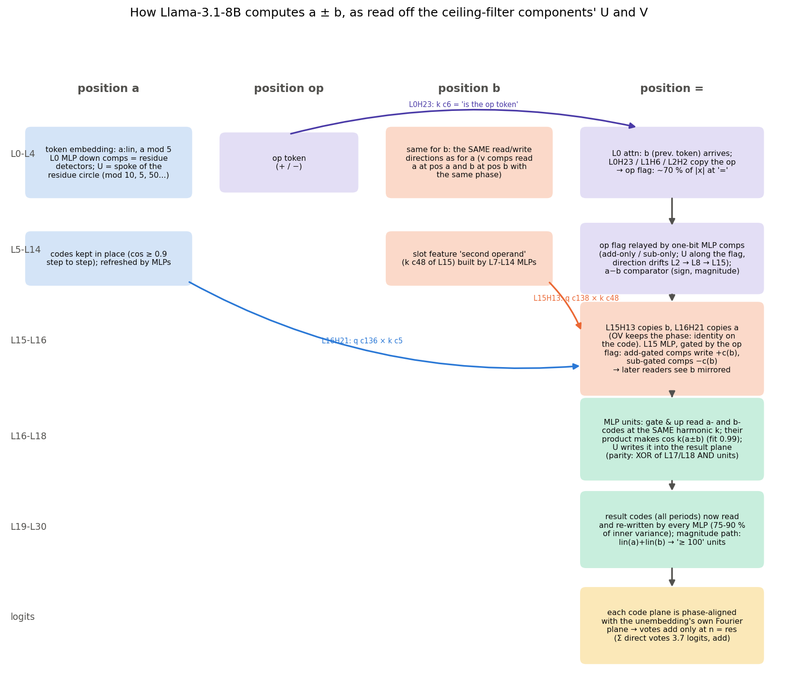

## TL;DR

1. **Storage.** Each operand is stored at its own token as a stack of periodic codes plus a
   magnitude direction:
   - codes: `a mod 2, 4, 5, 10, 20, 25, 50, 100`, plus `lin(a)`;
   - every code is a circle whose residues sit in order;
   - the token embedding already carries `lin(a)` and `a mod 5`;
   - the L0 MLP builds the other codes with residue-detector components. Each detector's U is
     the spoke of its residue on the circle (for example, each L0 units-digit detector's U
     points at 36° × its digit on the `a mod 10` circle).
   - After that the codes stay in place (step-to-step |cos| ≥ 0.9).
   - `a` and `b` are written in **largely the same directions**. The attention v components read
     `a` at position a and `b` at position b with the same phase.
2. **Moving.** Attention copies the operands to `=`:
   - `b` via L15H13, `a` via L16H21;
   - OV is an identity on the code: the median phase shift from source to `=` is 0.05 of a
     period;
   - routing is set by one (q, k) component pair per head. The k components read slot features
     ("second operand", "first operand") that MLPs at L6-L14 build at the operand positions.
   - The routing is content-based. The query feature fires only at `=`, the key feature only in
     one slot, and RoPE adds nothing position-specific.
   - The slot features originate in L0 attention: at position b, heads read the op token just
     before it; position a has nothing but BOS to read.
   - "Where" and "what" use different directions. OV passes the operand codes 2.4-4.2× more
     strongly than a random direction and the slot feature not at all (~1×).
   - a and b share their code directions at their own tokens, but L15H13 and L16H21 write into
     near-orthogonal output spaces (principal cosine ≤ 0.13). Which head carries an operand
     decides where it lands at `=`.
3. **Computing.** The result code is made at `=` by the L16-L18 MLPs:
   - gate and up read `a` and `b` codes at the **same harmonic k**;
   - `silu(gate)·up` contains the cross term `cos k(a) · cos k(b)`, which is a code of
     `a + b` (and of `a − b`);
   - the a×b product predicts the newly created result code with cosine 0.99-1.00 (add) and
     0.82-0.91 (sub);
   - U writes it into a result circle, in phase for 40 / 40 of the (unit, harmonic) pairs.
   - From L19 on, the MLPs receive the result code (40-80 % of their input) and re-write and
     refine it.
   - Period by period (exact bookkeeping over all neurons, section 3.1):
     - mod 100, 5, 10, 50 and 20 are made at L16-L19 from a-code × b-code across gate and up;
     - parity is made inside silu(gate) by a single neuron (L18 unit c4);
     - mod 25 and mod 4 never come from the operands: later MLPs make them by multiplying result
       codes (mod 50 × mod 50 → mod 25; mod 5 × mod 20 → mod 4);
     - from L21 every period is also re-derived that way.
4. **Output.** Every result-code harmonic is phase-aligned with the unembedding's own Fourier
   plane of the number tokens:
   - each plane votes for the tokens `n ≡ res (mod 100/k)`, and the votes add up only at
     `n = res`;
   - the alive writers' direct votes sum to 3.7 logits (add), from hundreds of small
     contributions spread over L17-L29;
   - the hundreds digit comes from a separate magnitude path: gate reads of `lin(a) + lin(b)`
     go into neurons that switch at `a + b ≈ 100`, and their U points along
     `W_U[100..199] − W_U[0..99]`.
5. **Operation.** The op token reaches `=` through L0H23 / L1H6 / L2H2. There it is a large
   flag direction: 45-70 % of |x|, re-written layer by layer by one-bit add-only / sub-only
   MLP components whose U lies along the flag. The flag gates the L15 MLP:
   - for each harmonic, 2-3 neurons (7 in total) write a new "sine axis" of b, reading b at
     the quarter-period phase, with a sign set by the op;
   - the op reaches these neurons either through the gate (one neuron switched on by add,
     another by sub) or through up (a signed op read multiplying silu(gate(b))): SwiGLU's
     gate × up product is what multiplies b's code by ±1;
   - flipping only the sine axis while the cosine axis stays gives exactly `b → −b`
     (reflection centre 0 at every harmonic), so from L16 on the readers see `b` **mirrored**
     on subtraction while `a` is unchanged;
   - the same L16-L18 "adder" units then compute `a + (−b)`.

## Method

The rest of the report makes claims such as "this component reads `a mod 10` and prefers units
digit 7", "the stream holds `a mod 10` as a circle", or "the L17 MLP writes the `a + b` code".
This section says, for each kind of claim, which question it answers, which arrays it is computed
from, how it is computed, and why that computation answers the question. Tool 1 is the
transform every other tool uses; read it first.

### Vocabulary

- **Site.** One weight matrix of the model that the decomposition splits. There are seven per
  block: `q_proj`, `k_proj`, `v_proj`, `o_proj` in attention and `gate_proj`, `up_proj`,
  `down_proj` in the MLP. The report abbreviates them q, k, v, o, gate, up, down.
- **Component.** The decomposition writes each site's weight matrix as a sum of rank-1 matrices
  `U_c V_cᵀ` plus a leftover weight delta. Each rank-1 term is one component `c`. `V_c` (the read
  vector) has the size of the site's input and `U_c` (the write vector) has the size of the
  site's output.
- **Site input `x`.** For q, k, v, gate and up, `x` is the residual stream after the block's
  RMSNorm, including the norm's learned gain (4,096 numbers). For o, `x` is the 32 attention
  heads' outputs concatenated (32 × 128 = 4,096 numbers). For down, `x` is the vector of the
  14,336 MLP neuron values `silu(g) · up` (defined under Tool 6).
- **Inner activation `h_c = x · V_c`.** One number per prompt and token position. The component's
  contribution to its site's output is `h_c · U_c`. So `V_c` decides what the component responds
  to, and `U_c` decides what it adds.
- **Alive components.** The 11,604 components kept by the CI filter
  `addsub-05-filter-last-pos-ceiling`. Only these are analysed.
- **Residual writers.** The o and down components. Their site's output is added directly to the
  residual stream. q, k, v, gate and up components write into the inside of an attention layer
  or MLP, not into the stream.
- **Stream point.** A place where the residual stream was recorded. There are 65: after the
  token embedding (`embed`), and for each block `l = 0..31`, just after its attention output is
  added (`L<l>.attn`) and just after its MLP output is added (`L<l>.mlp`).
- **Token position.** Every prompt is the five tokens `<BOS> a op b =`, numbered 0 to 4.
  Llama-3.1's tokenizer maps each integer from 0 to 999 to a single token, so the five positions
  line up across all prompts. "Position a" means token position 1, "`=`" means position 4.

### The prompts and the recorded arrays

Every measurement uses the same 20,000 prompts: all 100 × 100 pairs with `a` and `b` in 1..100,
once with `+` and once with `−`. The subtraction half includes the 4,950 prompts with `a < b`.
Prompt `i` has `op = i // 10000` (0 for add, 1 for sub), `a = (i mod 10000) // 100 + 1` and
`b = i mod 100 + 1`. Reshaping the 10,000 values of one operation to `(100, 100)` therefore gives
a grid whose row index is `a − 1` and whose column index is `b − 1`.

All activations were recorded on the original model, not on the decomposed one:

- `original/resid.npy`, float16, shape `(65, 20000, 5, 4096)`: the raw residual stream (before
  any norm) at each stream point, prompt, token position and channel.
- `original/inner.npy`, float32, shape `(20000, 5, 11604)`: the inner activation `h_c` of every
  alive component at every prompt and token position. It uses the original model's site input,
  so it does not depend on whether the CI would switch the component on.
- `original/mlp_gate.npy` and `original/mlp_up.npy`, float16, shape `(32, 20000, 5, 14336)`: the
  gate and up pre-activations of every MLP neuron.

The vectors `U_c` and `V_c` of the alive components are read from `uv_alive.npz`. CI values are
never used.

### Tool 1: the line coefficient `F(q, k)`

**Question.** Take one activation recorded on the grid: the stream vector at one stream point
and position, or one component's inner activation at one position. Which arithmetic quantity
does it encode (`a`, `b`, `a + b` or `a − b`), with which period, and how strongly?

**Setup.** Fix one operation, and for the stream also fix one stream point and one position.
The activation is then a function `x(a, b)` on the 100 × 100 grid. Each cell holds either a
4,096-vector (the stream) or one number (an inner activation, a neuron's `g`, and so on). The
mean of `x` over the 10,000 cells is subtracted first.

The four candidate quantities are called **lines**: `q = a`, `q = b`, `q = a + b` (the `sum`
line) and `q = a − b` (the `diff` line). The candidate periods are **harmonics**: harmonic `k`
is a cosine or sine wave in `q` that completes `k` cycles while `q` runs over 100 consecutive
values. Only `k = 1..50` is used.

**Calculation.** For each line `q` and harmonic `k`, compute two averages over the 10,000 cells
and pack them into one complex number:

```
C(q, k) = mean over (a, b) of  x(a, b) · cos(2π k q / 100)
S(q, k) = mean over (a, b) of  x(a, b) · sin(2π k q / 100)
F(q, k) = C(q, k) − i · S(q, k)          (i is the imaginary unit)
```

`C` measures how much `x` looks like the cosine wave, and `S` how much it looks like the sine
wave. Written with Euler's formula, `F(q, k) = mean of x · e^{−2πi k q / 100}`. If each cell
holds a number, `F` is one complex number. If each cell holds a 4,096-vector, `C` and `S` are
4,096-vectors and `F` is a complex 4,096-vector.

`F` depends on `x` only through its class means. Group the 10,000 prompts into the 100 classes
`q mod 100` (100 prompts per class) and average `x` in each class. `F(q, k)` is the correlation of
those 100 class means with the cosine and the sine of harmonic `k`.

**Why this answers the question.** Three facts do the work.

1. *`F` is a best fit.* For `k < 50`, the wave `x_k(q) = 2 · (C cos θ + S sin θ)`, with
   `θ = 2π k q / 100`, is the least-squares fit of `x` by a cosine plus a sine of harmonic `k`
   in `q`. The fraction of `x`'s variance that this wave explains is `2 |F|² / var`. Here `var` is
   the mean squared deviation of `x` from its grid mean (for vectors, summed over channels), and
   `|F|² = |C|² + |S|²`. At `k = 50` the sine is zero on integers, so the fit is `C cos θ` and the
   fraction is `|F|² / var`. This fraction is what the report calls the **energy** or **share**
   of a (line, harmonic).
2. *Lines do not leak into each other.* At a fixed `a`, any wave of harmonic `k` in `b`, in
   `a + b` or in `a − b` averages to zero as `b` runs over 1..100. So an activation that depends
   on `a` alone has `F = 0` on the `b`, `sum` and `diff` lines, and likewise for the other lines.
   This is what separates "reads `a`" from "reads `a + b`".
3. *Harmonics do not leak into each other.* Two different harmonics of the same line are
   orthogonal over the grid. So the shares of all (line, harmonic) pairs can be compared and
   added.

One limit follows from the construction. `a + b` runs from 2 to 200, but a wave in `a + b` of
harmonic `k` only sees `(a + b) mod 100`. The hundreds digit is therefore invisible to the
line coefficients and is handled with the linear parts (see "Removing the linear parts" below).

**How to read `F`.**

- *Period.* Harmonic `k` repeats every `100 / gcd(k, 100)` integer values of `q`. So `k = 1`
  is `q mod 100`, `k = 2` is `mod 50`, `k = 4` is `mod 25`, `k = 5` is `mod 20`, `k = 10` is
  `mod 10` (the units digit), `k = 20` is `mod 5`, `k = 25` is `mod 4`, and `k = 50` is `mod 2`
  (parity).
- *Strength.* The energy share from fact 1, between 0 and 1.
- *Preferred value (scalar `x`).* The fitted wave peaks at `q* = −arg(F) · 100 / (2π k)`, taken
  modulo `100 / k` (`peak_value` in `vectors/common.py`). It rises `2 |F|` above the grid mean
  there. For example, a component whose inner activation has its (`a`, `k = 10`) wave peaking
  at `q* = 7` responds most to prompts whose `a` ends in 7.
- *Plane and circle (vector `x`).* For the stream, `C` and `S` are two directions in the
  4,096-dimensional residual space. As `q` runs over its values, the fitted wave
  `2 · (C cos θ + S sin θ)` moves on an ellipse in the plane spanned by `C` and `S`. When `C` and
  `S` have equal length and are orthogonal, the ellipse is a circle, and the 100 class means sit
  on it in residue order. The report calls this plane the **code** of that quantity and period
  (for example, "`a`'s mod-10 circle"). Every (line, harmonic) has its own plane. At `k = 50`,
  `S = 0`, so parity is one direction, not a plane.

**Implementation.** `line_dft` in `vectors/common.py` computes all the `F(q, k)` at once. It first
takes the two-dimensional discrete Fourier transform of the grid with `np.fft.fft2`, divided by
10,000. For every pair of integers `(m, n)` in 0..99, that transform gives
`mean of x · e^{−2πi (m (a−1) + n (b−1)) / 100}`, the correlation of the grid with a wave that
completes `m` cycles along `a` and `n` cycles along `b`. A line `q = c_a · a + c_b · b` at
harmonic `k` is the wave with `(m, n) = (k c_a, k c_b)` taken modulo 100:

| line | `q` | `(c_a, c_b)` | entry `(m, n)` of the 2-D transform |
|---|---|---|---|
| `a` | `a` | (1, 0) | `(k, 0)` |
| `b` | `b` | (0, 1) | `(0, k)` |
| `sum` | `a + b` | (1, 1) | `(k, k)` |
| `diff` | `a − b` | (1, −1) | `(k, 100 − k)` |

`line_dft` keeps these 4 × 50 entries. It multiplies each one by `e^{−2πi k (c_a + c_b) / 100}`
to correct for the grid index being `a − 1` and `b − 1` rather than `a` and `b`, so the phase
refers to the value of `q`. For an input of shape `(100, 100, …)` it returns a complex array of
shape `(4, 50, …)`. Axis 0 is the line, in the order `a`, `b`, `sum`, `diff`. Axis 1 is the
harmonic `k = 1..50`. The remaining axes are those of one cell: `(4096,)` for the stream, none
for a scalar. Harmonics 51..99 are not kept, because for a real-valued `x` the coefficient at
`100 − k` is the complex conjugate of the one at `k` and carries no new information.

**Removing the linear parts.** Activations also contain parts that grow steadily with `a` or
with `b`: magnitude directions, written `lin(a)` and `lin(b)`, which encode "how large" rather than
"which residue". A straight ramp is not periodic. Its line coefficients are nonzero at every
harmonic and fall off like `1 / k`, so they would pile up at `k = 1..3` and look like mod-100 or
mod-50 codes. To prevent this, the slope of `x` against `a − 50.5` is fitted by least squares
over the grid, and so is the slope against `b − 50.5`. The ramp's own line coefficient times
the fitted slope is then subtracted from the `a` line, and likewise for `b`. By fact 2, a ramp in
`a` has no coefficient on the `b`, `sum` or `diff` lines, so those lines need no correction.
The stored files keep the ramp in. The loaders `load_frame` (`storage.py`), `load_reads` and
`load_writes` (`load.py`) subtract it. The share of variance in each ramp is reported
separately, as `lin`.

### Tool 2: the stream's codes ("frames")

**Question.** At each stream point and token position, which quantities does the residual
stream carry, how strongly, and in which directions? Do those directions stay the same from one
stream point to the next, and do `a` and `b` use the same ones?

**Calculation.** `spectra.py frames` loops over the 65 stream points, the four positions `a`,
`op`, `b`, `=` (BOS is dropped) and the two operations. For each combination it takes the stream
vectors of that operation's 10,000 prompts, reshapes them to `(100, 100, 4096)`, subtracts their
mean and applies `line_dft`. The results are stored as two float16 arrays, `frames_re.npy` and
`frames_im.npy`. They hold the real and imaginary parts of one complex array of shape
`(65, 4, 2, 4, 50, 4096)`, whose axes are stream point, position, operation, line, harmonic and
channel. `frames_stats.npz` stores, for each stream point, position and operation, the mean
stream vector, the two fitted slopes (a 4,096-vector each), the total variance and the mean RMS
norm.

`storage.py` reduces the frames to three kinds of numbers, after removing the ramps:

- `energy`: the share of the stream's variance carried by each (line, harmonic), as in Tool 1.
- `cos_next`: the complex cosine `⟨F_t, F_{t+1}⟩ / (|F_t| |F_{t+1}|)` between the codes at
  consecutive stream points. Here `⟨u, v⟩ = Σ_d u_d · conj(v_d)`. Its magnitude is 1 when the
  two codes lie in the same plane with the same residue order, and its argument is the angle by
  which the circle has turned.
- `cos_pos` and `cos_op`: the same complex cosine between `a`'s code at position `a` and `b`'s
  code at position `b`, and between the addition and subtraction codes.

Where the report compares two planes directly, it uses the **principal cosine** (`pcos` in
`routing.py`). This is the largest cosine between any direction in one plane and any direction
in the other. It is 1 when the planes share a direction and 0 when they are orthogonal.

**Why this answers the question.** By Tool 1, `F` at one (stream point, position, operation,
line, harmonic) is the plane the stream uses for that code, and its energy is how much of the
stream's variation that code accounts for. Comparing planes across stream points, positions or
operations answers the "same directions?" questions directly.

### Tool 3: what a component reads (`R_c`)

**Question.** Which quantity, period and residue makes component `c`'s inner activation large?

**Calculation.** `spectra.py reads` applies Tool 1 to the scalar grid `h_c(a, b)` of every
alive component, at each of the four positions and both operations. The result `R` in
`read_spec.npz` is a complex array of shape `(11604, 4, 2, 4, 50)`: component, position,
operation, line, harmonic. The file also stores the mean, the variance and the two fitted
slopes of each inner activation.

**Why this answers the question.** `h_c` is the number the component multiplies its write
vector by, so it is exactly what the component responds to. The energy of `R_c` on a (line,
harmonic) is the share of `h_c`'s variation over the grid explained by that wave. `peak_value`
of `R_c` is the residue where that wave is largest. "Component `c` reads `a mod 10` and prefers
7" means that the energy of `R_c` is concentrated on (`a`, `k = 10`) and that its peak is at 7.

### Tool 4: what a component writes (`U_c · F`)

**Question.** Expressed in terms of the codes already present in the stream, what does adding
`U_c` do?

**Calculation.** For every residual writer `c`, take the frame `F` at the stream point just after
its sublayer adds its output: `L<l>.attn` for an o component, `L<l>.mlp` for a down component. Then
compute the complex number `W_c = U_c · F = Σ_d U_c[d] · F[d]` for every position, operation,
line and harmonic. `spectra.py writes` stores `W` in `write_spec.npz` as a complex array of shape
`(n_writers, 4, 2, 4, 50)`. The file also stores `U_c` dotted with the two fitted slopes, and with
the difference between the mean stream vectors of addition and subtraction (`opdiff`). It also
stores the norm of `U_c` (`unorm`).

**Why this answers the question.** The transform is linear, so `U_c · F` is the line coefficient
of the scalar grid `U_c · x(a, b)`: the stream projected onto the direction `U_c`. Its peak
`q*` is the residue whose class-mean stream vector points furthest along `U_c`. So adding `+U_c`
moves the stream toward residue `q*` on that code's circle. This is what the report means by
"`U_c` is the spoke of residue `q*`". Its energy says how much of the stream's variation along
`U_c` belongs to that code. `opdiff` says whether `U_c` points along the direction that separates
addition from subtraction.

### Tool 5: how each sublayer changes each code (`transfer.npz`)

**Question.** Does a sublayer strengthen, erase, turn or mirror a code? Which of its components
make that change?

**Calculation.** Each of the 64 sublayers moves the stream from one stream point `t − 1` to the
next point `t`. For each sublayer, position, operation, line and harmonic, `transfer.py` computes
the change of the code, `dF = F_t − F_{t−1}` (a complex 4,096-vector), and from it:

- `keep = Re⟨dF, F_{t−1}⟩ / |F_{t−1}|²`: the part of the change that lies along the existing
  code. It is positive when the sublayer amplifies the code and negative when it erases it.
- `turn = arg⟨dF, F_{t−1}⟩`: the angle of that aligned part, which says whether the sublayer
  pushes the code toward a shifted residue.
- `dF_energy`: the size of the change, as a share of the stream's variance at `t` (Tool 1 units).
- `mirror` (subtraction only): `Re⟨dF_sub, T⟩ / |T|²` with `T = conj(F_add, t−1) − F_sub, t−1`.
  Replacing `q` by `−q` turns a code `F` into its complex conjugate, so `conj(F_add)` is the
  addition code mirrored. `mirror = 1` means the step moves the subtraction code all the way to
  the mirror image of the addition code.
- For every alive residual writer `c` of the sublayer, `share_c = Re⟨R_c U_c, dF⟩ / |dF|²`.

**Why this answers the question.** On the original model, a sublayer's write to the stream is
exactly the sum over all its components of `h_c(a, b) · U_c`, plus the weight delta applied to
`x`. Because `U_c` is the same vector in every cell, the line coefficient of one component's
write `h_c · U_c` is exactly `R_c · U_c`. So `R_c U_c` is `c`'s own contribution to the change of
the code, and `share_c` is the fraction of the observed change `dF` it accounts for. The shares
of a sublayer's alive writers add up to the fraction explained by the alive components. The
remainder comes from the dead components and the weight delta.

### Tool 6: the neurons behind a down component (`mlp_units.py`)

**Question.** Which MLP neurons does a down component stand for? Do they pass along a code the
stream already holds, or create a new code by multiplication?

**Terms.** Each MLP neuron `n` computes a gate pre-activation `g_n` and an up pre-activation
`up_n`, both linear functions of the normalised stream. Its value, which is passed on to
`down_proj`, is `act_n = silu(g_n) · up_n`, with `silu(z) = z / (1 + e^{−z})`. A down component's
read vector `V_c` has one weight per neuron (14,336 in total). Its **participation ratio**
`(Σ_n V_c[n]²)² / Σ_n V_c[n]⁴` is the effective number of neurons it weights, and its median
over down components is 5.6. So a down component's inner activation `h_c = Σ_n V_c[n] act_n` is
a weighted sum of about six neurons. The gate and up components are different. Their write
vectors spread over many neurons, so they act as read directions shared by many neurons.

**Calculation.** For each layer, `mlp_units.py` takes, for every alive down component, the 8
neurons with the largest `|V_c[n]|`, and forms the union of these sets. For each such neuron and
each operation, at position `=` (and also at positions `a` and `b` for layers 0 to 5), it applies
Tool 1 to four scalar grids: `g`, `up`, `s = silu(g)` and `act = s · up`. The results are stored
in `<run>/analysis/arith_repr/vectors/mlp/L<l>.npz`.

**Why this answers the question.** `g` and `up` are linear in the normalised stream, so their
line coefficients can only contain codes the stream already holds. `s` and `act` are
nonlinear. When two grids are multiplied, the product's coefficient on the `sum` line at harmonic
`k` includes `s_a(k) · up_b(k) + s_b(k) · up_a(k)`, where `s_a(k)` is `s`'s coefficient on the
`a` line. This is a code of `a` times a code of `b` at the same harmonic, and it produces a
code of `a + b`, because `cos α · cos β = ½ [cos(α + β) + cos(α − β)]`. The `diff` line has the
same terms, with `up_b` replaced by its complex conjugate. The product's sum-line coefficient also
includes `mean(s) · up_sum(k) + mean(up) · s_sum(k)`, which only passes on a sum code already
present in the inputs. Comparing these terms with the measured coefficient of `act` shows whether
the neuron creates the result code or passes one through. Section 3.1 extends this bookkeeping
exactly to every neuron of a layer, and defines its terms there.

### Tool 7: attention couplings (`autointerp/wiring.py`, `vectors/qk.py`)

**Terms.** Each attention layer has 32 query heads `h = 0..31`, each with 128 channels, and 8
key-value heads. Query head `h` uses key-value head `kv(h) = h // 4`. A v component's write vector
`U_v` lives in the output of `v_proj` (8 × 128 channels), and `U_v[kv(h)]` is its 128-channel
slice for key-value head `kv(h)`. The same slicing applies to a k component's `U_k`. An o
component's read vector `V_o` lives in the input of `o_proj` (32 × 128 channels), and `V_o[h]` is
its slice for head `h`. A q component's `U_q[h]` is sliced the same way. **RoPE** is Llama's
rotary position embedding. `RoPE_p` rotates each pair of channels of a 128-vector by angles set
by the token position `p` (0..4), in the same rotate-half layout the model uses.

**OV coupling.** *Question:* how much does a v component at a source position feed an o component
at `=` through head `h`? *Calculation:* the coupling is `U_v[kv(h)] · V_o[h]`, stored in
`autointerp/wiring.npz` as `vo_<l>`, with shape `(n_v, n_o, 32)`. *Why:* head `h`'s output at `=`
is the attention-weighted sum of the value vectors at the source positions. The v component adds
`h_v · U_v[kv(h)]` to the value vector at its source. The o component reads the head-`h` slice of
the attention output with `V_o[h]`. So when head `h` puts attention weight `w` on that source,
the o component's inner activation receives `w · h_v · (U_v[kv(h)] · V_o[h])`. The coupling is this
gain at full attention and unit v activation. The OV phase figure then compares the residue that
the v component prefers at the source (Tool 3) with the residue that the o component prefers at
`=`. When the two match, the head copies the code without changing it.

**QK coupling.** *Question:* which pair of a q component and a k component makes head `h` at `=`
attend to source position `s`? *Calculation:* for q component `i` and k component `j`,

```
pair(i, j, h, s) = mean(h_i at =) · mean(h_j at s) · ⟨RoPE_4(U_i[h]), RoPE_s(U_j[kv(h)])⟩ / √128
```

where each mean is over the 10,000 prompts of one operation, and `√128` is the attention scale.
The results are stored per layer in `qk.npz` as `pair_<l>`, with shape `(n_q, n_k, 32, 5, 2)`:
q component, k component, head, source position, operation. *Why:* head `h`'s attention logit
from `=` to `s` is `q · k / √128`, with `q = RoPE_4(Σ_i h_i U_i[h])` and
`k = RoPE_s(Σ_j h_j U_j[kv(h)])` (plus the dead components and the weight delta). Expanding the
dot product gives a sum over pairs `(i, j)`. Replacing each `h` by its mean gives each pair's
typical contribution to the logit, which shows which pairs decide where the head looks. The
calculation uses a product of means, so it ignores how `h_i` and `h_j` co-vary across prompts.

## 1. How values are stored, and how the representations are built

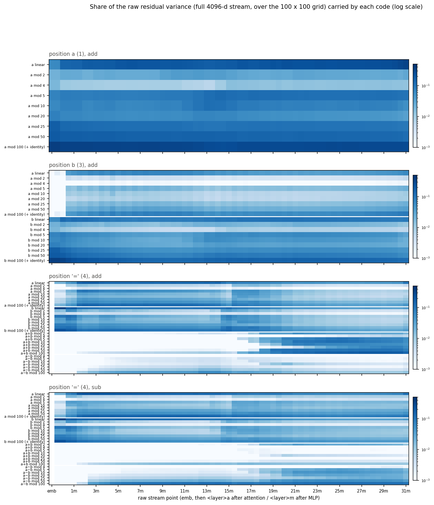

Share of the raw residual variance carried by each code, at every stream point (log scale).
"mod 100 (+ identity)" includes all token-identity variance, so it is large by construction.

- **Position a / position b.** The token embedding already carries `lin(a)` and every period.
  The L0 MLP step makes the largest change to the operand codes of the whole network (figure
  below). After it the codes are flat to L31, with modest re-writes by MLPs (L11-L15 refresh
  mod 5 / mod 10).
- **Position `=`.**
  - `b` arrives at L0 (the previous token; all L0/L1 components at `=` read `b` only);
  - `a` arrives by L1-L2;
  - both stay at 1-10 % of the variance until L15-L16, when the dedicated copies arrive;
  - the result codes appear at 16m-18m and dominate from L19;
  - on **both** ops a low-k `a−b` code (period 50-100) builds up at `=` from L2. This is a
    magnitude comparator (sign / size of `a − b`), not `a − b mod 10` (that code only appears
    at 17m-19m on sub).

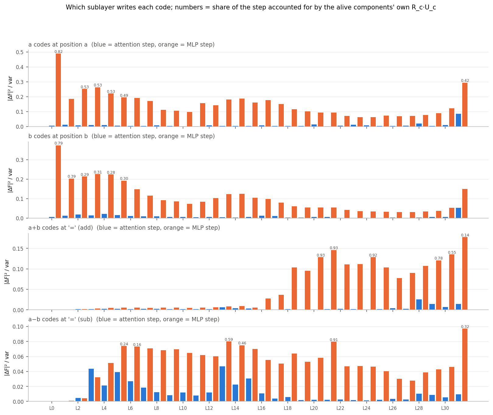

Which sublayer writes each code. Blue bars are attention steps, orange bars MLP steps. Numbers
are the share of the change explained by the alive components' own `R_c U_c`: 0.8 for the L0 MLP
at the operands, 0.78-0.93 for the result code at L16-L25.

**Residue detectors write the spokes of their residue.** The L0 down components at position a
are one-residue detectors: their `h_c` peaks at one residue of `a mod 10`, `mod 5` or `mod 50`.
Their U, projected on a's code plane at the next stream point, points at **that residue's
position on the circle**. A units-digit detector for digit d points at 36° × d. In the figure, the 10 L0 down
components with > 15 % of their variance on `a mod 10` cover digits 0-5 and 7; the detectors of 6, 8
and 9 have less than 15 % of their variance on this harmonic and fall under the cut. So adding
`h_c · U_c` moves the representation toward the class mean of the residue that switched the
component on.

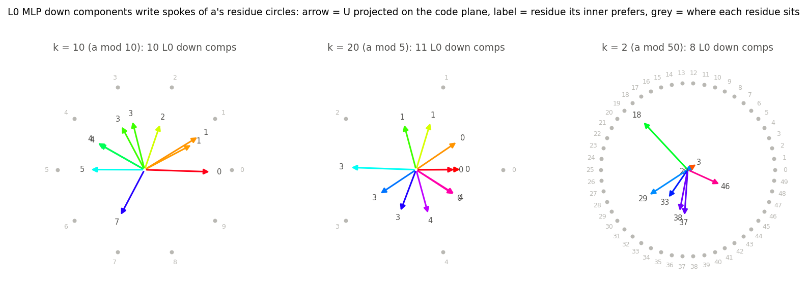

The same holds across the network: for each writer and each harmonic its inner carries (> 15 %
of its variance), I compared the phase of its write `R_c U_c` with the stream code.

| writers | (comp, k) pairs | in phase (< 60°) | opposite (> 120°) |
|---|---|---|---|
| down, position a, L0-4 | 255 | 0.93 | 0.02 |
| down, position a, L5-14 | 479 | 0.88 | 0.06 |
| down, position a, L15-31 | 964 | 0.80 | 0.09 |
| down, position b, L0-4 / L5-31 | 234 / 749 | 0.94 / 0.91 | 0.02 / 0.03 |
| down, `=`, a+b (add), L16-18 / L19-24 / L25-31 | 40 / 335 / 330 | **1.00** / 0.93 / 0.94 | 0.00 / 0.03 / 0.01 |
| down, `=`, a−b (sub), L16-18 / L19-31 | 27 / 255 | 0.85 / 0.87 | 0.11 / 0.05 |
| o, L15 (b at `=`) / L16 (a at `=`) | 67 / 142 | 0.99 / 0.89 | 0.01 / 0.03 |

Almost every writer is a "spoke": it writes the code of the residue that its V selects, in the
coordinates the stream already uses. There is very little erasing (< 10 %).

**Shared directions for the two operands.**

- The v components read the same phase at both operand positions. Example: L15 v c17 reads
  `a mod 5` peaking at 19.4 at position a, and `b mod 5` peaking at 19.4 at position b.
- The operand code planes at the two positions have |cos| ≈ 1 at the embedding and 0.35-0.6
  at L5-L10.
- They climb back to **0.6-0.85 at L12-L17**, right where L15H13 and L16H21 read them (left
  panel below). This looks like a shared "operand format" that the copying heads can read with
  one V.

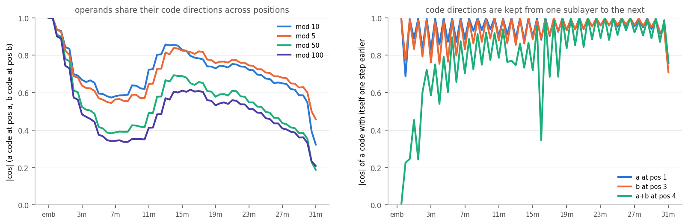

## 2. How attention moves information between positions

**What is moved: OV is an identity on the code.** For the 100 (L15H13) and 130 (L16H21)
strongest (v, o) pairs, I compared two phases at the dominant harmonic k:

- the phase of `b` (or `a`) that the v component reads at the source;
- the phase that the o component reads at `=`.

The median shift is 0.05 of a period (71 % / 78 % of pairs within 0.1). The heads transport each
Fourier component unchanged: `b mod 5` peaking at 19.4 becomes `b mod 5` peaking at 19.7 at `=`.

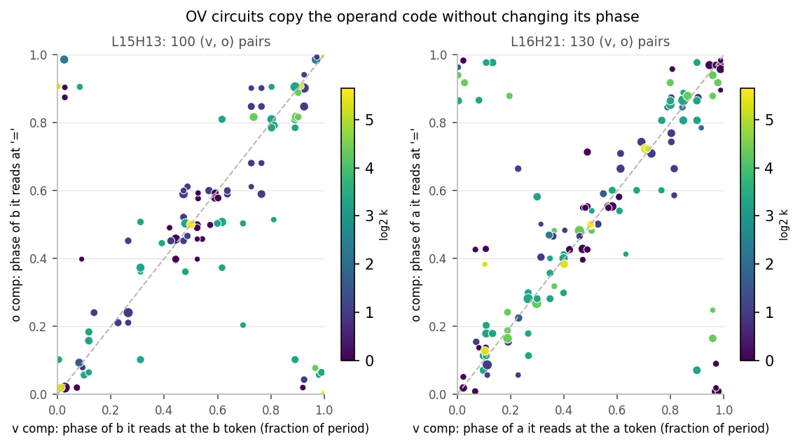

**Where it is moved from: QK from the q and k vectors.** Each head's alive attention logit is
dominated by one q × k pair:

| head | pair | key feature (k component's mean inner by position BOS / a / op / b / =) | effect |
|---|---|---|---|
| L0H23 | q c17 × k c6 | 0 / 0 / 15.2 / 0 / 5.1: "is the op token" | `=` reads op (logit +2.1) |
| L15H13 | q c138 × k c48 | 0 / 0 / 0.4 / −21 / 0.5: "second operand" | `=` reads b (+4.7 add, +4.0 sub) |
| L16H21 | q c136 × k c5 | 0 / 51.6 / 0.5 / 22.8 / 0.1: "operand, first > second" | `=` reads a (+12.3 vs +4.9 on b) |
| L18H30 | q c104 × k c95 | 0 / 45.5 / 0 / 43.5 / 0: "operand" | both operands |
| L17H9 | q c127 × k c9 | 0 / −43.5 / −45.7 / −43.3 / −13.2 | avoids a / op, BOS sink |

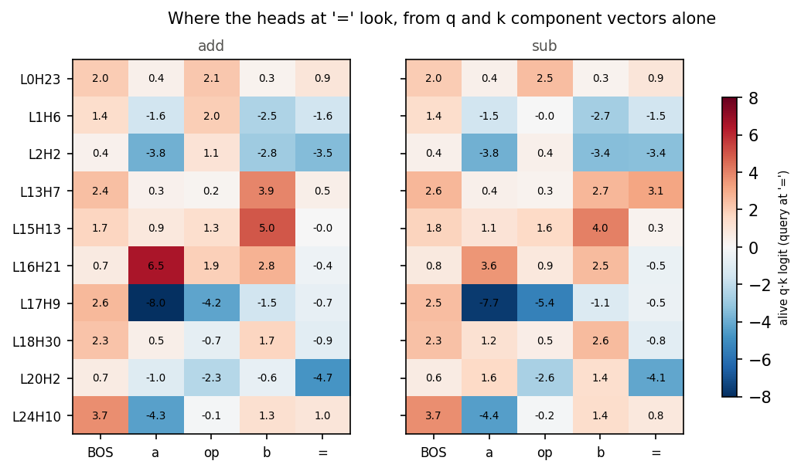

The slot features are built earlier by MLPs at the operand positions (writer U · reader V ×
mean inner):

- **"Second operand" (L15 k c48) at position b** comes from L14 down c30, L13 c14, L9 c22 and
  L7 c2, among others. It is exactly zero at position a.
- **L16 k c5** comes from L6-L15 downs at both positions, and is larger at a.

On subtraction the a-copy is weaker (L16H21: a 3.6 vs b 2.5). This matches the activation-level
finding that copies split when `a < b`.

### 2.1 How the heads decide what to copy, and from where

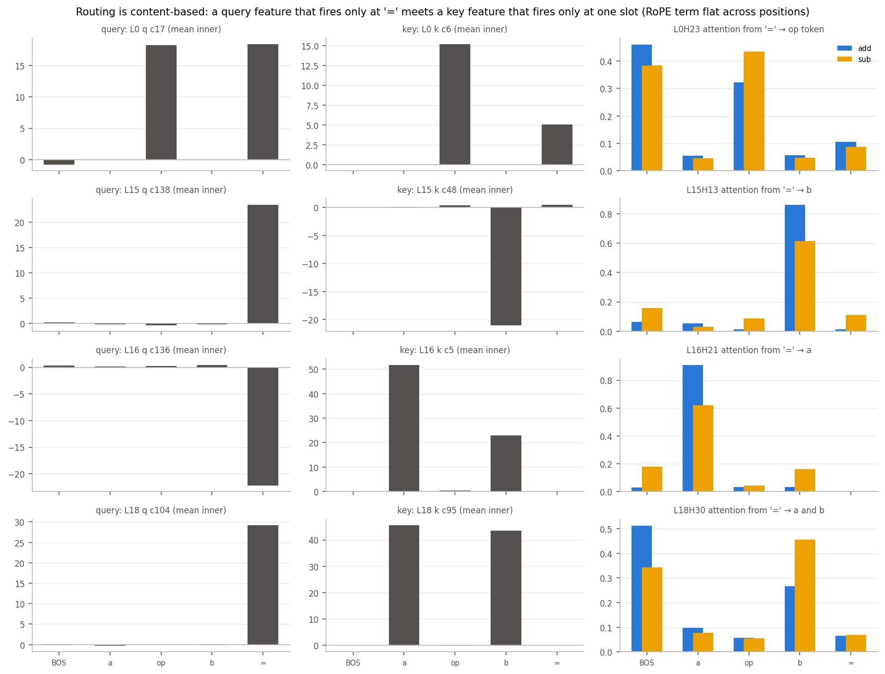

**Where: a query feature meets a slot feature.** For each copy head the alive attention logit at
`=` is dominated by one (q, k) component pair, so the pair's two features are the routing rule:

| head | query feature (fires at) | key feature (fires at) | attention from `=` (add / sub) |
|---|---|---|---|
| L0H23 | q c17: op and `=` (18) | k c6: op token only (15.2; 5.1 at `=`) | op 0.32 / 0.43 (rest mostly BOS) |
| L15H13 | q c138: `=` only (23.4) | k c48: b only (−21.0) | b 0.86 / 0.61 |
| L16H21 | q c136: `=` only (−22.2) | k c5: a (51.6) > b (22.8) | a 0.91 / 0.62 |
| L18H30 | q c104: `=` only (29.2) | k c95: a and b (45.5 / 43.5) | b 0.27 / 0.46, rest BOS |

- **No positional part.** The RoPE-rotated product of the pair's U vectors is the same for
  every source position (L15H13: −0.008 to −0.010 for BOS…`=`). The selection comes entirely
  from the key feature being non-zero in one slot only.
- **Query features.**
  - The copy heads' query features are "I am the answer position" features, built by MLPs at
    `=` over many layers. The embedding contributes ~0, even though `=` is always the same
    token; for q c138, L14 MLP +7.3, L12 +2.7, L5 +2.7, ….
  - L0H23's query (q c17) fires at op and `=`, i.e. on any non-number token.
- **Key features: slot units.** In the full model (sublayer by sublayer), k c48's input at b is
  built by MLPs from L4 to L14 (L13 −3.1, L14 −2.7, L9 −2.2, L7 −1.8, L4 −1.3). At component
  level the writers are binary slot units, each on at exactly one operand position:
  - L14 down c30: 3.8 at b, 0 elsewhere;
  - L13 down c14: 2.8 at b;
  - L9 down c22: −2.7 at b;
  - L13 down c2 and L9 down c38: on at a only, with the opposite sign.
  - Every layer from L3 to L15 has one to three such a-only and b-only units: L3 down c0 (a) /
    c7 (b), L4 c32 / c13, …, L14 c30 (b), L15 c1 / c0.
- **Root of the slot features.**
  - The token embeddings of a and b have the same distribution, so the embedding contributes
    exactly 0 to the difference between the two positions. Only attention can tell them apart.
  - At L0, position a has nothing but BOS to attend to (0.95 on BOS).
  - Position b attends the op token right before it: H1 0.92, H10 0.88, H23 0.57; H2 reads a
    (0.48).
  - After L0 attention the mean stream at b differs from a by 57 % of |x| (79 % after the L0
    MLP). The L0-L2 MLPs turn that context into the first slot units; for example L3 gate c0,
    which opens position a's slot unit, gets its a/b difference mostly from the L0 MLP.
  - So "second operand" means "the number after the operator", learned from L0's
    previous-token attention and sharpened by one or two MLP units per layer.
- **Subtraction routes less cleanly.** Attention to the operand drops (0.86 → 0.61, 0.91 →
  0.62), and more of it goes to BOS and to the other operand. This matches the weaker copies on
  sub in the activation-level report.

**What: OV reads the operand codes, not the routing features.** Gain of each head's OV map
(model weights `W_O[h] W_V[kv(h)]`, norm folded), relative to a random direction:

| head (source) | operand codes (mod 100 / 50 / 20 / 10 / 5 / 2) | lin(q) | slot feature | op flag | bulk of the stream |
|---|---|---|---|---|---|
| L15H13 (b) | 2.6 / 3.0 / 2.9 / 3.2 / 3.3 / 3.6× | 2.4× | 0.8× | 1.0× | 1.2× |
| L16H21 (a) | 3.2 / 4.1 / 4.2 / 4.2 / 4.2 / 3.9× | 2.5× | 1.1× | – | 1.2× |

- The key reads the slot and the value reads the number, in different directions of the same
  residual. The feature that decides "where" is not passed on to `=`.
- **The op token's path.** L0H23's OV does not single out the add/sub difference (1.1×). It
  carries the op token's embedding along with the rest (2.0× on the bulk of the stream). The
  clean op flag is then formed by the one-op-only o components of L1H6 / L2H2 and the MLP relays
  (section 5).

### 2.2 How a and b end up apart at `=`

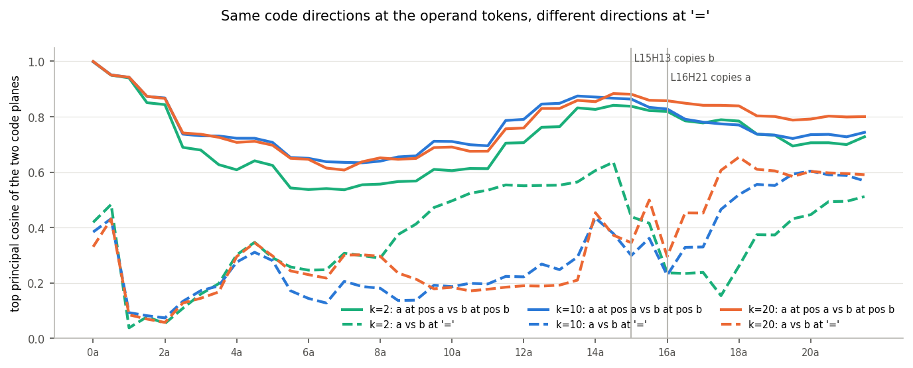

- **At the operand tokens:** a's code and b's code share their planes. The top principal cosine
  of the a-plane at position a and the b-plane at position b is 1.0 at the embedding, 0.55-0.75
  at L5-L10, and 0.8-0.88 at L12-L17. The shared format is what lets one v component read
  either.
- **At `=`:** the same codes are nearly orthogonal (0.2-0.4 at L15-L17, before the adder).
- **The heads' output spaces are near-orthogonal.** With the model's weights:
  - the top principal cosines between L15H13's and L16H21's output spaces are 0.12, 0.10, 0.09, …;
  - the same b code sent through H13 and through H21 lands in planes with cosine 0.03-0.06;
  - with the alive v / o components alone: 0.06-0.13.
  - What each head writes is the operand code at `=`: H13's output lies in the b-plane after L15
    attention (cosine 0.81-0.88), and H21's in the a-plane after L16 attention (0.82-0.94).
  - So the operand's identity is set by the head that carries it. Routing (QK) picks the slot,
    and that head's W_O puts the code in its own subspace.
- **The early copies are also separated.** b reaches `=` at L0 (previous-token attention) and a
  at L1-L2. After L1-L2 attention their planes at `=` are already at cosine 0.04-0.17.
- **The adders read the two subspaces.**
  - The gate/up V vectors of the L16-L18 result units put 8-50 % of their norm into the two
    heads' 128-d output spaces, against 3 % for a random direction.
  - Many units split the operands between their two inputs: L16 c10 (gate reads 94 % a, up
    97 % b), L18 c12 (gate 96 % a, up 97 % b), L18 c21, c22, L16 c106, c76, c94 (gate b, up a).
  - Others read both operands in both inputs (L18 c23, c26, c24).
  - (This corrects "almost every creating unit reads both operands in both inputs" in section
    3.1: about half do, half split.)
- **Is separation needed?** For a + b it is not: a unit reading `cos a + cos b` in both inputs
  still makes `cos(a+b)`. It matters for a − b, where only b must be mirrored. The L15 MLP
  mirror acts on b in H13's subspace, after b has arrived and before a arrives through H21.

## 3. How the result is computed from the operands

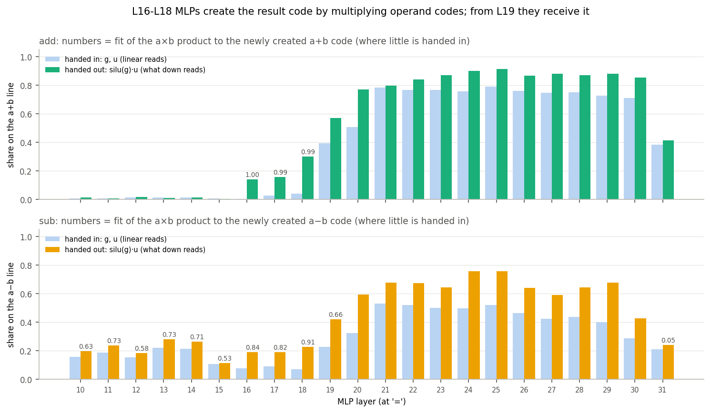

Result-line share of what the MLP neurons at `=` are handed (g and up, both linear in the stream)
versus what they hand to the down components (`silu(g)·up`), per layer:

| layer | result code in g, up | result code in silu(g)·up | share of it newly created | a×b fit (add / sub) |
|---|---|---|---|---|
| L16 | 0.00 | 0.14 | 0.98 | 1.00 / 0.84 |
| L17 | 0.03 | 0.16 | 0.64 | 0.99 / 0.82 |
| L18 | 0.04 | 0.30 | 0.91 | 0.99 / 0.91 |
| L19 | 0.40 | 0.57 | 0.20 | 0.77 / 0.66 |
| L20-L30 | 0.5-0.8 | 0.77-0.91 | re-written | < 0.45 |

**Mechanism (L16-L18).**

- Each unit's gate and up read an `a` code and a `b` code **at the same harmonic k** (see the
  grids below):
  - gate = `α cos k(a − φa) + β cos k(b − φb)`, and up likewise;
  - the product `silu(g)·up` contains `cos k(a−φa) · cos k(b−φb)`, which is
    `½ [cos k(a+b−φa−φb) + cos k(a−b−φa+φb)]`.
- The line-product prediction (`s_a u_b + s_b u_a` plus the cross term inside silu) matches the
  new result-line coefficient in phase and amplitude: cosine 0.99-1.00 on add.
- The phases add: median |peak_out − (peak_a + peak_b)| is 0.04 of a period. Examples:

  | unit | a phase | b phase | predicted a+b phase | measured a+b phase |
  |---|---|---|---|---|
  | L16 down c10 (k = 1) | 81 | 32 | 13 | 12 |
  | L18 c23 (k = 1) | 56 | 57 | 14 | 8 |
  | L18 c12 (k = 2, mod 50) | 48 | 23 | 21.4 | 23.1 |
  | L18 c18 (k = 5, mod 20) | 11.0 | 19.2 | 10.2 | 10.6 |
  | L18 c32 (k = 10, mod 10, sub) | 9.4 | 4.95 | 4.4 (a − b) | 4.4 |

- L18 down c4 is the parity unit (k = 50: a product of `(−1)^a` and `(−1)^b`).
- The U of these units writes the new code in phase with the result circle (40 / 40 pairs,
  section 1 table). Their outputs form the first result code: 0.78-0.92 of the result-code
  change at 16m-18m is their own `R_c U_c`.
- The top writers are L16 down c10 / c29 / c25; L17 c11 / c22 / c67; L18 c4 / c12 / c23 / c21;
  then L19 c0 / c24 / c11 / c32 and L20 c3 / c6 / c2.

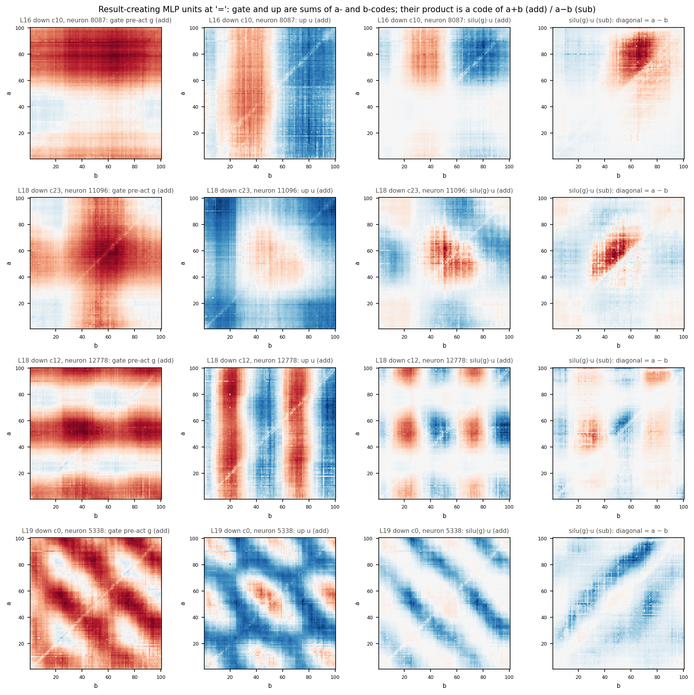

(a, b)-grids of the top neuron of four units (rows):

- **L16-L18 units.** Gate and up are sums of horizontal (a) and vertical (b) stripes; the
  product is a lattice or blob, i.e. a conjunction of a-window and b-window.
- **L19 c0.** Gate and up already carry diagonal stripes (the result code arrives as input);
  the product stays diagonal (pass-through / sharpening).
- **Sub** (4th column): the same neuron's output follows `a − b` (diagonal).

The product also makes `a − b` harmonics on add (the second term of the identity). These are
smaller (diff share 0.04-0.24 per unit) and do not accumulate across units.

**L19-L30** keep re-writing the result: 75-90 % of their inner variance is on the result line.
The newly created part is no longer an a×b product; it mixes result harmonics (e.g. k = 1 → k =
2 and 3). This matches the earlier finding that the long periods fan out from Fourier circles
into higher-dimensional codes from L26.

### 3.1 Period by period: which MLP makes which period, and how

**Exact bookkeeping.** On the full grid the neuron output `act = silu(g)·u` has, as its 2-D DFT,
the circular convolution of the DFTs of `s = silu(g)` and `u`. So every neuron's coefficient on
the result line (`(k, k)` for a+b, `(k, −k)` for a−b) splits exactly into:

| term | what it is |
|---|---|
| **X** | `s(k,0)·u(0,±k) + s(0,±k)·u(k,0)`: an a-code times a b-code at the same harmonic, one from the gate and one from up |
| **M** | `Σ_p s(res p)·u(res k−p)`: two result codes multiplied (harmonic mixing) |
| **P** | `s̄·u(res k)`, and the part of `ū·s(res k)` that is linear in the gate: a result code the MLP already receives, passed through |
| **Sx / M (inside silu)** | the rest of `ū·s(res k)`, from a quadratic fit of silu. Its a×b part is **Sx**; its result × result part is counted in M |
| **O** | everything else |

The layer's result write `T(k) = W_down · act(res k)` is summed over all 14,336 neurons (exact).
Each term is credited by its projection on `T(k)`; the shares add to 1.

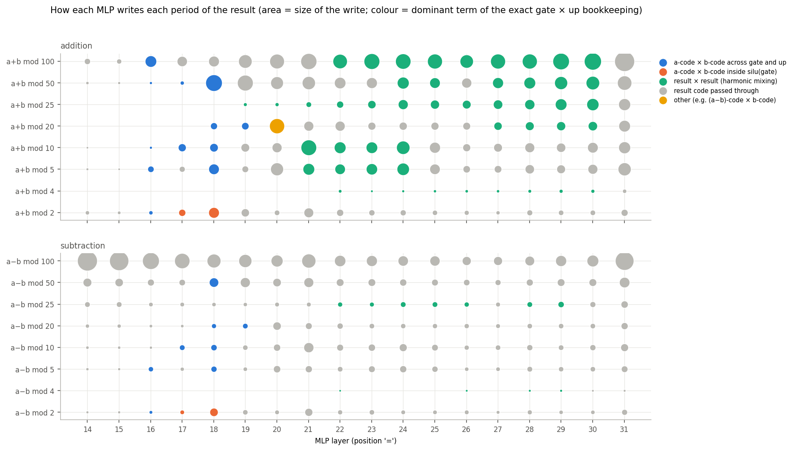

Each dot is one MLP (x) and one result period (y). Area is the size of the write (share of the
stream variance at `=`); colour is the dominant term. Code:
`param_decomp/arith_repr/vectors/mlp_periods.py` (bookkeeping) and `periods_summary.py`
(table, neurons, partners).

**Addition, period by period.** Units are named by their down component. Gate, up and down share
an index from the neuron-aligned init. Shares are of the layer's write at the period's main
harmonic.

| period | made at | how | main units (share of the write) | what the unit reads |
|---|---|---|---|---|
| mod 100 (k1) | L16 (X 0.82); L17-18 (X ≈ 0.4, the rest passed through) | gate × up | L16 c10 0.39, c29 0.23, c43 0.14, c106 0.12; L18 c23 0.81 | c23: gate reads a @53, b @54; up reads a @50, b @51 (all k1) |
| mod 5 (k20) | L16 (X 0.95), L18 (X 0.61) | gate × up | L16 c76 0.25, c94 0.24, c4 0.15, c127 0.14; L18 c26 0.44, c24 0.27, c80 0.18 | c26: gate a @3.5, b @3.3; up a @1.5, b @1.5 |
| mod 10 (k10) | L17 (X 0.91), L18 (X 0.75) | gate × up | L17 c52 0.25, c39 0.19, c49 0.17, c86 0.16; L18 c32 0.37, c88 0.16, c65 0.15, c62 0.14 | c52: gate a @2.4, b @2.4; up (c118) a @3.0, b @2.8 |
| mod 50 (k2) | L18 (X 0.97; the largest creating write of the network, 3.9 % of the variance) | gate × up | c12 0.27, c21 0.17, c22 0.14, c27 0.14 | c12: gate reads a @2.5; up reads b @21.6 |
| mod 20 (k5) | L18 (X 0.98), L19 (X 0.88) | gate × up | L18 c18 0.54, c16 0.24, c59 0.18; L19 c6 0.97 (one neuron) | c6: gate a @19.1, b @19.4; up a @19.5, b @19.7 |
| mod 2 (k50) | L17 (Sx 0.52), L18 (Sx 0.93) | inside silu(gate) | L17 c22 1.0; L18 c4 1.0 (neuron 1712 alone) | gate (c299) reads a's and b's parity; up is ~constant |
| mod 25 (k4) | never from the operands; from L19, growing to L30 (M 0.60-0.93) | result × result | L22 c5 0.29, c6 0.23, c28 0.13, c27 0.12 | partners: k2 + k2 0.51 (mod 50 squared), −k1 + k5, k3 + k1 |
| mod 4 (k25) | L22-L30 (M 0.61-0.98) | result × result | L22 c17 0.88 (neuron 9758) | k20 + k5 0.60, k30 − k5 0.31 (mod 5 × mod 20) |

- **The adder unit (X).** Each creating unit reads a and b at the same harmonic. About half
  split them (gate reads one operand, up the other); the rest read both in both inputs
  (section 2.2):
  - gate ≈ `α cos k(a−φ) + β cos k(b−φ′)`, and up likewise;
  - the product's cross terms `cos k(a−φ)·cos k(b−φ′)` are `½[cos k(a+b−φ−φ′) + cos k(a−b−φ+φ′)]`;
  - the phases add (median error 0.04 period).
  - Silu's own curvature adds a little (Sx mostly < 0.1). The exceptions are parity and L16
    mod 10 (Sx 0.37 next to X 0.39).
- **Parity (Sx).** One neuron's gate reads `(−1)^a` and `(−1)^b` together. Silu's curvature
  squares their sum, which makes `(−1)^(a+b)`: an XOR computed inside the gate
  nonlinearity. Up only scales it.
- **Built from components.** Neurons read by alive down components carry 97-100 % of every
  creating write (82-97 % for the mixing ones). The inputs come from the unit's own gate/up
  components (same index) plus a few shared read directions (e.g. gate c88, c18, c299).
- **Later layers re-derive the periods from each other (M, L21-L30).**
  - mod 5 ← k10 + k10 (0.62 at L21: the units-digit code squared);
  - mod 10 ← k20 − k10 (0.80 at L21);
  - mod 100 ← k2 − k1, k3 − k2 (0.69 / 0.20 at L22);
  - mod 50 ← k1 + k1, k5 − k3 (L23);
  - mod 20 ← k3 + k2, k10 − k5 (L24).
  - From L22 roughly half of each late MLP's result write is this re-synthesis; the rest
    passes the code through. This fits the fan-out of the long periods into higher-dimensional
    codes from L26 (report_representations.md).
- **L20, mod 20.** The one write dominated by "other" (O 0.60). Two neurons (units c3, c6)
  mostly pass the mod-20 code through. They also build it from the `a−b` code times `b` or `a`
  codes, e.g. `(a−b)·k5 × b·k10 → (a+b)·k5` (= (a−b) + 2b), which is not a line term.

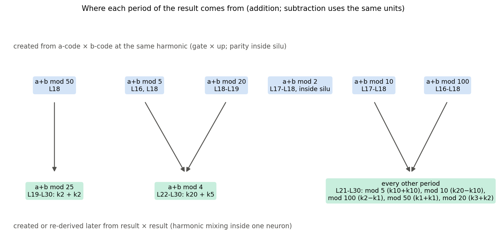

**Does it hold with components only?** The bookkeeping above runs on the model's own neurons
(measured gate/up pre-activations, the model's `W_down`); components only named the units. I
reran it with the MLP rebuilt purely from the alive components, with no CI gating:

- each neuron's `g = Σ_c U_c[n] h_c` over the alive gate components, and `u` likewise over the
  alive up components;
- `W_down` replaced by `Σ_d U_d V_dᵀ` over the alive down components.

A second variant also restores each neuron's missing constant (`periods_compare.py`):

| | components only | + neuron constants |
|---|---|---|
| dominant mechanism agrees with the model (share of write power) | 0.95 | 0.96 |
| cosine of the result write with the model's (power-weighted) | 0.85 | 0.84 |
| size of the write relative to the model's | 0.66 | 0.55 |

- **Every creation step is reproduced**: same mechanism, cosine 0.88-0.99, mostly the same top
  neurons:
  - mod 100 L16: X, cos 0.94;
  - mod 50 L18: X, 0.99;
  - mod 10 L17-18: X, 0.94-0.95;
  - mod 5 L18: X, 0.95;
  - mod 20 L18-19: X, 0.88-0.90 (sub);
  - parity L17-18: Sx, 0.89-0.95;
  - mod 25 L22-29: M, 0.89-0.94;
  - mod 4 L22: M, 0.91.
- **What the components miss:**
  - L30 (cos 0.6-0.8) and above all **L31** (cos 0.15-0.45, 10 % of the power);
  - on subtraction, the pass-through of the early `a−b` comparator code at L14-L17 (cos
    0.4-0.75 at mod 50 / 25).
- Restoring the constants does not help. The gap is missing content, not silu's operating
  point.

**Subtraction** uses the **same units at the same layers**:

- mod 5: L16 c127 / c94 / c76, then L18 c80 / c26 / c24 / c142;
- mod 10: L17 c39 / c86 / c49 / c34, then L18 c32 / c62 / c88;
- mod 50: L18 c12 / c21 / c27 / c22;
- mod 20: L18 c18 / c16 / c59, then L19 c6;
- parity: L18 c4.

The mirrored b turns each a×b product into `a − b`. The difference is at the long periods: an
`a−b` code of period 100, 50 and 25 is already present at `=` before L16 (the early comparator).
So on sub these periods are mostly passed through (P) rather than created. mod 25 and mod 4 again
come only from mixing (L22-L29).

## 4. How the result representation becomes the output token

The unembedding rows of the number tokens 0..199 (final-norm weight folded in) are themselves
structured. Their variance splits into:

- 7 % hundreds step;
- 3 % linear in `n mod 100`;
- **53 % periodic in `n mod 100`**: T100 19 %, T50 10 %, T25 9 %, T20 / T10 / T5 4 % each;
- 38 % token identity.

A result code `F(k)` in the last residual therefore adds `2 Re(F·Ḡ(k) e^{2πik(res−n)/100})/rms`
to the logit of token n. Here `G(k)` is the unembedding's own Fourier plane.

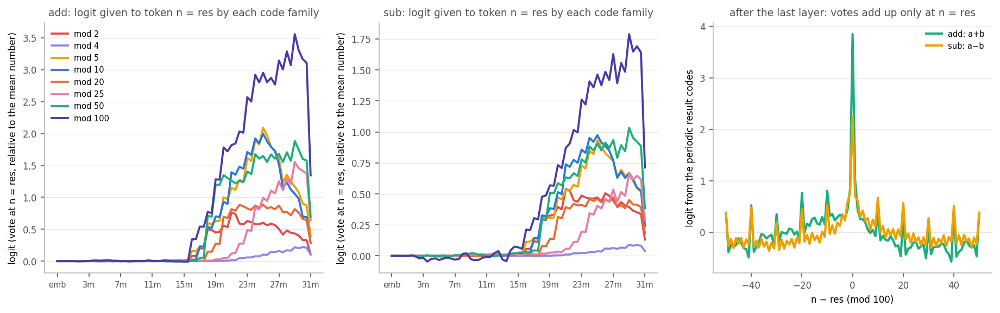

- **Every family's vote is positive at `n = res`, from the moment the code appears (17m).**
  The model writes each result circle in the phase the unembedding reads. Nothing needs to
  "decode" the circle.
- The votes grow to 3-3.5 logits (mod 100 family) at L28-L30 and sum to **3.85** logits (add)
  and 2.24 (sub) at the last point. After the last layer, the profile over `n − res` (right
  panel) peaks sharply at 0. Side peaks at ±10, ±20, ±40 come from the units-digit codes and
  are cancelled by the long periods.
- **Direct votes of the writers** (`R_c(res, k) · U_c·Ḡ(k)`, summed over k) add up to 3.73
  logits (add) and 2.08 (sub). This is almost exactly the stream's total, so the result logit is
  a committee:
  - the largest single component gives 0.07;
  - every layer from L18 to L29 contributes 0.2-0.5;
  - the top voters are units-digit writers (L24 down c4 / c5, L25 c11 / c12, L23 c4: mod 5 and
    mod 10 codes) and long-period writers (L20 c2, L24 c8: k = 1-3).
- **Hundreds (add).** The periodic codes cannot tell `n` from `n + 100`. The hundreds come from a
  magnitude path:
  - gate components read `lin(a) + lin(b)` with equal weights (corr with a + b: 0.75-0.87);
  - their neurons switch on around `a + b ≈ 100`. For example, L27 down c6's inner is 0 below
    80, 2.1 at 95-99, 6.2 at 100-104 and 2.9 above 120;
  - U points along `W_U[100..199] − W_U[0..99]`;
  - the main writers are L27 c6 and L26 c7 (on above 100), plus L22 c29 and L25 c33 (inner
    anti-correlated with a + b ≥ 100; they switch on for the large sums and their U has the
    matching sign).
- **Last layer.** The L31 MLP step shrinks the per-family votes (right edge of the left panels)
  and is only 14 % accounted for by alive `R_c U_c`. It is not captured by this line analysis
  and is probably a norm / confidence adjustment.

## 5. The operation token

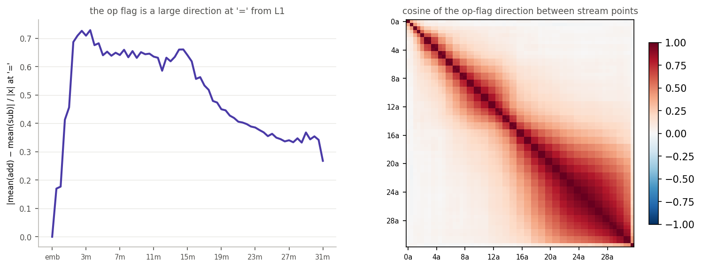

- **Transport.**
  - L0H23's alive attention at `=` is driven by a key component that fires only on the op token
    (k c6);
  - the flag's size at `=` jumps at each of the first three attention steps: 0.17 of |x| after
    L0 attention, 0.41 after L1 attention, 0.69 after L2 attention;
  - the L1H6 / L2H2 o components are one-op-only: L1 o c370 / c47 on add, L2 o c2 on add,
    o c6 / c14 on sub.
  - At the op token itself, the v components read the op as a binary switch (L1 v c17 on sub
    only, v c8 on add only, …).
- **A large, drifting flag.**
  - At `=`, the add − sub mean difference is **45-70 % of the residual norm** from L2 to L15,
    then decays to 27 %.
  - Its direction is not fixed: cos is 0.04 between L2 and L15, and 0.26 between L8 and L15
    (right panel).
  - The flag is carried by one-bit relay components, e.g. L2 down c266 / c3, L3 c28, L4 c16,
    L6 c11, L7 c23, L8 c928, L9 c50, …, L14 c1, L15 c10, L16 c45, L17 c5. Each is ~0 on one op
    and ±2-5 on the other.
  - Every relay's U is aligned with the flag at its write point (cos +0.2 to +0.54, signed by
    its op). Each relay re-writes the flag into the direction the next layers read.
- **Gating.** Readers at `=` with the largest op dependence are pure switches:
  - L1 gate c27 (d′ 51);
  - L15 gate c72: mean 0.02 on add, 15.6 on sub;
  - L15 gate c9: 18.1 on add, 0.07 on sub;
  - L15 up c117.
- **What the op changes: b is mirrored before the adder.**
  - Before the L15 MLP, the gate/up readers at `=` see `b`'s code identically on both ops
    (same/reflect at mlp_in.15: k10 0.99 / 0.53, k20 0.98 / 0.53).
  - From mlp_in.16 on they see it **reflected**: k2 0.15 / 0.78, k10 0.18 / 0.80, k20
    0.10 / 0.95. `a` stays the same on both ops (figure below).
  - The reflection is exactly `b → −b`. Fitting `R_sub = λ_k · conj(R_add)` over the
    L16-L19 readers puts the reflection centre `c` (`b → c − b`) at 0 mod the period for
    every harmonic: within 1.6 for k = 1, 2, 3, 4; −0.3 for k10; 0.0 for k20; −0.7 for k5.
- **Effect on the adder.** Because the readers see `b → −b`, the same fixed L16-L18 units
  multiply `a` by `−b` and write `a − b` into the result planes. The result codes are shared
  across ops (top principal cosine 0.9-0.97 in the earlier sweep). The op never needs its own
  adder; it only decides the sign of b's sine axis (next subsection).

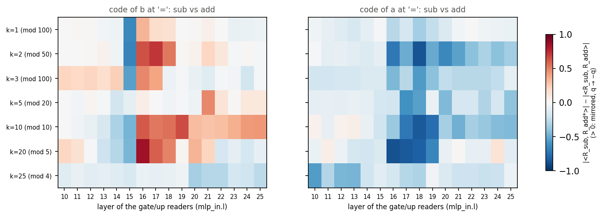

### How the L15 MLP builds the mirror

Split b's code at `=`, as the L16 gate/up readers see it, into an op-even part
`E = (F_add + F_sub)/2` and an op-odd part `O = (F_add − F_sub)/2` (per harmonic k).

**Geometric rule.** `F_sub` is the mirror image of `F_add` exactly when two things hold:

- E lies on one axis `e` and carries `cos(2πkb/100)`;
- O lies on one axis `w ⟂ e` and carries `sin(2πkb/100)`.

Then add = `e·cos + w·sin` and sub = `e·cos − w·sin`: the same circle (or ellipse) traversed
backwards, `b → −b`. The ratio |O| / |E| does not matter.

The readers see exactly this:

| L16 readers | k = 1 | k = 2 | k = 3 | k = 10 | k = 20 |
|---|---|---|---|---|---|
| share of E on one axis | 0.94 | 0.68 | 0.72 | 0.87 | 0.92 |
| share of O on one axis | 0.96 | 0.98 | 0.97 | 0.97 | 0.99 |
| \|cos(e, w)\| | 0.00 | 0.13 | 0.18 | 0.06 | 0.05 |
| phase(O) − phase(E) | −90° | +79° | −72° | −80° | −93° |
| reflect / same (P + L15 MLP only) | 0.93 / 0.60 | 0.84 / 0.12 | 0.83 / 0.26 | 0.83 / 0.05 | 0.97 / 0.09 |

(L17 and L18 readers give the same picture.)

- **Where the two parts come from.**
  - The odd part is written by the L15 MLP: 81-103 % of O at mlp_in.16, against ≤ 5 % from
    L16's attention.
  - The even part is mostly the L15H13 copy (40-75 % of E). In the readers' view the copy
    already sits close to one axis (0.6-0.96).
  - The MLP's op-even write removes most of what is left off that axis: it cancels 56-160 % of
    the copy's off-axis part (k20 over-cancels).
- **Why my first attempt looked harmonic-dependent.** Comparing the MLP write `D` with the
  copy `P` mixes the two parts: D contains both the odd write and the even cancellation. Split
  into E and O, the geometry is the same at every harmonic.

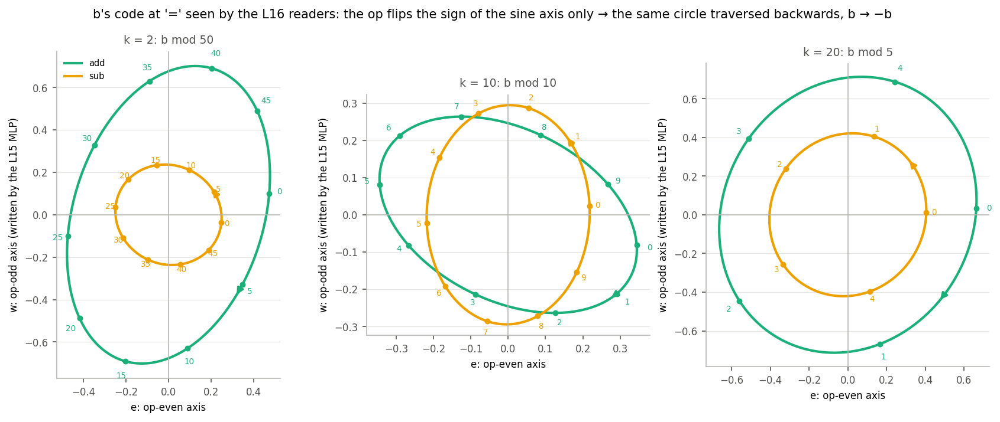

**Which neurons, and how SwiGLU does it.** The MLP output is exactly `W_down · act_b`
(cosine 1.000 with the measured stream change). Splitting the odd write over all 14,336
neurons of L15 gives two findings:

- 2-3 neurons per harmonic carry 85-95 % of it (7 neurons in total).
- `act = silu(g) · u` makes b × (±1) in one of two ways:
  - **A, the op on the gate.** The gate is an op switch fed by gate components c72 / c9. Up
    reads b's code. Two neurons, one opened by add and one by sub, have opposite-sign writes.
  - **B, the op on up.** Up is a signed op read: up components c117 and c34 give u ≈ −2 on
    add and +1 on sub. The gate reads b's code near its silu knee. `act = silu(g(b)) · u(op)`
    is b's code times the op sign, in a single neuron.

| harmonic | neuron | unit (down comp) | op enters via | b read by (peak, T/4 = sine phase) | share of odd write |
|---|---|---|---|---|---|
| k2 (mod 50) | 12769 | c35 | up: u −2.11 add / +0.75 sub (up c117, c34) | gate c35, c19 (13.7; T/4 = 12.5) | 0.45 |
| k2 | 6456 | c19 | up: u +2.07 / −0.65 | gate c35 (37.7; 3T/4 = 37.5) | 0.40 |
| k10 (mod 10) | 9205 | c21 | up: u −1.89 / +1.05 | gate c21 (2.3; T/4 = 2.5) | 0.66 |
| k10 | 9057 | c72 | gate: g −1.42 / +1.49, sub-on (gate c72, c9) | up c72, c67 (7.0; 3T/4 = 7.5) | 0.16 |
| k10 | 13193 | c67 | gate: g +1.01 / −0.21, add-on | up (2.1; T/4 = 2.5) | 0.06 |
| k20 (mod 5) | 7446 | c16 | gate: g +2.73 / +0.34, add-on | up c16, c64 (1.3; T/4 = 1.25) | 0.55 |
| k20 | 11305 | c64 | gate: g −1.78 / +1.69, sub-on | up c64, c16 (1.3) | 0.37 |

Mode shares of the odd write: k2 B 0.94; k10 B 0.75 / A 0.25; k20 A 0.96.

- **Why the centre is 0.** Every odd neuron's b read peaks at a quarter period (T/4 or 3T/4),
  i.e. it reads `sin(2πkb/100)`. So the V vectors of gate c35 / c21 and up c16 / c64 / c72
  select exactly the component of b that must change sign under `b → −b`, and nothing else.
- **What does the switching.** The components behind the whole mechanism are two op switches
  on the gate side (c72 sub-on, c9 add-on) and a signed op read on the up side (c117, c34).
  Each unit is identified by one index across gate/up/down, from the neuron-aligned init.
- **Correction to the earlier version.** The "add-gated c21 vs sub-gated c72" example was
  mislabelled. c21 (mode B) is active on both ops with opposite signs; c72 (mode A) is the
  sub-on partner of c67.

## What the vectors do not settle (for the validation pass)

- **The mirror is read off, not tested.** Settled geometrically in section 5; the causal test
  is to flip the op input of the 7 mirror neurons (n12769, 6456, 9205, 9057, 13193, 7446,
  11305), or of the op components c72 / c9 / c117 / c34, on addition prompts. If this story
  is right, a+b should turn into a−b in the result code.
- **The line analysis only sees additive and line structure.** Conjunctive "window" units
  (blobs in the grids) are captured through their Fourier lines only. Token-identity (lookup)
  variance, which is 25-40 % at every position, is not interpreted.
- **Sub includes `a < b`** (where the model says "?\n"). The line codes are exact on the full
  grid, but the late sub picture mixes the two regimes.
- **Last layer.** L31's MLP and the late fan-out of the long periods (L26+) are only partly
  captured.
- **Suggested first ablations:**
  - the L16-L18 result units (L16 c10, L18 c4 / c12 / c23);
  - the L15 mirror units (down c35, c19, c21, c72, c67, c16, c64);
  - the routing pairs (L15 q c138 × k c48, L16 q c136 × k c5);
  - the hundreds units (L27 c6, L22 c29).

## Files

- `param_decomp/arith_repr/vectors/`:
  - `spectra.py` (frames of the raw stream, read / write spectra);
  - `storage.py`;
  - `transfer.py`;
  - `qk.py`;
  - `mlp_units.py` + `mlp_analysis.py`;
  - `mirror_neurons.py` + `mirror.py` (the b-mirror of section 5);
  - `routing.py` (section 2.1-2.2 numbers) and `figures.py` `routing` / `operand_separation`;
  - `mlp_periods.py` + `periods_summary.py` + `periods_compare.py` (section 3.1; the
    component-only rebuild is `mlp_periods <layer> comp|comp_mean`);
  - `output.py`;
  - `figures.py`;
  - `common.py` / `load.py`.
- Outputs in `<run>/analysis/arith_repr/vectors/`:
  - `frames_{re,im}.npy` (65 points × 4 positions × 2 ops × 4 lines × 50 k × 4096, fp16);
  - `read_spec.npz`, `write_spec.npz`, `storage.npz`, `transfer.npz`, `qk.npz`, `output.npz`;
  - `mlp/L*.npz`, `mlp_units.parquet`;
  - `mirror/L14-16_neurons.npz` (all 14,336 neurons at `=`);
  - `periods/L14-31.npz`, `periods/summary.npz`;
  - `figs/`.
- sbatch files: `~/pd_scratch/dual_obj_jax/arith_repr/vectors/`.
