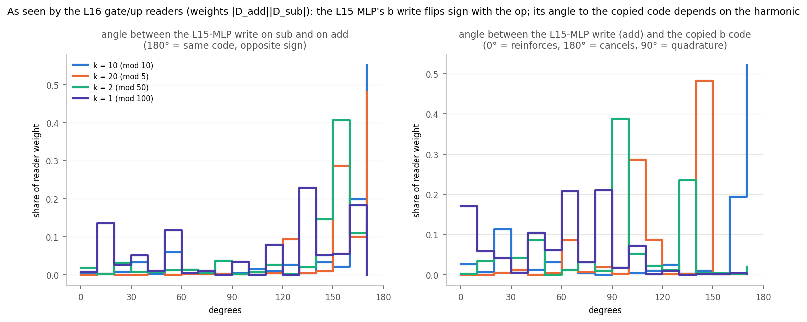

# How Llama-3.1-8B does `a ± b =`, read off the components' U and V

Decomposition `p-ba5a0c05` step 40000, filter `addsub-05-filter-last-pos-ceiling` (11,604 alive
rank-1 components). Descriptive only: no ablations or patching. Every claim below comes from
two measurements:

- **V**: what a component reads. This is its inner activation `h_c = x_norm · V_c` on the
  original model's activations.
- **U**: what it writes. This is `U_c` projected on the codes present in the residual stream
  right after its add.

CI values were not used; everything is computed from V, U and the original model's activations.
The activation-level auto-interp (`report_auto_interp.md`) is the companion to this report. Where
the two overlap they agree, and this report adds the geometry.

Code: `param_decomp/arith_repr/vectors/`. Data and full-size figures:
`<run>/analysis/arith_repr/vectors/`. Working notes: `scratchpad_auto_interp_vectors.md`.

## TL;DR

1. **Storage.** Each operand is stored at its own token as a stack of periodic codes plus a
   magnitude direction:
   - codes: `a mod 2, 4, 5, 10, 20, 25, 50, 100`, plus `lin(a)`;
   - every code is a circle whose residues sit in order;
   - the token embedding already carries `lin(a)` and `a mod 5`;
   - the L0 MLP builds the other codes with residue-detector components. Each detector's U is
     the spoke of its residue on the circle (for example, each L0 units-digit detector's U
     points at 36° × its digit on the `a mod 10` circle).
   - After that the codes stay in place (step-to-step |cos| ≥ 0.9).
   - `a` and `b` are written in **largely the same directions**. The attention v components read
     `a` at position a and `b` at position b with the same phase.
2. **Moving.** Attention copies the operands to `=`:
   - `b` via L15H13, `a` via L16H21;
   - OV is an identity on the code: the median phase shift from source to `=` is 0.05 of a
     period;
   - routing is set by one (q, k) component pair per head. The k components read slot features
     ("second operand", "first operand") that MLPs at L6-L14 build at the operand positions.
3. **Computing.** The result code is made at `=` by the L16-L18 MLPs:
   - gate and up read `a` and `b` codes at the **same harmonic k**;
   - `silu(gate)·up` contains the cross term `cos k(a) · cos k(b)`, which is a code of
     `a + b` (and of `a − b`);
   - the a×b product predicts the newly created result code with cosine 0.99-1.00 (add) and
     0.82-0.91 (sub);
   - U writes it into a result circle, in phase for 40 / 40 of the (unit, harmonic) pairs.
   - From L19 on, the MLPs receive the result code (40-80 % of their input) and re-write and
     refine it.
4. **Output.** Every result-code harmonic is phase-aligned with the unembedding's own Fourier
   plane of the number tokens:
   - each plane votes for the tokens `n ≡ res (mod 100/k)`, and the votes add up only at
     `n = res`;
   - the alive writers' direct votes sum to 3.7 logits (add), from hundreds of small
     contributions spread over L17-L29;
   - the hundreds digit comes from a separate magnitude path: gate reads of `lin(a) + lin(b)`
     go into neurons that switch at `a + b ≈ 100`, and their U points along
     `W_U[100..199] − W_U[0..99]`.
5. **Operation.** The op token reaches `=` through L0H23 / L1H6 / L2H2. There it is a large
   flag direction: 45-70 % of |x|, re-written layer by layer by one-bit add-only / sub-only
   MLP components whose U lies along the flag. The flag gates the L15 MLP:
   - add-gated components write `+code(b)`;
   - sub-gated components write the same residue with the opposite sign;
   - from L16 on, the readers see `b` **mirrored** (`b → −b`) on subtraction, while `a` is
     unchanged;
   - the same L16-L18 "adder" units then compute `a + (−b)`.

## Method (one paragraph per tool)

**Line codes.** Prompts form the full 100 × 100 `(a, b)` grid per op (sub includes `a < b`). For
any vector-valued activation `x(a, b)` and each quantity `q ∈ {a, b, a+b, a−b}` I take the line
Fourier coefficient `F(q, k) = mean x · e^{−2πi k q/100}`, `k = 1..50`. This is the
(k,0) / (0,k) / (k,k) / (k,−k) entry of the 2-D DFT of the grid.

- Harmonic `k` has period `100/gcd(k,100)`: k = 10 is the units digit, k = 20 is mod 5, k = 2
  is mod 50, k = 1 is mod 100, k = 50 is parity.
- For a code in the raw stream, `F` is a pair of directions (a plane). Where they have equal
  norm and are orthogonal, the class means lie on a circle in residue order.
- The linear parts of `a` and `b` are split off first; their 1/k Fourier tail would otherwise
  fill k = 1-3.

**Reading V.** `R_c(q, k)` is the same DFT of the scalar `h_c`. Its argument gives the residue the
component prefers: `q* = −arg R · 100/(2πk)`. Its power gives what the component reads.

**Reading U.** `U_c · F_t(q, k)` projects U on the code of the stream point `t` right after the
add. Its argument gives the residue U "looks like" in that code.

The component's own contribution to the code is `R_c U_c`. Its alignment with the stream code
says whether it reinforces the code, erases it, or turns it (`transfer.npz`). For each
sublayer, the sum over components can be compared with the actual change of the code.

**MLP units.** A down component's V is neuron-sparse (participation ratio ≈ 5.6 neurons), while
gate/up U are dense. So a down component is a handful of neurons, and the gate/up components are
shared read directions. For the top 8 neurons of every down component I took the line spectra of
the gate pre-activation `g`, `up` (both linear reads of the stream), `silu(g)` and
`act = silu(g)·up`.

**Attention.** OV coupling of a v component (source) and an o component (`=`) through head h is
`U_v[kv(h)] · V_o[h]`. QK: for query head h at `=` and source s,
`mean h_q · mean h_k · ⟨RoPE₄ U_q[h], RoPE_s U_k[kv(h)]⟩ / √128`.

## 1. How values are stored, and how the representations are built

Share of the raw residual variance carried by each code, at every stream point (log scale).
"mod 100 (+ identity)" includes all token-identity variance, so it is large by construction.

- **Position a / position b.** The token embedding already carries `lin(a)` and every period.
  The L0 MLP step makes the largest change to the operand codes of the whole network (figure
  below). After it the codes are flat to L31, with modest re-writes by MLPs (L11-L15 refresh
  mod 5 / mod 10).
- **Position `=`.**
  - `b` arrives at L0 (the previous token; all L0/L1 components at `=` read `b` only);
  - `a` arrives by L1-L2;
  - both stay at 1-10 % of the variance until L15-L16, when the dedicated copies arrive;
  - the result codes appear at 16m-18m and dominate from L19;
  - on **both** ops a low-k `a−b` code (period 50-100) builds up at `=` from L2. This is a
    magnitude comparator (sign / size of `a − b`), not `a − b mod 10` (that code only appears
    at 17m-19m on sub).

Which sublayer writes each code. Blue bars are attention steps, orange bars MLP steps. Numbers
are the share of the change explained by the alive components' own `R_c U_c`: 0.8 for the L0 MLP
at the operands, 0.78-0.93 for the result code at L16-L25.

**Residue detectors write the spokes of their residue.** The L0 down components at position a
are one-residue detectors: their `h_c` peaks at one residue of `a mod 10`, `mod 5` or `mod 50`.
Their U, projected on a's code plane at the next stream point, points at **that residue's
position on the circle**. A units-digit detector for digit d points at 36° × d. In the figure, the 10 L0 down
components with > 15 % of their variance on `a mod 10` cover digits 0-5 and 7; the detectors of 6, 8
and 9 have less than 15 % of their variance on this harmonic and fall under the cut. So adding
`h_c · U_c` moves the representation toward the class mean of the residue that switched the
component on.

The same holds across the network: for each writer and each harmonic its inner carries (> 15 %
of its variance), I compared the phase of its write `R_c U_c` with the stream code.

| writers | (comp, k) pairs | in phase (< 60°) | opposite (> 120°) |
|---|---|---|---|
| down, position a, L0-4 | 255 | 0.93 | 0.02 |
| down, position a, L5-14 | 479 | 0.88 | 0.06 |
| down, position a, L15-31 | 964 | 0.80 | 0.09 |
| down, position b, L0-4 / L5-31 | 234 / 749 | 0.94 / 0.91 | 0.02 / 0.03 |
| down, `=`, a+b (add), L16-18 / L19-24 / L25-31 | 40 / 335 / 330 | **1.00** / 0.93 / 0.94 | 0.00 / 0.03 / 0.01 |
| down, `=`, a−b (sub), L16-18 / L19-31 | 27 / 255 | 0.85 / 0.87 | 0.11 / 0.05 |
| o, L15 (b at `=`) / L16 (a at `=`) | 67 / 142 | 0.99 / 0.89 | 0.01 / 0.03 |

Almost every writer is a "spoke": it writes the code of the residue that its V selects, in the
coordinates the stream already uses. There is very little erasing (< 10 %).

**Shared directions for the two operands.**

- The v components read the same phase at both operand positions. Example: L15 v c17 reads
  `a mod 5` peaking at 19.4 at position a, and `b mod 5` peaking at 19.4 at position b.
- The operand code planes at the two positions have |cos| ≈ 1 at the embedding and 0.35-0.6
  at L5-L10.
- They climb back to **0.6-0.85 at L12-L17**, right where L15H13 and L16H21 read them (left
  panel below). This looks like a shared "operand format" that the copying heads can read with
  one V.

## 2. How attention moves information between positions

**What is moved: OV is an identity on the code.** For the 100 (L15H13) and 130 (L16H21)
strongest (v, o) pairs, I compared two phases at the dominant harmonic k:

- the phase of `b` (or `a`) that the v component reads at the source;
- the phase that the o component reads at `=`.

The median shift is 0.05 of a period (71 % / 78 % of pairs within 0.1). The heads transport each
Fourier component unchanged: `b mod 5` peaking at 19.4 becomes `b mod 5` peaking at 19.7 at `=`.

**Where it is moved from: QK from the q and k vectors.** Each head's alive attention logit is
dominated by one q × k pair:

| head | pair | key feature (k component's mean inner by position BOS / a / op / b / =) | effect |
|---|---|---|---|
| L0H23 | q c17 × k c6 | 0 / 0 / 15.2 / 0 / 5.1: "is the op token" | `=` reads op (logit +2.1) |
| L15H13 | q c138 × k c48 | 0 / 0 / 0.4 / −21 / 0.5: "second operand" | `=` reads b (+4.7 add, +4.0 sub) |
| L16H21 | q c136 × k c5 | 0 / 51.6 / 0.5 / 22.8 / 0.1: "operand, first > second" | `=` reads a (+12.3 vs +4.9 on b) |
| L18H30 | q c104 × k c95 | 0 / 45.5 / 0 / 43.5 / 0: "operand" | both operands |
| L17H9 | q c127 × k c9 | 0 / −43.5 / −45.7 / −43.3 / −13.2 | avoids a / op, BOS sink |

The slot features are built earlier by MLPs at the operand positions (writer U · reader V ×
mean inner):

- **"Second operand" (L15 k c48) at position b** comes from L14 down c30, L13 c14, L9 c22 and
  L7 c2, among others. It is exactly zero at position a.
- **L16 k c5** comes from L6-L15 downs at both positions, and is larger at a.

On subtraction the a-copy is weaker (L16H21: a 3.6 vs b 2.5). This matches the activation-level
finding that copies split when `a < b`.

## 3. How the result is computed from the operands

Result-line share of what the MLP neurons at `=` are handed (g and up, both linear in the stream)
versus what they hand to the down components (`silu(g)·up`), per layer:

| layer | result code in g, up | result code in silu(g)·up | share of it newly created | a×b fit (add / sub) |
|---|---|---|---|---|
| L16 | 0.00 | 0.14 | 0.98 | 1.00 / 0.84 |
| L17 | 0.03 | 0.16 | 0.64 | 0.99 / 0.82 |
| L18 | 0.04 | 0.30 | 0.91 | 0.99 / 0.91 |
| L19 | 0.40 | 0.57 | 0.20 | 0.77 / 0.66 |
| L20-L30 | 0.5-0.8 | 0.77-0.91 | re-written | < 0.45 |

**Mechanism (L16-L18).**

- Each unit's gate and up read an `a` code and a `b` code **at the same harmonic k** (see the
  grids below):
  - gate = `α cos k(a − φa) + β cos k(b − φb)`, and up likewise;
  - the product `silu(g)·up` contains `cos k(a−φa) · cos k(b−φb)`, which is
    `½ [cos k(a+b−φa−φb) + cos k(a−b−φa+φb)]`.
- The line-product prediction (`s_a u_b + s_b u_a` plus the cross term inside silu) matches the
  new result-line coefficient in phase and amplitude: cosine 0.99-1.00 on add.
- The phases add: median |peak_out − (peak_a + peak_b)| is 0.04 of a period. Examples:

  | unit | a phase | b phase | predicted a+b phase | measured a+b phase |
  |---|---|---|---|---|
  | L16 down c10 (k = 1) | 81 | 32 | 13 | 12 |
  | L18 c23 (k = 1) | 56 | 57 | 14 | 8 |
  | L18 c12 (k = 2, mod 50) | 48 | 23 | 21.4 | 23.1 |
  | L18 c18 (k = 5, mod 20) | 11.0 | 19.2 | 10.2 | 10.6 |
  | L18 c32 (k = 10, mod 10, sub) | 9.4 | 4.95 | 4.4 (a − b) | 4.4 |

- L18 down c4 is the parity unit (k = 50: a product of `(−1)^a` and `(−1)^b`).
- The U of these units writes the new code in phase with the result circle (40 / 40 pairs,
  section 1 table). Their outputs form the first result code: 0.78-0.92 of the result-code
  change at 16m-18m is their own `R_c U_c`.
- The top writers are L16 down c10 / c29 / c25; L17 c11 / c22 / c67; L18 c4 / c12 / c23 / c21;
  then L19 c0 / c24 / c11 / c32 and L20 c3 / c6 / c2.

(a, b)-grids of the top neuron of four units (rows):

- **L16-L18 units.** Gate and up are sums of horizontal (a) and vertical (b) stripes; the
  product is a lattice or blob, i.e. a conjunction of a-window and b-window.
- **L19 c0.** Gate and up already carry diagonal stripes (the result code arrives as input);
  the product stays diagonal (pass-through / sharpening).
- **Sub** (4th column): the same neuron's output follows `a − b` (diagonal).

The product also makes `a − b` harmonics on add (the second term of the identity). These are
smaller (diff share 0.04-0.24 per unit) and do not accumulate across units.

**L19-L30** keep re-writing the result: 75-90 % of their inner variance is on the result line.
The newly created part is no longer an a×b product; it mixes result harmonics (e.g. k = 1 → k =
2 and 3). This matches the earlier finding that the long periods fan out from Fourier circles
into higher-dimensional codes from L26.

## 4. How the result representation becomes the output token

The unembedding rows of the number tokens 0..199 (final-norm weight folded in) are themselves
structured. Their variance splits into:

- 7 % hundreds step;
- 3 % linear in `n mod 100`;
- **53 % periodic in `n mod 100`**: T100 19 %, T50 10 %, T25 9 %, T20 / T10 / T5 4 % each;
- 38 % token identity.

A result code `F(k)` in the last residual therefore adds `2 Re(F·Ḡ(k) e^{2πik(res−n)/100})/rms`
to the logit of token n. Here `G(k)` is the unembedding's own Fourier plane.

- **Every family's vote is positive at `n = res`, from the moment the code appears (17m).**
  The model writes each result circle in the phase the unembedding reads. Nothing needs to
  "decode" the circle.
- The votes grow to 3-3.5 logits (mod 100 family) at L28-L30 and sum to **3.85** logits (add)
  and 2.24 (sub) at the last point. After the last layer, the profile over `n − res` (right
  panel) peaks sharply at 0. Side peaks at ±10, ±20, ±40 come from the units-digit codes and
  are cancelled by the long periods.
- **Direct votes of the writers** (`R_c(res, k) · U_c·Ḡ(k)`, summed over k) add up to 3.73
  logits (add) and 2.08 (sub). This is almost exactly the stream's total, so the result logit is
  a committee:
  - the largest single component gives 0.07;
  - every layer from L18 to L29 contributes 0.2-0.5;
  - the top voters are units-digit writers (L24 down c4 / c5, L25 c11 / c12, L23 c4: mod 5 and
    mod 10 codes) and long-period writers (L20 c2, L24 c8: k = 1-3).
- **Hundreds (add).** The periodic codes cannot tell `n` from `n + 100`. The hundreds come from a
  magnitude path:
  - gate components read `lin(a) + lin(b)` with equal weights (corr with a + b: 0.75-0.87);
  - their neurons switch on around `a + b ≈ 100`. For example, L27 down c6's inner is 0 below
    80, 2.1 at 95-99, 6.2 at 100-104 and 2.9 above 120;
  - U points along `W_U[100..199] − W_U[0..99]`;
  - the main writers are L27 c6 and L26 c7 (on above 100), plus L22 c29 and L25 c33 (inner
    anti-correlated with a + b ≥ 100; they switch on for the large sums and their U has the
    matching sign).
- **Last layer.** The L31 MLP step shrinks the per-family votes (right edge of the left panels)
  and is only 14 % accounted for by alive `R_c U_c`. It is not captured by this line analysis
  and is probably a norm / confidence adjustment.

## 5. The operation token

- **Transport.**
  - L0H23's alive attention at `=` is driven by a key component that fires only on the op token
    (k c6);
  - the flag's size at `=` jumps at each of the first three attention steps: 0.17 of |x| after
    L0 attention, 0.41 after L1 attention, 0.69 after L2 attention;
  - the L1H6 / L2H2 o components are one-op-only: L1 o c370 / c47 on add, L2 o c2 on add,
    o c6 / c14 on sub.
  - At the op token itself, the v components read the op as a binary switch (L1 v c17 on sub
    only, v c8 on add only, …).
- **A large, drifting flag.**
  - At `=`, the add − sub mean difference is **45-70 % of the residual norm** from L2 to L15,
    then decays to 27 %.
  - Its direction is not fixed: cos is 0.04 between L2 and L15, and 0.26 between L8 and L15
    (right panel).
  - The flag is carried by one-bit relay components, e.g. L2 down c266 / c3, L3 c28, L4 c16,
    L6 c11, L7 c23, L8 c928, L9 c50, …, L14 c1, L15 c10, L16 c45, L17 c5. Each is ~0 on one op
    and ±2-5 on the other.
  - Every relay's U is aligned with the flag at its write point (cos +0.2 to +0.54, signed by
    its op). Each relay re-writes the flag into the direction the next layers read.
- **Gating.** Readers at `=` with the largest op dependence are pure switches:
  - L1 gate c27 (d′ 51);
  - L15 gate c72: mean 0.02 on add, 15.6 on sub;
  - L15 gate c9: 18.1 on add, 0.07 on sub;
  - L15 up c117.
- **What the op changes: b is mirrored before the adder.**
  - Before the L15 MLP, the gate/up readers at `=` see `b`'s code identically on both ops
    (same/reflect at mlp_in.15: k10 0.99 / 0.53, k20 0.98 / 0.53).
  - From mlp_in.16 on they see it **reflected**: k2 0.15 / 0.78, k10 0.18 / 0.80, k20
    0.10 / 0.95. `a` stays the same on both ops (figure below).
  - At the vector level, the L15 MLP writes a `b` code whose sign flips with the op.
  - For example, L15 down c21 (add-gated, `b mod 10 = 7`) has a U that decodes to 7 in the
    add frame.
  - L15 down c72 (sub-gated, same residue 7) has a U that decodes to 2, the antipode.
  - The same holds for c16 / c64 at `b mod 5` (U decodes to 1.3 vs 3.8).
  - Seen by the L16 readers, the L15-MLP write `D` has opposite sign on add and sub (Re cos
    −0.72 to −0.89 at k2 / k10 / k20). The copied code `P` is the same on both ops.
- **Effect on the adder.** Because the readers see `b → −b`, the same fixed L16-L18 units
  multiply `a` by `−b` and write `a − b` into the result planes. The result codes are shared
  across ops (top principal cosine 0.9-0.97 in the earlier sweep). The op never needs its own
  adder; it only decides the sign of b's second code.

## What the vectors do not settle (for the validation pass)

- **How exactly `P ± D` becomes a mirror.** The angle between `D` and the copied code `P`
  depends on the harmonic (~90° at k2, ~140° at k20, ~170° at k10). The reflection is clean at
  the readers, but I have not reduced it to one geometric rule. Patching the sub-gated L15
  components (c72, c64, c90, c10) into add prompts should turn a+b into a−b if this story is
  right.
- **The line analysis only sees additive and line structure.** Conjunctive "window" units
  (blobs in the grids) are captured through their Fourier lines only. Token-identity (lookup)
  variance, which is 25-40 % at every position, is not interpreted.
- **Sub includes `a < b`** (where the model says "?\n"). The line codes are exact on the full
  grid, but the late sub picture mixes the two regimes.
- **Last layer.** L31's MLP and the late fan-out of the long periods (L26+) are only partly
  captured.
- **Suggested first ablations:**
  - the L16-L18 result units (L16 c10, L18 c4 / c12 / c23);
  - the L15 op-gated mirror units;
  - the routing pairs (L15 q c138 × k c48, L16 q c136 × k c5);
  - the hundreds units (L27 c6, L22 c29).

## Files

- `param_decomp/arith_repr/vectors/`:
  - `spectra.py` (frames of the raw stream, read / write spectra);
  - `storage.py`;
  - `transfer.py`;
  - `qk.py`;
  - `mlp_units.py` + `mlp_analysis.py`;
  - `output.py`;
  - `figures.py`;
  - `common.py` / `load.py`.
- Outputs in `<run>/analysis/arith_repr/vectors/`:
  - `frames_{re,im}.npy` (65 points × 4 positions × 2 ops × 4 lines × 50 k × 4096, fp16);
  - `read_spec.npz`, `write_spec.npz`, `storage.npz`, `transfer.npz`, `qk.npz`, `output.npz`;
  - `mlp/L*.npz`, `mlp_units.parquet`;
  - `figs/`.
- sbatch files: `~/pd_scratch/dual_obj_jax/arith_repr/vectors/`.
