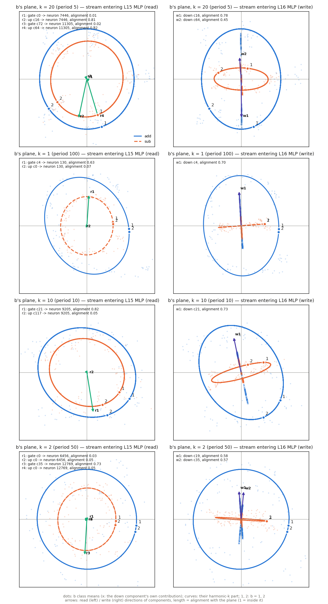

# How the components flip b on subtraction (p-ba5a0c05, alive-only model)

The model sees the prompts `a+b=` and `a-b=`, with integer operands a, b in 1..100, and the
operation op ∈ {add, sub}. Everything below happens at the token `=`.

The model used is the **alive-only model**: every alive component is on for every prompt and
position, with no masks, no delta and no dead components. Against the original model its KL is
0.08 on add and 0.09 on sub.

## Terms

- **b's code at harmonic k.** k is an integer from 1 to 50. It is the part of the stream that varies
  with b as cos(2πkb/100) and sin(2πkb/100), with period T = 100/gcd(k, 100).
- **The flip.** The part of b's code that is odd in b and reverses sign between add and sub. A
  reader then sees b on add and −b on sub. This is the sine axis of b's code, which add and sub
  read with opposite signs.
- **Φ.** The energy of the flip as one layer's gate/up readers see it.
- **Σ.** The energy of the b-odd part that is the same on both operations.
- **Flip share** = Φ/(Φ+Σ). It is 1 for a pure mirror and 0 when b is seen the same way on both
  operations.
- **op flag.** The direction of (mean stream on add) − (mean stream on sub) at `=`.
- **Alignment of a vector with a plane.** The norm of its projection onto the plane, divided by its
  own norm. A random direction gives 0.022.

## Mechanism

1. **The operation reaches `=` early.**
   - Swapping the stream at `=` with the other operation's prompt (same a, b) makes 46–51% of
     answers switch at L3 and 98–100% at L16.
   - A chain of components that carry only the operation passes it along (their activity's
     operation share is 0.96–1.00):
     - at the op token: L0 v c2 and c23, L2 k c93 and c11;
     - at `=`: L3 down c28, L4 down c16, L7 down c23, L13 down c127.
2. **L15's MLP reads the op flag through four switch components.** Each one's mean activity is
   given on add / sub.

   | Component | Cosine with op flag | Mean activity add / sub |
   |---|---|---|
   | gate c72 | −0.58 | 0.1 / 15.8 |
   | up c117 | +0.57 | −0.6 / −15.1 |
   | up c34 | −0.34 | −9.4 / 0.0 |
   | gate c0 | 0.00 | 21.3 / 22.7 |

   gate c0 does not read the operation; it is on for both operations.
3. **Eight L15 neurons multiply b by the operation's sign** (act = silu(gate)·up).
   - The neurons are 12769, 6456 (T50), 9205, 9057, 13193 (T10), 7446, 11305 (T5) and 130 (T100).
   - In each of the first seven, one input reads b's sine phase and the other carries the op switch
     (measured earlier on the original model; neuron 130 was not examined there).
   - The switches spread their drive widely: only 0.4–1.1% of it lands on the seven
     non-130 flip neurons.
4. **One down component per neuron writes the product into b's code at that neuron's harmonic.**
   Each U lies 0.99–1.00 inside the span of the stream's quantity codes.

   | Down | Reads neuron (share of \|V\|²) | Alignment with the flip plane | Its write is b's code on |
   |---|---|---|---|
   | c21 | 9205 (0.55) | 0.90 at T10 | add, T10 |
   | c16 | 7446 (0.55) | 0.85 at T5 | add, T5 |
   | c4 | 130 (0.43) | 0.80 at T100 | add, T100 |
   | c19 | 6456 (0.57) | 0.74 at T50 | add, T50 |
   | c35 | 12769 (0.53) | 0.71 at T50 | add, T50 |
   | c64 | 11305 (0.65) | 0.66 at T5 | sub, T5 |

   At T5 the two operations are written by separate components: c16 writes b's code on add and
   c64 on sub.
5. **L16–L18 components read b at the same harmonics.** Their flip share is 0.81, 0.86 and 0.75 at
   L16, L17 and L18 (0.32–0.58 from L19 on). At T5 they include L16 gate c392 and c94, and L16
   up c127.

## Removal evidence (Φ as a fraction of the unablated model's, at the L16 readers)

- Removing the four switches and down c16 and c4 together leaves 0.03.
- Removing only the switches' paths through the eight flip neurons leaves 0.15.
- Removing one component at a time leaves:

  | Removed | Φ left |
  |---|---|
  | gate c0 | 0.56 |
  | up c117 | 0.60 |
  | down c4 | 0.61 |
  | gate c72 | 0.64 |
  | down c16 | 0.67 |
  | up c34 | 0.68 |

## Figure

One row per harmonic k. Each panel is b's Fourier plane at k: the plane of b's code on add at that
point of the stream. The two axes are its cos axis and its sine axis.

- **Dots and curves.** Dots are the class means of the stream for each value of b. Curves are their
  harmonic-k part, and the markers 1 and 2 show where b = 1 and b = 2 sit, so the direction of
  travel is visible.
- **Arrows.** They are component directions projected on the plane. Arrow length is the
  direction's alignment with the plane (1 means fully inside it).
- **Crosses (right).** The down component's own contribution, by class of b.

Left panels: the stream entering L15's MLP.
- Add and sub travel b's circle in the same direction, so there is no flip yet.
- The input that reads b points along the sine axis, with alignment 0.63–0.82: up c16 and c64
  (period 5), gate c21 (period 10), gate c4 (period 100), gate c35 (period 50).
- The op switches feeding the same neurons barely touch b's plane (gate c0, gate c72, up c117,
  up c0: alignment 0.01–0.07). They read the operation, not b.

Right panels: the stream entering L16's MLP.
- Each writer points along the sine axis.
- At period 5, c16 (add) and c64 (sub) point in opposite directions. c16's own contribution is
  spread along its arrow on add and close to 0 on sub.
- At periods 5 and 10, b = 1 on sub sits on the opposite side of the sine axis from add: the
  mirror.
- Sub's curve is much flatter than add's, so sub's sine component is smaller than add's.

## Is the flip the only difference between the operations?

No. The test reverses only the flip in the stream entering L16's MLP, so each operation gets the
other's flip; the op flag and everything else stay. Each prompt is scored against the unedited
model's top-1 answer.

| Edit | Add: becomes the sub answer | Add: keeps its own answer | Sub: becomes the add answer | Sub: keeps its own answer |
|---|---|---|---|---|
| Reverse the flip | 0.11 (0.10 for a > b) | 0.15 | 0.008 | 0.59 |
| Remove the flip | 0.09 | 0.86 | 0.006 | 0.79 |

The unedited model's add and sub answers coincide on 0.005 of prompts.

## Not settled

- **The writers' b code is also needed for addition.** On addition, removing down c16 costs KL 0.26
  and removing down c4 costs KL 0.21. So these components carry b's code itself, and the flip is
  only its dependence on the operation.
- **The switches also write an operation constant** through other neurons (mainly neuron 9816,
  read by down c6).
- **Which other operation-dependent signals, besides the flip, decide the answer.** The flip
  alone is not enough (previous section).

Code is in `param_decomp/arith_repr/vectors/flip_{alive,core,dirs,set}.py`. Data is in
`<run>/analysis/arith_repr/vectors/flip/`.
