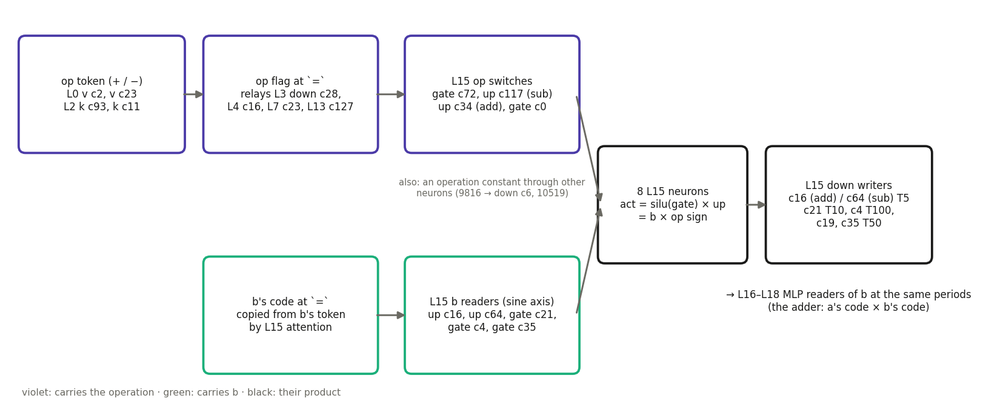
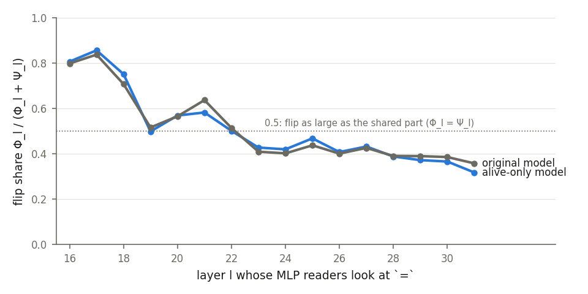
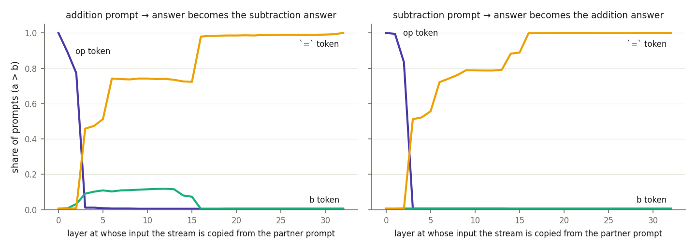
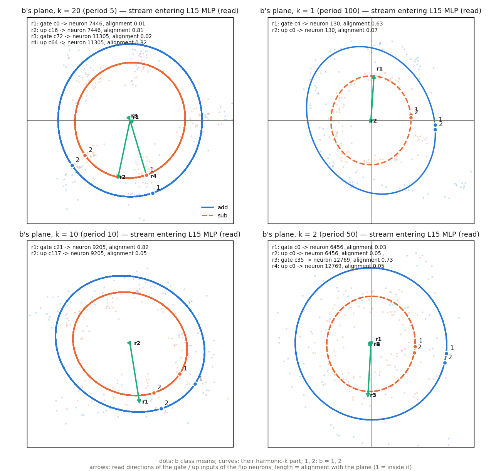
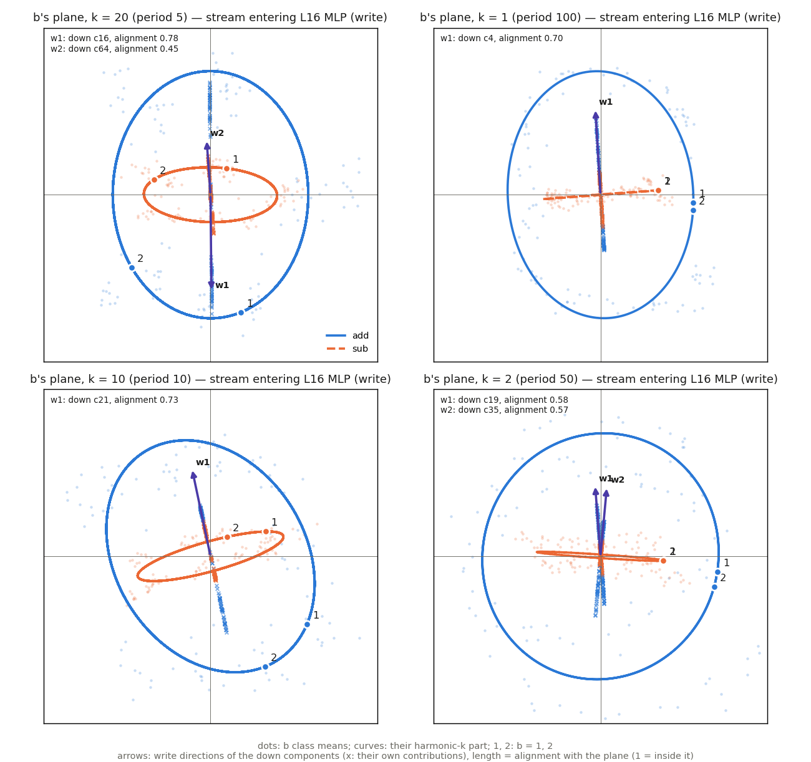
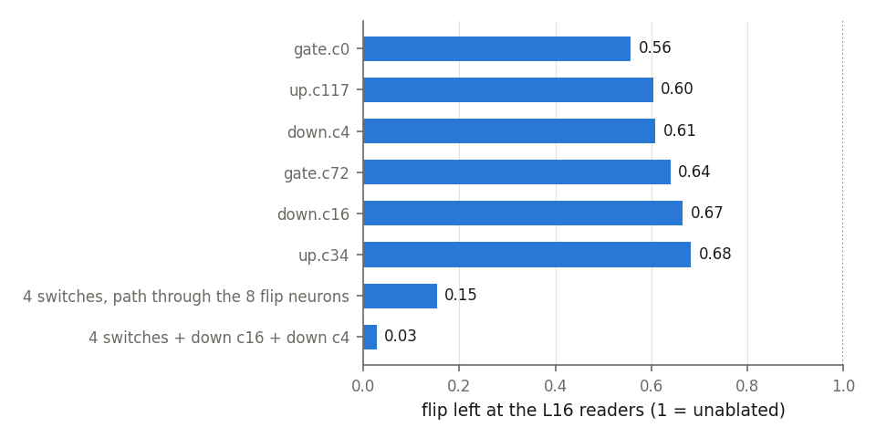
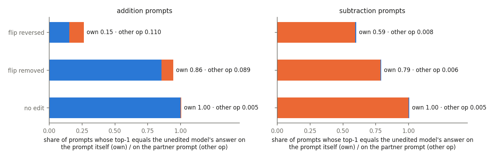

# How a language model turns "+" into "−": the b-mirror in Llama-3.1-8B, read through its parameter components

*Run p-ba5a0c05, analysed in its alive-only components model. Code and data paths are at the end.*

## Summary

When Llama-3.1-8B reads `57+23=` or `57-23=`, it has to produce different answers from the same two
numbers. Earlier work on this decomposition found that the model does not build a separate
subtractor. On subtraction it first **mirrors b**, replacing its internal picture of b by a picture
of −b. Then the same "adder" circuitry computes a + (−b) = a − b.

This post follows the mirror component by component, in five stages (Figure 1):

1. A chain of components carries the operation from the `+`/`−` token to the `=` token.
2. Four components of the layer-15 MLP read the operation.
3. Eight layer-15 neurons multiply a reading of b by the operation's sign.
4. One output component per neuron writes the product back into the stream, as b's code at a
   single frequency.
5. Components of the layer 16–18 MLPs read b at exactly those frequencies.

Removing six of these components erases 97% of the mirror. But the mirror is **not** the whole
story: giving each operation the other operation's mirror, and changing nothing else, turns only 11%
of addition answers into the answer the model gives on subtraction.

*Figure 1. The components of the mechanism, from left to right in the network.*
- *Violet boxes carry the operation; green boxes carry b; black boxes compute and write their
  product.*
- *"T5", "T10", "T50" and "T100" are the periods (5, 10, 50, 100 values of b) of the codes the
  writers produce.*
- *Section 3 explains each box.*

## 1. The setup

### The task

Each prompt is five tokens: a beginning-of-sequence token, a number a, an operation token, a number
b, and `=`. For example: `<BOS> 57 + 23 =`.

- a and b are integers from 1 to 100.
- The operation, which I write op, is either add or sub.
- All 20,000 combinations (100 values of a × 100 values of b × 2 operations) are used.
- Llama-3's tokenizer has a single token for every number up to 999, so the correct answer is one
  token.

Everything in this post happens at the last position, the `=` token, where the model has to
assemble its answer.

### Parameter decomposition, in one paragraph

Parameter decomposition (PD) rewrites every weight matrix W of the network as a sum of rank-one
pieces, W ≈ Σ_c U_c V_cᵀ. Each piece c is called a **component**.

- **V_c is its read direction**, a vector in the matrix's input space.
- **U_c is its write direction**, a vector in the matrix's output space.
- On an input x the component computes a single number, its **inner activation** h_c = x · V_c,
  and adds h_c U_c to the matrix's output.

The decomposition is trained so that, on any given input, only a few components are needed. A
learned "causal importance" (CI) function predicts which ones those are.

In this run, 11,604 components across the attention and MLP matrices of the 32 layers are
**alive**: each one matters on some prompt of this task. A component is named like
`L15.gate.c72`: layer 15, the MLP's gate matrix, component index 72. The matrices are:

- **q, k, v, o:** the attention matrices.
- **gate, up, down:** the MLP matrices. Each MLP neuron computes act = silu(gate input) × up input,
  where silu(z) = z / (1 + e^{−z}). The down matrix writes these activations back into the residual
  stream.

### Which version of the model I analyse, and why

There are three ways to run this network:

1. **The original model**, with its real weights.
2. **The masked components model.** On each prompt, only the alive components that the CI function
   marks as active run. Active means CI > 0.01, with CI computed from the original model's
   activations. The difference between the real weights and the sum of all components (the "delta")
   is dropped.
3. **The alive-only model.** Every alive component runs on every prompt and every position. There is
   no mask, no delta, and no non-alive component.

I started with the masked model and had to abandon it for this question. Its masks are computed
once, from the original model, and many components are switched on for one operation only. For
example, `L15.gate.c72` is on for every subtraction prompt and for no addition prompt.

So in the masked model the operation is supplied at every layer by the masks, not by anything the
network computes. The consequence is easy to measure:
- Take any prompt and its **partner**: the same a and b with the other operation.
- Copy the partner's whole residual stream into the prompt, at one layer and one position.
- In the masked model this never changes the answer. That holds even at layer 0 of the op token,
  where the copy replaces the `+` embedding by the `−` embedding: 2–3% of answers change, which is
  the chance level.

The alive-only model has no masks, so the operation has to travel through the stream. It is close to
the original model:

| Model | Accuracy on addition | Accuracy on subtraction with a ≥ b |
|---|---|---|
| Original | 0.946 | 0.537 |
| Alive-only | 0.987 | 0.527 |

- The KL divergence of its last-position prediction from the original model's is 0.083 on addition
  and 0.088 on subtraction.
- Its top-1 answer agrees with the original model's on 95% of addition prompts and 79% of
  subtraction prompts.
- Both models are weak on subtraction. When a < b they answer "?" rather than a negative number, and
  even on a ≥ b they make errors.

Everything below is in the alive-only model unless stated otherwise.

## 2. How to see b inside the model: Fourier codes

### Codes, planes and axes

Consider the residual stream at `=` at some layer: a vector of dimension d = 4096.

**Class means.** For each value v of b (1 to 100) and each operation o, average the stream over the
100 prompts with b = v and operation o. Call this average ȳ_o(v), and subtract its mean over v.

**b's code at harmonic k.** Take the Fourier transform of the class means over v. For an integer k
from 1 to 50,

  F_{b,o}(k) = (1/100) Σ_v ȳ_o(v) e^{−2πi k v / 100},

which is a complex vector in the 4096-dimensional stream.

**Period.** The harmonic k repeats every T = 100 / gcd(k, 100) values of b:

| k | 1 | 2 | 10 | 20 |
|---|---|---|---|---|
| Period T | 100 | 50 | 10 | 5 |

**b's plane at k** is the plane spanned by the real and imaginary parts of F_{b,add}(k). As b goes
from 1 to 100, the class means projected onto this plane trace an ellipse, going around it k times.

**The plane has two natural axes:**
- **the cos axis**, along Re F, where b and −b land on the same point;
- **the sine axis**, the part of Im F perpendicular to it, where b and −b land on opposite points.

The same construction gives codes for a, for (a + b) mod 100 and for (a − b) mod 100, by grouping
the prompts by those quantities instead of by b. I call all of these the stream's **quantity codes**.

**The op flag** is the vector (mean stream on add) − (mean stream on sub) at `=`. It is the simplest
way the stream can tell the two operations apart.

### What "the flip" means

Replacing b by −b keeps the cos-axis part of b's code and reverses the sine-axis part. So
"subtraction sees −b" means, concretely, that b's sine-axis component has opposite signs on add and
sub. I call this the **flip**.

The flip should be measured in the view of the components that use b, not in the raw stream. For
a layer l (an integer from 16 to 31), the measure is built in five steps.

1. **The readers' view.** Let n_l be the number of alive gate and up components of layer l's MLP,
   and g_l the gain vector (dimension d) of the RMSNorm in front of that MLP. Stack the read vectors
   V_c of those n_l components as the columns of a d × n_l matrix, and multiply row i of it by the
   i-th entry of g_l; call the result G_l. For each value v of b and each operation o, take the class
   mean ȳ_o(v) of the stream entering layer l's MLP at `=` (defined above, already centred over v)
   and form the vector r_o(v) = ȳ_o(v)ᵀ G_l, of dimension n_l. Its c-th entry is the average inner
   activation of reader c over the 100 prompts with b = v and operation o, except that the stream is
   not divided by its rms.
2. **Remove the straight-line trend.** For each operation o and each reader c, fit the 100 values
   r_o(v)[c] with a line s_o[c] · (v − 50.5) by least squares (s_o[c] is a real slope) and subtract
   it; call the result r̃_o(v). A straight line in v is not periodic, so it has no clean "value at
   −v" and is set aside. This removes a sizeable signal: at the layer-16 readers, the op-dependent
   part of that line, Σ_v ‖(s_add − s_sub)/2 · (v − 50.5)‖², is 63.9, as large as the flip energy
   below (62.1). Whether this linear code of b is reversed on subtraction is not measured here.
3. **The b-odd part.** Define −v as 100 − v (so −v ≡ −v mod 100; v = 50 and v = 100 map to
   themselves). The b-odd part on each operation is
   - O_add(v) = [r̃_add(v) − r̃_add(−v)] / 2 on addition,
   - O_sub(v) = [r̃_sub(v) − r̃_sub(−v)] / 2 on subtraction,
   
   both vectors of dimension n_l. In Fourier terms, O_o keeps the sine-axis part of b's code at
   every harmonic k from 1 to 49, and drops the cos-axis part and harmonic 50. No harmonic is
   selected in advance.
4. **Two energies.** With ‖·‖ the Euclidean norm over the n_l readers and both sums over
   v = 1, …, 100:
   - **Φ_l = Σ_v ‖(O_add(v) − O_sub(v)) / 2‖²**, the part that reverses with the operation: the
     flip;
   - **Ψ_l = Σ_v ‖(O_add(v) + O_sub(v)) / 2‖²**, the part that is the same on both operations.

   Φ_l + Ψ_l = (Σ_v ‖O_add(v)‖² + Σ_v ‖O_sub(v)‖²) / 2: the two split the b-odd energy of the two
   operations between them.
5. **Flip share = Φ_l / (Φ_l + Ψ_l).** It is 1 for a pure mirror (O_sub = −O_add) and 0 when both
   operations see b the same way (O_sub = O_add).

Where a section says "Φ" without a layer, it means Φ_16, the flip at the layer-16 readers.

How Φ_16 splits over the harmonics (share of Φ_16 summed over the k with each period T): T = 5,
0.37; T = 50, 0.25; T = 100, 0.24; T = 10, 0.09; T = 25, 0.03; T = 20, 0.02; T = 4 and T = 2,
under 0.01. The four periods used in the rest of this post (5, 10, 50, 100) carry 0.95 of Φ_16, and
0.97 of Φ_17 and Φ_18. The harmonic k = 5 (period 20) has flip share 0.50 at layer 16, 0.40 at 17
and 0.19 at 18, below the 0.79–0.95 of the four main harmonics (k = 20, 2, 1, 10).

Before the layer-15 MLP there is no flip. It appears between the input of the layer-15 MLP and the
input of the layer-16 MLP, and is cleanest at the readers of layers 16 to 18 (Figure 2):

| Readers at layer | 16 | 17 | 18 | 19 to 31 |
|---|---|---|---|---|
| Alive-only model | 0.81 | 0.86 | 0.75 | 0.32–0.58 |
| Original model | 0.80 | 0.84 | 0.71 | 0.36–0.64 |

*Figure 2. Flip share Φ_l / (Φ_l + Ψ_l) at each layer l's MLP readers, at the `=` token. Blue: alive-only
model. Grey: original model. The dotted line marks 0.5, where the flip is as large as the part that
is the same on both operations (Φ_l = Ψ_l).*

## 3. The mechanism, step by step

### Step 1: the operation reaches `=` early

To find where the operation is stored at each layer, I use the partner swap from section 1. Copy the
partner's whole stream at one position and at the input of one layer, run the rest of the network,
and count how often the answer becomes the partner's answer. I count this on pairs with a > b, where
both answers are numbers. Figure 3 shows the result for the op token, the b token and the `=`
token.

*Figure 3. Share of prompts whose answer becomes the partner prompt's answer when the stream at one
position (op token, b token or `=`) is copied from the partner at the input of a layer. Left:
addition prompts. Right: subtraction prompts. Pairs with a > b; alive-only model.*

- **Layers 0–2.** The operation sits at the op token. Copying it there switches every answer at
  layer 0, and 77% (addition) and 84% (subtraction) at the input of layer 2.
- **From the input of layer 3.** The op token no longer matters (1%), so layer 2's attention has
  read it out.
- **Layers 3–15.** The operation is split between two places:
  - at `=`, copying switches 46% (addition) and 51% (subtraction) of answers at layer 3; from layer
    6 to layer 15 it switches 72–74% of addition answers and 72–89% of subtraction answers;
  - at b's own token, copying switches 7–12% of addition answers and almost no subtraction answers.
- **From the input of layer 16.** The `=` stream alone decides: copying it switches 98% of addition
  answers and 100% of subtraction answers.

The components that carry the operation have inner activations that are almost purely a constant
per operation: the operation explains 96–100% of their variance at that position.

- **At the op token:** the attention value components L0 v c2 and L0 v c23, and the key components
  L2 k c93 and L2 k c11. They read the `+`/`−` embedding and route it onward.
- **At `=`:** the MLP output components L3 down c28, L4 down c16, L7 down c23 and L13 down c127.
  Each rewrites the op flag a few layers further on.

### Step 2: four switches in the layer-15 MLP read the operation

Four gate and up components of the layer-15 MLP decide what happens next. In the table:
- **"Cosine with the op flag"** compares each component's read direction (V times the norm gain)
  with the op flag at the input of the layer-15 MLP.
- **"Mean inner activation"** is h_c averaged over each operation's prompts.
- **"Push on the flip neurons"** lists, for each flip neuron n of step 3 that the component writes
  to strongly, U_c[n] × (mean h_c), where U_c[n] is entry n of the component's write vector (into
  the gate or up pre-activations of the 14,336 layer-15 neurons) and the mean is over the prompts of
  the operation on which the component is on, at `=`. It is how much the component moves that
  neuron's gate (for a gate component) or up (for an up component) pre-activation on average.

| Component | Cosine with the op flag | Mean inner activation, add / sub | Role | Push on the flip neurons |
|---|---|---|---|---|
| L15.gate.c72 | −0.58 | 0.1 / 15.8 | on for subtraction only | gate, on sub: 11305 +1.48, 9057 +1.40, 7446 −1.38, 13193 −0.63 |
| L15.up.c117 | +0.57 | −0.6 / −15.1 | on for subtraction only | up, on sub: 130 −1.59, 9205 +1.50, 12769 +1.35, 6456 −1.21, 13193 +0.52 |
| L15.up.c34 | −0.34 | −9.4 / 0.0 | on for addition only | up, on add: 130 +0.97, 9205 −0.97, 12769 −0.88, 6456 +0.85, 13193 −0.32 |
| L15.gate.c0 | 0.00 | 21.3 / 22.7 | on for both; does not read the operation (a shared bias on the flip neurons' gates, step 3) | gate, on add / sub: 7446 +1.50 / +1.60, 13193 +0.69 / +0.74, 130 +0.52 / +0.55, 6456 +0.46 / +0.49 |

Up c117 and up c34 push the same five neurons with opposite signs, on opposite operations: the up
pre-activation of 130, 9205, 12769 and 6456 changes sign between addition and subtraction. Gate c72
acts on a different set: on subtraction it raises the gates of 11305 and 9057 and lowers the gate of
7446.

None of the four reads b. I measure this with **alignment**: the length of a direction's projection
onto a plane divided by its own length, where a random direction in 4096 dimensions gives 0.022. On
b's planes (Figure 4) their read directions have alignment 0.01 to 0.07.

Each switch also spreads its effect over many neurons. I weight each neuron by how much a unit
change of the switch's inner activation moves that neuron's activation, using the original model's
activations at `=`. By that measure, only 0.4–1.1% of each switch's drive lands on the seven main
flip neurons of step 3. A common large target is neuron 9816.

### Step 3: eight neurons multiply b by the operation's sign

An MLP neuron computes act = silu(gate) × up, a product of two inputs. Eight layer-15 neurons use
this product to multiply "b" by "the operation's sign":

| Neurons | Harmonic k | Period T |
|---|---|---|
| 12769, 6456 | 2 | 50 |
| 9205, 9057, 13193 | 10 | 10 |
| 7446, 11305 | 20 | 5 |
| 130 | 1 | 100 |

An earlier analysis of the first seven, on the original model (report_auto_interp_vectors.md,
section 5), found two ways to build the product:

- **The operation enters through the gate.** A switch opens the neuron on one operation only, and
  the up input reads b. Neurons 7446 and 11305 are a pair of this kind: 7446 is open on addition,
  11305 on subtraction.
- **The operation enters through up.** Up carries a signed value, about −2 on addition and +1 on
  subtraction, and the gate reads b.

In both cases the input that reads b reads it at a quarter period, i.e. at the sine phase: exactly
the part of b's code that a mirror reverses. Neuron 130 was not part of that analysis.

The table below sorts all eight neurons into the two mechanisms, in the alive-only model at `=`.
Each neuron's gate and up pre-activations are rebuilt from the components' class-mean inner
activations, one value per (operation, b): pre-activation = Σ_c (mean h_c) U_c[n], with the sum over
the alive gate (or up) components c of layer 15 and U_c[n] the entry of c's write vector on neuron n.
act = silu(gate) × up is applied to those class means. Each cell gives the mean over the 100 values
of b, and in brackets the standard deviation (sd) over b, which is the part that carries b.

| Neuron | Period T | Mechanism | Gate pre-activation, + / − | Up pre-activation, + / − | act, + / − |
|---|---|---|---|---|---|
| 7446 | 5 | gate: open on + | +2.74 (0.08) / +0.34 (0.05) | −0.22 (0.57) / −0.29 (0.46) | −0.56 (1.45) / −0.06 (0.09) |
| 11305 | 5 | gate: open on − | −1.22 (0.08) / +1.73 (0.06) | −0.06 (0.63) / −0.01 (0.51) | +0.02 (0.17) / −0.01 (0.75) |
| 13193 | 10 | gate: open on + | +0.97 (0.31) / +0.00 (0.25) | −0.77 (0.22) / +0.18 (0.18) | −0.61 (0.36) / −0.01 (0.03) |
| 9057 | 10 | gate: open on − | −0.98 (0.33) / +1.56 (0.28) | +0.07 (0.49) / +0.40 (0.39) | −0.01 (0.12) / +0.62 (0.59) |
| 9205 | 10 | up: sign flips | +0.57 (0.61) / +0.68 (0.50) | −1.98 (0.10) / +0.99 (0.07) | −0.84 (0.91) / +0.51 (0.42) |
| 12769 | 50 | up: sign flips | +0.32 (0.64) / +0.45 (0.47) | −2.14 (0.07) / +0.69 (0.08) | −0.59 (0.90) / +0.22 (0.23) |
| 6456 | 50 | up: sign flips | +0.67 (0.50) / +0.93 (0.37) | +1.97 (0.07) / −0.71 (0.09) | +0.96 (0.78) / −0.51 (0.27) |
| 130 | 100 | up: sign flips | +0.73 (0.69) / +0.99 (0.54) | +2.33 (0.10) / −0.96 (0.11) | +1.32 (1.30) / −0.77 (0.54) |

- **Gate neurons** (7446, 11305, 13193, 9057): the gate's mean moves with the operation and
  barely with b (sd 0.05–0.33), so silu(gate) is near 0 on one operation (−0.28 to 0.20) and
  0.72–2.57 on the other; up carries b (sd 0.18–0.63). They come in pairs, one open on each
  operation: 7446 (+) with 11305 (−) at period 5, and 13193 (+) with 9057 (−) at period 10. Each
  neuron's act varies with b on its open operation only (sd 0.36–1.45 against 0.03–0.17).
- **Up neurons** (9205, 12769, 6456, 130): up's mean changes sign between the operations and barely
  varies with b (sd 0.07–0.11), with a magnitude 2–3 times larger on + than on −; the gate carries b
  (sd 0.37–0.69) and its mean stays positive on both. act varies with b on both operations, with
  opposite signs, which is the flip within a single neuron.

**What gate c0 does: it holds the flip neurons' gates open.** gate c0 is the switch whose removal cuts
the flip most (0.56 of it is left, section 4), yet it reads neither the operation (cosine with the op
flag 0.00) nor b (alignment with b's planes 0.01–0.03). To see what it does, I rebuilt each flip
neuron's gate and up pre-activations from the components' class-mean inner activations, one value per
(operation, b). Gate c0 is always on, with an inner activation of about 21–23 on both operations, and
its U adds a positive offset to every flip neuron's gate, almost the same on both operations:

| Neuron | Mean gate input, add / sub | gate c0's part, add / sub | b-dependent spread of act, add / sub | The same without gate c0 |
|---|---|---|---|---|
| 7446 | +2.74 / +0.34 | +1.50 / +1.60 | 1.45 / 0.09 | 0.54 / 0.13 |
| 13193 | +0.97 / +0.00 | +0.69 / +0.74 | 0.36 / 0.03 | 0.18 / 0.05 |
| 6456 | +0.67 / +0.93 | +0.46 / +0.49 | 0.78 / 0.27 | 0.59 / 0.20 |
| 130 | +0.73 / +0.99 | +0.52 / +0.55 | 1.30 / 0.54 | 0.99 / 0.40 |
| 9057 | −0.98 / +1.56 | +0.32 / +0.34 | 0.12 / 0.59 | 0.13 / 0.45 |
| 11305 | −1.22 / +1.73 | +0.26 / +0.28 | 0.18 / 0.75 | 0.17 / 0.60 |
| 9205 | +0.57 / +0.68 | +0.23 / +0.24 | 0.91 / 0.42 | 0.81 / 0.37 |
| 12769 | +0.32 / +0.45 | +0.08 / +0.08 | 0.90 / 0.23 | 0.86 / 0.22 |

"b-dependent spread of act" is the standard deviation over b of act = silu(gate) × up, computed from
these class means; it measures how much of b each neuron passes on.

- **The operation-dependent part of each gate comes from the other switches.** For neuron 7446 the
  gate input is +2.74 on addition and +0.34 on subtraction; gate c0 contributes the same +1.5–1.6 to
  both.
- **Without gate c0, the gates sit lower on silu's curve and the neurons pass on less of b.** The
  largest effects are on the neurons where gate c0's offset is largest. Neuron 7446 on addition
  drops from a spread of 1.45 to 0.54, and neuron 13193 on addition from 0.36 to 0.18; the others
  lose 4–25%.
- **So gate c0 is an operation-independent bias that amplifies the b × operation product.** It does
  not carry the operation or b itself. That is why removing it shrinks the flip without reversing it.

These numbers apply silu to class means. The variation within each (operation, b) class, over a,
is not included.

Figure 4 shows this in the alive-only model. It plots b's plane at each neuron's harmonic in the
stream entering the layer-15 MLP, with the read directions of each neuron's strongest gate and up
inputs on top. "Strongest" means the largest |U_c[n]| × (root-mean-square inner activation) for
neuron n.

*Figure 4. b's plane at four harmonics, in the stream entering the layer-15 MLP.*
- *Pale dots: b's class means (blue: addition; orange: subtraction).*
- *Curves: their harmonic-k part. The markers 1 and 2 show where b = 1 and b = 2 sit, i.e. the
  direction of travel.*
- *Green arrows: read directions of each flip neuron's strongest gate and up inputs. Arrow length is
  the alignment with the plane, where 1 means inside the plane.*

What the figure shows:

- **No flip yet.** Addition and subtraction travel b's circle in the same direction. Subtraction's
  circle is smaller.
- **The b-reading inputs point along the sine axis:**

  | Input | Feeds neuron | Period | Alignment |
  |---|---|---|---|
  | up c16 | 7446 | 5 | 0.81 |
  | up c64 | 11305 | 5 | 0.82 |
  | gate c21 | 9205 | 10 | 0.82 |
  | gate c4 | 130 | 100 | 0.63 |
  | gate c35 | 12769 | 50 | 0.73 |

- **The switches are at the origin.** The op-reading inputs of the same neurons (gate c0, gate c72,
  up c117, up c0) are short arrows, with alignment 0.01–0.07.

### Step 4: one down component per neuron writes the product as b's code

Each flip neuron is read by one component of the layer-15 down matrix. That component's V puts about
half of its weight on the neuron, and its U writes the product back into the stream.

Two measurements describe the write directions U:

- **They are made of quantity codes.** Every one lies 99–100% inside the span of the stream's
  quantity codes (the op flag plus the codes of a, b, a + b and a − b at every harmonic).
- **Each one lies mostly in the flip plane of b at its neuron's harmonic.** The flip plane is the
  plane of (F_{b,add}(k) − F_{b,sub}(k))/2: the part of b's code that differs between the
  operations.

| Down component | Reads neuron (share of \|V\|²) | Alignment with the flip plane | Its write is b's code on |
|---|---|---|---|
| c21 | 9205 (0.55) | 0.90, period 10 | addition, period 10 (0.73) |
| c16 | 7446 (0.55) | 0.85, period 5 | addition, period 5 (0.79) |
| c4 | 130 (0.43) | 0.80, period 100 | addition, period 100 (0.70) |
| c19 | 6456 (0.57) | 0.74, period 50 | addition, period 50 (0.58) |
| c35 | 12769 (0.53) | 0.71, period 50 | addition, period 50 (0.57) |
| c64 | 11305 (0.65) | 0.66, period 5 | subtraction, period 5 (0.66) |

Figure 5 shows the result in the stream entering the layer-16 MLP, after these writes.

*Figure 5. b's plane at four harmonics, in the stream entering the layer-16 MLP. Dots, curves and
markers as in Figure 4. Purple arrows: write directions of the down components, with length equal to
alignment. Crosses: each down component's own contribution, by class of b (blue: addition; orange:
subtraction).*

- **All writers point along the sine axis.**
- **At period 5 the two operations have separate writers.** c16 (addition) and c64 (subtraction)
  point in opposite directions. c16's own contribution, the crosses, spreads the values of b along
  its arrow on addition and is close to zero on subtraction.
- **The mirror is visible.** At periods 5 and 10, b = 1 lies on opposite sides of the sine axis for
  the two operations.
- **Subtraction's ellipse is much flatter than addition's.** Subtraction's sine component is smaller
  as well as reversed.

### Step 5: layers 16–18 read b at the same harmonics

For each writer, the downstream components that pick up its write most strongly (the largest
|U · read direction| among the layer 16–18 gate and up components) read b at the writer's own period:

| Writer | Period | Its strongest readers |
|---|---|---|
| c16 and c64 | 5 | L16 gate c392 and c94, L16 up c127, L17 gate c116, L18 up c26 |
| c4 | 100 | L16 up c10, L16 gate c106, L17 gate c11 |
| c21 | 10 | L17 gate c39 and c52, L18 gate c474 |
| c19 and c35 | 50 | L18 up c22, L17 up c23, L18 gate c27 |

The earlier analysis located the adder in these layer 16–18 MLPs: neurons that multiply a's code by
b's code at the same harmonic, which produces the code of a + b. On subtraction their b input arrives
with its sine axis reversed, so the same neurons produce a − b.

## 4. Taking the mechanism apart

All removals below are at the `=` token only. "Flip left" is Φ at the layer-16 readers after the
removal, divided by its unablated value (Figure 6).

*Figure 6. Flip left at the layer-16 readers after removing single components (top six bars), the
switches' effect through the eight flip neurons only, and the four switches together with down c16
and down c4.*

- **The four switches together with c16 and c4:** 0.03 of the flip is left.
- **Only the switches' effect through the eight flip neurons removed**, keeping their effect on
  every other neuron: 0.15 left.
- **Single components:** gate c0 0.56, up c117 0.60, down c4 0.61, gate c72 0.64, down c16 0.67,
  up c34 0.68.

A greedy search for the full set needed 39 (component, position) pairs. It removed pairs until the
flip was below 5% of its unablated value at every reader layer from 16 to 31, while keeping b's other
codes close to their unablated size (changes beyond ±10% were penalised). Besides the components
above, the set contains:
- the op-flag chain of step 1;
- the layer-15 attention components that copy b to `=`;
- some MLP components at b's own token;
- a few later components in layers 18, 20, 22 and 30.

Removing all 39 breaks the model: accuracy falls to 0.12 on addition and 0.01 on subtraction. So most
of the set does more than the flip. The search is greedy and its set is not minimal: some members
raise the flip when removed alone (L15 q c142 by +0.24) and only lower it in combination.

### What the core components do besides the flip

- **The writers carry b's code itself, which addition also needs.**
  - Removing down c16 alone costs KL 0.26 on addition and nothing on subtraction. Addition accuracy
    falls to 0.74 for sums under 100 and to 0.70 for sums of 100 or more.
  - Removing down c4 alone costs KL 0.21 on addition. Accuracy stays at 0.95 for sums under 100 but
    falls to 0.64 for sums of 100 or more. Its period-100 code places b's overall magnitude.

  So the flip is not a separate signal: it is how this supply of b's code differs between the two
  operations.
- **The switches also write a constant per operation.** Through neurons other than the flip
  neurons, mostly neuron 9816 (read by down c6) and neuron 10519, they write a vector that depends
  only on the operation.
  - Removing that path barely changes the flip: 0.82 of it is left.
  - It raises accuracy on subtraction with a ≥ b from 0.53 to 0.70.
- **Removing the core six and adding the flip back restores most of the model.** I removed the four
  switches and down c16 and c4. Then I added back the flip part of what their removal changed, as a
  fixed vector per (operation, b).

  | Accuracy | Unablated | Core removed | Core removed, flip added back |
  |---|---|---|---|
  | Addition, sums under 100 | 0.99 | 0.78 | 0.99 |
  | Addition, sums of 100 or more | 0.98 | 0.44 | 0.77 |
  | Subtraction, a ≥ b | 0.53 | 0.20 | 0.65 |

  The damage that remains, on large sums, is the core's non-flip function.

These numbers are accuracies against the correct answer. They do not say whether an intervention
swaps the operation; the next section does.

## 5. Is the mirror what makes the model subtract?

The direct test changes only the flip.
- **The edit.** In the stream entering the layer-16 MLP, I add to each prompt the vector that gives
  its operation the other operation's flip: the flip part of b's class means, reversed, as a fixed
  vector per (operation, b). The op flag and everything else stay as they were.
- **The scoring.** Each prompt is compared with what the **unedited** model answers on the partner
  prompt, and with what it answers on the prompt itself.

| Edit at the input of layer 16 | Addition: answer becomes the subtraction answer | Addition: answer unchanged | Subtraction: answer becomes the addition answer | Subtraction: answer unchanged |
|---|---|---|---|---|
| none | 0.005 | 1.00 | 0.005 | 1.00 |
| flip removed | 0.09 | 0.86 | 0.006 | 0.79 |
| flip reversed | 0.11 (0.10 for a > b) | 0.15 | 0.008 | 0.59 |

*Figure 7. The flip-swap test. Each bar splits the prompts whose top-1 answer equals the unedited
model's answer on the prompt itself ("own", the operation's own colour) or on the partner prompt
("other op", the other operation's colour). The rest of each bar's width, up to 1, are prompts whose
answer is neither.*

- **On addition prompts**, subtraction's flip changes 85% of the answers, but only 11% become the
  answer the model gives on subtraction.
- **On subtraction prompts**, addition's flip almost never produces the addition answer.

So the mirror matters for much of the model's behaviour, but it is not the only operation-dependent
signal that reaches the answer from layer 16 onward.

## 6. What is not settled

- **Which other signals decide the answer.** The op flag at `=` is the obvious candidate, but the
  swap test only shows that changing the flip alone does not switch the operation.
- **How far the alive-only picture carries over to the original model.**
  - The original model has the same flip shares at layers 16–18 (0.80, 0.84, 0.71).
  - At layer 15 of the original model, the alive components carry the whole operation decision:
    copying their contributions from the partner prompt does what copying the full layer output
    does, and copying the delta's part changes nothing.
  - But removing the 36 components of the flip set found in the masked model (§1, model 2), only
    their active contributions, breaks the original model (accuracy 0.01). The masked model survives
    the same removal (accuracy 0.85 on addition, 0.43 on subtraction), because its fixed masks keep
    every other component off; the original model has no such protection.
- **Neuron 130's input pattern** has not been analysed the way the other seven were.

## Code and data

- **Code:** in `param_decomp/arith_repr/vectors/` on the branch `experiment/arith_representations`:
  - `flip_set.py`: the three model variants and the flip-set search;
  - `flip_alive.py`: baseline, set evaluation, flip swap;
  - `flip_core.py`: the core components' pieces;
  - `flip_dirs.py`: read and write directions against the quantity codes;
  - `flip_fig.py`: Figures 4 and 5;
  - `flip_report_figs.py`: Figures 1–3, 6 and 7;
  - `flip_patch.py`: partner patching.
- **Data:** `<run>/analysis/arith_repr/vectors/flip/`, where `<run>` is
  `/mnt/nw/home/a.vigouroux/out/pod-backup/p-ba5a0c05`.
