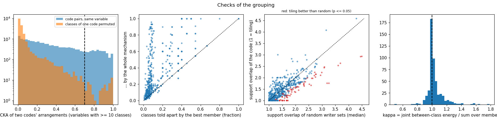
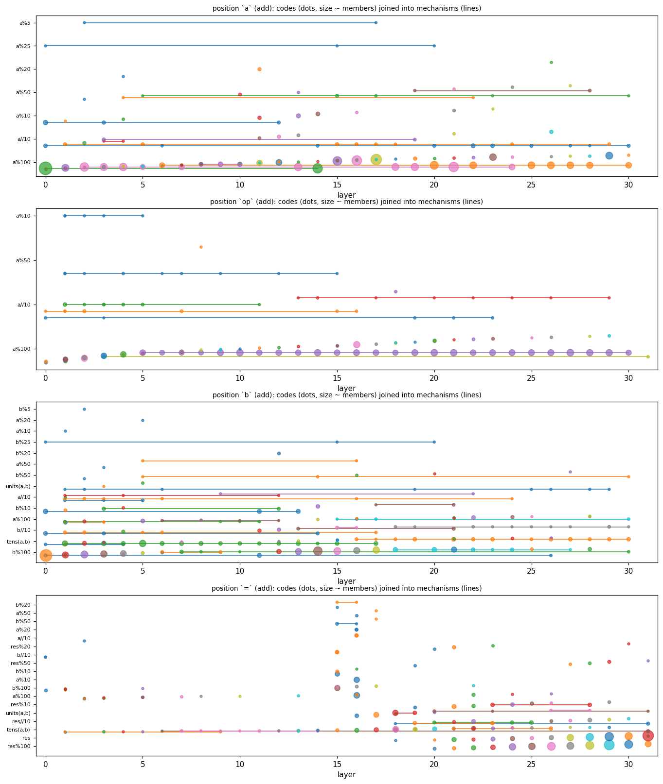
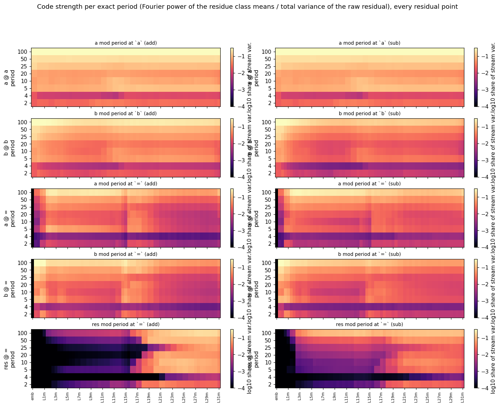
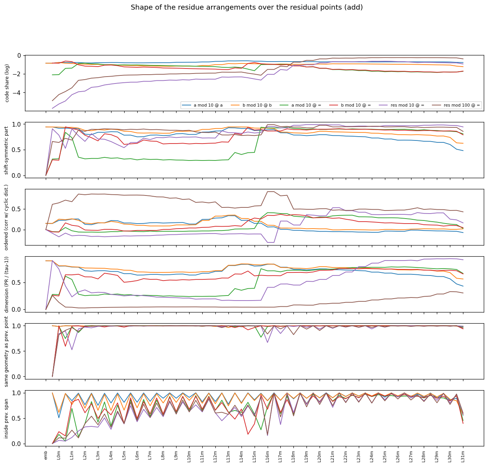
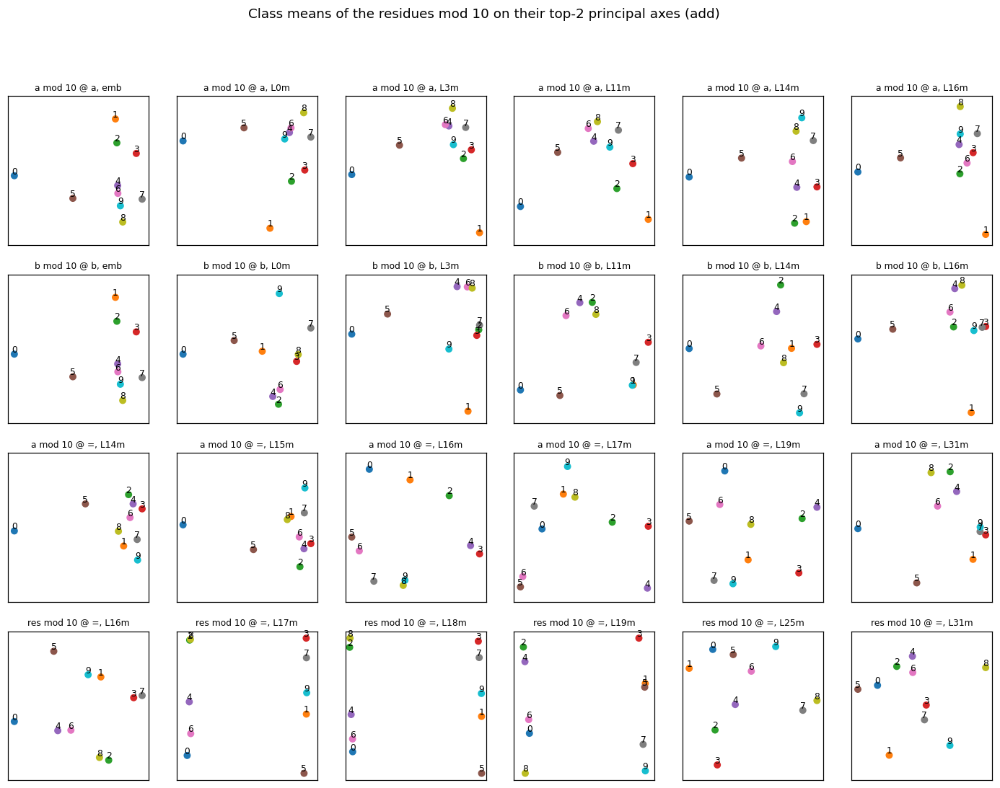
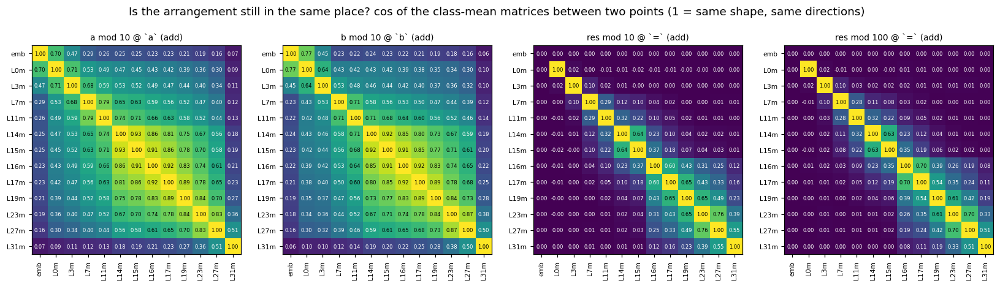

# From components to mechanisms: residue arrangements and the components that move them

Decomposition `addsub-all-layers-4xh100-05` (run p-ba5a0c05, step 40000), filter
`addsub-05-filter-last-pos-ceiling`, prompts `a op b =` with a, b in 1..100. This report continues
[report_auto_interp.md](report_auto_interp.md). Like that report, it only describes activations
of the unmodified model; nothing here has been tested by intervention.

It answers two questions.

1. Several components can do one elementary job together: ten components that each handle one
   residue of a mod 10, or the same representation written again at several layers. When is
   grouping them into one **mechanism** justified, and what are the mechanisms?
2. For a group of values of a (or b, or the result), such as the ten residues mod 10, how are
   their representations arranged relative to each other at each layer, and how do the weight
   matrices change that arrangement?

The second question is answered first (§2), because the answer determines which grouping
criteria can work (§1).

<details><summary>Legend</summary>

* **Position**: `a`, `op`, `b`, `=` are the token positions 1–4. **add / sub** is the operation.
  **res** is a+b (add) or a−b (sub).
* **Variable**: a function of the prompt that a component's write can depend on. The candidates
  are `q%τ` (the residue of q mod τ, for q in a, b, res and τ in 2, 4, 5, 10, 20, 25, 50, 100),
  `q//10` (tens digit), `res` (the full value), `units(a,b)` (the pair of units digits, 100
  classes), `tens(a,b)` (the pair of tens digits, 121 classes) and the flags carry/borrow,
  cmp(a,b), res≥100 / res<0. Each writer gets the variable with the fewest classes that explains
  ≥ 90 % of the best adjusted R² of its gated write, provided that best R² is ≥ 0.5.
* **Writer**: an o_proj or down_proj component. Its write at a prompt is w·U, with
  w = inner·[CI > 0.01].
* **Arrangement** of a variable at a residual point: the class means of the raw residual over
  its classes (e.g. the ten mean vectors of the prompts with a ≡ 0, …, 9 mod 10), centred.
  Points are `embed`, then `Ll attn` (after layer l's attention adds its output) and `Ll MLP`
  (after its MLP adds its output).
* **Support** of a component: the classes where its mean write differs from its typical
  (median) class by at least half its largest deviation. These are the classes it moves.
* **k** in spectra: a frequency on the mod-100 circle. Its period is 100/gcd(k, 100), so k = 10
  is period 10, k = 20 period 5, k = 50 period 2 and k = 1 period 100.

</details>

## Summary

* **The shape of the operand code never changes; its position does.** At `a` (and likewise
  at `b`) the ten residues of a mod 10 sit almost like the corners of a simplex, a one-hot-like
  code: every residue is about equally far from every other, and the pattern looks the same
  from each residue (it is shift-symmetric). This already holds in the token embedding. After
  every layer the new arrangement has the same shape as the old one (CKA ≥ 0.97 from L1 on),
  but it gradually moves to new residual directions. Attention steps leave it almost in place.
  Each MLP step moves 10–50 % of it into new directions. Compared with the embedding, the
  mod-10 arrangement at `a` has cos 0.25 after the L15 MLP and 0.07 after L31 (§2).
* **Writers of the same variable write in almost orthogonal directions.** Take two writers of
  the same variable at the same position. The cosine between their contributions (write
  pattern times U direction) has a median of 0.000–0.002 and a 99th percentile of 0.03–0.07,
  against 0.02–0.03 when U is replaced by a random writer's. Fewer than 0.05 % of pairs exceed
  0.3. Even writers with the same pattern (|corr| ≥ 0.9) have a median |cos U| of only
  0.02–0.06. Groups of such writers have κ ≈ 1 (joint energy = sum of the members' energies)
  in 94 % of the multi-component mechanisms. So "moving the same representation over several
  layers" does not mean pushing along one fixed axis. It means writing the same shape into new
  directions, layer after layer (§1.1, §2).
* **Criteria used.** Writers are grouped only if they have the same position, operation and
  variable, and in addition one of these holds:
  * they sit in one step: one block, or two adjacent layers whose supports tile the classes;
  * across layers, they write the same arrangement shape (CKA ≥ 0.7). For ≥ 12 classes, 12 % of
    real code pairs pass this, against 0.01 % after shuffling one code's classes.

  This turns 8043 labelled writers into 1156 codes and 682 mechanisms.
  The result is then checked rather than filtered:
  * 86 % of the multi-component mechanisms tell apart more classes than their best member;
  * 48 % have a downstream reader that draws on ≥ 2 members at once;
  * members' writes add orthogonally (κ in [0.8, 1.25]) in 94 %.

  See §1.2–§1.4 and the [catalogues](#4-complete-catalogues).
* **Tilings exist but are the exception.** A tiling is a set of members that each handle
  their own residues. The units digit of a is written by three tilings at `a`: ten L0 detectors
  (one per residue, no overlap), eight L13 detectors and seven L14 detectors. The units digit
  of b has the same structure at `b` (L0, L11, L13). Among all codes with ≥ 3 members, only
  14% (84 of 595) overlap less than random sets of writers of the same variable. Most codes
  are blocks of overlapping detectors (§3.1, §3.2).
* **The copies into `=` keep the shape.** At L15, H13 writes b mod 10 at `=` with ten o
  components (CKA 0.84 with the arrangement at `b`). At L16, H21 writes a mod 10 with sixteen o
  components (CKA 0.80 with `a`). Each component covers an overlapping subset of residues. Only
  together do they tell all ten apart (§3.3).
* **The result is assembled from pair detectors and then changes shape.** L17's down
  components are units-digit-pair detectors: 13 components that together tell apart 90 of the
  100 (a%10, b%10) pairs. So are L18–L19's (22 components, 88 pairs). The result's units digit
  first appears at L19–L20 as a period-10 circle. From L21 on it is a simplex (8 components
  tell apart all 10 residues) and is re-written by a separate mechanism at almost every later
  layer. Before L16, res mod 100 at `=` is an ordered circle of period 100. On add it is weak
  (≤ 2 % of the variance). On sub it holds 13–16 % of the variance and survives removing the
  separate a and b codes, so it comes from an interaction of a and b. What it encodes is not
  resolved here. From L19 on it spreads over many frequencies and reaches dimension ≈ 30 at the
  output (§2.3, §3.4, §3.5).

## 1. When is a group of components one mechanism?

### 1.1 What a component does to an arrangement, and why grouping cannot rely on directions

A writer c changes the arrangement of a variable by C_c = m_c ⊗ U_c. Here m_c(v) is the mean of
its write coefficient over the prompts of class v (centred), and U_c is its output direction.
This works because the residual is additive: the arrangement after a layer equals the one
before plus the C_c of every writer of that layer, plus whatever the decomposition does not
capture. Summing C_c over a set of writers therefore gives exactly how much they change the
arrangement together.

The simplest idea for "the same representation moved over several layers" would be writers
whose C_c point the same way: same class pattern and overlapping U. The data rule this out:

| position | op | writer pairs, same variable | median abs cos | q99 | q99 with random U | share > 0.3 | pairs with the same pattern (abs corr >= 0.9) | abs cos(U) median / q99 | random U: median / q99 |
|---|---|---|---|---|---|---|---|---|---|
| `a` | add | 514984 | 0.000 | 0.031 | 0.016 | 0.0001 | 3104 | 0.024 / 0.283 | 0.012 / 0.054 |
| `a` | sub | 522118 | 0.000 | 0.031 | 0.016 | 0.0001 | 3117 | 0.024 / 0.286 | 0.012 / 0.059 |
| `op` | add | 237148 | 0.001 | 0.049 | 0.025 | 0.0002 | 5154 | 0.022 / 0.229 | 0.012 / 0.062 |
| `op` | sub | 581885 | 0.001 | 0.032 | 0.019 | 0.0002 | 6395 | 0.018 / 0.300 | 0.012 / 0.060 |
| `b` | add | 116874 | 0.001 | 0.052 | 0.021 | 0.0003 | 1795 | 0.025 / 0.310 | 0.012 / 0.052 |
| `b` | sub | 196032 | 0.001 | 0.047 | 0.025 | 0.0002 | 3715 | 0.021 / 0.246 | 0.012 / 0.055 |
| `=` | add | 84923 | 0.001 | 0.062 | 0.018 | 0.0005 | 292 | 0.055 / 0.473 | 0.011 / 0.093 |
| `=` | sub | 53734 | 0.002 | 0.073 | 0.027 | 0.0005 | 352 | 0.050 / 0.446 | 0.012 / 0.077 |


<details><summary>Why this rules out direction-based grouping</summary>

The Frobenius cosine of two contributions is corr(m_c, m_c′)·cos(U_c, U_c′). The table shows
that the small values come from the U factor. Pairs whose write patterns are the same
(|corr| ≥ 0.9) still have a median |cos U| of 0.02–0.06, only a few times that of random writer
pairs (0.012). Only their top 1 % reach 0.23–0.47, a tail that random pairs do not have
(0.05–0.09). Aligned re-writes along the same axis therefore exist, but they are rare. κ (next section) says the same about whole
groups: the joint between-class energy equals the sum of the members' energies (median 1.00),
so the members neither add up along one axis (κ > 1) nor cancel (κ < 1). Section 2 shows the
same thing at the level of whole arrangements: the shape is kept and the location drifts.

</details>

### 1.2 Conditions for a valid group, and the check behind each

A set of writers is counted as **one mechanism acting on one variable** when all of the
following hold.

<details><summary>(i) Same variable, position and operation</summary>

Every member's gated write must be a function of that variable: its variable label, R² ≥ 0.5 of
w on the variable's classes. Without this, the sum of the members' contributions is not an
arrangement of that variable. The coarsest explaining variable is used, so that a detector of
a%10 = 3 counts as `a%10`, not `a%100`. The price is that nested variables stay separate: a
parity writer (`a%2`) and a units-digit tiling (`a%10`) are never grouped, even when together
they would give a mod-10 code by the Chinese remainder theorem. Operations are clustered
separately and then matched (`twin`: the mechanism of the other operation with the largest
member overlap).

</details>

<details><summary>(ii) One step: a code = one block, or adjacent layers that tile</summary>

A **code** is all writers of the variable in one block (a layer's MLP, or one attention head,
the head of an o component being the one its V reads most). Blocks at the same or adjacent
layers are merged when their supports tile the classes, i.e. the two blocks' support unions
overlap by ≤ 20 % of the smaller one. This is the "layer N handles residues 0–4, layer N+1
handles 5–9" case. Merging stops at a span of two layers so that tilings cannot chain across
the network.

Checks: `coverage` (classes in some member's support); `groups` (classes the joint write tells
apart, i.e. class means further apart than 5 % of the mean distance) against the best member;
`loo_needed` (share of members whose removal merges two classes); `overlap` = Σ|support| /
|union of supports| (1 = perfect tiling) against 200 random sets of as many writers of the same
variable at that position (`overlap_p` = share of random sets that overlap as little or less).

</details>

<details><summary>(iii) Across layers: the same shape written again</summary>

Codes of the same variable at different layers are joined into one mechanism when their
arrangements have the same shape: linear CKA of their class-mean Grams (class-count weighted)
≥ 0.7, with average linkage. CKA ignores directions, which is exactly what §1.1 requires.
This is the "same representation shifted successively" case. The threshold is compared with
the CKA of the same code pairs after permuting one code's classes:

| variable |  | pairs | median CKA | q90 | q99 | share >= 0.7 |
|---|---|---|---|---|---|---|
| 2-3 classes | code pairs | 24 | 1.000 | 1.000 | 1.000 | 1.0000 |
| 2-3 classes | one code's classes permuted | 24 | 0.104 | 1.000 | 1.000 | 0.2917 |
| 4-11 classes | code pairs | 2890 | 0.499 | 0.902 | 1.000 | 0.3280 |
| 4-11 classes | one code's classes permuted | 2890 | 0.139 | 0.430 | 0.900 | 0.0190 |
| >= 12 classes | code pairs | 16091 | 0.257 | 0.741 | 0.948 | 0.1173 |
| >= 12 classes | one code's classes permuted | 16091 | 0.021 | 0.060 | 0.129 | 0.0001 |


For 2–3-class variables any two codes have the same shape (CKA 1), even after permutation. All
codes of a flag or a parity at one position therefore end up in one mechanism, which is the
intended reading ("the flag, written at these layers"). For 4–11 classes, 1.9 % of permuted
pairs pass 0.7, against 33 % of real pairs. For ≥ 12 classes the figures are 0.01 % against
12 %.

</details>

<details><summary>(iv) Checks reported for every group (not used to form the groups)</summary>

Per mechanism, on every prompt:

* `purity`: the share of the joint write's energy that is between-class.
* `acc`: balanced nearest-centroid accuracy of the variable from the joint write, against the
  best code and the best member.
* `kappa`.
* `consumers`: downstream readers (q/k/v/gate/up components reading the variable with
  R² ≥ 0.3) that draw ≥ 20 % of their class-mean profile of the variable from the joint write.
  The draw goes through their V·(norm weight)·U_c/rms connection. `joint_consumers` are the
  consumers for which ≥ 2 members each supply ≥ 10 %.

</details>

<details><summary>Pitfalls and what was done about them</summary>

* **On-set is not write.** A component can be on for a class and still write nothing that
  differs between classes. Labels and supports therefore use the gated write w, not the CI.
* **The CI function is not causal.** At `a`, `op` and `b` a gate can depend on later tokens
  (report_auto_interp.md §0). The labels are computed per operation, so a gate that switches
  with the operation shows up as a difference between an add mechanism and its sub twin.
* **Result class means mix in the operands.** Class means over res also pick up the a and b
  codes wherever the grid makes a, b and res dependent: res = 199 forces a = 100, b = 99, and on
  sub the sign of res is the comparison a < b. `res_int` subtracts E[E[x|a] + E[x|b] | res],
  which leaves only what an interaction of a and b can write.
* **Deterministic positions.** At `a` and `op` the residual is an exact function of a within
  one operation, so any set of distinct writers decodes a perfectly. There, per-prompt accuracy
  carries no information, and the class-level checks (`groups`, `overlap`, CKA) are the ones to
  read.
* **Greedy order.** Blocks are merged in layer order, first fit. Only the adjacent-layer tiling
  step depends on the order, and it rarely fires (the codes table below counts multi-block
  codes).

</details>

### 1.3 Outcome of the checks



| check | value |
|---|---|
| mechanisms with > 1 component | 508 |
| joint write tells apart more classes than its best member | 0.86 |
| joint decoding accuracy > best member + 0.05 | 0.72 |
| purity of the joint write >= 0.8 | 0.67 |
| kappa in [0.8, 1.25] (writes near-orthogonal) | 0.94 |
| kappa > 1.25 (constructive) | 0.05 |
| kappa < 0.8 (cancelling) | 0.01 |
| read jointly by >= 1 consumer | 0.48 |
| codes with >= 3 comps | 595 |
| ... tiling better than random sets (p <= 0.05) | 0.14 |
| ... every member needed (loo_needed = 1) | 0.25 |


How to read it:

* 86 % of the multi-component mechanisms tell apart more classes than their best member (the
  points above the diagonal in the second panel), so grouping usually adds something. The
  exceptions are mostly redundant copies: several members with the same support.
* κ is concentrated at 1 (fourth panel), so members add orthogonal pieces.
* Only a minority of codes are tilings better than random (third panel, red): the units-digit
  lookups at `a` and `b`, the large value lookups of a and b (`a%100` / `b%100` blocks at L0,
  L2, L14–L17 and L20), and a few `tens(a,b)`, `units(a,b)` and result blocks at `=`. In the other codes, overlapping detectors share one block.

### 1.4 How many mechanisms

| position | op | writers with a variable | codes | multi-comp codes | tilings (p <= 0.05) | mechanisms | with > 1 code | share with a twin on the other op (overlap >= 0.5) |
|---|---|---|---|---|---|---|---|---|
| `a` | add | 1195 | 123 | 91 | 13 | 75 | 14 | 0.99 |
| `a` | sub | 1203 | 123 | 92 | 13 | 75 | 14 | 0.99 |
| `op` | add | 758 | 109 | 71 | 5 | 48 | 8 | 0.29 |
| `op` | sub | 1289 | 130 | 107 | 8 | 64 | 14 | 0.22 |
| `b` | add | 872 | 182 | 113 | 10 | 91 | 27 | 0.18 |
| `b` | sub | 1030 | 163 | 113 | 12 | 84 | 16 | 0.19 |
| `=` | add | 992 | 166 | 108 | 12 | 136 | 20 | 0.14 |
| `=` | sub | 704 | 160 | 99 | 11 | 109 | 20 | 0.17 |


At `a` nearly every add mechanism has a sub twin with member overlap ≥ 0.5: there the gates
barely depend on the operator. At `op`, `b` and `=` only 14–29 % do. Their add and sub
mechanisms share a variable but not most of their components. At these positions the residual
itself depends on the operator (the op token, and attention to it), and the gates can also see
it through the non-causal CI, so different components end up active on add and on sub.



The map shows, for each position (add), every code as a dot at its layer (size grows with the
number of components). Codes joined into one mechanism share a colour and a line. Most
mechanisms are one code (one block at one layer). The long lines are variables whose shape is
written again at many layers: `a%100`, `a//10` and `a%50` at `a`, `b%100` and `tens(a,b)` at
`b` and `=`, and `res//10` at `=`.

## 2. How the residues of a group are arranged, layer by layer









### 2.1 Operands at their own token: a fixed simplex that drifts

* **Shape.** The mod-10 arrangement of a at `a` is simplex-like from the embedding on:
  participation ratio 8.1 of a possible 9, shift-symmetric part 0.95, flat spectrum over
  k = 10, 20, 30, 40, 50. The residues are not ordered (the correlation of distance with cyclic
  distance is 0.15), so this is not a circle. Mod 100, the code is much richer (it is the
  strongest code at `a`, top row of the first figure).
* **What the layers do.** From L1 on, every step keeps the shape (`cka_prev` ≥ 0.97, fifth
  panel of the geometry figure). What changes is where it sits. An attention step keeps
  essentially all of the arrangement in its old span; an MLP step keeps 50–90 % (the zig-zag in
  the last panel). The drift figure adds these up: compared with the embedding, the mod-10
  arrangement at `a` has cos 0.70 after L0, 0.47 after L3, 0.29 after L7, 0.25 after L14 and
  0.07 after L31.
  b at `b` behaves the same way.
* **Which matrices.** The MLPs move the arrangement, and they do so by writing the same shape
  into new directions (§1.1). A units-digit MLP code at `a` has CKA up to 0.77 with the
  arrangement it reads (`cka_in`; 0.77 for the L0 tiling, 0.55–0.70 for L11–L14), but only
  5–13 % of its write lies in that arrangement's span (`in_span`) and its cos with it is
  0.1–0.2 (§3.1). Only L0's MLP adds code strength (share of stream variance
  0.15 → 0.18). Later layers mostly re-write it: the code share stays at 0.16–0.26 up to L31.
  An MLP can reproduce a shape in new directions because the arrangement is (nearly) full rank
  (9 independent class means), so a linear map can send it anywhere. The gating then lets each
  component respond to only a few residues, which is how "detectors" re-write a one-hot code.

<details><summary>Arrangement tables (every group, both ops, selected points)</summary>

<details><summary>`a mod 10` at `a` (add) — mean share kept in place per step: attention 0.99, MLP 0.84</summary>

| point | code share | shape | spectrum (k:share) | shift-sym. | PR | ordered | CKA prev | in prev. span |
|---|---|---|---|---|---|---|---|---|
| embed | 0.147 | simplex (one-hot like) | 20:0.27 10:0.26 40:0.19 | 0.94 | 8.09 | 0.15 |  |  |
| L0 MLP | 0.176 | simplex (one-hot like) | 10:0.30 20:0.30 40:0.16 | 0.92 | 7.21 | 0.22 | 0.99 | 0.51 |
| L3 MLP | 0.170 | simplex (one-hot like) | 20:0.31 10:0.30 40:0.16 | 0.84 | 6.44 | 0.16 | 0.99 | 0.75 |
| L11 MLP | 0.200 | simplex (one-hot like) | 10:0.34 20:0.29 50:0.17 | 0.84 | 6.02 | 0.25 | 0.99 | 0.82 |
| L14 MLP | 0.265 | simplex (one-hot like) | 10:0.29 20:0.28 40:0.19 | 0.91 | 7.50 | 0.22 | 0.98 | 0.80 |
| L15 MLP | 0.241 | simplex (one-hot like) | 20:0.28 10:0.28 40:0.20 | 0.87 | 7.21 | 0.15 | 0.99 | 0.86 |
| L16 MLP | 0.220 | simplex (one-hot like) | 20:0.28 10:0.25 40:0.22 | 0.89 | 7.52 | 0.06 | 0.99 | 0.84 |
| L17 MLP | 0.224 | simplex (one-hot like) | 20:0.29 10:0.24 40:0.23 | 0.83 | 7.03 | 0.01 | 0.99 | 0.85 |
| L18 MLP | 0.216 | simplex (one-hot like) | 20:0.29 40:0.25 10:0.23 | 0.79 | 6.67 | -0.02 | 1.00 | 0.88 |
| L19 MLP | 0.214 | simplex (one-hot like) | 20:0.28 40:0.25 10:0.22 | 0.77 | 6.57 | -0.03 | 1.00 | 0.89 |
| L24 MLP | 0.202 | simplex (one-hot like) | 20:0.27 40:0.25 10:0.20 | 0.73 | 6.20 | -0.07 | 1.00 | 0.93 |
| L31 MLP | 0.173 | irregular | 40:0.29 20:0.27 10:0.18 | 0.48 | 3.88 | -0.07 | 0.99 | 0.56 |

</details>

<details><summary>`a mod 10` at `a` (sub) — mean share kept in place per step: attention 0.99, MLP 0.84</summary>

| point | code share | shape | spectrum (k:share) | shift-sym. | PR | ordered | CKA prev | in prev. span |
|---|---|---|---|---|---|---|---|---|
| embed | 0.147 | simplex (one-hot like) | 20:0.27 10:0.26 40:0.19 | 0.94 | 8.09 | 0.15 |  |  |
| L0 MLP | 0.176 | simplex (one-hot like) | 10:0.30 20:0.30 40:0.16 | 0.92 | 7.21 | 0.22 | 0.99 | 0.51 |
| L3 MLP | 0.170 | simplex (one-hot like) | 20:0.31 10:0.30 40:0.16 | 0.84 | 6.44 | 0.16 | 0.99 | 0.75 |
| L11 MLP | 0.200 | simplex (one-hot like) | 10:0.34 20:0.29 50:0.17 | 0.84 | 6.02 | 0.25 | 0.99 | 0.82 |
| L14 MLP | 0.265 | simplex (one-hot like) | 10:0.29 20:0.28 40:0.19 | 0.91 | 7.50 | 0.22 | 0.98 | 0.80 |
| L15 MLP | 0.241 | simplex (one-hot like) | 20:0.28 10:0.28 40:0.20 | 0.87 | 7.21 | 0.15 | 0.99 | 0.86 |
| L16 MLP | 0.220 | simplex (one-hot like) | 20:0.28 10:0.25 40:0.22 | 0.89 | 7.52 | 0.06 | 0.99 | 0.84 |
| L17 MLP | 0.224 | simplex (one-hot like) | 20:0.29 10:0.24 40:0.23 | 0.83 | 7.03 | 0.01 | 0.99 | 0.85 |
| L18 MLP | 0.216 | simplex (one-hot like) | 20:0.29 40:0.25 10:0.23 | 0.79 | 6.67 | -0.02 | 1.00 | 0.88 |
| L19 MLP | 0.214 | simplex (one-hot like) | 20:0.28 40:0.25 10:0.22 | 0.77 | 6.57 | -0.03 | 1.00 | 0.89 |
| L24 MLP | 0.202 | simplex (one-hot like) | 20:0.27 40:0.25 10:0.20 | 0.73 | 6.20 | -0.07 | 1.00 | 0.93 |
| L31 MLP | 0.173 | irregular | 40:0.29 20:0.27 10:0.18 | 0.48 | 3.88 | -0.07 | 0.99 | 0.56 |

</details>

<details><summary>`b mod 10` at `b` (add) — mean share kept in place per step: attention 0.98, MLP 0.81</summary>

| point | code share | shape | spectrum (k:share) | shift-sym. | PR | ordered | CKA prev | in prev. span |
|---|---|---|---|---|---|---|---|---|
| embed | 0.147 | simplex (one-hot like) | 20:0.27 10:0.26 40:0.19 | 0.94 | 8.09 | 0.15 |  |  |
| L0 MLP | 0.173 | simplex (one-hot like) | 20:0.30 10:0.30 50:0.16 | 0.94 | 7.26 | 0.25 | 0.99 | 0.61 |
| L3 MLP | 0.109 | simplex (one-hot like) | 20:0.32 10:0.29 40:0.16 | 0.89 | 6.85 | 0.17 | 1.00 | 0.65 |
| L11 MLP | 0.083 | simplex (one-hot like) | 10:0.31 20:0.30 50:0.20 | 0.90 | 6.28 | 0.22 | 0.99 | 0.79 |
| L14 MLP | 0.139 | simplex (one-hot like) | 10:0.29 20:0.27 40:0.17 | 0.94 | 7.58 | 0.27 | 0.98 | 0.79 |
| L15 MLP | 0.129 | simplex (one-hot like) | 10:0.28 20:0.28 40:0.17 | 0.92 | 7.43 | 0.20 | 1.00 | 0.85 |
| L16 MLP | 0.119 | simplex (one-hot like) | 20:0.28 10:0.26 40:0.20 | 0.92 | 7.57 | 0.11 | 0.99 | 0.84 |
| L17 MLP | 0.120 | simplex (one-hot like) | 20:0.29 10:0.25 40:0.21 | 0.84 | 6.98 | 0.04 | 0.99 | 0.85 |
| L18 MLP | 0.112 | simplex (one-hot like) | 20:0.29 10:0.25 40:0.21 | 0.83 | 6.87 | 0.03 | 1.00 | 0.89 |
| L19 MLP | 0.112 | simplex (one-hot like) | 20:0.28 10:0.24 40:0.21 | 0.82 | 6.79 | 0.02 | 1.00 | 0.89 |
| L24 MLP | 0.119 | simplex (one-hot like) | 20:0.28 10:0.23 40:0.21 | 0.82 | 6.81 | -0.01 | 1.00 | 0.94 |
| L31 MLP | 0.062 | irregular | 20:0.25 10:0.24 40:0.23 | 0.63 | 5.07 | 0.02 | 0.99 | 0.57 |

</details>

<details><summary>`b mod 10` at `b` (sub) — mean share kept in place per step: attention 0.99, MLP 0.82</summary>

| point | code share | shape | spectrum (k:share) | shift-sym. | PR | ordered | CKA prev | in prev. span |
|---|---|---|---|---|---|---|---|---|
| embed | 0.147 | simplex (one-hot like) | 20:0.27 10:0.26 40:0.19 | 0.94 | 8.09 | 0.15 |  |  |
| L0 MLP | 0.166 | simplex (one-hot like) | 10:0.31 20:0.30 50:0.15 | 0.94 | 7.27 | 0.28 | 0.98 | 0.64 |
| L3 MLP | 0.063 | simplex (one-hot like) | 20:0.33 10:0.33 50:0.15 | 0.92 | 6.47 | 0.28 | 0.99 | 0.73 |
| L11 MLP | 0.045 | simplex (one-hot like) | 10:0.32 20:0.32 50:0.20 | 0.88 | 5.88 | 0.22 | 0.99 | 0.83 |
| L14 MLP | 0.084 | simplex (one-hot like) | 10:0.30 20:0.29 40:0.17 | 0.93 | 7.49 | 0.26 | 0.99 | 0.81 |
| L15 MLP | 0.075 | simplex (one-hot like) | 20:0.30 10:0.28 40:0.18 | 0.90 | 7.24 | 0.18 | 1.00 | 0.85 |
| L16 MLP | 0.066 | simplex (one-hot like) | 20:0.30 10:0.27 40:0.19 | 0.86 | 7.03 | 0.09 | 1.00 | 0.86 |
| L17 MLP | 0.062 | simplex (one-hot like) | 20:0.31 10:0.25 40:0.20 | 0.80 | 6.52 | 0.04 | 1.00 | 0.87 |
| L18 MLP | 0.057 | simplex (one-hot like) | 20:0.31 10:0.25 40:0.21 | 0.77 | 6.25 | 0.03 | 1.00 | 0.89 |
| L19 MLP | 0.057 | simplex (one-hot like) | 20:0.32 10:0.24 40:0.21 | 0.73 | 5.92 | 0.01 | 1.00 | 0.89 |
| L24 MLP | 0.057 | irregular | 20:0.32 40:0.22 10:0.21 | 0.67 | 5.45 | -0.04 | 1.00 | 0.94 |
| L31 MLP | 0.035 | irregular | 40:0.34 20:0.32 10:0.16 | 0.27 | 1.95 | -0.07 | 0.97 | 0.30 |

</details>

<details><summary>`a mod 10` at `=` (add) — mean share kept in place per step: attention 0.81, MLP 0.67</summary>

| point | code share | shape | spectrum (k:share) | shift-sym. | PR | ordered | CKA prev | in prev. span |
|---|---|---|---|---|---|---|---|---|
| embed | nan | line |  | 0.00 | 0.00 | 0.00 |  |  |
| L0 MLP | 0.008 | irregular | 20:0.34 40:0.30 10:0.18 | 0.32 | 2.46 | -0.05 | 0.99 | 0.18 |
| L3 MLP | 0.122 | irregular | 20:0.37 40:0.30 10:0.17 | 0.33 | 2.37 | -0.07 | 1.00 | 0.42 |
| L11 MLP | 0.067 | irregular | 40:0.33 20:0.31 10:0.20 | 0.29 | 2.17 | -0.03 | 1.00 | 0.66 |
| L14 MLP | 0.049 | irregular | 20:0.30 10:0.26 40:0.26 | 0.41 | 3.19 | 0.02 | 1.00 | 0.61 |
| L15 MLP | 0.023 | irregular | 20:0.30 10:0.27 40:0.25 | 0.45 | 3.52 | 0.03 | 1.00 | 0.58 |
| L16 MLP | 0.107 | simplex (one-hot like) | 10:0.36 20:0.32 40:0.14 | 0.93 | 6.42 | 0.41 | 0.98 | 0.73 |
| L17 MLP | 0.110 | simplex (one-hot like) | 10:0.36 20:0.33 50:0.14 | 0.93 | 6.26 | 0.39 | 0.99 | 0.59 |
| L18 MLP | 0.076 | simplex (one-hot like) | 10:0.33 20:0.30 50:0.17 | 0.92 | 6.52 | 0.33 | 0.99 | 0.58 |
| L19 MLP | 0.058 | simplex (one-hot like) | 10:0.32 20:0.29 50:0.18 | 0.90 | 6.44 | 0.30 | 1.00 | 0.78 |
| L24 MLP | 0.020 | simplex (one-hot like) | 10:0.32 20:0.26 40:0.19 | 0.90 | 7.01 | 0.31 | 1.00 | 0.92 |
| L31 MLP | 0.020 | simplex (one-hot like) | 20:0.26 10:0.24 50:0.22 | 0.81 | 5.99 | 0.03 | 0.98 | 0.45 |

</details>

<details><summary>`a mod 10` at `=` (sub) — mean share kept in place per step: attention 0.81, MLP 0.67</summary>

| point | code share | shape | spectrum (k:share) | shift-sym. | PR | ordered | CKA prev | in prev. span |
|---|---|---|---|---|---|---|---|---|
| embed | nan | line |  | 0.00 | 0.00 | 0.00 |  |  |
| L0 MLP | 0.009 | irregular | 20:0.34 40:0.31 10:0.17 | 0.31 | 2.38 | -0.06 | 0.99 | 0.20 |
| L3 MLP | 0.053 | irregular | 10:0.30 20:0.28 40:0.23 | 0.54 | 4.31 | 0.08 | 1.00 | 0.46 |
| L11 MLP | 0.029 | irregular | 20:0.34 10:0.23 40:0.22 | 0.55 | 4.23 | -0.02 | 1.00 | 0.64 |
| L14 MLP | 0.031 | irregular | 20:0.31 10:0.28 40:0.20 | 0.69 | 5.35 | 0.06 | 0.99 | 0.62 |
| L15 MLP | 0.020 | irregular | 20:0.31 10:0.27 40:0.20 | 0.66 | 5.15 | 0.04 | 1.00 | 0.56 |
| L16 MLP | 0.066 | simplex (one-hot like) | 10:0.35 20:0.31 50:0.15 | 0.92 | 6.45 | 0.33 | 0.99 | 0.70 |
| L17 MLP | 0.062 | simplex (one-hot like) | 10:0.34 20:0.33 50:0.15 | 0.90 | 6.29 | 0.27 | 1.00 | 0.64 |
| L18 MLP | 0.055 | simplex (one-hot like) | 10:0.31 20:0.29 50:0.17 | 0.90 | 6.74 | 0.20 | 0.99 | 0.62 |
| L19 MLP | 0.048 | simplex (one-hot like) | 10:0.30 20:0.29 40:0.17 | 0.87 | 6.63 | 0.16 | 1.00 | 0.80 |
| L24 MLP | 0.038 | simplex (one-hot like) | 10:0.26 20:0.25 50:0.19 | 0.89 | 7.01 | 0.09 | 1.00 | 0.92 |
| L31 MLP | 0.040 | simplex (one-hot like) | 20:0.29 10:0.24 50:0.20 | 0.72 | 5.54 | 0.02 | 0.97 | 0.46 |

</details>

<details><summary>`b mod 10` at `=` (add) — mean share kept in place per step: attention 0.82, MLP 0.69</summary>

| point | code share | shape | spectrum (k:share) | shift-sym. | PR | ordered | CKA prev | in prev. span |
|---|---|---|---|---|---|---|---|---|
| embed | nan | line |  | 0.00 | 0.00 | 0.00 |  |  |
| L0 MLP | 0.145 | irregular | 40:0.33 20:0.32 10:0.16 | 0.30 | 2.25 | -0.06 | 1.00 | 0.23 |
| L3 MLP | 0.063 | irregular | 20:0.27 10:0.22 40:0.21 | 0.67 | 5.08 | -0.02 | 0.99 | 0.49 |
| L11 MLP | 0.036 | irregular | 10:0.27 20:0.23 40:0.22 | 0.62 | 4.99 | 0.05 | 1.00 | 0.68 |
| L14 MLP | 0.041 | simplex (one-hot like) | 20:0.29 10:0.27 50:0.20 | 0.80 | 5.88 | 0.08 | 1.00 | 0.68 |
| L15 MLP | 0.172 | simplex (one-hot like) | 20:0.35 10:0.33 50:0.19 | 0.88 | 5.59 | 0.28 | 0.96 | 0.39 |
| L16 MLP | 0.111 | simplex (one-hot like) | 10:0.35 20:0.30 50:0.20 | 0.86 | 5.62 | 0.35 | 0.99 | 0.67 |
| L17 MLP | 0.097 | simplex (one-hot like) | 10:0.37 20:0.33 50:0.16 | 0.86 | 5.61 | 0.37 | 0.99 | 0.61 |
| L18 MLP | 0.075 | simplex (one-hot like) | 10:0.35 20:0.29 50:0.18 | 0.89 | 6.15 | 0.36 | 0.99 | 0.60 |
| L19 MLP | 0.058 | simplex (one-hot like) | 10:0.34 20:0.28 50:0.20 | 0.88 | 6.11 | 0.34 | 1.00 | 0.78 |
| L24 MLP | 0.022 | simplex (one-hot like) | 10:0.29 20:0.27 50:0.19 | 0.89 | 6.78 | 0.19 | 1.00 | 0.93 |
| L31 MLP | 0.021 | simplex (one-hot like) | 20:0.29 10:0.25 50:0.21 | 0.79 | 5.91 | 0.05 | 0.94 | 0.40 |

</details>

<details><summary>`b mod 10` at `=` (sub) — mean share kept in place per step: attention 0.85, MLP 0.70</summary>

| point | code share | shape | spectrum (k:share) | shift-sym. | PR | ordered | CKA prev | in prev. span |
|---|---|---|---|---|---|---|---|---|
| embed | nan | line |  | 0.00 | 0.00 | 0.00 |  |  |
| L0 MLP | 0.143 | irregular | 40:0.33 20:0.32 10:0.16 | 0.29 | 2.21 | -0.06 | 1.00 | 0.27 |
| L3 MLP | 0.053 | irregular | 20:0.31 10:0.23 50:0.21 | 0.69 | 5.00 | -0.00 | 1.00 | 0.57 |
| L11 MLP | 0.023 | irregular | 20:0.30 10:0.25 40:0.20 | 0.60 | 4.57 | 0.02 | 1.00 | 0.66 |
| L14 MLP | 0.031 | simplex (one-hot like) | 20:0.31 10:0.25 50:0.20 | 0.73 | 5.22 | 0.03 | 1.00 | 0.69 |
| L15 MLP | 0.099 | simplex (one-hot like) | 20:0.32 10:0.30 50:0.25 | 0.95 | 5.69 | 0.21 | 0.98 | 0.42 |
| L16 MLP | 0.080 | simplex (one-hot like) | 10:0.38 20:0.26 50:0.22 | 0.93 | 5.76 | 0.46 | 0.97 | 0.62 |
| L17 MLP | 0.074 | simplex (one-hot like) | 10:0.42 20:0.27 50:0.18 | 0.92 | 5.68 | 0.55 | 0.99 | 0.64 |
| L18 MLP | 0.069 | simplex (one-hot like) | 10:0.35 20:0.25 50:0.21 | 0.95 | 6.37 | 0.42 | 0.99 | 0.57 |
| L19 MLP | 0.058 | simplex (one-hot like) | 10:0.35 20:0.26 50:0.19 | 0.93 | 6.50 | 0.39 | 1.00 | 0.80 |
| L24 MLP | 0.040 | simplex (one-hot like) | 10:0.30 20:0.27 50:0.19 | 0.93 | 6.96 | 0.22 | 1.00 | 0.92 |
| L31 MLP | 0.031 | simplex (one-hot like) | 20:0.28 10:0.25 50:0.21 | 0.77 | 5.69 | 0.03 | 0.98 | 0.48 |

</details>

<details><summary>`res mod 10` at `=` (add) — mean share kept in place per step: attention 0.78, MLP 0.58</summary>

| point | code share | shape | spectrum (k:share) | shift-sym. | PR | ordered | CKA prev | in prev. span |
|---|---|---|---|---|---|---|---|---|
| embed | nan | line |  | 0.00 | 0.00 | 0.00 |  |  |
| L0 MLP | 0.000 | simplex (one-hot like) | 40:0.28 20:0.26 10:0.17 | 0.78 | 6.73 | -0.18 | 0.84 | 0.06 |
| L3 MLP | 0.000 | symmetric mix of circles | 50:0.44 20:0.24 40:0.21 | 0.71 | 2.86 | -0.16 | 0.99 | 0.32 |
| L11 MLP | 0.003 | circle period 2 | 50:0.63 40:0.14 20:0.13 | 0.73 | 1.76 | -0.10 | 1.00 | 0.62 |
| L14 MLP | 0.005 | line | 50:0.74 20:0.09 10:0.09 | 0.82 | 1.48 | -0.10 | 1.00 | 0.53 |
| L15 MLP | 0.003 | line | 50:0.74 20:0.09 40:0.08 | 0.83 | 1.50 | -0.11 | 1.00 | 0.56 |
| L16 MLP | 0.009 | symmetric mix of circles | 20:0.56 50:0.31 10:0.07 | 0.95 | 3.68 | -0.31 | 0.67 | 0.16 |
| L17 MLP | 0.031 | symmetric mix of circles | 50:0.35 10:0.32 20:0.30 | 0.93 | 4.23 | 0.21 | 0.85 | 0.37 |
| L18 MLP | 0.088 | symmetric mix of circles | 50:0.39 20:0.33 10:0.28 | 0.98 | 4.06 | 0.11 | 0.99 | 0.61 |
| L19 MLP | 0.101 | symmetric mix of circles | 10:0.37 50:0.31 20:0.30 | 0.99 | 4.68 | 0.36 | 0.97 | 0.77 |
| L24 MLP | 0.237 | simplex (one-hot like) | 10:0.32 20:0.28 30:0.16 | 0.95 | 7.70 | 0.37 | 0.94 | 0.80 |
| L31 MLP | 0.121 | simplex (one-hot like) | 10:0.25 20:0.24 40:0.19 | 0.95 | 8.26 | 0.16 | 0.99 | 0.58 |

</details>

<details><summary>`res mod 10` at `=` (sub) — mean share kept in place per step: attention 0.82, MLP 0.62</summary>

| point | code share | shape | spectrum (k:share) | shift-sym. | PR | ordered | CKA prev | in prev. span |
|---|---|---|---|---|---|---|---|---|
| embed | nan | line |  | 0.00 | 0.00 | 0.00 |  |  |
| L0 MLP | 0.000 | simplex (one-hot like) | 40:0.26 20:0.25 30:0.19 | 0.80 | 7.06 | -0.11 | 0.83 | 0.07 |
| L3 MLP | 0.002 | irregular | 10:0.48 20:0.28 50:0.10 | 0.41 | 2.43 | 0.19 | 1.00 | 0.43 |
| L11 MLP | 0.004 | irregular | 10:0.39 20:0.24 50:0.16 | 0.45 | 3.07 | 0.15 | 1.00 | 0.64 |
| L14 MLP | 0.005 | irregular | 10:0.40 20:0.23 50:0.21 | 0.56 | 3.55 | 0.18 | 1.00 | 0.61 |
| L15 MLP | 0.004 | irregular | 10:0.38 50:0.26 20:0.21 | 0.65 | 3.81 | 0.18 | 1.00 | 0.58 |
| L16 MLP | 0.007 | symmetric mix of circles | 20:0.47 50:0.24 10:0.20 | 0.89 | 4.62 | -0.07 | 0.84 | 0.31 |
| L17 MLP | 0.016 | symmetric mix of circles | 10:0.35 20:0.31 50:0.30 | 0.93 | 4.72 | 0.28 | 0.92 | 0.49 |
| L18 MLP | 0.041 | symmetric mix of circles | 50:0.43 10:0.30 20:0.25 | 0.97 | 3.69 | 0.16 | 0.95 | 0.60 |
| L19 MLP | 0.049 | symmetric mix of circles | 50:0.41 10:0.34 20:0.22 | 0.98 | 3.84 | 0.25 | 0.99 | 0.82 |
| L24 MLP | 0.104 | simplex (one-hot like) | 10:0.36 20:0.23 50:0.22 | 0.97 | 6.48 | 0.46 | 0.97 | 0.84 |
| L31 MLP | 0.047 | simplex (one-hot like) | 10:0.33 50:0.24 20:0.21 | 0.92 | 6.28 | 0.32 | 0.99 | 0.61 |

</details>

<details><summary>`res_int mod 10` at `=` (add) — mean share kept in place per step: attention 0.78, MLP 0.58</summary>

| point | code share | shape | spectrum (k:share) | shift-sym. | PR | ordered | CKA prev | in prev. span |
|---|---|---|---|---|---|---|---|---|
| embed | nan | line |  | 0.00 | 0.00 | 0.00 |  |  |
| L0 MLP | 0.000 | simplex (one-hot like) | 40:0.28 20:0.26 10:0.17 | 0.78 | 6.73 | -0.18 | 0.84 | 0.06 |
| L3 MLP | 0.000 | symmetric mix of circles | 50:0.44 20:0.24 40:0.21 | 0.71 | 2.86 | -0.16 | 0.99 | 0.32 |
| L11 MLP | 0.003 | circle period 2 | 50:0.63 40:0.14 20:0.13 | 0.73 | 1.76 | -0.10 | 1.00 | 0.62 |
| L14 MLP | 0.005 | line | 50:0.74 20:0.09 10:0.09 | 0.82 | 1.48 | -0.10 | 1.00 | 0.53 |
| L15 MLP | 0.003 | line | 50:0.74 20:0.09 40:0.08 | 0.83 | 1.50 | -0.11 | 1.00 | 0.56 |
| L16 MLP | 0.009 | symmetric mix of circles | 20:0.56 50:0.31 10:0.07 | 0.95 | 3.68 | -0.31 | 0.67 | 0.16 |
| L17 MLP | 0.031 | symmetric mix of circles | 50:0.35 10:0.32 20:0.30 | 0.93 | 4.23 | 0.21 | 0.85 | 0.37 |
| L18 MLP | 0.088 | symmetric mix of circles | 50:0.39 20:0.33 10:0.28 | 0.98 | 4.06 | 0.11 | 0.99 | 0.61 |
| L19 MLP | 0.101 | symmetric mix of circles | 10:0.37 50:0.31 20:0.30 | 0.99 | 4.68 | 0.36 | 0.97 | 0.77 |
| L24 MLP | 0.237 | simplex (one-hot like) | 10:0.32 20:0.28 30:0.16 | 0.95 | 7.70 | 0.37 | 0.94 | 0.80 |
| L31 MLP | 0.121 | simplex (one-hot like) | 10:0.25 20:0.24 40:0.19 | 0.95 | 8.26 | 0.16 | 0.99 | 0.58 |

</details>

<details><summary>`res_int mod 10` at `=` (sub) — mean share kept in place per step: attention 0.82, MLP 0.62</summary>

| point | code share | shape | spectrum (k:share) | shift-sym. | PR | ordered | CKA prev | in prev. span |
|---|---|---|---|---|---|---|---|---|
| embed | nan | line |  | 0.00 | 0.00 | 0.00 |  |  |
| L0 MLP | 0.000 | simplex (one-hot like) | 40:0.26 20:0.25 30:0.19 | 0.80 | 7.06 | -0.11 | 0.83 | 0.07 |
| L3 MLP | 0.002 | irregular | 10:0.48 20:0.28 50:0.10 | 0.41 | 2.43 | 0.19 | 1.00 | 0.43 |
| L11 MLP | 0.004 | irregular | 10:0.39 20:0.24 50:0.16 | 0.45 | 3.07 | 0.15 | 1.00 | 0.64 |
| L14 MLP | 0.005 | irregular | 10:0.40 20:0.23 50:0.21 | 0.56 | 3.55 | 0.18 | 1.00 | 0.61 |
| L15 MLP | 0.004 | irregular | 10:0.38 50:0.26 20:0.21 | 0.65 | 3.81 | 0.18 | 1.00 | 0.58 |
| L16 MLP | 0.007 | symmetric mix of circles | 20:0.47 50:0.24 10:0.20 | 0.89 | 4.62 | -0.07 | 0.84 | 0.31 |
| L17 MLP | 0.016 | symmetric mix of circles | 10:0.35 20:0.31 50:0.30 | 0.93 | 4.72 | 0.28 | 0.92 | 0.49 |
| L18 MLP | 0.041 | symmetric mix of circles | 50:0.43 10:0.30 20:0.25 | 0.97 | 3.69 | 0.16 | 0.95 | 0.60 |
| L19 MLP | 0.049 | symmetric mix of circles | 50:0.41 10:0.34 20:0.22 | 0.98 | 3.84 | 0.25 | 0.99 | 0.82 |
| L24 MLP | 0.104 | simplex (one-hot like) | 10:0.36 20:0.23 50:0.22 | 0.97 | 6.48 | 0.46 | 0.97 | 0.84 |
| L31 MLP | 0.047 | simplex (one-hot like) | 10:0.33 50:0.24 20:0.21 | 0.92 | 6.28 | 0.32 | 0.99 | 0.61 |

</details>

<details><summary>`res mod 100` at `=` (add) — mean share kept in place per step: attention 0.80, MLP 0.59</summary>

| point | code share | shape | spectrum (k:share) | shift-sym. | PR | ordered | CKA prev | in prev. span |
|---|---|---|---|---|---|---|---|---|
| embed | nan | line |  | 0.00 | 0.00 | 0.00 |  |  |
| L0 MLP | 0.000 | irregular | 1:0.29 2:0.06 | 0.64 | 13.06 | 0.65 | 0.82 | 0.11 |
| L3 MLP | 0.004 | circle period 100 | 1:0.72 2:0.09 | 0.90 | 3.38 | 0.86 | 1.00 | 0.37 |
| L11 MLP | 0.012 | symmetric mix of circles | 1:0.56 50:0.14 2:0.11 | 0.84 | 4.57 | 0.67 | 1.00 | 0.63 |
| L14 MLP | 0.016 | symmetric mix of circles | 1:0.51 50:0.22 2:0.09 | 0.78 | 4.22 | 0.54 | 1.00 | 0.56 |
| L15 MLP | 0.010 | symmetric mix of circles | 1:0.52 50:0.22 2:0.09 | 0.78 | 4.16 | 0.57 | 0.99 | 0.54 |
| L16 MLP | 0.031 | circle period 100 | 1:0.65 20:0.17 50:0.09 | 0.99 | 4.23 | 0.92 | 0.84 | 0.18 |
| L17 MLP | 0.070 | symmetric mix of circles | 1:0.52 50:0.15 10:0.14 | 0.95 | 5.39 | 0.82 | 0.94 | 0.52 |
| L18 MLP | 0.191 | symmetric mix of circles | 1:0.26 2:0.24 50:0.18 | 0.94 | 8.27 | 0.50 | 0.82 | 0.54 |
| L19 MLP | 0.299 | symmetric mix of circles | 2:0.34 1:0.27 10:0.13 | 0.93 | 7.88 | 0.49 | 0.93 | 0.72 |
| L24 MLP | 0.585 | symmetric mix of circles | 1:0.17 2:0.15 10:0.13 | 0.96 | 17.37 | 0.49 | 0.96 | 0.80 |
| L31 MLP | 0.430 | symmetric mix of circles | 1:0.12 2:0.09 10:0.07 | 0.86 | 30.15 | 0.43 | 0.96 | 0.60 |

</details>

<details><summary>`res mod 100` at `=` (sub) — mean share kept in place per step: attention 0.81, MLP 0.64</summary>

| point | code share | shape | spectrum (k:share) | shift-sym. | PR | ordered | CKA prev | in prev. span |
|---|---|---|---|---|---|---|---|---|
| embed | nan | line |  | 0.00 | 0.00 | 0.00 |  |  |
| L0 MLP | 0.000 | irregular | 1:0.29 2:0.07 | 0.50 | 10.30 | 0.45 | 0.78 | 0.11 |
| L3 MLP | 0.052 | irregular | 1:0.64 2:0.13 3:0.06 | 0.48 | 2.20 | 0.35 | 1.00 | 0.42 |
| L11 MLP | 0.147 | circle period 100 | 1:0.67 2:0.12 3:0.05 | 0.61 | 2.62 | 0.48 | 1.00 | 0.63 |
| L14 MLP | 0.160 | circle period 100 | 1:0.65 2:0.11 | 0.65 | 2.96 | 0.47 | 0.99 | 0.61 |
| L15 MLP | 0.140 | circle period 100 | 1:0.64 2:0.11 3:0.05 | 0.63 | 2.96 | 0.47 | 0.99 | 0.57 |
| L16 MLP | 0.124 | circle period 100 | 1:0.65 2:0.10 | 0.64 | 2.93 | 0.50 | 0.99 | 0.59 |
| L17 MLP | 0.136 | circle period 100 | 1:0.61 2:0.09 | 0.65 | 3.36 | 0.49 | 0.99 | 0.67 |
| L18 MLP | 0.167 | irregular | 1:0.46 2:0.12 50:0.11 | 0.64 | 4.96 | 0.43 | 0.96 | 0.68 |
| L19 MLP | 0.205 | irregular | 1:0.40 2:0.18 50:0.10 | 0.63 | 5.65 | 0.39 | 0.98 | 0.77 |
| L24 MLP | 0.319 | irregular | 1:0.26 2:0.15 10:0.12 | 0.66 | 10.11 | 0.29 | 0.99 | 0.87 |
| L31 MLP | 0.211 | irregular | 1:0.32 2:0.11 10:0.07 | 0.60 | 8.58 | 0.35 | 0.97 | 0.55 |

</details>

<details><summary>`res_int mod 100` at `=` (add) — mean share kept in place per step: attention 0.80, MLP 0.59</summary>

| point | code share | shape | spectrum (k:share) | shift-sym. | PR | ordered | CKA prev | in prev. span |
|---|---|---|---|---|---|---|---|---|
| embed | nan | line |  | 0.00 | 0.00 | 0.00 |  |  |
| L0 MLP | 0.000 | irregular | 1:0.29 2:0.06 | 0.64 | 13.06 | 0.65 | 0.82 | 0.11 |
| L3 MLP | 0.004 | circle period 100 | 1:0.72 2:0.09 | 0.90 | 3.38 | 0.86 | 1.00 | 0.37 |
| L11 MLP | 0.012 | symmetric mix of circles | 1:0.56 50:0.14 2:0.11 | 0.84 | 4.57 | 0.67 | 1.00 | 0.63 |
| L14 MLP | 0.016 | symmetric mix of circles | 1:0.51 50:0.22 2:0.09 | 0.78 | 4.22 | 0.54 | 1.00 | 0.56 |
| L15 MLP | 0.010 | symmetric mix of circles | 1:0.52 50:0.22 2:0.09 | 0.78 | 4.16 | 0.57 | 0.99 | 0.54 |
| L16 MLP | 0.031 | circle period 100 | 1:0.65 20:0.17 50:0.09 | 0.99 | 4.23 | 0.92 | 0.84 | 0.18 |
| L17 MLP | 0.070 | symmetric mix of circles | 1:0.52 50:0.15 10:0.14 | 0.95 | 5.39 | 0.82 | 0.94 | 0.52 |
| L18 MLP | 0.191 | symmetric mix of circles | 1:0.26 2:0.24 50:0.18 | 0.94 | 8.27 | 0.50 | 0.82 | 0.54 |
| L19 MLP | 0.299 | symmetric mix of circles | 2:0.34 1:0.27 10:0.13 | 0.93 | 7.88 | 0.49 | 0.93 | 0.72 |
| L24 MLP | 0.585 | symmetric mix of circles | 1:0.17 2:0.15 10:0.13 | 0.96 | 17.37 | 0.49 | 0.96 | 0.80 |
| L31 MLP | 0.430 | symmetric mix of circles | 1:0.12 2:0.09 10:0.07 | 0.86 | 30.15 | 0.43 | 0.96 | 0.60 |

</details>

<details><summary>`res_int mod 100` at `=` (sub) — mean share kept in place per step: attention 0.81, MLP 0.64</summary>

| point | code share | shape | spectrum (k:share) | shift-sym. | PR | ordered | CKA prev | in prev. span |
|---|---|---|---|---|---|---|---|---|
| embed | nan | line |  | 0.00 | 0.00 | 0.00 |  |  |
| L0 MLP | 0.000 | irregular | 1:0.29 2:0.07 | 0.50 | 10.30 | 0.45 | 0.78 | 0.11 |
| L3 MLP | 0.052 | irregular | 1:0.64 2:0.13 3:0.06 | 0.48 | 2.20 | 0.35 | 1.00 | 0.42 |
| L11 MLP | 0.147 | circle period 100 | 1:0.67 2:0.12 3:0.05 | 0.61 | 2.62 | 0.48 | 1.00 | 0.63 |
| L14 MLP | 0.160 | circle period 100 | 1:0.65 2:0.11 | 0.65 | 2.96 | 0.47 | 0.99 | 0.61 |
| L15 MLP | 0.140 | circle period 100 | 1:0.64 2:0.11 3:0.05 | 0.63 | 2.96 | 0.47 | 0.99 | 0.57 |
| L16 MLP | 0.124 | circle period 100 | 1:0.65 2:0.10 | 0.64 | 2.93 | 0.50 | 0.99 | 0.59 |
| L17 MLP | 0.136 | circle period 100 | 1:0.61 2:0.09 | 0.65 | 3.36 | 0.49 | 0.99 | 0.67 |
| L18 MLP | 0.167 | irregular | 1:0.46 2:0.12 50:0.11 | 0.64 | 4.96 | 0.43 | 0.96 | 0.68 |
| L19 MLP | 0.205 | irregular | 1:0.40 2:0.18 50:0.10 | 0.63 | 5.65 | 0.39 | 0.98 | 0.77 |
| L24 MLP | 0.319 | irregular | 1:0.26 2:0.15 10:0.12 | 0.66 | 10.11 | 0.29 | 0.99 | 0.87 |
| L31 MLP | 0.211 | irregular | 1:0.32 2:0.11 10:0.07 | 0.60 | 8.58 | 0.35 | 0.97 | 0.55 |

</details>


</details>

### 2.2 Operands at `=`: copied early, faded, copied again with their shape

The `=` token's own embedding is the same in every prompt, so every code at `=` is written
there by attention.

* **b arrives first.** After L0's attention, b mod 100 already accounts for 94 % of the variance
  at `=`. Its shape is irregular: a value code, not a circle. After L1's attention, b mod 10 is
  simplex-like (shift-symmetric part 0.95, code share 0.25).
* **a arrives next.** After L2's attention, a mod 100 accounts for 52 % of the variance. Its
  mod-10 part is not shift-symmetric (≈ 0.33): residues 0 and 5 stand apart from the others
  (snapshots row 3), so what arrives is a's value, not a units-digit code.
* **The early copies fade.** By L13 the b mod 10 code share is down to 0.03.
* **L14–L16 copy both operands again, this time in the operand's own shape** (§3.3). After
  L15's attention, b mod 10 is back to shift-symmetric part 0.94 with share 0.14. After L16's
  attention, a mod 10 goes from 0.45 to 0.94 with share 0.10. Both codes then fade again
  (≈ 0.02 at the output).

### 2.3 The result at `=`: a circle of magnitude, then a simplex of digits

* **res mod 100 before L16.** It is an ordered circle of period 100: k = 1 carries 0.5–0.7 of
  the power and the correlation with cyclic distance is 0.8 after L3.
  * On add, `res_int` ≈ res, but the code share is tiny (≤ 0.016).
  * On sub, `res_int` (the result's class means minus what the separate a and b codes give)
    holds a period-100 circle with share 0.13–0.16 from L7 on. So an interaction of a and b is
    already written at `=` before the copy heads.

  This circle has period 100 and no units-digit part (k = 10, 20, 50 are never among its three
  strongest frequencies before L16),
  so it is not the result's digits. A magnitude-like quantity of a − b would look like this; the
  flag a < b alone would not, since on sub res mod 100 mixes negative and positive results.
* **res mod 10.** It appears after L16–L19. It is a mix of circles (k = 50 parity first, then
  k = 10, 20) until L20. From L21 on it is simplex-like (participation ratio ≈ 8, shift-symmetric
  part 0.95–0.98). This is the shape of the operand codes, so the model ends up with the
  result's units digit in the same one-hot-like shape as the operands' units digits.
* **res mod 100 after L19.** The code share grows from 0.07 (L17) to 0.6 (L25). The spectrum
  spreads over k = 1, 2, 10 and many more, and the dimension grows from 5 to 30 at the output.
  Within the period-100 group the arrangement becomes more and more one-hot-like: separate
  directions per result value, which is what an unembedding over number tokens needs.

## 3. The mechanisms

Each mechanism below is a collapsible block. Its summary line gives the mechanism id, the
variable, its kind, the number of components, the layers, how many classes it tells apart and
its twin on the other operation. Inside are the checks, how it transforms the arrangement, and
the codes with every component: the classes it moves (support) and the sign of its write.

### 3.1 Units digit of a, at `a` (add)

Three tilings: L0 (ten detectors, one per residue, overlap 1.00 against 1.67 for random sets),
L13 (eight detectors, overlap 1.00 against 1.50) and L14 (seven detectors, 1.00 against 1.40).
L0 is joined with an L3 block and an L12 block (mean CKA 0.74). L13 and L14 stay separate, even
though each is also a partial one-hot of a mod 10: each covers a different subset, so their
CKA with the L0 tiling is 0.70 and 0.73 but only 0.38 with each other. Under the ≥ 0.7
average-linkage rule they are not merged. A criterion that accepted partial codes consistent
with one full code would join all of L0 / L3 / L11–L14 into one "re-write a's units digit"
mechanism. The code-by-code tables are kept so that either reading is possible. The L11–L14
re-tilings sit just before L15H13 / L16H21, which read `a` and `b` at `=`.

<details><summary><b>1a-0</b> `a%10` @ `a` (add) — tiling, 3 codes of the same shape; 19 comps, L0 L3 L12; tells apart 10/10 classes (best member 5); on sub: 1s-75 (member overlap 0.58)</summary>

Checks

| check | value |
|---|---|
| classes in some member's support | 1.00 |
| classes told apart: joint / best code / best member | 10 / 10 / 5 (of 10) |
| members whose removal merges classes | 0.05 |
| support overlap (1 = tiling) / random sets / p | 2.70 / 2.56 / 0.68 |
| mean CKA between its codes | 0.74 |
| purity of the joint write (per prompt) | 0.98 |
| decoding acc. joint / best code / best member (chance) | 1.00 / 1.00 / 0.40 (0.10) |
| kappa (1 orthogonal, >1 constructive) | 1.21 |
| consumers / read jointly | 163 / 136 |

How it transforms the arrangement

| arrangement | value |
|---|---|
| input point | L0 attn |
| CKA(arrangement before, joint write) | 0.77 |
| cos with the arrangement before (>0 amplify, <0 erase) | 0.19 |
| share of the write inside the old arrangement's span | 0.05 |
| write energy / code energy before | 21.76 |
| arrangement before: shape (spectrum k:share) | simplex (one-hot like) (20:0.27 10:0.26 40:0.19) |
| joint write: shape (spectrum k:share) | irregular (10:0.33 20:0.30 40:0.14) |
| frequencies new in the write | none |
| write: shift-symmetric part / dimension (PR) | 0.58 / 4.58 |

<details><summary>codes and components</summary>

**code 1a-0.0 (L0): 10 comps, tells apart 10/10, coverage 1.00, overlap 1.00 (random 1.67, p 0.00)**

| component | block | support (classes it moves; sign of its write) | R^2 | on |
|---|---|---|---|---|
| L0 down c145 | MLP | a%10 in {0} (+) | 0.95 | 0.100 |
| L0 down c36 | MLP | a%10 in {1} (+) | 0.97 | 0.100 |
| L0 down c81 | MLP | a%10 in {2} (-) | 0.96 | 0.100 |
| L0 down c52 | MLP | a%10 in {3} (+) | 0.97 | 0.100 |
| L0 down c62 | MLP | a%10 in {4} (+) | 0.98 | 0.100 |
| L0 down c45 | MLP | a%10 in {5} (+) | 0.96 | 0.100 |
| L0 down c55 | MLP | a%10 in {6} (-) | 0.98 | 0.100 |
| L0 down c44 | MLP | a%10 in {7} (-) | 0.98 | 0.100 |
| L0 down c50 | MLP | a%10 in {8} (-) | 0.99 | 0.100 |
| L0 down c38 | MLP | a%10 in {9} (-) | 0.98 | 0.100 |

**code 1a-0.1 (L3): 5 comps, tells apart 10/10, coverage 0.90, overlap 1.33 (random 1.25, p 0.70)**

| component | block | support (classes it moves; sign of its write) | R^2 | on |
|---|---|---|---|---|
| L3 down c615 | MLP | a%10 in {0} (+) | 0.94 | 0.190 |
| L3 down c54 | MLP | a%10 in {1, 9} (+) | 0.95 | 0.200 |
| L3 down c68 | MLP | a%10 in {3..4, 9} (-) | 0.93 | 0.380 |
| L3 down c63 | MLP | a%10 in {5..7} (+) | 0.98 | 0.300 |
| L3 down c136 | MLP | a%10 in {7..9} (-) | 0.95 | 0.370 |

**code 1a-0.2 (L12): 4 comps, tells apart 6/10, coverage 0.50, overlap 1.00 (random 1.20, p 0.39)**

| component | block | support (classes it moves; sign of its write) | R^2 | on |
|---|---|---|---|---|
| L12 down c19 | MLP | a%10 in {0} (+) | 0.99 | 0.100 |
| L12 down c15 | MLP | a%10 in {1} (+) | 0.97 | 0.100 |
| L12 down c31 | MLP | a%10 in {6..7} (-) | 0.95 | 0.296 |
| L12 down c7 | MLP | a%10 in {9} (-) | 0.99 | 0.100 |

</details>

</details>

<details><summary><b>1a-1</b> `a%10` @ `a` (add) — single component; 1 comps, L1; tells apart 2/10 classes (best member 2); on sub: 1s-76 (member overlap 1.00)</summary>

Checks

| check | value |
|---|---|
| classes in some member's support | 0.10 |
| classes told apart: joint / best code / best member | 2 /  / 2 (of 10) |
| members whose removal merges classes |  |
| support overlap (1 = tiling) / random sets / p |  /  /  |
| mean CKA between its codes |  |
| purity of the joint write (per prompt) | 0.95 |
| decoding acc. joint / best code / best member (chance) | 0.20 /  / 0.20 (0.10) |
| kappa (1 orthogonal, >1 constructive) | 1.00 |
| consumers / read jointly | 0 / 0 |

How it transforms the arrangement

| arrangement | value |
|---|---|
| input point | L1 attn |
| CKA(arrangement before, joint write) | 0.26 |
| cos with the arrangement before (>0 amplify, <0 erase) | 0.08 |
| share of the write inside the old arrangement's span | 0.09 |
| write energy / code energy before | 0.01 |
| arrangement before: shape (spectrum k:share) | simplex (one-hot like) (10:0.30 20:0.30 40:0.16) |
| joint write: shape (spectrum k:share) | line (30:0.22 20:0.22 40:0.22) |
| frequencies new in the write | none |
| write: shift-symmetric part / dimension (PR) | 0.11 / 1.00 |

<details><summary>codes and components</summary>

**code 1a-1.0 (L1): 1 comps, tells apart 2/10, coverage 0.10, overlap  (random , p )**

| component | block | support (classes it moves; sign of its write) | R^2 | on |
|---|---|---|---|---|
| L1 down c401 | MLP | a%10 in {7} (+) | 0.95 | 0.100 |

</details>

</details>

<details><summary><b>1a-2</b> `a%10` @ `a` (add) — block code; 2 comps, L4; tells apart 5/10 classes (best member 4); on sub: 1s-77 (member overlap 1.00)</summary>

Checks

| check | value |
|---|---|
| classes in some member's support | 0.60 |
| classes told apart: joint / best code / best member | 5 /  / 4 (of 10) |
| members whose removal merges classes | 1.00 |
| support overlap (1 = tiling) / random sets / p | 1.00 / 1.00 / 0.88 |
| mean CKA between its codes |  |
| purity of the joint write (per prompt) | 0.93 |
| decoding acc. joint / best code / best member (chance) | 0.45 /  / 0.30 (0.10) |
| kappa (1 orthogonal, >1 constructive) | 0.91 |
| consumers / read jointly | 4 / 0 |

How it transforms the arrangement

| arrangement | value |
|---|---|
| input point | L4 attn |
| CKA(arrangement before, joint write) | 0.69 |
| cos with the arrangement before (>0 amplify, <0 erase) | 0.18 |
| share of the write inside the old arrangement's span | 0.11 |
| write energy / code energy before | 0.09 |
| arrangement before: shape (spectrum k:share) | simplex (one-hot like) (20:0.30 10:0.30 40:0.16) |
| joint write: shape (spectrum k:share) | irregular (10:0.43 20:0.29 40:0.26) |
| frequencies new in the write | none |
| write: shift-symmetric part / dimension (PR) | 0.33 / 1.94 |

<details><summary>codes and components</summary>

**code 1a-2.0 (L4): 2 comps, tells apart 5/10, coverage 0.60, overlap 1.00 (random 1.00, p 0.82)**

| component | block | support (classes it moves; sign of its write) | R^2 | on |
|---|---|---|---|---|
| L4 down c43 | MLP | a%10 in {0, 5} (-) | 0.90 | 0.210 |
| L4 down c66 | MLP | a%10 in {6..9} (-) | 0.96 | 0.390 |

</details>

</details>

<details><summary><b>1a-3</b> `a%10` @ `a` (add) — block code; 5 comps, L11; tells apart 6/10 classes (best member 2); on sub: 1s-78 (member overlap 1.00)</summary>

Checks

| check | value |
|---|---|
| classes in some member's support | 0.50 |
| classes told apart: joint / best code / best member | 6 /  / 2 (of 10) |
| members whose removal merges classes | 1.00 |
| support overlap (1 = tiling) / random sets / p | 1.00 / 1.25 / 0.17 |
| mean CKA between its codes |  |
| purity of the joint write (per prompt) | 0.96 |
| decoding acc. joint / best code / best member (chance) | 0.61 /  / 0.22 (0.10) |
| kappa (1 orthogonal, >1 constructive) | 0.94 |
| consumers / read jointly | 3 / 1 |

How it transforms the arrangement

| arrangement | value |
|---|---|
| input point | L11 attn |
| CKA(arrangement before, joint write) | 0.69 |
| cos with the arrangement before (>0 amplify, <0 erase) | 0.12 |
| share of the write inside the old arrangement's span | 0.05 |
| write energy / code energy before | 0.14 |
| arrangement before: shape (spectrum k:share) | simplex (one-hot like) (10:0.30 20:0.30 50:0.19) |
| joint write: shape (spectrum k:share) | irregular (10:0.27 20:0.24 40:0.21) |
| frequencies new in the write | none |
| write: shift-symmetric part / dimension (PR) | 0.51 / 4.52 |

<details><summary>codes and components</summary>

**code 1a-3.0 (L11): 5 comps, tells apart 6/10, coverage 0.50, overlap 1.00 (random 1.25, p 0.22)**

| component | block | support (classes it moves; sign of its write) | R^2 | on |
|---|---|---|---|---|
| L11 down c42 | MLP | a%10 in {0} (+) | 0.96 | 0.100 |
| L11 down c26 | MLP | a%10 in {4} (-) | 0.93 | 0.130 |
| L11 down c27 | MLP | a%10 in {5} (-) | 0.98 | 0.110 |
| L11 down c63 | MLP | a%10 in {6} (-) | 0.98 | 0.100 |
| L11 down c36 | MLP | a%10 in {7} (-) | 0.98 | 0.100 |

</details>

</details>

<details><summary><b>1a-4</b> `a%10` @ `a` (add) — tiling; 8 comps, L13; tells apart 9/10 classes (best member 3); on sub: 1s-80 (member overlap 1.00)</summary>

Checks

| check | value |
|---|---|
| classes in some member's support | 0.90 |
| classes told apart: joint / best code / best member | 9 /  / 3 (of 10) |
| members whose removal merges classes | 1.00 |
| support overlap (1 = tiling) / random sets / p | 1.00 / 1.50 / 0.00 |
| mean CKA between its codes |  |
| purity of the joint write (per prompt) | 0.99 |
| decoding acc. joint / best code / best member (chance) | 0.97 /  / 0.27 (0.10) |
| kappa (1 orthogonal, >1 constructive) | 0.93 |
| consumers / read jointly | 95 / 15 |

How it transforms the arrangement

| arrangement | value |
|---|---|
| input point | L13 attn |
| CKA(arrangement before, joint write) | 0.55 |
| cos with the arrangement before (>0 amplify, <0 erase) | 0.20 |
| share of the write inside the old arrangement's span | 0.09 |
| write energy / code energy before | 0.29 |
| arrangement before: shape (spectrum k:share) | simplex (one-hot like) (10:0.34 20:0.28 50:0.16) |
| joint write: shape (spectrum k:share) | irregular (40:0.24 10:0.24 30:0.24) |
| frequencies new in the write | none |
| write: shift-symmetric part / dimension (PR) | 0.63 / 5.60 |

<details><summary>codes and components</summary>

**code 1a-4.0 (L13): 8 comps, tells apart 9/10, coverage 0.90, overlap 1.00 (random 1.50, p 0.01)**

| component | block | support (classes it moves; sign of its write) | R^2 | on |
|---|---|---|---|---|
| L13 down c38 | MLP | a%10 in {0, 9} (+) | 0.99 | 0.200 |
| L13 down c105 | MLP | a%10 in {1} (+) | 0.96 | 0.100 |
| L13 down c92 | MLP | a%10 in {2} (-) | 0.99 | 0.100 |
| L13 down c15 | MLP | a%10 in {3} (+) | 0.99 | 0.100 |
| L13 down c51 | MLP | a%10 in {4} (-) | 0.96 | 0.100 |
| L13 down c13 | MLP | a%10 in {5} (+) | 0.99 | 0.100 |
| L13 down c9 | MLP | a%10 in {7} (-) | 1.00 | 0.100 |
| L13 down c11 | MLP | a%10 in {8} (+) | 0.99 | 0.100 |

</details>

</details>

<details><summary><b>1a-5</b> `a%10` @ `a` (add) — tiling; 7 comps, L14; tells apart 8/10 classes (best member 3); on sub: 1s-75 (member overlap 0.32)</summary>

Checks

| check | value |
|---|---|
| classes in some member's support | 0.70 |
| classes told apart: joint / best code / best member | 8 /  / 3 (of 10) |
| members whose removal merges classes | 0.86 |
| support overlap (1 = tiling) / random sets / p | 1.00 / 1.43 / 0.02 |
| mean CKA between its codes |  |
| purity of the joint write (per prompt) | 0.97 |
| decoding acc. joint / best code / best member (chance) | 0.80 /  / 0.29 (0.10) |
| kappa (1 orthogonal, >1 constructive) | 0.96 |
| consumers / read jointly | 67 / 14 |

How it transforms the arrangement

| arrangement | value |
|---|---|
| input point | L14 attn |
| CKA(arrangement before, joint write) | 0.70 |
| cos with the arrangement before (>0 amplify, <0 erase) | 0.17 |
| share of the write inside the old arrangement's span | 0.07 |
| write energy / code energy before | 0.18 |
| arrangement before: shape (spectrum k:share) | simplex (one-hot like) (10:0.32 20:0.28 40:0.16) |
| joint write: shape (spectrum k:share) | irregular (40:0.27 20:0.23 10:0.20) |
| frequencies new in the write | none |
| write: shift-symmetric part / dimension (PR) | 0.65 / 5.80 |

<details><summary>codes and components</summary>

**code 1a-5.0 (L14): 7 comps, tells apart 8/10, coverage 0.70, overlap 1.00 (random 1.40, p 0.03)**

| component | block | support (classes it moves; sign of its write) | R^2 | on |
|---|---|---|---|---|
| L14 down c18 | MLP | a%10 in {0} (+) | 0.91 | 0.200 |
| L14 down c71 | MLP | a%10 in {1} (-) | 0.94 | 0.100 |
| L14 down c15 | MLP | a%10 in {2} (-) | 0.99 | 0.100 |
| L14 down c14 | MLP | a%10 in {4} (-) | 0.99 | 0.100 |
| L14 down c226 | MLP | a%10 in {5} (+) | 0.98 | 0.100 |
| L14 down c33 | MLP | a%10 in {6} (-) | 0.98 | 0.100 |
| L14 down c21 | MLP | a%10 in {9} (+) | 0.99 | 0.100 |

</details>

</details>

<details><summary><b>1a-6</b> `a%10` @ `a` (add) — block code; 2 comps, L16 L17; tells apart 3/10 classes (best member 2); on sub: 1s-81 (member overlap 1.00)</summary>

Checks

| check | value |
|---|---|
| classes in some member's support | 0.20 |
| classes told apart: joint / best code / best member | 3 /  / 2 (of 10) |
| members whose removal merges classes | 1.00 |
| support overlap (1 = tiling) / random sets / p | 1.00 / 1.00 / 0.88 |
| mean CKA between its codes |  |
| purity of the joint write (per prompt) | 0.92 |
| decoding acc. joint / best code / best member (chance) | 0.30 /  / 0.20 (0.10) |
| kappa (1 orthogonal, >1 constructive) | 1.01 |
| consumers / read jointly | 11 / 0 |

How it transforms the arrangement

| arrangement | value |
|---|---|
| input point | L16 attn |
| CKA(arrangement before, joint write) | 0.34 |
| cos with the arrangement before (>0 amplify, <0 erase) | 0.12 |
| share of the write inside the old arrangement's span | 0.11 |
| write energy / code energy before | 0.04 |
| arrangement before: shape (spectrum k:share) | simplex (one-hot like) (10:0.28 20:0.28 40:0.20) |
| joint write: shape (spectrum k:share) | irregular (40:0.23 30:0.22 20:0.22) |
| frequencies new in the write | none |
| write: shift-symmetric part / dimension (PR) | 0.20 / 1.78 |

<details><summary>codes and components</summary>

**code 1a-6.0 (L16 L17): 2 comps, tells apart 3/10, coverage 0.20, overlap 1.00 (random 1.00, p 0.87)**

| component | block | support (classes it moves; sign of its write) | R^2 | on |
|---|---|---|---|---|
| L16 down c34 | MLP | a%10 in {8} (-) | 0.93 | 0.100 |
| L17 down c120 | MLP | a%10 in {9} (-) | 0.91 | 0.100 |

</details>

</details>

<details><summary><b>1a-7</b> `a%10` @ `a` (add) — block code; 3 comps, L21; tells apart 4/10 classes (best member 2); on sub: 1s-82 (member overlap 1.00)</summary>

Checks

| check | value |
|---|---|
| classes in some member's support | 0.30 |
| classes told apart: joint / best code / best member | 4 /  / 2 (of 10) |
| members whose removal merges classes | 1.00 |
| support overlap (1 = tiling) / random sets / p | 1.00 / 1.00 / 0.57 |
| mean CKA between its codes |  |
| purity of the joint write (per prompt) | 0.96 |
| decoding acc. joint / best code / best member (chance) | 0.42 /  / 0.22 (0.10) |
| kappa (1 orthogonal, >1 constructive) | 1.00 |
| consumers / read jointly | 2 / 0 |

How it transforms the arrangement

| arrangement | value |
|---|---|
| input point | L21 attn |
| CKA(arrangement before, joint write) | 0.65 |
| cos with the arrangement before (>0 amplify, <0 erase) | 0.21 |
| share of the write inside the old arrangement's span | 0.13 |
| write energy / code energy before | 0.04 |
| arrangement before: shape (spectrum k:share) | simplex (one-hot like) (20:0.28 40:0.25 10:0.22) |
| joint write: shape (spectrum k:share) | irregular (20:0.25 40:0.22 30:0.21) |
| frequencies new in the write | none |
| write: shift-symmetric part / dimension (PR) | 0.22 / 2.00 |

<details><summary>codes and components</summary>

**code 1a-7.0 (L21): 3 comps, tells apart 4/10, coverage 0.30, overlap 1.00 (random 1.00, p 0.67)**

| component | block | support (classes it moves; sign of its write) | R^2 | on |
|---|---|---|---|---|
| L21 down c19 | MLP | a%10 in {0} (-) | 0.95 | 0.120 |
| L21 down c81 | MLP | a%10 in {3} (-) | 1.00 | 0.100 |
| L21 down c104 | MLP | a%10 in {7} (-) | 0.99 | 0.100 |

</details>

</details>

<details><summary><b>1a-8</b> `a%10` @ `a` (add) — single component; 1 comps, L23; tells apart 2/10 classes (best member 2); on sub: 1s-83 (member overlap 1.00)</summary>

Checks

| check | value |
|---|---|
| classes in some member's support | 0.10 |
| classes told apart: joint / best code / best member | 2 /  / 2 (of 10) |
| members whose removal merges classes |  |
| support overlap (1 = tiling) / random sets / p |  /  /  |
| mean CKA between its codes |  |
| purity of the joint write (per prompt) | 0.98 |
| decoding acc. joint / best code / best member (chance) | 0.20 /  / 0.20 (0.10) |
| kappa (1 orthogonal, >1 constructive) | 1.00 |
| consumers / read jointly | 0 / 0 |

How it transforms the arrangement

| arrangement | value |
|---|---|
| input point | L23 attn |
| CKA(arrangement before, joint write) | 0.24 |
| cos with the arrangement before (>0 amplify, <0 erase) | 0.08 |
| share of the write inside the old arrangement's span | 0.07 |
| write energy / code energy before | 0.00 |
| arrangement before: shape (spectrum k:share) | simplex (one-hot like) (20:0.27 40:0.24 10:0.21) |
| joint write: shape (spectrum k:share) | line (10:0.22 20:0.22 30:0.22) |
| frequencies new in the write | none |
| write: shift-symmetric part / dimension (PR) | 0.11 / 1.00 |

<details><summary>codes and components</summary>

**code 1a-8.0 (L23): 1 comps, tells apart 2/10, coverage 0.10, overlap  (random , p )**

| component | block | support (classes it moves; sign of its write) | R^2 | on |
|---|---|---|---|---|
| L23 down c46 | MLP | a%10 in {9} (-) | 0.98 | 0.100 |

</details>

</details>


### 3.2 Units digit of b, at `b` (add)

The same structure as a: tilings at L0 (ten detectors), L11 (eight) and L13 (eight), joined by
CKA into one mechanism.

<details><summary><b>3a-290</b> `b%10` @ `b` (add) — tiling, 3 codes of the same shape; 26 comps, L0 L11 L13; tells apart 10/10 classes (best member 4); on sub: 3s-371 (member overlap 0.32)</summary>

Checks

| check | value |
|---|---|
| classes in some member's support | 1.00 |
| classes told apart: joint / best code / best member | 10 / 10 / 4 (of 10) |
| members whose removal merges classes | 0.04 |
| support overlap (1 = tiling) / random sets / p | 2.80 / 3.50 / 0.01 |
| mean CKA between its codes | 0.73 |
| purity of the joint write (per prompt) | 0.97 |
| decoding acc. joint / best code / best member (chance) | 1.00 / 1.00 / 0.33 (0.10) |
| kappa (1 orthogonal, >1 constructive) | 1.10 |
| consumers / read jointly | 196 / 159 |

How it transforms the arrangement

| arrangement | value |
|---|---|
| input point | L0 attn |
| CKA(arrangement before, joint write) | 0.79 |
| cos with the arrangement before (>0 amplify, <0 erase) | 0.18 |
| share of the write inside the old arrangement's span | 0.04 |
| write energy / code energy before | 24.21 |
| arrangement before: shape (spectrum k:share) | simplex (one-hot like) (20:0.27 10:0.26 40:0.19) |
| joint write: shape (spectrum k:share) | simplex (one-hot like) (10:0.27 20:0.24 30:0.21) |
| frequencies new in the write | none |
| write: shift-symmetric part / dimension (PR) | 0.72 / 6.28 |

<details><summary>codes and components</summary>

**code 3a-290.0 (L0): 10 comps, tells apart 10/10, coverage 1.00, overlap 1.00 (random 1.68, p 0.00)**

| component | block | support (classes it moves; sign of its write) | R^2 | on |
|---|---|---|---|---|
| L0 down c145 | MLP | b%10 in {0} (+) | 0.95 | 0.100 |
| L0 down c36 | MLP | b%10 in {1} (+) | 0.94 | 0.100 |
| L0 down c81 | MLP | b%10 in {2} (-) | 0.95 | 0.100 |
| L0 down c52 | MLP | b%10 in {3} (+) | 0.97 | 0.100 |
| L0 down c62 | MLP | b%10 in {4} (+) | 0.97 | 0.100 |
| L0 down c45 | MLP | b%10 in {5} (+) | 0.95 | 0.100 |
| L0 down c55 | MLP | b%10 in {6} (-) | 0.98 | 0.100 |
| L0 down c44 | MLP | b%10 in {7} (-) | 0.99 | 0.100 |
| L0 down c50 | MLP | b%10 in {8} (-) | 0.98 | 0.100 |
| L0 down c38 | MLP | b%10 in {9} (-) | 0.98 | 0.100 |

**code 3a-290.1 (L11): 8 comps, tells apart 9/10, coverage 0.90, overlap 1.00 (random 1.50, p 0.01)**

| component | block | support (classes it moves; sign of its write) | R^2 | on |
|---|---|---|---|---|
| L11 down c42 | MLP | b%10 in {0} (+) | 0.92 | 0.100 |
| L11 down c20 | MLP | b%10 in {1..2} (-) | 0.96 | 0.297 |
| L11 down c38 | MLP | b%10 in {3} (+) | 0.95 | 0.100 |
| L11 down c26 | MLP | b%10 in {4} (-) | 0.95 | 0.100 |
| L11 down c27 | MLP | b%10 in {5} (-) | 0.95 | 0.142 |
| L11 down c63 | MLP | b%10 in {6} (-) | 0.97 | 0.100 |
| L11 down c36 | MLP | b%10 in {7} (-) | 0.97 | 0.100 |
| L11 down c40 | MLP | b%10 in {8} (+) | 0.93 | 0.097 |

**code 3a-290.2 (L13): 8 comps, tells apart 9/10, coverage 0.90, overlap 1.00 (random 1.57, p 0.01)**

| component | block | support (classes it moves; sign of its write) | R^2 | on |
|---|---|---|---|---|
| L13 down c38 | MLP | b%10 in {0, 9} (+) | 0.98 | 0.200 |
| L13 down c105 | MLP | b%10 in {1} (+) | 0.97 | 0.099 |
| L13 down c92 | MLP | b%10 in {2} (-) | 0.97 | 0.100 |
| L13 down c15 | MLP | b%10 in {3} (+) | 0.97 | 0.100 |
| L13 down c51 | MLP | b%10 in {4} (-) | 0.94 | 0.100 |
| L13 down c13 | MLP | b%10 in {5} (+) | 0.98 | 0.101 |
| L13 down c9 | MLP | b%10 in {7} (-) | 0.99 | 0.100 |
| L13 down c11 | MLP | b%10 in {8} (+) | 0.98 | 0.100 |

</details>

</details>

<details><summary><b>3a-291</b> `b%10` @ `b` (add) — block code; 3 comps, L1; tells apart 4/10 classes (best member 2); on sub: 3s-372 (member overlap 1.00)</summary>

Checks

| check | value |
|---|---|
| classes in some member's support | 0.30 |
| classes told apart: joint / best code / best member | 4 /  / 2 (of 10) |
| members whose removal merges classes | 1.00 |
| support overlap (1 = tiling) / random sets / p | 1.00 / 1.00 / 0.62 |
| mean CKA between its codes |  |
| purity of the joint write (per prompt) | 0.94 |
| decoding acc. joint / best code / best member (chance) | 0.40 /  / 0.20 (0.10) |
| kappa (1 orthogonal, >1 constructive) | 0.99 |
| consumers / read jointly | 0 / 0 |

How it transforms the arrangement

| arrangement | value |
|---|---|
| input point | L1 attn |
| CKA(arrangement before, joint write) | 0.63 |
| cos with the arrangement before (>0 amplify, <0 erase) | 0.11 |
| share of the write inside the old arrangement's span | 0.05 |
| write energy / code energy before | 0.09 |
| arrangement before: shape (spectrum k:share) | simplex (one-hot like) (20:0.30 10:0.30 50:0.15) |
| joint write: shape (spectrum k:share) | irregular (10:0.25 20:0.22 40:0.22) |
| frequencies new in the write | none |
| write: shift-symmetric part / dimension (PR) | 0.31 / 2.75 |

<details><summary>codes and components</summary>

**code 3a-291.0 (L1): 3 comps, tells apart 4/10, coverage 0.30, overlap 1.00 (random 1.00, p 0.58)**

| component | block | support (classes it moves; sign of its write) | R^2 | on |
|---|---|---|---|---|
| L1 down c329 | MLP | b%10 in {0} (-) | 0.94 | 0.100 |
| L1 down c401 | MLP | b%10 in {7} (+) | 0.92 | 0.102 |
| L1 down c356 | MLP | b%10 in {9} (+) | 0.95 | 0.100 |

</details>

</details>

<details><summary><b>3a-292</b> `b%10` @ `b` (add) — block code, 2 codes of the same shape; 9 comps, L3 L12; tells apart 7/10 classes (best member 4); on sub: 3s-376 (member overlap 0.44)</summary>

Checks

| check | value |
|---|---|
| classes in some member's support | 0.90 |
| classes told apart: joint / best code / best member | 7 / 10 / 4 (of 10) |
| members whose removal merges classes | 0.22 |
| support overlap (1 = tiling) / random sets / p | 2.00 / 1.62 / 0.95 |
| mean CKA between its codes | 0.79 |
| purity of the joint write (per prompt) | 0.96 |
| decoding acc. joint / best code / best member (chance) | 0.95 / 0.95 / 0.31 (0.10) |
| kappa (1 orthogonal, >1 constructive) | 1.02 |
| consumers / read jointly | 76 / 60 |

How it transforms the arrangement

| arrangement | value |
|---|---|
| input point | L3 attn |
| CKA(arrangement before, joint write) | 0.69 |
| cos with the arrangement before (>0 amplify, <0 erase) | 0.24 |
| share of the write inside the old arrangement's span | 0.10 |
| write energy / code energy before | 1.11 |
| arrangement before: shape (spectrum k:share) | simplex (one-hot like) (20:0.30 10:0.28 40:0.18) |
| joint write: shape (spectrum k:share) | irregular (10:0.34 20:0.28 40:0.15) |
| frequencies new in the write | none |
| write: shift-symmetric part / dimension (PR) | 0.50 / 3.96 |

<details><summary>codes and components</summary>

**code 3a-292.0 (L3): 5 comps, tells apart 10/10, coverage 0.90, overlap 1.33 (random 1.25, p 0.64)**

| component | block | support (classes it moves; sign of its write) | R^2 | on |
|---|---|---|---|---|
| L3 down c615 | MLP | b%10 in {0} (+) | 0.94 | 0.191 |
| L3 down c54 | MLP | b%10 in {1, 9} (+) | 0.94 | 0.200 |
| L3 down c68 | MLP | b%10 in {3..4, 9} (-) | 0.94 | 0.298 |
| L3 down c63 | MLP | b%10 in {5..7} (+) | 0.94 | 0.297 |
| L3 down c136 | MLP | b%10 in {7..9} (-) | 0.90 | 0.314 |

**code 3a-292.1 (L12): 4 comps, tells apart 6/10, coverage 0.60, overlap 1.00 (random 1.20, p 0.38)**

| component | block | support (classes it moves; sign of its write) | R^2 | on |
|---|---|---|---|---|
| L12 down c19 | MLP | b%10 in {0} (+) | 0.95 | 0.100 |
| L12 down c15 | MLP | b%10 in {1} (+) | 0.97 | 0.100 |
| L12 down c31 | MLP | b%10 in {5..7} (-) | 0.96 | 0.298 |
| L12 down c7 | MLP | b%10 in {9} (-) | 0.98 | 0.100 |

</details>

</details>

<details><summary><b>3a-293</b> `b%10` @ `b` (add) — block code; 2 comps, L4; tells apart 6/10 classes (best member 4); on sub: 3s-374 (member overlap 1.00)</summary>

Checks

| check | value |
|---|---|
| classes in some member's support | 0.60 |
| classes told apart: joint / best code / best member | 6 /  / 4 (of 10) |
| members whose removal merges classes | 1.00 |
| support overlap (1 = tiling) / random sets / p | 1.00 / 1.00 / 0.82 |
| mean CKA between its codes |  |
| purity of the joint write (per prompt) | 0.91 |
| decoding acc. joint / best code / best member (chance) | 0.45 /  / 0.30 (0.10) |
| kappa (1 orthogonal, >1 constructive) | 0.90 |
| consumers / read jointly | 7 / 0 |

How it transforms the arrangement

| arrangement | value |
|---|---|
| input point | L4 attn |
| CKA(arrangement before, joint write) | 0.66 |
| cos with the arrangement before (>0 amplify, <0 erase) | 0.15 |
| share of the write inside the old arrangement's span | 0.09 |
| write energy / code energy before | 0.06 |
| arrangement before: shape (spectrum k:share) | simplex (one-hot like) (20:0.31 10:0.29 40:0.17) |
| joint write: shape (spectrum k:share) | irregular (10:0.49 20:0.28 40:0.21) |
| frequencies new in the write | none |
| write: shift-symmetric part / dimension (PR) | 0.35 / 1.92 |

<details><summary>codes and components</summary>

**code 3a-293.0 (L4): 2 comps, tells apart 6/10, coverage 0.60, overlap 1.00 (random 1.00, p 0.90)**

| component | block | support (classes it moves; sign of its write) | R^2 | on |
|---|---|---|---|---|
| L4 down c43 | MLP | b%10 in {0, 5} (-) | 0.89 | 0.238 |
| L4 down c66 | MLP | b%10 in {6..9} (-) | 0.94 | 0.385 |

</details>

</details>

<details><summary><b>3a-294</b> `b%10` @ `b` (add) — block code; 6 comps, L14; tells apart 7/10 classes (best member 2); on sub: 3s-378 (member overlap 0.83)</summary>

Checks

| check | value |
|---|---|
| classes in some member's support | 0.60 |
| classes told apart: joint / best code / best member | 7 /  / 2 (of 10) |
| members whose removal merges classes | 1.00 |
| support overlap (1 = tiling) / random sets / p | 1.00 / 1.33 / 0.11 |
| mean CKA between its codes |  |
| purity of the joint write (per prompt) | 0.96 |
| decoding acc. joint / best code / best member (chance) | 0.70 /  / 0.20 (0.10) |
| kappa (1 orthogonal, >1 constructive) | 0.95 |
| consumers / read jointly | 59 / 12 |

How it transforms the arrangement

| arrangement | value |
|---|---|
| input point | L14 attn |
| CKA(arrangement before, joint write) | 0.63 |
| cos with the arrangement before (>0 amplify, <0 erase) | 0.16 |
| share of the write inside the old arrangement's span | 0.08 |
| write energy / code energy before | 0.13 |
| arrangement before: shape (spectrum k:share) | simplex (one-hot like) (10:0.32 20:0.28 50:0.15) |
| joint write: shape (spectrum k:share) | irregular (10:0.24 40:0.23 30:0.22) |
| frequencies new in the write | none |
| write: shift-symmetric part / dimension (PR) | 0.59 / 5.29 |

<details><summary>codes and components</summary>

**code 3a-294.0 (L14): 6 comps, tells apart 7/10, coverage 0.60, overlap 1.00 (random 1.33, p 0.10)**

| component | block | support (classes it moves; sign of its write) | R^2 | on |
|---|---|---|---|---|
| L14 down c71 | MLP | b%10 in {1} (-) | 0.95 | 0.100 |
| L14 down c15 | MLP | b%10 in {2} (-) | 0.97 | 0.099 |
| L14 down c14 | MLP | b%10 in {4} (-) | 0.96 | 0.099 |
| L14 down c226 | MLP | b%10 in {5} (+) | 0.97 | 0.100 |
| L14 down c33 | MLP | b%10 in {6} (-) | 0.96 | 0.100 |
| L14 down c21 | MLP | b%10 in {9} (+) | 0.98 | 0.100 |

</details>

</details>

<details><summary><b>3a-295</b> `b%10` @ `b` (add) — block code, 2 codes of the same shape; 4 comps, L17 L21; tells apart 4/10 classes (best member 3); on sub: no counterpart</summary>

Checks

| check | value |
|---|---|
| classes in some member's support | 0.30 |
| classes told apart: joint / best code / best member | 4 / 4 / 3 (of 10) |
| members whose removal merges classes | 0.25 |
| support overlap (1 = tiling) / random sets / p | 1.67 / 1.20 / 0.96 |
| mean CKA between its codes | 0.83 |
| purity of the joint write (per prompt) | 0.90 |
| decoding acc. joint / best code / best member (chance) | 0.38 / 0.39 / 0.24 (0.10) |
| kappa (1 orthogonal, >1 constructive) | 1.11 |
| consumers / read jointly | 32 / 24 |

How it transforms the arrangement

| arrangement | value |
|---|---|
| input point | L17 attn |
| CKA(arrangement before, joint write) | 0.60 |
| cos with the arrangement before (>0 amplify, <0 erase) | 0.21 |
| share of the write inside the old arrangement's span | 0.13 |
| write energy / code energy before | 0.11 |
| arrangement before: shape (spectrum k:share) | simplex (one-hot like) (20:0.28 10:0.26 40:0.20) |
| joint write: shape (spectrum k:share) | irregular (20:0.36 40:0.35 10:0.12) |
| frequencies new in the write | none |
| write: shift-symmetric part / dimension (PR) | 0.22 / 1.57 |

<details><summary>codes and components</summary>

**code 3a-295.0 (L17): 1 comps, tells apart 3/10, coverage 0.20, overlap  (random , p )**

| component | block | support (classes it moves; sign of its write) | R^2 | on |
|---|---|---|---|---|
| L17 down c8 | MLP | b%10 in {0, 5} (+) | 0.86 | 0.187 |

**code 3a-295.1 (L21): 3 comps, tells apart 4/10, coverage 0.30, overlap 1.00 (random 1.00, p 0.67)**

| component | block | support (classes it moves; sign of its write) | R^2 | on |
|---|---|---|---|---|
| L21 down c19 | MLP | b%10 in {0} (-) | 0.94 | 0.108 |
| L21 down c81 | MLP | b%10 in {3} (-) | 0.88 | 0.092 |
| L21 down c194 | MLP | b%10 in {5} (-) | 0.90 | 0.103 |

</details>

</details>


### 3.3 Copies into `=`

Every mechanism at `=` (add) whose joint write has CKA ≥ 0.5 with the arrangement of the same
variable at an earlier position (`src_pos`), read at the layer's input:

<details><summary><b>4a-477</b> `b//10` @ `=` (add) — 2 codes of the same shape, copy from `b`; 2 comps, L0; tells apart 4/11 classes (best member 4); on sub: 4s-607 (member overlap 0.50)</summary>

Checks

| check | value |
|---|---|
| classes in some member's support | 0.18 |
| classes told apart: joint / best code / best member | 4 / 4 / 4 (of 11) |
| members whose removal merges classes | 0.50 |
| support overlap (1 = tiling) / random sets / p | 1.50 / 1.00 / 0.91 |
| mean CKA between its codes | 0.74 |
| purity of the joint write (per prompt) | 0.85 |
| decoding acc. joint / best code / best member (chance) | 0.57 / 0.59 / 0.59 (0.09) |
| kappa (1 orthogonal, >1 constructive) | 0.49 |
| consumers / read jointly | 0 / 0 |

How it transforms the arrangement

| arrangement | value |
|---|---|
| input point | embed |
| CKA(arrangement before, joint write) | 0.00 |
| cos with the arrangement before (>0 amplify, <0 erase) | 0.00 |
| share of the write inside the old arrangement's span | 0.00 |
| write energy / code energy before | 45144240223180538989510656.00 |
| best source position (CKA) | `b` (0.50) |

<details><summary>codes and components</summary>

**code 4a-477.0 (L0): 1 comps, tells apart 4/11, coverage 0.18, overlap  (random , p )**

| component | block | support (classes it moves; sign of its write) | R^2 | on |
|---|---|---|---|---|
| L0 o c7 | H0 | b//10 in {0, 10} (+) | 0.96 | 1.000 |

**code 4a-477.1 (L0): 1 comps, tells apart 3/11, coverage 0.09, overlap  (random , p )**

| component | block | support (classes it moves; sign of its write) | R^2 | on |
|---|---|---|---|---|
| L0 o c2 | H2 | b//10 in {0} (-) | 0.87 | 1.000 |

</details>

</details>

<details><summary><b>4a-438</b> `a%100` @ `=` (add) — block code, 2 codes of the same shape, copy from `op`; 4 comps, L2; tells apart 23/100 classes (best member 4); on sub: 4s-574 (member overlap 0.17)</summary>

Checks

| check | value |
|---|---|
| classes in some member's support | 0.34 |
| classes told apart: joint / best code / best member | 23 / 14 / 4 (of 100) |
| members whose removal merges classes | 1.00 |
| support overlap (1 = tiling) / random sets / p | 2.15 / 1.14 / 1.00 |
| mean CKA between its codes | 0.85 |
| purity of the joint write (per prompt) | 0.93 |
| decoding acc. joint / best code / best member (chance) | 0.36 / 0.30 / 0.09 (0.01) |
| kappa (1 orthogonal, >1 constructive) | 0.98 |
| consumers / read jointly | 21 / 18 |

How it transforms the arrangement

| arrangement | value |
|---|---|
| input point | L1 MLP |
| CKA(arrangement before, joint write) | 0.44 |
| cos with the arrangement before (>0 amplify, <0 erase) | 0.05 |
| share of the write inside the old arrangement's span | 0.04 |
| write energy / code energy before | 1.40 |
| arrangement before: shape (spectrum k:share) | irregular (1:0.21 2:0.11 20:0.09) |
| joint write: shape (spectrum k:share) | irregular (20:0.29 40:0.18 1:0.15) |
| frequencies new in the write | none |
| write: shift-symmetric part / dimension (PR) | 0.12 / 1.57 |
| best source position (CKA) | `op` (0.56) |

<details><summary>codes and components</summary>

**code 4a-438.0 (L2): 2 comps, tells apart 14/100, coverage 0.26, overlap 1.27 (random 1.00, p 0.96)**

| component | block | support (classes it moves; sign of its write) | R^2 | on |
|---|---|---|---|---|
| L2 o c2 | H2 | a%100 in {0..1, 10, 18, 20, 30, 40, 50, 60, 70, 80, 90} (-) | 0.93 | 1.000 |
| L2 o c3 | H2 | a%100 in {0..9, 11, 13..14, 17, 22..23, 50, 60, 70, 80, 90} (-) | 0.97 | 1.000 |

**code 4a-438.1 (L2): 2 comps, tells apart 6/100, coverage 0.34, overlap 1.18 (random 1.00, p 0.86)**

| component | block | support (classes it moves; sign of its write) | R^2 | on |
|---|---|---|---|---|
| L2 down c3 | MLP | a%100 in {0..1, 10, 15, 18, 20, 25, 30, 40, 50, 55, 60, 65, 70, 80, 90} (+) | 0.90 | 1.000 |
| L2 down c4 | MLP | a%100 in {1..17, 19, 21..23, 70, 80, 90} (+) | 0.83 | 1.000 |

</details>

</details>

<details><summary><b>4a-536</b> `tens(a,b)` @ `=` (add) — block code, copy from `b`; 2 comps, L3 L4; tells apart 7/121 classes (best member 6); on sub: 4s-640 (member overlap 0.14)</summary>

Checks

| check | value |
|---|---|
| classes in some member's support | 0.10 |
| classes told apart: joint / best code / best member | 7 /  / 6 (of 121) |
| members whose removal merges classes | 1.00 |
| support overlap (1 = tiling) / random sets / p | 1.00 / 1.02 / 0.48 |
| mean CKA between its codes |  |
| purity of the joint write (per prompt) | 0.64 |
| decoding acc. joint / best code / best member (chance) | 0.06 /  / 0.05 (0.01) |
| kappa (1 orthogonal, >1 constructive) | 1.01 |
| consumers / read jointly | 0 / 0 |

How it transforms the arrangement

| arrangement | value |
|---|---|
| input point | L2 MLP |
| CKA(arrangement before, joint write) | 0.42 |
| cos with the arrangement before (>0 amplify, <0 erase) | 0.02 |
| share of the write inside the old arrangement's span | 0.04 |
| write energy / code energy before | 0.03 |
| best source position (CKA) | `b` (0.51) |

<details><summary>codes and components</summary>

**code 4a-536.0 (L3 L4): 2 comps, tells apart 7/121, coverage 0.10, overlap 1.00 (random 1.00, p 0.52)**

| component | block | support (classes it moves; sign of its write) | R^2 | on |
|---|---|---|---|---|
| L3 o c354 | H5 | a//10 {0, 2..3} x b//10 {0}; a//10 {1} x b//10 {0..1} (-) | 0.67 | 0.066 |
| L4 o c23 | H25 | a//10 {6..7, 9} x b//10 {0}; a//10 {10} x b//10 {0..1, 3..4} (+) | 0.61 | 1.000 |

</details>

</details>

<details><summary><b>4a-479</b> `cmp(a,b)` @ `=` (add) — 2 codes of the same shape, copy from `b`; 2 comps, L13 L15; tells apart 2/3 classes (best member 2); on sub: 4s-609 (member overlap 0.11)</summary>

Checks

| check | value |
|---|---|
| classes in some member's support | 0.33 |
| classes told apart: joint / best code / best member | 2 / 2 / 2 (of 3) |
| members whose removal merges classes | 0.00 |
| support overlap (1 = tiling) / random sets / p | 2.00 /  /  |
| mean CKA between its codes | 1.00 |
| purity of the joint write (per prompt) | 0.87 |
| decoding acc. joint / best code / best member (chance) | 0.65 / 0.66 / 0.66 (0.33) |
| kappa (1 orthogonal, >1 constructive) | 1.14 |
| consumers / read jointly | 0 / 0 |

How it transforms the arrangement

| arrangement | value |
|---|---|
| input point | L12 MLP |
| CKA(arrangement before, joint write) | 0.94 |
| cos with the arrangement before (>0 amplify, <0 erase) | 0.03 |
| share of the write inside the old arrangement's span | 0.00 |
| write energy / code energy before | 0.01 |
| best source position (CKA) | `b` (0.73) |

<details><summary>codes and components</summary>

**code 4a-479.0 (L13): 1 comps, tells apart 2/3, coverage 0.33, overlap  (random , p )**

| component | block | support (classes it moves; sign of its write) | R^2 | on |
|---|---|---|---|---|
| L13 o c379 | H7 | cmp(a,b) in {0} (-) | 0.93 | 0.010 |

**code 4a-479.1 (L15): 1 comps, tells apart 2/3, coverage 0.33, overlap  (random , p )**

| component | block | support (classes it moves; sign of its write) | R^2 | on |
|---|---|---|---|---|
| L15 down c329 | MLP | cmp(a,b) in {0} (+) | 0.84 | 0.013 |

</details>

</details>

<details><summary><b>4a-544</b> `tens(a,b)` @ `=` (add) — block code, copy from `b`; 3 comps, L13 L14; tells apart 6/121 classes (best member 4); on sub: 4s-653 (member overlap 0.33)</summary>

Checks

| check | value |
|---|---|
| classes in some member's support | 0.42 |
| classes told apart: joint / best code / best member | 6 /  / 4 (of 121) |
| members whose removal merges classes | 1.00 |
| support overlap (1 = tiling) / random sets / p | 1.22 / 1.12 / 0.70 |
| mean CKA between its codes |  |
| purity of the joint write (per prompt) | 0.75 |
| decoding acc. joint / best code / best member (chance) | 0.10 /  / 0.04 (0.01) |
| kappa (1 orthogonal, >1 constructive) | 1.00 |
| consumers / read jointly | 3 / 0 |

How it transforms the arrangement

| arrangement | value |
|---|---|
| input point | L12 MLP |
| CKA(arrangement before, joint write) | 0.54 |
| cos with the arrangement before (>0 amplify, <0 erase) | 0.14 |
| share of the write inside the old arrangement's span | 0.20 |
| write energy / code energy before | 0.09 |
| best source position (CKA) | `b` (0.74) |

<details><summary>codes and components</summary>

**code 4a-544.0 (L13 L14): 3 comps, tells apart 6/121, coverage 0.42, overlap 1.22 (random 1.16, p 0.65)**

| component | block | support (classes it moves; sign of its write) | R^2 | on |
|---|---|---|---|---|
| L13 o c1 | H7 | a//10 {0} x b//10 {0..10}; a//10 {1} x b//10 {0, 9}; a//10 {2..9} x b//10 {0}; a//10 {10} x b//10 {0, 10} (+) | 0.62 | 1.000 |
| L13 o c414 | H7 | a//10 {1} x b//10 {0, 10}; a//10 {2} x b//10 {0}; a//10 {3..5} x b//10 {0..1}; a//10 {6..8} x b//10 {0..2}; a//10 {9} x b//10 {0..3}; a//10 {10} x b//10 {0..5} (+) | 0.84 | 0.263 |
| L14 o c59 | H26 | a//10 {0} x b//10 {5}; a//10 {6} x b//10 {6, 8}; a//10 {7} x b//10 {8}; a//10 {8} x b//10 {6..9}; a//10 {9} x b//10 {6, 8..9} (+) | 0.52 | 1.000 |

</details>

</details>

<details><summary><b>4a-471</b> `b%2` @ `=` (add) — 2 codes of the same shape, copy from `b`; 2 comps, L15; tells apart 2/2 classes (best member 2); on sub: 4s-602 (member overlap 1.00)</summary>

Checks

| check | value |
|---|---|
| classes in some member's support | 1.00 |
| classes told apart: joint / best code / best member | 2 / 2 / 2 (of 2) |
| members whose removal merges classes | 0.00 |
| support overlap (1 = tiling) / random sets / p | 2.00 /  /  |
| mean CKA between its codes | 1.00 |
| purity of the joint write (per prompt) | 0.94 |
| decoding acc. joint / best code / best member (chance) | 1.00 / 1.00 / 1.00 (0.50) |
| kappa (1 orthogonal, >1 constructive) | 1.18 |
| consumers / read jointly | 6 / 5 |

How it transforms the arrangement

| arrangement | value |
|---|---|
| input point | L14 MLP |
| CKA(arrangement before, joint write) | 1.00 |
| cos with the arrangement before (>0 amplify, <0 erase) | 0.08 |
| share of the write inside the old arrangement's span | 0.01 |
| write energy / code energy before | 4.77 |
| arrangement before: shape (spectrum k:share) | line (50:1.00) |
| joint write: shape (spectrum k:share) | line (50:1.00) |
| frequencies new in the write | none |
| write: shift-symmetric part / dimension (PR) | 1.00 / 1.00 |
| best source position (CKA) | `b` (1.00) |

<details><summary>codes and components</summary>

**code 4a-471.0 (L15): 1 comps, tells apart 2/2, coverage 1.00, overlap  (random , p )**

| component | block | support (classes it moves; sign of its write) | R^2 | on |
|---|---|---|---|---|
| L15 o c60 | H13 | b%2 in {0..1} (+) | 0.89 | 0.502 |

**code 4a-471.1 (L15): 1 comps, tells apart 2/2, coverage 1.00, overlap  (random , p )**

| component | block | support (classes it moves; sign of its write) | R^2 | on |
|---|---|---|---|---|
| L15 down c40 | MLP | b%2 in {0..1} (+) | 0.95 | 0.501 |

</details>

</details>

<details><summary><b>4a-458</b> `b%10` @ `=` (add) — block code, copy from `b`; 10 comps, L15; tells apart 10/10 classes (best member 6); on sub: 4s-592 (member overlap 0.80)</summary>

Checks

| check | value |
|---|---|
| classes in some member's support | 1.00 |
| classes told apart: joint / best code / best member | 10 /  / 6 (of 10) |
| members whose removal merges classes | 0.00 |
| support overlap (1 = tiling) / random sets / p | 2.80 / 2.80 / 0.59 |
| mean CKA between its codes |  |
| purity of the joint write (per prompt) | 0.95 |
| decoding acc. joint / best code / best member (chance) | 0.99 /  / 0.41 (0.10) |
| kappa (1 orthogonal, >1 constructive) | 1.21 |
| consumers / read jointly | 39 / 39 |

How it transforms the arrangement

| arrangement | value |
|---|---|
| input point | L14 MLP |
| CKA(arrangement before, joint write) | 0.75 |
| cos with the arrangement before (>0 amplify, <0 erase) | 0.12 |
| share of the write inside the old arrangement's span | 0.02 |
| write energy / code energy before | 2.88 |
| arrangement before: shape (spectrum k:share) | simplex (one-hot like) (20:0.29 10:0.27 50:0.20) |
| joint write: shape (spectrum k:share) | symmetric mix of circles (10:0.42 20:0.40 50:0.09) |
| frequencies new in the write | none |
| write: shift-symmetric part / dimension (PR) | 0.84 / 4.64 |
| best source position (CKA) | `b` (0.84) |

<details><summary>codes and components</summary>

**code 4a-458.0 (L15): 10 comps, tells apart 10/10, coverage 1.00, overlap 2.80 (random 2.80, p 0.53)**

| component | block | support (classes it moves; sign of its write) | R^2 | on |
|---|---|---|---|---|
| L15 o c132 | H13 | b%10 in {0, 8..9} (+) | 0.92 | 0.296 |
| L15 o c33 | H13 | b%10 in {0..1, 9} (-) | 0.92 | 0.305 |
| L15 o c139 | H13 | b%10 in {0} (+) | 0.87 | 0.138 |
| L15 o c178 | H13 | b%10 in {1..3} (+) | 0.93 | 0.503 |
| L15 o c111 | H13 | b%10 in {2..5, 9} (+) | 0.92 | 0.593 |
| L15 o c168 | H13 | b%10 in {3..5} (+) | 0.96 | 0.303 |
| L15 o c129 | H13 | b%10 in {4..6} (+) | 0.96 | 0.298 |
| L15 o c73 | H13 | b%10 in {5..7} (-) | 0.96 | 0.301 |
| L15 o c93 | H13 | b%10 in {5} (+) | 0.96 | 0.109 |
| L15 o c53 | H13 | b%10 in {7..9} (+) | 0.95 | 0.395 |

</details>

</details>

<details><summary><b>4a-466</b> `b%100` @ `=` (add) — block code, copy from `b`; 15 comps, L15; tells apart 52/100 classes (best member 6); on sub: 4s-600 (member overlap 0.28)</summary>

Checks

| check | value |
|---|---|
| classes in some member's support | 0.89 |
| classes told apart: joint / best code / best member | 52 /  / 6 (of 100) |
| members whose removal merges classes | 0.53 |
| support overlap (1 = tiling) / random sets / p | 2.33 / 2.05 / 0.91 |
| mean CKA between its codes |  |
| purity of the joint write (per prompt) | 0.93 |
| decoding acc. joint / best code / best member (chance) | 0.75 /  / 0.11 (0.01) |
| kappa (1 orthogonal, >1 constructive) | 1.24 |
| consumers / read jointly | 35 / 34 |

How it transforms the arrangement

| arrangement | value |
|---|---|
| input point | L14 MLP |
| CKA(arrangement before, joint write) | 0.32 |
| cos with the arrangement before (>0 amplify, <0 erase) | 0.06 |
| share of the write inside the old arrangement's span | 0.05 |
| write energy / code energy before | 0.36 |
| arrangement before: shape (spectrum k:share) | irregular (1:0.31 2:0.13 3:0.06) |
| joint write: shape (spectrum k:share) | irregular (2:0.31 1:0.28 5:0.19) |
| frequencies new in the write | none |
| write: shift-symmetric part / dimension (PR) | 0.46 / 4.38 |
| best source position (CKA) | `b` (0.50) |

<details><summary>codes and components</summary>

**code 4a-466.0 (L15): 15 comps, tells apart 52/100, coverage 0.89, overlap 2.33 (random 2.06, p 0.89)**

| component | block | support (classes it moves; sign of its write) | R^2 | on |
|---|---|---|---|---|
| L15 o c107 | H13 | b%100 in {12, 14, 22, 24, 28..29, 31..34, 52..54, 72..74, 82..84, 92..94} (-) | 0.95 | 0.502 |
| L15 o c159 | H13 | b%100 in {18, 28, 38, 48, 58, 68, 78} (+) | 0.79 | 0.114 |
| L15 o c3 | H5 | b%100 in {1} (+) | 0.65 | 0.018 |
| L15 o c59 | H13 | b%100 in {25..31} (+) | 0.96 | 0.106 |
| L15 o c167 | H13 | b%100 in {31..32, 41, 61, 64, 71..72, 81..82, 84} (+) | 0.73 | 0.221 |
| L15 o c69 | H13 | b%100 in {36, 41, 79..85, 89} (+) | 0.68 | 0.241 |
| L15 o c136 | H13 | b%100 in {36, 56, 96} (-) | 0.88 | 0.035 |
| L15 o c78 | H13 | b%100 in {4, 14, 16, 18, 24, 54, 56, 64, 84} (+) | 0.77 | 0.213 |
| L15 o c122 | H13 | b%100 in {4, 35..44, 50, 52, 54..59, 62, 64, 95..96, 98..99} (-) | 0.96 | 0.492 |
| L15 o c19 | H13 | b%100 in {41..45, 47..63} (+) | 0.96 | 0.342 |
| L15 o c151 | H13 | b%100 in {45..46, 48..54} (+) | 0.89 | 0.111 |
| L15 o c81 | H13 | b%100 in {5..10, 18..24, 45..54, 65..66, 75..82, 90..91, 93} (-) | 0.97 | 0.691 |
| L15 o c105 | H13 | b%100 in {56..64} (+) | 0.88 | 0.117 |
| L15 o c17 | H13 | b%100 in {59, 63..75, 79} (-) | 0.95 | 0.591 |
| L15 o c58 | H13 | b%100 in {60..81} (-) | 0.97 | 0.396 |

</details>

</details>

<details><summary><b>4a-478</b> `b//10` @ `=` (add) — block code, 2 codes of the same shape, copy from `b`; 9 comps, L15; tells apart 11/11 classes (best member 5); on sub: no counterpart</summary>

Checks

| check | value |
|---|---|
| classes in some member's support | 0.91 |
| classes told apart: joint / best code / best member | 11 / 10 / 5 (of 11) |
| members whose removal merges classes | 0.22 |
| support overlap (1 = tiling) / random sets / p | 2.80 / 2.70 / 0.88 |
| mean CKA between its codes | 0.79 |
| purity of the joint write (per prompt) | 0.91 |
| decoding acc. joint / best code / best member (chance) | 0.88 / 0.84 / 0.34 (0.09) |
| kappa (1 orthogonal, >1 constructive) | 1.10 |
| consumers / read jointly | 68 / 64 |

How it transforms the arrangement

| arrangement | value |
|---|---|
| input point | L14 MLP |
| CKA(arrangement before, joint write) | 0.73 |
| cos with the arrangement before (>0 amplify, <0 erase) | 0.06 |
| share of the write inside the old arrangement's span | 0.02 |
| write energy / code energy before | 2.08 |
| best source position (CKA) | `b` (0.84) |

<details><summary>codes and components</summary>

**code 4a-478.0 (L15): 6 comps, tells apart 10/11, coverage 0.73, overlap 1.88 (random 2.00, p 0.25)**

| component | block | support (classes it moves; sign of its write) | R^2 | on |
|---|---|---|---|---|
| L15 o c75 | H13 | b//10 in {0..1} (-) | 0.86 | 0.337 |
| L15 o c191 | H13 | b//10 in {1..2} (-) | 0.90 | 0.307 |
| L15 o c30 | H13 | b//10 in {1..3} (+) | 0.93 | 0.465 |
| L15 o c77 | H13 | b//10 in {2..4} (-) | 0.88 | 0.352 |
| L15 o c82 | H13 | b//10 in {8..10} (+) | 0.93 | 0.355 |
| L15 o c153 | H13 | b//10 in {9..10} (-) | 0.87 | 0.116 |

**code 4a-478.1 (L15): 3 comps, tells apart 9/11, coverage 0.82, overlap 1.44 (random 1.33, p 0.65)**

| component | block | support (classes it moves; sign of its write) | R^2 | on |
|---|---|---|---|---|
| L15 down c4 | MLP | b//10 in {0..3, 6..8} (-) | 0.92 | 0.602 |
| L15 down c54 | MLP | b//10 in {1..3} (-) | 0.93 | 0.431 |
| L15 down c29 | MLP | b//10 in {8..10} (-) | 0.87 | 0.407 |

</details>

</details>

<details><summary><b>4a-448</b> `a%100` @ `=` (add) — block code, copy from `op`; 18 comps, L16; tells apart 66/100 classes (best member 7); on sub: 4s-581 (member overlap 0.39)</summary>

Checks

| check | value |
|---|---|
| classes in some member's support | 0.88 |
| classes told apart: joint / best code / best member | 66 /  / 7 (of 100) |
| members whose removal merges classes | 0.39 |
| support overlap (1 = tiling) / random sets / p | 2.07 / 2.05 / 0.53 |
| mean CKA between its codes |  |
| purity of the joint write (per prompt) | 0.96 |
| decoding acc. joint / best code / best member (chance) | 0.90 /  / 0.13 (0.01) |
| kappa (1 orthogonal, >1 constructive) | 1.07 |
| consumers / read jointly | 29 / 24 |

How it transforms the arrangement

| arrangement | value |
|---|---|
| input point | L15 MLP |
| CKA(arrangement before, joint write) | 0.29 |
| cos with the arrangement before (>0 amplify, <0 erase) | 0.07 |
| share of the write inside the old arrangement's span | 0.07 |
| write energy / code energy before | 0.38 |
| arrangement before: shape (spectrum k:share) | irregular (1:0.37 2:0.13) |
| joint write: shape (spectrum k:share) | irregular (1:0.32 2:0.26 3:0.11) |
| frequencies new in the write | none |
| write: shift-symmetric part / dimension (PR) | 0.52 / 5.29 |
| best source position (CKA) | `op` (0.53) |

<details><summary>codes and components</summary>

**code 4a-448.0 (L16): 18 comps, tells apart 66/100, coverage 0.88, overlap 2.07 (random 2.07, p 0.51)**

| component | block | support (classes it moves; sign of its write) | R^2 | on |
|---|---|---|---|---|
| L16 o c98 | H21 | a%100 in {0, 88..99} (-) | 0.99 | 0.440 |
| L16 o c35 | H21 | a%100 in {0, 96..99} (+) | 0.98 | 0.063 |
| L16 o c28 | H21 | a%100 in {1, 51, 53, 55..64} (+) | 0.95 | 0.323 |
| L16 o c299 | H21 | a%100 in {14..24} (+) | 0.83 | 0.157 |
| L16 o c90 | H21 | a%100 in {21..22, 24, 36..44, 81..84} (+) | 0.98 | 0.351 |
| L16 o c41 | H21 | a%100 in {25..41} (+) | 0.99 | 0.279 |
| L16 o c131 | H21 | a%100 in {25} (-) | 0.59 | 0.018 |
| L16 o c44 | H21 | a%100 in {36, 46} (+) | 0.59 | 0.038 |
| L16 o c164 | H21 | a%100 in {40..52} (-) | 0.94 | 0.156 |
| L16 o c120 | H21 | a%100 in {49..59} (-) | 0.96 | 0.172 |
| L16 o c129 | H21 | a%100 in {50, 60, 62, 64, 66, 68..70, 72} (-) | 0.96 | 0.611 |
| L16 o c94 | H21 | a%100 in {58..65, 67} (-) | 0.95 | 0.167 |
| L16 o c82 | H21 | a%100 in {65, 67..74} (-) | 0.86 | 0.093 |
| L16 o c72 | H21 | a%100 in {65..69, 85..89} (-) | 0.82 | 0.083 |
| L16 o c31 | H21 | a%100 in {70..72, 75..91} (-) | 0.98 | 0.244 |
| L16 o c155 | H21 | a%100 in {85..95} (-) | 0.85 | 0.116 |
| L16 o c24 | H21 | a%100 in {91..98} (-) | 0.86 | 0.128 |
| L16 o c36 | H21 | a%100 in {96..99} (-) | 0.79 | 0.047 |

</details>

</details>

<details><summary><b>4a-457</b> `a//10` @ `=` (add) — block code, 2 codes of the same shape, copy from `a`; 8 comps, L16; tells apart 11/11 classes (best member 5); on sub: 4s-589 (member overlap 0.20)</summary>

Checks

| check | value |
|---|---|
| classes in some member's support | 0.82 |
| classes told apart: joint / best code / best member | 11 / 10 / 5 (of 11) |
| members whose removal merges classes | 0.25 |
| support overlap (1 = tiling) / random sets / p | 2.22 / 2.11 / 0.93 |
| mean CKA between its codes | 0.74 |
| purity of the joint write (per prompt) | 0.93 |
| decoding acc. joint / best code / best member (chance) | 0.94 / 0.92 / 0.40 (0.09) |
| kappa (1 orthogonal, >1 constructive) | 0.80 |
| consumers / read jointly | 55 / 53 |

How it transforms the arrangement

| arrangement | value |
|---|---|
| input point | L15 MLP |
| CKA(arrangement before, joint write) | 0.75 |
| cos with the arrangement before (>0 amplify, <0 erase) | 0.17 |
| share of the write inside the old arrangement's span | 0.05 |
| write energy / code energy before | 0.74 |
| best source position (CKA) | `a` (0.85) |

<details><summary>codes and components</summary>

**code 4a-457.0 (L16): 6 comps, tells apart 10/11, coverage 0.82, overlap 1.44 (random 1.71, p 0.07)**

| component | block | support (classes it moves; sign of its write) | R^2 | on |
|---|---|---|---|---|
| L16 o c219 | H21 | a//10 in {0..1} (+) | 0.94 | 0.234 |
| L16 o c284 | H21 | a//10 in {0} (-) | 0.93 | 0.109 |
| L16 o c87 | H21 | a//10 in {1..3} (-) | 0.94 | 0.447 |
| L16 o c138 | H21 | a//10 in {3..5} (-) | 0.93 | 0.370 |
| L16 o c52 | H21 | a//10 in {7..8} (+) | 0.92 | 0.314 |
| L16 o c16 | H21 | a//10 in {8..9} (+) | 0.93 | 0.303 |

**code 4a-457.1 (L16): 2 comps, tells apart 5/11, coverage 0.64, overlap 1.00 (random 1.00, p 0.65)**

| component | block | support (classes it moves; sign of its write) | R^2 | on |
|---|---|---|---|---|
| L16 o c207 | H30 | a//10 in {0..3} (+) | 0.92 | 0.558 |
| L16 o c160 | H22 | a//10 in {7..9} (-) | 0.96 | 0.510 |

</details>

</details>

<details><summary><b>4a-437</b> `a%10` @ `=` (add) — block code, copy from `a`; 16 comps, L16; tells apart 10/10 classes (best member 4); on sub: 4s-573 (member overlap 0.25)</summary>

Checks

| check | value |
|---|---|
| classes in some member's support | 1.00 |
| classes told apart: joint / best code / best member | 10 /  / 4 (of 10) |
| members whose removal merges classes | 0.00 |
| support overlap (1 = tiling) / random sets / p | 3.20 /  /  |
| mean CKA between its codes |  |
| purity of the joint write (per prompt) | 0.97 |
| decoding acc. joint / best code / best member (chance) | 0.99 /  / 0.41 (0.10) |
| kappa (1 orthogonal, >1 constructive) | 1.27 |
| consumers / read jointly | 68 / 67 |

How it transforms the arrangement

| arrangement | value |
|---|---|
| input point | L15 MLP |
| CKA(arrangement before, joint write) | 0.49 |
| cos with the arrangement before (>0 amplify, <0 erase) | 0.18 |
| share of the write inside the old arrangement's span | 0.06 |
| write energy / code energy before | 3.82 |
| arrangement before: shape (spectrum k:share) | irregular (20:0.30 10:0.27 40:0.25) |
| joint write: shape (spectrum k:share) | simplex (one-hot like) (10:0.39 20:0.35 50:0.13) |
| frequencies new in the write | none |
| write: shift-symmetric part / dimension (PR) | 0.87 / 5.38 |
| best source position (CKA) | `a` (0.80) |

<details><summary>codes and components</summary>

**code 4a-437.0 (L16): 16 comps, tells apart 10/10, coverage 1.00, overlap 3.20 (random , p )**

| component | block | support (classes it moves; sign of its write) | R^2 | on |
|---|---|---|---|---|
| L16 o c34 | H21 | a%10 in {0..2} (+) | 0.93 | 0.295 |
| L16 o c53 | H21 | a%10 in {1, 3, 9} (+) | 0.97 | 0.406 |
| L16 o c257 | H21 | a%10 in {1} (+) | 0.90 | 0.092 |
| L16 o c26 | H21 | a%10 in {2, 5} (-) | 0.98 | 0.198 |
| L16 o c45 | H21 | a%10 in {2..3, 7} (-) | 0.95 | 0.391 |
| L16 o c121 | H21 | a%10 in {2..4} (-) | 0.97 | 0.395 |
| L16 o c163 | H21 | a%10 in {2} (-) | 0.90 | 0.093 |
| L16 o c117 | H21 | a%10 in {3..4} (-) | 0.98 | 0.299 |
| L16 o c137 | H21 | a%10 in {4} (-) | 0.92 | 0.107 |
| L16 o c156 | H21 | a%10 in {4} (-) | 0.92 | 0.095 |
| L16 o c97 | H21 | a%10 in {5..7} (+) | 0.98 | 0.306 |
| L16 o c142 | H21 | a%10 in {6..8} (-) | 0.95 | 0.293 |
| L16 o c180 | H21 | a%10 in {7..9} (-) | 0.97 | 0.299 |
| L16 o c101 | H21 | a%10 in {8} (+) | 0.94 | 0.099 |
| L16 o c251 | H21 | a%10 in {8} (-) | 0.97 | 0.104 |
| L16 o c154 | H21 | a%10 in {9} (-) | 0.98 | 0.100 |

</details>

</details>


### 3.4 Digit-pair lookups at `=` (up to L20)

<details><summary><b>4a-535</b> `tens(a,b)` @ `=` (add) — single component; 1 comps, L1; tells apart 3/121 classes (best member 3); on sub: 4s-639 (member overlap 1.00)</summary>

Checks

| check | value |
|---|---|
| classes in some member's support | 0.01 |
| classes told apart: joint / best code / best member | 3 /  / 3 (of 121) |
| members whose removal merges classes |  |
| support overlap (1 = tiling) / random sets / p |  /  /  |
| mean CKA between its codes |  |
| purity of the joint write (per prompt) | 0.87 |
| decoding acc. joint / best code / best member (chance) | 0.02 /  / 0.02 (0.01) |
| kappa (1 orthogonal, >1 constructive) | 1.00 |
| consumers / read jointly | 0 / 0 |

How it transforms the arrangement

| arrangement | value |
|---|---|
| input point | L0 MLP |
| CKA(arrangement before, joint write) | 0.09 |
| cos with the arrangement before (>0 amplify, <0 erase) | 0.06 |
| share of the write inside the old arrangement's span | 0.10 |
| write energy / code energy before | 0.02 |
| best source position (CKA) | `op` (0.06) |

<details><summary>codes and components</summary>

**code 4a-535.0 (L1): 1 comps, tells apart 3/121, coverage 0.01, overlap  (random , p )**

| component | block | support (classes it moves; sign of its write) | R^2 | on |
|---|---|---|---|---|
| L1 o c377 | H26 | a//10 {0} x b//10 {0} (-) | 0.87 | 0.009 |

</details>

</details>

<details><summary><b>4a-541</b> `tens(a,b)` @ `=` (add) — 2 codes of the same shape; 2 comps, L1 L9; tells apart 2/121 classes (best member 3); on sub: no counterpart</summary>

Checks

| check | value |
|---|---|
| classes in some member's support | 0.15 |
| classes told apart: joint / best code / best member | 2 / 3 / 3 (of 121) |
| members whose removal merges classes | 0.00 |
| support overlap (1 = tiling) / random sets / p | 1.50 / 1.00 / 0.98 |
| mean CKA between its codes | 0.75 |
| purity of the joint write (per prompt) | 0.72 |
| decoding acc. joint / best code / best member (chance) | 0.06 / 0.05 / 0.05 (0.01) |
| kappa (1 orthogonal, >1 constructive) | 0.99 |
| consumers / read jointly | 3 / 0 |

How it transforms the arrangement

| arrangement | value |
|---|---|
| input point | L0 MLP |
| CKA(arrangement before, joint write) | 0.49 |
| cos with the arrangement before (>0 amplify, <0 erase) | 0.01 |
| share of the write inside the old arrangement's span | 0.04 |
| write energy / code energy before | 14.88 |
| best source position (CKA) | `b` (0.29) |

<details><summary>codes and components</summary>

**code 4a-541.0 (L1): 1 comps, tells apart 3/121, coverage 0.10, overlap  (random , p )**

| component | block | support (classes it moves; sign of its write) | R^2 | on |
|---|---|---|---|---|
| L1 o c370 | H6 | a//10 {0} x b//10 {0..4}; a//10 {1..4, 6..7, 10} x b//10 {0} (+) | 0.75 | 1.000 |

**code 4a-541.1 (L9): 1 comps, tells apart 2/121, coverage 0.12, overlap  (random , p )**

| component | block | support (classes it moves; sign of its write) | R^2 | on |
|---|---|---|---|---|
| L9 o c409 | H22 | a//10 {0} x b//10 {0..5, 9..10}; a//10 {1..3, 9..10} x b//10 {0}; a//10 {4..5} x b//10 {8} (+) | 0.72 | 0.970 |

</details>

</details>

<details><summary><b>4a-536</b> `tens(a,b)` @ `=` (add) — block code, copy from `b`; 2 comps, L3 L4; tells apart 7/121 classes (best member 6); on sub: 4s-640 (member overlap 0.14)</summary>

Checks

| check | value |
|---|---|
| classes in some member's support | 0.10 |
| classes told apart: joint / best code / best member | 7 /  / 6 (of 121) |
| members whose removal merges classes | 1.00 |
| support overlap (1 = tiling) / random sets / p | 1.00 / 1.02 / 0.48 |
| mean CKA between its codes |  |
| purity of the joint write (per prompt) | 0.64 |
| decoding acc. joint / best code / best member (chance) | 0.06 /  / 0.05 (0.01) |
| kappa (1 orthogonal, >1 constructive) | 1.01 |
| consumers / read jointly | 0 / 0 |

How it transforms the arrangement

| arrangement | value |
|---|---|
| input point | L2 MLP |
| CKA(arrangement before, joint write) | 0.42 |
| cos with the arrangement before (>0 amplify, <0 erase) | 0.02 |
| share of the write inside the old arrangement's span | 0.04 |
| write energy / code energy before | 0.03 |
| best source position (CKA) | `b` (0.51) |

<details><summary>codes and components</summary>

**code 4a-536.0 (L3 L4): 2 comps, tells apart 7/121, coverage 0.10, overlap 1.00 (random 1.00, p 0.52)**

| component | block | support (classes it moves; sign of its write) | R^2 | on |
|---|---|---|---|---|
| L3 o c354 | H5 | a//10 {0, 2..3} x b//10 {0}; a//10 {1} x b//10 {0..1} (-) | 0.67 | 0.066 |
| L4 o c23 | H25 | a//10 {6..7, 9} x b//10 {0}; a//10 {10} x b//10 {0..1, 3..4} (+) | 0.61 | 1.000 |

</details>

</details>

<details><summary><b>4a-537</b> `tens(a,b)` @ `=` (add) — single component; 1 comps, L4; tells apart 7/121 classes (best member 7); on sub: no counterpart</summary>

Checks

| check | value |
|---|---|
| classes in some member's support | 0.08 |
| classes told apart: joint / best code / best member | 7 /  / 7 (of 121) |
| members whose removal merges classes |  |
| support overlap (1 = tiling) / random sets / p |  /  /  |
| mean CKA between its codes |  |
| purity of the joint write (per prompt) | 0.77 |
| decoding acc. joint / best code / best member (chance) | 0.02 /  / 0.02 (0.01) |
| kappa (1 orthogonal, >1 constructive) | 1.00 |
| consumers / read jointly | 0 / 0 |

How it transforms the arrangement

| arrangement | value |
|---|---|
| input point | L4 attn |
| CKA(arrangement before, joint write) | 0.48 |
| cos with the arrangement before (>0 amplify, <0 erase) | -0.05 |
| share of the write inside the old arrangement's span | 0.06 |
| write energy / code energy before | 0.06 |

<details><summary>codes and components</summary>

**code 4a-537.0 (L4): 1 comps, tells apart 7/121, coverage 0.08, overlap  (random , p )**

| component | block | support (classes it moves; sign of its write) | R^2 | on |
|---|---|---|---|---|
| L4 down c4 | MLP | a//10 {0} x b//10 {0..5, 9..10}; a//10 {1..2} x b//10 {0} (+) | 0.77 | 0.115 |

</details>

</details>

<details><summary><b>4a-538</b> `tens(a,b)` @ `=` (add) — single component; 1 comps, L5; tells apart 2/121 classes (best member 2); on sub: no counterpart</summary>

Checks

| check | value |
|---|---|
| classes in some member's support | 0.21 |
| classes told apart: joint / best code / best member | 2 /  / 2 (of 121) |
| members whose removal merges classes |  |
| support overlap (1 = tiling) / random sets / p |  /  /  |
| mean CKA between its codes |  |
| purity of the joint write (per prompt) | 0.61 |
| decoding acc. joint / best code / best member (chance) | 0.04 /  / 0.04 (0.01) |
| kappa (1 orthogonal, >1 constructive) | 1.00 |
| consumers / read jointly | 0 / 0 |

How it transforms the arrangement

| arrangement | value |
|---|---|
| input point | L4 MLP |
| CKA(arrangement before, joint write) | 0.48 |
| cos with the arrangement before (>0 amplify, <0 erase) | 0.08 |
| share of the write inside the old arrangement's span | 0.08 |
| write energy / code energy before | 0.02 |
| best source position (CKA) | `b` (0.43) |

<details><summary>codes and components</summary>

**code 4a-538.0 (L5): 1 comps, tells apart 2/121, coverage 0.21, overlap  (random , p )**

| component | block | support (classes it moves; sign of its write) | R^2 | on |
|---|---|---|---|---|
| L5 o c141 | H30 | a//10 {0} x b//10 {0..1, 10}; a//10 {1} x b//10 {1, 10}; a//10 {2} x b//10 {1..2, 10}; a//10 {3} x b//10 {2..3, 10}; a//10 {4} x b//10 {2}; a//10 {6, 9} x b//10 {7}; a//10 {7} x b//10 {8..9}; a//10 {8} x b//10 {7, 9}; a//10 {10} x b//10 {3..10} (-) | 0.61 | 0.977 |

</details>

</details>

<details><summary><b>4a-540</b> `tens(a,b)` @ `=` (add) — block code, 10 codes of the same shape; 15 comps, L7 L8 L9 L10 L11 L12 L13 L14; tells apart 23/121 classes (best member 4); on sub: 4s-642 (member overlap 0.07)</summary>

Checks

| check | value |
|---|---|
| classes in some member's support | 0.57 |
| classes told apart: joint / best code / best member | 23 / 5 / 4 (of 121) |
| members whose removal merges classes | 0.73 |
| support overlap (1 = tiling) / random sets / p | 4.75 / 2.22 / 1.00 |
| mean CKA between its codes | 0.86 |
| purity of the joint write (per prompt) | 0.69 |
| decoding acc. joint / best code / best member (chance) | 0.20 / 0.09 / 0.05 (0.01) |
| kappa (1 orthogonal, >1 constructive) | 0.73 |
| consumers / read jointly | 53 / 52 |

How it transforms the arrangement

| arrangement | value |
|---|---|
| input point | L6 MLP |
| CKA(arrangement before, joint write) | 0.68 |
| cos with the arrangement before (>0 amplify, <0 erase) | -0.02 |
| share of the write inside the old arrangement's span | 0.04 |
| write energy / code energy before | 2.56 |
| best source position (CKA) | `b` (0.46) |

<details><summary>codes and components</summary>

**code 4a-540.0 (L7): 2 comps, tells apart 4/121, coverage 0.15, overlap 1.17 (random 1.00, p 0.85)**

| component | block | support (classes it moves; sign of its write) | R^2 | on |
|---|---|---|---|---|
| L7 down c1 | MLP | a//10 {0} x b//10 {0, 10}; a//10 {1} x b//10 {0}; a//10 {9} x b//10 {0, 9}; a//10 {10} x b//10 {10} (+) | 0.52 | 1.000 |
| L7 down c28 | MLP | a//10 {0} x b//10 {0..6, 9..10}; a//10 {1} x b//10 {0..1}; a//10 {2} x b//10 {0..2}; a//10 {3} x b//10 {0} (-) | 0.82 | 0.502 |

**code 4a-540.1 (L7): 1 comps, tells apart 3/121, coverage 0.02, overlap  (random , p )**

| component | block | support (classes it moves; sign of its write) | R^2 | on |
|---|---|---|---|---|
| L7 o c11 | H23 | a//10 {0..1} x b//10 {0} (+) | 0.74 | 0.990 |

**code 4a-540.2 (L8): 1 comps, tells apart 2/121, coverage 0.20, overlap  (random , p )**

| component | block | support (classes it moves; sign of its write) | R^2 | on |
|---|---|---|---|---|
| L8 down c84 | MLP | a//10 {0} x b//10 {0..6, 8..10}; a//10 {1..2} x b//10 {0..3, 10}; a//10 {3..4, 9} x b//10 {0}; a//10 {10} x b//10 {10} (+) | 0.74 | 0.354 |

**code 4a-540.3 (L8): 1 comps, tells apart 2/121, coverage 0.07, overlap  (random , p )**

| component | block | support (classes it moves; sign of its write) | R^2 | on |
|---|---|---|---|---|
| L8 o c289 | H16 | a//10 {0} x b//10 {0..1, 4, 10}; a//10 {1} x b//10 {0..1}; a//10 {2} x b//10 {0}; a//10 {10} x b//10 {10} (+) | 0.66 | 0.970 |

**code 4a-540.4 (L9): 1 comps, tells apart 1/121, coverage 0.45, overlap  (random , p )**

| component | block | support (classes it moves; sign of its write) | R^2 | on |
|---|---|---|---|---|
| L9 down c7 | MLP | a//10 {0} x b//10 {0..10}; a//10 {1} x b//10 {0..5, 10}; a//10 {2} x b//10 {0..2, 10}; a//10 {3} x b//10 {0}; a//10 {4} x b//10 {0, 7..8}; a//10 {5..6} x b//10 {0, 7..9}; a//10 {7} x b//10 {0, 3..9}; a//10 {8} x b//10 {0, 5..9}; a//10 {9} x b//10 {0, 6..8}; a//10 {10} x b//10 {0, 10} (+) | 0.77 | 0.809 |

**code 4a-540.5 (L10): 1 comps, tells apart 1/121, coverage 0.21, overlap  (random , p )**

| component | block | support (classes it moves; sign of its write) | R^2 | on |
|---|---|---|---|---|
| L10 down c255 | MLP | a//10 {0} x b//10 {0..1, 3..4, 9..10}; a//10 {1..2} x b//10 {0..1}; a//10 {3..4, 9} x b//10 {0}; a//10 {5} x b//10 {0, 8}; a//10 {6} x b//10 {7..9}; a//10 {7} x b//10 {6, 8..9}; a//10 {8} x b//10 {6..7}; a//10 {10} x b//10 {0, 10} (+) | 0.68 | 0.884 |

**code 4a-540.6 (L11): 2 comps, tells apart 5/121, coverage 0.26, overlap 1.23 (random 1.03, p 0.93)**

| component | block | support (classes it moves; sign of its write) | R^2 | on |
|---|---|---|---|---|
| L11 down c11 | MLP | a//10 {0..5, 9} x b//10 {0}; a//10 {10} x b//10 {0..1} (+) | 0.58 | 0.989 |
| L11 down c437 | MLP | a//10 {0} x b//10 {0..6, 8..10}; a//10 {1..2} x b//10 {0..3, 10}; a//10 {3} x b//10 {0, 3, 10}; a//10 {4} x b//10 {0, 4}; a//10 {5..6, 9} x b//10 {0}; a//10 {10} x b//10 {10} (-) | 0.69 | 0.346 |

**code 4a-540.7 (L12): 2 comps, tells apart 1/121, coverage 0.49, overlap 1.15 (random 1.04, p 0.81)**

| component | block | support (classes it moves; sign of its write) | R^2 | on |
|---|---|---|---|---|
| L12 down c4 | MLP | a//10 {0} x b//10 {0..10}; a//10 {1} x b//10 {0..4, 10}; a//10 {2} x b//10 {0..2, 10}; a//10 {3} x b//10 {0, 3, 10}; a//10 {4} x b//10 {0, 4, 7..8}; a//10 {5} x b//10 {0, 7..8}; a//10 {6} x b//10 {0, 7..9}; a//10 {7} x b//10 {0, 3..6, 8..9}; a//10 {8} x b//10 {0, 5..7}; a//10 {9} x b//10 {0}; a//10 {10} x b//10 {0, 10} (+) | 0.73 | 0.856 |
| L12 down c14 | MLP | a//10 {4} x b//10 {1}; a//10 {5..6} x b//10 {7..9}; a//10 {7} x b//10 {8..9}; a//10 {8} x b//10 {7, 9}; a//10 {9} x b//10 {9}; a//10 {10} x b//10 {0, 4..9} (-) | 0.53 | 1.000 |

**code 4a-540.8 (L13): 2 comps, tells apart 3/121, coverage 0.24, overlap 1.62 (random 1.03, p 1.00)**

| component | block | support (classes it moves; sign of its write) | R^2 | on |
|---|---|---|---|---|
| L13 down c4 | MLP | a//10 {0} x b//10 {0..1, 3..6, 8..10}; a//10 {1} x b//10 {0, 10}; a//10 {2..6, 9} x b//10 {0}; a//10 {10} x b//10 {0..4, 10} (-) | 0.58 | 0.999 |
| L13 down c5 | MLP | a//10 {0} x b//10 {0..6, 8..10}; a//10 {1} x b//10 {0..1, 10}; a//10 {2} x b//10 {0..2, 10}; a//10 {3} x b//10 {0, 10}; a//10 {4..6, 9} x b//10 {0}; a//10 {10} x b//10 {10} (-) | 0.72 | 0.427 |

**code 4a-540.9 (L14): 2 comps, tells apart 4/121, coverage 0.23, overlap 1.46 (random 1.03, p 0.97)**

| component | block | support (classes it moves; sign of its write) | R^2 | on |
|---|---|---|---|---|
| L14 down c1 | MLP | a//10 {0} x b//10 {0, 4, 8..10}; a//10 {1} x b//10 {0, 10}; a//10 {2..5, 9..10} x b//10 {0} (-) | 0.56 | 1.000 |
| L14 down c23 | MLP | a//10 {0} x b//10 {0..10}; a//10 {1} x b//10 {0..1, 10}; a//10 {2} x b//10 {0..2, 10}; a//10 {3, 10} x b//10 {0, 10}; a//10 {4..9} x b//10 {0} (+) | 0.75 | 0.377 |

</details>

</details>

<details><summary><b>4a-542</b> `tens(a,b)` @ `=` (add) — single component; 1 comps, L12; tells apart 2/121 classes (best member 2); on sub: no counterpart</summary>

Checks

| check | value |
|---|---|
| classes in some member's support | 0.31 |
| classes told apart: joint / best code / best member | 2 /  / 2 (of 121) |
| members whose removal merges classes |  |
| support overlap (1 = tiling) / random sets / p |  /  /  |
| mean CKA between its codes |  |
| purity of the joint write (per prompt) | 0.65 |
| decoding acc. joint / best code / best member (chance) | 0.04 /  / 0.04 (0.01) |
| kappa (1 orthogonal, >1 constructive) | 1.00 |
| consumers / read jointly | 0 / 0 |

How it transforms the arrangement

| arrangement | value |
|---|---|
| input point | L11 MLP |
| CKA(arrangement before, joint write) | 0.22 |
| cos with the arrangement before (>0 amplify, <0 erase) | -0.01 |
| share of the write inside the old arrangement's span | 0.05 |
| write energy / code energy before | 0.00 |
| best source position (CKA) | `b` (0.41) |

<details><summary>codes and components</summary>

**code 4a-542.0 (L12): 1 comps, tells apart 2/121, coverage 0.31, overlap  (random , p )**

| component | block | support (classes it moves; sign of its write) | R^2 | on |
|---|---|---|---|---|
| L12 o c209 | H20 | a//10 {0} x b//10 {0..9}; a//10 {2..3} x b//10 {1, 10}; a//10 {4..5} x b//10 {0..1, 7..8}; a//10 {6} x b//10 {0, 7..8}; a//10 {7} x b//10 {0..1, 8..9}; a//10 {8} x b//10 {0}; a//10 {9} x b//10 {0..3, 9..10}; a//10 {10} x b//10 {4, 6} (-) | 0.65 | 1.000 |

</details>

</details>

<details><summary><b>4a-479</b> `cmp(a,b)` @ `=` (add) — 2 codes of the same shape, copy from `b`; 2 comps, L13 L15; tells apart 2/3 classes (best member 2); on sub: 4s-609 (member overlap 0.11)</summary>

Checks

| check | value |
|---|---|
| classes in some member's support | 0.33 |
| classes told apart: joint / best code / best member | 2 / 2 / 2 (of 3) |
| members whose removal merges classes | 0.00 |
| support overlap (1 = tiling) / random sets / p | 2.00 /  /  |
| mean CKA between its codes | 1.00 |
| purity of the joint write (per prompt) | 0.87 |
| decoding acc. joint / best code / best member (chance) | 0.65 / 0.66 / 0.66 (0.33) |
| kappa (1 orthogonal, >1 constructive) | 1.14 |
| consumers / read jointly | 0 / 0 |

How it transforms the arrangement

| arrangement | value |
|---|---|
| input point | L12 MLP |
| CKA(arrangement before, joint write) | 0.94 |
| cos with the arrangement before (>0 amplify, <0 erase) | 0.03 |
| share of the write inside the old arrangement's span | 0.00 |
| write energy / code energy before | 0.01 |
| best source position (CKA) | `b` (0.73) |

<details><summary>codes and components</summary>

**code 4a-479.0 (L13): 1 comps, tells apart 2/3, coverage 0.33, overlap  (random , p )**

| component | block | support (classes it moves; sign of its write) | R^2 | on |
|---|---|---|---|---|
| L13 o c379 | H7 | cmp(a,b) in {0} (-) | 0.93 | 0.010 |

**code 4a-479.1 (L15): 1 comps, tells apart 2/3, coverage 0.33, overlap  (random , p )**

| component | block | support (classes it moves; sign of its write) | R^2 | on |
|---|---|---|---|---|
| L15 down c329 | MLP | cmp(a,b) in {0} (+) | 0.84 | 0.013 |

</details>

</details>

<details><summary><b>4a-543</b> `tens(a,b)` @ `=` (add) — single component; 1 comps, L13; tells apart 1/121 classes (best member 1); on sub: 4s-651 (member overlap 1.00)</summary>

Checks

| check | value |
|---|---|
| classes in some member's support | 0.22 |
| classes told apart: joint / best code / best member | 1 /  / 1 (of 121) |
| members whose removal merges classes |  |
| support overlap (1 = tiling) / random sets / p |  /  /  |
| mean CKA between its codes |  |
| purity of the joint write (per prompt) | 0.64 |
| decoding acc. joint / best code / best member (chance) | 0.05 /  / 0.05 (0.01) |
| kappa (1 orthogonal, >1 constructive) | 1.00 |
| consumers / read jointly | 0 / 0 |

How it transforms the arrangement

| arrangement | value |
|---|---|
| input point | L12 MLP |
| CKA(arrangement before, joint write) | 0.70 |
| cos with the arrangement before (>0 amplify, <0 erase) | 0.04 |
| share of the write inside the old arrangement's span | 0.09 |
| write energy / code energy before | 0.00 |
| best source position (CKA) | `b` (0.44) |

<details><summary>codes and components</summary>

**code 4a-543.0 (L13): 1 comps, tells apart 1/121, coverage 0.22, overlap  (random , p )**

| component | block | support (classes it moves; sign of its write) | R^2 | on |
|---|---|---|---|---|
| L13 o c0 | H16 | a//10 {0} x b//10 {0, 10}; a//10 {1} x b//10 {0..1, 9..10}; a//10 {2..3} x b//10 {0..1}; a//10 {4..5, 10} x b//10 {0}; a//10 {6} x b//10 {0, 6, 8}; a//10 {7} x b//10 {0, 8}; a//10 {8} x b//10 {0, 7..10}; a//10 {9} x b//10 {6..8, 10} (-) | 0.63 | 1.000 |

</details>

</details>

<details><summary><b>4a-544</b> `tens(a,b)` @ `=` (add) — block code, copy from `b`; 3 comps, L13 L14; tells apart 6/121 classes (best member 4); on sub: 4s-653 (member overlap 0.33)</summary>

Checks

| check | value |
|---|---|
| classes in some member's support | 0.42 |
| classes told apart: joint / best code / best member | 6 /  / 4 (of 121) |
| members whose removal merges classes | 1.00 |
| support overlap (1 = tiling) / random sets / p | 1.22 / 1.12 / 0.70 |
| mean CKA between its codes |  |
| purity of the joint write (per prompt) | 0.75 |
| decoding acc. joint / best code / best member (chance) | 0.10 /  / 0.04 (0.01) |
| kappa (1 orthogonal, >1 constructive) | 1.00 |
| consumers / read jointly | 3 / 0 |

How it transforms the arrangement

| arrangement | value |
|---|---|
| input point | L12 MLP |
| CKA(arrangement before, joint write) | 0.54 |
| cos with the arrangement before (>0 amplify, <0 erase) | 0.14 |
| share of the write inside the old arrangement's span | 0.20 |
| write energy / code energy before | 0.09 |
| best source position (CKA) | `b` (0.74) |

<details><summary>codes and components</summary>

**code 4a-544.0 (L13 L14): 3 comps, tells apart 6/121, coverage 0.42, overlap 1.22 (random 1.16, p 0.65)**

| component | block | support (classes it moves; sign of its write) | R^2 | on |
|---|---|---|---|---|
| L13 o c1 | H7 | a//10 {0} x b//10 {0..10}; a//10 {1} x b//10 {0, 9}; a//10 {2..9} x b//10 {0}; a//10 {10} x b//10 {0, 10} (+) | 0.62 | 1.000 |
| L13 o c414 | H7 | a//10 {1} x b//10 {0, 10}; a//10 {2} x b//10 {0}; a//10 {3..5} x b//10 {0..1}; a//10 {6..8} x b//10 {0..2}; a//10 {9} x b//10 {0..3}; a//10 {10} x b//10 {0..5} (+) | 0.84 | 0.263 |
| L14 o c59 | H26 | a//10 {0} x b//10 {5}; a//10 {6} x b//10 {6, 8}; a//10 {7} x b//10 {8}; a//10 {8} x b//10 {6..9}; a//10 {9} x b//10 {6, 8..9} (+) | 0.52 | 1.000 |

</details>

</details>

<details><summary><b>4a-545</b> `tens(a,b)` @ `=` (add) — block code; 2 comps, L14 L15; tells apart 10/121 classes (best member 4); on sub: 4s-654 (member overlap 0.50)</summary>

Checks

| check | value |
|---|---|
| classes in some member's support | 0.26 |
| classes told apart: joint / best code / best member | 10 /  / 4 (of 121) |
| members whose removal merges classes | 1.00 |
| support overlap (1 = tiling) / random sets / p | 1.03 / 1.00 / 0.55 |
| mean CKA between its codes |  |
| purity of the joint write (per prompt) | 0.64 |
| decoding acc. joint / best code / best member (chance) | 0.06 /  / 0.04 (0.01) |
| kappa (1 orthogonal, >1 constructive) | 1.00 |
| consumers / read jointly | 2 / 0 |

How it transforms the arrangement

| arrangement | value |
|---|---|
| input point | L13 MLP |
| CKA(arrangement before, joint write) | 0.65 |
| cos with the arrangement before (>0 amplify, <0 erase) | 0.01 |
| share of the write inside the old arrangement's span | 0.09 |
| write energy / code energy before | 0.05 |
| best source position (CKA) | `b` (0.40) |

<details><summary>codes and components</summary>

**code 4a-545.0 (L14 L15): 2 comps, tells apart 10/121, coverage 0.26, overlap 1.03 (random 1.03, p 0.51)**

| component | block | support (classes it moves; sign of its write) | R^2 | on |
|---|---|---|---|---|
| L14 o c84 | H31 | a//10 {0} x b//10 {0..10}; a//10 {1..5} x b//10 {0}; a//10 {9} x b//10 {0, 6..7}; a//10 {10} x b//10 {0, 10} (+) | 0.64 | 1.000 |
| L15 o c119 | H13 | a//10 {5, 7} x b//10 {7}; a//10 {6} x b//10 {6..7}; a//10 {8..9} x b//10 {7..9}; a//10 {10} x b//10 {9} (+) | 0.62 | 0.217 |

</details>

</details>

<details><summary><b>4a-546</b> `tens(a,b)` @ `=` (add) — block code; 4 comps, L15; tells apart 29/121 classes (best member 4); on sub: no counterpart</summary>

Checks

| check | value |
|---|---|
| classes in some member's support | 0.47 |
| classes told apart: joint / best code / best member | 29 /  / 4 (of 121) |
| members whose removal merges classes | 1.00 |
| support overlap (1 = tiling) / random sets / p | 1.12 / 1.21 / 0.28 |
| mean CKA between its codes |  |
| purity of the joint write (per prompt) | 0.63 |
| decoding acc. joint / best code / best member (chance) | 0.09 /  / 0.03 (0.01) |
| kappa (1 orthogonal, >1 constructive) | 1.05 |
| consumers / read jointly | 0 / 0 |

How it transforms the arrangement

| arrangement | value |
|---|---|
| input point | L15 attn |
| CKA(arrangement before, joint write) | 0.62 |
| cos with the arrangement before (>0 amplify, <0 erase) | -0.13 |
| share of the write inside the old arrangement's span | 0.10 |
| write energy / code energy before | 0.09 |

<details><summary>codes and components</summary>

**code 4a-546.0 (L15): 4 comps, tells apart 29/121, coverage 0.47, overlap 1.12 (random 1.20, p 0.27)**

| component | block | support (classes it moves; sign of its write) | R^2 | on |
|---|---|---|---|---|
| L15 down c18 | MLP | a//10 {0} x b//10 {0..1, 10}; a//10 {1} x b//10 {0..1}; a//10 {2..4, 9} x b//10 {0}; a//10 {10} x b//10 {0, 10} (-) | 0.52 | 0.224 |
| L15 down c9 | MLP | a//10 {0} x b//10 {2..10}; a//10 {1} x b//10 {3..10}; a//10 {10} x b//10 {0} (-) | 0.71 | 0.195 |
| L15 down c15 | MLP | a//10 {2..3} x b//10 {4}; a//10 {4} x b//10 {3, 5}; a//10 {5} x b//10 {3..4}; a//10 {6, 9..10} x b//10 {3..5}; a//10 {7..8} x b//10 {2..5} (+) | 0.67 | 0.271 |
| L15 down c11 | MLP | a//10 {3..8} x b//10 {0}; a//10 {9} x b//10 {0..1}; a//10 {10} x b//10 {0..3} (-) | 0.66 | 0.141 |

</details>

</details>

<details><summary><b>4a-547</b> `tens(a,b)` @ `=` (add) — block code; 8 comps, L16; tells apart 63/121 classes (best member 4); on sub: 4s-657 (member overlap 0.06)</summary>

Checks

| check | value |
|---|---|
| classes in some member's support | 0.81 |
| classes told apart: joint / best code / best member | 63 /  / 4 (of 121) |
| members whose removal merges classes | 1.00 |
| support overlap (1 = tiling) / random sets / p | 1.52 / 1.59 / 0.41 |
| mean CKA between its codes |  |
| purity of the joint write (per prompt) | 0.92 |
| decoding acc. joint / best code / best member (chance) | 0.65 /  / 0.07 (0.01) |
| kappa (1 orthogonal, >1 constructive) | 1.07 |
| consumers / read jointly | 17 / 12 |

How it transforms the arrangement

| arrangement | value |
|---|---|
| input point | L16 attn |
| CKA(arrangement before, joint write) | 0.61 |
| cos with the arrangement before (>0 amplify, <0 erase) | -0.13 |
| share of the write inside the old arrangement's span | 0.14 |
| write energy / code energy before | 0.21 |

<details><summary>codes and components</summary>

**code 4a-547.0 (L16): 8 comps, tells apart 63/121, coverage 0.81, overlap 1.52 (random 1.53, p 0.47)**

| component | block | support (classes it moves; sign of its write) | R^2 | on |
|---|---|---|---|---|
| L16 down c61 | MLP | a//10 {0..2} x b//10 {0..4}; a//10 {3} x b//10 {0..3}; a//10 {4} x b//10 {1..2} (+) | 0.94 | 0.399 |
| L16 down c18 | MLP | a//10 {0} x b//10 {0..4, 10}; a//10 {1} x b//10 {0..3, 7..8}; a//10 {2..3} x b//10 {0..3, 7..9}; a//10 {4} x b//10 {0, 4, 6..9}; a//10 {5..6} x b//10 {0, 7..9}; a//10 {7} x b//10 {0, 8..9}; a//10 {9} x b//10 {0}; a//10 {10} x b//10 {0, 10} (-) | 0.82 | 0.856 |
| L16 down c130 | MLP | a//10 {0} x b//10 {6..7}; a//10 {9..10} x b//10 {5..8} (+) | 0.89 | 0.245 |
| L16 down c43 | MLP | a//10 {1..2} x b//10 {4..7}; a//10 {3} x b//10 {5..6}; a//10 {5} x b//10 {8..9}; a//10 {10} x b//10 {6} (+) | 0.89 | 0.518 |
| L16 down c25 | MLP | a//10 {4, 6..7} x b//10 {5..7}; a//10 {5} x b//10 {5..8} (-) | 0.93 | 0.337 |
| L16 down c106 | MLP | a//10 {5, 8} x b//10 {1..3}; a//10 {6..7} x b//10 {1..4}; a//10 {9} x b//10 {1} (-) | 0.92 | 0.350 |
| L16 down c29 | MLP | a//10 {6} x b//10 {5..6}; a//10 {7} x b//10 {4..6}; a//10 {8..9} x b//10 {3..6}; a//10 {10} x b//10 {4..5} (+) | 0.92 | 0.501 |
| L16 down c10 | MLP | a//10 {6} x b//10 {7..9}; a//10 {7..8} x b//10 {3, 6..9}; a//10 {9} x b//10 {6..8} (-) | 0.92 | 0.481 |

</details>

</details>

<details><summary><b>4a-566</b> `units(a,b)` @ `=` (add) — block code; 6 comps, L16; tells apart 31/100 classes (best member 5); on sub: 4s-674 (member overlap 0.83)</summary>

Checks

| check | value |
|---|---|
| classes in some member's support | 0.60 |
| classes told apart: joint / best code / best member | 31 /  / 5 (of 100) |
| members whose removal merges classes | 1.00 |
| support overlap (1 = tiling) / random sets / p | 1.37 / 1.38 / 0.46 |
| mean CKA between its codes |  |
| purity of the joint write (per prompt) | 0.93 |
| decoding acc. joint / best code / best member (chance) | 0.36 /  / 0.05 (0.01) |
| kappa (1 orthogonal, >1 constructive) | 0.97 |
| consumers / read jointly | 2 / 2 |

How it transforms the arrangement

| arrangement | value |
|---|---|
| input point | L16 attn |
| CKA(arrangement before, joint write) | 0.35 |
| cos with the arrangement before (>0 amplify, <0 erase) | -0.09 |
| share of the write inside the old arrangement's span | 0.12 |
| write energy / code energy before | 0.10 |

<details><summary>codes and components</summary>

**code 4a-566.0 (L16): 6 comps, tells apart 31/100, coverage 0.60, overlap 1.37 (random 1.36, p 0.53)**

| component | block | support (classes it moves; sign of its write) | R^2 | on |
|---|---|---|---|---|
| L16 down c79 | MLP | a%10 {0, 5} x b%10 {0..1, 5..6}; a%10 {1, 6} x b%10 {0, 5} (+) | 0.95 | 0.334 |
| L16 down c94 | MLP | a%10 {1, 6} x b%10 {4}; a%10 {2, 7} x b%10 {0, 4..5, 9} (+) | 0.90 | 0.213 |
| L16 down c127 | MLP | a%10 {1..2, 6..7} x b%10 {3..4, 8..9} (-) | 0.89 | 0.215 |
| L16 down c76 | MLP | a%10 {2, 7} x b%10 {0, 5}; a%10 {3, 8} x b%10 {0, 5..6} (+) | 0.95 | 0.261 |
| L16 down c107 | MLP | a%10 {3..6} x b%10 {3..5}; a%10 {7..8} x b%10 {3..4} (+) | 0.94 | 0.218 |
| L16 down c275 | MLP | a%10 {3} x b%10 {0..2, 5..7}; a%10 {4, 9} x b%10 {0..1, 5..6}; a%10 {8} x b%10 {1..2, 6..7} (-) | 0.89 | 0.213 |

</details>

</details>

<details><summary><b>4a-567</b> `units(a,b)` @ `=` (add) — block code; 13 comps, L17; tells apart 90/100 classes (best member 8); on sub: 4s-675 (member overlap 0.54)</summary>

Checks

| check | value |
|---|---|
| classes in some member's support | 0.98 |
| classes told apart: joint / best code / best member | 90 /  / 8 (of 100) |
| members whose removal merges classes | 0.92 |
| support overlap (1 = tiling) / random sets / p | 2.70 / 2.09 / 0.99 |
| mean CKA between its codes |  |
| purity of the joint write (per prompt) | 0.93 |
| decoding acc. joint / best code / best member (chance) | 0.91 /  / 0.07 (0.01) |
| kappa (1 orthogonal, >1 constructive) | 1.07 |
| consumers / read jointly | 32 / 26 |

How it transforms the arrangement

| arrangement | value |
|---|---|
| input point | L17 attn |
| CKA(arrangement before, joint write) | 0.61 |
| cos with the arrangement before (>0 amplify, <0 erase) | -0.11 |
| share of the write inside the old arrangement's span | 0.19 |
| write energy / code energy before | 0.39 |

<details><summary>codes and components</summary>

**code 4a-567.0 (L17): 13 comps, tells apart 90/100, coverage 0.98, overlap 2.70 (random 2.07, p 0.99)**

| component | block | support (classes it moves; sign of its write) | R^2 | on |
|---|---|---|---|---|
| L17 down c47 | MLP | a%10 {0, 4..5, 9} x b%10 {0, 3..5, 8..9}; a%10 {3, 8} x b%10 {0, 4..5, 9} (+) | 0.89 | 0.328 |
| L17 down c61 | MLP | a%10 {0, 4..5} x b%10 {3..4, 8..9}; a%10 {3} x b%10 {0, 3..5, 8..9}; a%10 {6} x b%10 {3, 8}; a%10 {8} x b%10 {0, 3..6, 8..9}; a%10 {9} x b%10 {3..5, 8..9} (+) | 0.92 | 0.395 |
| L17 down c37 | MLP | a%10 {0} x b%10 {0..3, 8..9}; a%10 {1} x b%10 {0..1, 8..9}; a%10 {2..3} x b%10 {0, 8..9}; a%10 {4} x b%10 {8..9}; a%10 {8..9} x b%10 {0, 3, 8..9} (+) | 0.91 | 0.426 |
| L17 down c39 | MLP | a%10 {0} x b%10 {5..8}; a%10 {3} x b%10 {6..9}; a%10 {4, 9} x b%10 {5..9}; a%10 {8} x b%10 {6..7} (-) | 0.92 | 0.387 |
| L17 down c22 | MLP | a%10 {1, 3, 5, 7, 9} x b%10 {0, 2, 4, 6, 8} (+) | 0.95 | 0.253 |
| L17 down c67 | MLP | a%10 {1, 3, 5, 7, 9} x b%10 {1, 3, 5, 7, 9} (-) | 0.95 | 0.247 |
| L17 down c116 | MLP | a%10 {1..2, 6..7} x b%10 {1..2, 6..7} (-) | 0.92 | 0.252 |
| L17 down c52 | MLP | a%10 {1} x b%10 {3..4}; a%10 {2} x b%10 {2..4}; a%10 {3..4} x b%10 {1..4} (+) | 0.93 | 0.258 |
| L17 down c86 | MLP | a%10 {1} x b%10 {6..8}; a%10 {2} x b%10 {5..8}; a%10 {3} x b%10 {1..2}; a%10 {4} x b%10 {0..2, 8..9}; a%10 {5} x b%10 {0..1, 8..9}; a%10 {6} x b%10 {9} (+) | 0.88 | 0.306 |
| L17 down c70 | MLP | a%10 {2, 7} x b%10 {1..4, 7, 9}; a%10 {4, 9} x b%10 {2} (-) | 0.84 | 0.183 |
| L17 down c34 | MLP | a%10 {5..6} x b%10 {0, 5..9}; a%10 {7} x b%10 {5..9}; a%10 {8} x b%10 {5..7} (+) | 0.95 | 0.346 |
| L17 down c49 | MLP | a%10 {5} x b%10 {0..2}; a%10 {6..7} x b%10 {0..2, 5, 9}; a%10 {8} x b%10 {1, 5} (-) | 0.92 | 0.380 |
| L17 down c118 | MLP | a%10 {7..8} x b%10 {6..8}; a%10 {9} x b%10 {6..7} (-) | 0.80 | 0.104 |

</details>

</details>

<details><summary><b>4a-548</b> `tens(a,b)` @ `=` (add) — block code; 9 comps, L17; tells apart 80/121 classes (best member 4); on sub: 4s-657 (member overlap 0.06)</summary>

Checks

| check | value |
|---|---|
| classes in some member's support | 0.79 |
| classes told apart: joint / best code / best member | 80 /  / 4 (of 121) |
| members whose removal merges classes | 0.89 |
| support overlap (1 = tiling) / random sets / p | 1.61 / 1.65 / 0.43 |
| mean CKA between its codes |  |
| purity of the joint write (per prompt) | 0.86 |
| decoding acc. joint / best code / best member (chance) | 0.55 /  / 0.07 (0.01) |
| kappa (1 orthogonal, >1 constructive) | 1.07 |
| consumers / read jointly | 11 / 6 |

How it transforms the arrangement

| arrangement | value |
|---|---|
| input point | L17 attn |
| CKA(arrangement before, joint write) | 0.68 |
| cos with the arrangement before (>0 amplify, <0 erase) | -0.12 |
| share of the write inside the old arrangement's span | 0.13 |
| write energy / code energy before | 0.22 |

<details><summary>codes and components</summary>

**code 4a-548.0 (L17): 9 comps, tells apart 80/121, coverage 0.79, overlap 1.61 (random 1.67, p 0.40)**

| component | block | support (classes it moves; sign of its write) | R^2 | on |
|---|---|---|---|---|
| L17 down c119 | MLP | a//10 {0} x b//10 {0..4, 10}; a//10 {1} x b//10 {0..1}; a//10 {2} x b//10 {0, 2}; a//10 {3} x b//10 {0}; a//10 {10} x b//10 {10} (+) | 0.69 | 0.279 |
| L17 down c235 | MLP | a//10 {0} x b//10 {7..9}; a//10 {1} x b//10 {6..10}; a//10 {2} x b//10 {6..9}; a//10 {3} x b//10 {7} (-) | 0.87 | 0.168 |
| L17 down c107 | MLP | a//10 {1, 7} x b//10 {4..5}; a//10 {2, 6} x b//10 {4}; a//10 {8..10} x b//10 {3..5} (+) | 0.84 | 0.242 |
| L17 down c40 | MLP | a//10 {1..2} x b//10 {4..6}; a//10 {3} x b//10 {3..6}; a//10 {4} x b//10 {2..5}; a//10 {5} x b//10 {2..4}; a//10 {6} x b//10 {3}; a//10 {9} x b//10 {1..3}; a//10 {10} x b//10 {1..2} (-) | 0.89 | 0.472 |
| L17 down c23 | MLP | a//10 {1} x b//10 {4, 8..9}; a//10 {2} x b//10 {1, 3..4, 8..10}; a//10 {3} x b//10 {1, 4, 8..9}; a//10 {6} x b//10 {1, 3..4, 8..9}; a//10 {7} x b//10 {1, 3..4, 6, 8..10}; a//10 {8} x b//10 {1, 4, 6, 9} (-) | 0.85 | 0.653 |
| L17 down c3 | MLP | a//10 {1} x b//10 {5, 9}; a//10 {3} x b//10 {1, 4..5, 10}; a//10 {4} x b//10 {5}; a//10 {5, 7} x b//10 {7..8}; a//10 {6} x b//10 {6..8}; a//10 {8..9} x b//10 {7} (+) | 0.59 | 1.000 |
| L17 down c122 | MLP | a//10 {2..7} x b//10 {6..7}; a//10 {8} x b//10 {6} (-) | 0.79 | 0.192 |
| L17 down c11 | MLP | a//10 {5} x b//10 {8..9}; a//10 {6..7} x b//10 {7..10}; a//10 {8} x b//10 {8..10}; a//10 {9} x b//10 {8} (+) | 0.94 | 0.461 |
| L17 down c15 | MLP | a//10 {6, 9} x b//10 {3}; a//10 {7} x b//10 {1..6}; a//10 {8} x b//10 {2..4, 6}; a//10 {10} x b//10 {2..7} (+) | 0.82 | 0.444 |

</details>

</details>

<details><summary><b>4a-550</b> `tens(a,b)` @ `=` (add) — tiling; 10 comps, L18; tells apart 33/121 classes (best member 6); on sub: 4s-661 (member overlap 0.67)</summary>

Checks

| check | value |
|---|---|
| classes in some member's support | 0.48 |
| classes told apart: joint / best code / best member | 33 /  / 6 (of 121) |
| members whose removal merges classes | 1.00 |
| support overlap (1 = tiling) / random sets / p | 1.22 / 1.72 / 0.01 |
| mean CKA between its codes |  |
| purity of the joint write (per prompt) | 0.83 |
| decoding acc. joint / best code / best member (chance) | 0.29 /  / 0.05 (0.01) |
| kappa (1 orthogonal, >1 constructive) | 0.95 |
| consumers / read jointly | 1 / 1 |

How it transforms the arrangement

| arrangement | value |
|---|---|
| input point | L17 MLP |
| CKA(arrangement before, joint write) | 0.47 |
| cos with the arrangement before (>0 amplify, <0 erase) | 0.11 |
| share of the write inside the old arrangement's span | 0.15 |
| write energy / code energy before | 0.03 |
| best source position (CKA) | `b` (0.34) |

<details><summary>codes and components</summary>

**code 4a-550.0 (L18): 10 comps, tells apart 33/121, coverage 0.48, overlap 1.22 (random 1.74, p 0.01)**

| component | block | support (classes it moves; sign of its write) | R^2 | on |
|---|---|---|---|---|
| L18 o c427 | H30 | a//10 {0..1} x b//10 {2}; a//10 {2} x b//10 {0, 2} (+) | 0.52 | 0.046 |
| L18 o c107 | H30 | a//10 {0..1} x b//10 {8..10}; a//10 {2} x b//10 {9}; a//10 {8} x b//10 {0..1, 8..10}; a//10 {9} x b//10 {0..1, 7..10}; a//10 {10} x b//10 {0, 8..10} (-) | 0.87 | 0.438 |
| L18 o c120 | H30 | a//10 {0..2, 10} x b//10 {10} (+) | 0.75 | 0.016 |
| L18 o c82 | H30 | a//10 {0..2, 4} x b//10 {3}; a//10 {3} x b//10 {0, 3..4} (+) | 0.81 | 0.177 |
| L18 o c402 | H30 | a//10 {0..2, 4} x b//10 {4} (+) | 0.51 | 0.107 |
| L18 o c137 | H30 | a//10 {0..3} x b//10 {4}; a//10 {4} x b//10 {0, 3..4} (+) | 0.72 | 0.134 |
| L18 o c73 | H30 | a//10 {0..5} x b//10 {6}; a//10 {6} x b//10 {0..3, 6..7} (-) | 0.82 | 0.342 |
| L18 o c66 | H30 | a//10 {0} x b//10 {1..2}; a//10 {1..2} x b//10 {0..2} (-) | 0.89 | 0.302 |
| L18 o c42 | H30 | a//10 {0} x b//10 {5} (-) | 0.51 | 0.040 |
| L18 o c355 | H30 | a//10 {0} x b//10 {7}; a//10 {7} x b//10 {0} (+) | 0.61 | 0.039 |

</details>

</details>

<details><summary><b>4a-549</b> `tens(a,b)` @ `=` (add) — block code; 3 comps, L18; tells apart 15/121 classes (best member 3); on sub: 4s-659 (member overlap 0.20)</summary>

Checks

| check | value |
|---|---|
| classes in some member's support | 0.25 |
| classes told apart: joint / best code / best member | 15 /  / 3 (of 121) |
| members whose removal merges classes | 1.00 |
| support overlap (1 = tiling) / random sets / p | 1.00 / 1.12 / 0.14 |
| mean CKA between its codes |  |
| purity of the joint write (per prompt) | 0.79 |
| decoding acc. joint / best code / best member (chance) | 0.12 /  / 0.05 (0.01) |
| kappa (1 orthogonal, >1 constructive) | 0.99 |
| consumers / read jointly | 0 / 0 |

How it transforms the arrangement

| arrangement | value |
|---|---|
| input point | L17 MLP |
| CKA(arrangement before, joint write) | 0.43 |
| cos with the arrangement before (>0 amplify, <0 erase) | 0.04 |
| share of the write inside the old arrangement's span | 0.10 |
| write energy / code energy before | 0.01 |
| best source position (CKA) | `b` (0.35) |

<details><summary>codes and components</summary>

**code 4a-549.0 (L18): 3 comps, tells apart 15/121, coverage 0.25, overlap 1.00 (random 1.12, p 0.14)**

| component | block | support (classes it moves; sign of its write) | R^2 | on |
|---|---|---|---|---|
| L18 o c166 | H18 | a//10 {0, 3..4, 10} x b//10 {5}; a//10 {5} x b//10 {2..5, 10} (-) | 0.80 | 0.177 |
| L18 o c324 | H18 | a//10 {0..1} x b//10 {9..10}; a//10 {3} x b//10 {10}; a//10 {8} x b//10 {9}; a//10 {9..10} x b//10 {0, 9..10} (+) | 0.70 | 0.208 |
| L18 o c442 | H1 | a//10 {0..2} x b//10 {0..2} (-) | 0.83 | 0.954 |

</details>

</details>

<details><summary><b>4a-551</b> `tens(a,b)` @ `=` (add) — block code; 20 comps, L18; tells apart 116/121 classes (best member 10); on sub: 4s-662 (member overlap 0.58)</summary>

Checks

| check | value |
|---|---|
| classes in some member's support | 0.95 |
| classes told apart: joint / best code / best member | 116 /  / 10 (of 121) |
| members whose removal merges classes | 0.50 |
| support overlap (1 = tiling) / random sets / p | 2.44 / 2.76 / 0.23 |
| mean CKA between its codes |  |
| purity of the joint write (per prompt) | 0.82 |
| decoding acc. joint / best code / best member (chance) | 0.75 /  / 0.06 (0.01) |
| kappa (1 orthogonal, >1 constructive) | 1.08 |
| consumers / read jointly | 93 / 93 |

How it transforms the arrangement

| arrangement | value |
|---|---|
| input point | L18 attn |
| CKA(arrangement before, joint write) | 0.53 |
| cos with the arrangement before (>0 amplify, <0 erase) | -0.18 |
| share of the write inside the old arrangement's span | 0.25 |
| write energy / code energy before | 0.32 |

<details><summary>codes and components</summary>

**code 4a-551.0 (L18): 20 comps, tells apart 116/121, coverage 0.95, overlap 2.44 (random 2.72, p 0.18)**

| component | block | support (classes it moves; sign of its write) | R^2 | on |
|---|---|---|---|---|
| L18 down c66 | MLP | a//10 {0..1, 8} x b//10 {9..10}; a//10 {9..10} x b//10 {0..2, 7..10} (+) | 0.89 | 0.316 |
| L18 down c54 | MLP | a//10 {0..9} x b//10 {10}; a//10 {10} x b//10 {5, 10} (+) | 0.72 | 0.018 |
| L18 down c1 | MLP | a//10 {0} x b//10 {0..1, 3..4, 10}; a//10 {1..2, 4} x b//10 {0}; a//10 {3} x b//10 {0, 3}; a//10 {5, 9} x b//10 {0, 10}; a//10 {6} x b//10 {0, 9..10}; a//10 {7} x b//10 {10}; a//10 {8} x b//10 {6, 10}; a//10 {10} x b//10 {0, 2, 10} (-) | 0.53 | 1.000 |
| L18 down c61 | MLP | a//10 {0} x b//10 {1, 5..6}; a//10 {1, 10} x b//10 {5..6}; a//10 {5} x b//10 {0..1, 5..6, 10}; a//10 {6} x b//10 {0..1, 5} (+) | 0.78 | 0.325 |
| L18 down c0 | MLP | a//10 {0} x b//10 {1..4}; a//10 {1} x b//10 {0, 2..4}; a//10 {2} x b//10 {0..4}; a//10 {3} x b//10 {0, 2..3}; a//10 {4..5} x b//10 {0, 6..9}; a//10 {6} x b//10 {0, 5..10}; a//10 {7, 9..10} x b//10 {6..10}; a//10 {8} x b//10 {5..10} (-) | 0.82 | 1.000 |
| L18 down c21 | MLP | a//10 {0} x b//10 {2}; a//10 {1} x b//10 {1..2, 7}; a//10 {5..6} x b//10 {2..3, 7} (+) | 0.80 | 0.697 |
| L18 down c25 | MLP | a//10 {1, 7} x b//10 {3, 8}; a//10 {2} x b//10 {8}; a//10 {5} x b//10 {9}; a//10 {6} x b//10 {3..4, 8..9} (+) | 0.80 | 0.780 |
| L18 down c196 | MLP | a//10 {1} x b//10 {7..8}; a//10 {2} x b//10 {6..8}; a//10 {3} x b//10 {7} (-) | 0.77 | 0.091 |
| L18 down c79 | MLP | a//10 {2..10} x b//10 {0} (+) | 0.84 | 0.073 |
| L18 down c91 | MLP | a//10 {2} x b//10 {3..4}; a//10 {3} x b//10 {2..5}; a//10 {4} x b//10 {2..4} (-) | 0.89 | 0.274 |
| L18 down c30 | MLP | a//10 {3, 10} x b//10 {5}; a//10 {7..8} x b//10 {3..5}; a//10 {9} x b//10 {4..5} (-) | 0.75 | 0.263 |
| L18 down c36 | MLP | a//10 {3, 8} x b//10 {1..2, 6..7}; a//10 {4} x b//10 {1}; a//10 {9} x b//10 {1, 6..7} (+) | 0.79 | 0.581 |
| L18 down c27 | MLP | a//10 {3, 8} x b//10 {3..4, 8..9}; a//10 {4, 9} x b//10 {3, 8} (+) | 0.81 | 0.333 |
| L18 down c111 | MLP | a//10 {3..4} x b//10 {0..1}; a//10 {5} x b//10 {0} (+) | 0.73 | 0.126 |
| L18 down c12 | MLP | a//10 {4} x b//10 {2, 7, 9..10}; a//10 {5} x b//10 {1..2, 4, 6..7, 9..10}; a//10 {6} x b//10 {9}; a//10 {9} x b//10 {2, 7}; a//10 {10} x b//10 {2, 4, 7, 9..10} (+) | 0.81 | 0.784 |
| L18 down c22 | MLP | a//10 {4} x b//10 {3..4, 8..10}; a//10 {5, 9..10} x b//10 {3..4, 8..9} (+) | 0.82 | 0.652 |
| L18 down c23 | MLP | a//10 {4} x b//10 {5..6}; a//10 {5} x b//10 {4..6}; a//10 {6} x b//10 {4..5} (+) | 0.88 | 0.519 |
| L18 down c132 | MLP | a//10 {5, 9..10} x b//10 {7..8}; a//10 {6} x b//10 {7..9}; a//10 {7..8} x b//10 {6..10} (+) | 0.95 | 0.335 |
| L18 down c625 | MLP | a//10 {6..8} x b//10 {10}; a//10 {9..10} x b//10 {9..10} (+) | 0.73 | 0.145 |
| L18 down c118 | MLP | a//10 {9} x b//10 {0..1, 7..9} (-) | 0.54 | 0.060 |

</details>

</details>

<details><summary><b>4a-568</b> `units(a,b)` @ `=` (add) — block code; 2 comps, L18; tells apart 8/100 classes (best member 7); on sub: 4s-676 (member overlap 0.25)</summary>

Checks

| check | value |
|---|---|
| classes in some member's support | 0.13 |
| classes told apart: joint / best code / best member | 8 /  / 7 (of 100) |
| members whose removal merges classes | 1.00 |
| support overlap (1 = tiling) / random sets / p | 1.00 / 1.04 / 0.42 |
| mean CKA between its codes |  |
| purity of the joint write (per prompt) | 0.84 |
| decoding acc. joint / best code / best member (chance) | 0.06 /  / 0.04 (0.01) |
| kappa (1 orthogonal, >1 constructive) | 1.00 |
| consumers / read jointly | 0 / 0 |

How it transforms the arrangement

| arrangement | value |
|---|---|
| input point | L17 MLP |
| CKA(arrangement before, joint write) | 0.23 |
| cos with the arrangement before (>0 amplify, <0 erase) | 0.08 |
| share of the write inside the old arrangement's span | 0.15 |
| write energy / code energy before | 0.01 |
| best source position (CKA) | `b` (0.50) |

<details><summary>codes and components</summary>

**code 4a-568.0 (L18): 2 comps, tells apart 8/100, coverage 0.13, overlap 1.00 (random 1.04, p 0.45)**

| component | block | support (classes it moves; sign of its write) | R^2 | on |
|---|---|---|---|---|
| L18 o c313 | H30 | a%10 {0} x b%10 {0, 5}; a%10 {1..7} x b%10 {0} (+) | 0.86 | 0.223 |
| L18 o c200 | H30 | a%10 {1, 3, 5..6} x b%10 {5} (+) | 0.56 | 0.118 |

</details>

</details>

<details><summary><b>4a-569</b> `units(a,b)` @ `=` (add) — tiling, 2 codes of the same shape; 22 comps, L18 L19; tells apart 88/100 classes (best member 7); on sub: 4s-677 (member overlap 0.28)</summary>

Checks

| check | value |
|---|---|
| classes in some member's support | 0.96 |
| classes told apart: joint / best code / best member | 88 / 84 / 7 (of 100) |
| members whose removal merges classes | 0.45 |
| support overlap (1 = tiling) / random sets / p | 2.80 / 3.20 / 0.08 |
| mean CKA between its codes | 0.78 |
| purity of the joint write (per prompt) | 0.92 |
| decoding acc. joint / best code / best member (chance) | 0.93 / 0.94 / 0.08 (0.01) |
| kappa (1 orthogonal, >1 constructive) | 1.08 |
| consumers / read jointly | 135 / 119 |

How it transforms the arrangement

| arrangement | value |
|---|---|
| input point | L18 attn |
| CKA(arrangement before, joint write) | 0.40 |
| cos with the arrangement before (>0 amplify, <0 erase) | -0.17 |
| share of the write inside the old arrangement's span | 0.39 |
| write energy / code energy before | 0.56 |

<details><summary>codes and components</summary>

**code 4a-569.0 (L18): 16 comps, tells apart 84/100, coverage 0.93, overlap 1.99 (random 2.45, p 0.03)**

| component | block | support (classes it moves; sign of its write) | R^2 | on |
|---|---|---|---|---|
| L18 down c4 | MLP | a%10 {0, 2, 4, 6, 8} x b%10 {0, 2, 4, 6, 8} (-) | 0.98 | 0.413 |
| L18 down c375 | MLP | a%10 {0, 5} x b%10 {2..4, 7..9} (-) | 0.88 | 0.367 |
| L18 down c62 | MLP | a%10 {0} x b%10 {0..1, 9}; a%10 {1} x b%10 {0..1, 8..9}; a%10 {8} x b%10 {1..2}; a%10 {9} x b%10 {0..2, 9} (-) | 0.96 | 0.248 |
| L18 down c24 | MLP | a%10 {0} x b%10 {2}; a%10 {3} x b%10 {3..4, 7..9}; a%10 {4, 9} x b%10 {2..3, 7..8}; a%10 {5} x b%10 {2, 7}; a%10 {8} x b%10 {3..4, 8} (+) | 0.92 | 0.572 |
| L18 down c474 | MLP | a%10 {0} x b%10 {3..4}; a%10 {1} x b%10 {1..4}; a%10 {2} x b%10 {1..3}; a%10 {3} x b%10 {1..2}; a%10 {4} x b%10 {1} (-) | 0.91 | 0.177 |
| L18 down c98 | MLP | a%10 {0} x b%10 {5..7}; a%10 {1} x b%10 {4..6}; a%10 {2} x b%10 {5}; a%10 {3} x b%10 {0}; a%10 {9} x b%10 {5..6} (+) | 0.88 | 0.335 |
| L18 down c65 | MLP | a%10 {1, 5} x b%10 {7}; a%10 {2} x b%10 {5..7}; a%10 {6} x b%10 {6..8}; a%10 {7} x b%10 {5..8} (+) | 0.89 | 0.356 |
| L18 down c142 | MLP | a%10 {2, 7} x b%10 {2, 7} (+) | 0.86 | 0.539 |
| L18 down c103 | MLP | a%10 {2, 7} x b%10 {2, 7} (-) | 0.76 | 0.045 |
| L18 down c101 | MLP | a%10 {2} x b%10 {3, 7..9}; a%10 {3, 8} x b%10 {2..3, 7..8}; a%10 {7} x b%10 {3..4, 7..9}; a%10 {9} x b%10 {7} (-) | 0.90 | 0.423 |
| L18 down c88 | MLP | a%10 {2} x b%10 {3..4}; a%10 {3} x b%10 {2..5}; a%10 {4} x b%10 {1..4}; a%10 {5} x b%10 {3} (+) | 0.93 | 0.303 |
| L18 down c80 | MLP | a%10 {3, 8} x b%10 {3, 8} (+) | 0.86 | 0.514 |
| L18 down c26 | MLP | a%10 {3, 8} x b%10 {4, 9}; a%10 {4, 9} x b%10 {3..4, 8..9}; a%10 {5} x b%10 {3, 8} (-) | 0.92 | 0.695 |
| L18 down c32 | MLP | a%10 {3} x b%10 {4..6}; a%10 {4} x b%10 {3..7}; a%10 {5} x b%10 {3..6}; a%10 {6} x b%10 {3..5} (-) | 0.94 | 0.457 |
| L18 down c261 | MLP | a%10 {5} x b%10 {5..7}; a%10 {6..7} x b%10 {5} (-) | 0.88 | 0.060 |
| L18 down c120 | MLP | a%10 {6} x b%10 {4}; a%10 {7..9} x b%10 {3..4} (+) | 0.94 | 0.190 |

**code 4a-569.1 (L19): 6 comps, tells apart 25/100, coverage 0.64, overlap 1.31 (random 1.37, p 0.30)**

| component | block | support (classes it moves; sign of its write) | R^2 | on |
|---|---|---|---|---|
| L19 down c55 | MLP | a%10 {0} x b%10 {0..1}; a%10 {1} x b%10 {0, 9}; a%10 {2} x b%10 {8..9}; a%10 {3} x b%10 {7..8}; a%10 {4} x b%10 {6..7}; a%10 {6} x b%10 {4}; a%10 {7} x b%10 {3..4}; a%10 {8} x b%10 {2..3}; a%10 {9} x b%10 {1..2} (+) | 0.87 | 0.233 |
| L19 down c32 | MLP | a%10 {0} x b%10 {2, 4, 6, 8}; a%10 {2, 4, 6, 8} x b%10 {0, 2, 4, 6, 8} (+) | 0.87 | 0.257 |
| L19 down c41 | MLP | a%10 {0} x b%10 {6..9}; a%10 {1} x b%10 {6..8}; a%10 {7} x b%10 {0..1, 9}; a%10 {8} x b%10 {0, 8..9}; a%10 {9} x b%10 {0, 7..9} (+) | 0.90 | 0.401 |
| L19 down c143 | MLP | a%10 {1, 6} x b%10 {3, 8}; a%10 {2, 7} x b%10 {7}; a%10 {8} x b%10 {6} (-) | 0.70 | 0.223 |
| L19 down c106 | MLP | a%10 {1} x b%10 {3..4}; a%10 {5} x b%10 {9}; a%10 {6} x b%10 {8..9}; a%10 {7} x b%10 {7}; a%10 {8} x b%10 {6}; a%10 {9} x b%10 {5} (+) | 0.59 | 0.101 |
| L19 down c74 | MLP | a%10 {1} x b%10 {7}; a%10 {2} x b%10 {6..7}; a%10 {3} x b%10 {5..6}; a%10 {4} x b%10 {5}; a%10 {5} x b%10 {3..4}; a%10 {6} x b%10 {2..3}; a%10 {7} x b%10 {2} (-) | 0.78 | 0.196 |

</details>

</details>

<details><summary><b>4a-552</b> `tens(a,b)` @ `=` (add) — single component; 1 comps, L19; tells apart 1/121 classes (best member 1); on sub: 4s-660 (member overlap 0.33)</summary>

Checks

| check | value |
|---|---|
| classes in some member's support | 0.21 |
| classes told apart: joint / best code / best member | 1 /  / 1 (of 121) |
| members whose removal merges classes |  |
| support overlap (1 = tiling) / random sets / p |  /  /  |
| mean CKA between its codes |  |
| purity of the joint write (per prompt) | 0.57 |
| decoding acc. joint / best code / best member (chance) | 0.04 /  / 0.04 (0.01) |
| kappa (1 orthogonal, >1 constructive) | 1.00 |
| consumers / read jointly | 0 / 0 |

How it transforms the arrangement

| arrangement | value |
|---|---|
| input point | L18 MLP |
| CKA(arrangement before, joint write) | 0.53 |
| cos with the arrangement before (>0 amplify, <0 erase) | -0.03 |
| share of the write inside the old arrangement's span | 0.10 |
| write energy / code energy before | 0.00 |
| best source position (CKA) | `a` (0.45) |

<details><summary>codes and components</summary>

**code 4a-552.0 (L19): 1 comps, tells apart 1/121, coverage 0.21, overlap  (random , p )**

| component | block | support (classes it moves; sign of its write) | R^2 | on |
|---|---|---|---|---|
| L19 o c23 | H7 | a//10 {0} x b//10 {0..2, 5..6}; a//10 {1} x b//10 {1}; a//10 {2} x b//10 {0..2}; a//10 {4..5} x b//10 {7}; a//10 {6} x b//10 {7, 10}; a//10 {7, 9} x b//10 {7..10}; a//10 {8} x b//10 {6..10} (+) | 0.56 | 1.000 |

</details>

</details>

<details><summary><b>4a-553</b> `tens(a,b)` @ `=` (add) — tiling; 9 comps, L19; tells apart 59/121 classes (best member 7); on sub: 4s-657 (member overlap 0.05)</summary>

Checks

| check | value |
|---|---|
| classes in some member's support | 0.64 |
| classes told apart: joint / best code / best member | 59 /  / 7 (of 121) |
| members whose removal merges classes | 1.00 |
| support overlap (1 = tiling) / random sets / p | 1.23 / 1.64 / 0.01 |
| mean CKA between its codes |  |
| purity of the joint write (per prompt) | 0.80 |
| decoding acc. joint / best code / best member (chance) | 0.40 /  / 0.05 (0.01) |
| kappa (1 orthogonal, >1 constructive) | 1.02 |
| consumers / read jointly | 7 / 5 |

How it transforms the arrangement

| arrangement | value |
|---|---|
| input point | L19 attn |
| CKA(arrangement before, joint write) | 0.42 |
| cos with the arrangement before (>0 amplify, <0 erase) | -0.02 |
| share of the write inside the old arrangement's span | 0.21 |
| write energy / code energy before | 0.09 |

<details><summary>codes and components</summary>

**code 4a-553.0 (L19): 9 comps, tells apart 59/121, coverage 0.64, overlap 1.23 (random 1.69, p 0.01)**

| component | block | support (classes it moves; sign of its write) | R^2 | on |
|---|---|---|---|---|
| L19 down c94 | MLP | a//10 {0} x b//10 {0, 8..10}; a//10 {5..9} x b//10 {0}; a//10 {10} x b//10 {0, 10} (+) | 0.65 | 0.134 |
| L19 down c1 | MLP | a//10 {0} x b//10 {0..1, 10}; a//10 {1} x b//10 {0..1}; a//10 {2..3} x b//10 {0}; a//10 {10} x b//10 {10} (+) | 0.65 | 1.000 |
| L19 down c45 | MLP | a//10 {0} x b//10 {0..4, 9..10}; a//10 {1} x b//10 {0..2, 10}; a//10 {2} x b//10 {0..1} (+) | 0.79 | 0.541 |
| L19 down c33 | MLP | a//10 {1} x b//10 {7..8}; a//10 {2} x b//10 {6..7}; a//10 {3} x b//10 {6}; a//10 {4} x b//10 {5}; a//10 {5} x b//10 {2..4}; a//10 {6} x b//10 {1..3}; a//10 {7} x b//10 {1..2}; a//10 {8} x b//10 {1}; a//10 {10} x b//10 {8} (+) | 0.75 | 0.330 |
| L19 down c147 | MLP | a//10 {1} x b//10 {9..10}; a//10 {2} x b//10 {7..10}; a//10 {9} x b//10 {10} (-) | 0.72 | 0.089 |
| L19 down c423 | MLP | a//10 {2..3} x b//10 {1..3} (+) | 0.83 | 0.111 |
| L19 down c11 | MLP | a//10 {2} x b//10 {3, 7..8}; a//10 {3} x b//10 {2, 7..8}; a//10 {7} x b//10 {3}; a//10 {8} x b//10 {2..3, 7}; a//10 {9} x b//10 {2} (-) | 0.79 | 0.464 |
| L19 down c151 | MLP | a//10 {3} x b//10 {9}; a//10 {4, 8} x b//10 {9..10}; a//10 {9} x b//10 {3..5, 9..10}; a//10 {10} x b//10 {4, 9} (-) | 0.74 | 0.091 |
| L19 down c28 | MLP | a//10 {4} x b//10 {6..8}; a//10 {5..6} x b//10 {5..7}; a//10 {7} x b//10 {4..6} (-) | 0.90 | 0.568 |

</details>

</details>

<details><summary><b>4a-554</b> `tens(a,b)` @ `=` (add) — tiling; 8 comps, L20; tells apart 38/121 classes (best member 9); on sub: 4s-657 (member overlap 0.02)</summary>

Checks

| check | value |
|---|---|
| classes in some member's support | 0.33 |
| classes told apart: joint / best code / best member | 38 /  / 9 (of 121) |
| members whose removal merges classes | 1.00 |
| support overlap (1 = tiling) / random sets / p | 1.25 / 1.57 / 0.04 |
| mean CKA between its codes |  |
| purity of the joint write (per prompt) | 0.73 |
| decoding acc. joint / best code / best member (chance) | 0.20 /  / 0.04 (0.01) |
| kappa (1 orthogonal, >1 constructive) | 1.03 |
| consumers / read jointly | 0 / 0 |

How it transforms the arrangement

| arrangement | value |
|---|---|
| input point | L20 attn |
| CKA(arrangement before, joint write) | 0.36 |
| cos with the arrangement before (>0 amplify, <0 erase) | -0.00 |
| share of the write inside the old arrangement's span | 0.07 |
| write energy / code energy before | 0.04 |

<details><summary>codes and components</summary>

**code 4a-554.0 (L20): 8 comps, tells apart 38/121, coverage 0.33, overlap 1.25 (random 1.57, p 0.04)**

| component | block | support (classes it moves; sign of its write) | R^2 | on |
|---|---|---|---|---|
| L20 down c80 | MLP | a//10 {0} x b//10 {9}; a//10 {8} x b//10 {9..10}; a//10 {9} x b//10 {0, 8..10}; a//10 {10} x b//10 {8..10} (-) | 0.81 | 0.096 |
| L20 down c14 | MLP | a//10 {1} x b//10 {7}; a//10 {3} x b//10 {5}; a//10 {4} x b//10 {4, 9}; a//10 {5} x b//10 {3}; a//10 {6} x b//10 {2}; a//10 {8} x b//10 {9..10}; a//10 {9} x b//10 {4, 9..10}; a//10 {10} x b//10 {8..9} (+) | 0.72 | 0.649 |
| L20 down c266 | MLP | a//10 {3} x b//10 {3} (+) | 0.56 | 0.034 |
| L20 down c180 | MLP | a//10 {3} x b//10 {9}; a//10 {4} x b//10 {8}; a//10 {5} x b//10 {7}; a//10 {8} x b//10 {4} (-) | 0.63 | 0.109 |
| L20 down c106 | MLP | a//10 {4} x b//10 {9}; a//10 {5} x b//10 {8..9} (+) | 0.50 | 0.034 |
| L20 down c136 | MLP | a//10 {5} x b//10 {7}; a//10 {6..7} x b//10 {6..7} (-) | 0.71 | 0.075 |
| L20 down c101 | MLP | a//10 {7} x b//10 {7..10}; a//10 {8} x b//10 {7, 10}; a//10 {10} x b//10 {7} (+) | 0.85 | 0.142 |
| L20 down c172 | MLP | a//10 {9} x b//10 {1..3, 6}; a//10 {10} x b//10 {1..3} (+) | 0.73 | 0.049 |

</details>

</details>

<details><summary><b>4a-570</b> `units(a,b)` @ `=` (add) — block code; 2 comps, L20; tells apart 9/100 classes (best member 2); on sub: 4s-679 (member overlap 0.25)</summary>

Checks

| check | value |
|---|---|
| classes in some member's support | 0.31 |
| classes told apart: joint / best code / best member | 9 /  / 2 (of 100) |
| members whose removal merges classes | 1.00 |
| support overlap (1 = tiling) / random sets / p | 1.10 / 1.05 / 0.67 |
| mean CKA between its codes |  |
| purity of the joint write (per prompt) | 0.89 |
| decoding acc. joint / best code / best member (chance) | 0.08 /  / 0.03 (0.01) |
| kappa (1 orthogonal, >1 constructive) | 1.00 |
| consumers / read jointly | 0 / 0 |

How it transforms the arrangement

| arrangement | value |
|---|---|
| input point | L20 attn |
| CKA(arrangement before, joint write) | 0.22 |
| cos with the arrangement before (>0 amplify, <0 erase) | 0.01 |
| share of the write inside the old arrangement's span | 0.29 |
| write energy / code energy before | 0.03 |

<details><summary>codes and components</summary>

**code 4a-570.0 (L20): 2 comps, tells apart 9/100, coverage 0.31, overlap 1.10 (random 1.06, p 0.70)**

| component | block | support (classes it moves; sign of its write) | R^2 | on |
|---|---|---|---|---|
| L20 down c47 | MLP | a%10 {1, 3, 5, 7, 9} x b%10 {1, 3, 5, 7, 9} (-) | 0.91 | 0.431 |
| L20 down c378 | MLP | a%10 {5} x b%10 {8..9}; a%10 {6} x b%10 {7..8}; a%10 {7} x b%10 {6..7}; a%10 {8} x b%10 {5..6}; a%10 {9} x b%10 {5} (-) | 0.78 | 0.180 |

</details>

</details>


### 3.5 Result codes at `=` (add), one row per mechanism

| mech | variable | layers | comps | kind | classes apart | acc | CKA in | in span | shape | consumers | sub twin |
|---|---|---|---|---|---|---|---|---|---|---|---|
| 4a-480 | `res` | L18 | 1 | single component | 5/199 | 0.02 | 0.18 | 0.08 | nan | 0 | no counterpart |
| 4a-481 | `res` | L20 | 1 | single component | 7/199 | 0.01 | 0.12 | 0.11 | nan | 0 | no counterpart |
| 4a-482 | `res` | L21 | 9 | block code | 46/199 | 0.24 | 0.43 | 0.10 | nan | 0 | 4s-613 (member overlap 0.06) |
| 4a-483 | `res` | L22 | 4 | block code | 12/199 | 0.05 | 0.39 | 0.13 | nan | 0 | no counterpart |
| 4a-484 | `res` | L23 | 8 | block code | 23/199 | 0.11 | 0.30 | 0.10 | nan | 2 | 4s-615 (member overlap 0.05) |
| 4a-485 | `res` | L24 | 9 | block code | 34/199 | 0.12 | 0.32 | 0.08 | nan | 0 | 4s-616 (member overlap 0.08) |
| 4a-486 | `res` | L25 | 5 | block code | 24/199 | 0.08 | 0.41 | 0.09 | nan | 0 | 4s-617 (member overlap 0.05) |
| 4a-487 | `res` | L26 | 9 | block code | 35/199 | 0.16 | 0.19 | 0.10 | nan | 0 | 4s-618 (member overlap 0.11) |
| 4a-488 | `res` | L27 | 23 | block code | 108/199 | 0.47 | 0.47 | 0.10 | nan | 0 | 4s-619 (member overlap 0.09) |
| 4a-489 | `res` | L28 | 31 | tiling | 77/199 | 0.43 | 0.45 | 0.08 | nan | 0 | 4s-620 (member overlap 0.11) |
| 4a-490 | `res` | L29 | 41 | tiling | 103/199 | 0.67 | 0.49 | 0.10 | nan | 1 | 4s-621 (member overlap 0.08) |
| 4a-491 | `res` | L30 L31 | 30 | tiling | 78/199 | 0.45 | 0.50 | 0.10 | nan | 7 | 4s-622 (member overlap 0.13) |
| 4a-492 | `res` | L31 | 1 | single component | 2/199 | 0.03 | 0.21 | 0.07 | nan | 0 | no counterpart |
| 4a-493 | `res` | L31 | 66 | block code | 125/199 | 0.53 | 0.60 | 0.13 | nan | 0 | no counterpart |
| 4a-494 | `res%10` | L19 L20 | 3 | block code | 8/10 | 0.68 | 0.38 | 0.25 | circle period 10 | 9 | no counterpart |
| 4a-495 | `res%10` | L21 | 8 | block code | 10/10 | 0.93 | 0.66 | 0.08 | simplex (one-hot like) | 82 | no counterpart |
| 4a-496 | `res%10` | L22 | 5 | block code | 6/10 | 0.56 | 0.41 | 0.05 | irregular | 58 | no counterpart |
| 4a-500 | `res%10` | L23 L28 | 12 | block code, 2 codes of the same shape | 8/10 | 0.89 | 0.46 | 0.11 | irregular | 92 | no counterpart |
| 4a-497 | `res%10` | L24 | 6 | block code | 7/10 | 0.70 | 0.43 | 0.09 | irregular | 90 | no counterpart |
| 4a-498 | `res%10` | L25 | 5 | block code | 6/10 | 0.61 | 0.48 | 0.12 | irregular | 71 | no counterpart |
| 4a-499 | `res%10` | L26 L27 | 2 | block code | 3/10 | 0.29 | 0.43 | 0.02 | irregular | 0 | no counterpart |
| 4a-501 | `res%10` | L29 L30 | 3 | block code | 4/10 | 0.39 | 0.45 | 0.11 | irregular | 4 | no counterpart |
| 4a-502 | `res%100` | L20 | 3 | block code | 16/100 | 0.15 | 0.53 | 0.13 | irregular | 0 | 4s-626 (member overlap 0.05) |
| 4a-503 | `res%100` | L21 | 5 | block code | 17/100 | 0.14 | 0.38 | 0.10 | irregular | 4 | 4s-625 (member overlap 0.09) |
| 4a-504 | `res%100` | L22 | 9 | block code | 35/100 | 0.24 | 0.36 | 0.06 | irregular | 16 | 4s-626 (member overlap 0.04) |
| 4a-505 | `res%100` | L23 | 11 | block code | 40/100 | 0.35 | 0.37 | 0.08 | irregular | 29 | 4s-627 (member overlap 0.08) |
| 4a-506 | `res%100` | L24 | 24 | block code | 65/100 | 0.67 | 0.51 | 0.06 | irregular | 40 | no counterpart |
| 4a-507 | `res%100` | L25 | 24 | block code | 59/100 | 0.64 | 0.42 | 0.06 | irregular | 30 | 4s-629 (member overlap 0.15) |
| 4a-508 | `res%100` | L26 | 36 | block code | 85/100 | 0.75 | 0.61 | 0.06 | irregular | 6 | 4s-626 (member overlap 0.08) |
| 4a-509 | `res%100` | L27 | 27 | block code | 52/100 | 0.61 | 0.51 | 0.07 | irregular | 11 | 4s-626 (member overlap 0.05) |
| 4a-510 | `res%100` | L28 | 37 | tiling | 63/100 | 0.72 | 0.54 | 0.05 | irregular | 2 | 4s-630 (member overlap 0.06) |
| 4a-511 | `res%100` | L29 | 57 | tiling | 71/100 | 0.77 | 0.56 | 0.05 | irregular | 2 | 4s-631 (member overlap 0.03) |
| 4a-512 | `res%100` | L30 | 36 | tiling | 58/100 | 0.56 | 0.50 | 0.06 | irregular | 0 | 4s-632 (member overlap 0.05) |
| 4a-513 | `res%100` | L31 | 19 | block code | 31/100 | 0.21 | 0.35 | 0.07 | irregular | 0 | no counterpart |
| 4a-514 | `res%2` | L21 | 1 | single component | 2/2 | 1.00 | 1.00 | 0.21 | line | 13 | no counterpart |
| 4a-515 | `res%20` | L20 | 2 | block code | 8/20 | 0.26 | 0.14 | 0.41 | circle period 20 | 42 | no counterpart |
| 4a-516 | `res%20` | L21 L22 | 5 | block code | 9/20 | 0.37 | 0.42 | 0.23 | irregular | 22 | no counterpart |
| 4a-517 | `res%20` | L23 L24 | 2 | block code | 5/20 | 0.15 | 0.27 | 0.02 | irregular | 0 | no counterpart |
| 4a-518 | `res%20` | L30 | 1 | single component | 4/20 | 0.16 | 0.22 | 0.06 | line | 0 | no counterpart |
| 4a-519 | `res%5` | L20 | 2 | block code | 5/5 | 0.94 | 0.99 | 0.26 | circle period 5 | 49 | no counterpart |
| 4a-520 | `res%50` | L19 | 2 | block code | 1/50 | 0.11 | 0.47 | 0.14 | line | 35 | no counterpart |
| 4a-521 | `res%50` | L27 | 2 | block code | 9/50 | 0.09 | 0.38 | 0.04 | irregular | 0 | no counterpart |
| 4a-522 | `res%50` | L28 | 3 | block code | 10/50 | 0.11 | 0.31 | 0.07 | irregular | 0 | no counterpart |
| 4a-523 | `res%50` | L29 L30 | 4 | block code | 12/50 | 0.16 | 0.19 | 0.04 | irregular | 0 | no counterpart |
| 4a-524 | `res%50` | L31 | 1 | single component | 3/50 | 0.04 | 0.11 | 0.06 | line | 0 | no counterpart |
| 4a-525 | `res//10` | L18 L31 | 5 | block code, 2 codes of the same shape | 8/21 | 0.30 | 0.59 | 0.01 | nan | 0 | no counterpart |
| 4a-526 | `res//10` | L19 L23 | 11 | block code, 2 codes of the same shape | 14/21 | 0.64 | 0.83 | 0.04 | nan | 7 | no counterpart |
| 4a-527 | `res//10` | L20 L24 L25 | 15 | block code, 3 codes of the same shape | 17/21 | 0.73 | 0.66 | 0.05 | nan | 42 | 4s-636 (member overlap 0.06) |
| 4a-528 | `res//10` | L21 | 4 | block code | 14/21 | 0.45 | 0.44 | 0.05 | nan | 15 | 4s-634 (member overlap 0.14) |
| 4a-529 | `res//10` | L22 | 8 | tiling | 15/21 | 0.68 | 0.72 | 0.03 | nan | 0 | no counterpart |
| 4a-530 | `res//10` | L26 | 3 | block code | 9/21 | 0.45 | 0.67 | 0.03 | nan | 0 | no counterpart |
| 4a-531 | `res//10` | L27 | 3 | block code | 9/21 | 0.34 | 0.57 | 0.05 | nan | 12 | no counterpart |
| 4a-532 | `res//10` | L28 | 7 | tiling | 10/21 | 0.40 | 0.60 | 0.02 | nan | 0 | no counterpart |
| 4a-533 | `res//10` | L29 | 3 | block code | 7/21 | 0.26 | 0.38 | 0.03 | nan | 2 | no counterpart |
| 4a-534 | `res//10` | L30 | 2 | block code | 6/21 | 0.28 | 0.58 | 0.02 | nan | 1 | no counterpart |


## 4. Complete catalogues

Every mechanism at every position and operation, grouped by variable, with checks,
transformation and all components:

* `a`: [add](mech_appendix/M1_a_add.md) · [sub](mech_appendix/M1_a_sub.md)
* `op`: [add](mech_appendix/M2_op_add.md) · [sub](mech_appendix/M2_op_sub.md)
* `b`: [add](mech_appendix/M3_b_add.md) · [sub](mech_appendix/M3_b_sub.md)
* `=`: [add](mech_appendix/M4_equals_add.md) · [sub](mech_appendix/M4_equals_sub.md)

<details><summary>How to regenerate</summary>

```
python -m param_decomp.arith_repr.autointerp.class_means  --dataset <filter>/dataset --out <ai>/mech
python -m param_decomp.arith_repr.autointerp.mech_prep    --dataset <filter>/dataset --uv <ai>/uv_alive.npz --wiring <ai>/wiring.npz --out <ai>/mech
python -m param_decomp.arith_repr.autointerp.arrangements --run <run>
python -m param_decomp.arith_repr.autointerp.mechanisms   --run <run>
python -m param_decomp.arith_repr.autointerp.mech_figures --run <run>
python -m param_decomp.arith_repr.autointerp.mech_report  --run <run> --notes notes/arith_representations
```

`<ai>` = `<run>/analysis/arith_repr/autointerp`. Edit `mech_report_template.md`, not this file.

</details>
