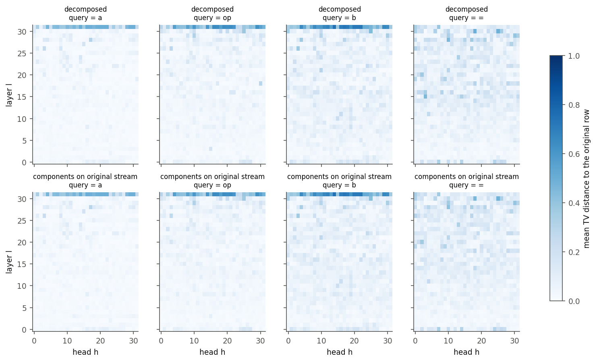
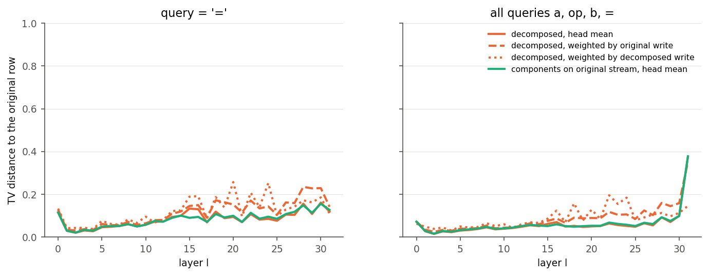
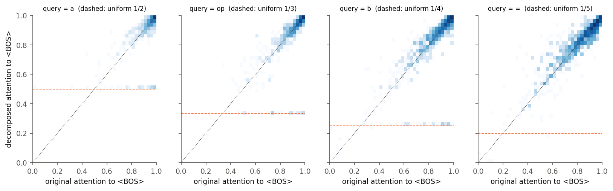
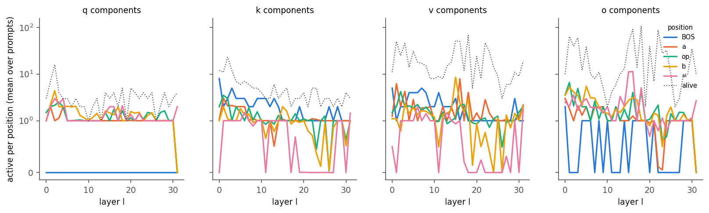
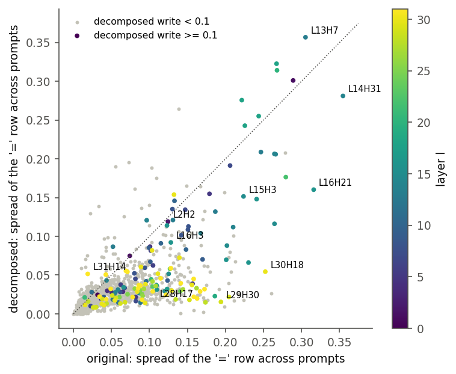
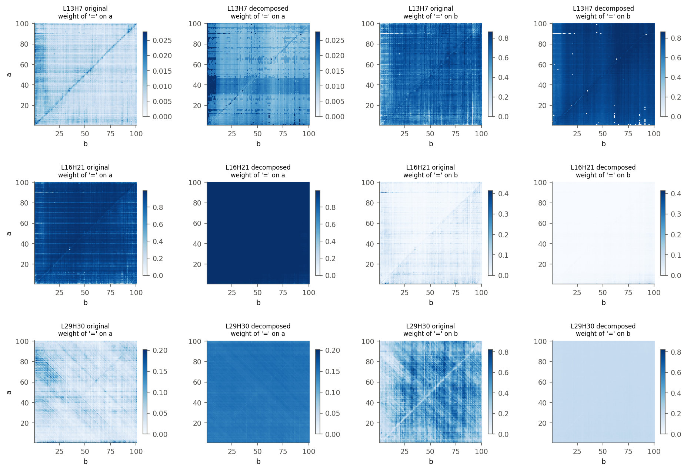
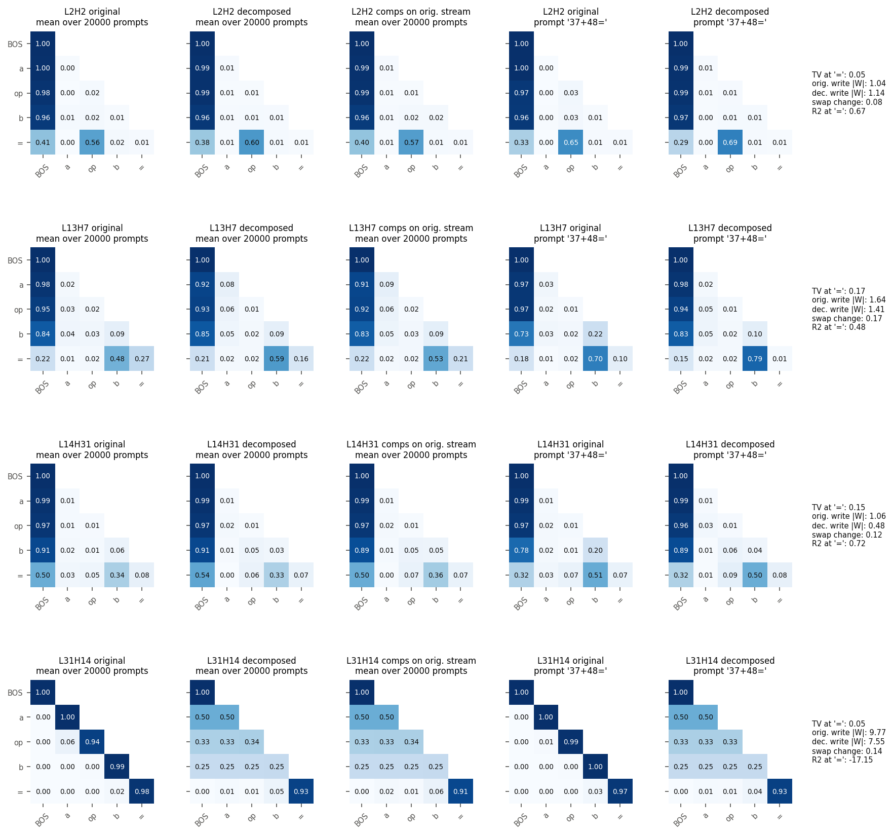
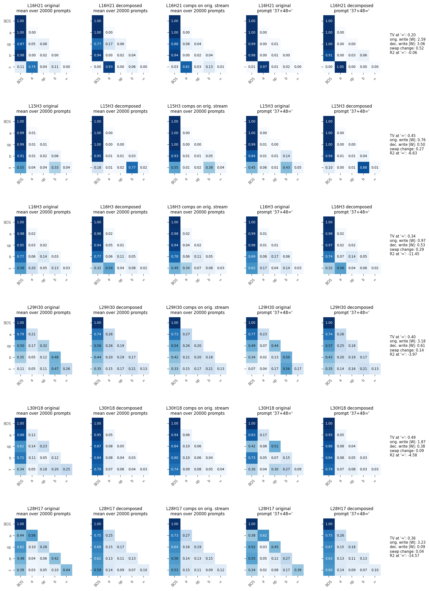
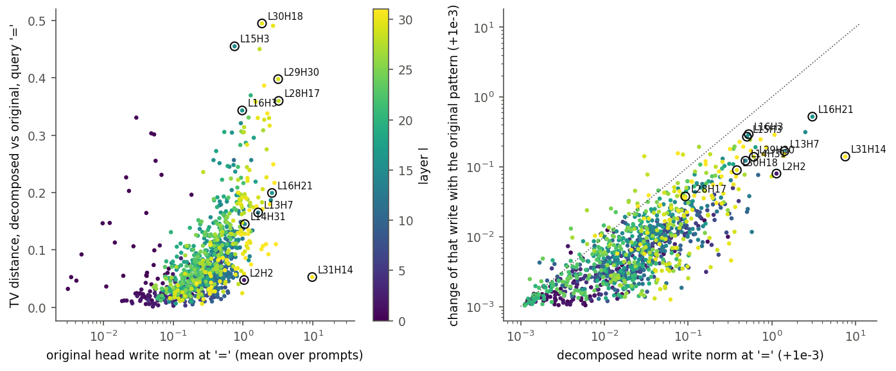
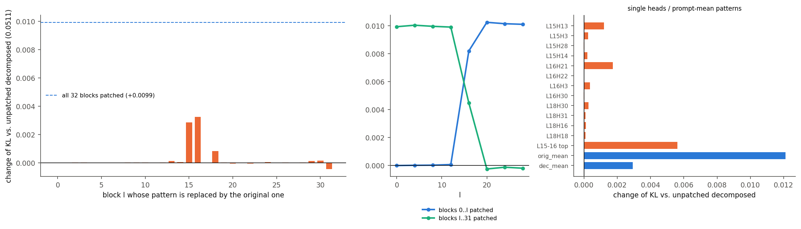

# Attention patterns: original Llama-3.1-8B vs the rounded addsub-05 decomposition

Run `p-ba5a0c05` (addsub-all-layers-05, step 40000). Date 2026-10-06.

## Summary

- **Averaged over prompts, the decomposed patterns mostly match the original.** At the `=` query,
  71 % of the 1024 heads have a mean total-variation distance TV < 0.1 to the original row and
  2.6 % have TV > 0.3. The `<BOS>` attention sink is reproduced.
- **The decomposed patterns barely depend on the prompt.** For the 148 heads that still write
  something in the decomposed model, the decomposed `=` row varies across prompts 0.46x as much as
  the original (median). The ratio falls from 0.65 in layers 0-9 to 0.34 in layers 20-31.
  Structure over (a, b) that the original shows (diagonals, bands) is mostly flat in the
  decomposed model (fig. 7).
- **Disagreements come in two kinds.** *Sharpening*: the decomposed head looks at the same token
  as the original, but harder. Examples are L16H21 (`=` on `a`: 0.74 -> 0.93) and L15H3 (`=` on
  `b`: 0.33 -> 0.77). *Flattening*: the decomposed head loses its focus and falls back to `<BOS>`
  plus near-uniform weights on the other tokens. Examples are L29H30 (`=` on `b`: 0.47 -> 0.21) and
  L30H18 (`=` on `<BOS>`: 0.34 -> 0.79).
- **The layer-31 rows before `=` are exactly uniform.** Layer 31 has no active q component at
  `a`, `op` and `b`. Those rows do not reach the logits (only `=` is read out).
- **The disagreements are not what costs the decomposition its KL.** Giving the decomposed model
  the original patterns in all 32 layers raises KL(original || decomposed) from 0.0511 to 0.0610.
  Patching the original pattern into a single layer is neutral everywhere except layers 15, 16 and
  18, and there it hurts. So the decomposed model's downstream components are fitted to its own
  patterns. Removing the decomposed model's remaining prompt dependence (each pattern replaced by
  its prompt mean) costs +0.0029.

## Setup

**Prompts.** Every prompt is `<BOS> a op b =`, where `a` and `b` are integers from 1 to 100 and
`op` is `+` or `-`. There are N = 20000 prompts, indexed by n from 0 to 19999, with
n = op_index * 10000 + (a - 1) * 100 + (b - 1) and op_index = 0 for `+`, 1 for `-`. Each prompt has
5 positions. A query position is written i and a key position j, both from 0 to 4: 0 = `<BOS>`,
1 = `a`, 2 = `op`, 3 = `b`, 4 = `=`.

**Models.** The *original* model is Llama-3.1-8B. The *decomposed* model is the rounded-CI model of
the activation dataset
`p-ba5a0c05/analysis/ci_filter/step_40000/addsub-05-filter-last-pos-ceiling/dataset`. On prompt n
and position t, a component c (one of the A = 11604 alive components) is on when its causal
importance CI_c(n, t) ∈ [0, 1], evaluated on the original model's activations, exceeds 0.01. The
mask is m_c(n, t) = 1[CI_c(n, t) > 0.01] ∈ {0, 1}. Every other component and the weight delta are
off. The CI values come from the ceiling CI filter fine-tuned on top of the run's CI function at
step 40000, not from the run's raw CI function.

**Patterns.** Layers are indexed by l and heads by h, both from 0 to 31; `LlHh` names head h of
layer l. P_n^{l,h}(i, j) ∈ [0, 1] is the softmax weight that query i puts on key j (causal, so
j ≤ i), and each row sums to 1. It is computed in three conditions:
- *original*: the dense weights on the original residual stream.
- *decomposed*: the masked q/k components on the decomposed model's own residual stream.
- *components on original stream*: the same masked components on the original residual stream.
  Comparing this with *decomposed* separates what a block's own q/k components change from what
  the upstream drift of the stream changes.

All three conditions are computed from the dataset's stored residual streams. To check the
pipeline, the recomputed q, k and o-input activations of the components were compared with the
dataset's stored `inner.npy` on 1000 prompts in every layer. The largest relative error is 2 %
(fp16 storage). The o-input check also covers the pattern and the values.

**Metrics.** Each is per head (l, h) and query i, averaged over the N prompts unless stated
otherwise.
- **TV** ∈ [0, 1]: ½ Σ_j |P_dec(i, j) − P_orig(i, j)|.
- **TV without `<BOS>`** ∈ [0, 1]: TV between the two rows restricted to keys j ≥ 1 and
  renormalised. It measures where the head looks once the sink is set aside.
- **Spread** σ ≥ 0: sqrt(mean_n Σ_j (P_n(i, j) − mean_n P_n(i, j))²), computed separately for
  each model. It measures how much the row changes from prompt to prompt.
- **R²**: 1 − Σ_n Σ_j (P_dec − P_orig)² / Σ_n Σ_j (P_orig − mean_n P_orig)². It is the share of
  the original row's prompt-to-prompt variance that the decomposed row reproduces. R² ≤ 0 means
  the decomposed row predicts the original no better than a constant would.
- **Write norm** ‖w‖ ≥ 0: the Euclidean norm, in residual-stream units (d_model = 4096 dimensions),
  of head h's contribution to the residual stream at query i. In the original model this is the
  head's slice of W_o (the o-projection weight). In the decomposed model it is the head's slice of
  the masked o components. It measures size, not relevance.
- **Swap change** ‖Δw‖ ≥ 0: the norm of the change of the decomposed head's write when its
  pattern is replaced by the original one, with its values and o components unchanged.
- **KL**: KL(original || variant) of the next-token distribution at `=`, in nats. It is averaged
  over 2000 prompts (every 10th n), against the original model's log-probabilities.

## 1. Overall agreement

*Fig. 1. Mean TV per layer l (rows) and head h (columns) for each query position. Top: decomposed.
Bottom: decomposed components on the original stream.*

*Fig. 2. TV per layer, averaged over heads, either unweighted or weighted by each head's mean
original or decomposed write norm.*

- Query rows `a` and `op` agree almost perfectly up to layer 30: mean TV is 0.019 at `a` and 0.037
  at `op`. TV grows with query position (0.062 at `b`, 0.082 at `=`, layers 0-30) and with depth.
  At `=` it goes from 0.02-0.03 in layers 1-4 to 0.10-0.16 in layers 26-31. Layer 0 is the
  exception, at 0.115.
- Weighting by the decomposed write raises TV in layers 15-16, 18, 20, 22 and 24 (0.19-0.26). These
  layers' disagreeing heads are among the ones the decomposition still uses.
- *Decomposed* and *components on original stream* give nearly the same TV (correlation over
  heads at `=`: 0.96; mean absolute difference 0.007). The disagreement is made by each block's own
  q/k components, not inherited from upstream drift. The exception is layers 15-16 (TV at `=`:
  decomposed 0.13, on the original stream 0.09). There, part of the sharpening (section 4) comes
  from the decomposed stream.
- The layer-31 rows at `a`, `op` and `b` are exactly uniform, with TV 0.38-0.55. Layer 31 has
  no active q component at those positions (fig. 9), so q = 0 and the scores are constant. Only
  its `=` row (TV 0.12) is read out.

*Fig. 4. Attention to `<BOS>`, original vs decomposed, for every head at each query. Darker =
more heads. The horizontal clusters on the dashed lines are layer 31's uniform rows.*

- The `<BOS>` sink is reproduced. At `=` the mean |ΔP(`=`, `<BOS>`)| is 0.042. The decomposed
  model has a single key component active at `<BOS>` in most layers from 15 on (fig. 9).

*Fig. 9. Mean number of active q / k / v / o components per position and layer (log scale). Dotted
line: number of alive components at that site.*

- Only 1-16 q and 2-23 k components are alive per layer. At the non-`<BOS>` keys about one key
  component is active per position. At the `=` key, layers 0, 11, 17, 19-27 and 30 have essentially none.
  When no key component fires at a position, its key vector is zero and its score is zero. Such
  keys get equal weights, and only the `<BOS>` share depends on the query.

## 2. Prompt dependence

*Fig. 10. Per head, the spread σ of the `=` row across prompts, original (x) vs decomposed (y).
Coloured points are heads whose mean decomposed write at `=` is at least 0.1; grey points are the
rest.*

- 89 % of the 148 coloured heads lie below the diagonal. The median ratio σ_dec / σ_orig is 0.46
  overall: 0.65 for layers 0-9, 0.56 for 10-19, 0.34 for 20-31.
- 45 of those heads also have a clearly prompt-dependent original row (σ² > 0.02). Their median R²
  is −0.26, and only 38 % have R² > 0. The decomposed heads often do vary across prompts, but not
  the way the original does.
- Heads with decomposed write ≥ 0.1 and R² > 0.4: L14H31 (R² = 0.72), L2H2 (0.67), L13H7 (0.48), L9H11 (0.48),
  L13H15 (0.43).

*Fig. 7. Weight of the `=` query on the `a` token (columns 1-2) and the `b` token (columns 3-4)
over the addition grid. Each panel's y axis is a (1..100) and x axis is b (1..100). Each pair of
panels shares the original's colour scale.*

- **L13H7 (agreement).** The weight on `b` is high (~0.6-0.8) almost everywhere in both models.
  The decomposed map is flatter and has isolated dropouts (white pixels). The weight on `a` is
  small (< 0.03) in both models. The original's a = b diagonal is still visible in the decomposed
  map, but the decomposed map adds horizontal bands in a (around a ≈ 30-47) that the original does
  not have.
- **L16H21 (sharpening).** The original puts 0.6-0.97 on `a`, with row-wise (a-dependent)
  variation and a faint a = b diagonal. The decomposed model puts ~1.0 on `a` for every prompt.
- **L29H30 (flattening).** The original's weight on `b` has structure along the a + b and a − b
  diagonals. The decomposed map is a constant ~0.2.

## 3. Examples of clear agreement

*Fig. 5. Each row is one head. Columns 1-3: pattern averaged over the 20000 prompts (original,
decomposed, decomposed components on the original stream). Columns 4-5: original and decomposed
pattern on the single prompt `37+48=`. Right: TV, write norms, swap change and R² at `=`.*

| head | original `=` row (BOS, a, op, b, =) | decomposed `=` row | TV | R² |
|---|---|---|---|---|
| L2H2 | 0.41, 0.00, 0.56, 0.02, 0.01 | 0.38, 0.01, 0.60, 0.01, 0.01 | 0.05 | 0.67 |
| L13H7 | 0.22, 0.01, 0.02, 0.48, 0.27 | 0.21, 0.02, 0.02, 0.59, 0.16 | 0.17 | 0.48 |
| L14H31 | 0.50, 0.03, 0.05, 0.34, 0.08 | 0.54, 0.00, 0.06, 0.33, 0.07 | 0.15 | 0.72 |
| L31H14 | 0.00, 0.00, 0.00, 0.02, 0.98 | 0.00, 0.01, 0.01, 0.05, 0.93 | 0.05 | −17 |

L31H14 has the largest write of any head in both models (‖w‖ = 9.8 original, 7.6 decomposed). It
agrees at `=` (self-attention). Its earlier rows are layer 31's uniform rows. Its R² is meaningless
because the original row hardly varies (σ² < 0.001).

## 4. Examples of clear disagreement

*Fig. 6. Same layout as fig. 5.*

| head | kind | original `=` row (BOS, a, op, b, =) | decomposed `=` row | on original stream | ‖w‖ orig / dec |
|---|---|---|---|---|---|
| L16H21 | sharpening | 0.11, 0.74, 0.04, 0.11, 0.00 | 0.00, 0.93, 0.00, 0.06, 0.00 | 0.03, 0.81, 0.03, 0.13, 0.01 | 2.59 / 3.06 |
| L15H3 | sharpening | 0.55, 0.04, 0.04, 0.33, 0.04 | 0.18, 0.01, 0.02, 0.77, 0.02 | 0.55, 0.01, 0.02, 0.38, 0.04 | 0.76 / 0.50 |
| L16H3 | sharpening | 0.58, 0.20, 0.05, 0.13, 0.03 | 0.32, 0.54, 0.04, 0.08, 0.02 | 0.49, 0.34, 0.07, 0.08, 0.03 | 0.97 / 0.53 |
| L29H30 | flattening | 0.11, 0.05, 0.11, 0.47, 0.26 | 0.35, 0.15, 0.17, 0.21, 0.13 | 0.33, 0.15, 0.17, 0.21, 0.13 | 3.18 / 0.61 |
| L30H18 | flattening | 0.34, 0.05, 0.18, 0.20, 0.25 | 0.79, 0.07, 0.06, 0.04, 0.03 | 0.74, 0.09, 0.08, 0.05, 0.04 | 1.87 / 0.38 |
| L28H17 | write dropped | 0.39, 0.03, 0.05, 0.10, 0.44 | 0.59, 0.14, 0.09, 0.07, 0.10 | 0.53, 0.15, 0.11, 0.09, 0.12 | 3.23 / 0.09 |

- **Sharpening (layers 15-16).** The decomposed head attends to the same operand as the original,
  more strongly and with less `<BOS>`. On the original stream the same components give rows close
  to the original (L15H3: 0.55 / 0.38). The sharpening is therefore produced by the decomposed
  stream reaching these layers.
- **Flattening (layers 28-30).** The decomposed rows are the same on both streams. The q/k
  components themselves cannot reproduce the original focus. The flattening also shows at earlier query
  positions, e.g. L30H18's `op` row: original 0.23 on `op` vs decomposed 0.05.
- **Write dropped.** L28H17 is among the largest original writers at `=` (3.23) and keeps 0.09 in
  the decomposition. Its pattern disagreement does not matter for the decomposed model's output.

*Fig. 3. Left: TV at `=` vs the head's original write norm. Right: decomposed write norm vs the swap
change (both + 1e-3, log scales). Colour = layer l.*

- Heads with TV > 0.3 carry 8.8 % of the summed original per-head write norms at `=`, and 6.5 % of
  the decomposed ones.
- Summed over heads, the decomposed model keeps 17 % of the original attention write norm at `=`
  (77.9 vs 446.9).
- The swap change is below the decomposed write for almost every head (right panel, under the
  dotted diagonal). The largest swap changes are L16H21 (0.52), L15H13 (0.31), L16H3 (0.29) and
  L15H3 (0.27).

## 5. Causal test: patching original patterns into the decomposed model

*Fig. 8. KL(original || variant) minus the unpatched decomposed KL (0.0511), on 2000 prompts.
Left: one layer's pattern replaced by the original one. Middle: layers 0..l or l..31 replaced.
Right: single heads, the four layer-15/16 heads together ("L15-16 top": L15H13, L15H3, L16H21,
L16H3), and every layer replaced by a prompt-averaged pattern (original "orig_mean" or decomposed
"dec_mean").*

Each variant runs the decomposed model with the softmax pattern replaced. The values, the o
components and everything else stay decomposed.

| variant | KL | change |
|---|---|---|
| decomposed, unpatched | 0.0511 | — |
| original patterns in all 32 layers | 0.0610 | +0.0099 |
| layer 15 only / layer 16 only / layer 18 only | 0.0540 / 0.0544 / 0.0519 | +0.0029 / +0.0032 / +0.0008 |
| any other single layer | 0.0507-0.0513 | within ±0.0004 |
| layers 0..12 / layers 20..31 | 0.0512 / 0.0509 | +0.0001 / −0.0002 |
| L16H21 / L15H13 / L16H3 / L15H3 | 0.0528 / 0.0523 / 0.0515 / 0.0514 | +0.0017 / +0.0012 / +0.0004 / +0.0003 |
| L15-16 top (those 4 heads together) | 0.0567 | +0.0056 |
| every layer: original prompt-mean pattern | 0.0632 | +0.0121 |
| every layer: decomposed prompt-mean pattern | 0.0540 | +0.0029 |

- The original patterns do not repair the decomposed model. They make it worse on 77 % of the
  2000 prompts.
- The whole effect sits in layers 15-16, plus a little in layer 18. Patching layers 0..12 or 20..31
  changes nothing. These are the layers whose sharpened heads (section 4) the decomposed model's
  downstream components rely on. The four sharpened heads together account for +0.0056 of the
  +0.0061 that layers 15 and 16 give separately. That is more than the sum of their single-head
  effects (+0.0036).
- The flattened late-layer heads (L29H30, L30H18) and the dropped ones (L28H17) do not matter
  causally: patching layers 20..31 changes KL by −0.0002.
- The decomposed model's remaining prompt dependence is worth +0.0029 KL. The original's
  prompt-to-prompt variation is worth 0.0022 when patched into the decomposed model (0.0632 with
  prompt means vs 0.0610 per prompt).

## Caveats

- The decomposed model is the rounded-CI dataset model (threshold 0.01 on the ceiling-filter CI
  function, delta off). A different threshold or the raw CI function would give different masks.
- Write norms measure size in the residual stream, not effect on the output. Section 5 is the
  causal measure.
- Patching uses 2000 of the 20000 prompts. The descriptive statistics use all 20000.

## Code and data

- Code: `param_decomp/arith_repr/attn_patterns/`:
  - `extract.py`: patterns, write norms, swap change, validation.
  - `summary.py`: per-head statistics.
  - `patch.py`: causal patching; `heads` mode for single heads and prompt means.
  - `figures.py`: figures.
- Data: `~/out/pod-backup/p-ba5a0c05/analysis/attn_patterns/`:
  - `<cond>_P.npy`, (L, N, H, T, T) float16: the patterns.
  - `<cond>_W.npy`: write norms.
  - `dec_dW.npy`: swap change.
  - `summary.npz`, `patch.npz`, `patch_heads.npz`, `check.json`.
  - `figures/`.
  - Shapes: L = 32 layers, N = 20000 prompts, H = 32 heads, T = 5 positions; `<cond>` is `orig`,
    `dec` or `loc` (components on the original stream).
- SLURM wrapper: `~/pd_scratch/dual_obj_jax/attn_patterns/ap.sbatch` (`MOD=extract|summary|patch|figures`).
  CPU only; the extraction took 1.7 h on 16 cores.
