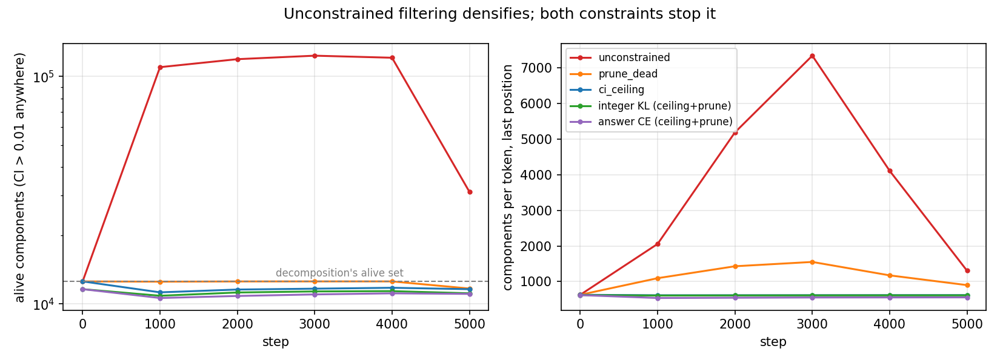
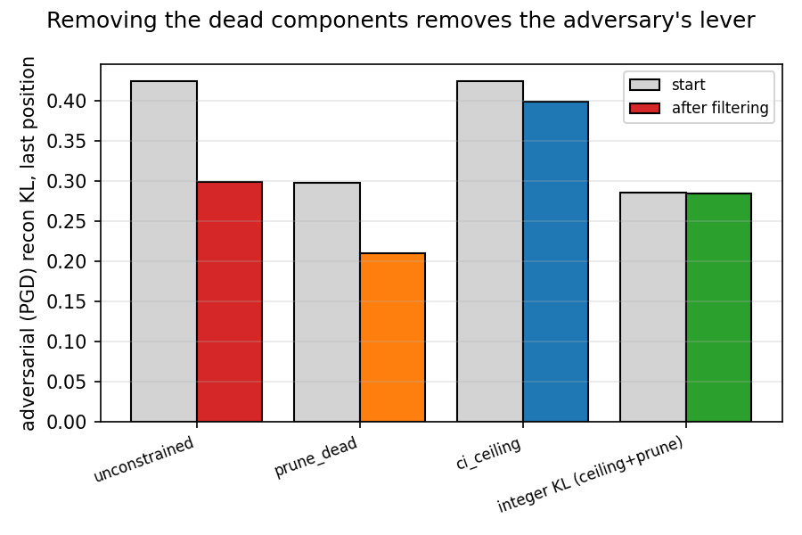
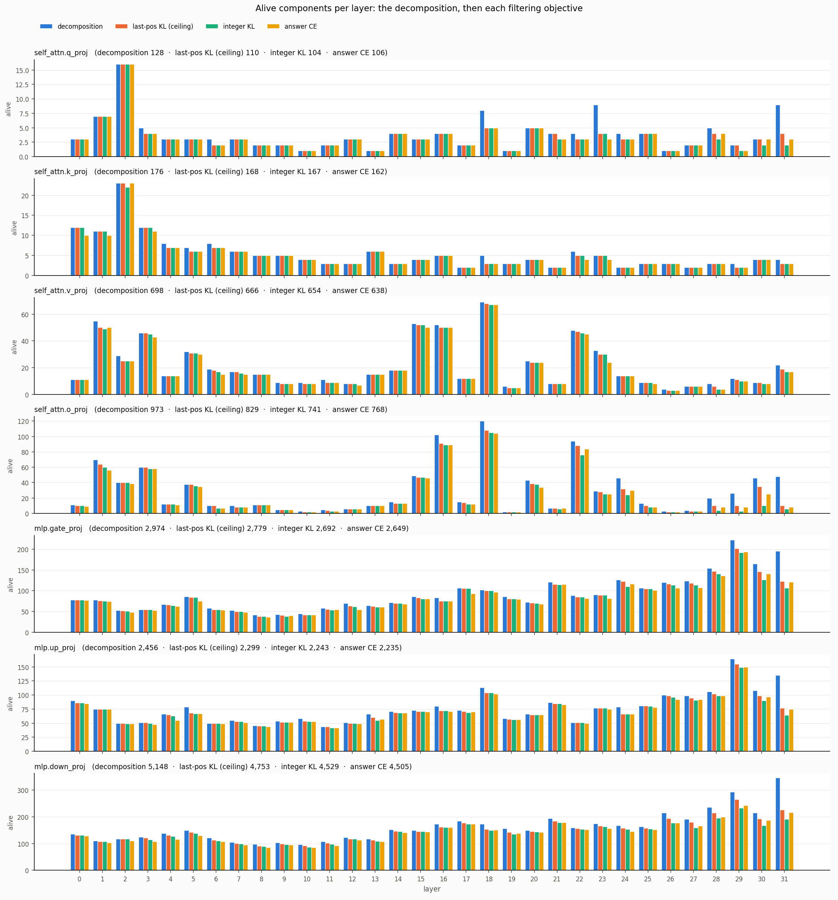
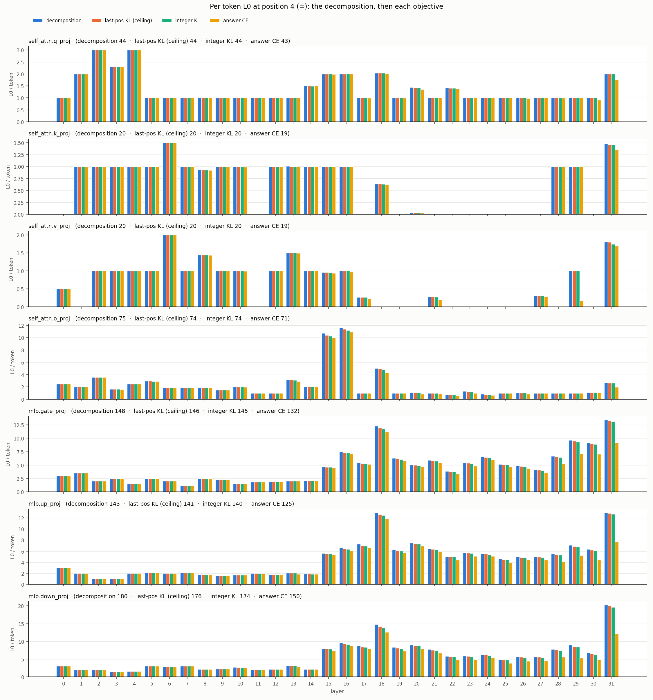
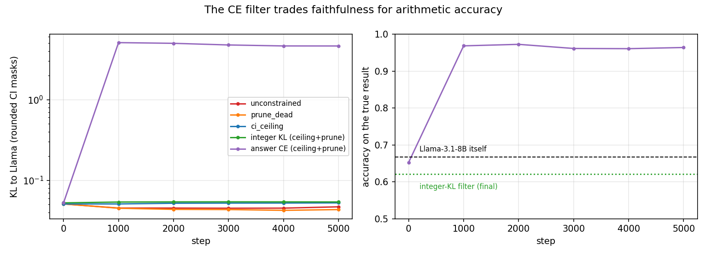
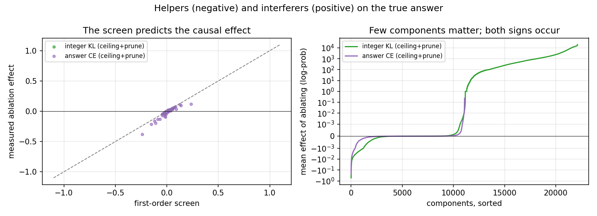

# CI filtering of `addsub-all-layers-4xh100-05`

Freeze the decomposition (`p-ba5a0c05`, step 40000, 124,928 components), fine-tune only its output
CI function against narrower last-position objectives on the 20,000-prompt pool (`a+b=` and `a-b=`,
`a, b` in 1..100), and see which components survive. Target stream only, 5,000 steps x 1,024 prompts,
the decomposition's own merged stochastic-subset PPGD reconstruction scored by the filter objective,
imp-min gamma re-annealed 1 -> 0.01 over the last half. Code: `param_decomp/ci_filter`
(branch `feature/ci_filter`); outputs: `<run_dir>/analysis/ci_filter/step_40000/<filter-id>/` (runs without the ceiling now under `Trash/`);
figures regenerate with `python notes/ci_filter/make_figures.py`.

## What was run

Six runs on one H100, roughly two hours each:

| filter | objective | constraint |
|---|---|---|
| `addsub-05-filter-last-pos` | last-position full-vocabulary KL | none |
| `addsub-05-filter-last-pos-alive` | same | `prune_dead` |
| `addsub-05-filter-last-pos-ceiling` | same | `ci_ceiling` |
| `addsub-05-filter-integers` | last-position KL over integer tokens | both |
| `addsub-05-filter-answer-ce` | cross-entropy of the TRUE result | both |
| attribution | — | scores each component's effect on the true answer |

The two constraints were added after the first run failed (below):

- **`prune_dead`** removes, before the first step, every component whose starting CI never exceeds
  0.01 anywhere on the pool: CI forced to 0, `U` and `V` zeroed, so with the weight delta on its
  weight falls into the delta exactly as if deleted. Verified three ways — per-prompt KL unchanged
  by the removal, `all_on` becomes equal to `alive_union`, removed components score exactly zero
  attribution.
- **`ci_ceiling`** caps the CI at the starting point's, entrywise per prompt, position and
  component. A custom gradient passes normally below the cap and, above it, passes only a gradient
  that *lowers* the CI — so the reconstruction term cannot push a component past its starting value
  while imp-min can still pull it back.

## Finding 1: unfiltered filtering makes the decomposition denser

The unconstrained run went the wrong way: alive components rose from 12,553 to 123,486 by step
3,000, and components per token at the scored position from 630 to 7,333. The PPGD reconstruction
rewards switching *more* components on at the position being scored, and the imp-min pressure at
gamma 1 is too weak to counter it. The gamma anneal recovered only part of it (ending at 31,111,
2.5x the start).

Either constraint fixes this, and they end up close: 11,680 alive with `prune_dead`, 11,604 with
`ci_ceiling`, against 12,553 at the start. The ceiling gives the lower per-prompt count (544 versus
616 components per token); pruning gives the better KL (0.0434 versus 0.0525) and much better
adversarial robustness. Filtering saturates by step 2,000 — the remaining 3,000 steps change little.

## Finding 2: removing the dead components is what buys robustness

Fresh-PGD reconstruction (20 steps, last position, scored by each run's objective) on the
decomposition is 0.4245. Merely *removing* the components that are dead on this pool drops it to
0.2979 before any training, and the filter finishes at 0.2100. The ceiling run, which keeps all
124,928 components present, only reaches 0.3990. The dead components were the adversary's lever.

## Finding 3: the narrow KL objectives confirm the base rather than shrinking it

Going from full-vocabulary KL to integers-only removed a further 4% (11,606 -> 11,130) at flat
integer KL (0.0479) and flat robustness. Once the ceiling and the removal are in place, the
components that only set non-integer probability mass are already gone.

### Where the narrower objectives remove components

Alive components per layer and matrix kind: the decomposition (12,553), the last-position-KL
ceiling filter (11,604), then its two siblings trained from it — integer KL (11,130) and answer
CE (11,063). Removal is concentrated in the **last four layers**: L31 `mlp.down_proj` falls from
346 to 226 at the first stage and to 191 under integer KL, L31 `self_attn.o_proj` from 48 to 10,
and `self_attn.o_proj` loses heavily at L28–31 and L22–24 in general. The early and middle layers
barely change. Exact counts: `ci_filter/step_40000/pruning_by_layer.tsv`.

### Where per-token L0 drops, by position

Mean components active per token (CI > 0.01), summed over all sites, 4,000 pool prompts
(`scripts/l0_by_position.py` → `ci_filter/step_40000/l0_by_position.tsv`):

| position | decomposition | last-pos KL (ceiling) | integer KL | answer CE |
|---|---|---|---|---|
| 0 `<BOS>` | 528 | **429** | 415 | 403 |
| 1 `a` | 541 | 500 | 490 | 478 |
| 2 operator | 573 | 521 | 506 | 502 |
| 3 `b` | 721 | 652 | 633 | 610 |
| 4 `=` (scored) | 630 | 621 | 615 | **558** |

The KL objectives sparsify almost everything **except** the scored position: they only score
`=`, so imp-min removes what the earlier positions do not need for it (BOS loses 19%), while `=`
itself barely moves (−1.4%). Only the answer-CE objective cuts `=` substantially (−11%), almost
entirely in the MLPs of layers 28–31 and 18 — the per-layer detail is in
`figures/l0_position_4.png` (and `_0` … `_3` for the other positions).

### What the integer objective drops: borderline components, not a non-integer mechanism

**476 components** are alive at the end of the full-vocabulary filter (`-last-pos-ceiling`) and
dead at the end of the integer-only filter (`-integers`). The hypothesis was that they set the
probability of non-integer tokens. `scripts/token_effects.py` subtracts them from the MODEL
(every other component on, weight delta on) over 2,048 pool prompts and scores the last position
against the subtract-nothing forward — individually, all together, by layer band, and against a
same-size control drawn from the components both filters keep:

| ablation | KL full vocab | KL integers | integer share | most-moved non-integer token (p before → after) |
|---|---|---|---|---|
| **ALL** (476 comps) | 2.07e-03 | 1.74e-03 | 0.84 | `?⏎` 0.0752 → 0.0744 |
| **CONTROL (alive in both)** (476 comps) | 2.54e+00 | 2.41e+00 | 0.95 | `?⏎` 0.0752 → 0.0145 |
| **layers 0-7** (44 comps) | 1.27e-03 | 1.08e-03 | 0.85 | ` ` 0.0415 → 0.0419 |
| **layers 8-15** (41 comps) | 7.33e-04 | 6.49e-04 | 0.89 | `?⏎` 0.0752 → 0.0754 |
| **layers 16-23** (61 comps) | 5.58e-04 | 4.76e-04 | 0.85 | ` ` 0.0415 → 0.0413 |
| **layers 24-31** (330 comps) | 5.27e-04 | 3.62e-04 | 0.69 | `?⏎` 0.0752 → 0.0740 |
| *top individual components:* | | | | |
| L1 `self_attn.v_proj` c213 (max CI 1.00) | 6.64e-04 | 5.36e-04 | 0.81 | `?⏎` 0.0752 → 0.0751 |
| L0 `mlp.down_proj` c524 (max CI 1.00) | 6.22e-04 | 5.09e-04 | 0.82 | `?⏎` 0.0752 → 0.0751 |
| L6 `self_attn.v_proj` c221 (max CI 0.05) | 6.12e-04 | 5.04e-04 | 0.82 | `?⏎` 0.0752 → 0.0756 |
| L11 `self_attn.o_proj` c428 (max CI 0.04) | 6.07e-04 | 5.44e-04 | 0.90 | ` ` 0.0415 → 0.0415 |
| L1 `self_attn.o_proj` c91 (max CI 0.40) | 5.72e-04 | 4.63e-04 | 0.81 | `?⏎` 0.0752 → 0.0750 |
| L1 `self_attn.o_proj` c371 (max CI 0.03) | 5.72e-04 | 4.66e-04 | 0.81 | `?` 0.0100 → 0.0099 |
| L1 `self_attn.o_proj` c378 (max CI 0.07) | 5.70e-04 | 4.65e-04 | 0.82 | `?⏎` 0.0752 → 0.0752 |
| L1 `mlp.gate_proj` c28 (max CI 0.37) | 5.68e-04 | 4.63e-04 | 0.81 | `?⏎` 0.0752 → 0.0751 |
| L1 `self_attn.o_proj` c135 (max CI 0.20) | 5.61e-04 | 4.56e-04 | 0.81 | ` ` 0.0415 → 0.0415 |
| L2 `mlp.up_proj` c320 (max CI 0.02) | 5.48e-04 | 4.45e-04 | 0.81 | `?⏎` 0.0752 → 0.0750 |
| L2 `mlp.down_proj` c490 (max CI 0.09) | 5.30e-04 | 4.31e-04 | 0.81 | ` ` 0.0415 → 0.0416 |
| L2 `self_attn.k_proj` c80 (max CI 0.13) | 5.29e-04 | 4.35e-04 | 0.82 | `?⏎` 0.0752 → 0.0751 |

- **Jointly they barely matter.** Removing all 476 moves the model's answer distribution by KL
  0.002 — 1,200× less than removing 476 random components that both objectives keep (2.54).
- **What they do move is not non-integer-specific.** 84% of their KL is still within the
  integers; only the layer 24–31 band leans non-integer (69%).
- **They are borderline, not a mechanism.** Their median max CI in the full-vocabulary filter is
  0.13 (46% below 0.1), against 1.0 for the alive population. The full-vocabulary filter kept them
  at a trickle; the integer objective's lighter reconstruction constraint let imp-min push them
  under the 0.01 threshold.
- **Individually they are at the measurement floor**: KLs of ~2–6e-4 with the same integer share
  (~0.82) and the same most-moved tokens for all 476. That signature is a single small subtraction
  reshuffling bf16 rounding in the residual stream, not component-specific behaviour.
- **What is non-integer at `=`** is informative in itself: after `12+34=` the model puts real
  mass on question/blank templates — `?⏎` (7.5%), `?`, `??`, `____` — and a bare space (4.2%).
  That is the probability mass the integer objective renormalizes away; it is carried by the kept
  components, not by these 476.

(L20 `mlp.gate_proj`/`down_proj` c44 is *not* among them: its max CI is 1.0 in both filters and its
mean CI at `=` is unchanged, 0.043/0.083 → 0.042/0.080 for add/sub.)

Full table: `ablations/step_40000/non_integer_components.tsv` (group rows first).

## Finding 4: the model's arithmetic errors are largely a gating failure

Llama-3.1-8B itself answers only **66.7%** of the pool correctly (first token, argmax over integer
tokens). Filtering the same frozen components against the cross-entropy of the *true* result reaches
**95.5%** — a 29-point improvement using a subset of the model's own components, with no weight
training at all. The alive-set global mask is unchanged by that run (KL 0.0865), so the gain comes
entirely from *when* components are switched on, not from which ones survive.

The price is faithfulness: KL to Llama rises from 0.05 to 4.6. This filter answers "what computes
addition well", not "what the model does". The faithful integer-KL filter sits at 62.2%, just below
the model, as it should.

| | accuracy | log p(correct) | KL to Llama |
|---|---|---|---|
| Llama-3.1-8B | 0.667 | -3.71 | — |
| integer-KL filter | 0.622 | -3.92 | 0.048 |
| **answer-CE filter** | **0.955** | **-0.49** | 4.62 |

## Finding 5: single components carry large, signed effects

Each component is scored by its effect on `log p(correct answer)`: a first-order screen over all
20,000 prompts (73 seconds for every component at once), then a real one-at-a-time ablation of the
200 extremes. The screen predicts the causal effect well (left panel), so the cheap pass is a usable
ranking.

The distribution is long-tailed in both directions (right panel): most components are irrelevant to
the answer, a few hundred matter, and both signs occur. Extremes in the faithful filter:

| component | effect of ablating it |
|---|---|
| `layers.31.mlp.down_proj` c9 | **+1.04** log-prob — the strongest interferer |
| `layers.31.mlp.up_proj` c731 | +0.21 |
| `layers.30.mlp.gate_proj` c124 | -0.55 log-prob, **-11.3 points of accuracy** |
| `layers.31.mlp.down_proj` c18 | -0.38 log-prob, **-20.9 points of accuracy** (in the CE filter) |

Both helpers and interferers concentrate in the MLPs of layers 30-31.

## Caveats

- The CE filter is selected *on* the pool it is evaluated on; there is no held-out split. Treat 95.5%
  as "this subset can compute these prompts", not as a generalization claim.
- Accuracy is first-token-only and restricted to integer tokens, which is generous to every arm
  equally.
- `prune_dead` keeps array shapes (removal is zeroing), so it costs no less compute per step. Real
  compaction would need per-kind padding and a rebuild of the CI head; estimated gain is only 10-20%.
- Two frozen ceiling CI functions need `MICRO=512` and `GRID_CHUNK=250` on an 80 GB H100; the grid's
  column gather is the tightest stage.

## Where things are

Ablation studies (screens, sweeps, probe, table) live in `<run_dir>/analysis/ablations/step_40000/`. Per filter: `config.yaml`, `training/{metrics.jsonl, ci_fn/}`, `eval/{pool_evals.jsonl, summary.json,
pgd_recon.json}`, `alive/{alive.json, max_ci.npz, kept.npz}`, `ab_grids/index.html` (the `(a, b)`-grid
applet, every operation x position). Backup: `~/out/pod-backup/p-ba5a0c05/analysis/`. Wandb:
project `param-decomp-llama`.
