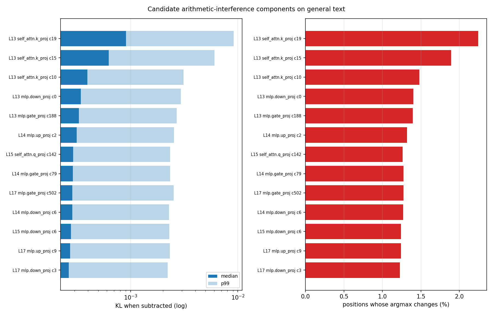
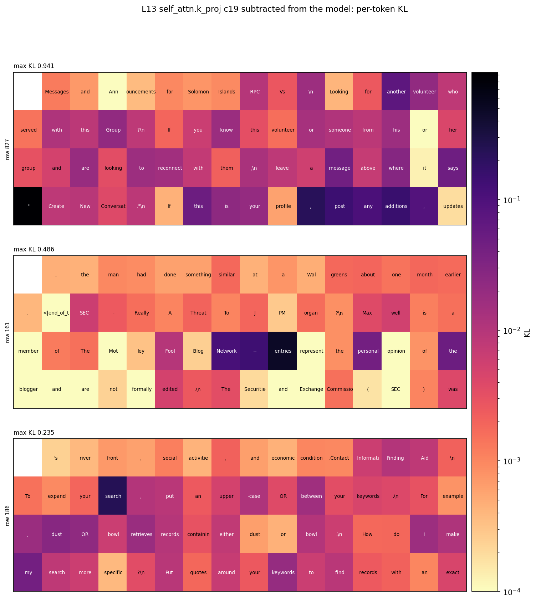
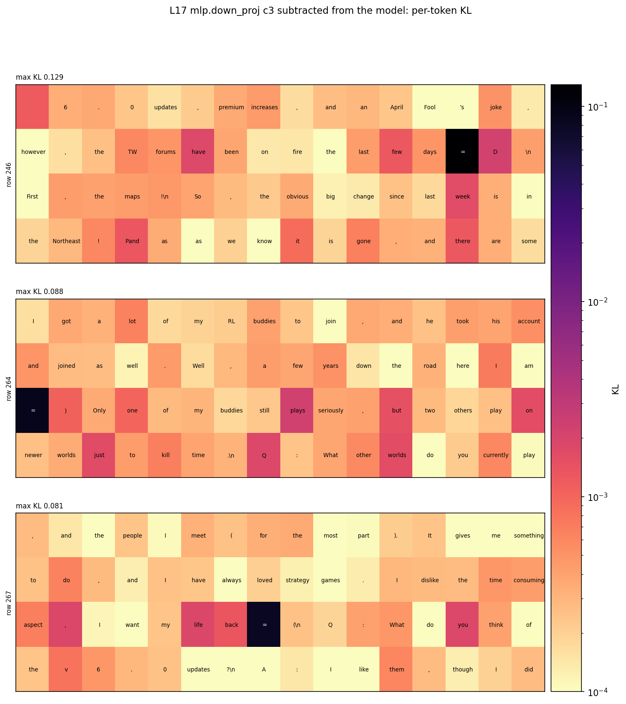

# Classifying components: which help the arithmetic answer, which impair it

Companion to [`report.md`](report.md), which covers the filtering runs themselves. This one is
about the per-component classification: the dataset, what it says, and — importantly — what it
cannot yet answer.

Everything is measured on `p-ba5a0c05` step 40000 over the `a+b=` / `a-b=` pool
(`a, b` in 1..100, 20,000 prompts). The score of a prompt is `log p(correct result's first
token)` under the distribution restricted to integer tokens and renormalized.

## Sign convention (read this first)

Every effect column is **the effect of ABLATING the component**:

- **positive effect / negative `d_answer_ce`** → removing it makes the answer better, i.e. the
  component **impairs** arithmetic;
- **negative effect / positive `d_answer_ce`** → removing it makes the answer worse, i.e. the
  component **helps**.

`impairs_frac` is the *share of prompts* on which ablating helps, magnitude ignored. An earlier
version of this column was labelled "helps-on", meaning "ablating helps"; it is the same number
with a clearer name.

## The dataset

`<run_dir>/analysis/ci_filter/step_40000/components.tsv` — 12,553 rows (every component alive in
the decomposition on this pool) x 46 columns, built by
`python -m param_decomp.ci_filter.scripts.component_table --run_dir <run>`:

| group | columns |
|---|---|
| address | `site`, `layer`, `kind`, `component` |
| survival | `alive_<f>`, `max_ci_<f>` for each of the five filters |
| screen | `effect_<s>`, `effect_<s>_add/_sub` (mean first-order effect of ablating) |
| frequency | `impairs_frac_<s>[_add/_sub]`, `active_frac_<s>` |
| causal | `swept_d{kl,integer_kl,answer_ce,accuracy}_<s>` (every component: 512 prompts for `run`, 256 for the filters) |
| causal (extremes) | `ablated_dscore_<s>`, `ablated_dacc_<s>` (200 per filter, 1,000 prompts) |

Sources `<s>` are `run` (the decomposition's own CI), `integers` and `ce` (the two narrow
filters), so the same component can be compared raw and under each filter's gating.

## Method

1. **First-order screen** — one forward/backward per prompt batch gives every component's
   `-sum_t m * d(score)/d(m)`, plus the per-prompt sign counts. 123 s for all 20,000 prompts.
2. **Causal sweep** — each component's mask zeroed at every position, one masked forward per
   component over a fixed 512-prompt subset, recording full-vocabulary KL, integer KL, answer CE
   and accuracy. 0.29 s per component, 33 min for all 12,553.

Screen versus sweep: **Pearson 0.93** on the effect size, so the cheap pass ranks well. Sign
agreement is only 59%, but that is dominated by the 83% of components whose true effect is
~0 — among components with a real effect the signs agree (see `attribution.png` in `report.md`).

## What the classification says

Single-component ablation, 12,553 alive components, threshold `|d_answer_ce| > 0.001`:

| class | count | share |
|---|---|---|
| **helps** arithmetic (ablating hurts) | 1,640 | 13.1% |
| **impairs** arithmetic (ablating helps) | 454 | 3.6% |
| inert on arithmetic | 10,459 | 83.3% |

By depth, as a share of each band's alive components:

| layers | n | impairs | helps | inert |
|---|---|---|---|---|
| 0–7 | 2,652 | 5.2% | 8.7% | 86.1% |
| 8–15 | 2,185 | 4.4% | 12.2% | 83.3% |
| 16–21 | 2,587 | 1.7% | 16.1% | 82.3% |
| 22–27 | 2,566 | 1.4% | 14.1% | 84.5% |
| 28–31 | 2,563 | 5.5% | 14.2% | 80.3% |

Impairing components are **bimodal in depth** — common early (0–15) and again at 28–31, rarest
at 16–27. Attention sites impair slightly more often than MLP sites (5.8% vs 3.2%) despite being
16% of the population.

### Before layer 22, does anything impair on *most* prompts?

Yes. By per-prompt sign over all 20,000 prompts: **427 components in layers 0–21 impair on more
than half the prompts**, 37 on more than 80%, 14 on more than 90%, none on more than 99%. All 427
are also active on more than half the prompts, so they are consistently present, not rare-case.

The 14 above 90% split into two populations:

| component | impairs_frac | measured `d_answer_ce` | `d_accuracy` |
|---|---|---|---|
| L17 `mlp.down_proj` c3 | 0.988 | −0.109 | +1.2 pts |
| L17 `mlp.up_proj` c9 | 0.979 | −0.092 | +1.0 pts |
| L13 `mlp.down_proj` c0 | 0.955 | −0.051 | +1.0 pts |
| L14 `mlp.down_proj` c6 | 0.945 | −0.047 | +1.2 pts |
| L14 `mlp.gate_proj` c79 | 0.937 | −0.048 | +1.2 pts |
| L0–L1 MLPs (7 components), L7 `mlp.down_proj` c2 | 0.90–0.93 | −0.002 to −0.022 | ~0 |

**Layers 13–17** carry few but strong impairers — removing L17 c3 alone raises accuracy by 1.2
points. **Layers 0–1** contribute a broad, systematic, but tiny drag. The strongest impairers
overall live in layer 31 (`mlp.down_proj` c9 at `d_answer_ce` −1.03), and the strongest helpers in
layer 30 (`mlp.gate_proj` c124: ablating it costs 10 accuracy points).

Most early impairers hurt **subtraction** about twice as much as addition; L21 `mlp.down_proj` c38
is the clean exception (addition-specific).

## Does the classification transfer to the model itself? Mostly not.

**Everything above is measured on the decomposition with the weight delta OFF.** This run has no
faithfulness term, so that is not Llama. `scripts/model_ablation.py` repeats the test on the
model: every component on and the delta on (which reproduces `x @ W`), minus the one candidate,
over 4,096 pool prompts, scoring the integer-renormalized `log p(correct)`. Baseline: log p −3.66,
accuracy 0.671.

| component | decomposition `d_answer_ce` | **model Δ log p** | **model Δ accuracy** | prompts improved |
|---|---|---|---|---|
| L13 `mlp.gate_proj` c188 | −0.028 | **+0.532** | **+4.9 pts** | **98.1%** |
| L17 `mlp.down_proj` c3 | −0.109 | **+0.154** | +0.9 pts | 76.3% |
| L17 `mlp.up_proj` c9 | −0.092 | +0.083 | −1.9 pts | 67.8% |
| L13 `self_attn.k_proj` c10/c15/c19 | −0.004 to −0.007 | −0.01 | ~0 | 36–45% |
| L15 `mlp.down_proj` c6 | −0.019 | **−0.289** | **−10.9 pts** | 45.8% |
| L14 `mlp.down_proj` c6 | −0.047 | **−0.571** | **−13.8 pts** | 21.4% |
| L14 `mlp.gate_proj` c79 | −0.048 | **−0.691** | **−16.8 pts** | 30.1% |
| L14 `mlp.up_proj` c2 | +0.018 | **−1.960** | **−50.9 pts** | 3.6% |

(A positive model Δ log p means removing the component *helps*, i.e. it impairs arithmetic in
Llama; a negative `d_answer_ce` in the decomposition means the same thing there.)

- **Two candidates are confirmed consistent impairers in Llama.** L13 `mlp.gate_proj` c188 is the
  clean one: removing it improves the correct answer on 98.1% of prompts and adds 4.9 accuracy
  points. L17 `mlp.down_proj` c3 holds too, more weakly (76% of prompts, +0.9 points).
- **Four flip sign.** The L14 trio and L15 `down_proj` c6 look like impairers in the delta-off
  decomposition but are *essential helpers* in the model — L14 `mlp.up_proj` c2 alone carries
  half the accuracy.
- **The L13 attention components are inert either way.**

So the delta-off classification ranks components badly for claims about Llama: of the 13, it got
the direction right for 2, wrong for 4, and the rest are within noise. Any statement "component X
impairs arithmetic" should be made with the delta ON. The earlier tables in this report describe
the decomposition only, and are kept because they are what the filters optimize.

## What the L13–17 candidates do on general text

The probe (`scripts/nontarget_probe.py`) subtracts one component from the model — every other
component on, weight delta on, so the un-ablated forward IS the model — and scores 1,024 fineweb
rows (65k tokens) position by position. Selection: layers 13–17 with `impairs_frac_run >= 0.8`,
13 components.



| component | median KL | p99 | max | >1e-3 | argmax flips | arithmetic `d_answer_ce` |
|---|---|---|---|---|---|---|
| L13 `self_attn.k_proj` c19 | 8.5e-4 | 7.2e-3 | 0.94 | 42.7% | 2.14% | −0.007 |
| L13 `self_attn.k_proj` c15 | 6.0e-4 | 4.9e-3 | 0.45 | 27.7% | 1.82% | −0.006 |
| L13 `self_attn.k_proj` c10 | 4.0e-4 | 2.6e-3 | 0.11 | 15.5% | 1.44% | −0.004 |
| L17 `mlp.down_proj` c3 | 2.8e-4 | 2.1e-3 | 0.13 | 11.0% | 1.14% | **−0.109** |
| L17 `mlp.up_proj` c9 | 2.8e-4 | 2.1e-3 | 0.03 | 11.1% | 1.18% | −0.092 |
| the other MLP candidates | ~3e-4 | ~2.2e-3 | 0.03–0.07 | 11–14% | 1.2–1.4% | −0.02 to −0.05 |

Two readings, and they point in opposite directions:

- **The L13 attention components act broadly on text and barely on arithmetic.** c19 changes the
  argmax on 2.1% of ordinary tokens and reaches KL 0.94 somewhere, while its arithmetic effect is
  a rounding error (−0.007 CE). These are general-purpose machinery whose arithmetic harm is
  incidental.
- **The L17 MLP pair is the reverse.** L17 c3 is the strongest arithmetic impairer in the whole
  decomposition below layer 22 (−0.109 CE, +1.2 accuracy points when removed) yet is one of the
  *quietest* on text (max KL 0.13, argmax flips on 1.1% of tokens, at the population floor). That
  is the profile you would expect from a narrow mechanism that happens to fire on arithmetic.



Each cell is one token, shaded by the KL its subtraction causes there (log scale). For
`L13 self_attn.k_proj c19` the effect is spread across ordinary prose with sharp peaks on
structural tokens — the quote opening `"Create New Conversation"`, `entries` after a blog
header, `search` in a query-syntax instruction. Not an arithmetic story.



**Over 1.05M tokens (16,384 rows), by token class** — mean KL at `=` tokens versus all other
tokens, and at digit tokens versus other (counts: 135 `=`, 26,600 digits, 1.02M other):

| component | `=` / other | digit / other | model Δ accuracy |
|---|---|---|---|
| L15 `mlp.down_proj` c6 | **28.8×** | 1.1× | −10.9 pts |
| L17 `mlp.down_proj` c3 | **21.7×** | 1.1× | +0.9 pts |
| L17 `mlp.up_proj` c9 | 3.5× | 1.1× | −1.9 pts |
| L13 `mlp.gate_proj` c188 | 2.3× | 1.2× | **+4.9 pts** |
| the other nine | 1.3–2.4× | 1.1–1.9× | — |

The trivial prediction is recovered for `=` and not for digits: two `down_proj` components act
almost only at `=` across a million tokens, and no candidate is digit-specific (best 1.9×). The
two `=` handlers then split in the model — L17 c3 impairs arithmetic, L15 c6 is essential to it —
so "fires on the arithmetic delimiter" says nothing about the sign. And the cleanest real-model
impairer, L13 c188, is *not* specific to either: its harm on arithmetic is not explained by an
arithmetic-looking trigger. With only 135 `=` tokens in the sample, the `=` ratios are
directionally solid but not precise.

**Browse it:** `<run_dir>/analysis/ci_filter/step_40000/nontarget_probe/app/index.html` — 25
sequences per component (top by max KL over the million tokens), coloured by KL or by the
component's CI, with a CI underline toggle and per-token hover (KL, CI, model versus ablated
top-1).

### Two measurement traps, both hit on the way here

1. **The baseline must include the weight delta.** This run dropped the faithfulness term, so
   "all components on, delta off" is NOT the model — its KL to Llama on fineweb is 6.3, and its
   argmax predictions are visibly broken. With the delta mask at 1 and component masks at 1, the
   masked forward reproduces the model exactly, and subtracting one component is then a clean
   counterfactual.
2. **The masked path has a bf16 noise floor of ~8e-4 KL** against `clean_forward`, which is
   *larger* than a typical single component's effect on text. Scoring against the model's own
   forward made all 13 components look identical. Scoring against the subtract-nothing masked
   forward — the identical kernel path — cancels it; the floor is recorded in `baseline.json`.

## What this cannot answer yet

The motivating question — *if the network were trained only on arithmetic, which mechanisms would
be dropped?* — is **not** answered by this table, for three reasons:

1. **83% of components are individually inert.** One component out of 12,553 rarely moves any
   metric, so "no individual effect" does not mean "not needed".
2. **Effects are not additive.** The single-component `d_answer_ce` values sum to +7.16 against a
   baseline CE of 3.87 — removing them jointly cannot cost what the sum suggests. We already saw
   this directly: the alive components as a *joint* mask score KL 0.086 while all-on scores 0.024,
   because dead components were cancelling live ones.
3. **The cross-tab that would define "droppable" is empty.** Components that are inert on
   arithmetic but matter for faithfulness (`d_kl > 0.001`) number **8** — not because such
   mechanisms don't exist, but because single ablations barely move KL either.

Also note the 454 impairers are **all still alive** in both narrow filters. The filters gate them
per prompt rather than removing them, which is another sign that "alive" is too weak a criterion
for the droppable set.

## What would answer it

1. **Minimal arithmetic subset.** Sweep the imp-min strength on the answer-CE filter (4 arms,
   3–30x) to trace accuracy versus subset size, and take the smallest subset holding ~95%.
2. **Validate the complement jointly** — ablate the whole dropped set at once and check arithmetic
   is intact while the full-vocabulary KL moves a lot.
3. **Find what the dropped set is for** — run the model with that set ablated over broad data
   (fineweb is already wired as the non-target stream), rank tokens by KL against clean, and read
   the top contexts.

Step 3 is the "why are these mechanisms still here" question, and it is inference-only.

## Reproduce

```bash
python -m param_decomp.ci_filter.scripts.run_attribution  --config <filter>/config.yaml \
    --data_root <root> --source run --verify_top 0        # screen + sign counts
python -m param_decomp.ci_filter.scripts.ablation_sweep   --config <filter>/config.yaml \
    --data_root <root> --source run --prompts 512 \
    --alive_npz <...>/addsub-05-filter-last-pos-alive/alive/kept.npz
python -m param_decomp.ci_filter.scripts.component_table  --run_dir <run>
```

On a 45 GB L40 the filter sources need `--prompts 256` (they carry one or two extra frozen
ceiling CI functions); the decomposition itself fits at 512.
