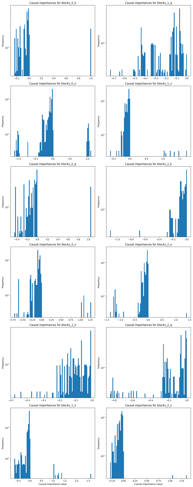
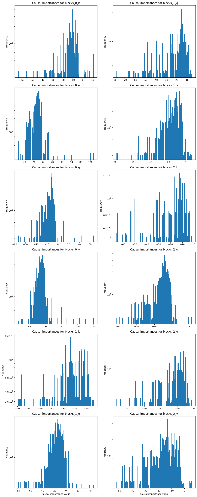
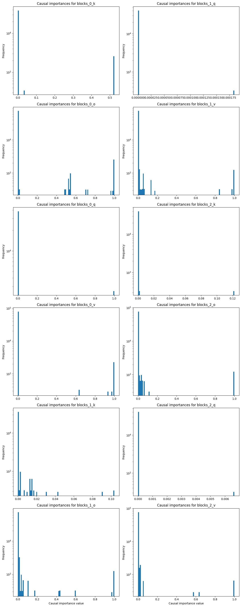
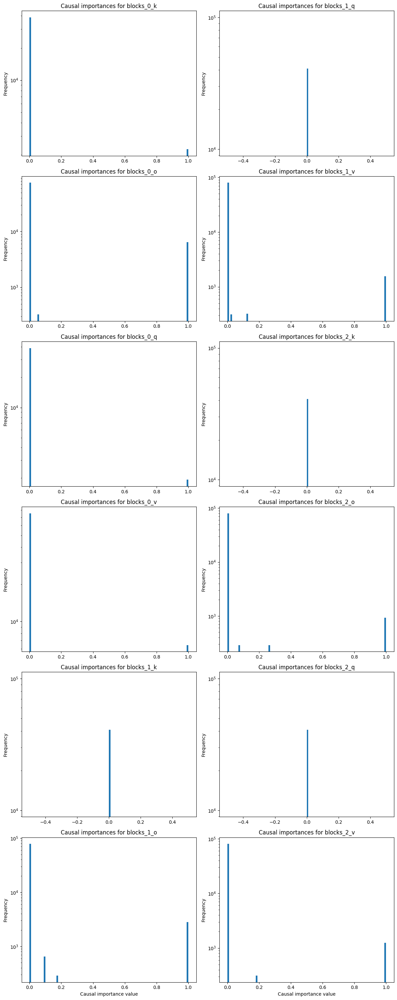
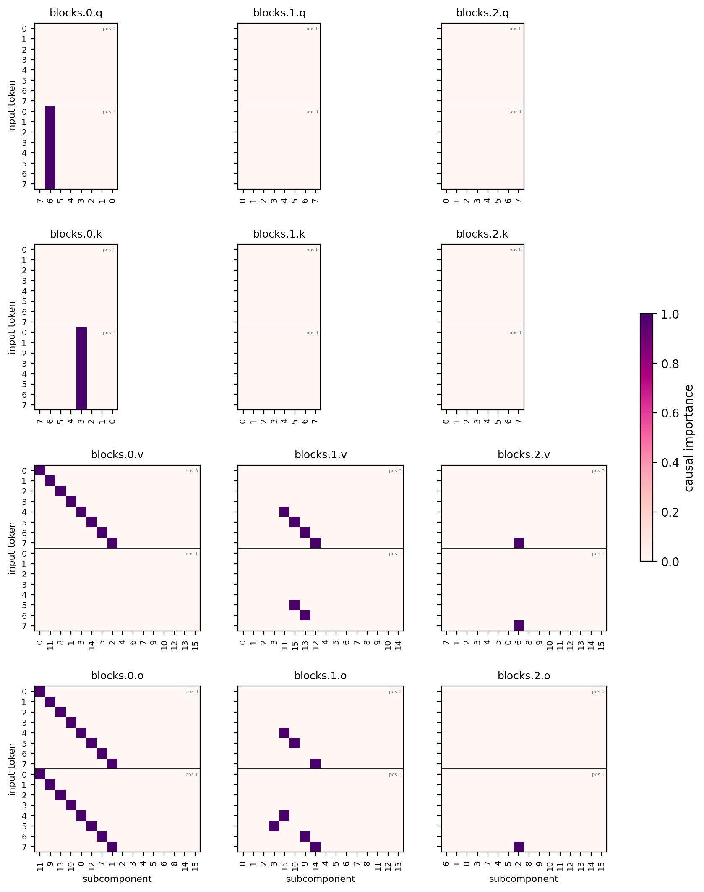
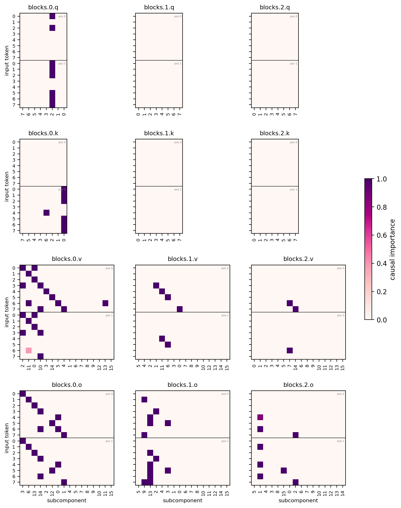
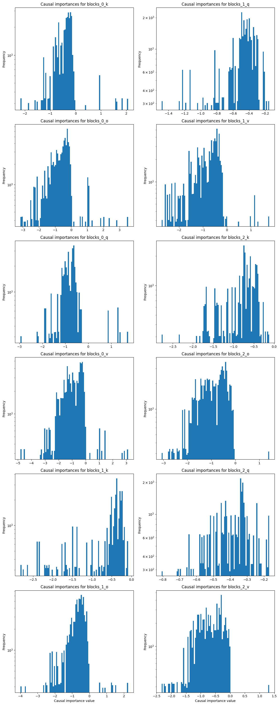
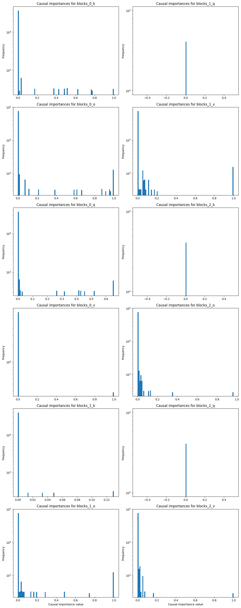
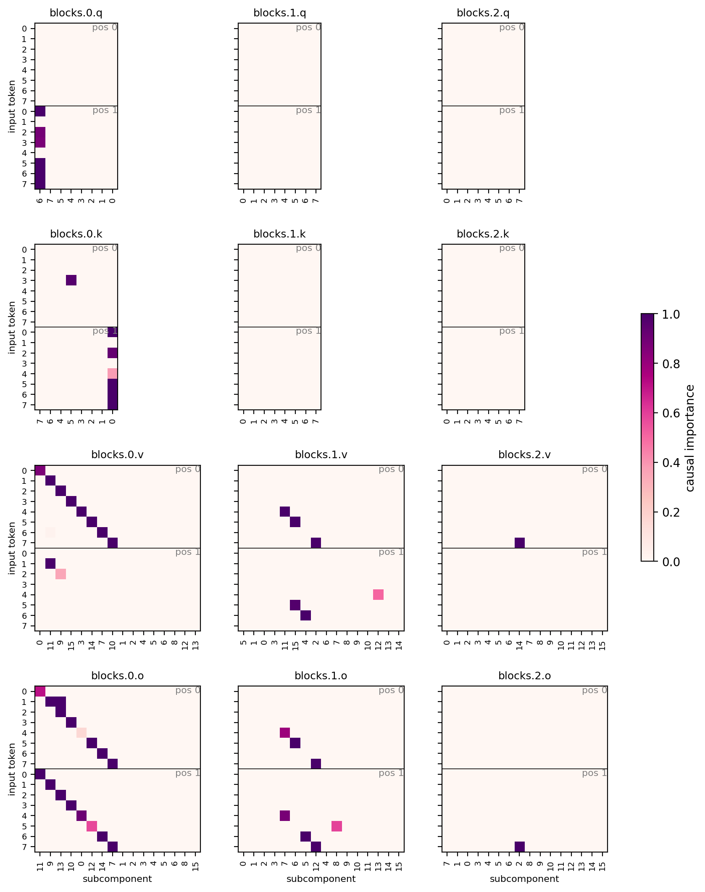

# Why the transformer CI network saturates — and how to fix it

**Question.** With the transformer CI network (`global_shared_transformer`), predicted
CIs are almost all exactly 0 or 1; the MLP CI networks leave intermediate values. The
practical cost: gamma annealing prunes intermediate-CI strays, so the transformer run
keeps many more stray subcomponents alive than the MLP run.

**Answer.** It is not that the transformer "can't calibrate" — it's that nothing
anchors its logit scale. Its output head reads an unnormalized residual stream (no
final norm), CI-fn weight decay is 0, and confident logits reduce stochastic-masking
loss variance, so logits inflate to ±100. The hard sigmoid's [0, 1] linear window then
covers ~1% of the network's dynamic range: almost no input can land in it, and a stray
parked at logit +30 sees only the 0.01-leaky importance-minimality gradient over a
30-unit round trip — it is frozen at CI = 1, out of the gamma anneal's reach. The MLP
CI nets are too weak to inflate logits (theirs live in [-1.5, +2.6]), which is exactly
why their strays linger at intermediate CI where the anneal kills them.

Testbed: `copy_training_v8d32_partial`; baseline runs from the completeness work,
all with `sigmoid_type: leaky_hard`, SmoothL0 (γ 1.0 → 0.01 annealed over the last
25% of training).

## Evidence

Pre-sigmoid logits at step 10000 — layerwise MLP (`joint_norm`, left) stays in
[-1.5, +2.6], hugging the sigmoid window; transformer (`joint_txci`, right) spans
[-80, +150]:

CI values at step 5000, *before* the gamma anneal starts (75%): the MLP run has
substantial intermediate mass (0.05–0.6) that the anneal later sweeps to zero; the
transformer is already near-binary, so the anneal has nothing to grab:

Final decompositions — MLP is textbook (1 q, 1 k, clean v/o diagonals); transformer
keeps stray/duplicate components in every block:

| run (step 10000) | total CI-L0 | stoch recon KL |
|---|---|---|
| layerwise MLP (`joint_norm`) | **3.50** | 1.1e-5 |
| global MLP (`joint_globalci`) | 4.49 | 3.5e-5 |
| transformer (`joint_txci`) | 5.25 | 1.7e-5 |

## Fix

Two changes to `GlobalSharedTransformerCiFn` (`param_decomp/ci_fns.py`):

1. **Final RMS norm** before the output head — config `final_rms_norm: true` —
   decoupling logit scale from residual-stream growth.
2. **Readout zero-init with bias 0.5** — config `zero_init_readout` (default true)
   — all logits start at 0.5, mid-window.

(Two further ideas were tried and discarded, their runs deleted: a Gemma-style tanh
logit soft-cap — no reliable gain on top of the norm, and numerically unstable
without it — and CI-fn Adam weight decay, which did not rescue the baseline.)

## Results

Variants on `v8d32_partial`, same config as `joint_txci` otherwise:

| run | CI-L0 | recon KL | v/o dupes | shared subs | skipped mechs |
|---|---|---|---|---|---|
| layerwise MLP (reference) | 3.50 | 1.1e-5 | 1 | 0 | 10/19 |
| transformer baseline | 5.25 | 1.7e-5 | 7 | 9 | 4/19 |
| + final RMS norm (`txci_fnorm`) | **3.43** | 2.1e-5 | 3 | 1 | 10/19 |

**The final RMS norm is the load-bearing change** (the readout init alone did
nothing in an isolated probe). The fixed transformer beats the layerwise-MLP
reference on sparsity at comparable recon, and skips exactly the same 10/19
redundant mechanisms — the baseline transformer's apparent extra "coverage"
(4/19 skipped) was strays incidentally covering redundant mechanisms.

The mechanism is confirmed end-to-end. Fixed-transformer pre-sigmoid logits at
step 10000 sit in [-5, +3.5], anchored on the sigmoid window:

Mid-training (step 5000) CI values regain the intermediate mass the anneal needs —
compare with the near-binary baseline above:

Final decomposition, `txci_fnorm` — near-textbook block-0 diagonals; residual dirt
is one extra k routing component and a dupe in blocks.1.{v,o}:

## Rigorous comparison: 3 seeds × 2 sizes

Final CI-L0, mean [min–max] over seeds {0, 1, 2} (array 5464); recon stays within
the reference band for the fnorm variants at every size. (A v16d32 testbed was
also swept with the same verdict — dense collapse repaired by the norm — but that
size has been retired and its runs deleted; v8d64 replaces it below.)

| variant | v8d32 | v12d64 |
|---|---|---|
| layerwise MLP (seed-0 ref) | 3.50 | 4.93 |
| transformer baseline | 4.90 [4.62–5.25] | 9.52 [7.10–14.34] |
| + final RMS norm | **3.29 [3.19–3.43]** | **4.22 [4.01–4.39]** |

**The final RMS norm is the consistent, measurable improvement.** Every seed at
every size beats both the baseline transformer and the layerwise-MLP reference,
with tight seed variance.

## Hyperparameter tuning on the fixed network

With the architecture fixed, the loss knobs re-tune. Cleanliness heuristics: several
active subcomponents in one matrix for the same input (dupes) → impmin `coeff` too
low; the same subcomponent active on several inputs (shared) → `beta` too low. The
fnorm runs showed mild dupes at v12 (b0.v 1.17/input), so we swept `coeff`
1e-4 → 2e-4 and `beta` 0.5 → 1.0:

| run | CI-L0 | recon KL | b0.v /input (dupes, shared) |
|---|---|---|---|
| v8 fnorm | 3.43 | 2.1e-5 | 1.00 (0, 0) |
| v8 fnorm, coeff 2e-4 | **3.06** | 2.9e-5 | 0.88 (0, 0) |
| v12 fnorm | 4.01 | 3.0e-5 | 1.17 (1, 1) |
| v12 fnorm, coeff 2e-4 | **3.88** | 3.8e-5 | 1.17 (1, 2) |
| v12 fnorm, coeff 2e-4 + beta 1 | 3.34 | 8.2e-5 | 1.08 (1, 1) |

- **coeff 2e-4 is the new operating point**: sparser and cleaner at both sizes at
  slightly higher recon. (The retired v16d32 sweep agreed, and there the coeff
  also *improved* recon 2.5×.)
- **beta 1.0 not adopted**: it trades recon for L0 without cleaning block 0
  further.
- At v8, coeff 2e-4 shows the first over-pruning hint (one b0 token column zeroed,
  coverage picked up by another block) — the coeff ceiling is near.

In flight: a coeff 4e-4 probe at v12, a CI-net-LR/2 probe at each size, and the
readout-init attribution (fnorm × old random init × 3 seeds — every fnorm number
above implicitly includes the zero-init, whose solo effect was null but whose
interaction with the norm is untested).

## Recommendation

Set `final_rms_norm: true` in `simple_transformer_ci_cfg` for all
`global_shared_transformer` runs. The field defaults to the old behavior, so saved
configs of existing txci runs reload and evaluate unchanged. The readout zero-init
(bias 0.5) is config-gated as `zero_init_readout` (default true) — it only affects
newly initialized CI networks. On this testbed, pair the fixed network with impmin
coeff 2e-4 (beta stays 0.5).
