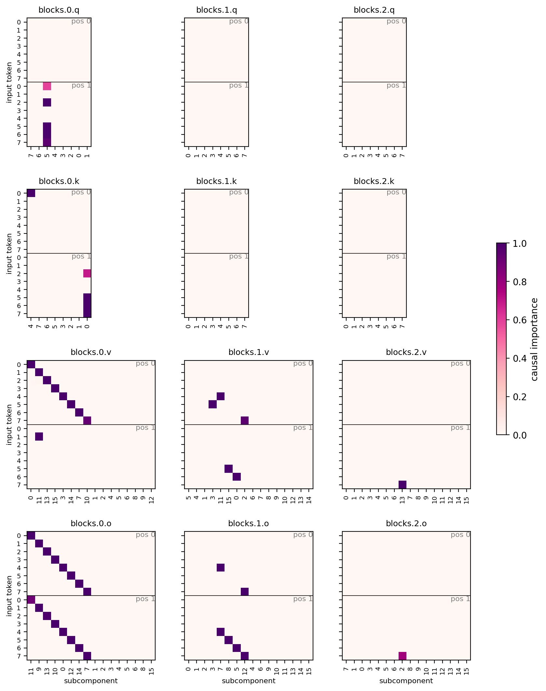
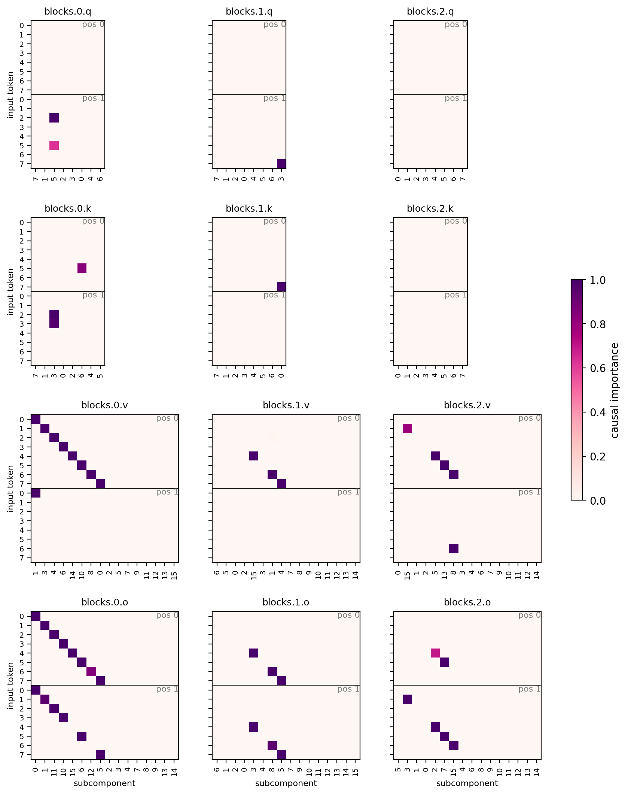
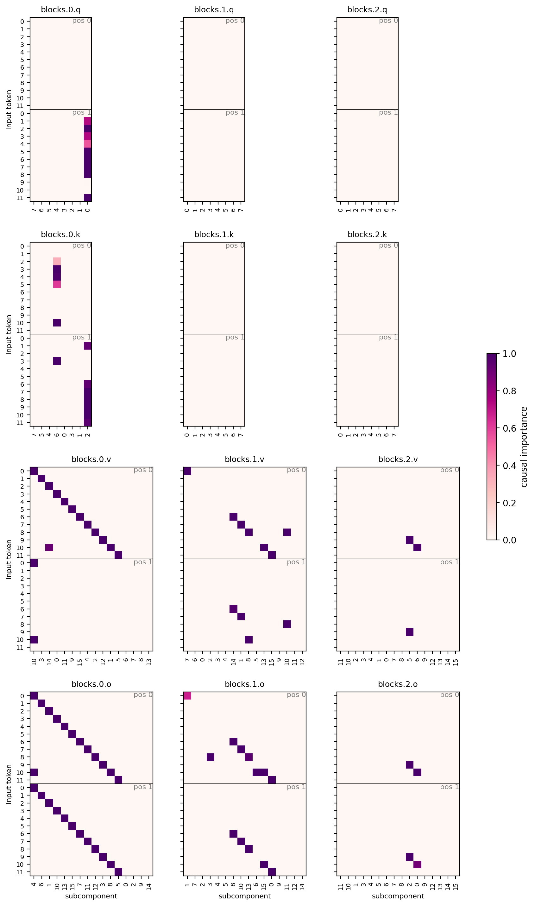

# Why the transformer CI network saturates — and how to fix it

**Question.** With the transformer CI network (`global_shared_transformer`), predicted
CIs are almost all exactly 0 or 1; the MLP CI networks leave intermediate values. The
practical cost: gamma annealing prunes intermediate-CI strays, so the transformer run
keeps many more stray subcomponents alive than the MLP run.

**Answer.** It is not that the transformer "can't calibrate" — it's that nothing
anchors its logit scale. Its output head reads an unnormalized residual stream (no
final norm), CI-fn weight decay is 0, and confident logits reduce stochastic-masking
loss variance, so logits inflate to ±100. The hard sigmoid's [0, 1] linear window then
covers ~1% of the network's dynamic range: almost no input can land in it, and a stray
parked at logit +30 sees only the 0.01-leaky importance-minimality gradient over a
30-unit round trip — it is frozen at CI = 1, out of the gamma anneal's reach. The MLP
CI nets are too weak to inflate logits (theirs live in [-1.5, +2.6]), which is exactly
why their strays linger at intermediate CI where the anneal kills them.

Testbed: `copy_training_v8d32_partial`; baseline runs from the completeness work,
all with `sigmoid_type: leaky_hard`, SmoothL0 (γ 1.0 → 0.01 annealed over the last
25% of training).

## Evidence

Pre-sigmoid logits at step 10000 — layerwise MLP (`joint_norm`, left) stays in
[-1.5, +2.6], hugging the sigmoid window; transformer (`joint_txci`, right) spans
[-80, +150]:

CI values at step 5000, *before* the gamma anneal starts (75%): the MLP run has
substantial intermediate mass (0.05–0.6) that the anneal later sweeps to zero; the
transformer is already near-binary, so the anneal has nothing to grab:

Final decompositions — MLP is textbook (1 q, 1 k, clean v/o diagonals); transformer
keeps stray/duplicate components in every block:

| run (step 10000) | total CI-L0 | stoch recon KL |
|---|---|---|
| layerwise MLP (`joint_norm`) | **3.50** | 1.1e-5 |
| global MLP (`joint_globalci`) | 4.49 | 3.5e-5 |
| transformer (`joint_txci`) | 5.25 | 1.7e-5 |

## Fix

Two changes to `GlobalSharedTransformerCiFn` (`param_decomp/ci_fns.py`):

1. **Final RMS norm** before the output head — config `final_rms_norm: true` —
   decoupling logit scale from residual-stream growth.
2. **Readout zero-init with bias 0.5** — config `zero_init_readout` (default true)
   — all logits start at 0.5, mid-window.

(Two further ideas were tried and discarded, their runs deleted: a Gemma-style tanh
logit soft-cap — no reliable gain on top of the norm, and numerically unstable
without it — and CI-fn Adam weight decay, which did not rescue the baseline.)

## Results

Variants on `v8d32_partial`, same config as `joint_txci` otherwise:

| run | CI-L0 | recon KL | v/o dupes | shared subs | skipped mechs |
|---|---|---|---|---|---|
| layerwise MLP (reference) | 3.50 | 1.1e-5 | 1 | 0 | 10/19 |
| transformer baseline | 5.25 | 1.7e-5 | 7 | 9 | 4/19 |
| + final RMS norm (`txci_fnorm`) | **3.43** | 2.1e-5 | 3 | 1 | 10/19 |

**The final RMS norm is the load-bearing change** (the readout init alone did
nothing in an isolated probe). The fixed transformer beats the layerwise-MLP
reference on sparsity at comparable recon, and skips exactly the same 10/19
redundant mechanisms — the baseline transformer's apparent extra "coverage"
(4/19 skipped) was strays incidentally covering redundant mechanisms.

The mechanism is confirmed end-to-end. Fixed-transformer pre-sigmoid logits at
step 10000 sit in [-5, +3.5], anchored on the sigmoid window:

Mid-training (step 5000) CI values regain the intermediate mass the anneal needs —
compare with the near-binary baseline above:

Final decomposition, `txci_fnorm` — near-textbook block-0 diagonals; residual dirt
is one extra k routing component and a dupe in blocks.1.{v,o}:

## Rigorous comparison: 3 seeds × 2 sizes

Final CI-L0, mean [min–max] over seeds {0, 1, 2} (array 5464); recon stays within
the reference band for the fnorm variants at every size. (A v16d32 testbed was
also swept with the same verdict — dense collapse repaired by the norm — but that
size has been retired and its runs deleted; v8d64 replaces it below.)

| variant | v8d32 | v12d64 |
|---|---|---|
| layerwise MLP (seed-0 ref) | 3.50 | 4.93 |
| transformer baseline | 4.90 [4.62–5.25] | 9.52 [7.10–14.34] |
| + final RMS norm | **3.29 [3.19–3.43]** | **4.22 [4.01–4.39]** |

**The final RMS norm is the consistent, measurable improvement.** Every seed at
every size beats both the baseline transformer and the layerwise-MLP reference,
with tight seed variance.

## Hyperparameter tuning on the fixed network

With the architecture fixed, the loss knobs re-tune. Cleanliness heuristics: several
active subcomponents in one matrix for the same input (dupes) → impmin `coeff` too
low; the same subcomponent active on several inputs (shared) → `beta` too low. The
fnorm runs showed mild dupes at v12 (b0.v 1.17/input), so we swept `coeff`
1e-4 → 2e-4 and `beta` 0.5 → 1.0:

| run | CI-L0 | recon KL | b0.v /input (dupes, shared) |
|---|---|---|---|
| v8 fnorm | 3.43 | 2.1e-5 | 1.00 (0, 0) |
| v8 fnorm, coeff 2e-4 | **3.06** | 2.9e-5 | 0.88 (0, 0) |
| v12 fnorm | 4.01 | 3.0e-5 | 1.17 (1, 1) |
| v12 fnorm, coeff 2e-4 | **3.88** | 3.8e-5 | 1.17 (1, 2) |
| v12 fnorm, coeff 2e-4 + beta 1 | 3.34 | 8.2e-5 | 1.08 (1, 1) |

- **coeff 2e-4 is the new operating point**: sparser and cleaner at both sizes at
  slightly higher recon. (The retired v16d32 sweep agreed, and there the coeff
  also *improved* recon 2.5×.)
- **beta 1.0 not adopted**: it trades recon for L0 without cleaning block 0
  further.
- At v8, coeff 2e-4 shows the first over-pruning hint (one b0 token column zeroed,
  coverage picked up by another block) — the coeff ceiling is near.

Follow-ups that closed the sweep:

- **coeff 4e-4 is over the ceiling at v12**: L0 3.25 but recon 2.3× worse
  (8.7e-5) and block 0 develops zeros (over-pruned). 2e-4 stands.
- **CI-net LR halved to 1e-3** (components stay 2e-3): a clear win at v8d32 —
  L0 3.00 at recon 1.65e-5, better than `i2e-4` on *both* axes, and it repairs
  the over-pruning (block-0 v/o back to perfect 1.00/input with full coverage).
  Neutral-to-negative elsewhere (v8d64: 3.31 vs 3.12; v12: 3.89 @ 5.6e-5,
  dirtier b0) — a per-size knob, not part of the base formula.
- **Readout-init attribution** (fnorm × old random init, 3 seeds): the zero-init
  is **load-bearing given the norm**. At v8d32, fnorm with random init collapses
  to 4.79 [4.12–6.07] — nearly the whole advantage gone (baseline 4.90); at
  v12d64, 4.42 vs 4.22. Init alone did nothing; norm alone loses most of its
  value: the two are synergistic. Norm anchors the logit scale; zero-init starts
  every logit inside the sigmoid window so components begin life prunable.

## v8d64

New testbed replacing the retired v16d32: vocab 8, d_embed 64, 4 redundant tokens
(`copy_training_v8d64_partial`) — the wide-embedding version, where token
directions are nearly orthogonal. The formula transfers with no retuning; a small
coeff bracket confirms 2e-4 and shows the response is smooth (no cliff):

| run | CI-L0 | recon KL | skips |
|---|---|---|---|
| `txci_fnorm_i1e-4` | 3.74 | **6.1e-6** | 9/21 |
| `txci_fnorm_i1.5e-4` | 3.25 | 8.7e-6 | 10/21 |
| `txci_fnorm_i2e-4` | **3.12** | 8.5e-6 | 9/21 |
| `txci_fnorm_i2e-4_cilr1e-3` | 3.31 | 9.5e-6 | 9/21 |

`txci_fnorm_i2e-4` is textbook: **zero duplicates in the entire model**, perfect
block-0 diagonals, recon 3× better than anything achieved at v8d32.

## Final picks (the formula that works)

Architecture: `global_shared_transformer` + `final_rms_norm: true` +
`zero_init_readout: true` (both required — synergistic). Losses: SmoothL0 impmin
coeff 2e-4, beta 0.5, γ 1 → 0.01 annealed over the last 25%; recipe losses
unchanged (stochastic + layerwise + PPGD). LRs 2e-3/2e-3, except v8d32 where
halving the CI-net LR to 1e-3 improves everything.

| size | run | CI-L0 | recon KL | block-0 |
|---|---|---|---|---|
| v8d32 | `copy_v8d32_partial_joint_txci_fnorm_i2e-4_cilr1e-3` | 3.00 | 1.7e-5 | perfect |
| v8d64 | `copy_v8d64_partial_joint_txci_fnorm_i2e-4` | 3.12 | 8.5e-6 | perfect, 0 dupes anywhere |
| v12d64 | `copy_v12d64_partial_joint_txci_fnorm_i2e-4` | 3.88 | 3.8e-5 | 1.17/input (1 dupe) |

## Recommendation

Set `final_rms_norm: true` in `simple_transformer_ci_cfg` for all
`global_shared_transformer` runs and keep `zero_init_readout: true` (the default)
— both are required; each loses most of its value without the other. The
`final_rms_norm` field defaults to the old behavior, so saved configs of existing
txci runs reload and evaluate unchanged. On this testbed, pair the fixed network
with impmin coeff 2e-4 (beta stays 0.5).
