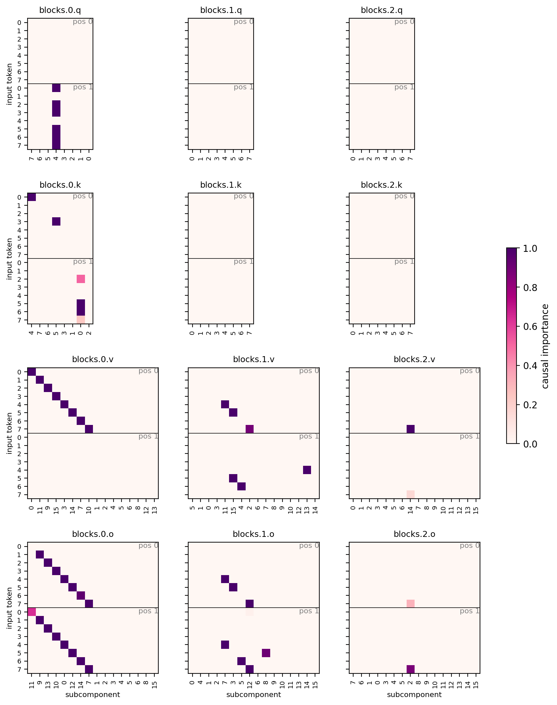

# Why the transformer CI network saturates — and how to fix it

**Question.** With the transformer CI network (`global_shared_transformer`), predicted
CIs are almost all exactly 0 or 1; the MLP CI networks leave intermediate values. The
practical cost: gamma annealing prunes intermediate-CI strays, so the transformer run
keeps many more stray subcomponents alive than the MLP run.

**Answer.** It is not that the transformer "can't calibrate" — it's that nothing
anchors its logit scale. Its output head reads an unnormalized residual stream (no
final norm), CI-fn weight decay is 0, and confident logits reduce stochastic-masking
loss variance, so logits inflate to ±100. The hard sigmoid's [0, 1] linear window then
covers ~1% of the network's dynamic range: almost no input can land in it, and a stray
parked at logit +30 sees only the 0.01-leaky importance-minimality gradient over a
30-unit round trip — it is frozen at CI = 1, out of the gamma anneal's reach. The MLP
CI nets are too weak to inflate logits (theirs live in [-1.5, +2.6]), which is exactly
why their strays linger at intermediate CI where the anneal kills them.

Testbed: `copy_training_v8d32_partial`; baseline runs from the completeness work,
all with `sigmoid_type: leaky_hard`, SmoothL0 (γ 1.0 → 0.01 annealed over the last
25% of training).

## Evidence

Pre-sigmoid logits at step 10000 — layerwise MLP (`joint_norm`, left) stays in
[-1.5, +2.6], hugging the sigmoid window; transformer (`joint_txci`, right) spans
[-80, +150]:


CI values at step 5000, *before* the gamma anneal starts (75%): the MLP run has
substantial intermediate mass (0.05–0.6) that the anneal later sweeps to zero; the
transformer is already near-binary, so the anneal has nothing to grab:


Final decompositions — MLP is textbook (1 q, 1 k, clean v/o diagonals); transformer
keeps stray/duplicate components in every block:


| run (step 10000) | total CI-L0 | stoch recon KL |
|---|---|---|
| layerwise MLP (`joint_norm`) | **3.50** | 1.1e-5 |
| global MLP (`joint_globalci`) | 4.49 | 3.5e-5 |
| transformer (`joint_txci`) | 5.25 | 1.7e-5 |
| transformer, beta 1 (`joint_txci_beta1`) | 12.92 | 6.5e-5 |

## Fix

Three standard-transformer changes to `GlobalSharedTransformerCiFn`
(`param_decomp/ci_fns.py`):

1. **Final RMS norm** before the output head — config `final_rms_norm: true`.
2. **Readout zero-init with bias 0.5** (unconditional) — all logits start at 0.5,
   mid-window.
3. **Tanh logit soft-cap** centered on the window — config `logit_softcap: 2.0`.

### How the soft-cap works

The output head produces a raw logit `x` per component; the CI is `hard_sigmoid(x)`
(= `clamp(x, 0, 1)`). The soft-cap replaces `x` with

```
x' = 0.5 + cap · tanh((x − 0.5) / cap)
```

before the sigmoid (Gemma-2 uses the uncentered form on attention/final logits).
Properties:

- **Identity near the window.** `tanh(u) ≈ u` for small `u`, so for logits near 0.5
  (the center of the sigmoid's [0, 1] linear region) `x' ≈ x` — calibrated
  intermediate values pass through unchanged.
- **Hard bound on saturation depth.** `tanh` is bounded in (−1, 1), so
  `x' ∈ (0.5 − cap, 0.5 + cap)` — with `cap = 2`, (−1.5, 2.5) — no matter how large
  the raw logit gets. A maximally confident component sits at most 1.5 units from the
  linear window instead of 100+.
- **Bounded hysteresis, not bigger gradients.** The cap does *not* increase the
  gradient on a saturated component — above the window the chain is still the
  sigmoid's 0.01 leak (times `tanh' < 1`). What it bounds is the *integrated
  distance* that small gradient must cover before the CI value changes at all:
  ≤ 1.5 units instead of 30–150. Uncapped, a stray at logit +30 is frozen (the
  gamma anneal ends long before the leak drags it back 29 units); capped, every
  stray is a few steps from re-entering the window. The same bound on the negative
  side helps dead components resurrect.
- **No incentive to drift.** Uncapped, the trunk can keep burying logits deeper
  (5 → 50 → 150) — confidence is loss-free and self-reinforcing. Capped, logits 5
  and 50 map to nearly the same `x'`, so growing confident weights buys nothing.

The choice `cap = 2` is loose: CI = 1 needs `x' ≥ 1`, i.e. `tanh ≥ 0.25` (raw logit
≈ 1.0), so confident components are cheap to represent, while the bound stays the
same order as the window itself. The cap alone (without the final RMS norm) still
bounds saturation depth, but lets the pre-cap logits — and the trunk driving them —
grow unboundedly confident; the RMS norm addresses that upstream. The two compose:
norm anchors the input scale of the head, cap bounds its output.

## Results

Three variants on `v8d32_partial`, same config as `joint_txci` otherwise
(`txci_newinit` = new head init only; `txci_fnorm` = + final RMS norm;
`txci_fnorm_cap2` = + soft-cap 2.0):

| run | CI-L0 | recon KL | v/o dupes | shared subs | skipped mechs |
|---|---|---|---|---|---|
| layerwise MLP (reference) | 3.50 | 1.1e-5 | 1 | 0 | 10/19 |
| transformer baseline | 5.25 | 1.7e-5 | 7 | 9 | 4/19 |
| + new init only | 5.56 | 5.8e-5 | 11 | 10 | 5/19 |
| + final RMS norm | **3.43** | 2.1e-5 | 3 | 1 | 10/19 |
| + RMS norm + soft-cap 2 | **3.24** | 1.9e-5 | 2 | 0 | 10/19 |

**The final RMS norm is the load-bearing change**; the soft-cap helps a little more;
the init alone does nothing. Both fixed variants now beat the layerwise-MLP reference
on sparsity at comparable recon, and skip exactly the same 10/19 redundant mechanisms
it does — the baseline transformer's apparent extra "coverage" (4/19 skipped) was
strays incidentally covering redundant mechanisms.

The mechanism is confirmed end-to-end. Fixed-transformer pre-sigmoid logits at
step 10000 sit in [-5, +3.5], anchored on the sigmoid window:


Mid-training (step 5000) CI values regain the intermediate mass the anneal needs —
compare with the near-binary baseline above:


Final decomposition, `fnorm_cap2` — block-0 v/o perfectly clean (1.00/input,
0 dupes, 0 shared), single q routing column; residual dirt is 3 alive k components
(vs 1) and one dupe in each of blocks.1.{v,o}:



## Recommendation

Set `final_rms_norm: true` and `logit_softcap: 2.0` in
`simple_transformer_ci_cfg` for all future `global_shared_transformer` runs. Both
fields default to the old behavior, so saved configs of existing txci runs reload
and evaluate unchanged. The readout zero-init (bias 0.5) is unconditional — it only
affects newly initialized CI networks.

Not investigated: whether the same fix closes the gap on the larger testbeds
(v12d64, v16d32) where the completeness report found the transformer's dense
collapse; a seed sweep (all numbers here are n=1); making the fixed settings the
defaults.
