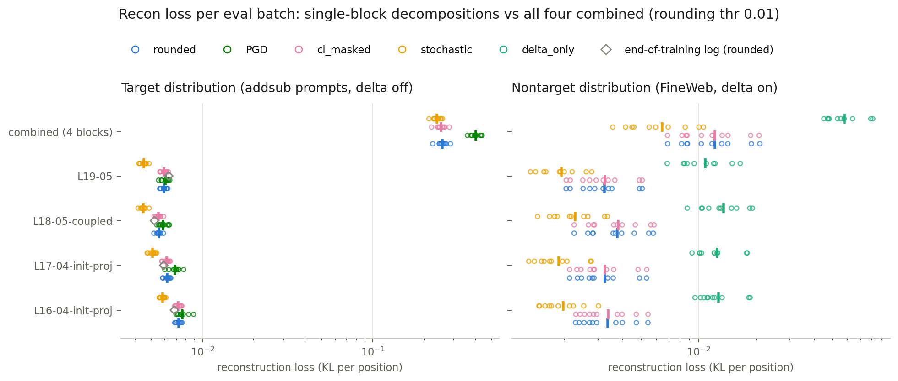
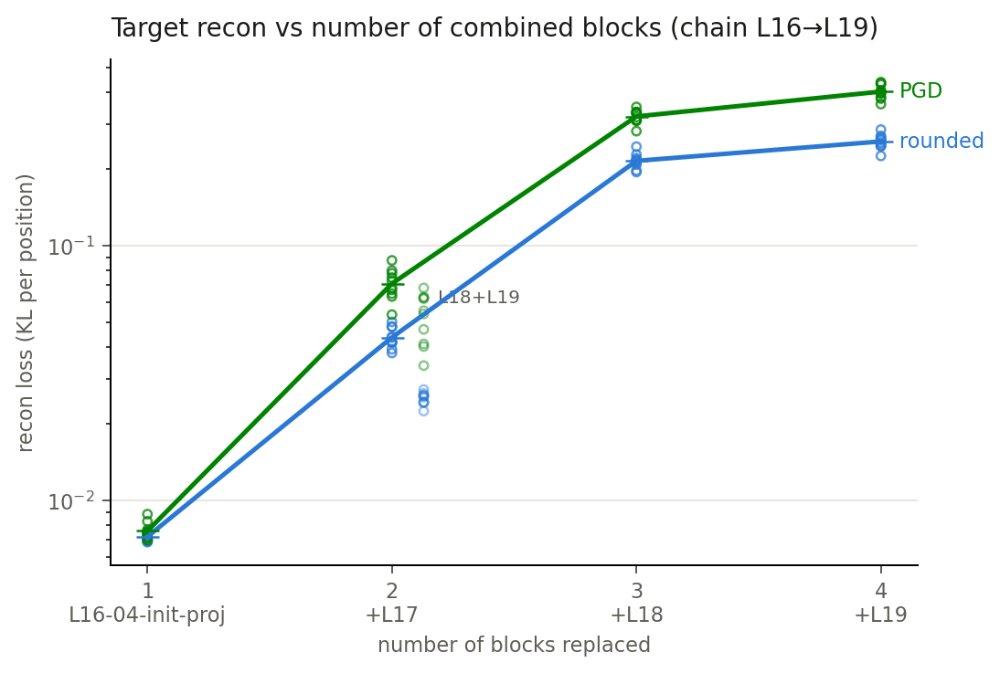
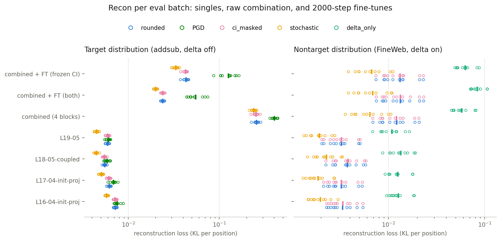
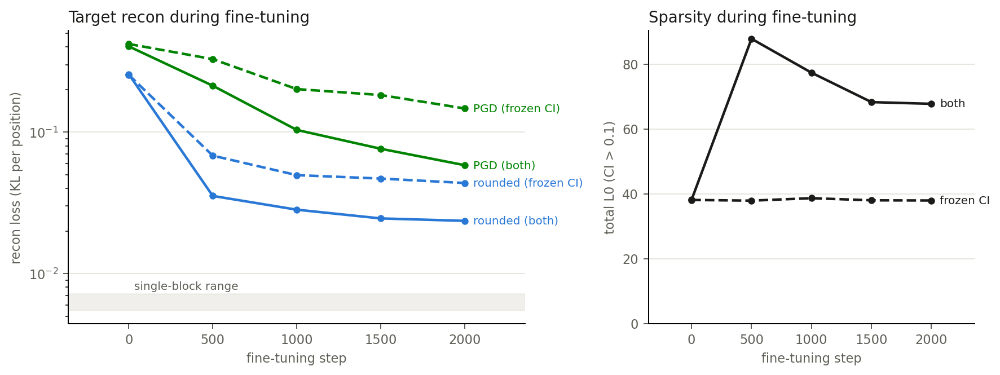

# Report — combining single-block decompositions

Setting: four single-block targeted decompositions of Llama-3.1-8B on
addition/subtraction prompts (`addsub-L16-04-init-proj`, `addsub-L17-04-init-proj`,
`addsub-L18-05-coupled`, `addsub-L19-05`; blocks 16–19, 7 matrices each). We assemble
them into one model — every eligible layer replaced by its decomposed version, each
block keeping its own trained CI function — and ask whether the PD objectives still
hold.

All numbers: KL per position between the masked-component model and the target model,
rounding threshold 0.01 (same as the runs' own end-of-training "rounded recon" logs),
means over 10 eval batches (dots in the figures are the individual batches).

## Objective 1: the decompositions do NOT readily combine

| subject | rounded | PGD (20-step) | nontarget rounded | total L0 |
|---|---|---|---|---|
| L16 alone | 0.0072 | 0.0076 | 0.0034 | 9.6 |
| L17 alone | 0.0062 | 0.0069 | 0.0032 | 8.0 |
| L18 alone | 0.0055 | 0.0059 | 0.0038 | 12.6 |
| L19 alone | 0.0059 | 0.0060 | 0.0032 | 7.9 |
| **all four combined** | **0.257** | **0.403** | **0.0122** | 38.1 |

Key conclusions:

1. **Combined target recon is ~40× the worst single block, and ~10× the sum of the
   four single-block losses.** The failure is superadditive: each block's components
   and CI masks were trained with every *other* block intact, so once all four are
   replaced, downstream blocks receive inputs their decomposition was never fitted
   to. Adversarial (PGD) recon degrades even more (0.40).
2. **Each block's CI values are untouched by combination** (per-block L0 identical to
   the singles, e.g. L16: 9.60 vs 9.61): CIs are computed from the clean target-model
   activations. The entire degradation lives in the masked forward pass.
3. **The nontarget objective survives combination much better** (0.003 → 0.012):
   off-distribution the delta component carries the output, so component errors
   contribute little there.

How the error grows with the number of replaced blocks (chain starting at L16):

| blocks replaced | rounded | PGD | additive expectation (rounded) |
|---|---|---|---|
| L16 (1) | 0.0072 | 0.0076 | 0.0072 |
| +L17 (2) | 0.0437 | 0.0710 | 0.0134 |
| +L18 (3) | 0.2154 | 0.3218 | 0.0189 |
| +L19 (4) | 0.2567 | 0.4028 | 0.0248 |
| L18+L19 (2, off-chain) | 0.0252 | 0.0527 | 0.0111 |

Each early addition multiplies the loss ~5-6× rather than adding its single-block
contribution; by three blocks the compounding dominates (11× the additive
expectation). The off-chain pair L18+L19 shows the same superadditivity (2.3× its
additive expectation), so this is not specific to L16/L17.

**Answer to the roadmap question:** yes, the combined rounded recon is *much* higher
than the end-of-training rounded recon of the individual decompositions —
two orders of magnitude. Combining requires re-optimisation (objectives 2/3), not
mere concatenation.

## Objective 2: fine-tuning the assembly is feasible — train both, not components-only

Setup: the assembled model fine-tuned for 2000 steps with the full targeted loop
(nontarget FineWeb pass, ratio 2.0), importance-minimality pinned to its
end-of-training state (coeff 3e-5, p = 0.5), components LR 1e-4 and CI-fn LR 5e-5
(cosine, sources' schedule shape). Memory forced single-GPU runs at global batch 32
(sources used 128), so these are feasibility-grade, not final-quality.

| subject (same eval script/seed) | rounded | PGD | target L0 | ntgt rounded | ntgt L0 |
|---|---|---|---|---|---|
| singles (range) | 0.0055–0.0072 | 0.0059–0.0076 | 7.9–12.6 | 0.0032–0.0038 | 0.27–0.35 |
| raw combined | 0.257 | 0.403 | 38.1 | 0.0122 | 0.30 |
| combined + FT, frozen CI fns | 0.0431 | 0.126 | 38.1 | 0.0132 | 0.35 |
| combined + FT, both | **0.0239** | **0.0551** | 67.6 | 0.0133 | 0.59 |

Key conclusions:

1. **Fine-tuning recovers most of the combination damage**: rounded recon drops
   ~11× (0.257 → 0.024) when training both components and CI fns; PGD drops 7×
   (0.40 → 0.055). Neither run has fully converged at 2000 steps, but the frozen-CI
   variant is clearly plateauing while "both" still improves.
2. **Training the CI fns matters.** Components-only (frozen CI) stalls at ~2× worse
   rounded and ~2.3× worse PGD. The masks the single-block runs learned are not the
   right masks for the combined model — even with components free to adapt under
   them.
3. **The price of training CI fns is sparsity, not targeting** (at least at 2000
   steps): total L0 rises 38 → 88 in the first 500 steps, then re-sparsifies to ~68
   (vs the singles' sum of 38). Nontarget behaviour transiently erodes (0.011 →
   0.026 at step 1000) and then self-corrects to ~0.013, close to the raw-combined
   level. Frozen CI fns cannot change any mask (CIs are computed from unmasked
   activations), so their L0 is pinned at 38.1 by construction.
4. Remaining gap to single-block quality is ~4× (0.024 vs ~0.006). Given the 4×
   smaller batch, the truncated LR schedule, and the still-decreasing trajectory,
   longer/bigger fine-tuning plausibly closes most of it.

## Objective 3: re-train a single CI fn

(running — `combine-L16-19-obj3-freshci-01`: source-architecture global CI fn
(d512 × 4 blocks, ~90M params vs 124M for the four per-block CI fns) trained from
scratch over all 28 matrices, components initialised from the sources.)
