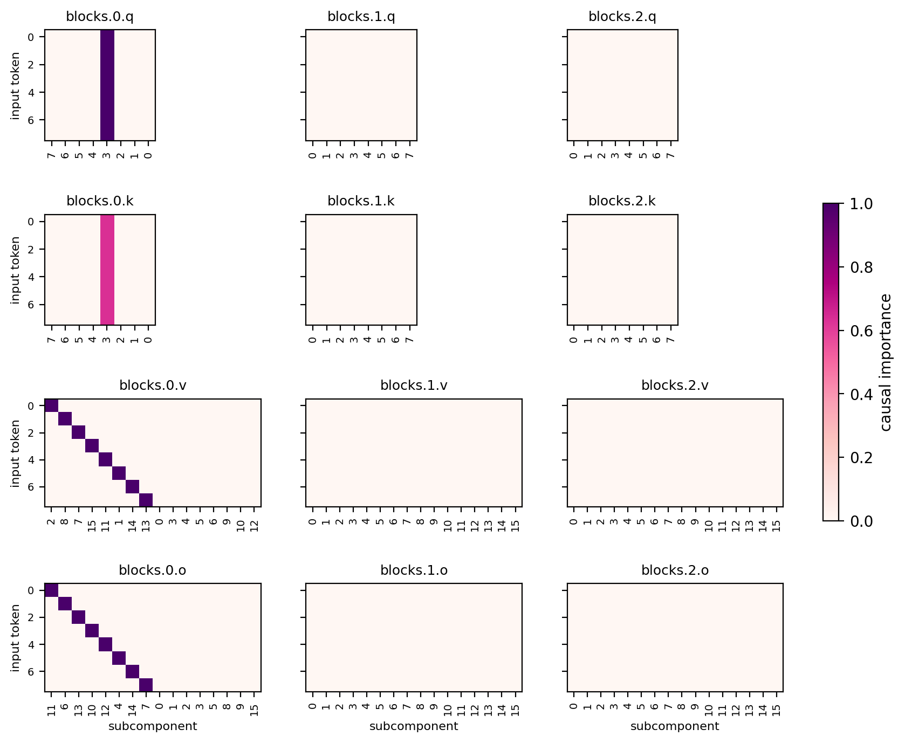
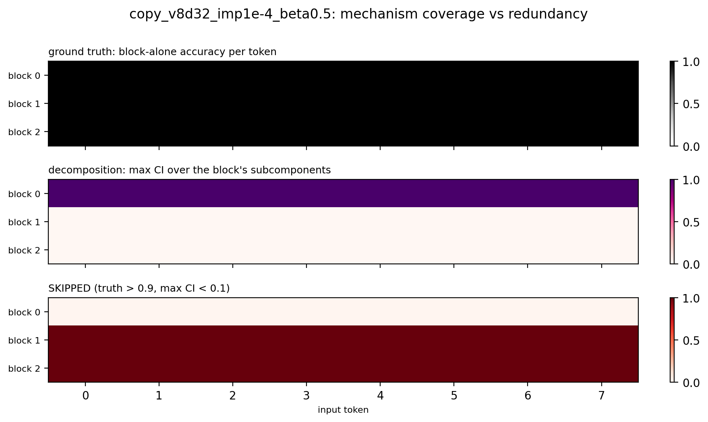

# Report — the completeness problem, on the attention copy testbed

Setting: the combine-layers experiments showed that when several blocks implement the
same computation, a decomposition trained with a sparsity penalty credits one block
and prunes the backups. On the 8B model we can only infer this indirectly. The
testbed below makes the failure exactly measurable: a small transformer with
*certified, trained-in* n-fold redundancy, legible enough that every mechanism is one
visible cell in a heatmap. This report uses the attention **copy toy (vocab 8,
d_embed 32)** as the case study; the earlier MLP-cipher generation of the testbed and
its findings are summarized at the end.

Code: `param_decomp_lab/toy_models/toy_model_redundancy_copy.py` (toy) and
`param_decomp_lab/experiments/toy_model_redundancy/` (PD experiment, `plot_ci.py`
diagnostic, `ToyRedundancyCIPlot` eval filmstrip). Runs live under
`~/out/runs/toy_model_redundancy/`.

## The case-study model

An attention-only transformer on the **copy task**:

- **Inputs**: sequences `[x, Q]` — a token `x` at position 0 and a dedicated query
  token `Q` at position 1. Fixed random unit-norm embedding `W_E [vocab+1, d_embed]`
  (vocab 8, d_embed 32), tied unembedding over the vocab.
- **Blocks**: 3 pre-RMSNorm single-head causal attention blocks
  (`resid + W_O·attn(W_Q, W_K, W_V, norm(resid))`, no biases, no MLPs), final RMSNorm.
- **Task**: CE at the last position with target `x` — each block must attend from `Q`
  to position 0 and copy `e_x` into the last position's residual.
- **Forced redundancy**: each training sequence keeps a block subset drawn uniformly
  from the `2^3 − 1` non-empty subsets (block dropout), so *every block alone must
  implement the copy*.

Certificate (8192 sequences; keep-mask bit string `block2 block1 block0`):

| blocks enabled | CE | accuracy |
|---|---|---|
| none | 2.74 | 0.13 (~chance) |
| each single block | ~2.6e-4 | **1.0000** |
| each pair / all | ~2.6e-4 | 1.0000 |

All **24 (block, token) mechanisms** (3 blocks × 8 tokens) certified at accuracy 1.0
(`per_token_accuracy.npz`). Training takes ~2 min; the model is small enough that the
decomposition's entire CI structure fits in one readable figure.

Why this design (in brief — details in the history section): attention rather than
MLPs for transformer fidelity; the copy task because its OV circuit factorizes into
clean per-token mechanisms; block dropout because redundancy does **not** emerge
naturally (CE saturation freezes the first winner and starves the other blocks;
elementwise dropout concentrates rather than duplicates); vocab 8 / d_embed 32 purely
for legibility.

## Canonical decomposition

Recipe (the product of the tuning history below):
**PPGD + annealed SmoothL0**, concretely:

| | value | why it matters |
|---|---|---|
| `SmoothL0ImportanceMinimalityLoss` | coeff **1e-4**, **beta 0.5** | coeff sets the prune threshold; beta's entropy term taxes subcomponents active across many inputs (anti-reuse) |
| γ anneal | 1 → 0.01, linear over the **last 25%** of training | quadratic phase lets competition resolve before the bistable small-γ regime locks the pattern |
| `PersistentPGDReconLoss` | coeff 0.5, adam sources lr 0.01, per-batch-per-position | adversarial masks punish fragmentation and duplication that stochastic sampling tolerates |
| recon losses | StochasticReconLayerwise 1.0 + StochasticRecon 1.0, KL | |
| C | 8 (q, k), 16 (v, o) | routing needs ~1 subcomponent; v/o need one per token |
| CI fn | layerwise MLP, hidden [16], leaky-hard | |
| steps × batch | 10 000 × 512, lr 2e-3 constant | structural convergence lands ~70% in |

Result (`copy_v8d32_imp1e-4_beta0.5`, recon KL 1.5e-6) — a **textbook decomposition**:



- Block 0: exactly **one q and one k subcomponent** active on all 8 tokens — the
  token-independent "Q attends to position 0" routing pair — and **perfect
  one-subcomponent-per-token diagonals in v and o**. No duplicates, no gaps; unused
  capacity fully dead.
- Blocks 1–2: completely empty.



That is the completeness problem in its purest form: the decomposition of the
*routed* computation is ideal, and **16 of the 24 certified mechanisms — the two
backup blocks — are invisible** (the SKIPPED panel). Reconstruction is essentially
perfect, so nothing about the loss hints that two-thirds of the model's mechanisms
are missing from the story.

## Can the backups be bought with the sparsity coefficient?

Downward sweep of the SmoothL0 coeff (beta 0.5 and everything else fixed):

| coeff | b0 v/o per-input (dupes) | backup cells recovered / 16 | skipped / 24 | recon |
|---|---|---|---|---|
| 1e-4 (canonical) | 1.00 / 1.00 (0) | 0 | 16 | 1.5e-6 |
| **5e-5** | **1.00 / 1.00 (0)** | 1 | 15 | 2.2e-6 |
| 2e-5 | 1.50 / 1.00 (4) | 0 | 16 | 1.5e-6 |
| 1e-5 | 1.50 / 1.00 (4) | 2 | 14 | 1.4e-6 |
| 3e-6 | 2.75 / 2.12 (13) | 5 | 11 | 1.5e-6 |
| 1e-6 | 4.25 / 3.50 (15) | 6 | 10 | 8.8e-7 |

Backup recovery only begins once block 0 starts fragmenting, and even at 1e-6 —
block 0 duplicated 3–4× ([figure](report_figures/copy_v8d32_imp1e-6.png)) — only 6 of
16 backup cells are recovered. The completeness–cleanliness frontier reproduces
exactly the shape found on the MLP-cipher testbed at 4× the scale: **complete
decompositions cannot be bought with the impmin coefficient — recovery requires a
protocol, not a coefficient.** The lowest coeff with a canonical-perfect block 0 is
**5e-5**.

## Block-by-block decomposition

Decomposing one block at a time (partners intact) at the weakest validated pressure
(coeff 5e-5, beta 0.5):

| per-block run | skipped / 8 | surviving mechanisms |
|---|---|---|
| block 0 | 7 | 1 |
| block 1 | 8 — empty | 0 |
| block 2 | 8 — empty | 0 |

A redundant block decomposed against an intact background yields essentially
*nothing* — even the block the joint decomposition credits with the whole computation
([figure](report_figures/copy_v8d32_perblock_b0.png): block 0 keeps a single
mechanism). With the partners always on, every mechanism's marginal contribution is
maskable, and even the weakest coefficient that produces a clean joint decomposition
prunes them all. This is the sharpest statement yet of the block-level threshold
account: *per-block completeness depends on the block's in-context marginal
contribution, not on whether the mechanism exists.*

## State of the testbed

`copy_v8d32` + the canonical recipe give:

- a certified, fully legible ground truth (24 mechanisms, one heatmap);
- an ideal decomposition of the routed computation (block 0 textbook);
- maximal blindness to backups (16/24 skipped), robust to the sparsity coefficient
  in both directions;
- per-block decomposition that recovers nothing.

A recovery protocol's job is now visually unambiguous: **fill in the two empty
columns of panels without disturbing block 0's diagonals.** The `ToyRedundancyCIPlot`
eval metric renders the full CI grid every 500 training steps, so protocol dynamics
are observable as a filmstrip.

Reproduce:

```bash
python -m param_decomp_lab.toy_models.toy_model_redundancy_copy train \
  --out-dir=$OUT/runs/toy_model_redundancy/copy_training_v8d32 --vocab-size=8 --d-embed=32
python -m param_decomp_lab.experiments.toy_model_redundancy.run <config.yaml> \
  --run_id=toy_model_redundancy/<details>
python -m param_decomp_lab.experiments.toy_model_redundancy.plot_ci $OUT/runs/toy_model_redundancy/<run_id>
```

## History: the MLP-cipher generation and what it established

The first testbed generation (`toy_model_redundancy.py`: MLP blocks, derangement
cipher `pi(x)`, vocab 32, per-position block dropout) produced the findings that led
to the recipe and design above. Headlines, with run dirs where kept:

- **Baseline skip pathology** (`impmin_1e-5`): a standard L2-penalty joint
  decomposition skips 29/96 certified mechanisms, all in the backup blocks.
- **Penalty shape doesn't fix it**: SmoothL0 variants skip more than L2 at matched
  coeff; lowering any penalty to completeness (L2 1e-6, SmoothL0+PPGD 1e-6) makes
  block 0 essentially dense first. Recon and completeness anti-correlate throughout.
- **PPGD + deferred γ anneal is the clean-decomposition recipe**
  (`joint_imp2e-4_ppgd_lateanneal`): exactly one-subcomponent-per-input in both
  block-0 matrices, backups fully pruned; robust to anneal placement (50%/75%) and to
  raising the coeff 50×.
- **The ablation-path barrier**: removing an entire redundant block costs ~1e-5 KL,
  but *half*-removing it costs up to 1.9e-2 — a 2000× off-distribution wall (the toy
  was only trained on binary block dropout). Interpolating masks (stochastic and PGD)
  therefore *protect* in-context mechanisms from pruning: the empty solution is
  cheaper but unreachable by descent. Which mechanisms survive is decided by
  optimization dynamics, not loss values.
- **Per-block decomposition is coeff-sensitive**: nearly complete at a too-low coeff
  (an artifact — the penalty wasn't binding), empty at a properly tuned one, in both
  MLP and attention variants.
- **Redundancy does not emerge without structured dropout** (attention cipher toy):
  plain training concentrates the task in one block and CE saturation freezes the
  rest untrained; keeping gradients alive (frozen final-norm gain, label smoothing)
  grows the *leader* toward individual sufficiency but never the copies
  (rich-get-richer); elementwise weight dropout concentrates even harder
  (block-alone [1.0, 0, 0] at p ≥ 0.3). Only per-block dropout forces true copies.
- **Partial redundancy** (`training_partial`, tokens 0–15 redundant, 16–31 free):
  the free half trains into a genuinely cooperative three-block computation
  (block-alone accuracy exactly 0), which the decomposition represents as per-token
  subcomponents in *all three* blocks — a built-in control separating "redundant and
  skipped" from "distributed and found".
- **Fragmentation attracts backups** (attention cipher, token 13): the one token
  whose block-0 mechanism failed to factorize (39 o-subcomponents vs median 2) kept a
  dedicated full backup pipeline alive in the other blocks from early training — an
  instance-level preview of how representation quality and redundancy retention
  interact.
