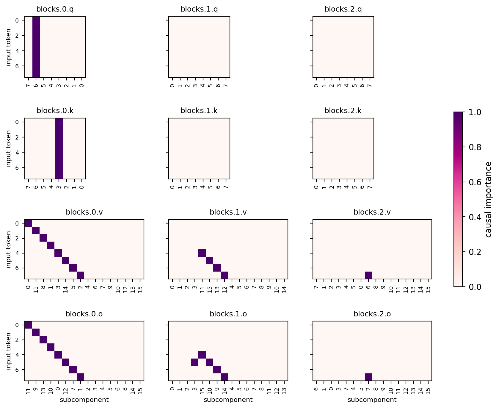

# Report — the completeness problem, on the partial attention copy testbed

Setting: the combine-layers experiments showed that when several blocks implement the
same computation, a decomposition trained with a sparsity penalty credits one block
and prunes the backups. On the 8B model we can only infer this indirectly. The
testbed below makes the failure exactly measurable — and, in its partial form, packs
*both* a negative and a positive control into one model: half the inputs have
certified redundant mechanisms (which decompositions skip), the other half have
emergent in-context computation (which decompositions find).

Code: `param_decomp_lab/toy_models/toy_model_redundancy_copy.py` (toy) and
`param_decomp_lab/experiments/toy_model_redundancy/` (PD experiment, `plot_ci.py`
diagnostic, `ToyRedundancyCIPlot` eval filmstrip). Runs under
`~/out/runs/toy_model_redundancy/`.

## The model

An attention-only transformer on the **copy task**, with **partial block dropout**:

- **Inputs**: sequences `[x, Q]` — a token `x` at position 0 and a dedicated query
  token `Q` at position 1. Fixed random unit-norm embedding `W_E [vocab+1, d_embed]`,
  tied unembedding over the vocab.
- **Blocks**: 3 pre-RMSNorm single-head causal attention blocks
  (`resid + W_O·attn(W_Q, W_K, W_V, norm(resid))`, no biases, no MLPs), final RMSNorm.
- **Task**: CE at the last position with target `x` — copy `e_x` from position 0 into
  the last position.
- **Partial redundancy**: for tokens `x < vocab/2`, each training sequence keeps a
  block subset uniform over the `2^3 − 1` non-empty ones (so every block alone must
  copy those tokens); the other tokens always see the full network, leaving the model
  free to place their mechanism anywhere.

Sizes trained (`copy_training_<size>_partial`): **v8d32** (vocab 8, d_embed 32 — the
case study; everything fits in one readable figure), **v16d32**, **v12d64**. Training
is ~2 min each; `verify` certifies the redundant half (every block alone > 0.9 per
token) and *measures* the free half (`per_token_accuracy.npz`: block-alone and
drop-one-block accuracy per token).

## Block-ablation statistics (v8d32)

8192 sequences, accuracy at the last position; tokens 0–3 redundant:

| blocks enabled | CE | accuracy |
|---|---|---|
| none | 2.77 | 0.13 (~chance) |
| block 0 alone | 0.20 | 0.877 (7/8 — misses t7) |
| block 1 alone | 1.55 | 0.626 (5/8 — only t4 of the free half) |
| block 2 alone | 0.35 | 0.881 (7/8 — misses t4) |
| blocks 1+2 (drop 0) | 1.28 | **0.626 (5/8 — t5–7 fail)** |
| blocks 0+2 (drop 1) | 0.099 | 1.000 |
| blocks 0+1 (drop 2) | 0.002 | 1.000 |
| all | 2.4e-4 | 1.000 |

Per-token block-alone map (columns = tokens; 0–3 redundant):

| | t0–t3 | t4 | t5 | t6 | t7 |
|---|---|---|---|---|---|
| block 0 alone | 1 1 1 1 | 1 | 1 | 1 | 0 |
| block 1 alone | 1 1 1 1 | 1 | 0 | 0 | 0 |
| block 2 alone | 1 1 1 1 | 0 | 1 | 1 | 1 |

The redundant half is certified (all three blocks at 1.0 on tokens 0–3). The free
half's structure is emergent, and shows two phenomena:

1. **Incidental redundancy.** Nothing forced the free tokens to be copyable by
   single blocks, yet blocks 0 and 2 each handle 3 of 4 alone — the copy OV
   generalizes beyond the redundant training set.
2. **Interference asymmetry.** Dropping block 0 breaks tokens 5–7 *even though block
   2 alone handles exactly those tokens*. Block 1's output, delivered without block
   0's context, actively corrupts what block 2 provides — removing block 1 as well
   (block 2 alone) restores them. In-context marginal importance and standalone
   sufficiency dissociate in both directions: ablation maps are not mechanism maps.

Ground truth for scoring: **19 (block, token) mechanisms** (cells with block-alone
accuracy > 0.9): 12 redundant + 7 free.

## Decomposition recipe

**PPGD + annealed, normalized SmoothL0**:

| | value | why it matters |
|---|---|---|
| `SmoothL0ImportanceMinimalityLoss` | coeff **1e-4**, **beta 0.5**, **normalize_at_one** | coeff = per-active-subcomponent cost (exactly, thanks to the normalization); beta's entropy term taxes subcomponents active across many inputs (anti-reuse) |
| γ anneal | 1 → 0.01, linear over the **last 25%** of training | quadratic phase lets competition resolve before the bistable small-γ regime locks the pattern |
| `PersistentPGDReconLoss` | coeff 0.5, adam sources lr 0.01, per-batch-per-position | adversarial masks punish fragmentation and duplication that stochastic sampling tolerates |
| recon losses | StochasticReconLayerwise 1.0 + StochasticRecon 1.0, KL | |
| C | 8 (q, k); 16 (v, o) at vocab 8/12, 24 at vocab 16 | routing needs ~1 subcomponent; v/o need one per token |
| CI fn | layerwise MLP, hidden [16], leaky-hard | |
| steps × batch | 10 000 × 512, lr 2e-3 constant | |

`normalize_at_one` rescales `φ` by `1 + γ²` so a fully-active subcomponent always
contributes exactly `coeff`: it removes the implicit ~2× coefficient ramp across the
γ anneal (equivalently: doubles the early quadratic-phase pressure while leaving the
final threshold unchanged). On this testbed it is what removes the last block-0
duplicates — the unnormalized 1e-4 run had 3 of them, and unnormalized 2e-4 still 1.

## Joint decomposition (v8d32)

`copy_v8d32_partial_joint_norm` (recon KL 1.1e-5), 10/19 skipped —
**every skip a redundant copy**:



- **Block 0: canonical-perfect** — a single q and k routing subcomponent active on
  all tokens, and exact one-subcomponent-per-token diagonals in v and o over all 8
  tokens.
- **Block 1**: v/o subcomponents on all four free tokens — matching its in-context
  interference role (not its alone-map, which only credits it with t4).
- **Block 2**: keeps t7.
- The 10 skips are precisely the redundant copies (blocks 1–2 on tokens 0–3, plus
  cells made redundant by block 0's coverage).

The free half is found, cleanly; the redundant half's copies are invisible. Same
conclusion as every earlier testbed generation, now with the positive control inside
the same run.

## Block-by-block decomposition (v8d32)

Same recipe, one block at a time with partners intact — a clean law: each block
keeps exactly its free-half/in-context mechanisms and loses every redundant copy:

| per-block run | truth cells | kept | skipped |
|---|---|---|---|
| block 0 | 7 | t4, t5, t6 (+ q routing) | 4 — its copies of t0–3 |
| block 1 | 5 | t4 | 4 — t0–3 |
| block 2 | 7 | t5, t6, t7 | 4 — t0–3 |

*Metric note*: block-level coverage in the skip diagnostic counts only
token-selective matrices (v/o); q/k routing subcomponents are active on every token
and would otherwise mask v/o skips (this correction changed only the per-block
block-0 count, 0 → 4).

## Larger sizes (layerwise CI fn)

Same recipe on the bigger variants:

| toy | b0 v / o per-input (dupes) | skipped / truth |
|---|---|---|
| v8d32 | 1.00 / 1.00 (0) — perfect | 10 / 19 |
| v12d64 | 2.25 (12) / 1.00 (0) | 13 / 28 |
| v16d32 | 3.44 (16) / 1.62 (7) | 18 / 31 |

Block 0's v-matrix fragments as vocab grows at fixed recipe (candidate causes: C
headroom drops from 2× to 1.5× vocab at v16; more tokens share d_embed = 32). In
v16, blocks 1–2 each also keep a private q/k routing pair dedicated to one token
(t10) — the "defector token" pattern with its routing visible. Free-half hosting is
found at every size (v12: block 2's incidental full coverage; v16: blocks 1–2 host
the free half). A global-shared-MLP CI fn is under test as the fix for the
v-fragmentation.

## Reproduce

```bash
python -m param_decomp_lab.toy_models.toy_model_redundancy_copy train \
  --out-dir=$OUT/runs/toy_model_redundancy/copy_training_v8d32_partial \
  --vocab-size=8 --d-embed=32 --redundant-tokens=4
python -m param_decomp_lab.experiments.toy_model_redundancy.run <config.yaml> \
  --run_id=toy_model_redundancy/<details>
python -m param_decomp_lab.experiments.toy_model_redundancy.plot_ci $OUT/runs/toy_model_redundancy/<run_id>
```
