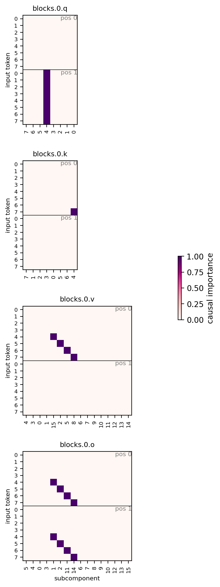
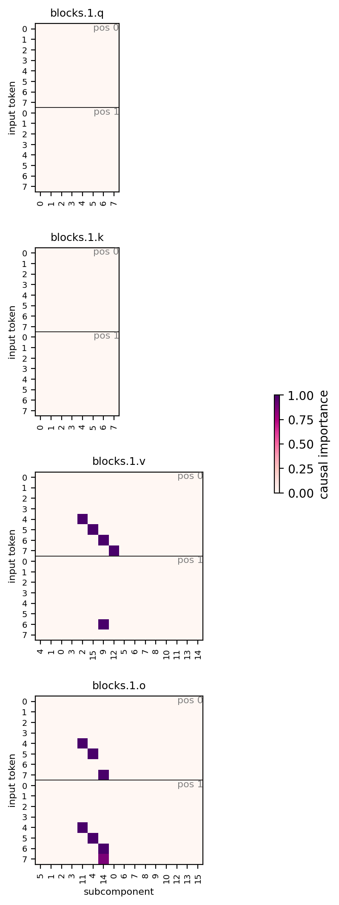
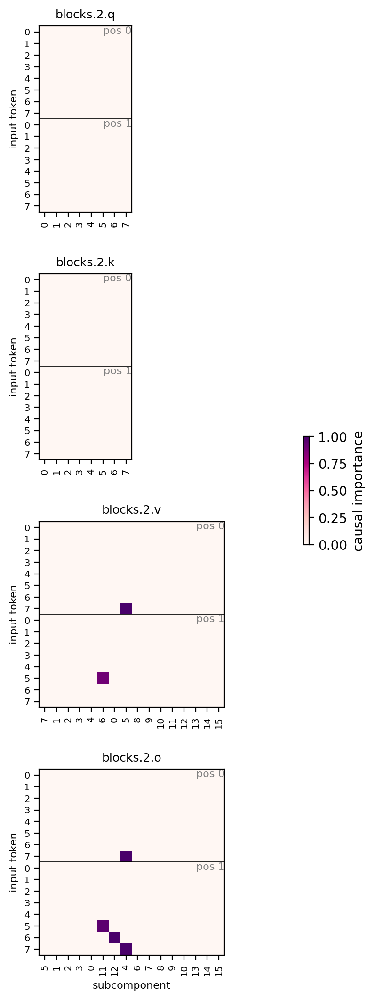
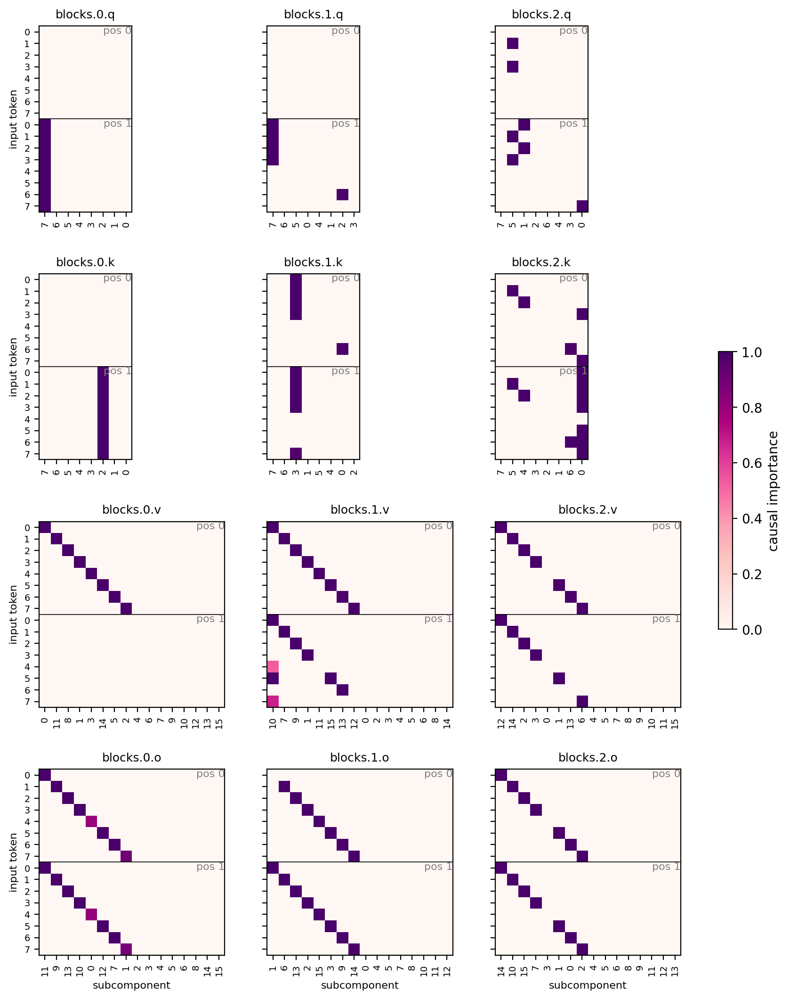

# Report — the completeness problem, on the partial attention copy testbed

Setting: the combine-layers experiments showed that when several blocks implement the
same computation, a decomposition trained with a sparsity penalty credits one block
and prunes the backups. On the 8B model we can only infer this indirectly. The
testbed below makes the failure exactly measurable — and, in its partial form, packs
*both* a negative and a positive control into one model: half the inputs have
certified redundant mechanisms (which decompositions skip), the other half have
emergent in-context computation (which decompositions find).

Code: `param_decomp_lab/toy_models/toy_model_redundancy_copy.py` (toy) and
`param_decomp_lab/experiments/toy_model_redundancy/` (PD experiment, `plot_ci.py`
diagnostic, `ToyRedundancyCIPlot` eval filmstrip). Runs under
`~/out/runs/toy_model_redundancy/`.

## The model

An attention-only transformer on the **copy task**, with **partial block dropout**:

- **Inputs**: sequences `[x, Q]` — a token `x` at position 0 and a dedicated query
  token `Q` at position 1. Fixed random unit-norm embedding `W_E [vocab+1, d_embed]`,
  tied unembedding over the vocab.
- **Blocks**: 3 pre-RMSNorm single-head causal attention blocks
  (`resid + W_O·attn(W_Q, W_K, W_V, norm(resid))`, no biases, no MLPs), final RMSNorm.
- **Task**: CE at the last position with target `x` — copy `e_x` from position 0 into
  the last position.
- **Partial redundancy**: for tokens `x < vocab/2`, each training sequence keeps a
  block subset uniform over the `2^3 − 1` non-empty ones (so every block alone must
  copy those tokens); the other tokens always see the full network, leaving the model
  free to place their mechanism anywhere.

Sizes trained (`copy_training_<size>_partial`): **v8d32** (vocab 8, d_embed 32 — the
case study; everything fits in one readable figure), **v16d32**, **v12d64**. Training
is ~2 min each; `verify` certifies the redundant half (every block alone > 0.9 per
token) and *measures* the free half (`per_token_accuracy.npz`: block-alone and
drop-one-block accuracy per token).

## Block-ablation statistics (v8d32)

**Redundancy certificate** — restricted to the dropout-trained inputs (tokens 0–3),
which are the only ones expected to survive ablation. Every non-empty block subset
scores **exactly 1.0000**; the empty model is at chance (0.00). The same holds for
the larger sizes (v12d64: all subsets 1.0000, empty 0.17; v16d32: all subsets
1.0000, empty 0.13).

Full subset table (8192 sequences per half; the free half is measured, not
certified — those inputs were never ablation-trained, so their ablation behavior is
emergent):

| blocks enabled | redundant half (t0–3) | free half (t4–7), for reference |
|---|---|---|
| none | 0.000 | 0.256 (~chance) |
| block 0 alone | 1.000 | 0.750 (misses t7) |
| block 1 alone | 1.000 | 0.251 (only t4) |
| block 2 alone | 1.000 | 0.749 (misses t4) |
| blocks 1+2 (drop 0) | 1.000 | **0.251 (t5–7 fail)** |
| blocks 0+2 (drop 1) | 1.000 | 1.000 |
| blocks 0+1 (drop 2) | 1.000 | 1.000 |
| all | 1.000 | 1.000 |

Per-token block-alone map (columns = tokens; 0–3 redundant):

| | t0–t3 | t4 | t5 | t6 | t7 |
|---|---|---|---|---|---|
| block 0 alone | 1 1 1 1 | 1 | 1 | 1 | 0 |
| block 1 alone | 1 1 1 1 | 1 | 0 | 0 | 0 |
| block 2 alone | 1 1 1 1 | 0 | 1 | 1 | 1 |

The redundant half is certified (all three blocks at 1.0 on tokens 0–3). The free
half's structure is emergent, and shows two phenomena:

1. **Incidental redundancy.** Nothing forced the free tokens to be copyable by
   single blocks, yet blocks 0 and 2 each handle 3 of 4 alone — the copy OV
   generalizes beyond the redundant training set.
2. **Interference asymmetry.** Dropping block 0 breaks tokens 5–7 *even though block
   2 alone handles exactly those tokens*. Block 1's output, delivered without block
   0's context, actively corrupts what block 2 provides — removing block 1 as well
   (block 2 alone) restores them. In-context marginal importance and standalone
   sufficiency dissociate in both directions: ablation maps are not mechanism maps.

Ground truth for scoring: **19 (block, token) mechanisms** (cells with block-alone
accuracy > 0.9): 12 redundant + 7 free.

### Block-ablation statistics, larger sizes

Same format (redundant half = certificate; free half measured, for reference):

**v12d64** (redundant t0–5, free t6–11):

| blocks enabled | redundant half | free half |
|---|---|---|
| none | 0.170 | 0.000 |
| block 0 alone | 1.000 | 0.497 (t6,7,11) |
| block 1 alone | 1.000 | 0.167 (t7) |
| block 2 alone | 1.000 | **1.000 — fully sufficient alone** |
| blocks 1+2 (drop 0) | 1.000 | **0.162 (t6–10 fail)** |
| blocks 0+2 (drop 1) | 1.000 | 1.000 |
| blocks 0+1 (drop 2) | 1.000 | 1.000 |
| all | 1.000 | 1.000 |

The v8 interference pattern, starker: block 2 alone does the whole free half, yet
removing block 0 breaks tokens 6–10 — block 1's uncompensated output corrupts what
block 2 provides.

**v16d32** (redundant t0–7, free t8–15):

| blocks enabled | redundant half | free half |
|---|---|---|
| none | 0.126 | 0.000 |
| block 0 alone | 1.000 | 0.129 (t12) |
| block 1 alone | 1.000 | 0.000 |
| block 2 alone | 1.000 | 0.749 (6 of 8) |
| blocks 1+2 (drop 0) | 1.000 | 0.000 |
| blocks 0+2 (drop 1) | 1.000 | **0.494 (t8,10,14,15 fail)** |
| blocks 0+1 (drop 2) | 1.000 | 0.877 (t10 fails) |
| all | 1.000 | 1.000 |

Here the free half is genuinely cooperative: no single block and no pair reaches
1.0 — only the full model. Block 1 is the extreme case: alone it contributes
*nothing* on the free half, yet dropping it costs half the free tokens — a pure
in-context contributor, invisible to the singleton map. The cross-size trend: as
vocab grows relative to capacity, the free half shifts from incidental single-block
redundancy (v12) toward distributed cooperation with interference (v16), and the
"block-alone > 0.9" ground truth increasingly *undercounts* what is causally
relevant in context.

## Decomposition recipe

**PPGD + annealed, normalized SmoothL0**:

| | value | why it matters |
|---|---|---|
| `SmoothL0ImportanceMinimalityLoss` | coeff **1e-4**, **beta 0.5**, **normalize_at_one** | coeff = per-active-subcomponent cost (exactly, thanks to the normalization); beta's entropy term taxes subcomponents active across many inputs (anti-reuse) |
| γ anneal | 1 → 0.01, linear over the **last 25%** of training | quadratic phase lets competition resolve before the bistable small-γ regime locks the pattern |
| `PersistentPGDReconLoss` | coeff 0.5, adam sources lr 0.01, per-batch-per-position | adversarial masks punish fragmentation and duplication that stochastic sampling tolerates |
| recon losses | StochasticReconLayerwise 1.0 + StochasticRecon 1.0, KL | |
| C | 8 (q, k); 16 (v, o) at vocab 8/12, 24 at vocab 16 | routing needs ~1 subcomponent; v/o need one per token |
| CI fn | layerwise MLP, hidden [16], leaky-hard | |
| steps × batch | 10 000 × 512, lr 2e-3 constant | |

`normalize_at_one` rescales `φ` by `1 + γ²` so a fully-active subcomponent always
contributes exactly `coeff`: it removes the implicit ~2× coefficient ramp across the
γ anneal (equivalently: doubles the early quadratic-phase pressure while leaving the
final threshold unchanged). On this testbed it is what removes the last block-0
duplicates — the unnormalized 1e-4 run had 3 of them, and unnormalized 2e-4 still 1.

## Joint decomposition (v8d32)

`copy_v8d32_partial_joint_norm` (recon KL 1.1e-5), 10/19 skipped —
**every skip a redundant copy**:


- **Block 0: canonical-perfect** — a single q and k routing subcomponent active on
  all tokens, and exact one-subcomponent-per-token diagonals in v and o over all 8
  tokens.
- **Block 1**: v/o subcomponents on all four free tokens — matching its in-context
  interference role (not its alone-map, which only credits it with t4).
- **Block 2**: keeps t7.
- The 10 skips are precisely the redundant copies (blocks 1–2 on tokens 0–3, plus
  cells made redundant by block 0's coverage).

The free half is found, cleanly; the redundant half's copies are invisible. Same
conclusion as every earlier testbed generation, now with the positive control inside
the same run.

## Block-by-block decomposition (v8d32)

Same recipe, one block at a time with partners intact — a clean law: each block
keeps exactly its free-half/in-context mechanisms and loses every redundant copy:

| per-block run | truth cells | kept | skipped |
|---|---|---|---|
| block 0 | 7 | t4, t5, t6 (+ q routing) | 4 — its copies of t0–3 |
| block 1 | 5 | t4 | 4 — t0–3 |
| block 2 | 7 | t5, t6, t7 | 4 — t0–3 |

| block 0 | block 1 | block 2 |
|---|---|---|
|  |  |  |

The maps make the over-minimality visible: every certified copy of tokens 0–3 is
gone in every block — including block 0's, which the joint decomposition credits —
because the intact partner blocks always compensate. What survives is exactly the
in-context activity (block 1's v cells on t4–7 are its interference role, larger
than its alone-map), so a per-block decomposition reads as "this block does almost
nothing" precisely where the model is most redundant.

*Metric note*: block-level coverage in the skip diagnostic counts only
token-selective matrices (v/o); q/k routing subcomponents are active on every token
and would otherwise mask v/o skips (this correction changed only the per-block
block-0 count, 0 → 4).

## Completeness training: the two-CI resurrection protocol

First protocol to reach **0/19 skipped with a structured map** (v8d32,
`copy_v8d32_complete_06-imp2e-4`; two sibling settings replicated it and were
pruned from disk). Starting from the finished joint decomposition,
duplicate the CI net into a *normal* and a *complete* copy (the duplicate shares
the live components — its input features are `V^T x` and must track `V` as B
reallocates weight), then fine-tune (components + both CI nets) with two per-step
configurations on one random block `b`, summed into one update:

- **A** — block `b` masked by the **normal** CI, other blocks left as the original
  matrices. The per-block regime: intact partners make every copy in `b`
  unnecessary, so the normal net converges to the in-context/**marginal map**,
  pruning all copies including the credited ones.
- **B** — block `b` masked by the **complete** CI, other blocks masked by their
  normal CI (detached: B trains the complete net and the components, not the
  backdrop). Once A has stripped the copies from the normal net, nothing else
  supplies the redundant computation and reconstruction forces the complete net to
  activate block `b`'s own copy.

Same recipe losses per configuration (stochastic + layerwise + PPGD, independent
PPGD sources per configuration; SmoothL0 on the selected block's masking net
only), fresh γ anneal over the last 25%, 10k steps. The all-normal joint masking
is never trained — normal deliberately stops being a sufficient joint
decomposition and becomes a marginal-importance map.
Code: `param_decomp_lab/experiments/toy_model_redundancy/complete.py` (writes
sibling `normal/` + `complete/` run dirs scoreable by `plot_ci`, plus a
per-500-step CI filmstrip for both nets).

| CI net | converges to | skipped / truth |
|---|---|---|
| normal | marginal map (routing mostly pruned too) | 13 / 19 |
| complete | **per-block standalone map** | **0 / 19** |

Robust across the anneal target and the IM coeff — γ final {0.1, 0.01} × coeff
{1e-4, 2e-4} all reached 0/19 with clean b0 diagonals (1.00/input, 0 dupes) and
an identical normal map (13/19). Only the cleanest variant is kept on disk:
**run 06** (γ final 0.01, coeff 2e-4, complete alive 59), shown:



The complete map is not merely "everything on": every block carries exact
one-subcomponent-per-token v/o diagonals — blocks 1–2 regrow **dedicated backup
diagonals for the redundant tokens 0–3** — and block 2, matching the ground-truth
alone-map exactly, **omits t4**, the one free token block 2 alone cannot copy.
Only b1.v carries extras (3 duplicated tokens). Per-block
q/k-routing subcomponents reappear in blocks 1–2 (needed standalone, invisible
marginally). Contrast with the transformer-CI zero-skip run, which bought
coverage by being dense everywhere. The normal net is uniform across variants
(13/19 skipped, 18–19 alive: b0 t0+t4–6, b1 t4–7, b2 t7, no routing — one of
several degenerate marginal solutions).

Final losses at step 10 000 (run 06, raw metric values before coefficients; the
minimality loss covers only the step's selected block):

| configuration | SmoothL0 impmin | PPGD recon (KL) |
|---|---|---|
| A (normal / minimal) | 1.00 | 0.00024 |
| B (complete) | 14.7 | 0.012 |

The impmin gap is the point of the protocol: the complete net pays ~15× the
active-CI mass of the marginal net — the resurrected copies — and holds it
because configuration B's reconstruction leaves no alternative. Remaining
caveat: the B-configuration PPGD adversary retains ~0.012 KL in all variants
(≈ 50× the A residual; the all-complete joint configuration is never explicitly
trained), so the complete masks are not yet adversarially tight.

### Protocol variants: ab initio, subset selection, transformer CI

Two axes beyond the baseline (run 06): **ab initio** (fresh components + CI nets
+ faithfulness warmup — `model_path` supplies only the config) instead of
fine-tuning a finished decomposition, and **subset selection** (per step draw
`k` uniform in `[1, n−1]`, then a uniform `k`-subset; configuration B masks all
selected blocks with the complete net simultaneously, so resurrected components
must reconstruct jointly). All at γ → 0.01, impmin 2e-4:

| run | init | selection | CI fn | complete skipped | normal skipped | complete alive | B-PPGD |
|---|---|---|---|---|---|---|---|
| 06 | fine-tune | single | MLP | **0 / 19** | 13 / 19 | 59 | 0.012 |
| 07 | fine-tune | subset | MLP | 2 / 19 | 7 / 19 | 43 | 0.0018 |
| 08 | ab initio | single | MLP | **0 / 19** | 11 / 19 | 57 | 0.0072 |
| 09 | ab initio | subset | MLP | 2 / 19 | 9 / 19 | 43 | 0.0019 |
| 10 | ab initio | subset | transformer, final-norm | 4 / 19 | 8 / 19 | 42 | 0.0040 |
| 11 | ab initio | subset | transformer, no final-norm | 2 / 19 | 7 / 19 | 52 | 0.0016 |

Findings:

- **Ab initio works** (run 08: 0/19, 57 alive, clean maps): the protocol does not
  need a converged joint decomposition to start from — the marginal and
  standalone maps co-emerge from random init.
- **Subset selection is a trade**: it tightens the B-side adversarial
  reconstruction ~7× (PPGD 0.012 → ~0.0017 — the joint-reconstruction pressure
  it was designed to add) but consistently loses ~2 backup cells (07: b1t0+b2t0;
  09: b1t0+b2t5; 11: b1t0+b2t0). The mechanism is visible in the normal maps:
  subset-configuration A is leakier (e.g. run 07's normal net keeps block 0's
  t0–t2 copies — 7/19 skipped vs 13/19 single-block), and wherever the normal
  backdrop still covers a token, B's forcing vanishes and minimality prunes that
  token's backups.
- **Transformer CI, ab initio**: the no-final-norm variant matches the MLP
  (2 skips) with the tightest B-PPGD of all (0.0016); final-norm — the
  recommended setting for *joint* transformer-CI decompositions — underperforms
  here (4 skips, including free-half cells b2t5/b2t6).

*Correction note*: an earlier version of this section reported denser complete
maps (~69 alive, "structural duplication") from runs 01–03. Those numbers were an
artifact: `complete.py` originally deep-copied the CI wrapper *including* its
(non-state-dict) components reference, so the complete net trained on a frozen
`V` snapshot while the checkpoints re-paired its MLP with the trained `V` — a
combination that never existed. Runs 04–06 share the live components and are the
canonical results.

## Larger sizes and CI-function architecture

With the recipe fixed, two things were varied: toy size and what computes the CIs —
the layerwise MLP (hidden [16], one per matrix), a global shared MLP (hidden
[256, 256], one network for all matrices), and a small global shared transformer
(d_model 64, 2 blocks, 4 heads, RoPE) at beta 0.5 and 1.0. Columns: mechanisms
skipped / ground truth, block-0 v and o mean active subcomponents per input (inputs
with > 1), and eval stochastic-recon KL.

**v8d32** (truth 19):

| CI fn | skipped | b0 v | b0 o | recon |
|---|---|---|---|---|
| layerwise MLP | 10 | 1.00 (0) | 1.00 (0) | 1.1e-5 |
| global MLP | 7 | 1.62 (4) | 1.12 (1) | 3.5e-5 |
| global transformer β 0.5 | 4 | 1.62 (4) | 1.12 (1) | 1.7e-5 |
| global transformer β 1.0 | **0** | 3.12 (8) | 2.00 (3) | 6.5e-5 |

**v12d64** (truth 28):

| CI fn | skipped | b0 v | b0 o | recon |
|---|---|---|---|---|
| layerwise MLP | 13 | 2.25 (12) | 1.00 (0) | 2.1e-5 |
| global MLP | 9 | 1.67 (4) | 1.25 (2) | 2.8e-5 |
| global transformer β 0.5 | 10 | 2.58 (9) | 1.83 (5) | 2.1e-5 |
| global transformer β 1.0 | 7 | 2.08 (7) | 2.08 (7) | 4.0e-5 |

**v16d32** (truth 31):

| CI fn | skipped | b0 v | b0 o | recon |
|---|---|---|---|---|
| layerwise MLP | 18 | 3.44 (16) | 1.62 (7) | 4.5e-5 |
| global MLP | 9 | 2.19 (11) | 1.69 (6) | 2.1e-4 |
| global transformer β 0.5 | 3 | 8.56 (16) | 5.56 (16) | 7.0e-4 |
| global transformer β 1.0 | 2 | 5.50 (16) | 5.94 (15) | 1.1e-3 |

Takeaways:

- **CI expressivity recovers backups** — skips fall monotonically with CI capacity
  at every size (v8: 10 → 7 → 4 → 0) — **but never cleanly**: every recovered copy
  is paid for in duplication or reconstruction. Same law as the impmin-coeff sweep,
  now along the architecture axis instead of the pressure axis.
- **v8 transformer β 1.0 is the first zero-skip decomposition** at tolerable recon
  (6.5e-5): all 12 redundant copies have CI > 0.1. An existence proof that a
  context-aware CI fn *keeps backups alive* instead of pruning them — though at
  ~2–3× duplication, so the copies are acknowledged, not cleanly factorized.
- **At v16 the transformer CI collapses to dense** (b0 at 5–9 of 16–24 subs per
  input, recon 30–70× the layerwise run); raising beta 0.5 → 1.0 trims skips
  (3 → 2) without restoring sparsity — the entropy term is not the binding knob
  there.
- The global shared MLP is the balanced middle: strictly better than layerwise at
  v12/v16 (fewer skips *and* fewer dupes), without the transformer's dense collapse.
- Layerwise fragmentation with size persists (b0.v: v8 1.00 → v12 2.25 → v16 3.44;
  candidate causes: C headroom drops from 2× to 1.5× vocab at v16; more tokens share
  d_embed = 32). In v16, blocks 1–2 each keep a private q/k routing pair dedicated
  to one token (t10) — the "defector token" pattern with its routing visible.
  Free-half hosting is found at every size and architecture (v12: block 2's
  incidental full coverage; v16: blocks 1–2 host the free half).

The frontier moves; it doesn't break. No CI architecture (or coefficient) is both
complete and clean — recovering redundant mechanisms *as mechanisms* still needs a
protocol, not a hyperparameter.

## Reproduce

```bash
python -m param_decomp_lab.toy_models.toy_model_redundancy_copy train \
  --out-dir=$OUT/runs/toy_model_redundancy/copy_training_v8d32_partial \
  --vocab-size=8 --d-embed=32 --redundant-tokens=4
python -m param_decomp_lab.experiments.toy_model_redundancy.run <config.yaml> \
  --run_id=toy_model_redundancy/<details>
python -m param_decomp_lab.experiments.toy_model_redundancy.plot_ci $OUT/runs/toy_model_redundancy/<run_id>
```
