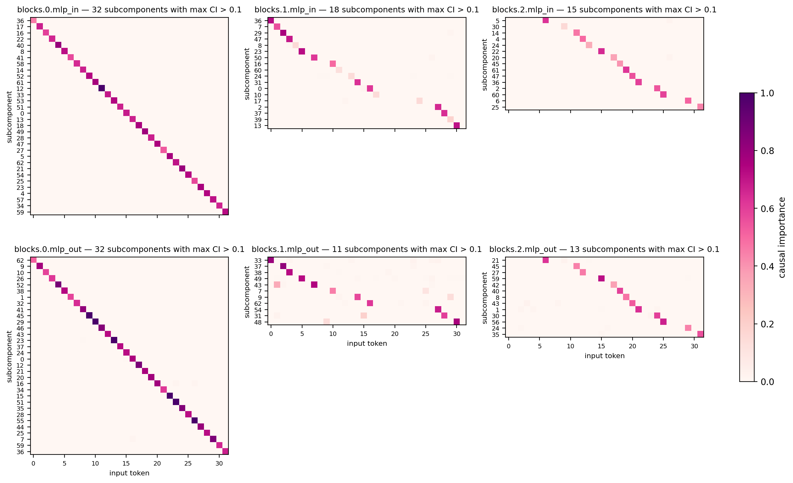
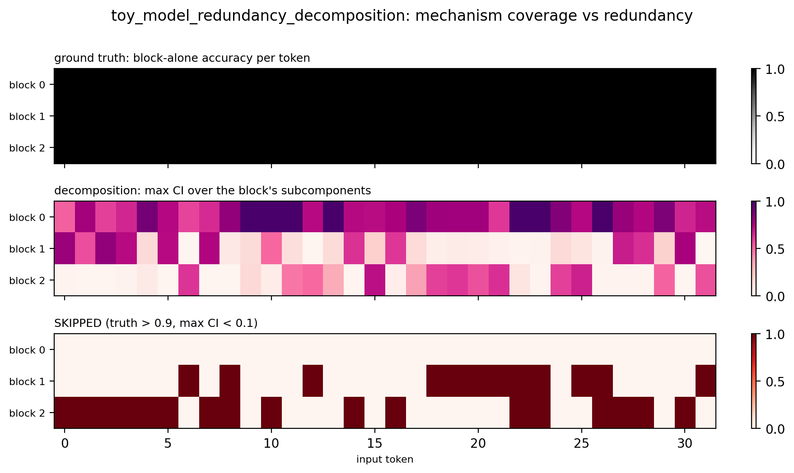

# Report — redundancy toy testbed (cipher transformer)

Setting: the combine-layers experiments showed that when several blocks implement the
same computation, a decomposition trained with a sparsity penalty credits one block
and prunes the backups (the ε < τ branch of the threshold account in
`notes/combine_layers/report.md`). On the 8B model we can only infer this indirectly.
This testbed makes the failure exactly measurable: a toy transformer with *known,
trained-in* n-fold redundancy, so any decomposition can be scored by how many
ground-truth mechanisms it skips.

Code: `param_decomp_lab/toy_models/toy_model_redundancy.py` (toy) and
`param_decomp_lab/experiments/toy_model_redundancy/` (PD experiment + `plot_ci.py` diagnostic).
Runs: `~/out/runs/toy_model_redundancy/training` (toy),
`~/out/runs/toy_model_redundancy/impmin_1e-5` (baseline decomposition).

## The toy model

An MLP-only pre-norm decoder, as transformer-like as the task allows:

- **Inputs** are token-ID sequences (equivalently one-hot); a *fixed* random
  unit-norm embedding `W_E [32, 64]` maps them into the residual stream.
- **Blocks**: 3 residual MLP blocks `resid + mlp_out(relu(mlp_in(RMSNorm(resid))))`,
  `d_mlp = 48`, no biases. Blocks (plus norm gains) are the only trained parameters.
- **Output**: final RMSNorm, then the *tied* unembedding `W_E` produces logits — a
  distribution over tokens per position, per-position cross-entropy.
- No attention and no positional embedding: the task is per-position, so positions
  are just batched samples through shared weights.

**Task**: predict `pi(x_t)` at every position, where `pi` is a fixed random
*derangement* of the vocab (a permutation with no fixed points), sampled once from
the seed. With embed/unembed frozen, each block must rotate `e_x` toward
`e_pi(x)` in the residual stream — one mechanism per input token, 32 per block,
**96 ground-truth mechanisms** total.

**Why redundancy emerges**: every training sequence keeps a random block subset,
drawn uniformly from all `2^3 − 1 = 7` non-empty subsets. Each singleton subset
appears in training, so *every block alone must implement the full cipher*; each
block also tolerates any combination of live partners, because it reads the
RMSNorm'd residual and can see what upstream already contributed. This is the same
mechanism we hypothesize in the 8B model — later layers carry backup copies of
computations earlier layers already do — but here it is exact and certified.

**Why a derangement**: the empty subset (all blocks off) leaves `resid = e_x`, whose
nearest unembedding row is `x` itself; since `pi(x) ≠ x` everywhere, the empty model
scores *exactly* 0 accuracy. The certificate is binary — no partial credit.

Training: 5000 steps, batch 512, Adam lr 1e-3, ~2 min on CPU.

## Ground-truth certificate

`verify` evaluates every block subset (8192 sequences; keep-mask bit string is
`block2 block1 block0`):

| blocks enabled | CE | accuracy |
|---|---|---|
| none (`000`) | 12.6 | **0.0000** |
| block 0 only (`001`) | 2.5e-4 | 1.0000 |
| block 1 only (`010`) | 2.9e-4 | 1.0000 |
| block 2 only (`100`) | 3.4e-4 | 1.0000 |
| blocks 0+1 (`011`) | 2.3e-4 | 1.0000 |
| blocks 0+2 (`101`) | 2.3e-4 | 1.0000 |
| blocks 1+2 (`110`) | 2.6e-4 | 1.0000 |
| all (`111`) | 2.5e-4 | 1.0000 |

Any single block implements the cipher perfectly; any partial combination works
equally well; removing everything fails completely. The per-token map
(`per_token_accuracy.npz`, `[n_blocks, vocab]` accuracy of each block alone per
input token) is all-ones: **every one of the 96 (block, token) mechanisms exists**,
with per-token accuracy 1.0 — the ground truth the decomposition is scored against.

## Baseline decomposition

Standard joint decomposition of all 6 matrices (`blocks.*.mlp_in`, `blocks.*.mlp_out`),
KL reconstruction against the toy's output distribution, uniform random token
sequences as data. Config: `param_decomp_lab/experiments/toy_model_redundancy/toy_model_redundancy_config.yaml`.

Hyperparameters that matter for this experiment:

| | value | why it matters |
|---|---|---|
| importance minimality coeff λ | **1e-5** | sets the prune threshold: a mechanism is kept only if masking it costs more than ~λ/w in recon |
| impmin pnorm | **2.0, constant** (no anneal, beta 0) | p = 2 gives an *interior* CI optimum `u* ≈ w·ΔKL/2λ` — CIs are graded, and a backup whose marginal ΔKL is small settles below the alive threshold |
| mask-seeing recon losses (w) | StochasticReconLayerwise 1.0 + StochasticRecon 1.0 | the "weight" side of the threshold; both see sampled masks |
| C per matrix | 64 | 2× the 32 mechanisms per matrix — capacity is not the binding constraint |
| CI fn | layerwise MLP, hidden [16] | per-matrix CI, no cross-block sharing |
| sigmoid / sampling | leaky_hard / 1 mask sample | |
| delta component | on | |
| steps × batch | 10 000 × 512, lr 2e-3 constant | |
| faithfulness warmup | 200 steps | |
| alive threshold | max CI over tokens > 0.1 | defines "skipped" in the diagnostic |

The key point: because each mechanism is redundant, masking a block-1 or block-2
subcomponent while its partners are unmasked costs almost nothing in KL — the
residual-stream backup covers for it. Its equilibrium CI therefore sits near the
λ-driven floor, below 0.1, and the sparsity penalty prunes it even though the
*mechanism provably exists* in the weights.

### Results

Final eval: stochastic recon KL ≈ 5e-6 (layerwise and global) — reconstruction is
essentially perfect; the failures below are purely about *attribution*, not fit.

Per-matrix active subcomponents (max CI > 0.1 on any token):

| | mlp_in | mlp_out | skipped (block, token) mechanisms |
|---|---|---|---|
| block 0 | 32 | 32 | 0 / 32 |
| block 1 | 18 | 11 | 12 / 32 |
| block 2 | 15 | 13 | 17 / 32 |
| **total** | | | **29 / 96** |



Block 0 gets a clean one-subcomponent-per-token decomposition in both matrices.
Blocks 1 and 2 keep only partial sets — the decomposition credits the first block
that computes each token and prunes the backups, exactly the combine-layers
pathology. Note the asymmetry within a block (e.g. block 1: 18 mlp_in vs 11 mlp_out
active): a backup can stay half-alive through one matrix while its other half is
pruned.



The SKIPPED panel (ground-truth accuracy > 0.9 but max CI < 0.1 across the block's
subcomponents) is the recovery-method score: a method that recovers redundant
mechanisms should clear these cells. Baseline: 29 skipped, all in blocks 1–2.

Reproduce:

```bash
python -m param_decomp_lab.experiments.toy_model_redundancy.run <config.yaml> --run_id=toy_model_redundancy/<details>
python -m param_decomp_lab.experiments.toy_model_redundancy.plot_ci ~/out/runs/<run_id>
```

## Experiment: lowering the impmin coeff

If pruning is threshold-driven, lowering λ should recover mechanisms whose
partner-masked marginal ΔKL sits between the old and new thresholds. Sweep at
λ ∈ {3e-6, 1e-6, 3e-7} (baseline 1e-5), everything else identical; runs
`toy_model_redundancy/impmin_{3e-6,1e-6,3e-7}`, ~20 min each on CPU.

Results (active counts as mlp_in+mlp_out per block; ideal is 32+32 everywhere):

| impmin coeff λ | skipped / 96 | b0 active | b1 active | b2 active | recon KL |
|---|---|---|---|---|---|
| 1e-5 (baseline) | 29 | 32+32 | 18+11 | 15+13 | 5.1e-6 |
| 3e-6 | 14 | 41+40 | 25+20 | 22+18 | 2.5e-6 |
| 1e-6 | **0** | 53+59 | 34+34 | 30+27 | 1.5e-6 |
| 3e-7 | **0** | 57+64 | 49+38 | 45+29 | 8.0e-7 |

Lowering λ monotonically recovers the skipped mechanisms — full coverage from
λ = 1e-6 — confirming the pruning is threshold-driven. But coverage is bought with
fragmentation, and the *cleanliness inverts across blocks*:

- **λ = 3e-6** ([figure](report_figures/active_subcomponents_impmin3e-6.png)):
  still near-diagonal everywhere, but 14 backups remain skipped and block 0
  already over-allocates (41+40).
- **λ = 1e-6** ([figure](report_figures/active_subcomponents_impmin1e-6.png)):
  blocks 1–2 now have clean, near-complete diagonals (27–34 active), while
  block 0 shatters — 53+59 active with heavy off-diagonal mixing, i.e. mechanisms
  split and duplicated across subcomponents. The baseline's picture (block 0
  clean, backups pruned) is exactly inverted.
- **λ = 3e-7** adds further duplication everywhere (up to 64/64 in b0 mlp_out)
  with no coverage gain.

So on this testbed there is no λ that is simultaneously complete and clean:
by the time the threshold is low enough to keep the backups, it is too low to
force one-subcomponent-per-token in the redundant regime. Sparsity alone cannot
do both jobs — which is the motivation for completeness-style protocols
(train sparse, then recover/repair) rather than a single global penalty.

## Experiment: SmoothL0 penalty

Same as the λ = 1e-5 baseline but with `SmoothL0ImportanceMinimalityLoss`
(Geman–McClure `φ(c) = c²/(c²+γ²)`, coeff 1e-5, beta 0) instead of the L_p penalty.
Two variants: constant γ = 1, and γ linearly annealed 1 → 0.01 over the run. Runs
`toy_model_redundancy/smoothl0_{gamma1,gamma_anneal}` (no wandb — nested run ids
contain `/`, which wandb rejects).

| penalty | skipped / 96 | b0 active | b1 active | b2 active | recon KL |
|---|---|---|---|---|---|
| L2, λ = 1e-5 (baseline) | 29 | 32+32 | 18+11 | 15+13 | 5.1e-6 |
| SmoothL0 γ = 1 constant | 34 | 34+35 | 15+11 | 14+12 | 3.2e-6 |
| SmoothL0 γ 1 → 0.01 | 37 | 36+39 | 14+11 | 12+9 | 2.3e-6 |

Both are *worse* than the L2 baseline on completeness, and the anneal makes it
worse still. This is consistent with the penalty's shape: for c ≪ γ = 1,
φ ≈ c²/γ² — the same quadratic pressure the baseline applies to
low-marginal-ΔKL backups, so they die the same way — while for CIs near 1 the
penalty *saturates* (φ' at c = 1 is 4× weaker than L2's), so fully-on components
are cheaper to keep and block 0 drifts into mild over-allocation (34–39 active)
with some off-diagonal mixing. Annealing γ down to 0.01 turns φ into a near-hard
L0: everything above γ pays the same full price, so the pressure to drop
low-utility (redundant) components *increases* as γ shrinks — 37 skipped, the
worst of all runs, at the best recon (2.3e-6). Recon and completeness anti-correlate
across every run so far: freed capacity goes to fitting, not coverage.

Takeaway: the skip pathology is not an artifact of the L_p gradient cliff or of
the particular penalty shape — any penalty that prices CI mass prunes mechanisms
whose marginal contribution is masked by redundancy. Recovery has to come from the
training *protocol*, not the sparsity functional.

## Experiment: per-block decomposition

Decompose one block at a time (`blocks.b.mlp_in` + `blocks.b.mlp_out`, C = 64),
leaving the other two blocks intact, with the `smoothl0_gamma_anneal`
hyperparameters unchanged. Runs `toy_model_redundancy/perblock_b{0,1,2}`; each is
scored against its own block's 32 ground-truth mechanisms.

**Prediction going in: near-empty decompositions** — with both partners intact and
permanently on, masking any of block b's subcomponents should cost ≈ 0, so the
threshold account says everything gets pruned. Whole-block ablation KLs on the
intact toy back this up: KL(full ‖ drop block b) = 9.6e-6 / 3.0e-5 / 1.7e-5 for
b = 0/1/2 — removing an *entire block* costs about as much as the joint runs'
total recon error.

**Result: the opposite.**

| run | skipped / 32 | active (in+out) | recon KL |
|---|---|---|---|
| perblock_b0 | **0** | 54+50 | 4.2e-7 |
| perblock_b1 | **1** | 21+23 | 1.1e-6 |
| perblock_b2 | 11 | 11+17 | 2.7e-6 |

Per-block decomposition is far more complete than any joint run with the same
penalty (the joint SmoothL0-anneal run skipped 18/32 in block 1 alone; per-block
skips 1). The b1 map
([figure](report_figures/active_subcomponents_perblock_b1.png)) is a clean binary
near-diagonal — CIs saturate at ~1, and a few subcomponents each cover 2–3 tokens,
so coverage is complete at slightly coarser granularity (21+23 active for 31/32
tokens). b0 over-allocates (54+50); b2 is the exception, still skipping 11.

Two things worth noting:

1. **The static threshold account fails here.** The empty solution *is* cheaper in
   loss terms (masking everything costs ≤ 3e-5 recon), yet training never finds it.
   The annealed SmoothL0 is effectively bistable — strong push to 0 below γ,
   negligible gradient above — so CIs that are high while γ is still large lock in
   once γ shrinks. In the joint runs, in-model competition (another block's
   subcomponent already reconstructing the token) sinks backup CIs during the
   quadratic phase, before lock-in; in a per-block run there is no competitor, the
   CI fn has no cheaper alternative to route through, and the mechanisms survive.
   Which block skips is not ordered by the block-ablation KL (block 1 is the most
   expensive to remove yet skipped 18/32 in the joint run) — optimization dynamics,
   not just thresholds, decide what lives.
2. **This is the toy-scale replica of the combine-layers situation.** The 8B
   sources (`addsub-L16..19`) are per-block decompositions, and they, too, keep
   per-block mechanisms alive that joint/merged training then prunes as redundant.
   The testbed reproduces the whole arc: per-block → complete; joint or merged →
   over-sparse; recovery needed at the merge.
