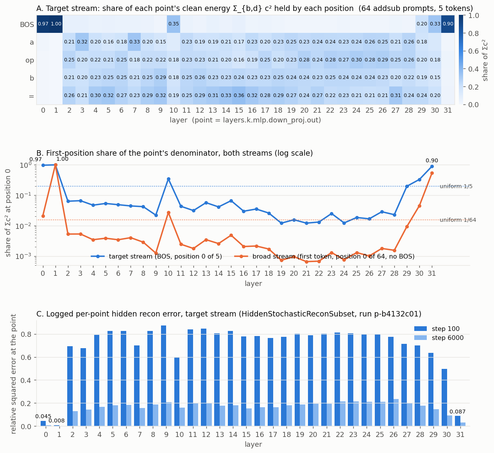

# addsub-all-layers: why the hidden-activation pass degrades at 32 blocks

2026-09-11. Run analysed: `p-b4132c01` (`addsub-all-layers-4xh100-01-lr0.5x-C2x`, the
4xH100 profile with C doubled and both LRs halved), steps 100–7500, against the 4-block runs
`addsub-4L18-21-neuronaligned`, `addsub-4L0-3-neuronaligned` and the single-block SOTA
`addsub-L18-23-neuronaligned`. Metrics come from each run's `metrics.jsonl`; the energy
measurement in §2 was made on the frozen HF Llama-3.1-8B on CPU
(`~/pd_scratch/dual_obj_jax/attn_alive/hidden_point_energy_{collect,plot}.py`).

**Summary.** Three things scale badly from 4 to 32 blocks, and all three hit the hidden pass
only:

1. `relative_squared_error` divides by the point's energy summed over ALL positions. The MLP
   outputs at layers 0, 1 and 31 are 97 %, 100 % and 90 % BOS-token energy on the addsub
   prompts, so those points measure the BOS position and nothing else. They read ≈0 from
   step 100 and exert no pressure on the arithmetic tokens. In the 4-block runs the decomposed
   blocks' own points (18–21) were clean (BOS share 1–3 %); at 32 blocks the dead points ARE
   the own points of blocks 0, 1, 31 (and half-dead for 29, 30), which is where the output
   head keeps the most components.
2. The hidden loss is a MEAN over points (14 → 32), so every point's pressure fell 2.3x while
   imp-min and frequency are per component and unchanged, and the output KL is not diluted at
   all. Block k also feeds only points k..31, so deep blocks get a fraction of that.
3. With all 224 sites stochastically routed, every point past layer 2 starts at relative
   error 0.7–0.87 (PPGD 1–4) versus 0.18 for the first point at 4 blocks: a block's own
   contribution to its own point is buried under upstream noise, part of which (the delta
   masks) no CI can reduce.

The observable consequence: KL under the hidden-CI mask is 1.8–3 nats against 0.07 for the
output-CI mask (in every 4-block run the hidden mask was at least as good as the output
mask), the hidden head's readout gradients are half the output head's (ratio ≈1 at 4 blocks),
and the nontarget hidden head had switched OFF layers 17–31 by step 1000 (L0 1–20 against
100–340 for the output head).

---

## 1. How each loss is normalized today

Notation: B rows, T positions, N = B·T tokens in the pass's batch, C total components, P
hidden points, ci[b,t,c] the per-token CI, m/c the masked/clean activations. All formulas are
from `core/SPEC.md` §4 and `core/losses.py`.

| term | definition | gradient on one token's CI, ∂L/∂ci[b,t,c] |
|---|---|---|
| output recon (stoch / unmasked / PPGD) | `kl_per_position` = (1/N) Σ_{b,t} KL_t | (1/N) · ∂KL_{b,t}/∂ci |
| hidden recon (both hidden passes, and the S35 rider) | (1/P) Σ_p  Σ_{b,t,d}(m−c)² / Σ_{b,t,d}c² | (1/P) Σ_{p} 2⟨m−c, ∂m/∂ci⟩_{b,t} / (N · ē_p), with ē_p the MEAN per-token clean energy at p |
| imp-min ("activity") | coeff · Σ_c f_c,  f_c = (1/N) Σ_{b,t} ψ(ci),  ψ = (1+γ²)·ci²/(ci²+γ²) | coeff · ψ'(ci) / N |
| frequency | coeff_f · Σ_c Φ(f_c),  Φ(f) = f·log2(1 + a'·f),  a' = N (`auto`) | coeff_f · Φ'(f_c) · ψ'(ci) / N,  Φ'(k/N) = log2(1+k) + k/((1+k)·ln2) for a component firing on k tokens |
| faithfulness | mean_s ‖W−VU‖²/‖W‖² | weight space only |

Three facts follow.

**Every per-token gradient carries the same 1/N.** Recon (KL and hidden alike), imp-min and
frequency are all means over the N tokens of the pass, so the recon-vs-sparsity balance at a
token does not depend on B, on T, or on which stream the pass runs on. Your understanding is
right: the target stream (T = 5) and the nontarget stream (T = 64) see the same per-token
exchange rate, for output recon and for hidden recon. The one exception is the frequency
term's slope Φ', which depends on the firing COUNT k, not on N (that is what `auto` buys,
SPEC T6): a component firing on one token pays the same whatever N is, while an always-on
component (k = N) pays log2(N): 10.8 at the 4-block target batch (N = 640), 11.8 at the
32-block one (N = 1280), 14.4 on the broad stream (N = 8192). A ±20 % effect, and intentional.

**Imp-min and frequency are per component; the recon terms are not.** Σ_c grows 16x
(7808 → 124 928 components in the C2x arm) but the gradient on any one component's CI is
unchanged. On the recon side the gradient on a component's CI is that component's marginal
effect on the output or on the point, also a property of the component alone. So in
expectation the exchange rate is C-invariant too. What changes with C and with the number of
masked blocks is the VARIANCE: the residual m−c that multiplies each component's Jacobian is
the sum of every other masked component's noise plus the CI-independent delta-mask noise, so
the per-component gradient's signal-to-noise falls with the amount of masked material
upstream. Under Adam that lowers the effective step in the signal direction. This is
mechanism 3 and it applies to both heads; §3 explains why the hidden head suffers more.

**The hidden loss is the only term with a 1/P.** Nothing else is averaged over points, so P
is a free knob on the hidden pass's exchange rate. Going 14 → 32 points multiplied the
hidden-vs-sparsity rate by 14/32 = 0.44 on every block and left the output pass alone. The
readout-head gradient norms in the logs show it directly: hidden/output ≈ 0.5 at 32 blocks
(0.35–0.6 across sites), ≈ 0.7–1.2 at 4L18-21, ≈ 0.5–3 at L18-23.

## 2. What `relative_squared_error` actually measures

For one point, `Σ_{b,t,d}(m−c)² / Σ_{b,t,d}c²`. The denominator is one number for the whole
batch, so the loss is the sum of every token's ABSOLUTE squared error divided by the batch's
total clean energy. A token's share of the gradient is proportional to its own error's
absolute size, not to its error relative to its own activation. Where one position holds
most of the clean energy, that position IS the loss.

Panel A: on 64 addsub prompts (BOS + `a op b =`, 5 tokens), the fraction of each point's
clean energy at each position. Panel B: the position-0 share for both streams, log scale,
against the uniform share. Panel C: the logged per-point hidden recon error of the run at
steps 100 and 6000.

| layer | BOS share (target) | pos-0 share (broad, no BOS) | rel. error step 100 | step 6000 |
|---|---|---|---|---|
| 0 | 0.97 | 0.02 | 0.045 | 0.006 |
| 1 | 1.00 | 0.999 | 0.008 | 0.001 |
| 2–9 | 0.02–0.07 | ≤0.005 | 0.68–0.87 | 0.13–0.21 |
| 10 | 0.35 | 0.03 | 0.60 | 0.16 |
| 11–28 | 0.01–0.06 | ≤0.003 | 0.70–0.85 | 0.15–0.23 |
| 29 | 0.20 | 0.01 | 0.64 | 0.15 |
| 30 | 0.33 | 0.05 | 0.50 | 0.09 |
| 31 | 0.90 | 0.54 | 0.087 | 0.030 |

The two columns line up: exactly the BOS-dominated points read near zero from step 100. The
BOS activation is input-independent (same token, same position, no context), so the
components that produce it are always-on and their CI is learned in the first hundred steps;
after that the residual error at the arithmetic positions is divided by the batch's mean
per-token energy ē_p, which the BOS position inflates far above those tokens' own energy:
by ≈8x at layer 31 (BOS 2.7e5 against 4e3–1e4 per arithmetic token), ≈30x at layer 0
(146 against ≈1) and ≈5e4x at layer 1 (2.4e5 against ≈1). Relative to a per-token
normalization, the point's gradient toward the arithmetic tokens is suppressed by the same
factor. The broad stream has no
BOS token but the first token of any Llama context carries the same massive activation:
99.9 % at layer 1, 54 % at layer 31.

This is why the plot of "hidden CI per layer" has a hole at the top of the network: the
hidden head has no own-point pressure on blocks 0, 1, 31 and weak pressure on 29–30, and at
step 7500 those are the layers where the output head keeps more components than the hidden
head (layer 31: 116 against 50; layers 28–30: 33/33/65 against 33/21/27). Those components
are the magenta cells in the AB grids.

**The L18 SOTA was also affected, but harmlessly.** Its points 18..31 include the dead 31 and
the half-dead 29–30, so it effectively had ≈11 live points, but block 18's own point (BOS
share 2.6 %) and its next ten downstream points were clean. The 4L0-3 run decomposed blocks
0–3 with points 0..14 and its points 0 and 1 were dead too (0.011 and 0.001 at step 100);
blocks 2–3 carried it.

**Does this apply to the S35 rider (`hidden_acts_reconstruction` on an output term) and to
the broad-stream hidden pass?** Yes, identically. All three call the same
`relative_squared_error` and the same `jnp.mean` over points (`losses.reconstruction_loss`),
on the same masked forward. The rider differs only in adding `coeff · mean_p` on top of the
KL of the pass it rides, so its CI is shaped mostly by the output; the deflation and the 1/P
dilution are the same. The broad-stream hidden pass has the layer-1 and layer-31 problem via
the first token, and shares mechanisms 2 and 3.

## 3. Why the hidden head is hit harder than the output head

Both heads see the same masked forward, the same imp-min coefficient (5e-5 final, 4x warm
start, on all four passes) and the same shared frequency block. What differs:

- **One point versus 32.** The output KL is one measurement every block feeds, undiluted. The
  hidden loss is 32 measurements at weight 1/32, and block k feeds only the 32−k of them at
  or after it. Under the 4-block recipe every decomposed block fed ≥11 of 14 points at weight
  1/14; now block 16 feeds 16 at weight 1/32 and block 31 feeds one dead one.
- **The dead points are the own points of the top blocks** (§2). A block's own point is where
  its components' marginal effect is largest relative to the residual; downstream points see
  it through more noise.
- **Own-point signal under upstream noise.** At step 100 every live point sits at 0.7–0.87.
  Write the residual at point k as δ_k + Σ_{j<k} (propagated δ_j) + delta-mask noise. The
  gradient on block k's CI is 2⟨residual, ∂δ_k/∂ci⟩; its expectation is the own term
  2⟨δ_k, ∂δ_k/∂ci⟩, the same as with only block k decomposed, but the other terms add
  variance that grows with the number of masked blocks upstream, and the delta-mask part is
  not reducible by any CI (the mask is drawn independently of CI; only V/U absorbing the
  target behaviour shrinks it). The per-point errors falling in lockstep across all 32
  layers (0.8 → 0.4 → 0.17 at steps 100/3000/6000) is that V/U learning, not CI learning.
  Meanwhile imp-min acts on every token with a clean, deterministic gradient, so where the
  recon signal is buried, sparsity wins. The nontarget hidden head at step 1000 is the
  extreme case: layers 17–31 at L0 1–20 while the output head kept 100–340 there.
- **The hidden PPGD adversary.** With 125k dials it drives the deep points to relative error
  1–4 (worse than predicting zero) for the first thousand steps, so half the hidden pass's
  loss (coeff 1.0 against 2.0 for the stochastic term) is an adversary the head cannot yet
  answer.

The output head has the noise problem but neither of the dilutions, and its target (the
answer logit at "=") is low-dimensional, so it climbs out first. The hidden head then has a
higher hard L0 than the output head (1.9k against 1.4k at step 7500) but a lower soft count
(imp-min raw 341 against 404): many components parked at small CI, the signature of a head
whose gradient it cannot commit to.

## 4. Answers to the specific questions

**Should the hidden loss be a sum over points instead of a mean?** Yes, in the sense that
the per-point weight must stop depending on P. The L18 SOTA gave each point weight 2.0/14
(stochastic) and 1.0/14 (PPGD). The 32-point mean gives 2.0/32. To reproduce the SOTA's
per-point pressure with the current mean, multiply the hidden coefficients by 32/14: 2.0 →
4.57 and 1.0 → 2.29 (and the same on the nontarget hidden pass, 1.0 → 2.29). Cleaner is to
change the reduction to a sum with the coefficient understood as per point (0.143 / 0.071),
so adding or dropping a point never rescales the others. Note that this only equalizes the
per-POINT weight; the number of points a block feeds still varies with depth (32 for block 0,
1 for block 31) and no point weighting can make that uniform, because block 0's downstream
points are also block 1's. Equalizing per block requires a local objective (§5, item 4).

**Would summing over points × positions remove the BOS imbalance?** Depends what is summed.
A single global ratio Σ_{p,b,t}(m−c)² / Σ_{p,b,t}c² is the worst option: layers 1 and 31
hold 7.7e6 and 9.5e6 of energy against ≈1e5 for the other 30 points together, so the whole
hidden loss would become "reconstruct BOS at layers 1 and 31". Summing per-point RATIOS over
points fixes the 1/P dilution but not BOS. What removes the imbalance is normalizing per
TOKEN: r_{p,b,t} = ‖m−c‖²_{b,t} / ‖c‖²_{b,t}, then a MEAN over tokens (keep the 1/N so the
balance against imp-min stays stream- and batch-invariant) and a sum over points. A sum over
positions instead of a mean would make the per-token recon gradient O(1) against imp-min's
O(1/N), so the exchange rate would then scale with N and differ 6.4x between the two streams;
do not do that. Per-token normalization needs a floor for near-silent tokens,
`‖c‖²_{b,t} + ε·median_t‖c‖²`, or the cheaper alternative of masking position 0 out of both
sums (a `valid_position_mask` next to the existing `valid_row_mask`), which removes 90–100 %
of the problem at layers 0, 1, 31 on both streams and leaves layers 10, 29, 30 at their
current 20–35 % BOS weight.

**Is the recon pressure different between streams because nontarget sequences are longer?**
No. Every term is a mean over the pass's N tokens, so the per-token balance is the same at
T = 5 and T = 64. The differences that do exist: the frequency slope for dense components
(log2 N, +22 % on the broad stream, by design), and the first-token energy share, which is
smaller on the 64-token stream except at layers 1 and 31.

**Are the minimality losses normalized per point and per position like the recon ones?** Per
position yes (the 1/N); per point there is nothing to normalize since they do not depend on
the measurement points. The asymmetry is precisely that only the hidden recon carries a 1/P.

**Hidden versus output relative importance.** The two passes act on different heads, so their
ratio matters through what they share: the trunk and V/U. Both are means over tokens and both
fight the same imp-min coefficient; the mean over P points scaled the hidden pass's trunk and
V/U gradient by 14/32 relative to the SOTA while leaving the output pass's alone, so V/U are
now shaped 2.3x more by the output objective than in the L18 recipe. The ×32/14 (or the sum)
restores that ratio as well. There is no principled cross-unit conversion between nats and
relative energy beyond "what the SOTA had", so match the SOTA's per-point weight and leave the
output coefficients alone.

## 5. What changes with each scale knob, and how to balance

| knob | output recon | hidden recon | imp-min | frequency |
|---|---|---|---|---|
| batch B or seq len T (N = B·T) | 1/N per token | 1/N per token | 1/N per token | 1/N per token; slope +log2 N for always-on components only |
| points P | – | **1/P per point** (dilutes) | – | – |
| decomposed blocks n | value ↑ (more noise), per-component marginal effect unchanged, SNR ↓ | same, plus block k feeds only points ≥ k, plus dead own points for blocks 0/1/31 | per component, unchanged | per component, unchanged |
| components C | marginal effect unchanged, SNR ↓ | same | Σ_c grows, per component unchanged | same |

Recommended, in order of cost. Items 1 and 2 are implemented (2026-09-11): `pd.hidden.normalization:
{kind: per_position, floor_fraction: 0.01}` (S35 amended; default `batch` is the original) and the
derived config `addsub-all-layers-4xh100-bal-perpos.yaml` (items 1 and 2).

1. **Per-token normalization or position-0 masking in `relative_squared_error`** (mechanism
   1). Small change in `core/losses.py`; the eval `CIMaskedReconLoss` should follow so the
   logged numbers stay comparable. Prediction: points 0, 1, 31 come alive (errors of order
   the neighbouring points), layer 29–31 hidden L0 rises, the top-of-network magenta shrinks.
2. **Restore the SOTA per-point weight** (mechanism 2). Config-only: hidden recon coeffs
   × 32/14 on both hidden passes; or change the reduction to a sum and set the per-point
   coefficients to 2.0/14 and 1.0/14. Check the readout grad-norm ratio returns to ≈1.
3. **Localize the hidden pass's routing** (mechanism 3, cheap version). Config-only: give
   the two hidden passes `routing: {type: static_probability, p: 0.02–0.05}`. Unrouted sites
   run the frozen weights (`decomposed_linear.py:116`), so each draw perturbs a handful of
   sites and point k measures mostly its own block. Prediction: step-100 per-point errors
   drop from ≈0.8 toward the 4-block 0.2. Note this changes the objective's noise model, so
   the CI it learns is "important when few sites are perturbed", which is closer to what the
   AB grids read anyway.
4. **Teacher-forced hidden forward** (mechanism 3, real fix). Each block reads the CLEAN
   residual and writes through its masked weights; one forward, no propagation, every block
   gets exactly one point at full weight and the depth gradient disappears. This is the
   roadmap's Phase-2 "chunkwise recon" and needs plumbing in the scan target.
5. **Bisect depth** with `scaletest.sh --blocks 8 / 16` to see where the step-100 error
   crosses 0.5, which separates mechanism 3 from 1 and 2 if the cheaper changes do not
   already tell.
6. **Hidden PPGD coefficient → 0 for a short arm**, to see how much of the early hidden
   pass is the adversary.

Confounds specific to the arm analysed: C doubled (twice the total sparsity pressure against
a bounded recon loss, though per-component pressure is unchanged), LRs halved (an
SNR-limited head suffers most), and `ci_scaled_weight_decay` removed. The other sweep arms'
logs are in `~/out/pod-backup/p-b4132c01/logs/` if the signature needs confirming across
arms.
