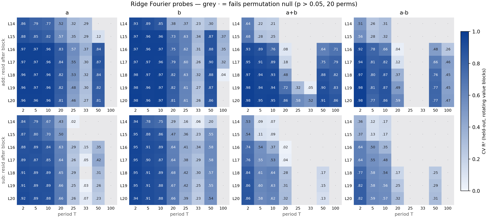

# Ridge-CV Fourier probes — which values live at which period, where in the stream

2026-07-22. Question: for `a+b=` / `a-b=` prompts, which integer variables (`a`, `b`,
`a+b`, `a-b`) have **generalizable circular representations** (`x mod T` on a plane), at
which periods, at each residual-stream position between layer 15 and layer 20 of
Llama-3.1-8B — while rejecting the planes a probe can always find through 400 linearly
separable class means.

## Protocol

Implemented in `param_decomp_lab/scripts/validation/probes/` (see its CLAUDE.md;
commits `73ec3f947` + hook fix), designed so a value-memorising probe cannot score:

1. **Selection** — closed-form ridge `cos(2πv/T), sin(2πv/T) ~ w·x + b` on raw
   **per-prompt** activations (never class means). λ chosen by CV over **5 rotating
   contiguous value blocks**: each fold holds out two contiguous deciles of the
   variable's range — the probe must extrapolate to values it never saw. `cv_r2` =
   fold-mean held-out R² at the best λ.
2. **Refit** — reported probe refit on the **full** range at the selected λ, so held-out
   regions aren't fitted worse (`block_r2` verifies homogeneity).
3. **Null gate** — identical pipeline rerun 20× with values permuted across prompts.
   Accepted = `p ≤ 0.05` **and** `cv_r2 > 0` (beating the null with negative held-out
   R² is not a probe — observed in the synthetic smoke test).

Data: block outputs of layers 14–20 (`resid_L<i>` = stream after block `i`) at the `=`
token, full `a<op>b=` grids, `a, b ∈ 1..200`, both ops. Periods probed:
2, 5, 10, 20, 25, 33, 50, 100. Jobs 5279 → 5280/5281 → 5282 (chain, 2026-07-22);
artifacts in `~/out/runs/fourier_probes/` (`ridge_cv_probes_{add,sub}.json` carry the
probe vectors; `ridge_cv_summary.tsv` the flat per-cell table).

## Findings

325/448 cells accepted. Null max ≈ 0 or negative everywhere (strongest headline cell,
add/a+b/T100@L20: cv_r2 0.86 vs null max −0.33).

- **Operands are circular from L14 and flat across depth**: a, b ≈ .96–.98 at
  T = 2/5/10, ~.8 at 20, ~.85–.90 at 50; weak at 25 (~.6) and 33 (~.35); T=100
  essentially absent (only b, L15–18, ~.37). The operand code concentrates on
  {2, 5, 10, 20, 50}.
- **The sum is built up across L16–L20** (addition prompts): at L14–15 only weak T=2;
  from L16 the 2/5/10/50/100 columns turn on; by L20: .98/.95/.95 at 2/5/10, .91 at
  50, **.86 at 100** — T=100 despite the contiguous holdout being an unseen arc there.
  T=20/25/33 for the sum only consolidate at L19–20.
- **Symmetric cross-operation phases**: `a-b` decodes on *addition* prompts (.87 at
  T=10, .77 at 50, L19) and `a+b` on *subtraction* prompts (~.6). T=2 is aliased
  (`a-b ≡ a+b mod 2`), but for T ≥ 5 a linear probe cannot compose a difference phase
  from separate a/b circles (bilinear), so the stream genuinely carries both
  combination phases.
- **Subtraction's own result code is weaker and inhomogeneous**: a−b on sub prompts
  peaks .57–.59 at T=5/10 (L19–20), ~.3 at 20/50, and its per-block R² breaks down
  (min block .26 vs .72 overall) — the extreme/negative bands fit worse.

## Reading rules / caveats

- **Trust `cv_r2`, not `full_r2`, for marginal cells**: b/T33@L15 refits at
  full_r2 .99 in every block while cv_r2 = .34 — at the CV-chosen λ the refit can
  still interpolate in-sample. For strong cells the gap vanishes (.95 vs .97).
- **T=100 on operands is the hardest test**: a contiguous held-out block removes a
  whole arc of the circle from one of the two cycles in 1..200 — judge that column
  against its own null, not against small-T columns.
- p-floor at n_perm=20 is 0.048; the gate is mostly carried by `cv_r2 > 0` plus the
  large real-vs-null margin. More perms / BH-FDR across the 448 cells would tighten it.

## Follow-ups

- Export accepted probes to the Feucht-format `probes_<site>.json` so
  `build_direction_scatter` can overlay subcomponent read/write arrows on these planes.
- Cross-context validation (train probe on add, test on sub) as a second holdout axis
  that costs no value coverage.
