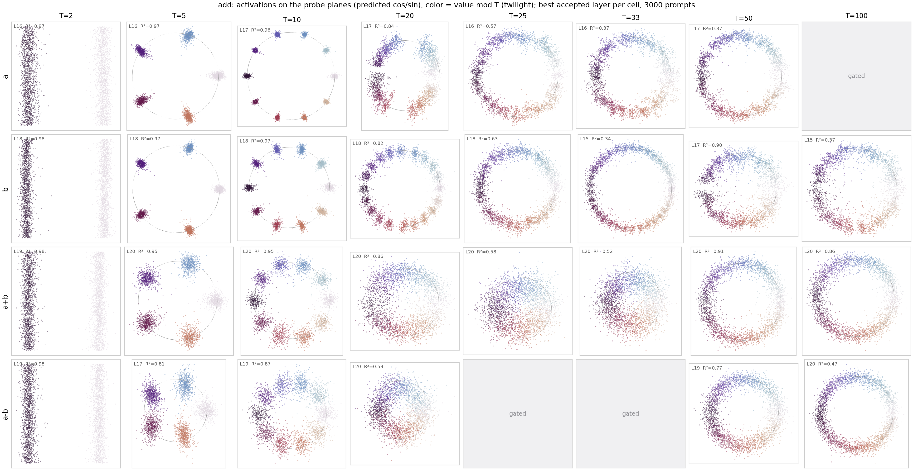
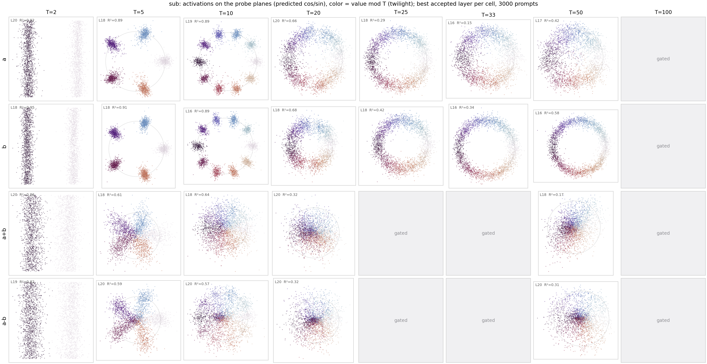
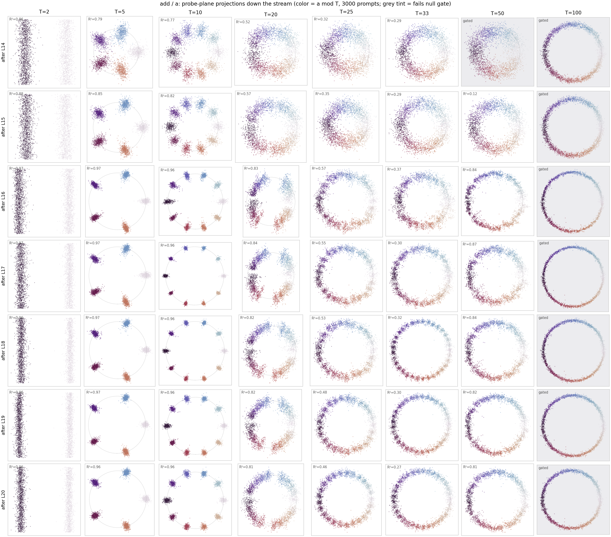
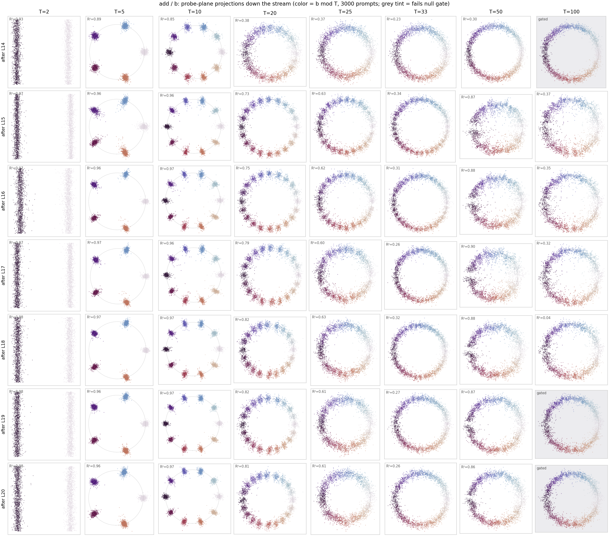
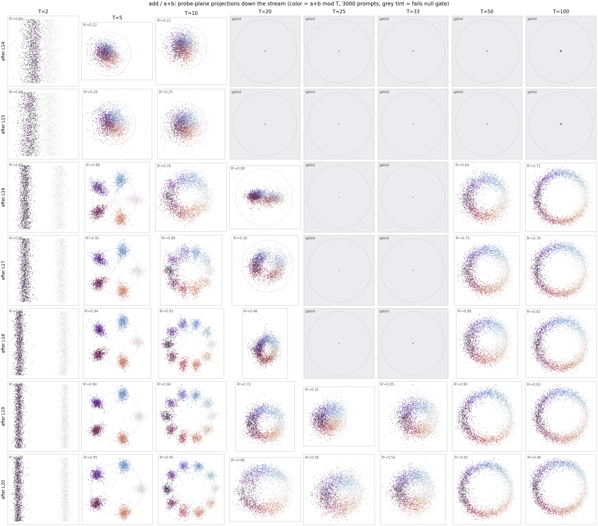
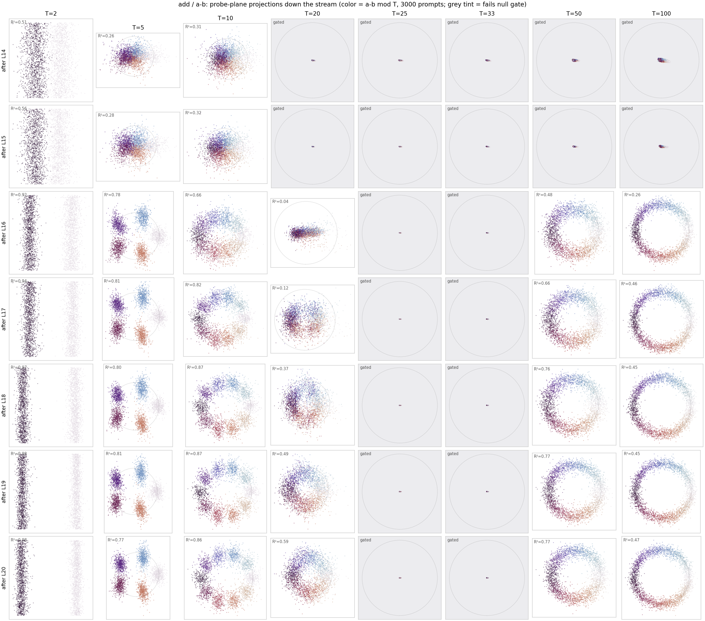
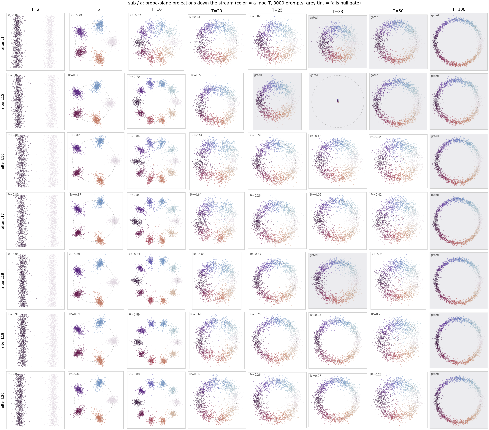
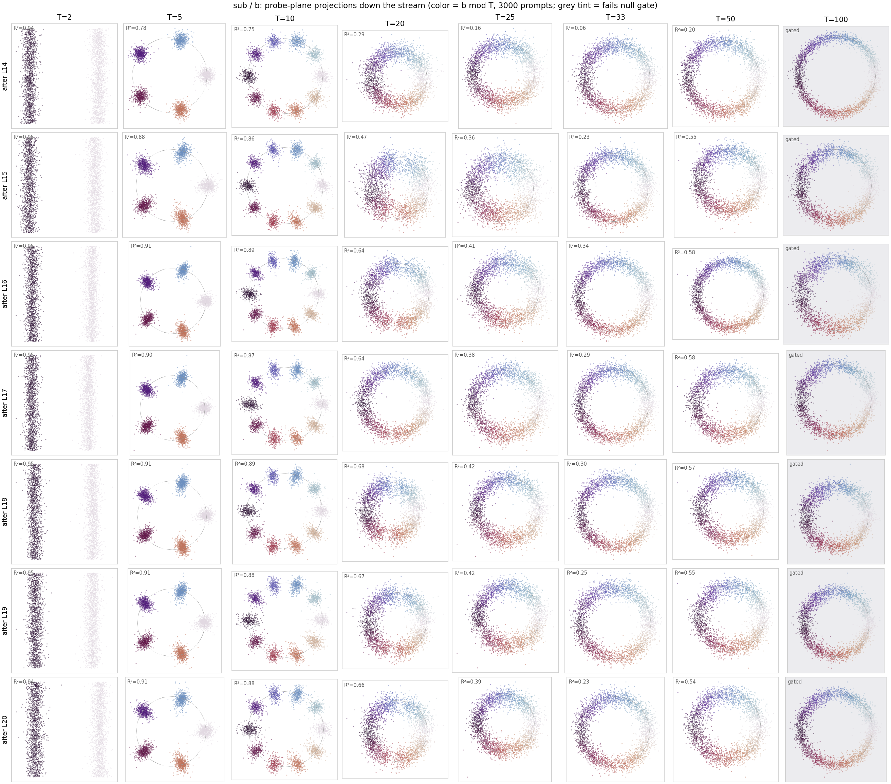
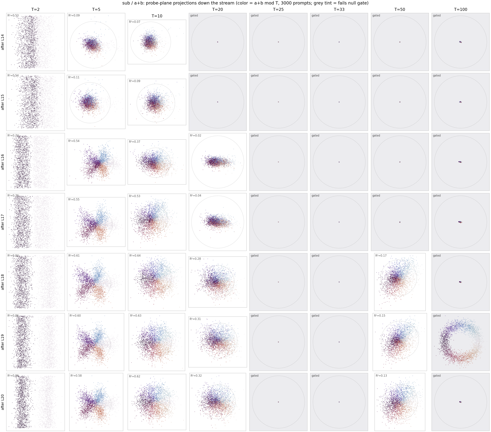
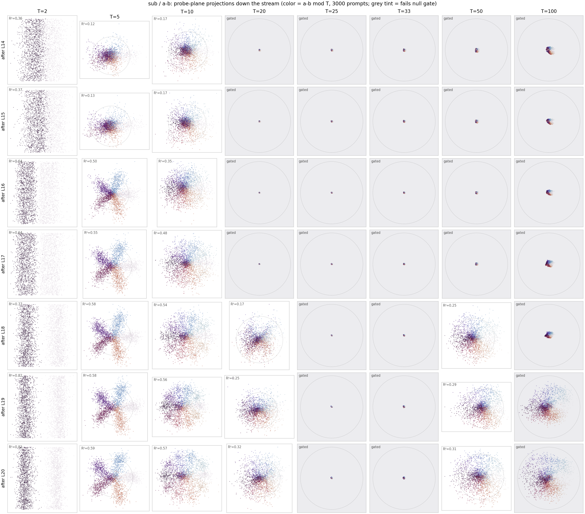

# Ridge-CV Fourier probes — which values live at which period, where in the stream

2026-07-22. Question: for `a+b=` / `a-b=` prompts, which integer variables (`a`, `b`,
`a+b`, `a-b`) have **generalizable circular representations** (`x mod T` on a plane), at
which periods, at each residual-stream position between layer 15 and layer 20 of
Llama-3.1-8B — while rejecting the planes a probe can always find through 400 linearly
separable class means.

## Protocol

Implemented in `param_decomp_lab/scripts/validation/probes/` (see its CLAUDE.md;
commits `73ec3f947` + hook fix), designed so a value-memorising probe cannot score:

1. **Selection** — closed-form ridge `cos(2πv/T), sin(2πv/T) ~ w·x + b` on raw
   **per-prompt** activations (never class means). λ chosen by CV over **5 rotating
   contiguous value blocks**: each fold holds out two contiguous deciles of the
   variable's range — the probe must extrapolate to values it never saw. `cv_r2` =
   fold-mean held-out R² at the best λ.
2. **Refit** — reported probe refit on the **full** range at the selected λ, so held-out
   regions aren't fitted worse (`block_r2` verifies homogeneity).
3. **Null gate** — identical pipeline rerun 20× with values permuted across prompts.
   Accepted = `p ≤ 0.05` **and** `cv_r2 > 0` (beating the null with negative held-out
   R² is not a probe — observed in the synthetic smoke test).

Data: block outputs of layers 14–20 (`resid_L<i>` = stream after block `i`) at the `=`
token, full `a<op>b=` grids, `a, b ∈ 1..200`, both ops. Periods probed:
2, 5, 10, 20, 25, 33, 50, 100. Jobs 5279 → 5280/5281 → 5282 (chain, 2026-07-22);
artifacts in `~/out/runs/fourier_probes/` (`ridge_cv_probes_{add,sub}.json` carry the
probe vectors; `ridge_cv_summary.tsv` the flat per-cell table).

## Findings

325/448 cells accepted. Null max ≈ 0 or negative everywhere (strongest headline cell,
add/a+b/T100@L20: cv_r2 0.86 vs null max −0.33).

- **Operands are circular from L14 and flat across depth**: a, b ≈ .96–.98 at
  T = 2/5/10, ~.8 at 20, ~.85–.90 at 50; weak at 25 (~.6) and 33 (~.35); T=100
  essentially absent (only b, L15–18, ~.37). The operand code concentrates on
  {2, 5, 10, 20, 50}.
- **The sum is built up across L16–L20** (addition prompts): at L14–15 only weak T=2;
  from L16 the 2/5/10/50/100 columns turn on; by L20: .98/.95/.95 at 2/5/10, .91 at
  50, **.86 at 100** — T=100 despite the contiguous holdout being an unseen arc there.
  T=20/25/33 for the sum only consolidate at L19–20.
- **Symmetric cross-operation phases**: `a-b` decodes on *addition* prompts (.87 at
  T=10, .77 at 50, L19) and `a+b` on *subtraction* prompts (~.6). T=2 is aliased
  (`a-b ≡ a+b mod 2`), but for T ≥ 5 a linear probe cannot compose a difference phase
  from separate a/b circles (bilinear), so the stream genuinely carries both
  combination phases.
- **Subtraction's own result code is weaker and inhomogeneous**: a−b on sub prompts
  peaks .57–.59 at T=5/10 (L19–20), ~.3 at 20/50, and its per-block R² breaks down
  (min block .26 vs .72 overall) — the extreme/negative bands fit worse.

## Full layer x period tables — when each representation appears at the `=` token

All probes read the residual stream at the final (`=`) position, so a variable's row
profile shows when its representation *arrives there* (operands, moved by attention)
or *is generated there* (results, written by the MLPs). `cv_r2` per cell, `·` = fails
the permutation-null gate (p > 0.05 or cv_r2 <= 0). Layers in stream order: `after
L14` = entering layer 15, `after L20` = leaving layer 20.

### `add` prompts

**a**

| stream pos | T=2 | T=5 | T=10 | T=20 | T=25 | T=33 | T=50 | T=100 |
|---|---|---|---|---|---|---|---|---|
| after L14 | 0.86 | 0.79 | 0.77 | 0.52 | 0.32 | 0.29 | · | · |
| after L15 | 0.88 | 0.85 | 0.82 | 0.57 | 0.35 | 0.29 | 0.12 | · |
| after L16 | 0.97 | 0.97 | 0.96 | 0.83 | 0.57 | 0.37 | 0.84 | · |
| after L17 | 0.97 | 0.97 | 0.96 | 0.84 | 0.55 | 0.30 | 0.87 | · |
| after L18 | 0.96 | 0.97 | 0.96 | 0.82 | 0.53 | 0.32 | 0.84 | · |
| after L19 | 0.96 | 0.97 | 0.96 | 0.82 | 0.48 | 0.30 | 0.82 | · |
| after L20 | 0.96 | 0.96 | 0.96 | 0.81 | 0.46 | 0.27 | 0.81 | · |

**b**

| stream pos | T=2 | T=5 | T=10 | T=20 | T=25 | T=33 | T=50 | T=100 |
|---|---|---|---|---|---|---|---|---|
| after L14 | 0.93 | 0.89 | 0.85 | 0.38 | 0.37 | 0.23 | 0.30 | · |
| after L15 | 0.97 | 0.96 | 0.96 | 0.73 | 0.63 | 0.34 | 0.87 | 0.37 |
| after L16 | 0.97 | 0.96 | 0.97 | 0.75 | 0.62 | 0.31 | 0.88 | 0.35 |
| after L17 | 0.97 | 0.97 | 0.96 | 0.79 | 0.60 | 0.26 | 0.90 | 0.32 |
| after L18 | 0.98 | 0.97 | 0.97 | 0.82 | 0.63 | 0.32 | 0.88 | 0.04 |
| after L19 | 0.98 | 0.96 | 0.97 | 0.82 | 0.61 | 0.27 | 0.87 | · |
| after L20 | 0.98 | 0.96 | 0.97 | 0.81 | 0.61 | 0.26 | 0.86 | · |

**a+b**

| stream pos | T=2 | T=5 | T=10 | T=20 | T=25 | T=33 | T=50 | T=100 |
|---|---|---|---|---|---|---|---|---|
| after L14 | 0.64 | 0.22 | 0.21 | · | · | · | · | · |
| after L15 | 0.68 | 0.28 | 0.25 | · | · | · | · | · |
| after L16 | 0.93 | 0.89 | 0.76 | 0.08 | · | · | 0.64 | 0.71 |
| after L17 | 0.95 | 0.91 | 0.89 | 0.18 | · | · | 0.75 | 0.79 |
| after L18 | 0.97 | 0.94 | 0.93 | 0.48 | · | · | 0.88 | 0.82 |
| after L19 | 0.98 | 0.94 | 0.94 | 0.72 | 0.32 | 0.05 | 0.90 | 0.83 |
| after L20 | 0.98 | 0.95 | 0.95 | 0.86 | 0.58 | 0.52 | 0.91 | 0.86 |

**a-b**

| stream pos | T=2 | T=5 | T=10 | T=20 | T=25 | T=33 | T=50 | T=100 |
|---|---|---|---|---|---|---|---|---|
| after L14 | 0.51 | 0.26 | 0.31 | · | · | · | · | · |
| after L15 | 0.56 | 0.28 | 0.32 | · | · | · | · | · |
| after L16 | 0.92 | 0.78 | 0.66 | 0.04 | · | · | 0.48 | 0.26 |
| after L17 | 0.94 | 0.81 | 0.82 | 0.12 | · | · | 0.66 | 0.46 |
| after L18 | 0.97 | 0.80 | 0.87 | 0.37 | · | · | 0.76 | 0.45 |
| after L19 | 0.98 | 0.81 | 0.87 | 0.49 | · | · | 0.77 | 0.45 |
| after L20 | 0.98 | 0.77 | 0.86 | 0.59 | · | · | 0.77 | 0.47 |

### `sub` prompts

**a**

| stream pos | T=2 | T=5 | T=10 | T=20 | T=25 | T=33 | T=50 | T=100 |
|---|---|---|---|---|---|---|---|---|
| after L14 | 0.84 | 0.79 | 0.67 | 0.43 | 0.02 | · | · | · |
| after L15 | 0.87 | 0.80 | 0.70 | 0.50 | · | · | · | · |
| after L16 | 0.88 | 0.89 | 0.84 | 0.63 | 0.29 | 0.15 | 0.35 | · |
| after L17 | 0.89 | 0.87 | 0.85 | 0.64 | 0.26 | 0.05 | 0.42 | · |
| after L18 | 0.91 | 0.89 | 0.89 | 0.65 | 0.29 | · | 0.31 | · |
| after L19 | 0.91 | 0.89 | 0.89 | 0.66 | 0.25 | 0.03 | 0.26 | · |
| after L20 | 0.92 | 0.89 | 0.88 | 0.66 | 0.26 | 0.07 | 0.23 | · |

**b**

| stream pos | T=2 | T=5 | T=10 | T=20 | T=25 | T=33 | T=50 | T=100 |
|---|---|---|---|---|---|---|---|---|
| after L14 | 0.94 | 0.78 | 0.75 | 0.29 | 0.16 | 0.06 | 0.20 | · |
| after L15 | 0.95 | 0.88 | 0.86 | 0.47 | 0.36 | 0.23 | 0.55 | · |
| after L16 | 0.95 | 0.91 | 0.89 | 0.64 | 0.41 | 0.34 | 0.58 | · |
| after L17 | 0.95 | 0.90 | 0.87 | 0.64 | 0.38 | 0.29 | 0.58 | · |
| after L18 | 0.95 | 0.91 | 0.89 | 0.68 | 0.42 | 0.30 | 0.57 | · |
| after L19 | 0.95 | 0.91 | 0.88 | 0.67 | 0.42 | 0.25 | 0.55 | · |
| after L20 | 0.94 | 0.91 | 0.88 | 0.66 | 0.39 | 0.23 | 0.54 | · |

**a+b**

| stream pos | T=2 | T=5 | T=10 | T=20 | T=25 | T=33 | T=50 | T=100 |
|---|---|---|---|---|---|---|---|---|
| after L14 | 0.53 | 0.09 | 0.07 | · | · | · | · | · |
| after L15 | 0.54 | 0.11 | 0.09 | · | · | · | · | · |
| after L16 | 0.74 | 0.54 | 0.37 | 0.02 | · | · | · | · |
| after L17 | 0.76 | 0.55 | 0.53 | 0.04 | · | · | · | · |
| after L18 | 0.84 | 0.61 | 0.64 | 0.28 | · | · | 0.17 | · |
| after L19 | 0.86 | 0.60 | 0.63 | 0.31 | · | · | 0.15 | · |
| after L20 | 0.86 | 0.58 | 0.62 | 0.32 | · | · | 0.13 | · |

**a-b**

| stream pos | T=2 | T=5 | T=10 | T=20 | T=25 | T=33 | T=50 | T=100 |
|---|---|---|---|---|---|---|---|---|
| after L14 | 0.36 | 0.12 | 0.17 | · | · | · | · | · |
| after L15 | 0.37 | 0.13 | 0.17 | · | · | · | · | · |
| after L16 | 0.64 | 0.50 | 0.35 | · | · | · | · | · |
| after L17 | 0.64 | 0.55 | 0.48 | · | · | · | · | · |
| after L18 | 0.77 | 0.58 | 0.54 | 0.17 | · | · | 0.25 | · |
| after L19 | 0.82 | 0.58 | 0.56 | 0.25 | · | · | 0.29 | · |
| after L20 | 0.82 | 0.59 | 0.57 | 0.32 | · | · | 0.31 | · |

Reading the timeline: the operand phases at T <= 20 are already at the `=` position
by L14 (earlier layers weren't probed), with a second sharpening wave at L15 (b) /
L16 (a) that also brings the operands' T=50 phase. The result representations are
generated later and period-dependently: on `add`, both a+b and a-b jump from
parity-only to 2/5/10/50/100 at **L16** and strengthen monotonically to L20, while
a+b's T=20/25/33 phases only consolidate at **L19-L20**. On `sub`, the result (a-b)
emerges more gradually - 2/5/10 from **L16**, T=20/50 only from **L18** - and never
reaches add's ceiling. The cross-operation phase (a-b on add prompts, a+b on sub
prompts) appears at the same layers as the operation's own result, consistent with
both combination phases being produced by the same L16-L20 circuitry.

## Reading rules / caveats

- **Trust `cv_r2`, not `full_r2`, for marginal cells**: b/T33@L15 refits at
  full_r2 .99 in every block while cv_r2 = .34 — at the CV-chosen λ the refit can
  still interpolate in-sample. For strong cells the gap vanishes (.95 vs .97).
- **T=100 on operands is the hardest test**: a contiguous held-out block removes a
  whole arc of the circle from one of the two cycles in 1..200 — judge that column
  against its own null, not against small-T columns.
- p-floor at n_perm=20 is 0.048; the gate is mostly carried by `cv_r2 > 0` plus the
  large real-vs-null margin. More perms / BH-FDR across the 448 cells would tighten it.

## Probe-plane projections

`plot_probe_projections` scatters 3000 prompts on each accepted probe's predicted
(cos, sin) plane — best accepted layer per cell, colored by `v mod T` (cyclic
colormap), so a genuine circular code shows as an ordered color wheel:

Small T (5, 10) forms tight discrete residue clusters on the unit circle; large T
(50, 100) forms continuous ordered rings. Marginal cells (a/T33 .37, sub results at
T=20+) are visibly fuzzy blobs with only coarse angular ordering — consistent with
their cv_r2 — and the sub-op result planes are markedly noisier than add's, matching
the homogeneity breakdown noted above.

### Layer-by-layer projections — watching arrival and generation

The same planes for **every** stream position in order (`--all-layers`): rows =
after L14 … after L20, cols = periods; grey tint = fails the null gate (those cells
still draw their refit probe's projection — a blob or a collapsed dot is the point:
nothing decodable). Operand rows show the *arrival* of the phases at the `=` token
(b sharpens after L15, a after L16); the result rows show *generation* — a+b and a−b
snap from unordered clouds to ordered color wheels after L16 (T = 5/10/50/100
simultaneously), then tighten through L20, with T=20/25/33 appearing last.

`add` prompts:

`sub` prompts:

Feucht-format export (`export_ridge_cv_planes`): `ridge_cv_planes_{add,sub}/probes_L<i>.json`
— full-range-refit weights, `r2_cos = r2_sin = cv_r2`, plus `cv_r2` / `p_value` /
`lambda_rel` / `accepted` per probe.

## Follow-ups

- Point `build_direction_scatter` at the exported planes to overlay subcomponent
  read/write arrows.
- Cross-context validation (train probe on add, test on sub) as a second holdout axis
  that costs no value coverage.
