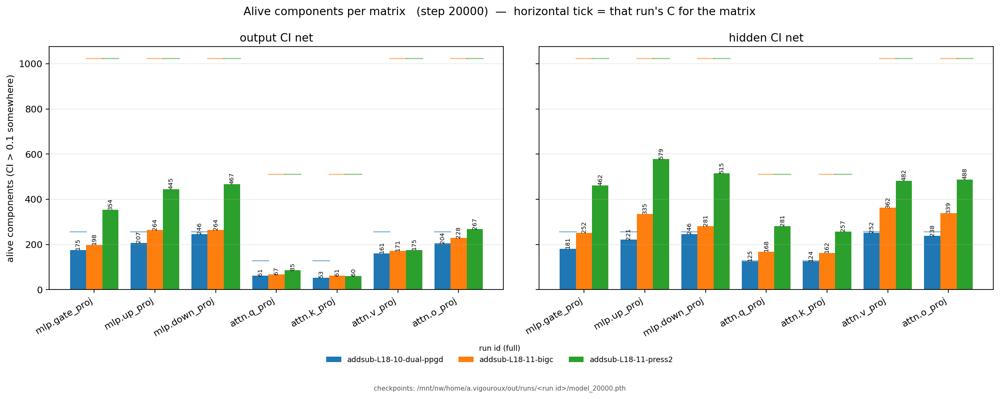
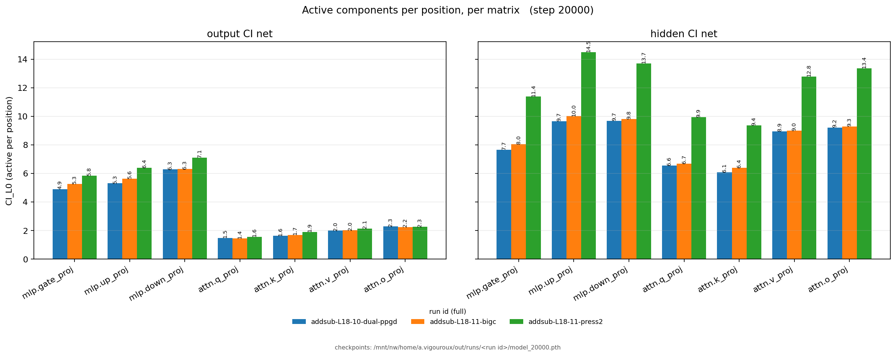

# More components, and more pressure on the hidden objective — the `-11` series

Status as of 2026-08-02: **three runs launched, no results yet.** The dual-CI scheme is
described in `report.md`; chronology in `lab_notebook.md`.

Two questions, both asked against `addsub-L18-10-dual-ppgd` as the control:

1. **Does simply making the decomposition bigger cost anything?** The reference sits at its
   alive-count ceiling — the hidden net had `q_proj` and `k_proj` at exactly 128/128 — so
   every density readout it produces is clipped. Raising C removes the clip, but a larger
   component pool could plausibly slow convergence or dilute the components. `bigc` measures
   that directly.
2. **Is the hidden objective underweighted?** Its two reconstruction coefficients are scaled
   2x and 5x, with everything on the output side held fixed.

## The runs

| run | C | hidden recon coeffs (stochastic / PPGD) |
|---|---|---|
| `addsub-L18-10-dual-ppgd` (control, already complete) | 1536 | 1.0 / 0.5 |
| `addsub-L18-11-bigc` | 6144 | 1.0 / 0.5 |
| `addsub-L18-11-press2` | 6144 | 2.0 / 1.0 |
| `addsub-L18-11-press5` | 6144 | 5.0 / 2.5 |
| `addsub-L18-11-bigc-mlp` | 6144 | 1.0 / 0.5, measured on `*.mlp.*` only |
| `addsub-L18-11-bigc-zeroinit` | 6144 | 1.0 / 0.5, `weight_init: coupled_zero_u` |

`bigc-mlp` is `bigc` with the hidden objective restricted to the three MLP matrices; it
differs from `bigc` in the label and the two `site_patterns` fields, nothing else.

It is not purely a locus change, and the interaction is the interesting part. The hidden
loss is a **mean over sites**, so restricting 7 sites to 3 raises the per-site gradient
weight by 7/3 = 2.33x. `bigc-mlp` therefore applies roughly `press2`-level pressure, but
concentrated on the MLP instead of spread across all seven matrices. The pair separates
*concentrating* pressure from *increasing* it — a confound the superseded series could not
untangle, because there the site set and the coefficient were never varied independently.

Each config is generated from the reference run's own YAML rather than from a descendant, so
the replication is exact by construction. Verified by diff:

- `bigc` vs the reference differs in **the label and the seven C values, nothing else**.
- `press2` / `press5` vs `bigc` differ in **the label and two coefficients, nothing else**.

Untouched in all three: `StochasticReconSubsetLoss` (1.0), `UnmaskedReconLoss` (0.5),
`PersistentPGDReconLoss` (0.5), both `SmoothL0ImportanceMinimalityLoss` instances (5e-5,
output and hidden), every optimizer and schedule, seed, batch sizes, the nontarget block,
and the eval metric list. So the pressure runs move the hidden reconstruction weight and
nothing else — in particular the sparsity penalty the hidden net competes against is
unchanged, which is what makes "more pressure" mean what it says.

20000 steps with `gamma_anneal_start_frac: 0.5` — annealed over the second half. That is
already the reference's schedule, so no change was needed.

Note this series carries **no `hidden_readout_sites`** and no residual-stream eval probes.
Both would have been harmless additions, but `site_patterns: null` means "every measurement
site", so declaring readout sites would silently widen the hidden objective from 7 matrices
to 9 and break the exact replication.

## `bigc` is worse under the fresh PGD probe — and why that is mostly a probe artifact

`bigc` finished first. Against the reference at step 20000:

| metric | reference | `bigc` | |
|---|---|---|---|
| `UnmaskedReconLoss` (clean) | 0.001755 | 0.001484 | -15%, `bigc` better |
| `PersistentPGDReconLoss/output_recon` (trained-against adversary) | 0.003593 | 0.003600 | identical |
| `PGDReconLoss` (fresh eval adversary) | 0.004429 | 0.004977 | +12%, `bigc` worse |
| `PGDHiddenActsReconLoss` | 0.03386 | 0.03223 | `bigc` better |
| `CI_L0` output / hidden | 23.87 / 57.79 | 24.62 / 59.25 | +3.2% / +2.5% |
| `NAlive` output / hidden | 1107 / 1387 | 1253 / 1899 | +13% / **+37%** |

Every objective the run is actually optimized against is flat or better. The whole
regression sits in the headroom between the persistent adversary and a fresh one.

`PGDReconLoss` is **not a C-invariant yardstick**, for two compounding reasons:

1. The eval mask is `ci + (1 - ci) * s` with `s` in `[0, 1]`, so the adversary can only push
   components *up* from their CI value. Its playground is exactly the near-zero-CI
   components: 1536 - 1107 = **429** of them in the reference, 6144 - 1253 = **4891** in
   `bigc`. An 11.4x larger attack surface buys a 12% worse number.
2. It is sign-PGD (`pgd_utils.py::_run_pgd_loop`) with a per-coordinate `L_inf` step and no
   budget on total injected mask mass. 20 steps at 0.1 saturates any coordinate, so the
   reachable set is the whole hypercube `[ci, 1]^C` — its dimension grows linearly with C.

A further sign this is surface rather than quality: the gap **shrinks** over training (1.28x
at step 2000, 1.12x at 20000).

### `press2` partly falsifies the attack-surface story

`press2` finished next, and it does not fit the surface account:

| | reference | `bigc` | `press2` |
|---|---|---|---|
| `PGDReconLoss` | 0.00443 | 0.00498 | 0.00540 |
| `UnmaskedReconLoss` | 0.00175 | 0.00148 | 0.00141 |
| `PersistentPGDReconLoss/output_recon` | 0.00359 | 0.00360 | 0.00359 |
| `PGDHiddenActsReconLoss` | 0.03386 | 0.03223 | 0.02290 |
| `CI_L0` output / hidden | 23.87 / 57.79 | 24.62 / 59.25 | 27.21 / 85.04 |
| `NAlive` output / hidden | 1107 / 1387 | 1253 / 1899 | 1853 / 3064 |
| near-zero-CI components (output net) | 429 | 4891 | 4291 |

`press2` has **fewer** near-zero-CI components than `bigc` (4291 vs 4891) and a **worse**
`PGDReconLoss` (0.00540 vs 0.00498). Attack surface alone therefore cannot be the whole
explanation. The likelier reading for `press2` specifically is a genuine trade-off: the two
objectives compete for one shared subcomponent pool, and buying -32% hidden reconstruction
costs output robustness under worst-case masking.

Two claims from the `bigc` analysis above have to be weakened accordingly:

- `PersistentPGDReconLoss/output_recon` is **0.00359 / 0.00360 / 0.00359** across three
  configurations that differ substantially. A quantity identical to three significant
  figures across all of them is almost certainly self-equilibrating — the minimax game
  between the persistent adversary and the model settles at a level set by its loss
  coefficient, not by decomposition quality. It is not evidence that `bigc` is unharmed; it
  is not a quality discriminator at all.
- What survives for `bigc` is the 11.4x dead-component count and the shrinking
  fresh-vs-persistent gap over training. Suggestive, no longer close to conclusive.

`bigc-zeroinit` is now the decisive test rather than a confirmatory one: it removes the
W-scale junk from unused subcomponents while changing nothing else, so it isolates that one
mechanism directly.

The one genuine cost, which should be tracked separately from PGD: **fragmentation**.
Per-position density is flat (+2.5%) while the hidden-net alive set grows 37%. Alive per
unit of `CI_L0` goes 24.0 -> 32.1: the same computation, spread over more and rarer
components.

### `bigc-zeroinit` — the direct test

`weight_init: coupled_zero_u` is `coupled` with `U` zeroed, added in `optimize.py`. The
component sum is exactly zero at init and the delta carries all of W; subcomponents acquire
norm only as the reconstruction losses demand it.

Zeroing both sides is a dead fixed point — `U`'s gradient is proportional to the component
acts `x @ V` and `V`'s is proportional to `U`, so both vanish. Zeroing `U` alone is the only
workable form, and it is also the right one: `V` is untouched, so `get_component_acts` still
feeds the CI nets a live signal, and `U` has a nonzero gradient from step 0.

This attacks the attack surface at its root. Under `coupled`, a subcomponent that is never
needed keeps W-natural norm forever — nothing decays it — so the adversary switching it on
injects real garbage. Under `coupled_zero_u` an unused subcomponent sits at exactly zero and
switching it on injects nothing. If the C-dependence of `PGDReconLoss` is the surface effect
diagnosed above, `bigc-zeroinit` should recover the reference's PGD number at 4x C.

The degenerate "components stay at zero forever" fixed point is not stable: the delta's mask
is `torch.rand` per position (`masks.py::calc_stochastic_component_mask_info`), so the delta
is partially ablated every step and the output is wrong unless the components carry the
weight.

## Per-matrix component counts

Run ids in full, so the artifacts are findable:
`addsub-L18-10-dual-ppgd` (reference, C 256/128 per matrix), `addsub-L18-11-bigc` and
`addsub-L18-11-press2` (both 4x C, 1024/512). Checkpoints at
`~/out/runs/<run id>/model_20000.pth`. Regenerate with
`~/pd_scratch/hidden_site_targets/plot_alive_active.py <run ids> --outdir=notes/hidden_dual/figures`,
which reads `metrics.jsonl` only and plots any run that has reached step 20000.

**Alive components** — distinct subcomponents whose CI clears 0.1 somewhere. The horizontal
tick on each bar is that run's own C for that matrix, so saturation is readable per bar.

**Active components** — `CI_L0`, the number active per position: the density rather than the
inventory.

Three things the pair makes obvious that the scalar totals hide:

- **The reference is pinned at its ceiling on the attention Q/K matrices.** `q_proj` and
  `k_proj` sit at 125 and 124 of C=128 under the hidden net — essentially saturated, which is
  what motivated raising C. Every other reference matrix is at 175-252 of 256. At 4x C nothing
  is near its ceiling: `press2`'s worst is `up_proj` at 579/1024.
- **Alive counts grow while density barely moves.** From reference to `bigc` the alive bars
  rise everywhere, but the `CI_L0` bars are nearly unchanged (output net: 4.9 -> 5.3 on
  `gate_proj`, 6.3 -> 6.3 on `down_proj`). That is the fragmentation result, localised: the
  same per-position computation spread over a larger inventory.
- **The pressure arm splits the two nets.** `press2` raises hidden-net density substantially
  (`up_proj` 9.7 -> 14.5, `o_proj` 9.2 -> 13.4) while its output-net density is flat against
  `bigc` (`down_proj` 6.3 -> 7.1, `q_proj` 1.4 -> 1.6). The extra hidden pressure is being
  paid for in hidden-net activity, not by disturbing the output net — which is what the
  matched output-side hyperparameters were meant to guarantee.

Attention Q/K stay the sparsest matrices under the output net in every arm (1.4-1.9 active per
position against 5.3-7.1 for the MLP), but under the hidden net they are comparable to the MLP
(6.6-9.9). The two nets genuinely disagree about what attention Q/K are for.

## What the earlier series established

The predecessor under this name (now superseded, see `site_targets_report.md`) compared
*where* the hidden objective is measured. Two of its results bear on this one:

- **C at 4x is not a compromise.** At matched step 10000 the 4x-C run beat the 1x-C
  reference on every output and hidden metric, and saturation fell from 88-100% to 28-47%.
  `bigc` is the clean 20000-step test of that, against the reference directly.
- **Per-site gradient weight is `1/n_sites`.** The hidden loss is a mean over sites, so
  changing the site set silently changes the pressure. This series changes the coefficient
  instead and holds the site set at all 7 matrices, which is the cleaner way to ask the
  pressure question.

## Read-outs

Same panel as before: absolute alive counts and `CI_L0` per locus for both CI nets with
MLP/attention subtotals, saturation against C, the anomaly census from the `ab_grids`
payloads, and output quality. The combined score is `PGDReconLoss * alive-either` — both
are costs, so they multiply; a ratio would credit a run for keeping more components.
`alive-either` is the union over both CI nets, since they score the same subcomponent pool.
