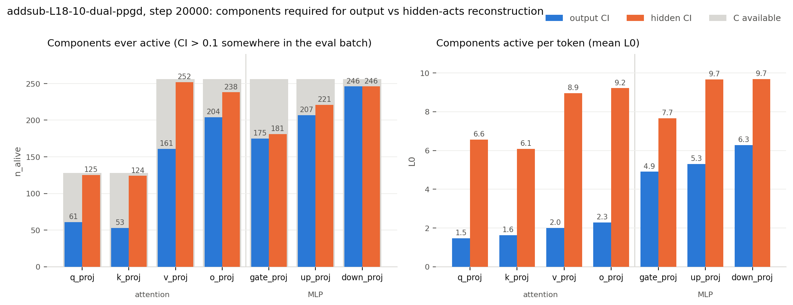

# Dual CI networks: output-importance vs hidden-activation-importance

Status as of 2026-08-01: **implemented, verified; `addsub-L18-10-dual-ppgd` complete at
20000 steps**, two -10 nobeta variants running. Spec in `plan.md`, chronology in
`lab_notebook.md`.

## What was built

Two CI networks over one shared pool of subcomponents, differing only in the reconstruction
loss that trains them: one scores importance for the model's **final output**, the other for
the **decomposed sites' activations**. Enabled by `pd.dual_hidden_ci`; metrics select a net
with `ci_role`, defaulting to `"output"` so every pre-existing config is untouched.

The falsifiable claim the setup exists to test: **output-importance should imply
hidden-importance, but not the reverse.** A component that matters for the logits must
matter for the activations that produce them; a component that only carries interference
cancelled before the output should matter for the activations alone.

## The measurement

All three hidden-acts probes report the *same* quantity — the relative per-site error
`Σ(out − tgt)² / Σ tgt²`, averaged over sites — under three different masks, so they are
directly comparable:

| probe | mask | delta |
|---|---|---|
| `StochasticHiddenReconSubsetLoss` (training loss) | stochastic subset ablation | random |
| `CIHiddenActsReconLoss` (eval) | CI itself | off |
| `PGDHiddenActsReconLoss` (eval) | 20 steps of sign-PGD, adversarial | random |

Relative rather than raw MSE because site activation scales differ by orders of magnitude
(MLP `down_proj` vs attention `q_proj`), so raw MSE would silently weight the objective by
activation variance and would not transfer across blocks. Numerator and denominator are
accumulated and DDP-reduced separately: the reported number is a ratio of sums over the whole
eval pass, never a mean of per-batch or per-rank ratios.

Targets are the frozen model's own site outputs, recomputed as `F.linear(x_clean, W, b)` from
the clean activations each step already caches. This costs **no extra forward pass** and
measures accumulated drift from the target model rather than each site's local error given an
already-perturbed input — the latter would be blind to exactly the chained-block failure the
experiment is about.

## Evidence that it works

From `addsub-L18-09-dual` at step 0 (job 6076), all four hidden-acts probes plus both nets'
density diagnostics reporting:

```
eval/loss/CIHiddenActsRecon_hiddenCI            0.952     (CI mask, no delta)
eval/loss/StochasticHiddenReconSubsetLoss       0.466     (stochastic mask, random delta)
eval/loss/PGDHiddenActsReconLoss                1.809     (20-step adversarial)
eval/n_alive/NAlive_output/total                1768      (= total C, as expected at init)
eval/n_alive/NAlive_hidden/total                1768
train/loss/SmoothL0ImpMin_output             3537.99
train/loss/SmoothL0ImpMin_hidden             3537.99      (identical at init — see below)
train/nontarget/loss/StochasticReconSubsetLoss        0.00183
train/nontarget/loss/StochasticHiddenReconSubsetLoss  0.01336
```

Four things worth noting in that table:

- **The probe ordering is right**: adversarial (1.81) > CI-masked (0.95) > stochastic (0.47).
  The adversary must find more error than any sampled mask, and the stochastic pass is lower
  because it admits the delta component at random strength while the CI-masked probe has no
  delta at all.
- **Both impmin instances log separately and are identical at step 0.** Identical is the
  correct value, not a bug: `zero_init_readout` starts both nets' readouts at logit exactly
  0.5, so the two nets emit the same CI until gradients separate them. That they appear under
  *distinct keys* is the fix for a real defect (below).
- **Both nets' `n_alive` is visible.** Without this the hidden net's density — the primary
  step-5000 diagnostic — would have been unobservable.
- **The nontarget pass carries both recon losses.** With the delta forced on, the hidden loss
  drives components toward being inactive at each *site* on the broad distribution, a more
  local version of the pressure the output recon applies.

`ab_grids/step_0.js` carries `"ci_roles": ["output", "hidden"]`, so the two-colour heatmaps
are populated from the first snapshot.

### Two latent defects found and fixed

Both were pre-existing and both would have been triggered by this scheme, silently:

1. The **nontarget loss log key** and the **nontarget eval duplicate-detection assert** were
   keyed by metric *class name*. With one importance-minimality instance per CI net, the
   second would have overwritten the first in the logs / falsely tripped the assert.
2. Every CI-density eval metric (`NAlive`, `CI_L0`, `CIMeanPerComponent`, `CIHistograms`)
   read the output net unconditionally, so on a dual run all of them would have silently
   reported output-net numbers. They now take `ci_role` and namespace their keys via
   `Metric.key_prefix`, which engages only for explicitly-named instances so single-CI runs'
   log keys are unchanged.

A code review also confirmed by direct experiment on a real `LlamaForCausalLM` that the
early-exit forward skips the tail (layers after the last decomposed site and `lm_head` never
execute), that its cached tensors match a full forward's bit-for-bit and keep their autograd
graph, and that the PGD probe's inner ascent is not broken by the eval loop's `no_grad`
(errors grow monotonically with `n_steps`: 0 → 2.70, 5 → 4.18, 20 → 4.44).

## Cost

The early-exit forward (`ComponentModel.site_outputs`) aborts once every decomposed site is
cached, so nothing past the last site is computed *or* retained for backward. It cannot skip
the *prefix*, though: for an L18-only decomposition it still runs embeddings + layers 0–17,
so it costs ≈19/32 of a forward, not a sliver. Autograd retains nothing from those frozen
layers, so the memory claim holds even where the compute framing is optimistic.

Marginal cost of the scheme per step: two CI-net forwards (~34 M params each, negligible
against 8 B), one truncated masked forward per pass, one extra CI net of optimizer state
(~0.55 GB).

## Measured memory (peak per-GPU, cards are 46068 MiB)

| config | GPUs | batch / nontarget | C (MLP) | peak | headroom |
|---|---|---|---|---|---|
| `addsub-L18-09-dual` | 2 | 128 / 128 | 456 | 45641 | **427 MiB — rejected** |
| `addsub-L18-09-dual` | 2 | 128 / 96 | 456 | 39657 | 6.4 GB ✓ |
| `L18to20` dual | 3 | 126 / 96 | 304 | 46253 | **overflowed — only fit a 48 GB card** |
| `L18to20` dual | 3 | 126 / 96 | 228 (floor) | 45383 | 685 MiB — too tight |
| `L18to20` dual | 4 | 128 / 96 | 304 | 42204 | 3.9 GB ✓ |
| `L18to20` ctrl | 4 | 128 / 96 | 304 | 37821 | 8.2 GB ✓ |

**C is a weak memory lever here.** Dropping C from 304 to the 228 floor bought under 1 GB,
because the weight-delta tensors dominate and are full-weight-shaped regardless of C
(~2.7 GB for 3 blocks). The effective levers are per-rank batch and GPU count. That is why
the 3-block runs went to 4 GPUs rather than shrinking C: 4 GPUs at C=304 beats 3 GPUs at
C=228 on *every* axis — 2.7 GB more headroom, a third more components, and clean batch
divisibility. The user pre-approved 4 GPUs for exactly this case.

Two non-memory constraints also bit and are worth recording: every batch size must divide the
DDP world size, and **`eval.batch_size` must equal `pd.batch_size`**, because
`PersistentPGDReconLoss` sizes its persistent adversarial sources from the train batch and is
auto-evaluated. Both reference configs happen to satisfy the latter, which is why it had
never surfaced.

## Runs launched

| run | blocks | GPUs | batch / nt | C | job |
|---|---|---|---|---|---|
| `addsub-L18-09-dual` | 18 | 2 | 128 / 96 | 456, (72,72,128,128) | 6076 |
| `addsub-L18to20-01-dual` | 18,19,20 | 4 | 128 / 96 | 304, (48,48,88,88) | 6077 |
| `addsub-L18to20-01-ctrl` | 18,19,20 | 4 | 128 / 96 | 304, (48,48,88,88) | 6078 (queued) |
| `addsub-L18-09-dual-ppgd` | 18 | 2 | 128 / 96 | 456, (72,72,128,128) | 6105 |

`addsub-L18-09-dual-ppgd` is `addsub-L18-09-dual` plus a persistent adversary on the
hidden-acts objective, with its own sources. It exists because the two CI nets were otherwise
under unequal masking pressure — only the output net faced a persistent adversary — which
would have confounded any comparison of their densities. The pair isolates that one variable.

20 000 steps, `slow_every: 5000`, `ABGridDataset` in the slow set. The two `L18to20` runs are
identical but for the scheme — same batch, same C, same GPU count — so the comparison is
clean; the ctrl simply uses less of its allocation. The ctrl is queued behind the 6-GPU
per-user cap and starts automatically.

## Measured step time

| run | GPUs | sites | pure train s/step | overall s/step | projected total |
|---|---|---|---|---|---|
| `addsub-L18-09-one-im` (reference, complete) | 2 | 7 | 2.99 | 3.21 | 17.8 h (actual) |
| `addsub-L18-09-dual` | 2 | 7 | 2.82 | 3.01–3.04 | **16.7–16.9 h** |
| `addsub-L18to20-01-dual` | 4 | 21 | 3.53 | 3.69–3.77 | **20.5–20.9 h** |

"Pure train" excludes steps where an eval fires; "overall" is elapsed ÷ steps, so it
includes eval cost. Both dual runs are ~1000–1250 steps in and the marginal rate over the
last 400 steps agrees with the average to within 3%, so these projections are stable.
(`tqdm`'s own ETA read 38 h for the 3-block run — that is its EMA skewed by a recent eval
spike, not a real rate; ignore it.)

**The dual scheme did not cost per-step time on the single-block run — it is 6% faster than
the reference.** That is not a clean measurement of the scheme, and it revises the plan's
+10% estimate only loosely, because two confounds both favour dual: the reference carries the
standalone `StochasticHiddenActsReconLoss` (its own clean *and* masked full forward each
step) which the dual run drops in favour of the truncated loss, and the dual run's nontarget
batch is 96 vs 128. The honest reading is that the dual scheme's cost is roughly cancelled by
dropping the older standalone hidden loss. The clean measurement is
`addsub-L18to20-01-dual` vs `-ctrl`, which differ *only* in the scheme.

Slow evals cost little: the gap between average and marginal rate implies ~80 s for the
step-0 slow eval, so the four remaining ones (5000/10000/15000/20000) add only minutes.

Wall-clock against the 24 h QOS cap: **both running dual runs should finish in a single leg**
(16.9 h and 20.9 h), correcting the earlier expectation that the 3-block runs would need a
resume. The 3-block margin is ~3 h, which is comfortable but not large; if a run does overrun,
`GraceTime=0` makes the SIGTERM save unreliable, so it would resume from its last
`save_every: 5000` checkpoint and lose up to 5000 steps.

## What to check first, at step 5000

1. **The sanity check itself** — the two-colour (a,b) heatmaps in `ab_grids/`. Expect white
   (both) and green (hidden-only) regions; **magenta means output-important but
   hidden-unimportant, which should not happen.** Any magenta is either a real finding about
   the CI networks or a bug in one of them.
2. **`NAlive_hidden/total` vs `NAlive_output/total`.** The hidden net should be denser. If it
   saturates at total C, the shared SmoothL0 coeff (5e-5) is too low for it — a result, not a
   bug, but it changes what the run can tell us.
3. **`CIHiddenActsRecon_outputCI` vs `_hiddenCI`.** The gap is the quantitative version of the
   whole hypothesis: how much hidden-activation error does the output net's CI assignment
   leave on the table? The ctrl run's single value is the baseline.
4. **Dual vs ctrl on the 3-block runs**, on both output KL and hidden-acts error. The premise
   is that hidden-acts reconstruction helps most when chaining blocks; this pair is the test.

Note that `CIHiddenActsReconLoss` changed definition (raw per-module MSE → relative error, no
delta), so its values are **not** comparable to those logged by earlier runs such as
`addsub-L18-04-hidden`. Do not overlay those curves.

## Balancing the two objectives: measured exchange rate

The output loss is a KL (nats) and the hidden loss a relative activation error
(dimensionless), so the shared `SmoothL0ImportanceMinimalityLoss` coefficient of `5e-5`
prices sparsity differently for each net. Measured directly on
`addsub-L18-09-dual/model_20000.pth` (CPU, fp32, 256 prompts) by
`~/pd_scratch/hidden_dual/exchange_rate.py`; raw numbers in
`<run>/analysis/exchange_rate.json`.

### CI is saturated

| net | exactly 0 | exactly 1 | intermediate | in (0.01, 0.5) |
|---|---|---|---|---|
| hidden | 97.79% | 1.91% | 0.298% | 0.111% |
| output | 98.75% | 1.01% | 0.239% | 0.086% |

Under `leaky_hard` there is no usable middle band, so any probe that sweeps a *threshold on
CI values* measures nothing. Ablate components, or (component, position) entries, instead.

### The two nets, side by side

| mask | on-entries | hidden rel err | output KL |
|---|---|---|---|
| hidden CI | 47,458 | 0.0518 | 0.003746 |
| output CI | 26,182 | 0.2238 | 0.003401 |

Each net wins on its own objective and loses on the other's. The hidden net uses 1.81x the
entries for 4.3x better activation reconstruction and slightly *worse* KL.

Overlap over (component, position) entries: both 25,575 / hidden-only 21,883 / output-only
607. Output-active implies hidden-active for 97.7% of entries; the converse fails for 46%.

### There is no single exchange rate

`kappa = d(output KL) / d(hidden rel err)` spans 200x depending on direction:

| direction | kappa | vs random |
|---|---|---|
| hidden-only surplus ablated | 0.0015 | 67x cheaper |
| output net's residual | 0.0152 | 6.6x cheaper |
| hidden net's residual | 0.072 | 1.4x cheaper |
| random, magnitude-matched | 0.100 | — |
| marginal shared components ablated | 0.35 | 3.5x more expensive |

So unit-conversion cannot balance the coefficients: converting hidden error into KL prices
the hidden-only surplus — where most of the hidden objective's value sits — at ~zero, which
drives `lambda_hidden` to infinity and reproduces the output net.

The residual injection is exactly quadratic (kappa 0.0709 / 0.0709 / 0.0723 at alpha
0.25 / 0.5 / 1.0, bending only at alpha 2.0 -> 0.0862), so the operating point sits inside
linear response and these are genuine local slopes.

### What does set the coefficient

The *value* distribution is bimodal in the same place kappa is. Pricing the whole hidden-only
surplus against the objective it is charged to:

- benefit `c_hidden * d(rel err)` = 1.0 * 0.171 = 0.171
- cost `lambda_hidden * d(Phi)` = 5e-5 * 17.1 = 8.6e-4

The bulk sits ~200x above its keep-threshold and no plausible coefficient removes it. The
*marginal* components sit at only ~2x (path 1). So `lambda_hidden: 5e-5 -> 1e-4` is surgical:
it shaves the near-threshold fringe and cannot touch the bulk. Leave `lambda_out` at 5e-5.

### Per-site

| site | rel err | share | KL | kappa |
|---|---|---|---|---|
| mlp.down_proj | 0.01237 | 24% | 0.003624 | 0.293 |
| mlp.up_proj | 0.00877 | 17% | 0.002080 | 0.237 |
| mlp.gate_proj | 0.00616 | 12% | 0.002385 | 0.387 |
| attn.o_proj | 0.00996 | 19% | 0.000689 | 0.069 |
| attn.v_proj | 0.00757 | 15% | 0.000262 | 0.035 |
| attn.q_proj | 0.00395 | 8% | 0.000294 | 0.074 |
| attn.k_proj | 0.00306 | 6% | 0.000211 | 0.069 |

Per-site KL is *not* additive: injecting at all sites overrides every site output, so
gate/up reach the logits only via the clamped `down_proj` and q/k/v only via the clamped
`o_proj`. `down_proj` alone reproduces 97% of the joint KL (0.003624 of 0.003746) — a causal
bottleneck, not interference. Per-site rel err *is* additive (sums to 0.05184 vs 0.05183).

Attention carries 47% of the hidden error at kappa 0.035-0.074, the MLP 53% at 0.237-0.387.
Narrowing `site_patterns` to the residual-stream writes would align the hidden objective with
output relevance — and thereby discard the most distinctively-hidden signal. Keep
`site_patterns: null`.

### Open

The 607 output-only entries are 2.3% of the output mask but deliver 15% of output
reconstruction quality (KL 0.004000 without them vs 0.003401 with) — ~7x an average entry.
The 97.7% superset result holds by count, but its violations are systematically high-value,
not leakage. Few enough to inspect individually in the grids.

Random ablation measures the surplus's *mean* cost and cannot isolate the halo (the
grid-adjacent subset) from genuine hidden-only mechanism. Splitting the surplus by (a,b)-grid
adjacency would separate them; `ABGridDataset` already carries the structure.

Cross-checks that passed to <=1%: frac=1.0 surplus ablation (0.22298) vs the logged
`CIHiddenActsRecon_outputCI` (0.224859); surplus entries / positions (17.10) vs the logged
`Phi_hidden - Phi_output` (17.08); injection at alpha=1 vs the path-1 k=0 baseline (exact).

## Components required: output vs hidden (addsub-L18-10-dual-ppgd, step 20000)

First completed run of the -10 series (C raised on attention: q/k 72->128, v/o 128->256;
MLP lowered 456->256). 20001 steps, 17h32m, peak 39.5/46 GiB.



`n_alive` counts components exceeding CI 0.1 at *any* position of the eval batch (a running
max — "ever used"); `L0` is the mean count active per token at threshold 0. Absolute counts,
against the C available at each site:

| site | C | alive (out) | alive (hid) | L0 (out) | L0 (hid) |
|---|---|---|---|---|---|
| attn.q_proj | 128 | 61 | 125 | 1.48 | 6.56 |
| attn.k_proj | 128 | 53 | 124 | 1.63 | 6.08 |
| attn.v_proj | 256 | 161 | 252 | 1.99 | 8.95 |
| attn.o_proj | 256 | 204 | 238 | 2.28 | 9.21 |
| **attention** | **768** | **479** | **739** | **7.38** | **30.79** |
| mlp.gate_proj | 256 | 175 | 181 | 4.90 | 7.66 |
| mlp.up_proj | 256 | 207 | 221 | 5.31 | 9.66 |
| mlp.down_proj | 256 | 246 | 246 | 6.28 | 9.68 |
| **MLP** | **768** | **628** | **648** | **16.49** | **27.00** |
| **total** | **1536** | **1107** | **1387** | **23.87** | **57.79** |

Hidden-acts reconstruction costs more components than output reconstruction everywhere —
1387 vs 1107 alive, 57.79 vs 23.87 per token. Direction is what the setup predicts.

The gap is almost entirely attention. MLP needs +20 alive (628 -> 648, +3%); attention needs
+260 (479 -> 739, +54%). Per token the split is starker: MLP 16.49 -> 27.00 (+64%),
attention 7.38 -> 30.79 (+317%). Output-side attention is genuinely cheap — 7.38 components
per token across four matrices, against 16.49 for the MLP — and that cheapness is what the
hidden objective refuses to accept.

### The hidden counts are censored

Hidden `n_alive` sits at the C ceiling on four sites: q_proj 125/128, k_proj 124/128,
v_proj 252/256, down_proj 246/256, with o_proj 238/256 close behind. The hidden net is using
essentially every component it is given on attention, so 739/768 is a **lower bound** — the
-10 increase (72->128, 128->256) did not buy enough headroom to find where the hidden
requirement actually saturates. Output-side attention is not ceiling-bound (61/128, 53/128,
161/256) and those numbers can be read at face value. `down_proj` is at the ceiling for both
nets and is the one site where neither count is trustworthy.

Total alive over training (out / hid): 1281/1430 at 5000, 1351/1461 at 10000, 1267/1412 at
15000, 1181/1388 at 17500, 1107/1387 at 20000. Hidden is flat from 15000; output was still
falling at the final step, so 1107 is an upper bound that more steps would reduce. The
measured 1.25x ratio is therefore a floor on both ends.

Next C allocation should give attention room to breathe — q/k 256, v/o 512 — before the
output-vs-hidden ratio is quoted as a number rather than a bound.
