# Does the nonlinearity penalty pay for itself?

We add a term to the decomposition objective that pushes each component to write into
**few nonlinearities** — few MLP neurons, few attention heads — instead of smearing across
thousands. A component that talks to three neurons is something you can read; one spread
over eight thousand is as opaque as the matrix it came from.

The question is what it costs. Below is a sweep of the penalty strength, from off to
2×10⁻³, on a single decomposed transformer block. Everything else is identical across the
six runs: same seed, same schedules, same data, 20 000 steps.

Three things to know before reading the plots:

- **Two data streams.** *Task distribution* = the arithmetic prompts the decomposition is
  trained to explain. *General text* = ordinary web text it also has to survive. They
  behave very differently, so each gets its own figure — and where a quantity belongs to
  neither (it lives in the weights), the figure says so.
- **Every reconstruction number here is of the model's final output.** Nothing below
  measures internal-activation reconstruction.
- **Every adversarial curve is drawn twice**, from two different attacker start points,
  in side-by-side panels. If a pattern only appears in one panel, don't believe it.
- **The sweep is a clean control.** All six runs share one seed and one configuration; a
  line-by-line diff of their launch configs turns up exactly one substantive difference,
  the penalty coefficient. Section 7 brings in runs from a *second* configuration, and
  says so where it does.

---

## 1. The penalty does what it says

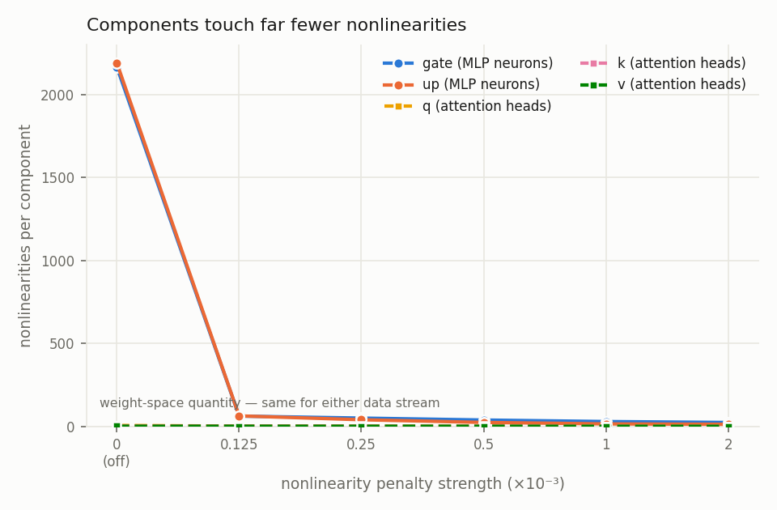

Components go from touching ~2 200 MLP neurons each to ~19 — a **100× reduction** — and
most of it arrives at the *smallest* dose we tried: an eighth of the default already buys
35×. Attention sites start at 1.5–6 heads and settle near 1.

Turning the penalty on is a big move. Turning it up is a small one.

## 2. Sparsity and component count barely notice — on the task

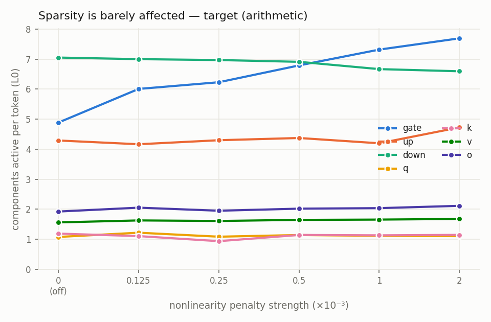

Components active per token stay flat on the task distribution — total L0 goes 22 → 25
across the whole sweep, and the drift is confined to `gate`. Locality and sparsity are not
in tension.

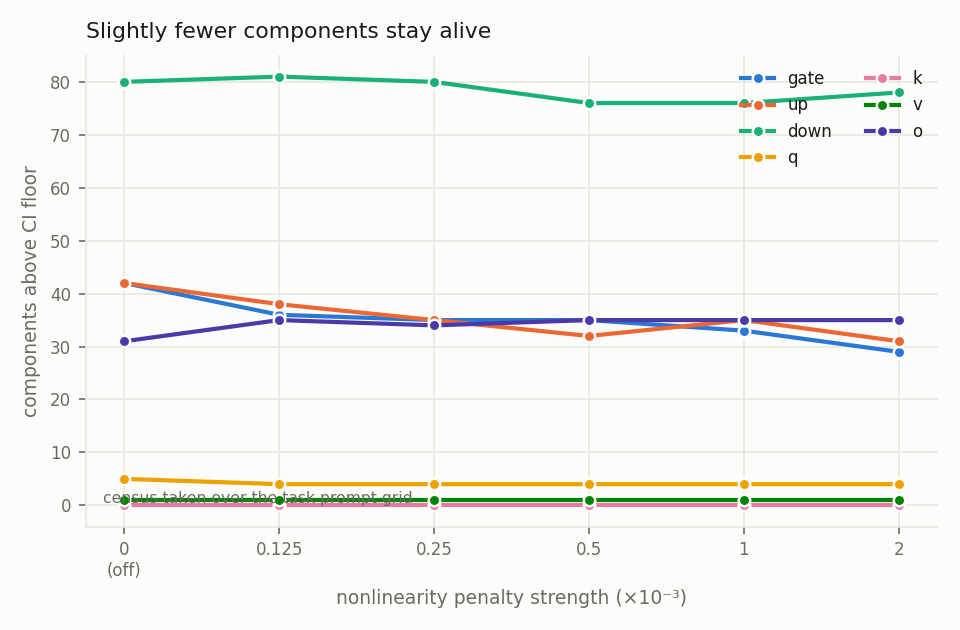

Slightly fewer components stay alive (201 → 178), concentrated in the two MLP matrices the
penalty actually acts on. Everything else is unchanged.

## 3. On general text, penalised components fire more often

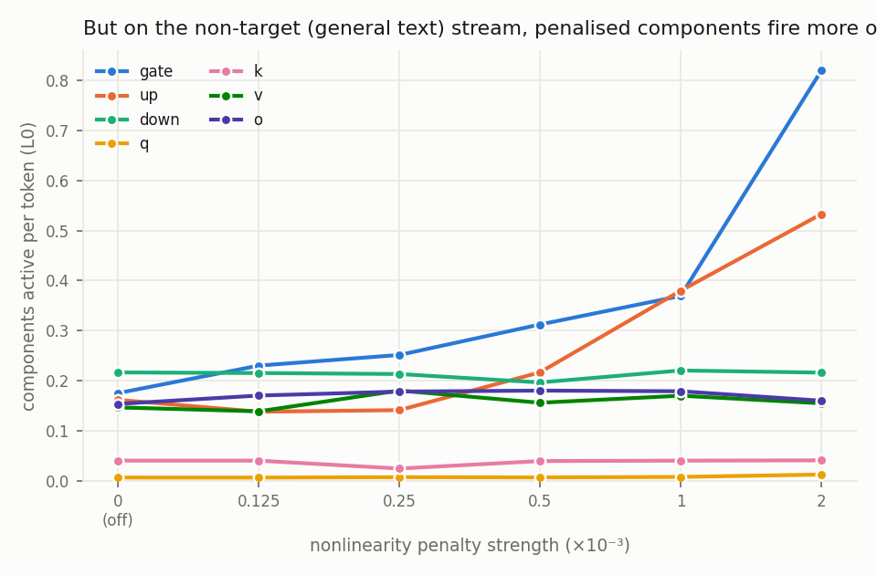

Same measurement, ordinary web text. On text the decomposition was never asked to explain,
almost nothing should fire — and in the baseline almost nothing does (0.9 components per
token, against 22 on the task). Turn the penalty on and that **doubles, to 1.9**, with
`gate` alone going 0.18 → 0.82.

It is a small number either way. Keep it in mind for section 6.

## 4. Ordinary reconstruction: a rounding error on the task, nothing at all off it

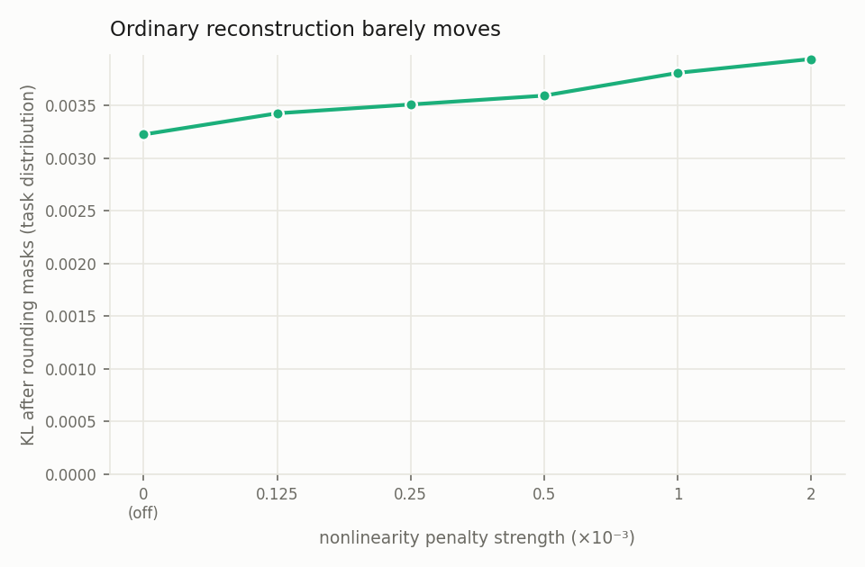

Round every mask to 0/1 and measure how far the output moves: +22% across the full sweep,
from a small number to a slightly larger small number.

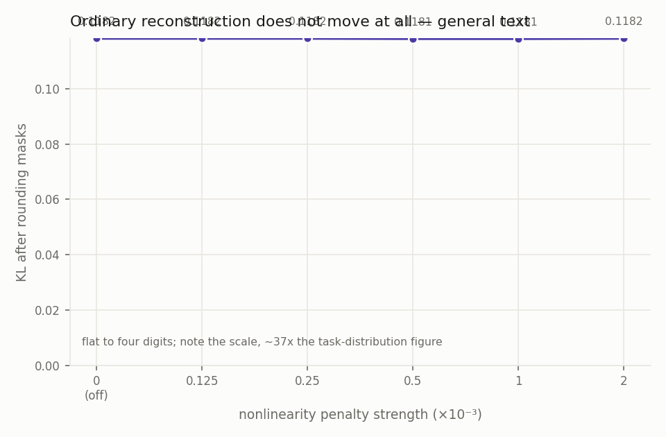

On general text it is **flat to four digits** at every dose. Mind the two y-axes: general
text starts ~37× worse than the task distribution, and the penalty neither helps nor hurts
it.

Under ordinary (non-adversarial) evaluation, the penalty is close to free.

## 5. Under attack, on the task: still modest

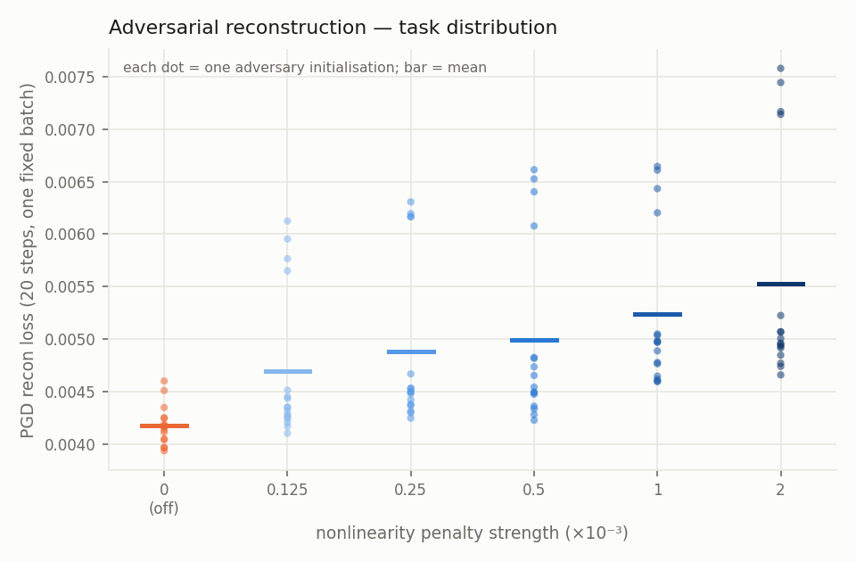

Now let an adversary pick the mask (20 PGD steps). Each dot is one adversary
initialisation. Still modest — +31% from off to 2×10⁻³ — but notice the spread between
initialisations widens once the penalty is on. A penalised decomposition is a *rougher*
target, so where the attack starts matters more.

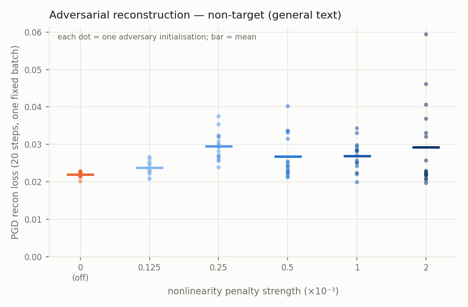

Same 20-step attack on general text: higher than the task distribution for every run
including the baseline, penalised runs above it — but at 20 steps the effect looks
unremarkable and the dose ordering is muddy.

That impression is wrong, which is the point of the next section.

## 6. The 20-step number hides most of the cost

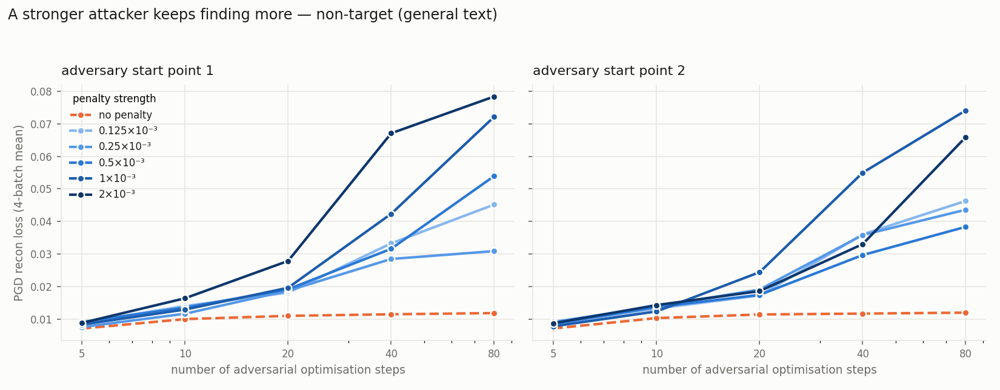

Give the adversary more optimisation steps. **The baseline saturates by ~20 steps and
stops improving. The penalised runs never stop.** At 80 steps the penalised runs sit at
3–6.6× the baseline and are still climbing — where at 20 steps they looked like ~2×.

The gap opens between 10 and 20 steps: a weak attacker sees something about as robust as
the baseline, and only a patient one finds the damage.

The two panels are two different attacker start points. The shape — flat baseline, climbing
penalised runs, roughly rising with dose — is the same in both. The exact ordering *among*
penalised runs is not: 0.5×10⁻³ lands at 4.5× the baseline from one start and 3.2× from the
other. Read the envelope, not the ranking.

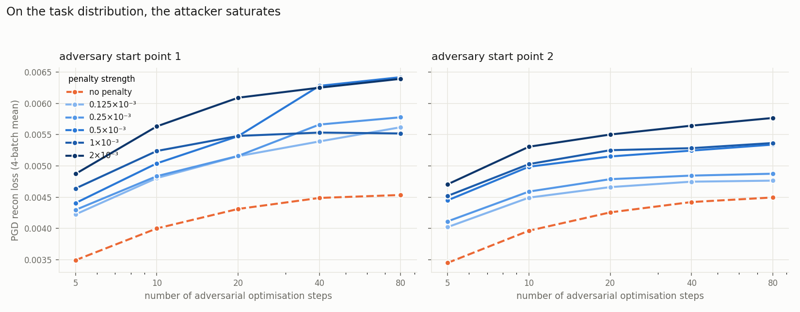

On the task distribution everything saturates, baseline and penalised alike, in both
panels. The runaway is an **off-distribution** phenomenon — and it lines up with the
off-distribution firing rate from section 3: the penalty leaves more components willing to
activate on text they don't explain, and that is what the adversary gets to use.

## 7. Is this an artefact of the hidden-activation objective?

The sweep trains two reconstruction objectives at once: the model's final output, and its
internal activations. A reasonable worry is that the penalty only misbehaves because it is
fighting the second one.

To check, we need a penalty-off/penalty-on pair trained *without* the internal-activation
objective. One exists, but it comes from a different configuration than the sweep — a
different set of reconstruction losses — so its loss **levels** are not comparable to the
sweep's. Within each pair, though, only the penalty differs. So we divide each pair by its
own penalty-off control: the configuration cancels, and what is left is the thing we want,
namely what the penalty costs.

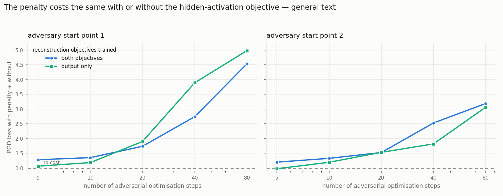

The two pairs land on top of each other, at both attacker start points. At 80 steps the
penalty costs **5.0× / 3.1× without the hidden-activation objective, against 4.5× / 3.2×
with it.** Same cost, same shape, same onset between 10 and 20 steps. The runaway is not
about the second objective.

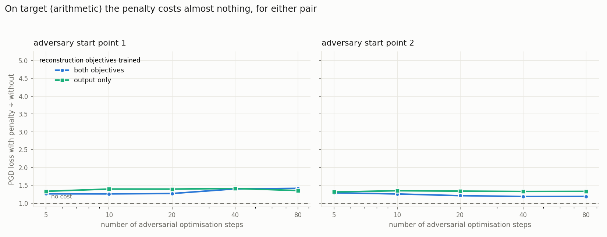

Same y-scale as the figure above, deliberately. On the task distribution both pairs sit
between 1.2× and 1.4× at every step count and go nowhere. Again: the cost is
off-distribution, whichever objectives you trained.

### What the hidden-activation objective *does* buy

Separately from the penalty, the same configuration lets us turn the internal-activation
objective off on its own, holding everything else — seed, losses, penalty dose — fixed.
Doing so makes the decomposition **1.4–1.8× easier to attack on the task distribution**
(0.0065 → 0.0098 and 0.0052 → 0.0092 at 20 steps, at the two start points).

So it is worth training. It just does not protect you from the penalty's off-distribution
cost.

### Which objective diverges faster?

The ratios above deliberately hide the levels. Here are the raw curves, penalty off on the
left and penalty on on the right, sharing a y-axis within each row.

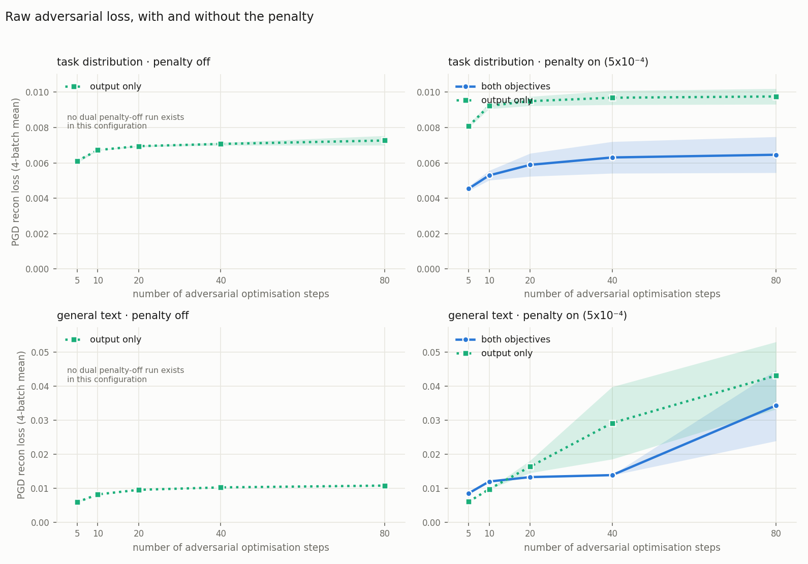

Everything here is one configuration, one dose and one weight init, so the only thing that
moves between the two coloured lines is which objectives were trained. That configuration
has no dual penalty-off run, which is why the left column carries a single line — see the
caveats.

On general text, **output-only diverges faster**: ×7.2 across the step sweep against ×4.0
for the dual run. The two cross at about 20 steps. Below that the dual run is the worse of
the pair (0.0085 against 0.0060 at 5 steps — it starts from a higher floor); by 40 steps
output-only is more than twice as bad (0.0292 against 0.0138); by 80 they have nearly
converged (0.0431 against 0.0343).

So the dual objective does not prevent the runaway — it delays it. Output-only takes off
between 10 and 20 steps; the dual run holds a plateau until 40 and then goes. Which of the
two looks better depends entirely on the attack budget you evaluate at.

The left column is the control for all of it: without the penalty the same output-only
decomposition saturates at 0.0107, and the whole right-hand column sits three to four times
above it.

On the task distribution neither diverges (×1.2 and ×1.4), but output-only sits
consistently higher — 0.0098 against 0.0065 at 80 steps — the same on-task robustness gap
as above, now visible as a level rather than a ratio.

---

## 9. What the attacker is actually exploiting

Section 6 showed the divergence needs a patient attacker. This asks which components it
needs. The adversary is restricted to one group and the curve re-measured; a component
outside the group keeps its natural causal importance and is simply not attacked. DEAD
means its causal importance never rises above 0.1 on the measured batches.

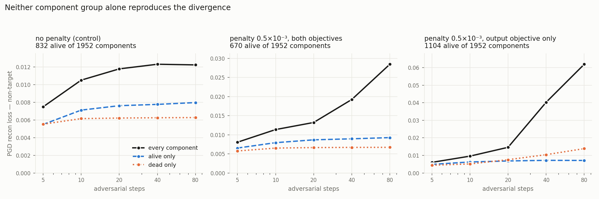

**Neither group alone reproduces the divergence.** In both penalised runs the alive-only
attack is flat from 20 steps to 80 — the same shape the control has — and dead-only is
flat too, except in the output-only run where it grows but still reaches a fraction of the
unrestricted attack. The unrestricted attack, on the same runs and the same budgets, is
the one that runs away.

**So the effect is an interaction, not a group.** The attacker has to switch dead
components on *while* perturbing the live circuit; neither move on its own does much
damage. That is a direct explanation for why the divergence needs so many ascent steps —
a coordinated subset is a harder thing to search for — and it says the extra weight the
penalty leaves on dead components is a necessary ingredient rather than a sufficient one.

Two things this figure does not support, both worth stating because the obvious reading
of it goes further than the data:

- **It does not quantify the interaction.** Comparing "alive + dead" against the joint
  attack needs a no-attack baseline to subtract, or the unattacked loss is counted twice
  and the comparison is biased. That baseline was never measured, and over its plausible
  range the control moves from mildly sub-additive to clearly super-additive — so whether
  the penalty *changes* the character of the attack surface, as opposed to amplifying it,
  is still open.
- **Levels are not comparable across panels.** The two penalised runs use different
  reconstruction recipes, and each panel has its own alive/dead split (832, 670 and 1104
  alive of 1952), so the groups differ in size within and between runs. Read the shape and
  the ordering inside a panel, not the heights across them.

## Numbers

| penalty (×10⁻³) | nonlin./comp. | L0 task | L0 general | alive | rounded KL task | rounded KL general | PGD task, 20 st | PGD general, 20 st | PGD general, 80 st |
|---|---|---|---|---|---|---|---|---|---|
| 0 (off) | 2180 | 22.0 | 0.90 | 201 | 0.0032 | 0.1182 | 0.0043 / 0.0043 | 0.0111 / 0.0115 | 0.0119 / 0.0120 |
| 0.125 | 63 | 23.2 | 0.94 | 195 | 0.0034 | 0.1182 | 0.0052 / 0.0047 | 0.0182 / 0.0173 | 0.0452 / 0.0463 |
| 0.25 | 45 | 23.1 | 1.00 | 189 | 0.0035 | 0.1182 | 0.0052 / 0.0048 | 0.0188 / 0.0191 | 0.0309 / 0.0436 |
| 0.5 | 32 | 24.0 | 1.11 | 183 | 0.0036 | 0.1181 | 0.0055 / 0.0052 | 0.0192 / 0.0175 | 0.0540 / 0.0384 |
| 1 | 23 | 24.1 | 1.37 | 184 | 0.0038 | 0.1181 | 0.0055 / 0.0053 | 0.0197 / 0.0245 | 0.0722 / 0.0741 |
| 2 | 19 | 25.0 | 1.94 | 178 | 0.0039 | 0.1182 | 0.0061 / 0.0055 | 0.0279 / 0.0272 | 0.0784 / 0.0659 |

PGD cells are `start point 1 / start point 2`, each a 4-batch mean from one attacker start.
The scatter figures in section 5 use a *different* protocol — 16 starts on one fixed batch
— so their means are not comparable to these; compare within a protocol, not across.

### With and without the hidden-activation objective

Rows are grouped by configuration. **Compare within a group, not across** — the two groups
train different sets of reconstruction losses, so their levels sit on different scales.
Every run here shares the same seed and the same penalty dose where the penalty is on.

| configuration | condition | PGD task, 20 st | PGD task, 80 st | PGD general, 20 st | PGD general, 80 st |
|---|---|---|---|---|---|
| A (the sweep) | both objectives, penalty off | 0.0043 / 0.0043 | 0.0045 / 0.0045 | 0.0111 / 0.0115 | 0.0119 / 0.0120 |
| A (the sweep) | both objectives, penalty on (5×10⁻⁴) | 0.0055 / 0.0052 | 0.0064 / 0.0053 | 0.0192 / 0.0175 | 0.0540 / 0.0384 |
| B | both objectives, penalty on (5×10⁻⁴) | 0.0065 / 0.0052 | 0.0075 / 0.0054 | 0.0131 / 0.0135 | 0.0448 / 0.0239 |
| B | output only, penalty off | 0.0070 / 0.0069 | 0.0075 / 0.0070 | 0.0095 / 0.0095 | 0.0107 / 0.0108 |
| B | output only, penalty on (5×10⁻⁴) | 0.0098 / 0.0092 | 0.0102 / 0.0093 | 0.0181 / 0.0145 | 0.0531 / 0.0332 |

The two rows that isolate the penalty are `A off → A on` and `B output-only off → on`;
that pair of ratios is what figure 12 plots. The two `B both objectives` and
`B output only` penalty-on rows isolate the hidden-activation objective instead.

Note what rows 2 and 3 say together: the *same* penalty dose at the *same* seed, trained
with a different set of reconstruction losses, lands at 0.0540 / 0.0384 versus
0.0448 / 0.0239 on general text at 80 steps. **The training recipe moves the magnitude
about as much as the attacker start point does.** The direction is robust; the size is a
range, not a number.

## Choosing a coefficient

- **The benefit saturates early.** 1.25×10⁻⁴ already gives 35×; going 16× higher only
  doubles it again.
- **The cost under ordinary evaluation is small on the task and zero off it.**
- **The cost under attack is real, off-distribution, and grows with dose** — and you will
  underestimate it badly if you only run a 20-step attack.
- So **a small coefficient looks like the good trade**, and any evaluation of a penalised
  decomposition should state the attack budget it used.

## Caveats

- One training seed throughout, so nothing here separates the penalty from seed noise. The
  locality effect dwarfs any noise we measured; the ordering *among* penalised runs on the
  adversarial metrics does not — two attacker start points already reorder them.
- Two attacker start points is enough to confirm the shape and not enough to put error bars
  on individual doses. Quote the adversarial cost as "3–6×", never as a single figure.
- Section 7's raw figure has no dual penalty-off line because that configuration never
  had such a run. The one dual penalty-off run sharing its reconstruction losses
  (`addsub-L18-22-zerou`) uses a different weight init, and
  [the init comparison](report_init_pgd_robustness.md) measures that choice as worth ~22%
  off-distribution — the size of the effect under study — so it is not a stand-in.
- Section 7's pairs come from two different configurations. Every comparison drawn there is
  *within* a configuration or a ratio of two such comparisons; no raw level is compared
  across them, and none should be.
- One decomposed block, one task. Multi-block runs show the same locality effect; their
  adversarial curves are not measured yet.
