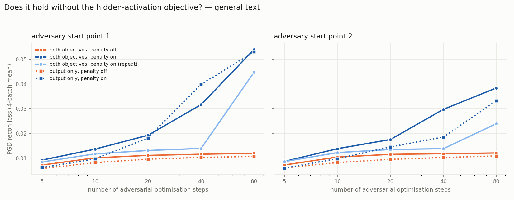
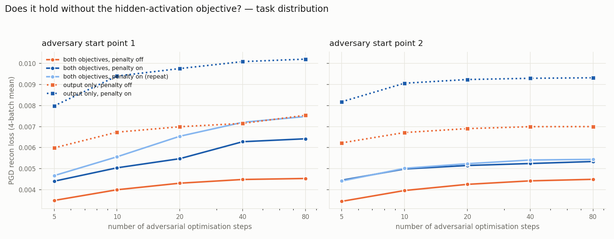

# Does the nonlinearity penalty pay for itself?

We add a term to the decomposition objective that pushes each component to write into
**few nonlinearities** — few MLP neurons, few attention heads — instead of smearing across
thousands. A component that talks to three neurons is something you can read; one spread
over eight thousand is as opaque as the matrix it came from.

The question is what it costs. Below is a sweep of the penalty strength, from off to
2×10⁻³, on a single decomposed transformer block. Everything else is identical across the
six runs: same seed, same schedules, same data, 20 000 steps.

Three things to know before reading the plots:

- **Two data streams.** *Task distribution* = the arithmetic prompts the decomposition is
  trained to explain. *General text* = ordinary web text it also has to survive. They
  behave very differently, so each gets its own figure — and where a quantity belongs to
  neither (it lives in the weights), the figure says so.
- **Every reconstruction number here is of the model's final output.** Nothing below
  measures internal-activation reconstruction.
- **Every adversarial curve is drawn twice**, from two different attacker start points,
  in side-by-side panels. If a pattern only appears in one panel, don't believe it.

---

## 1. The penalty does what it says

Components go from touching ~2 200 MLP neurons each to ~19 — a **100× reduction** — and
most of it arrives at the *smallest* dose we tried: an eighth of the default already buys
35×. Attention sites start at 1.5–6 heads and settle near 1.

Turning the penalty on is a big move. Turning it up is a small one.

## 2. Sparsity and component count barely notice — on the task

Components active per token stay flat on the task distribution — total L0 goes 22 → 25
across the whole sweep, and the drift is confined to `gate`. Locality and sparsity are not
in tension.

Slightly fewer components stay alive (201 → 178), concentrated in the two MLP matrices the
penalty actually acts on. Everything else is unchanged.

## 3. On general text, penalised components fire more often

Same measurement, ordinary web text. On text the decomposition was never asked to explain,
almost nothing should fire — and in the baseline almost nothing does (0.9 components per
token, against 22 on the task). Turn the penalty on and that **doubles, to 1.9**, with
`gate` alone going 0.18 → 0.82.

It is a small number either way. Keep it in mind for section 6.

## 4. Ordinary reconstruction: a rounding error on the task, nothing at all off it

Round every mask to 0/1 and measure how far the output moves: +22% across the full sweep,
from a small number to a slightly larger small number.

On general text it is **flat to four digits** at every dose. Mind the two y-axes: general
text starts ~37× worse than the task distribution, and the penalty neither helps nor hurts
it.

Under ordinary (non-adversarial) evaluation, the penalty is close to free.

## 5. Under attack, on the task: still modest

Now let an adversary pick the mask (20 PGD steps). Each dot is one adversary
initialisation. Still modest — +31% from off to 2×10⁻³ — but notice the spread between
initialisations widens once the penalty is on. A penalised decomposition is a *rougher*
target, so where the attack starts matters more.

Same 20-step attack on general text: higher than the task distribution for every run
including the baseline, penalised runs above it — but at 20 steps the effect looks
unremarkable and the dose ordering is muddy.

That impression is wrong, which is the point of the next section.

## 6. The 20-step number hides most of the cost

Give the adversary more optimisation steps. **The baseline saturates by ~20 steps and
stops improving. The penalised runs never stop.** At 80 steps the penalised runs sit at
3–6.6× the baseline and are still climbing — where at 20 steps they looked like ~2×.

The gap opens between 10 and 20 steps: a weak attacker sees something about as robust as
the baseline, and only a patient one finds the damage.

The two panels are two different attacker start points. The shape — flat baseline, climbing
penalised runs, roughly rising with dose — is the same in both. The exact ordering *among*
penalised runs is not: 0.5×10⁻³ lands at 4.5× the baseline from one start and 3.2× from the
other. Read the envelope, not the ranking.

On the task distribution everything saturates, baseline and penalised alike, in both
panels. The runaway is an **off-distribution** phenomenon — and it lines up with the
off-distribution firing rate from section 3: the penalty leaves more components willing to
activate on text they don't explain, and that is what the adversary gets to use.

## 7. Is this an artefact of the hidden-activation objective?

The runs above are trained on two reconstruction objectives at once: the model's final
output, and its internal activations. A reasonable worry is that the penalty only misbehaves
because it is fighting the second one.

It isn't.

Drop the internal-activation objective entirely and repeat the pair. The two penalty-off
runs lie on top of each other and stay flat; both penalty-on runs climb. At 80 steps the
penalty costs **5.0× / 3.1× without the hidden-activation objective, against 4.5× / 3.2×
with it** (the two numbers are the two attacker start points). Same effect, not a smaller
one — and the start point moves both pairs together, which is what you want to see from a
nuisance parameter.

On the task distribution there *is* a difference, but it is about the objective, not the
penalty: output-only decompositions are less adversarially robust to begin with (0.0070
against 0.0043 at 20 steps). The hidden-activation objective buys on-task robustness. It
does not protect you from the penalty's off-distribution cost.

---

## Numbers

| penalty (×10⁻³) | nonlin./comp. | L0 task | L0 general | alive | rounded KL task | rounded KL general | PGD task, 20 st | PGD general, 20 st | PGD general, 80 st |
|---|---|---|---|---|---|---|---|---|---|
| 0 (off) | 2180 | 22.0 | 0.90 | 201 | 0.0032 | 0.1182 | 0.0043 / 0.0043 | 0.0111 / 0.0115 | 0.0119 / 0.0120 |
| 0.125 | 63 | 23.2 | 0.94 | 195 | 0.0034 | 0.1182 | 0.0052 / 0.0047 | 0.0182 / 0.0173 | 0.0452 / 0.0463 |
| 0.25 | 45 | 23.1 | 1.00 | 189 | 0.0035 | 0.1182 | 0.0052 / 0.0048 | 0.0188 / 0.0191 | 0.0309 / 0.0436 |
| 0.5 | 32 | 24.0 | 1.11 | 183 | 0.0036 | 0.1181 | 0.0055 / 0.0052 | 0.0192 / 0.0175 | 0.0540 / 0.0384 |
| 1 | 23 | 24.1 | 1.37 | 184 | 0.0038 | 0.1181 | 0.0055 / 0.0053 | 0.0197 / 0.0245 | 0.0722 / 0.0741 |
| 2 | 19 | 25.0 | 1.94 | 178 | 0.0039 | 0.1182 | 0.0061 / 0.0055 | 0.0279 / 0.0272 | 0.0784 / 0.0659 |

PGD cells are `start point 1 / start point 2`, each a 4-batch mean from one attacker start.
The scatter figures in section 5 use a *different* protocol — 16 starts on one fixed batch
— so their means are not comparable to these; compare within a protocol, not across.

### With and without the hidden-activation objective

| condition | PGD task, 20 st | PGD task, 80 st | PGD general, 20 st | PGD general, 80 st |
|---|---|---|---|---|
| both objectives, penalty off | 0.0043 / 0.0043 | 0.0045 / 0.0045 | 0.0111 / 0.0115 | 0.0119 / 0.0120 |
| both objectives, penalty on (5×10⁻⁴) | 0.0055 / 0.0052 | 0.0064 / 0.0053 | 0.0192 / 0.0175 | 0.0540 / 0.0384 |
| both objectives, penalty on — separate training run | 0.0065 / 0.0052 | 0.0075 / 0.0054 | 0.0131 / 0.0135 | 0.0448 / 0.0239 |
| output only, penalty off | 0.0070 / 0.0069 | 0.0075 / 0.0070 | 0.0095 / 0.0095 | 0.0107 / 0.0108 |
| output only, penalty on (5×10⁻⁴) | 0.0098 / 0.0092 | 0.0102 / 0.0093 | 0.0181 / 0.0145 | 0.0531 / 0.0332 |

The third row is a second training run at the same setting as the second, from a different
seed and configuration lineage — the only cross-run training-seed check here. It climbs
too, but less far: 3.8× / 2.0× the penalty-off baseline at 80 steps on general text, against
4.5× / 3.2× for the first. **Training seed moves the magnitude about as much as attacker
start does.** The direction is robust; the size of the effect is a range, not a number.

## Choosing a coefficient

- **The benefit saturates early.** 1.25×10⁻⁴ already gives 35×; going 16× higher only
  doubles it again.
- **The cost under ordinary evaluation is small on the task and zero off it.**
- **The cost under attack is real, off-distribution, and grows with dose** — and you will
  underestimate it badly if you only run a 20-step attack.
- So **a small coefficient looks like the good trade**, and any evaluation of a penalised
  decomposition should state the attack budget it used.

## Caveats

- One training seed per coefficient. The locality effect dwarfs any noise we measured; the
  ordering *among* penalised runs on the adversarial metrics does not — two attacker start
  points already reorder them, and the one repeated training run moves the magnitude by a
  similar amount again.
- Two attacker start points is enough to confirm the shape and not enough to put error bars
  on individual doses. Quote the adversarial cost as "3–6×", never as a single figure.
- The output-only pair comes from a different configuration lineage than the sweep, so read
  it as *penalty-on against penalty-off within that pair*, not against the sweep's numbers.
- One decomposed block, one task. Multi-block runs show the same locality effect; their
  adversarial curves are not measured yet.
