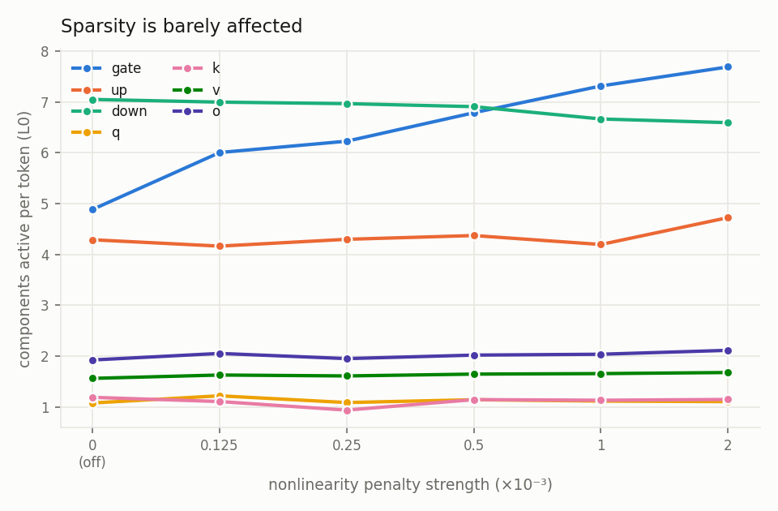
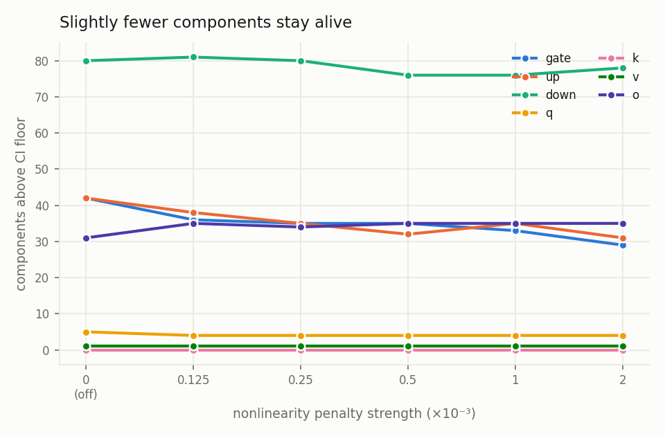
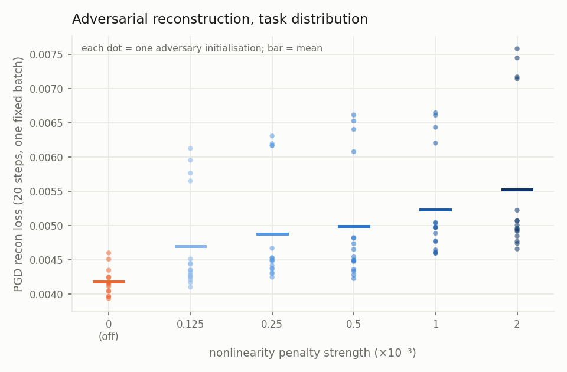
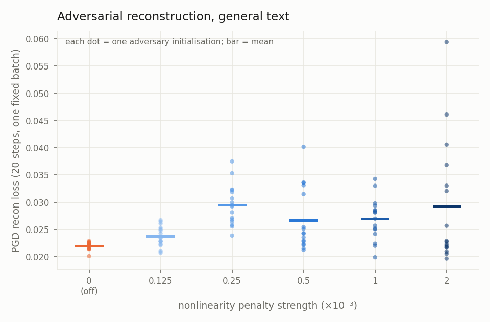
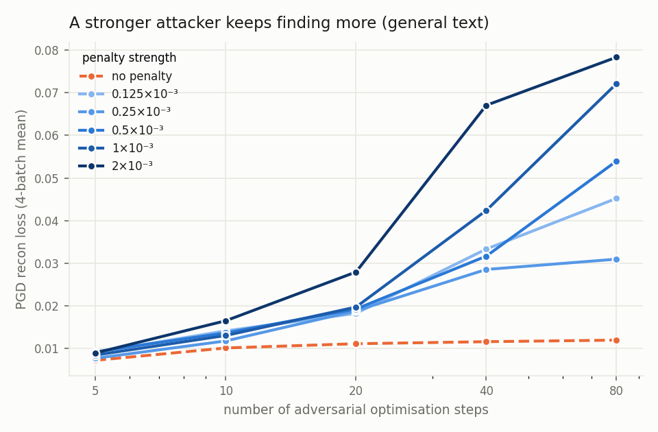
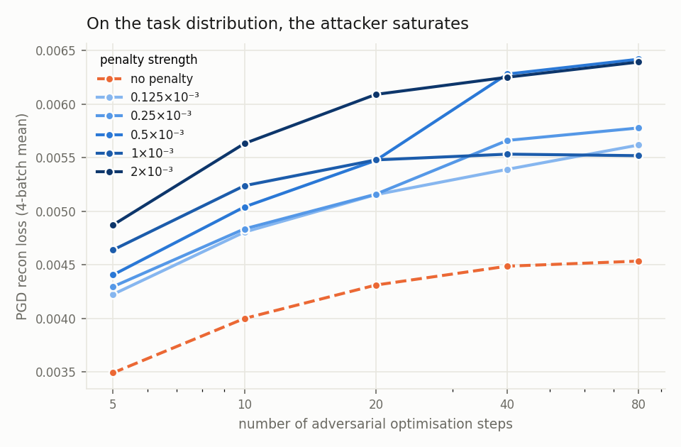

# Does the nonlinearity penalty pay for itself?

We add a term to the decomposition objective that pushes each component to write into
**few nonlinearities** — few MLP neurons, few attention heads — instead of smearing across
thousands. A component that talks to three neurons is something you can read; one spread
over eight thousand is as opaque as the matrix it came from.

The question is what it costs. Below is a sweep of the penalty strength, from off to
2×10⁻³, on a single decomposed transformer block. Everything else is identical across the
six runs: same seed, same schedules, same data, 20 000 steps.

Two things to know before reading the plots:

- **Two data streams.** *Task distribution* = the arithmetic prompts the decomposition is
  trained to explain. *General text* = ordinary web text it also has to survive. They
  behave very differently, so they always get their own figure.
- **Every reconstruction number here is of the model's final output.** Nothing below
  measures internal-activation reconstruction.

---

## 1. The penalty does what it says

Components go from touching ~2 200 MLP neurons each to ~20 — a **100× reduction** — and
most of it arrives at the *smallest* dose we tried: an eighth of the default already buys
35×. Attention sites start at 1.5–6 heads and settle near 1.

Turning the penalty on is a big move. Turning it up is a small one.

## 2. Sparsity and component count barely notice

Components active per token stay flat — total L0 goes 22 → 25 across the whole sweep, and
the drift is confined to `gate`. Locality and sparsity are not in tension.

Slightly fewer components stay alive (201 → 178), concentrated in the two MLP matrices the
penalty actually acts on. Everything else is unchanged.

## 3. Ordinary reconstruction on the task: a rounding error

Round every mask to 0/1 and measure how far the output moves: +22% across the full sweep,
from a small number to a slightly larger small number.

Now let an adversary pick the mask (20 PGD steps). Each dot is one adversary
initialisation. Still modest — +31% from off to 2×10⁻³ — but notice the spread between
initialisations widens once the penalty is on. A penalised decomposition is a *rougher*
target, so where the attack starts matters more.

## 4. On general text, the adversary does better

Same 20-step attack, ordinary web text. Higher than the task distribution for every run
including the baseline, and the penalised runs sit above it — though at 20 steps the
effect looks unremarkable and the dose ordering is muddy.

That impression is wrong, which is the point of the next figure.

## 5. The 20-step number hides most of the cost

Give the adversary more optimisation steps. **The baseline saturates by ~20 steps and
stops improving. The penalised runs never stop.** At 80 steps the strongest penalty is
**6.6× the baseline** and still climbing — where at 20 steps it looked like 2.5×.

The gap opens between 10 and 20 steps: a weak attacker sees something about as robust as
the baseline, and only a patient one finds the damage.

On the task distribution everything saturates, baseline and penalised alike. The runaway
is an **off-distribution** phenomenon.

---

## Numbers

| penalty (×10⁻³) | nonlinearities/component | L0 | alive components | rounded-mask KL | PGD task (20 st) | PGD general (20 st) | PGD general (80 st) |
|---|---|---|---|---|---|---|---|
| 0 (off) | 2179 | 22.0 | 201 | 0.0032 | 0.0042 | 0.0220 | 0.0119 |
| 0.125 | 63 | 23.2 | 195 | 0.0034 | 0.0047 | 0.0238 | 0.0452 |
| 0.25 | 44 | 23.1 | 189 | 0.0035 | 0.0049 | 0.0295 | 0.0309 |
| 0.5 | 29 | 24.0 | 183 | 0.0036 | 0.0050 | 0.0267 | 0.0540 |
| 1 | 20 | 24.1 | 184 | 0.0038 | 0.0052 | 0.0269 | 0.0722 |
| 2 | 18 | 25.0 | 178 | 0.0039 | 0.0055 | 0.0293 | 0.0784 |

The 20-step PGD columns are means over 16 adversary initialisations on one fixed batch
(the figures show every dot). The 80-step column is a 4-batch mean from a single
initialisation, so the two are not on the same scale — compare within a column, not
across.

## Choosing a coefficient

- **The benefit saturates early.** 1.25×10⁻⁴ already gives 35×; going 16× higher only
  doubles it again.
- **The on-distribution cost is small at any dose** — a few percent of reconstruction.
- **The off-distribution cost is real and grows with dose**, and you will underestimate it
  badly if you only run a 20-step attack.
- So **a small coefficient looks like the good trade**, and any evaluation of a penalised
  decomposition should state the attack budget it used.

## Caveats

- One training seed per coefficient. The locality effect dwarfs any noise we measured; the
  ordering *among* penalised runs on the PGD metrics does not.
- The 80-step numbers come from a single adversary initialisation, and re-measuring the
  same checkpoint can move them substantially. Treat the *shape* — baseline flat,
  penalised climbing — as the result, not the exact ratios.
- One decomposed block, one task. Multi-block runs show the same locality effect; their
  adversarial curves are not measured yet.
