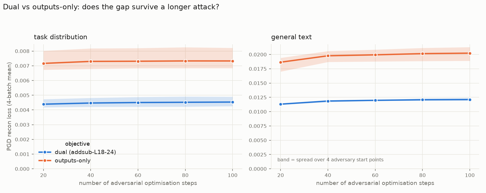

# PGD robustness under long attacks: L18 decompositions

How far does a decomposition's reconstruction degrade when a fresh PGD adversary gets many
more steps than the production 20-step probe? Two comparisons, same probe (`pgd_curve.py`):

1. [Weight init](#weight-init-does-it-change-adversarial-robustness) — `zero_u` vs
   `neuron_aligned_targeted` (addsub-L18-22 / -23).
2. [Objective](#objective-dual-vs-outputs-only-under-a-long-attack) — dual vs
   outputs-only (addsub-L18-24).

## Weight init: does it change adversarial robustness?

**Question.** Two L18 decompositions differing only in how their components were
initialised — does one survive a long PGD attack better than the other?

**Runs.** Both 20 000 steps.

| run | init |
|---|---|
| `p-88665048` (`addsub-L18-22-zerou`) | `zero_u` |
| `p-6540dfdd` (`addsub-L18-23-neuronaligned`) | `neuron_aligned_targeted` |

**Probe.** Fresh PGD on the output CI head, end-to-end output KL, 4 fixed batches,
10→100 steps, 2 adversary start points, source shape `c` (one mask per site, shared across
batch and position). Non-target arm is delta-pinned (SPEC T4).

### What it shows

**General text — the aligned init is ~22% easier to attack.** At 100 steps 0.0127 against
0.0104, and the gap opens from 20 steps onward. This one is solid: the between-init gap is
more than twice either run's own spread across adversary start points (2% aligned, 9%
`zero_u`).

**Task distribution — the aligned init is ~10% *harder* to attack.** 0.0047 against 0.0052
at 100 steps. Smaller than the off-distribution effect and only marginally outside the
noise (`zero_u`'s own spread is 12% at that budget), so treat it as a hint, not a result.

So the alignment appears to buy a little on-distribution robustness and pay more for it
off-distribution.

**Neither init runs away.** Both saturate by ~40 steps. This matters as a control for the
nonlinearity-penalty work: there the penalised runs kept climbing to 2.5–3× while their
control flattened. Here both arms flatten, so "keeps climbing under a longer attack" is a
property of that penalty, not something every L18 decomposition does.

### Numbers (mean over 2 adversary start points)

| steps | 10 | 20 | 40 | 60 | 80 | 100 |
|---|---|---|---|---|---|---|
| task, `zero_u` | 0.0043 | 0.0048 | 0.0050 | 0.0051 | 0.0051 | 0.0052 |
| task, aligned | 0.0040 | 0.0043 | 0.0045 | 0.0045 | 0.0046 | 0.0047 |
| general, `zero_u` | 0.0086 | 0.0098 | 0.0102 | 0.0103 | 0.0104 | 0.0104 |
| general, aligned | 0.0092 | 0.0113 | 0.0126 | 0.0126 | 0.0127 | 0.0127 |

### Caveats

- One training seed per init; two adversary start points. Enough for the 22%
  off-distribution gap, not for the 10% on-distribution one.
- A 20-step probe reads 0.0098 vs 0.0113 — it sees about half the eventual gap. Quote the
  step budget with any of these numbers.
- **The two runs sit on opposite sides of the #1001 merge** and no single build can open
  both: `zero_u` uses the retired `pd.weight_init`, the aligned run uses
  `decomposition.sites.initialization`. They were therefore measured by two builds, which
  is only sound because the probe's computation is unchanged between them —
  `core/{recon_eval,adversary,masking,recon}.py` are byte-identical, `reconstruction_loss`
  and `_row_masked_kl` identical, `prepare_lm_batch` identical apart from a rename, and
  `make_fresh_pgd_step` a pure extraction into `make_fresh_pgd_scorer`. Probe inputs match
  too (`pd.seed` 0, eval batch 128, step size 0.1, 4 batches, same prompts and eval shard),
  so both runs see the same fixed batches. Re-verify this if either side moves again.
- Post-#1001 the aligned init covers **every site kind including attention**; the earlier
  `addsub-L18-18-neuronaligned-bosincl` run did not, and referenced a `neuron_ranks`
  artifact the new schema drops. This report uses the current variant, so its numbers are
  not interchangeable with earlier ones for that run.
- No coupled baseline: `p-5b7fa697`'s pin predates #1000 and no current build can open it,
  and pins are immutable (CONFIGS.md rule 4). A same-code coupled twin at 20k is the only
  way to add one.

---

## Objective: dual vs outputs-only under a long attack

*addsub-L18-24, added 2026-09-21.*

**Question.** The -24 pair differs only in the objective: `addsub-L18-24` (dual, `p-80e88c2b`)
and `addsub-L18-24-outputs-only` (`p-b1ab4bb2`, `ci.dual: false`, no hidden pass), both
20 000 steps. At the production 20-step probe the dual arm has the lower PGD recon loss — does
that hold up when the adversary gets 5x as many steps?

**Probe.** Same as above (`pgd_curve.py`, fresh PGD on the OUTPUT CI head, end-to-end output
KL, 4 fixed batches, source shape `c`, non-target arm delta-pinned), with budgets 20→100 in
steps of 20 and **4** adversary start points instead of 2. Jobs 11988/11989 against a frozen
worktree at the -24 commit; the output head is the one both arms share, so this is the
like-for-like comparison and says nothing about the dual arm's hidden head. Raw data
`~/pd_scratch/dual_obj_jax/pgd_curve24/`; figure script `pgd_curve24_figs.py`.

**The dual arm is more robust at every budget, and the gap does not close.** At 100 steps
outputs-only sits at 1.61x the dual arm's loss on the task distribution and 1.67x on general
text — the same ratio as at 20 steps (1.63x / 1.65x). The min-max bands over the four start
points do not overlap on either stream.

**Neither arm hides a weakness at long budgets.** From 20 to 100 steps the loss rises only
+3.4% (dual) / +2.4% (outputs-only) on the task and +7.1% / +8.5% on general text, almost
all of it by step 60 (general text: mostly by step 40). The production 20-step probe already
sees most of the worst case for both.

**Outputs-only is more sensitive to where the attack starts:** its task-distribution spread
is 0.0068-0.0082 at 100 steps against the dual's 0.0043-0.0049.

| steps | dual, task | outputs-only, task | dual, general | outputs-only, general |
|---|---|---|---|---|
| 20 | 0.00439 | 0.00716 | 0.01131 | 0.01865 |
| 40 | 0.00447 | 0.00730 | 0.01186 | 0.01977 |
| 60 | 0.00450 | 0.00731 | 0.01198 | 0.01994 |
| 80 | 0.00452 | 0.00733 | 0.01207 | 0.02015 |
| 100 | 0.00454 | 0.00733 | 0.01211 | 0.02023 |

(Mean over 4 start points. The k=20 points reproduce each run's own step-20000 eval,
0.0047 and 0.0067, within the spread across starts.)

Caveat: both are ONE-block decompositions (layer 18), so as with the logit-magnitude
comparison (`report_logit_magnitude.md`) a per-block robustness gap may compound in a
full-model run rather than stay at 1.6x.
