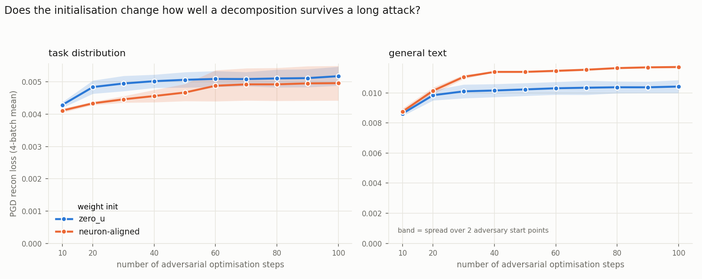

# Does the weight init change adversarial robustness?

**Question.** Two L18 decompositions differing only in how their components were
initialised — does one survive a long PGD attack better than the other?

**Runs.** Both 20 000 steps, both opened and measured by *one* copy of the probe code, so
this is immune to the eval-definition drift across the #1000 merge that made the runs' own
logged metrics incomparable.

| run | init |
|---|---|
| `p-88665048` | `zero_u` |
| `p-222d379b` | `neuron_aligned_targeted` |

A key-by-key config diff gives **4 differing keys**: `pd.weight_init`, the two
`pd.neuron_ranks` fields the aligned init requires, and `run_name`. Nothing else.

**Probe.** Fresh PGD on the output CI head, end-to-end output KL, 4 fixed batches,
10→100 steps, 2 adversary start points. Non-target arm is delta-pinned (SPEC T4).

`zero_v` (`p-f73bde9d`) is excluded: it stopped at 7 505 steps and is not comparable.

## What it shows

**General text — the aligned init ends up ~12% easier to attack.** At 100 steps
0.0117 against 0.0104. Both curves flatten by about 40 steps; the aligned run simply
settles on a higher plateau.

That gap is real but slim. `zero_u`'s own spread between the two adversary start points is
8–9%, so the between-init difference is only just outside the within-init noise. Two start
points and one training seed cannot separate them further.

**Task distribution — no difference worth reporting.** The means sit within 5% of each
other and the bands overlap across the whole sweep. The aligned run's spread between start
points reaches **24%** at high budget, several times any gap between the schemes.

**Neither init runs away.** Both saturate. This matters as a control for the nonlinearity
penalty work: there, the penalised runs kept climbing to 2.5–3× while the control flattened.
Here both arms flatten, so "keeps climbing under a longer attack" is a property of that
penalty, not something every L18 decomposition does.

## Numbers (mean over 2 adversary start points)

| steps | 10 | 20 | 40 | 60 | 80 | 100 |
|---|---|---|---|---|---|---|
| task, `zero_u` | 0.0043 | 0.0048 | 0.0050 | 0.0051 | 0.0051 | 0.0052 |
| task, aligned | 0.0041 | 0.0043 | 0.0046 | 0.0049 | 0.0049 | 0.0050 |
| general, `zero_u` | 0.0086 | 0.0098 | 0.0102 | 0.0103 | 0.0104 | 0.0104 |
| general, aligned | 0.0088 | 0.0102 | 0.0114 | 0.0115 | 0.0117 | 0.0117 |

## Caveats

- One training seed per init; two adversary start points. Enough to see a 12% plateau
  difference off-distribution, not enough to call it established.
- A 20-step probe reads 0.0098 vs 0.0102 — it would have shown nothing. Quote the step
  budget with any of these numbers.
- No coupled baseline: `p-5b7fa697`'s pin predates #1000 and this code cannot open it, and
  pins are immutable (CONFIGS.md rule 4). A same-code coupled twin at 20k is the only way
  to add one.
