# Layer 30 in a 32-block decomposition vs on its own: why the deep run keeps 2-3x more always-on components

2026-09-15. Runs compared: `addsub-all-layers-4xh100-04` (`p-ba4a0c04`, all 32 blocks
decomposed, checkpoint + ab-grid at step 16 000) and `addsub-all-layers-04-block30`
(`p-46ace901`, the same recipe restricted to block 30, checkpoint + ab-grid at step 8 000; still
training). Same neuron-aligned init, same per-point hidden/output coefficients, same imp-min and
frequency schedule; the only differences are the decomposed span (32 blocks vs 1), the mesh, and
the batch-per-rank.

Protocol for everything below: frozen HF Llama-3.1-8B in fp32 on CPU, "a+b=" grid, layer 30's
seven sites replaced by one run's components under a mask, layers 0-29 and 31 frozen (except §6).
CI is the torch port of the chunkwise CI fn on the clean taps, as in training. Scripts and raw
outputs live in `~/pd_scratch/dual_obj_jax/last_layers/` (`emu.py`, `static_compare.py`,
`directions.py`, `inner_grids.py`, `site_transform.py`, `early_recruit_plots.py`,
`followup.py`; results in `emu_clean/`, `emu_up/`, `followup.json`). Figures are in
`notes/plots/last_layers/`. Unless stated otherwise the emulation uses the 50x50 sub-grid
(a, b odd, 2 500 prompts); the grid-snapshot statistics use all 10 000.

## Summary

1. **The extra always-on components are extra pieces of the same write.** All layer-30
   always-on components are bias-like: their inner activation over the grid has mean 2-15 and sd
   below 1. Summed, the all-layers set (10 gate / 7 up / 7 down) and the block30 set (3 / 3 / 3)
   produce the same constant vector at "=" (cosine 0.79 gate, 0.77 up, 0.97 down, 0.95 at the
   MLP output), with the same 25-45 % residual against the clean output. The block30 run packed
   the vector into 3 denser pieces; the deep run kept it split over ~10 neuron-aligned ones.
2. **In the clean-upstream setting the block30 solution strictly dominates.** Layer 30
   CI-masked, everything else frozen: KL at "=" 0.0108 (block30) vs 0.0278 (all-layers), with
   half the imp-min and frequency penalty. Even with every component on and no delta the deep
   run's layer-30 factorisation is worse (0.0045 vs 0.0263): the deficit is in V·U, not in the CI.
3. **It does not collapse because imp-min never touches V/U and cannot lower a load-bearing
   CI.** Each extra piece costs 4e-3 to 0.5 nats when ablated, against a 4e-4 (KL-equivalent)
   penalty saving; every always-on piece sits at CI preactivation 1.3-2.1, where the mask squash
   passes no gradient and the imp-min leak passes 0.01x. Merging would need the surviving pieces
   to absorb the others' function *before* their CI drops, which nothing rewards.
4. **Under the noisy upstream the deep run trains on, its ten pieces reconstruct better
   than block30's three** (KL 0.049 vs 0.071 with stochastic upstream masks, §6): the extra
   pieces are load-bearing for the objective it actually sees, even though they are dead
   weight for the clean-upstream objective.
5. **The pieces were recruited in the first 2 000 steps, when the last layers were the cheapest
   fix for a chaotic output, and then parked.** Layer-30/31 L0 was 460 at step 500 against a
   median of 76 for layers 2-29; every extra piece is already at CI 1 in the step-4000 snapshot.
   Components that are always-on at 4k either stay at 1 or die (bimodal), in every layer group.

## 1. What the always-on components are

Per-site counts at "=" from the grid snapshots (mean output-role CI over 10 000 prompts):

| site | C | all-layers @16k alive (≥0.05) / ≥0.9 | block30 @8k alive / ≥0.9 | block30 @12k alive / ≥0.9 |
|---|---|---|---|---|
| gate | 912 | 45 / 10 | 33 / 3 | 36 / 3 |
| up | 912 | 37 / 7 | 19 / 3 | 27 / 3 |
| down | 1024 | 37 / 7 | 33 / 3 | 40 / 3 |
| o | 512 | 2 / 2 | 1 / 0 | 2 / 0 |
| q, k, v | | 1 / 1, 1 / 0, 0 | 1 / 1, 1 / 0, 0 | 1 / 1, 1 / 0, 1 / 0 |

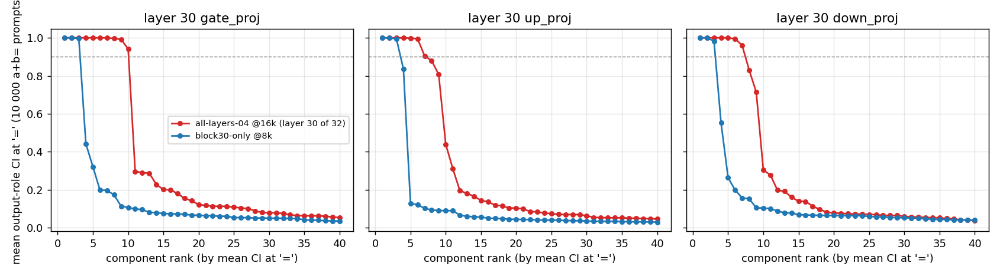
*Fig 1. Mean output-role CI at '=' per component, sorted, layer-30 gate/up/down; dashed line = 0.9.*
Fig 1: the mean CI of each site's components sorted; the deep run has a
plateau of ~10 at CI 1, the block30 run a plateau of 3 followed by the same tail of partially-on
components. 
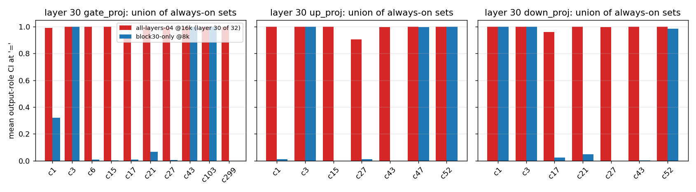
*Fig 2. Mean CI at '=' of the union of both runs' always-on sets, per run.*
Fig 2: same indices in both runs (same init). The block30 set is a
strict subset of the all-layers set: gate {3, 43, 103} ⊂ {1, 3, 6, 15, 17, 21, 27, 43, 103,
299}; up {3, 47, 52} ⊂ {1, 3, 15, 21, 43, 47, 52}; down {1, 3, 52} ⊂ {1, 3, 17, 21, 27, 43, 52}.
The extras have mean CI 0.00-0.08 in the block30 run (gate c1 is the exception at 0.36-0.43).
Each component still carries its init neuron as its top neuron (11272, 3382, 6764, 6209, 12185,
10073, 11976, 11430, 11920, 2762 for gate), but with only 10-40 % of its energy there; block30's
three spread half their energy over 450-1 200 neurons, the all-layers pieces over 430-900.

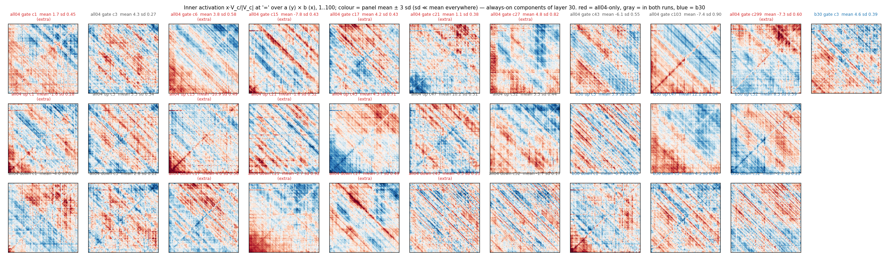
*Fig 10. Inner activation x·V_c/|V_c| at '=' over the (a, b) grid for every always-on component; colour = panel mean ± 3 sd.*
**They are bias-like.** Fig 10 shows x·V_c/|V_c| over the 100x100 grid for all
always-on components: means 2 to 15 in magnitude, sd 0.2 to 1.0, with a faint diagonal (a+b)
modulation. The CI-fn preactivation at "=" is 1.3-2.1 for every one of them (block30: 1.1-1.4),
i.e. all are in the leaky region above 1.

## 2. Do the two sets do the same thing when summed?

Yes. Site output of the always-on set only, y_on = (x V_A) U_A at "=", 2 500 prompts
(`site_transform_2500.txt`):

| site | cos(all-layers sum, block30 sum) | cos to clean y (all / b30) | rel. sq. err vs clean (all / b30) | ‖sum‖ all / b30 / clean |
|---|---|---|---|---|
| gate | 0.79 | 0.74 / 0.74 | 0.46 / 0.45 | 78 / 84 / 117 |
| up | 0.77 | 0.68 / 0.70 | 0.53 / 0.54 | 65 / 76 / 89 |
| down | 0.97 | 0.88 / 0.88 | 0.23 / 0.23 | 21 / 21 / 25 |
| MLP output | 0.95 | 0.87 / 0.87 | 0.24 / 0.28 | 21 / 17 / 25 |

The sum is essentially one constant vector per site (rms deviation over prompts 4-6 against a
mean norm of 65-84 at gate/up). Per-piece constant contributions (norms) at gate: all-layers
c299 32, c15 27, c6 19, c27 14, c17 13, c103 13, c43 10, c3 7, c1 3, c21 3; block30 c103 58,
c43 37, c3 8. So the deep run's extras are genuine parts of the sum, not cancelling pairs, and
block30's pieces are 2-5x larger. Fig 6 gives the per-prompt cosine and error distributions.
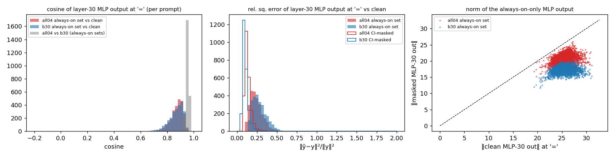
*Fig 6. Layer-30 MLP output at '=' with only the always-on set on: per-prompt cosine and relative error vs clean, and norms.*

The read/write directions themselves have drifted apart: same-index components have cosine
0.2-0.7 between runs, and block30's always-on V and U lie only 25-60 % inside the span of the
all-layers always-on set (`directions.txt`). The block30 run re-oriented its three pieces; it did
not keep three of the ten.

## 3. Which set gives the better loss?

Layer 30 replaced by each run's components, clean upstream, 2 500 prompts
(`emu_clean/results.json`, Fig 3):
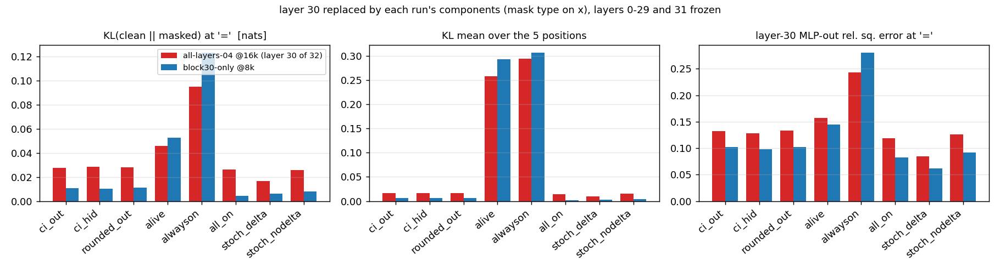
*Fig 3. KL and hidden-point error with layer 30 replaced by each run's components under each mask type; everything else frozen.*

| mask | KL at "=" all-layers / block30 | KL mean over 5 positions | MLP-30 rel. sq. err at "=" |
|---|---|---|---|
| CI (output head) | 0.0278 / 0.0108 | 0.0163 / 0.0063 | 0.133 / 0.102 |
| CI (hidden head) | 0.0284 / 0.0103 | 0.0165 / 0.0061 | 0.129 / 0.098 |
| rounded CI ≥ 0.5 | 0.0282 / 0.0113 | 0.0167 / 0.0066 | 0.133 / 0.103 |
| always-on set only | 0.0951 / 0.1235 | 0.294 / 0.307 | 0.243 / 0.281 |
| alive set (≥0.05) only | 0.0459 / 0.0525 | 0.258 / 0.293 | 0.157 / 0.145 |
| all components on, no delta | 0.0263 / 0.0045 | 0.0148 / 0.0023 | 0.119 / 0.082 |
| stochastic mask + delta (1 draw) | 0.0167 / 0.0061 | 0.0096 / 0.0034 | 0.085 / 0.062 |
| everything off | 0.527 | 0.482 | 1.0 |

Loss bookkeeping with the post-10k coefficients (1.5·KL over positions + 5e-5·imp-min +
2.5e-5·frequency, output head, layer 30 only): all-layers 0.0244 + 0.0014 + 0.0054; block30
0.0095 + 0.0008 + 0.0026. The block30 solution is better on every term. Note the all-components-on
row: the deep run's V·U for layer 30 is itself 6x worse than block30's, so part of the deficit is
not about CI at all. The always-on-set-only rows go the other way (the ten pieces alone are
slightly better than the three alone) because the block30 run leans more on its partially-on
tail. Restricting the all-layers V/U to block30's three indices gives KL 0.36: those three
components do not carry the write in the deep run.

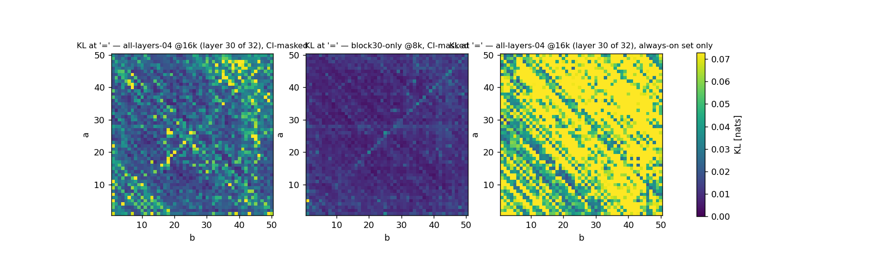
*Fig 7. Per-prompt KL at '=' over (a, b): CI-masked forward of both runs, and the all-layers always-on set alone.*

## 4. Why gradient descent does not merge them

Fig 4: ablating a single always-on component from the CI-masked forward.
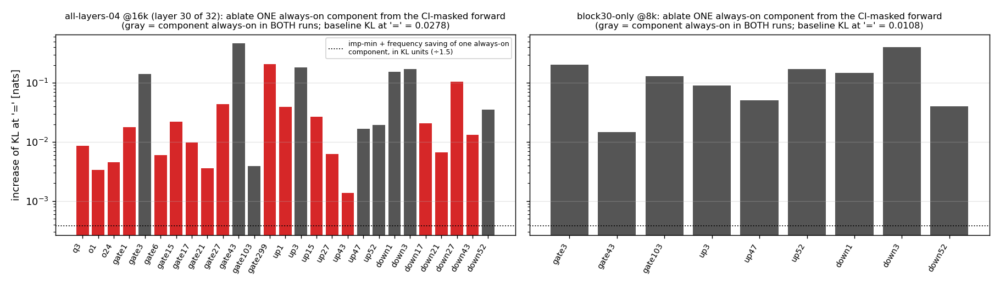
*Fig 4. Increase of KL at '=' when one always-on component is removed from the CI-masked forward (gray = always-on in both runs; dotted = penalty saving of one component).*

| all-layers extra pieces | ΔKL at "=" | block30 pieces | ΔKL at "=" |
|---|---|---|---|
| gate c1 / c6 / c15 / c17 / c21 / c27 / c299 | 0.018 / 0.006 / 0.022 / 0.010 / 0.004 / 0.044 / 0.206 | gate c3 / c43 / c103 | 0.203 / 0.015 / 0.130 |
| up c1 / c15 / c27 / c43 | 0.039 / 0.027 / 0.006 / 0.001 | up c3 / c47 / c52 | 0.090 / 0.050 / 0.172 |
| down c17 / c21 / c27 / c43 | 0.021 / 0.007 / 0.104 / 0.013 | down c1 / c3 / c52 | 0.147 / 0.402 / 0.040 |
| all 15 MLP extras at once | 0.327 | | |

Dropping one always-on component saves about 6e-4 per token in loss units (imp-min 5e-5 on
both heads, frequency f·log2(1+640f) ≈ 9.3 x 2.5e-5 on both), i.e. 4e-4 in KL units after the
1.5 recon weight. Every piece except up c43 is worth 10-500x that. Three mechanisms then hold
the configuration:

- **Imp-min acts only on CI, never on V/U.** Collapse would have to run as: CI of piece c goes
  down, recon degrades, the other pieces' V/U move to absorb c's function, c becomes redundant,
  its CI reaches 0. Step one is blocked while c is load-bearing, and nothing rewards the other
  pieces for absorbing a function that is still being provided.
- **Saturation removes the remaining force.** With preactivations at 1.3-2.1 the lower squash
  passes zero gradient (recon cannot push further) and the upper squash leaks 0.01, so the
  imp-min pull on a parked component is ~5e-7 per token.
- **The pieces are not interchangeable across positions.** Mean CI by position (BOS, a, +, b,
  =) for the all-layers gate set: c1 is on only at "=", c3 and c6 on at positions 1-4, c15 on
  at positions 2 and 4 only. A merged piece would be on at the union, paying imp-min there and
  on the fineweb stream at 4x the target coefficient (§6 for the fineweb measurement).

Why block30 nevertheless ended at 3: its recon was satisfied from step 100 (train KL 0.03,
layer-30 L0 8.5 at step 500) while imp-min sat at its 4x initial coefficient, so marginal
pieces were pushed below CI 1 before they became load-bearing. The deep run spent its first
2 000 steps at train KL 1.4 (Fig 5).
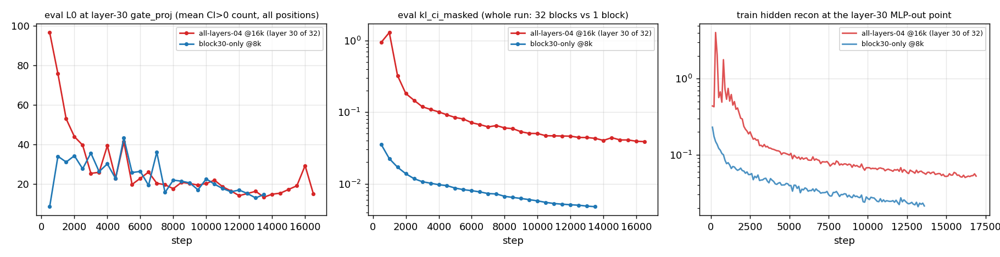
*Fig 5. Layer-30 gate L0, whole-run kl_ci_masked and the layer-30 hidden-point recon over training, both runs.*

## 5. Why the last layers, and why early

Fig A (eval L0 per layer over training, output head, all positions):
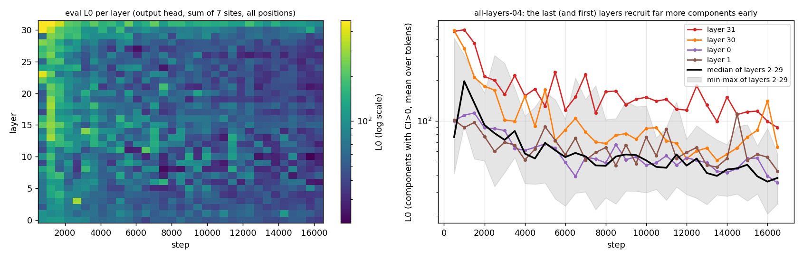
*Fig A. all-layers-04: eval L0 per layer vs step (heatmap), and layers 30, 31, 0, 1 against the median and range of layers 2-29.*

| step | layer 31 | layer 30 | median of layers 2-29 |
|---|---|---|---|
| 500 | 459 | 465 | 76 |
| 1 000 | 472 | 344 | 197 |
| 2 000 | 213 | 181 | 94 |
| 16 500 | 89 | 64 | 38 |

At step 500 layers 30 and 31 hold 6x the components of a typical layer; layers 22-23 and 28 are
the next largest and layers 0-1 are the other outliers. Fig B (grid snapshots, "=" only):
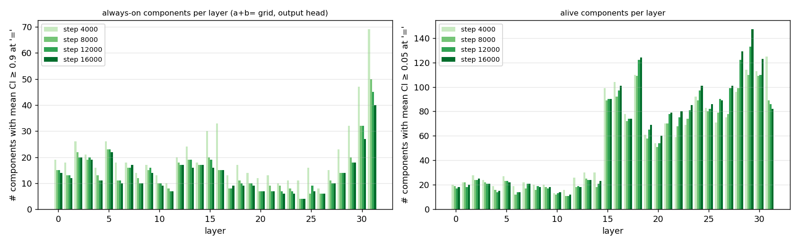
*Fig B. Number of always-on (≥0.9) and alive (≥0.05) components per layer at the 4k/8k/12k/16k grid snapshots.*
 always-on counts at 4k/16k are 47/27 for layer 30 and 69/40 for layer 31
against 8-33 / 4-22 elsewhere. The last layers are the only place the output can still be
corrected before the unembed, their component gradients are the largest in the network (norm
1.74 at layer 31, 0.42 at layer 30, 0.18-0.29 for layers 9-29 at step 16 900), and during the
noisy start every direction that helps the logits gets recruited.

Figs C and D: of the 116 components always-on at 4k in
layers 30-31, 66 are still ≥0.9 at 16k and 33 are dead, with almost nothing in between; layers
2-29 show the same bimodality (326 of 499 stay, 113 die). The parking mechanism is not specific
to the last layers; what is specific is how many pieces they recruit before it engages.
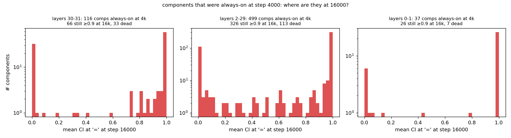
*Fig C. Components always-on at step 4000: their mean CI at step 16000, by layer group.*

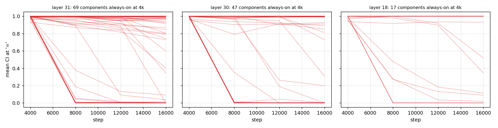
*Fig D. Mean-CI trajectories (4k to 16k) of every component always-on at 4k, layers 31, 30 and 18.*

## 6. Noisy upstream: the ten pieces beat the three where the deep run actually trains

Same emulation, but layers 0-29 are replaced by the all-layers run's own components before
layer 30 is swapped in (2 500 prompts, `emu_up/results.json`). Three upstream contexts: the
CI-masked forward (deterministic, no delta), stochastic masks `ci + (1-ci)·U` with the delta
channel on a random mask (the training term's stochastic family), and the same without delta.
The upstream perturbation at "=" is a relative squared error of 0.25 / 0.17 / 0.21 on the
layer-30 input.

| upstream context | layer-30 CI-masked, KL at "=" all-layers / block30 | all comps on | always-on set only |
|---|---|---|---|
| clean (§3) | 0.028 / **0.011** | 0.026 / **0.004** | 0.095 / 0.124 |
| layers 0-29 CI-masked | 0.073 / 0.073 | 0.078 / 0.072 | 0.117 / 0.168 |
| layers 0-29 stochastic + delta | **0.049** / 0.071 | **0.050** / 0.063 | 0.128 / 0.223 |
| layers 0-29 stochastic, no delta | **0.061** / 0.073 | **0.063** / 0.067 | 0.126 / 0.200 |

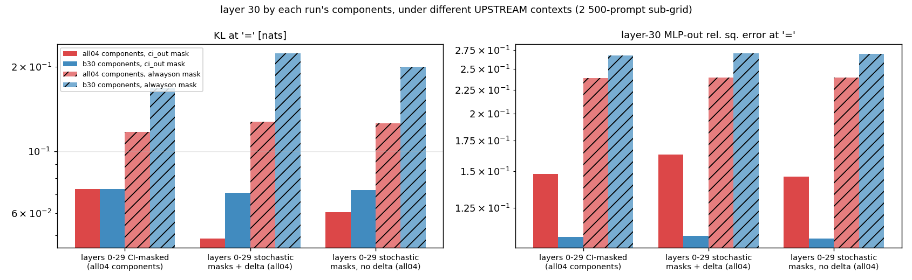
*Fig 8. KL and hidden-point error at '=' for layer 30 by each run's components, under clean vs all-layers-masked upstream contexts.*

The ranking flips. With the upstream noise the deep run trains under, its layer-30 components
reconstruct the logits better than block30's (0.049 vs 0.071 under stochastic masks), and the
ten always-on pieces alone beat the three alone by a wider margin (0.13 vs 0.22) than the
reverse margin in the clean setting. The block30 components are tuned to the clean layer-30
input and lose 7x when it is perturbed (0.011 to 0.071); the all-layers components lose less
than 2x (0.028 to 0.049). The extra pieces keep their per-piece value under noise (Fig 9): the
ablation costs are 0.002-0.37 nats in every context, so the deep run's solution is a local
optimum of the objective it was actually trained on, not of the clean-upstream objective the
block30 run sees.

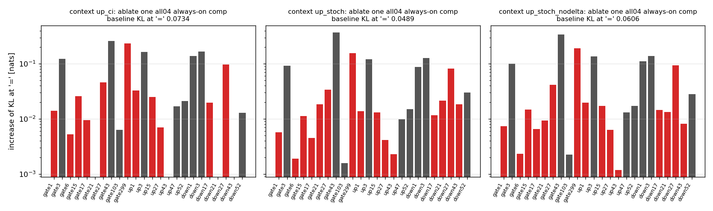
*Fig 9. Single-component ablations of the all-layers always-on set under each upstream context (gray = also always-on in block30).*

## 7. Could fewer rank-1 pieces carry the write? No.

Each run's always-on set (gate, up and down together) replaced by its best rank-k
least-squares merge, fitted in function space on all five positions with the pieces' own CI
masks, then evaluated with the rest of the CI-masked forward unchanged (`followup.json`,
50x50 grid, clean upstream). "fit" is the fraction of the set's output energy the merge
reproduces.

| replacement | all-layers (10/7/7 pieces): KL at "=" | fit gate/up/down | block30 (3/3/3): KL at "=" | fit |
|---|---|---|---|---|
| none (CI-masked baseline) | 0.028 | | 0.011 | |
| rank 1 per site | 0.303 | 0.93 / 0.89 / 0.82 | 0.242 | 0.91 / 0.92 / 0.89 |
| rank 2 per site | 0.134 | 0.99 / 1.00 / 0.99 | 0.023 | 1.00 / 0.97 / 1.00 |
| rank 3 per site | 0.074 | 0.998 / 1.000 / 0.995 | | |
| rank 5 per site | 0.071 | 1.000 / 1.000 / 0.999 | | |

A single rank-1 component per site reproduces 82-93 % of the always-on set's output energy
and still costs 0.2-0.3 nats: the 7-18 % it misses is the (a, b)-dependent part, and that is
what the logits need. Even block30's three pieces cannot be compressed to two without doubling
the KL. So "collapse into one component" was never available; the write is rank 2-3 on the
task, and the deep run's ten pieces are over-complete by about 3x, not 10x. Even the rank-5
merge (0.071) is worse than the ten original pieces because the merge is fitted to the pieces'
own output, whose residual against the clean MLP output (§2) is where the remaining KL lives.

## 8. The non-target stream is not what keeps them apart

CI on 384 fineweb rows x 64 tokens (`followup.json`). Layer-30 L0 per token, output head:
all-layers gate/up/down 8.0 / 9.0 / 10.7, block30 2.6 / 1.9 / 2.0. Every "="-always-on
component fires (CI > 0.5) on fewer than 0.6 % of fineweb tokens in both runs (block30 up c3 is
the maximum at 1.6 %). The always-on pieces are task-specific; the 4x non-target imp-min never
sees them, and merging them would not change their cost on the broad stream.

## 9. Pending

- **The upper-leak test**: `addsub-4L28-31-leak0.01` (control, stopped at the step-4000 grid,
  job 11726) vs `addsub-4L28-31-leak0.1` (job 11727; branch `feature/upper_leak`,
  `decomposition.ci.upper_leak`). Configs `~/pd_scratch/dual_obj_jax/addsub-4L28-31-leak*.yaml`
  (generated by `make_last4_run.py` from -05: blocks 28-31, halved hidden KL riders,
  adv/stoch 0.9 on all passes, CI-scaled WD on target/hidden CI, 20k schedule, slow eval every
  2000).
