# Final-logit magnitude: dual vs output-only (addsub-L18-23-neuronaligned pair), target stream

Question: both decompositions reproduce the model's output distribution; do they differ in the
pre-softmax logits or the pre-RMSNorm residual in ways the norm/softmax erase?

Protocol (same as `emulate_decomp.py`): frozen Llama-3.1-8B in fp32 on CPU, "a+b=" grid 1..100,
layer 18 replaced at "=" only by the CI-masked, delta-off component forward (checkpoint 20000 +
step-20000 ab-grid CI; unsaved components CI 0). "all comps on" = every component at CI 1.
Job 11122 (2026-09-07). Raw data (`logitmag/*.npz`) and scripts (`logit_mag.py`, `logit_mag_plots.py`,
`logit_mag.sbatch`) live in `~/pd_scratch/dual_obj_jax/attn_alive/`; figures are copied to
`notes/plots/logit_magnitude/` (fig 1-7, `table.json`).

## Answer: no. The logits differ by tiny, structureless amounts in both runs.

Median over 10 000 prompts (logit std over the vocab is 2.34):

| condition | KL | acc | logit offset | slope | rms logit diff | of which shape | ‖final resid‖ / target | cos(final resid) |
|---|---|---|---|---|---|---|---|---|
| dual, output CI | 0.0065 | 0.947 | -0.000 | 0.998 | 0.13 | 0.12 | 0.992 | 0.998 |
| dual, hidden CI | 0.0039 | 0.951 | -0.004 | 0.999 | 0.08 | 0.07 | 0.997 | 0.999 |
| output-only, output CI | 0.0087 | 0.938 | -0.012 | 0.997 | 0.17 | 0.16 | 1.011 | 0.997 |
| dual, all comps on | 0.0018 | 0.949 | -0.003 | 0.999 | 0.07 | 0.06 | 0.998 | 1.000 |
| output-only, all comps on | 0.0037 | 0.946 | +0.004 | 0.999 | 0.13 | 0.12 | 1.015 | 0.998 |

- No hidden constant offset (softmax-invisible) and no temperature/scale change: per-prompt mean
  shift is within ±0.2 logits and the regression slope within 0.98-1.02 in every condition
  (fig 3, fig 5). The rms logit difference is 90% "shape" (per-token, not affine), i.e. the
  same error the KL already sees. Logit std, max logit, logsumexp, answer logit, margin and
  entropy all match the target to ~0.1 (fig 3); scatter plots sit on the identity (fig 4).
- The only magnitude effect lives in the RESIDUAL, and it is small: the output-only forward
  runs the residual norm 5.5% LOW right after layers 19-20 (dual: 3%; dual under hidden CI:
  <1%), then recovers and overshoots to +1.1% at the final RMSNorm input, while the dual run
  ends 0.8% low (fig 1, 2). The final RMSNorm removes all of this (post-norm norm 131.15-131.21
  in every condition vs 131.19 target). Direction is preserved (cos 0.997-0.999).
- The layer-18 deficit is magnitude-structured (fig 7): the output-only norm shortfall after
  layer 19 is worst for small a+b (0.90 at a+b < 25) and vanishes at a+b > 150; the dual's is
  flatter. The final-residual excess of the output-only run is largest for mid-range sums
  (a+b 50-175, +2%). None of this shows in the logits.
- Where the shrinkage comes from: at "=", the layer-18 attention output is reproduced at 65%
  of its norm by the dual (output CI; 84% hidden CI) and 48% by the output-only run (fig 2,
  right — one channel, o#73, see report_attn_alive.md); the MLP-18 output at 84% (dual, output
  CI), 94% (dual, hidden CI) and 93% (output-only). The output-only MLP output has the right
  size but the wrong direction (76% relative MSE), the dual's the right direction but is
  under-sized under the output CI.
- Even with ALL components on (no CI masking, delta off) the output-only run keeps a +1.5%
  final residual excess and a 3% layer-19 deficit; the dual is within 0.2% at the end and
  <0.5% everywhere. This is the sum-of-components-minus-delta faithfulness at "=", not a
  CI/sparsity effect.

So: the differences between the two decompositions are not in logit magnitude. They are in
the residual stream between layers 18 and ~24 (a few percent of norm, magnitude-structured),
which the final RMSNorm erases, and in the per-token logit shape, which the KL already
measures (output-only 0.0087 vs dual 0.0065 / 0.0039).

## Figures

Fig 1: Residual-stream norm at '=' per layer, relative to the target model

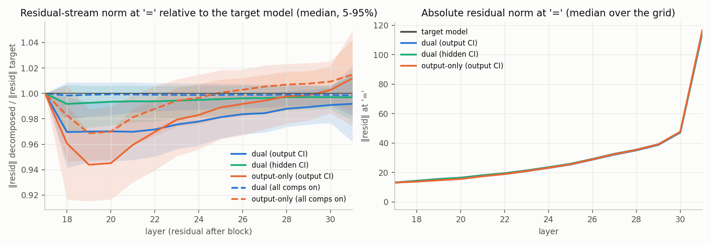

Fig 2: Final residual norm ratio, direction, and layer-18 write norms

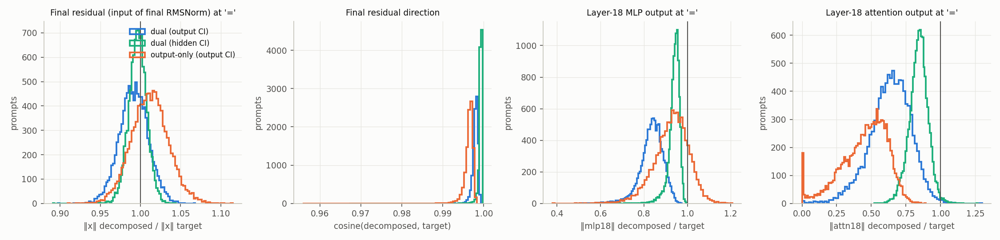

Fig 3: Per-prompt logit statistics, decomposed minus target

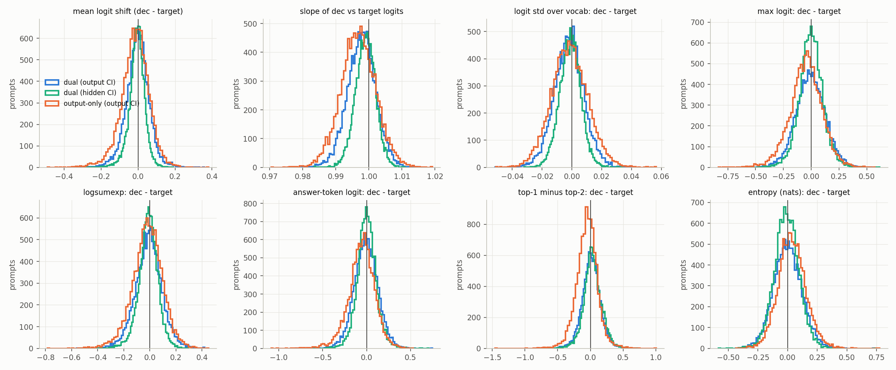

Fig 4: Decomposed vs target logits, full vocab

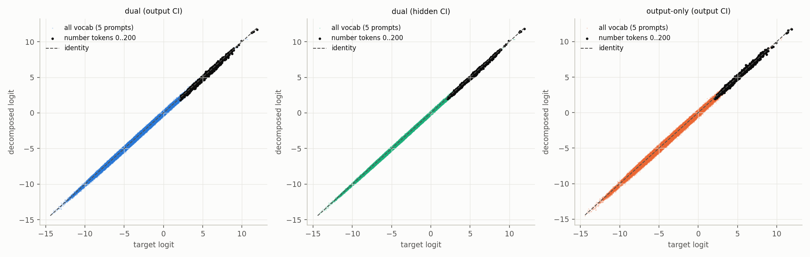

Fig 5: Logit difference split into offset / scale / shape

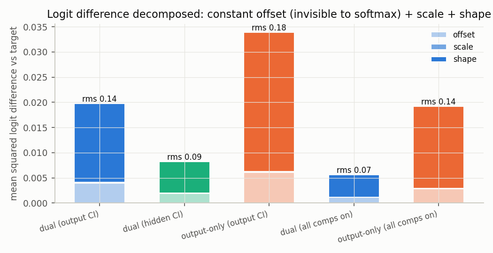

Fig 6: (a, b) grids of final residual norm ratio and mean logit shift

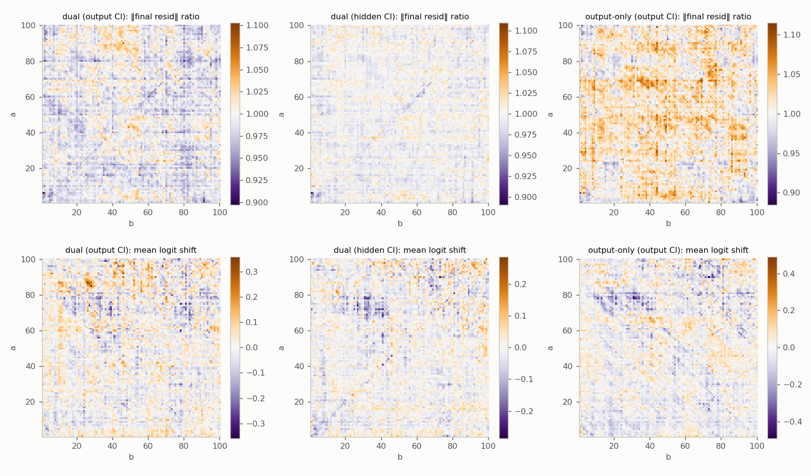

Fig 7: Norm ratios and KL by a+b

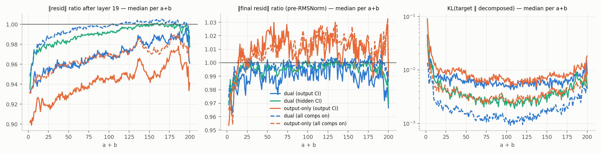

## Logit lens along the network (added 2026-09-07, job 11123)

Same emulation; at every layer output 17..31 at "=" we apply the final RMSNorm + unembed
(the standard logit lens, "normed") and also the bare unembed without the norm ("raw"), and
track the lens logit of the target model's final top-1 token. Data `logitlens/*.npz` in the
scratch dir, figures `plots/logit_magnitude/lens*.png`, per-layer table `lens_table.json`.

Deviation (decomposed − target) of the normed lens logit of the final top-1 token, mean over
prompts and std across prompts (target median at layer 18 is 3.5, at layer 31 11.9):

| layer | dual, output CI | dual, hidden CI | output-only | dual, all on | output-only, all on |
|---|---|---|---|---|---|
| 18 | −0.43 ± 0.58 | −0.21 ± 0.39 | −1.18 ± 1.07 | −0.11 ± 0.34 | −1.02 ± 0.97 |
| 20 | −0.34 ± 0.51 | −0.12 ± 0.32 | −0.64 ± 0.82 | −0.04 ± 0.27 | −0.45 ± 0.66 |
| 22 | −0.22 ± 0.47 | −0.07 ± 0.27 | −0.23 ± 0.68 | −0.03 ± 0.24 | −0.05 ± 0.51 |
| 24 | −0.18 ± 0.53 | −0.05 ± 0.29 | −0.05 ± 0.70 | −0.03 ± 0.25 | +0.12 ± 0.49 |
| 27 | −0.19 ± 0.53 | −0.04 ± 0.32 | −0.08 ± 0.67 | −0.02 ± 0.27 | +0.15 ± 0.46 |
| 31 | −0.01 ± 0.13 | −0.00 ± 0.11 | −0.05 ± 0.15 | −0.01 ± 0.07 | +0.01 ± 0.10 |

- **Systematic part: a deficit right after layer 18 that the later layers repair.** The lens
  logit of the eventual answer is lower than the target's at the layer-18 output in every
  condition (dual −12%, output-only −33% of the target's 3.5), and the deficit decays
  monotonically: the output-only run's is gone by layer 24-25 (it even overshoots slightly
  under all-components-on), the dual's shrinks to −0.2 and stays there until layer 27, then
  vanishes at layers 28-31. In log-prob terms (lens1, row 2) every condition is within
  ±0.01 of the target from layer 25 on. The raw (un-normed) lens shows the same ordering at
  a much smaller scale (−0.05 to −0.13), i.e. most of the layer-18 lens deficit is a
  direction effect, not the residual-norm shortfall of section 1.
- **Non-systematic part: the prompt-level spread is larger than the mean everywhere and
  persists to the end.** From layer 22 onward |mean| is 0.01-0.2 while the std across
  prompts stays at 0.5 (dual) / 0.7 (output-only) through layer 27, and 0.11-0.15 at
  layer 31 (lens2, lens3). So the mid-network lens deviations are prompt-specific errors of
  ±0.5 logits with a small common offset, not a uniform shift; and at the output the
  remaining deviation (std 0.13-0.15, mean ~0) is entirely prompt-level. The all-components-on
  dual forward has half that spread (0.07 at layer 31).
- **The prompt-level deviation is reshuffled by the later layers, not carried through.**
  The correlation across prompts between the deviation at layer 18 and at layer L falls to
  0.4 by layer 24 and to 0.1 (dual) / 0.03 (output-only) at layer 31; conversely the final
  deviation is only weakly predicted by any mid-network layer (corr 0.2-0.4 at 24-28,
  lens4). What the decomposition gets wrong at layer 18 for a given prompt is largely
  absorbed, and the final per-prompt error is a different, smaller pattern.
- **Where the deviation lives on the (a, b) grid (lens5).** At layer 19 the output-only
  deviation is organized along anti-diagonals (constant a+b: the answer/magnitude channel),
  strongest for a+b in 20-70 and for the largest sums; the dual output-CI deviation sits in
  blobs (a in 40-55 and 75-90 with b < 30); the dual hidden-CI deviation is small except on
  the a = b diagonal. By layer 31 all three are unstructured ±0.3 noise.
- **Argmax and rank are unchanged (lens6).** The answer reaches lens rank 1 at layers 22-23 in
  every condition. The decomposed lens argmax disagrees with the target's lens argmax on
  40% (dual) / 69% (output-only) of prompts at layer 18 (where the target's own lens is far
  from the answer), on <5% from layer 23 on.

Figures: lens1 (curves and deviation bands), lens2 (|mean| vs std per layer), lens3
(deviation histograms at layers 18-31), lens4 (persistence), lens5 (grids), lens6 (rank).

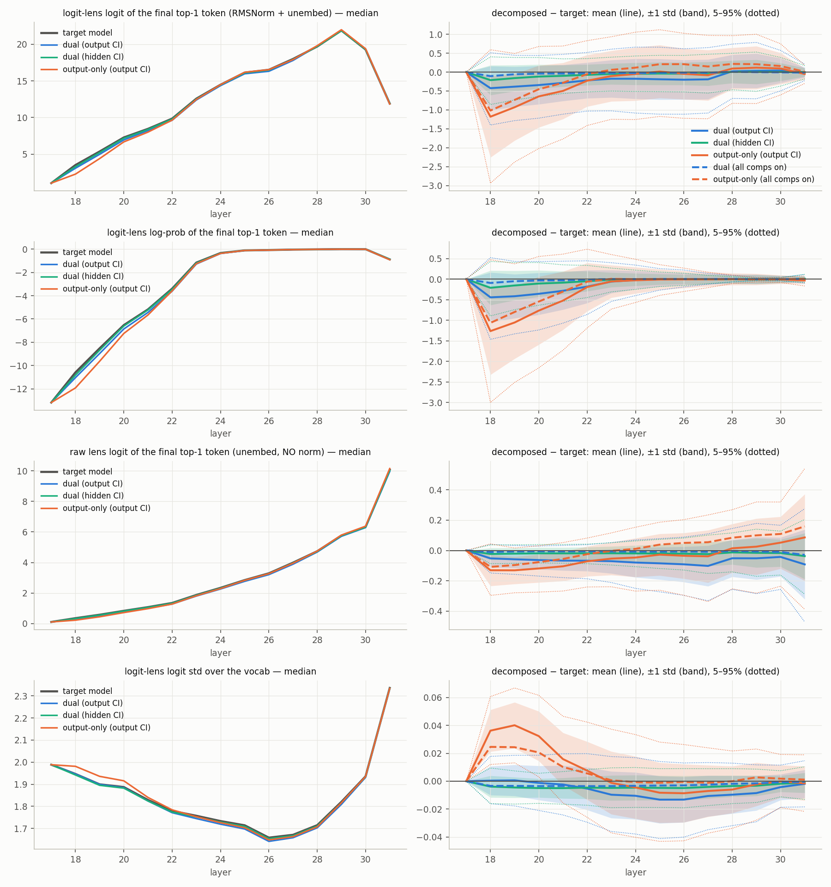
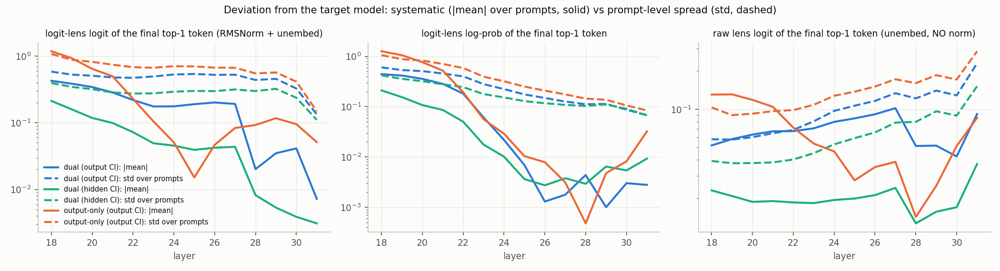
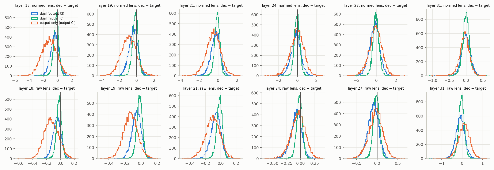
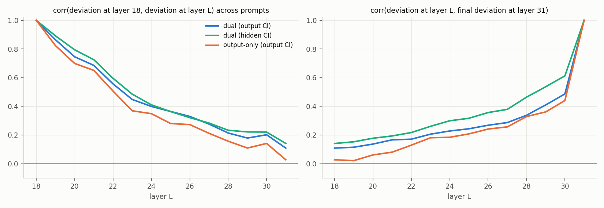
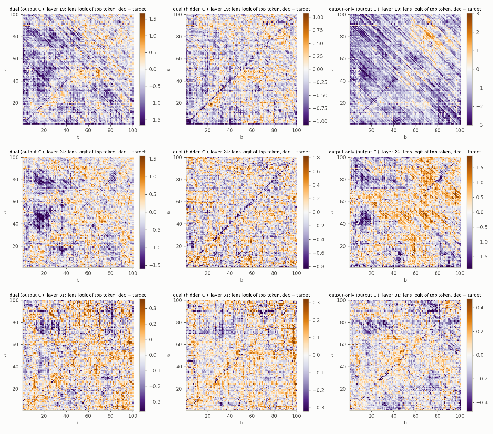
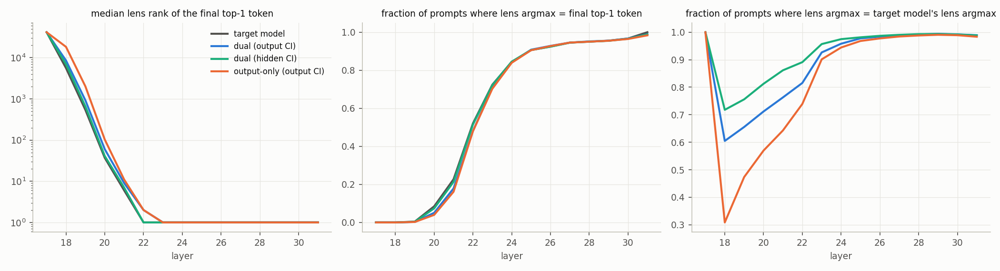

## Follow-up run: the dual recipe without CI-scaled weight decay

`addsub-L18-23-neuronaligned-nowd` (launched as addsub-L18-24-neuronaligned-nowd, renamed the same day) (p-2b67abec, job 11124, launched 2026-09-07 17:07,
3.13 s/step): byte-identical to p-6540dfdd except `pd.ci_scaled_weight_decay: 0.3 -> null`
(both optimizers' `weight_decay` were already 0). Tests whether SPEC T11's per-step shrink
of V/U explains the dual run's 3% residual-norm shortfall after layer 18 (section 1).
Config/sbatch in `~/pd_scratch/dual_obj_jax/addsub-L18-23-neuronaligned-nowd.*`.

### Pre-norm top-token logit at the last layer (lens7)

Raw lens at layer 31 (pre-RMSNorm residual · W_U) for the final top-1 token; target median 10.06
(5-95%: 8.5..12.3). The two schemes shift it in OPPOSITE directions, by about 1%, and the
per-prompt difference tracks the residual-norm ratio (corr 0.77-0.88): this is the section-1
norm effect seen through the unembed, and the final RMSNorm removes it.

| condition | median | diff mean ± std | ratio median (5-95%) | prompts with \|diff\| > 0.5 |
|---|---|---|---|---|
| dual, output CI | 9.96 | −0.09 ± 0.23 | 0.991 (0.956..1.028) | 4.7% |
| dual, hidden CI | 10.02 | −0.04 ± 0.15 | 0.997 (0.973..1.020) | 0.5% |
| output-only | 10.15 | +0.09 ± 0.29 | 1.009 (0.963..1.054) | 9.1% |
| dual, all comps on | 10.02 | −0.03 ± 0.12 | 0.997 | 0.2% |
| output-only, all comps on | 10.22 | +0.16 ± 0.21 | 1.016 | 4.9% |

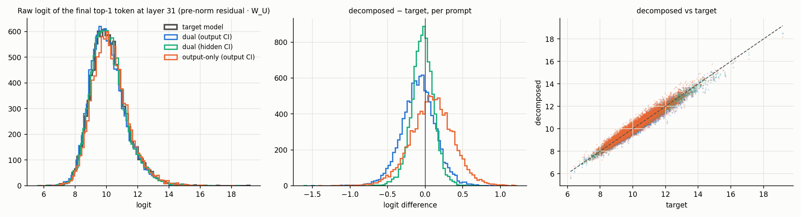

### Result: weight decay is not the cause (2026-09-08, job 11126)

The no-WD twin (p-2b67abec, finished 2026-09-08, one leg) reproduces the with-WD run on every
count. Run-own final evals: target kl_ci_masked 0.00347 vs 0.00344, L0 20.2 vs 20.5, target PGD
0.0041 vs 0.0041; the decay term's per-step shrink rate had fallen to 5e-6 by the end of the
with-WD run. Same emulation (output CI, layer 18 masked at "="):

| | with WD 0.3 (p-6540dfdd) | no WD (p-2b67abec) |
|---|---|---|
| raw top-token logit at L31, median (target 10.06) | 9.96 | 9.98 |
| diff vs target, mean ± std | −0.09 ± 0.23 | −0.07 ± 0.24 |
| prompts off by > 0.5 | 4.7% | 4.6% |
| normed (post-RMSNorm) diff, mean ± std | −0.01 ± 0.13 | +0.01 ± 0.14 |
| ‖resid‖ ratio after layer 18 / 19 / 31 | 0.970 / 0.970 / 0.992 | 0.973 / 0.973 / 0.993 |
| accuracy | 0.947 | 0.946 |

So the 3% residual-norm shortfall after layer 18 and the −1% pre-norm top-token logit at the
last layer are properties of the dual-objective decomposition itself (the CI-masked forward
reproducing the layer-18 attention/MLP writes at 65-84% of their norm, section 1), not of
the CI-scaled weight decay. The no-WD run's per-prompt spread is the same (std 0.24 vs 0.23).

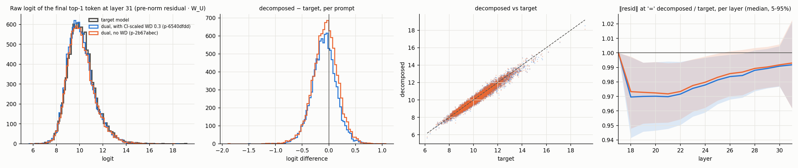

### Why the dual decomposition's writes are under-sized (2026-09-08)

MLP-18 output at "=" of the dual run (output CI), projected onto the target's MLP-18 output
(scale = ⟨y_dec, y_target⟩/‖y_target‖², mean over the grid; clean MLP-18 input, layer-18 weights
from the HF shard, components from the 20k checkpoint):

| forward | scale | norm ratio |
|---|---|---|
| all 456/456/512 components on, delta off | 0.93 | 0.96 |
| only the alive components (grid CI > 0.05, ~10-13 per site) fully on | 0.81 | 0.88 |
| alive components at their CI (= the ci-masked eval; unsaved at 0 or 0.03, same) | 0.77 | 0.85 |
| training-mean mask (1+CI)/2 | 0.83 | 0.88 |
| hidden-CI mask | 0.90 | 0.94 |

The no-WD twin gives the same numbers to ±0.01. Three additive causes, all deficits:
1. **The low-CI tail is dropped by the CI mask (12 points).** The ~440 components per site
   with grid CI < 0.05 collectively carry 12% of the write's scale; the importance-minimality
   pressure pushed their CI to ~0 while their V/U still contribute in the all-on forward.
2. **The delta is off (7 points).** Even fully on, the components reproduce only 93% of the
   write; the training forwards always carry the delta at a U[0,1] mask (mean 0.5), only the
   0.5-weighted UnmaskedReconLoss sees delta = 0.
3. **Fractional CI of the alive components (4 points).** 30% of alive components have
   CI < 0.99 (10th percentile 0.41). Training masks are `ci + (1 - ci)·U`, mean (1+ci)/2, so
   the deterministic ci-masked forward is the LOW edge of the mask distribution the losses
   are optimized under (scale 0.77 vs 0.83 at the training mean).

Nothing pushes back: the output losses are on post-RMSNorm logits, which are invariant to the
residual scale, and a 15-25% shrink of the layer-18 writes at "=" moves the residual norm by
only 3% and the final logits by nothing after the norm. The attention write follows the same
pattern more strongly (65% of norm under output CI, 84% hidden CI, 88% all on).
