# Temperature components: how a targeted decomposition captures Llama's confidence machinery

*2026-09-29 · run `p-ba5a0c05` (addsub-all-layers-4xh100-05), step 40000 · model Llama-3.1-8B*

When we decomposed Llama-3.1-8B on simple arithmetic prompts (`37+45=`), a handful of components in the
very last MLP turned out to do something unusual. They do not decide *which* number the model outputs;
they decide *how confident* it is. Remove one of them and the model's output distribution becomes much
sharper, as if someone had turned down the "temperature" of the softmax.

This post checks that claim carefully. It compares these components with the "entropy neurons" that
Stolfo et al. (2024) found in other language models. It then asks what the components look like on
ordinary web text, where they were never trained to be faithful.

## TL;DR

| Claim | Verdict |
|---|---|
| **1.** The decomposition only recovers the slice of the confidence mechanism that is active on the arithmetic prompts. The signal driving it is constant across those prompts, so it gets merged with other mechanisms whose input is also constant. The merged components can be separated at the neuron level. | **Supported.** On arithmetic the components' activation varies by only 3–6 % (Fig. 1). Inside Llama, the component's effect routed through the entropy neurons alone is a pure temperature change. Routed through the number neurons alone it is a pure "prefer numbers" change (Fig. 11). On web text these two neuron groups are almost uncorrelated (r = +0.06, Fig. 12). |
| **2.** The entropy part writes to directions that do not change the token ranking: the (approximate) null space of the unembedding, plus the mean-unembedding direction that shifts every logit by the same amount. | **Supported, with a correction.** Llama-3.1-8B has no sharp null space, but it has a soft one: 54–66 % of the components' write energy lies in the lowest-gain eighth of the unembedding's directions (random direction: 12.5 %). The mean-unembedding direction is not a minor direction: it is the unembedding's *largest* singular direction (\|cos\| = 0.996, gain 15× the median). It carries 1–2 % of the write energy but 62–74 % of its direct logit change (Fig. 5). |
| **3.** The non-entropy part is a mix of number preference and preference for frequent tokens (like token-frequency neurons). | **Partly.** The non-temperature remainder does push number tokens (up to +2.6 sd) and frequent tokens (corr up to +0.37). Together these explain only 9–18 % of it, though. Much of the rest is about the *format* of the continuation ("+" boosted, "?"-style endings suppressed). The number push even has opposite signs in different components (Fig. 7). |
| **4.** On the inputs where they are active, the components write in directions similar to those of Llama's own entropy neurons on the same inputs. | **Supported.** The median cosine with the entropy neurons' write is +0.60 to +0.71 on arithmetic and +0.29 to +0.59 on web text. 34–60 % of each write lies in the 6-dimensional span of those neurons' output weights (random neurons: 0 %) (Fig. 9). |
| **5.** The components' U vectors touch many neurons, but most of those channels are inert because of the gating nonlinearity. The neurons that actually matter are the model's entropy / token-frequency neurons. | **First half supported, second half only partly.** 46–71 % of the U weight lands on neurons whose gate is shut, and gate state predicts which channels are live (Fig. 10). The entropy neurons are the largest *individual* contributors: they give 12–18 % of the write from < 2 % of the U weight. But hundreds of other neurons carry most of the effect. Token-frequency neurons play a small role (Fig. 11). |
| **6.** Is the entropy control specific to number predictions, or a generic mechanism merged with a number mechanism? | **Both.** Through the entropy neurons the effect is a global temperature change, identical among number tokens and among the rest. The rest of the neuron population adds a number-specific part: removing the component sharpens the choice *among numbers* 7–18 % more than among other tokens (§8, Fig. 16). |
| **7.** Are Llama's entropy neurons effective, i.e. do they lower the loss by hedging? | **On general text, yes.** Mean-ablating the six costs +0.0043 nats/token, with the cost concentrated on tokens the model got badly wrong (the paper's Fig. 4a pattern). At individual positions, though, they pick the loss-reducing temperature direction only 53 % of the time (chance: 50 %). Their benefit comes from hedging the confidently-wrong tail. Unlike GPT-2, they play no hedging role in induction (§9). |

<b>Reading guide: the words used in this post</b>

- **Residual stream.** The running vector (4096 numbers per token) that every block of the transformer
  reads from and writes to.
- **RMSNorm.** Before each block reads the stream, and once more before the output layer, Llama divides
  the stream by its root-mean-square size: `x / rms(x) · gain`, with `rms(x) = sqrt(mean(x²))`. The
  last one is the **final norm**.
- **Logits and temperature.** The output layer (unembedding `W_U`) turns the normalized stream into one
  score per vocabulary token (128,256 of them); the softmax turns scores into probabilities. Multiplying
  all logits by a factor β is a *temperature change*: β > 1 sharpens the distribution (lower entropy),
  β < 1 flattens it, and the ranking of tokens never changes. Adding the same constant to every logit
  changes nothing at all (the softmax is shift-invariant).
- **How a write can change temperature.** Suppose a block adds a vector that the unembedding cannot "see"
  (it changes no logit, or changes all logits by the same amount). This still increases `rms(x)`, so the
  final norm divides everything by a bigger number. All the *visible* logits shrink, and the output gets
  flatter. That is how a model can control its confidence without touching its prediction.
- **Entropy neurons** (Stolfo et al., 2024, "Confidence Regulation Neurons in Language Models"). These
  are last-layer MLP neurons with the property just described. Their output weight lies in the
  unembedding's (effective) null space, so their effect works almost entirely through the final norm.
  The paper's test compares two effects of mean-ablating a neuron:
  - the **total effect TE**: the ablation with everything free;
  - the **direct effect DE**: the ablation with the final norm's scale frozen at its original value.

  An entropy neuron has DE ≪ TE. The paper also describes **token-frequency neurons**, which move every
  logit in proportion to that token's log frequency.
- **Targeted parameter decomposition (tPD).** This splits every weight matrix into rank-one
  *components* `U_c V_cᵀ` plus a leftover **delta**, and learns which components each input needs (its
  CI, "causal importance"). The *targeted* variant only has to reproduce the model on the target data
  (here, arithmetic prompts). Everything the target does not need goes into the delta. So a component
  is the part of a mechanism that the target data uses, not necessarily the whole mechanism.
- **Inner activation.** A component's scalar activation `h = x · V_c`, where x is the input its matrix
  reads. For a gate/up component in the last MLP, x is the normalized stream and the component adds
  `h · U_c` to the gate/up pre-activations of the 14,336 MLP neurons.

<b>Setup: model, data, components, and how every ablation is done</b>

- **Model.** Llama-3.1-8B, bf16 weights, all forwards recomputed in fp32 (JAX, `precision=highest`) by
  our own forward (`param_decomp/arith_repr/rmsnorm/temperature.py:TextModel`). The same computation in
  `run.py` agrees with the harvested bf16 run's argmax on 98.4 % of prompts.
- **Target data ("addsub").** 20,000 prompts `<BOS> a op b =` with a, b ∈ 1..100 and op ∈ {+, −}. All
  arithmetic measurements are at the `=` position, the one that predicts the answer. The heavier
  experiments use a fixed random subset of 2,000 prompts.
- **Non-target data ("fineweb").** `fineweb_llama_tok_64_eval`, the decomposition's own non-target
  evaluation set. We use the first 512 rows of 64 tokens. **These rows have no BOS token**, so position 0
  acts as an attention sink with its own large-effect components (109 components cost more than 0.01 KL
  there and nowhere else). Position 0 is excluded from everything below.
- **Decomposition.** The -05 run decomposes all 224 weight matrices (32 blocks × q, k, v, o, gate, up,
  down). It has 124,928 components, of which 11,604 are alive on addsub.
- **The components studied.** Candidates: last-block gate c14 / c238 / c288 and up c534 / c36 / c50.
  They were found earlier (`<run>/analysis/rmsnorm/README.md` §4) as the components whose ablation acts
  mostly through the final norm. Controls: L31 down c18, down c23, up c731, v c28 and L30 up c367,
  gate c45. These are late components with comparable ablation effects on addsub.
- **Ablating a component in the original model.** No CI and no decomposed model are involved in any of
  the claims below. We edit the component's rank-one term inside Llama's dense weight:
  `y = x Wᵀ + (f(h) − h) U_c` with `h = x · V_c`.
  - **Zero ablation**: f(h) = 0, removing the component.
  - **Mean ablation**: f(h) = the mean of h over the dataset, which removes only its *variation*. This is
    the paper's protocol.
  - **Dose response**: f(h) = α h.
- **Decomposition CI, only as a screen.** The -05 run's own output CI (lower-leaky, threshold 0.01),
  computed on 2,048 fineweb rows, is used to *flag* the positions where a component is active. The
  ablations then check those flags (§3).

<b>Metrics: how we measure "temperature", "norm-mediated", "direction"</b>

With `z_b` the base logits, `p_b` / `p_a` the base / ablated distributions, `x_b` / `x_a` the final
residual stream before the final norm, and `g` the final-norm gain:

- **Effect size**: `KL(p_b ‖ p_a)` at the position.
- **Norm-mediated fraction**: `1 − DE/TE` in KL, where DE uses `x_a / rms(x_b)` (final-norm scale frozen)
  and TE uses `x_a / rms(x_a)`. A value of 1 means the effect goes entirely through the final norm; 0 means
  none of it does. It is negative when the norm's reaction *cancels* part of the direct effect.
- **Temperature share, two versions:**
  1. **KL version** (Figs. 2, 3):
     `1 − min_β KL(softmax(β z_b) ‖ p_a) / KL(p_b ‖ p_a)`, with β on a 41-point log grid in [e⁻¹, e]. This
     is the fraction of the ablation's KL that the best pure temperature change reproduces.
  2. **Regression version** (Figs. 4, 6, 11): fit the change in log-probabilities
     `log p_b − log p_a ≈ c + (1 − β) z_b` by least squares over the vocabulary, weighted by
     `(p_b + p_a)/2` so that only tokens with probability mass count. R² is the explained fraction of the
     weighted variance. When averaging over positions we weight each position by its KL.
- **Residual (non-temperature) part** (Fig. 7): what that regression leaves over,
  `r = (log p_b − log p_a) − c − (1 − β) z_b`. We profile it over the 53,430 tokens seen in a
  3.2M-token fineweb sample:
  - its number-token offset (mean over pure-digit tokens minus mean over the rest, in units of r's sd);
  - its correlation with log unigram frequency;
  - the R² of a regression on [is-number, log-frequency].
- **Write** of a component: `dx = x_b − x_a` in the final stream (exactly its contribution for a
  last-block component).
- **Unembedding geometry**: eigendecomposition of `W_effᵀ W_eff` with `W_eff = W_U diag(g)`. The
  *uniform-logit direction* is `u ∝ W_effᵀ 1`; adding it shifts every logit by the same amount.

---

## 1. On arithmetic they are temperature dials

Zero-ablating each candidate at `=` changes the output a lot (KL 0.2–0.9 nats). But the change is mostly
a change of temperature: the best single rescaling β of the original logits reproduces 78–89 % of it
for c14 / c238 / c288 / c534. The effect also goes through the final norm: freezing the norm's scale
removes 76–84 % of it. Controls mostly score lower on both counts (Fig. 3).

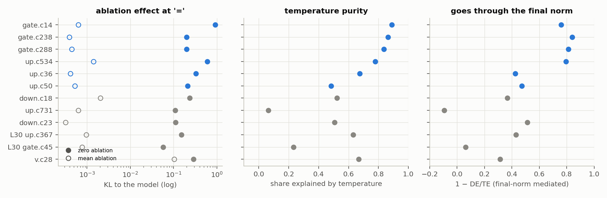

*Fig. 3. Addsub `=`, 20k prompts, candidates in blue, controls in gray. Left: KL of zero ablation (filled)
and mean ablation (open). Middle: temperature share (KL version). Right: fraction mediated by the final norm.*

| component | zero-abl. KL | temperature share | norm-mediated | entropy (4.63 nats) → | p(correct answer) 0.25 → | mean-abl. KL |
|---|---|---|---|---|---|---|
| gate c14 | 0.910 | 0.89 | 0.76 | 1.66 | 0.53 | 0.0006 |
| gate c238 | 0.200 | 0.86 | 0.84 | 2.96 | 0.42 | 0.0004 |
| gate c288 | 0.198 | 0.84 | 0.81 | 2.98 | 0.42 | 0.0004 |
| up c534 | 0.595 | 0.78 | 0.80 | 2.31 | 0.51 | 0.0014 |
| up c36 | 0.330 | 0.68 | 0.43 | 2.72 | 0.41 | 0.0004 |
| up c50 | 0.211 | 0.48 | 0.47 | 3.21 | 0.37 | 0.0005 |

The dose-response test is the most direct way to show a dial: scale the component's activation by α
instead of removing it. For every candidate, entropy moves monotonically with α (c14: 1.7 nats at α = 0,
8.3 nats at α = 3). At every dose, 77–89 % of the change is a pure temperature change (c238 / c288:
84–90 %). The content-carrying control up c731 barely moves entropy, and its change is 0–6 % temperature
(Fig. 2).

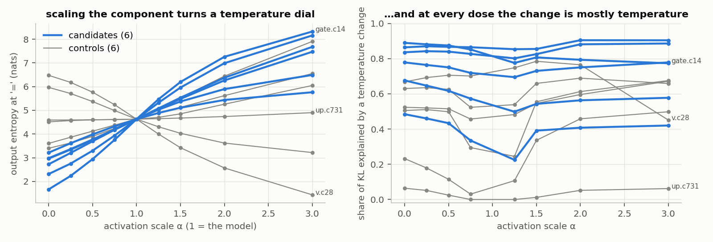

*Fig. 2. Addsub `=`, activation scaled by α (1 = the unmodified model). Left: output entropy. Right:
temperature share of the resulting change, KL version.*

Removing a temperature component makes the model *more* confident. It doubles the probability it puts on
the correct answer (0.25 → 0.53 for c14). Yet cross-entropy on the answer gets worse (+0.08 nats for
c14), because the prompts it gets wrong now get confidently wrong answers. This is the hedging behaviour
that entropy neurons are thought to implement.

Why "mean ablation costs nothing" matters

Mean ablation replaces the component's activation by its average over the 20k `=` positions. It costs
≤ 0.0014 KL for every candidate, 400–1500× less than zero ablation. The reason is in the activation
itself: at `=` it is 46.4 ± 1.4 for c14 (coefficient of variation 3 %) and 3–6 % for the others. On
arithmetic prompts these components therefore write an almost *fixed* vector: they set a default
temperature for "the answer to an arithmetic question comes next". They do not adjust confidence from
prompt to prompt. This is the premise of claim 1.

## 2. On general text they vary, and switch on when a number comes next

On fineweb the same activation spans a wide range (c14: median 0.8, 99th percentile 14, max 32). The
arithmetic `=` value (46) lies beyond anything in the sample. The strongest activations are
overwhelmingly positions where the next token is a number: 36–90 % among the top 1 % of activations,
against a 2 % base rate (Fig. 1). Rank correlation with the model's own entropy is weak (−0.01 to +0.22).
So the input is "a number comes next", not "I am uncertain".

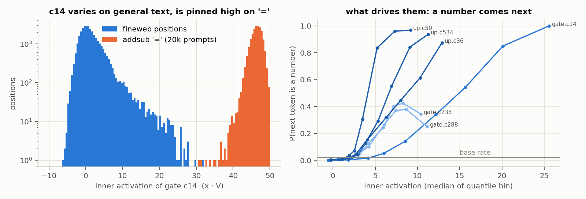

*Fig. 1. Left: c14's inner activation over 31,744 fineweb positions (blue) and the 20k addsub `=`
positions (orange); log count. Right: fraction of positions whose next token is a number, by
activation quantile bin (bins at the 0/50/80/90/95/98/99/99.5/99.9/100th percentiles).*

On fineweb we measure the effect of the *variation* (mean ablation), binned by activation (Fig. 4).
Three things grow with the activation: the effect, its temperature share, and its norm-mediated fraction.
In the top 0.1 % bin, c14 costs 0.025 nats, of which 55 % is temperature and 49 % is norm-mediated; c238
and c288 reach 72–79 % and 63–69 %. Over all positions, weighting by KL, the temperature share is:

- 0.71–0.76 for c238 / c288;
- 0.52–0.57 for c14 / c534 / c36;
- 0.42 for c50.

The controls reach 0.24–0.65 on general text. On fineweb, almost any last-layer edit is partly a
confidence change, so this measure separates the groups less sharply than on addsub.

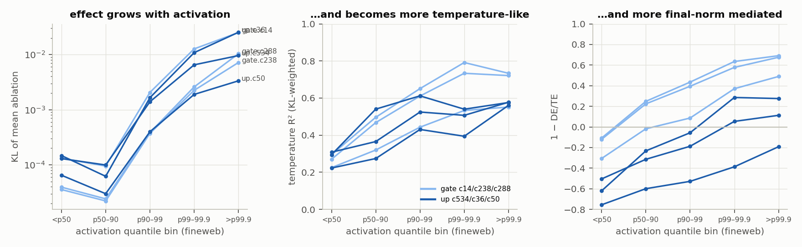

*Fig. 4. Fineweb, mean ablation, positions binned by the component's activation quantile. Left: mean
KL. Middle: KL-weighted temperature R² (regression version). Right: norm-mediated fraction.*

The decomposition's CI as a screen, checked by ablation

The -05 run's CI network was trained to be faithful on arithmetic; on web text it only faced a
regularizer. So we used it only to flag positions and checked the flags with ablations of the original
model:

- **Per-position agreement.** Across all 7,808 components of blocks 30–31 (zero ablation, 64 rows), the
  mean ablation KL at flagged positions (CI > 0.01) is 5,000× the KL at unflagged ones.
- **Per-component agreement.** The 259 components flagged anywhere carry 84 % of all the ablation KL.
  Across components, corr(log CI mass, log KL) = 0.57.
- **Where the candidates rank.** The candidates rank 11th–36th of 7,808 by fineweb ablation KL. They are
  flagged at 0.2–1.8 % of positions, all numeric contexts ("…233,284 -", "17% XLR 149,", "%", " =").

## 3. Two mechanisms, merged because both are constant on arithmetic

If the component merges a confidence mechanism with a "what to say" mechanism, the two should be
separable inside Llama's MLP. A gate/up component acts by changing the activations of the 14,336 neurons
of the last MLP; the neurons then write through their output weights `W_down[:, n]`. So we can let the
component's effect through *one class of neurons at a time*. The ablated stream is
`x_b − (Δh ⊙ mask_class) W_downᵀ`, where Δh is the exact change of every neuron's activation.

The classes:

- **Entropy neurons (7).** Neurons whose own mean ablation is ≥ 50 % norm-mediated with temperature R² ≥
  0.5 and a non-negligible effect: 1209, 2398, 2564, 3191, 5966, 6696 (§6) and a weaker 14201.
- **Number neurons (144).** The top 1 % of neurons by how much their direct logit effect favours
  pure-digit tokens.
- **Frequency neurons (124).** The top 1 % by \|corr\| of their direct logit effect with log unigram
  frequency; this is the static signature of the paper's token-frequency neurons.
- **All other neurons (14,061).**

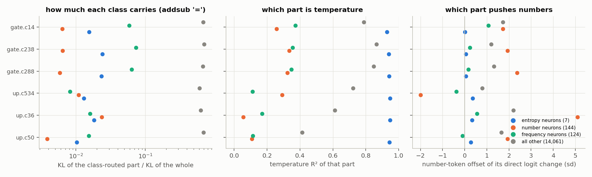

*Fig. 11. Addsub `=`: each candidate's effect routed through one neuron class only. Left: KL of that
part relative to the whole (the parts do not add up, because the softmax is nonlinear). Middle:
temperature R² of that part. Right: how much that part's direct logit change favours number tokens.*

- **Through the entropy neurons:** the effect is almost pure temperature (R² 0.93–0.95) and almost
  entirely norm-mediated (0.93–0.95). It has essentially no number preference (+0.0 to +0.4 sd). On
  fineweb: R² 0.83–0.90.
- **Through the number neurons:** there is no temperature (R² 0.06–0.33) and no norm mediation, but a
  strong number push (+1.7 to +5.1 sd; c534 pushes the other way, −2.0).
- **Through all other neurons:** most of the effect flows here (for c14, 0.62 of the total 0.91 nats), and
  it is a mix (R² 0.41–0.86, number push +0.8 to +2.2 sd).

So the two activities are separable at the neuron level. Inside Llama, though, is the confidence
mechanism coupled to the number mechanism, or does the decomposition glue them together? On 32k fineweb
positions the entropy neurons' activity is almost uncorrelated with the number neurons' (r = +0.06). The
number neurons track "next token is a number" (+0.51); the entropy neurons hardly do (+0.15). The
component follows the number context (+0.46) and both neuron groups (+0.27, +0.16) (Fig. 12). In Llama
these are two independent mechanisms. On arithmetic both happen to be constant at `=`, and a rank-one
component can then carry both at no cost.

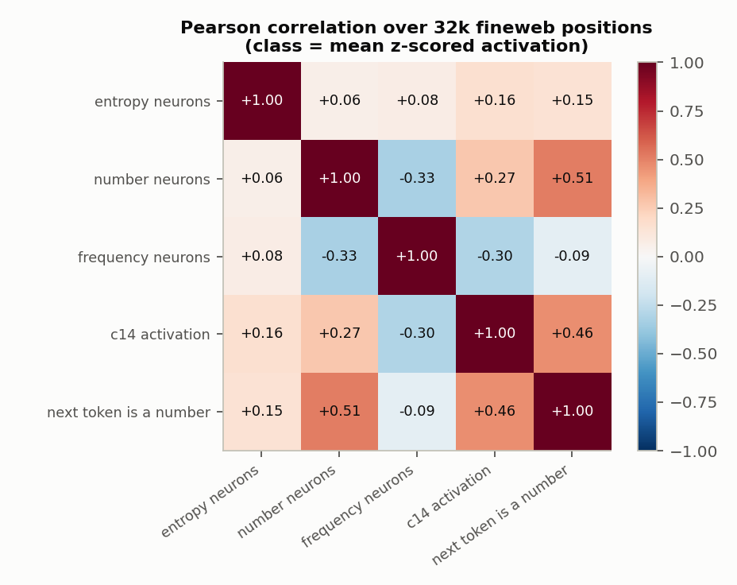

*Fig. 12. Pearson correlations over 31,744 fineweb positions. A class's activity is the mean of its
neurons' z-scored activations.*

Caveats of this section

- The class-routed ablation uses the *exact* Δh of every neuron, but routing only part of it is not the
  same as an intervention the model could make itself. The parts interact through the norm, so their KLs
  do not add up.
- The entropy neurons are the purest temperature channel but carry only 1–2.5 % of the candidates' KL on
  addsub. The bulk of the temperature effect goes through the many "other" neurons, whose writes line
  up with the same directions (§5).
- The coupling test summarises each class by its mean z-scored activation, a crude summary. A
  correlation near zero says the classes are driven by different things on web text. It does not prove
  that no input drives both.

## 4. Where the temperature part writes

Llama-3.1-8B's unembedding, including the final-norm gain (`W_U diag(g)`), has no sharp null space
(Fig. 5, left):

- **The spectrum.** The smallest singular value is 2.2, the 40th 6.0, the median 11.5.
- **The largest direction.** One direction dwarfs the rest (gain ≈ 175, 15× the median). It is the
  uniform-logit direction (\|cos\| = 0.996): the vector that raises every token's logit by the same
  amount, i.e. the mean of all unembedding rows.

Both ends of the spectrum are therefore invisible to the softmax. The low-gain end barely moves any
logit, and the top direction moves them all together.

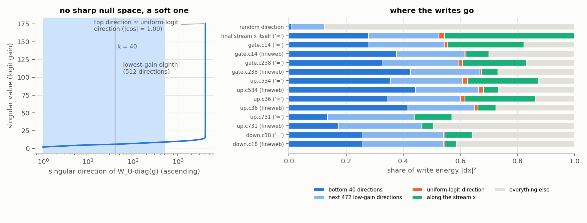

*Fig. 5. Left: singular values of `W_U diag(g)`, ascending; shaded: the lowest-gain eighth (512
directions). Right: decomposition of write energy, orthogonalised in the legend's order: bottom 40
directions, the next 472 low-gain directions, the uniform-logit direction, the part along the base stream
x, and the rest. The row "final stream x itself" is the reference (its "along x" bar is x's own
remainder by construction).*

- **Low-gain directions.** The candidates put 54–66 % of their write energy in the lowest-gain eighth
  (random vector: 12.5 %; the final stream itself: 44–52 %), and 28–44 % in the bottom 40 (random: 1 %;
  stream: 19–28 %).
- **The uniform direction.** Only 1–2 % of the write energy lies along it, but because its gain is so
  large it produces 62–74 % of each candidate's direct logit change at `=`, as a softmax-invisible
  constant shift. The median L31 MLP component has a uniform share of 8 % (fineweb scan).
- **Along the stream.** At `=`, 67–76 % of the write is parallel to the stream it is added to. That part
  only rescales the stream, and the norm undoes a rescaling.

The net result: most of the write adds size without adding visible logit content, so the final norm
cools the output.

What did not work: ablating geometric pieces of the write separately (Fig. 6)

We also tried to *prove* claim 2 by intervention. Split each write into a "token-neutral" part S0 = its
projection on {bottom-k directions, uniform direction, stream direction}, with k = 512 or 40, and the
complement S1. Then remove each part alone. This is uninformative:

- **Neither part is temperature-like.** Removing S0 alone has temperature R² 0.25–0.38 at `=`, below the
  whole write's 0.73–0.83.
- **One piece costs more than the whole.** Removing the "along the stream" piece alone costs *more*
  than removing the whole write (c14: 2.09 vs 0.91 nats).

The reason: these pieces are large compared with the stream, and the final norm couples them. Removing
one piece changes the rms that every other piece is divided by, so their effects are not separable by
projection. The class-routed ablation of §3 avoids this problem, because each neuron's write is
removed as a whole and the result is measured.

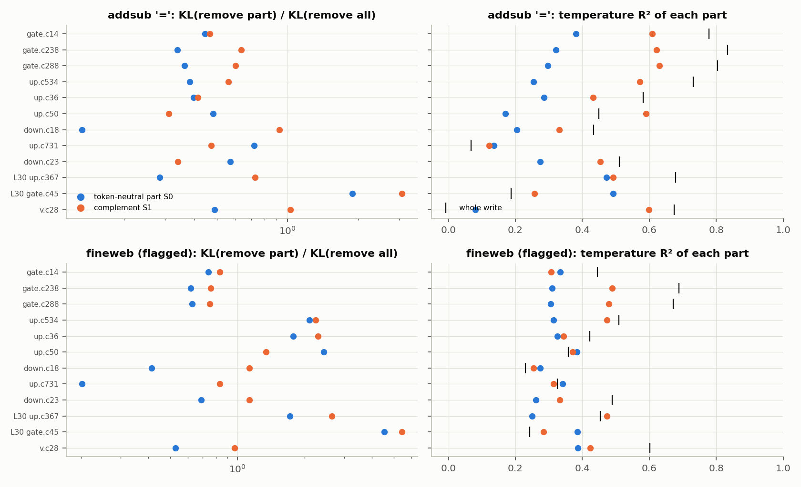

## 5. The non-temperature part: numbers, frequency, and format

To look at what remains after the temperature change, we take the residual `r` of the temperature
regression (Metrics). Averaged over positions, it does lean the expected ways:

- **Numbers.** It favours number tokens (c14: +1.8 sd; c36: +2.6 sd; c534 only +0.4 at `=`, +0.1 on
  fineweb).
- **Frequent tokens.** It favours frequent tokens (corr +0.22 to +0.37 at `=`, weaker on fineweb).

These two features together explain only 9–18 % of the residual's variation over the vocabulary
(Fig. 7). The most-moved tokens among those with real probability mass tell the rest of the story:

| component | at `=`, most suppressed | at `=`, most boosted |
|---|---|---|
| gate c14 | `?”` ` …` `?-` ` of` `?"` `?\n\n` ` something` | `+` `***` `The` `____` `Total` `What` `0` |
| up c534 | `223` `324` `444` `307` `313` `216` `93` (3-digit numbers) | ` ` ` (` ` -` ` S` ` The` `+` ` /` |
| up c36 | `?)` `？\n` `?”` `?!` ` XX` `?=` | `+` `1` `0` `2` `3` `4` `5` `500` |

So the non-temperature part mostly shapes the *kind* of continuation. It turns away from
question-style endings, and it pushes digits towards small numbers in some components and away from
large ones in others. "Prefer numbers" and "prefer frequent tokens" are real trends in it, but they are
not the whole story.

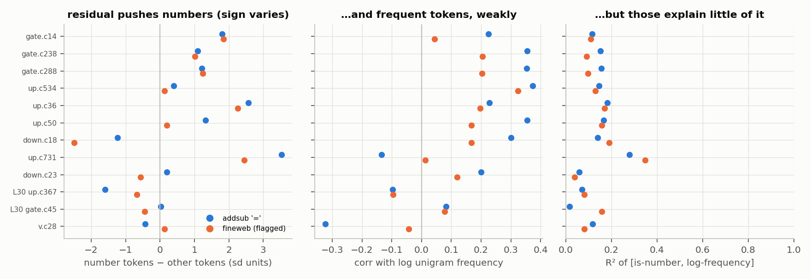

*Fig. 7. The residual r of each component's effect, profiled over seen tokens, averaged over positions.
Blue: addsub `=`. Orange: fineweb flagged positions.*

## 6. Llama's own entropy neurons, and whether the components write like them

Before comparing directions we need Llama's entropy neurons. We ran the paper's protocol on all 14,336
last-layer neurons:

- **fineweb:** mean ablation, 32 rows, positions 1–63;
- **addsub `=`:** zero ablation, 2,000 prompts.

We kept the neurons that are ≥ 50 % norm-mediated and among the top 20 by norm-mediated KL on either
dataset. The same six come out: **1209, 2398, 2564, 3191, 5966, 6696** (the addsub-only criterion finds 5
of the 6). They differ from the paper's in one striking way:

- **They are low-norm neurons**: their output weights are smaller than those of 85–99.7 % of the layer's
  neurons. The paper's heuristic was high norm.
- **They are null-heavy**: median share of the output weight in the bottom-40 directions is 0.56, against
  0.008 for all neurons.
- **They are individually small**: on fineweb, TE is 3·10⁻⁵ to 6·10⁻⁴ nats. On addsub, 1209 alone costs
  0.0098 nats and is 88 % norm-mediated.

Llama-3.1-8B's high-norm, null-heavy neurons exist, but they are silent everywhere except the sink
position (Fig. 8).

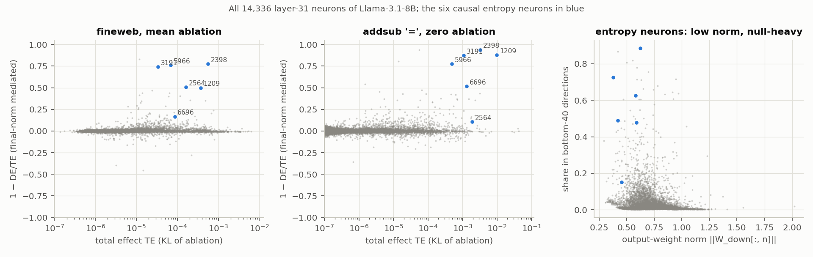

*Fig. 8. All 14,336 L31 neurons. Left / middle: total effect vs norm-mediated fraction on fineweb (mean
ablation) and addsub `=` (zero ablation); blue: the six entropy neurons. Right: output-weight norm vs
share in the bottom-40 directions.*

On the same inputs, the candidates' writes point the same way as the entropy neurons' collective
write (their activation minus its fineweb mean, times their output weights):

- **Cosine:** median +0.60 to +0.71 at `=`, and +0.29 to +0.59 at flagged fineweb positions.
- **Span:** 34–60 % of each candidate's write energy lies in the 6-dimensional span of those six output
  weights. Six random neurons capture 0 %.

The span is shared: it acts as a common "temperature axis" for the last layers. Components that also
cool the output load it with the same sign (down c18 / c23: +0.45 to +0.55). Components that sharpen it
load it with the opposite sign (v c28 at −0.73; L30 up c367 at −0.38, whose removal *raises* entropy). The
content control up c731 barely touches it (8–11 %). So the span share alone is not specific to the
candidates; the *sign* and the norm-mediation are (Fig. 9).

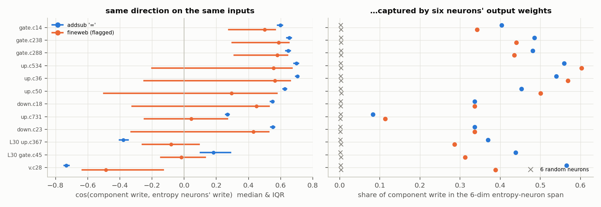

*Fig. 9. Left: per-position cosine between each component's write and the entropy neurons' write on the
same input (median and interquartile range). Right: share of the component's write energy in the span
of the six entropy neurons' output weights, against 6 random neurons (×, 5 draws).*

## 7. Which neurons the components actually use

A gate or up component adds `h · U_c` to the pre-activations of all 14,336 neurons, and its U weight is
spread thin: 80 % of `|U_c|²` needs 2,000–2,900 neurons. Adding to a neuron's gate or up input only
matters if the neuron's nonlinearity passes it on:

- for an **up** component, the change is multiplied by `silu(gate)`, which is ≈ 0 for a closed gate;
- for a **gate** component, it is multiplied by `silu′(gate) · up`.

We computed each neuron's exact contribution to the write,
`s_n = ⟨Δh_n W_down[:, n], dx⟩ / |dx|²` (the s_n sum to 1). Three results (Fig. 10):

- **Few neurons do the work.** 80 % of the actual write comes from 276–411 neurons.
- **Much of the U weight is wasted.** 46–51 % (gate components) and 67–71 % (up components) of `|U_c|²`
  sits on neurons contributing \|s_n\| < 10⁻⁴.
- **Gate state predicts which channels are live.** A neuron's contribution tracks `|U_c[n]|` × its gate
  sensitivity at `=` tightly, over five orders of magnitude.

The six entropy neurons are the top individual contributors of every candidate. For c14 that is 2564
(8 %), then 5966 and 3191; for c534 it is 2398 (7 %) and 1209 (6 %). Together they give 12–18 % of the
write from less than 2 % of the U weight. The number and frequency neurons appear among the rest, but no
small set dominates.

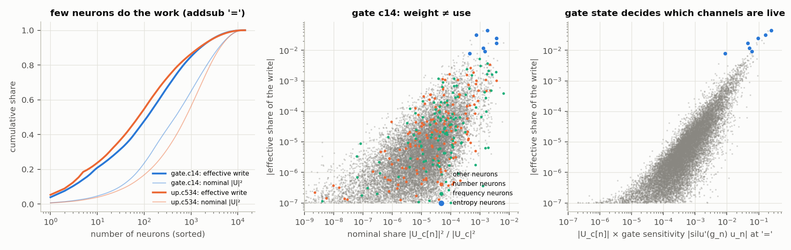

*Fig. 10. Addsub `=`. Left: cumulative share of the effective write vs of the nominal U weight, neurons
sorted. Middle: gate c14's nominal share vs effective share per neuron, coloured by class. Right: the
effective share against U weight × gate sensitivity.*

## 8. Generic entropy control plus a number-specific part (component level)

The components mix a confidence change with a number preference. This could be two mechanisms merged
(a generic entropy mechanism and a number mechanism), or one mechanism that controls confidence
specifically for number predictions. The two can be told apart at the output. The final RMSNorm divides
every logit by the same number, so an entropy mechanism acting through it can only change the
temperature of the *whole* distribution. A number-specific confidence mechanism instead changes the
temperature *among the number tokens*, i.e. how sure the model is about *which* number.

So for each route of §3 we fit the temperature change separately on the number tokens' and on the other
tokens' conditional distributions (the same weighted fit as before, within each group). We also measure
how much the probability mass on numbers moves, compared with what the global temperature change alone
would move.

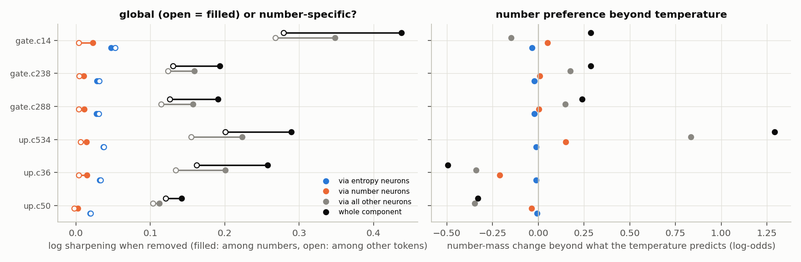

*Fig. 16. Addsub `=`, 2,000 prompts, medians. Left: how much removing the component (or only its effect
through one neuron class) sharpens the distribution among number tokens (filled) and among the other
tokens (open); equal = a global temperature change. Right: change in the log-odds of the number mass beyond
what the global temperature change predicts.*

- **Through the entropy neurons: global.** The sharpening is the same among numbers and among the rest
  for every candidate: the log ratio is between −0.004 and 0.000, and the temperature fit is excellent in
  both groups (R² 0.96 / 0.92 for c14). The number mass moves exactly as the global temperature
  predicts. Llama's entropy neurons do not do number-specific entropy control.
- **Through all other neurons: partly number-specific.** Removing the component sharpens the choice
  among numbers 7–18 % more than among the other tokens (log ratio +0.07 to +0.16 for c14 / c238 / c288 /
  c534 / c36, +0.03 for c50). Within the numbers the change is well described as a temperature change
  (R² 0.86–0.93 for c14 / c238 / c288 / c534). The final norm cannot act on one group of tokens only, so
  this part is a direct compression of the spread of the number logits.
- **Through the number neurons: mass, not temperature.** The effect is barely a temperature change (R²
  within numbers 0.13–0.57). The whole component also moves number mass beyond what the temperature
  predicts, with a component-specific sign: +1.3 log-odds towards numbers for c534, −0.3 to −0.5 for
  c36 and c50.
- **On fineweb** the number-specific part mostly disappears. c14 (1.041 vs 1.023) and c534 keep a small
  version; c238, c288 and c36 show none or the reverse.

A caveat on "number-specific temperature"

A temperature change applied only to the number tokens is, by definition, a change of the number
logits proportional to how strongly each number is already favoured. Reading it as "confidence about which
number" is an interpretation of that shape. What is solid is the split: one part goes through the norm and
is global; the other is a direct effect on the number logits only.

## 9. Do the entropy neurons improve the loss?

The paper's claim is that entropy neurons *hedge*. They cost a little loss when the model is right,
because they flatten a correct prediction, and they prevent loss spikes when it is confidently wrong. We
mirror its two tests and add a third. All use **mean ablation** (the paper's protocol), which removes only
the unit's *variation* around its average. Targets are the next token on fineweb (positions 1–62, 512
rows) and the correct answer at addsub `=` (2,000 prompts).

**Test 1 — the paper's Fig. 4a.** Change in loss when the unit is mean-ablated, against the token's initial
loss, coloured by the correct token's reciprocal rank.

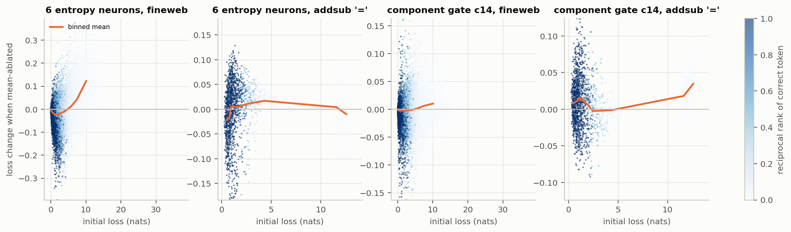

*Fig. 13. Each dot is a position; orange is the binned mean. Positive = the unit was lowering the loss.*

On fineweb the six entropy neurons reproduce the paper's shape. Removing their variation *lowers* the loss
on the easy half of the tokens (−0.017 nats) and *raises* it on the hardest tenth (+0.11 nats). Net, they
lower the loss by **+0.0043 nats per token**, 67 % of it through the final norm. Six random neurons:
−0.0001. The component c14 shows the same shape, weaker. At addsub `=` the neurons' variation is small and
net slightly harmful (−0.0018). Their *total* contribution (zero ablation) is a strong hedge, though:
−0.24 nats on the easy half, +0.79 on the hardest tenth, +0.023 net. On arithmetic their mostly
constant cooling protects the 41 % of prompts the model gets wrong.

**Test 2 — do they move the temperature in the right direction at each position?** The loss-reducing
direction at a position is known: flatten when the target's logit is below the distribution's mean logit,
sharpen when it is above (the sign of `E_p[z] − z_target`). We count how often each unit's own temperature
change (the change its removal undoes) points that way, weighting positions by the size of both.

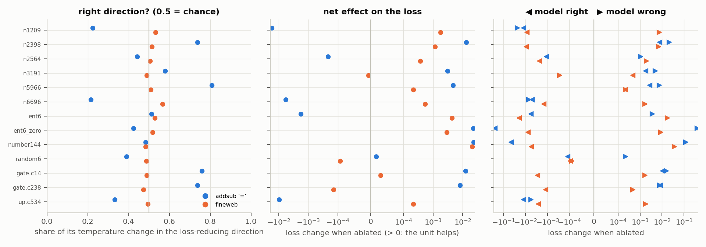

*Fig. 14. Left: share of the unit's temperature change in the loss-reducing direction (0.5 = chance).
Middle: net loss change when the unit is ablated (> 0: the unit helps). Right: the same split into positions
where the model's top prediction is right (◀) or wrong (▶).*

- **Entropy neurons: barely better than chance.** The six together go the right way 53 % of the time on
  fineweb and 51 % at `=`. Individually the picture is mixed: 2398 and 5966 are right 74–81 % of the time at
  `=`, while 1209 and 6696 are right only 21–22 %. Their loss benefit therefore does not come from
  fine-grained, per-token calibration. It comes from the tail: when the model is badly wrong, any extra
  flattening saves a lot of loss.
- **Components at `=`:** c14 and c238 move the temperature the right way 74–76 % of the time and lower the
  loss (+0.013 and +0.008 nats); c534 goes the wrong way (33 %) and costs loss (−0.010).
- **Number neurons:** they are content, not temperature, and have the largest loss effect of all (+0.021 on
  fineweb, +0.023 at `=`).

**Test 3 — the paper's induction test (its §6).** 100 fineweb rows repeated once (128 tokens). On the
second copy Llama-3.1-8B becomes extremely confident: entropy falls from 3.0 to 0.29 nats and loss from 3.0
to 0.10. The paper found that GPT-2's entropy neurons fire during the repeat to hedge, and that *clipped*
mean ablation (activation set to the mean only where it exceeds it) reduces the entropy by up to 70 %. In
Llama:

- **Clipping does little.** Clipping all six lowers the repeat's entropy by only 8 % (0.291 → 0.268) and
  slightly *lowers* the loss (0.101 → 0.097). Hedging a correct copy has no benefit here.
- **The main two go the other way.** Neurons 1209 and 2398 drop far *below* their mean during the repeat
  (−9.7 and −10.7 vs −3.0 and −3.7 on the first copy), removing their cooling so the model can be
  confident. The paper's clipped ablation cannot see this, since it only acts above the mean.
- **Only two hedge.** Neurons 2564 and 6696 rise during the repeat (+4.2, +3.8), the hedging direction,
  but their effect is small.

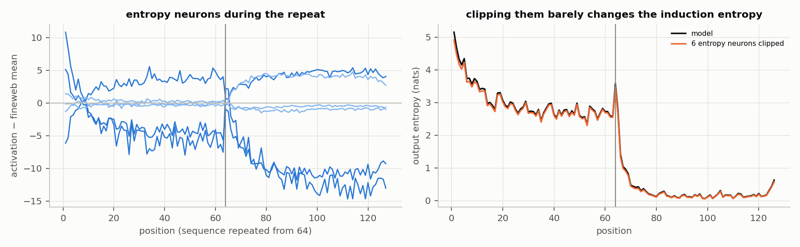

*Fig. 15. Left: each entropy neuron's activation minus its fineweb mean, averaged over 100 repeated
sequences (the repeat starts at 64). Right: output entropy of the model and with the six neurons clipped.*

Method details for §9

- **Units:** each entropy neuron; all six jointly (also zero ablation); the 144 number neurons jointly;
  6 random L31 neurons (seed 7); the components gate c14, gate c238, up c534.
- **Neuron ablation:** a neuron is mean-ablated by
  `x_final += (mean − h_n) W_down[:, n]`, with the mean over fineweb positions 1–63 (fineweb) or over
  the 2,000 `=` positions (addsub).
- **Component ablation:** a component's inner activation is replaced by its mean over the same positions.
- **Norm-mediated share of the loss change:** 1 − (loss change with the final rms frozen) / (loss change).
- **Temperature change of a unit:** the weighted fit of `log p_ablated` on `z_base`; the unit's own change
  is minus its log. Direction weights: |log β| × |E_p[z] − z_target|.
- **Induction:** 128-token sequences = a 64-token fineweb row twice (no BOS). Clipping
  `h → min(h, fineweb mean)` is applied to each of the six neurons and to all six; the repeat is scored on
  positions 65–126.
- **Code:** `claims.py` (`calibration`, `induction`, `groups`).

## What this means for reading tPD components

- **The confidence mechanism is not an artifact.** The decomposition found a real mechanism: Llama's own
  entropy neurons and a population writing along the same axis, captured through the one context the
  target exercises.
- **It is only a slice.** Because tPD keeps only what the target needs, the component is the
  "number comes next" slice of it. Anything the confidence mechanism does elsewhere lives in the delta.
- **Constant inputs merge independent mechanisms.** Because that slice's input is constant on the
  target, the decomposition had no reason to separate it from other constant-input mechanisms (number
  and format preferences). The merge is visible only by looking inside Llama (§3). A target set with
  varying confidence demands (e.g., arithmetic with ambiguous or out-of-range answers) would give the
  decomposition a reason to split them.

<b>Limitations</b>

- **Sample sizes.** The fineweb analyses use 512 rows (31,744 positions), the neuron scan 32 rows, and
  the component scan 64 rows. Some candidates are flagged at few positions (c50: 56 in 512 rows).
- **Scope.** Only blocks 30–31 were scanned. Norm-mediated mechanisms in earlier blocks were ruled out
  separately (`report_rmsnorm.md`).
- **Two temperature measures.** They agree in ranking but not in scale: the KL version is more generous
  than the weighted-regression R².
- **The "decomposed model" is not used in these claims.** All ablations here are of the original model;
  the decomposition only supplied the rank-one directions and, on fineweb, the screen.
- **Class definitions are ours.** Entropy neurons are defined causally, number and frequency neurons
  statically (top 1 %). Other thresholds shift the class sizes but not the qualitative picture.

<b>Reproduction</b>

Code (worktree `experiment/arith_representations`, `param_decomp/arith_repr/rmsnorm/`):

| file | what |
|---|---|
| `temperature.py` | fp32 dense forward, zero/mean/dose ablations, temperature fit (`deep`, `addsub`, `dose`, `scan`) |
| `ci_screen.py` | -05 CI on fineweb + U/V of blocks 30–31 |
| `entropy.py` | neuron scan (`neurons`), per-position component study (`components`) |
| `claims.py` | neuron classes, class-routed ablations, gate states, geometric split (`run`), residual profile (`residual`), group temperatures (`groups`), loss/hedging (`calibration`), induction (`induction`) |
| `figures.py` | every figure here |

Outputs are in `~/out/pod-backup/p-ba5a0c05/analysis/rmsnorm/temperature/{.,entropy,claims}`. Figures are
in `…/rmsnorm/figures/`, copied to `figures_entropy/`. Jobs ran on one L40 each via
`~/pd_scratch/dual_obj_jax/rmsnorm/rn2.sbatch` (`MOD=… CMD=…`); figures ran on CPU via `figs.sbatch`
(`JAX_PLATFORMS=cpu`). Offline joins: `~/pd_scratch/dual_obj_jax/rmsnorm/join.py`, `sum_*.py`.

<b>Reference</b>

A. Stolfo, B. Wu, W. Gurnee, Y. Belinkov, X. Song, M. Sachan, N. Nanda. *Confidence Regulation Neurons in
Language Models*. NeurIPS 2024 (arXiv:2406.16254). They use mean ablation over a reference distribution;
DE with the LayerNorm scale frozen; the null space as the bottom singular vectors of W_U (k = 12 for
GPT-2 Small, k = 40 ≈ 1 % of d_model for LLaMA-2 7B). They report ~80 % LayerNorm mediation for GPT-2's
main entropy neurons and ~40 % in other models.

