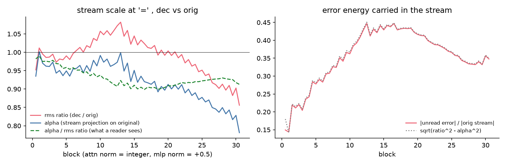
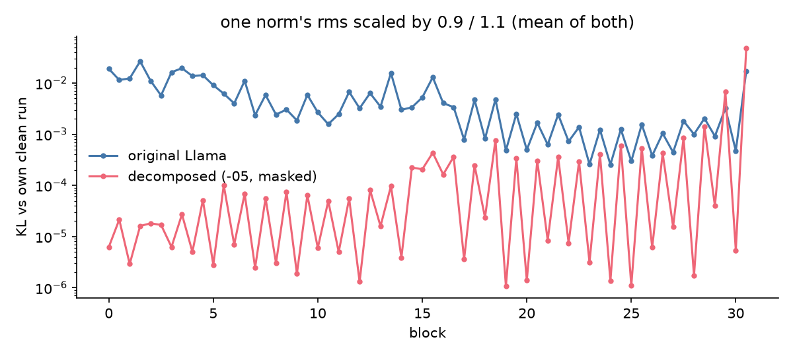
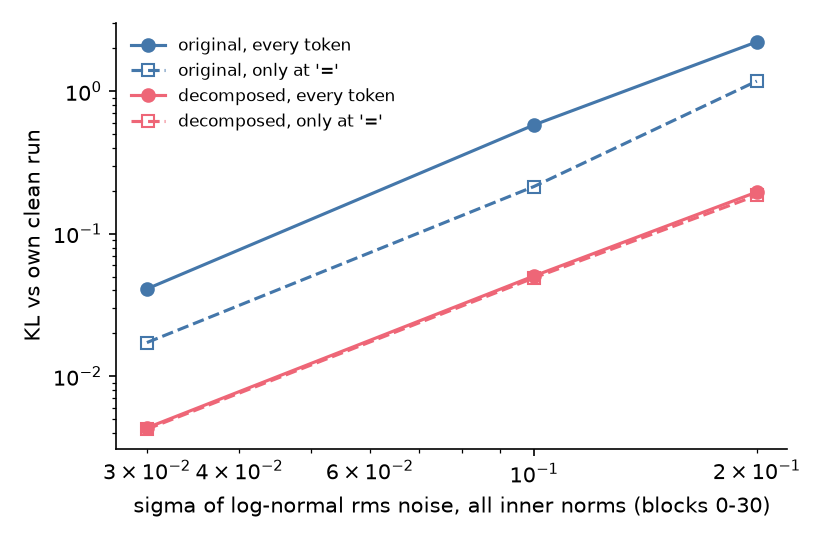
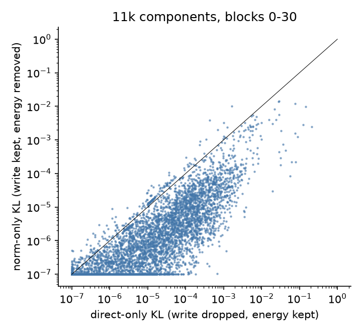
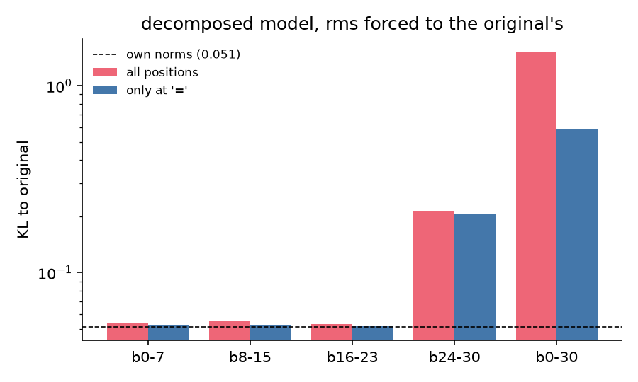
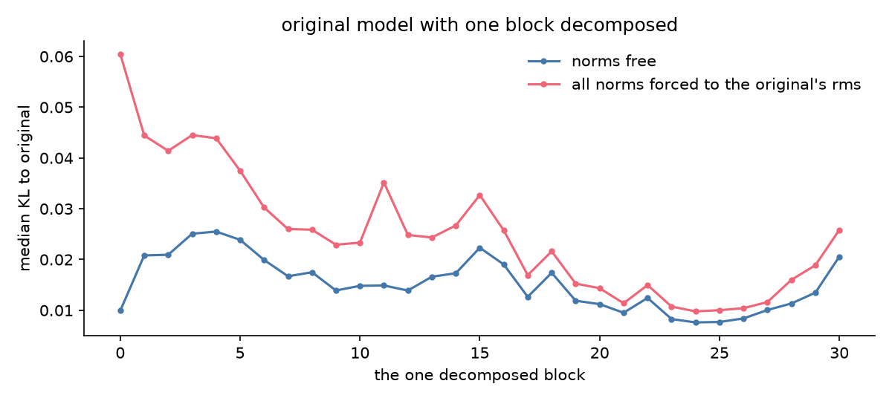
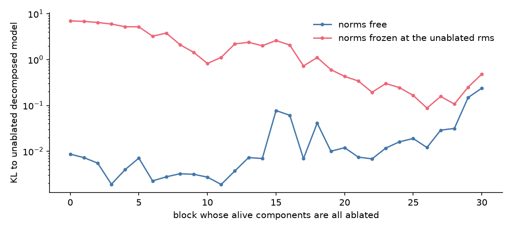

# Why a decomposed Llama doesn't care that its RMSNorm sees a different vector

*An explainer on how parameter decomposition interacts with Llama-3.1-8B's normalization layers. All experiments are on one decomposition of Llama-8B trained on two-number addition and subtraction prompts (`a+b=`, `a-b=`), run `p-ba5a0c05`. Code: `param_decomp/arith_repr/rmsnorm/`; figures are regenerated by `make_figures.py` in this folder.*

## The puzzle

Parameter decomposition (PD) takes each weight matrix of a network and writes it as a sum of many rank-one pieces, called **components**. On any given input, only a few components are needed. PD trains a small network, the **causal importance function** (CI function), to say which ones, and the model is then run with only those switched on.

In the decomposition studied here, Llama-3.1-8B is split into about 11,600 components that are "alive" (they matter on at least some prompts). On a typical prompt most of them are off. With only the switched-on ones, the model reproduces the original's next-token predictions well: the KL divergence (a standard measure of how different two probability distributions are; 0 means identical) between the two is 0.052 on average.

Here is the puzzle. Llama, like most modern transformers, has an **RMSNorm** in front of every attention and MLP block. It takes the residual stream (the running vector that every layer reads from and adds to) and divides it by its own root-mean-square size, `rms(x) = sqrt(mean(x²))`. The block then only sees a vector of a fixed overall scale, whatever the stream's true size was.

Switching components off removes their contributions from the residual stream. So the decomposed model's stream is a different vector from the original's, and its size, and therefore the number every RMSNorm divides by, is different too. Everything downstream of the first block gets rescaled. How can the outputs still match?

I tested three explanations, and came up with a few more while looking at the data:

- **H1. Some components are "RMS keepers".** They exist to add energy to the stream, so that the RMS stays in range, and are active for that reason rather than for what they compute.
- **H2. It just doesn't matter.** Removing components changes the RMS, but the model downstream doesn't much care. This would be a property of the network.
- **H3. The reconstruction would be better with a frozen norm.** If the norm divided by the *original* model's RMS instead of the decomposed model's own, the decomposed model would match the original better. The norm would be a source of error that PD has to work around.
- **H4 (new). Late components are calibrated to the decomposed model's own RMS.** The network learned to work with the smaller RMS it actually has, so giving it the "right" one would hurt.
- **H5 (new). The norm repairs damage.** Dividing by the current RMS cancels a lot of what removal does to the stream's size.
- **H6 (new). The mismatch mostly lives at other token positions.** Only the last position (`=`) is scored, but earlier positions feed into it.

**Scope.** I only look at the 62 norms in front of the attention and MLP of blocks 0 to 30. I leave out block 31 and the final norm. The decomposition has components in block 31 whose job depends on the final norm (they set the sharpness of the output distribution), so they'd muddy the picture.

## Short answer

1. **H2 is mostly right, and even more so for the decomposed model than for Llama itself.** The RMS does change after removing components, but by only a few percent. The decomposed model tolerates RMS errors far larger than that: adding ±10% error to any single norm in blocks 0–23 costs less than 0.0005 KL, and random 10% noise on all 62 norms costs 0.05 KL (the original Llama pays 0.58 for the same noise).
2. **H1 is wrong.** There are no RMS-keeper components in blocks 0–30. 89% of the alive components change the output by less than 0.0001 KL when removed, and none does its job mainly through the RMS.
3. **H3 is wrong, in the opposite direction.** Giving the decomposed model the original's RMS makes things worse, not better, and it makes them much worse in the last few blocks (**H4**). The decomposed model has adapted to its own scale.
4. **H5 is right.** Norms actively repair damage: removing all active components of a whole block costs 0.002–0.08 KL with the norms doing their normal job, and 0.2–7 KL if the norms are held frozen.
5. **H6 is partly right.** Most of the damage from an RMS mismatch comes from other positions than the answer position.

The main caveat: in my experiments the set of switched-on components is fixed in advance from the clean run. In the real decomposed model, the CI function reads the stream and would react to an RMS change, possibly by switching on different components. I did not test that, so "insensitive" here means insensitive *with the on/off pattern held fixed*.

## Setup, in plain terms

**The decomposed model.** For every prompt I take the components that the CI function switches on (CI > 0.01) and run only those, with no leftover "delta" term. This is the model that other analyses of this run use. It agrees with Llama's last-position prediction to 0.052 KL on 20,000 prompts.

**KL.** Unless stated otherwise, every KL number below is measured at the answer position (`=`), between the original model's output distribution and the output of whichever modified model I'm testing. A KL of 0.05 is a small difference; 1 or more is a broken model.

**Forcing the RMS.** In some experiments I intervene on a norm. Instead of dividing by the RMS of the current stream, it divides by a value I supply: for instance the RMS the original model had on the same prompt. This is what I call *forcing*. It lets me ask "what if this norm was given the number the original had?".

**Where the norms are.** Each block has two: one before attention and one before the MLP. I number them 0 to 61 (block *l* has norms 2*l* and 2*l*+1).

## 1. How different is the stream after removing components?

To describe the difference, write the decomposed model's stream at some norm as

> x_dec = α · x_orig + (stray part)

Here x_orig is the original model's stream on the same prompt, α is how much of x_orig is present in x_dec (1 would mean fully present), and the **stray part** is everything else in x_dec: the piece pointing in directions that are not x_orig. The stray part arises because the decomposition's active components don't write exactly what the original weights would have written. It contains no information the original had, but it does add to the vector's length.

The ratio of the two RMS values is then

> rms(x_dec) / rms(x_orig) = sqrt(α² + (size of stray part relative to |x_orig|)²)

So two effects fight over the RMS: missing energy in the right direction (α below 1) *lowers* it, and stray energy in other directions *raises* it.

Measured at the `=` position:

| blocks | RMS ratio | α | stray size (relative to \|x_orig\|) |
|---|---|---|---|
| 0–3 | 0.95–1.01 | 0.94–1.00 | 0.14–0.22 |
| 10–15 | 0.98–1.08 | 0.93–0.99 | 0.28–0.44 |
| 20–25 | 0.94–1.06 | 0.87–0.99 | 0.36–0.44 |
| 28–30 | 0.86–0.91 | 0.78–0.84 | 0.33–0.36 |

What to take from this:

- The stray part is large: 15% to 45% of the original stream's length. That's a big chunk of the stream that has nothing to do with the original computation. It inflates the RMS while the missing energy deflates it, and the two mostly cancel. The RMS is within about 6% of the original's until block 25, and 9–14% low in blocks 28–30.
- Prompt to prompt, the RMS ratio and α move together. This is mostly arithmetic, since the stray part is fairly constant in size, so it shouldn't be read as the network compensating.
- Early in the network the RMS is a collective statistic of thousands of residual dimensions. From about block 20 the original stream is dominated by a couple of huge outlier dimensions (dimension 2352 alone holds 11% of the energy at block 20 and about a third at blocks 25–30), and the stray part mostly avoids them. So the RMS is set by a few dimensions in late blocks and the stray part hardly affects it there.
- What the active components actually *read* after the norm is almost unchanged. The relative squared difference between the normalized input the decomposed and original models feed to the block is 0.1% in blocks 0–7, 0.4–0.8% in blocks 8–23 and about 1% in blocks 24–30. Using the original's RMS instead of its own gives a similar figure (0.1–1.5%).

So the RMS moves by a few percent and the normalized input by about 1% or less. The question becomes: does a few percent in RMS matter?

## 2. Does the RMS mismatch matter? (H2)

**One norm at a time.** I multiply a single norm's RMS by 0.9 or 1.1 (a ±10% error) and measure how far the model's output moves from its own unperturbed output. Median over the 62 norms:

- Original Llama: about 0.002–0.004 KL, up to 0.04 for the worst norms (blocks 1–2, the embedding norm and block 30's MLP).
- Decomposed model: median 0.00002. Only block 30's MLP norm (0.049) and block 29's (0.007) exceed 0.01. In blocks 0–23, every single norm is below 0.0005.

**All norms at once, with random errors.** I multiply each norm's RMS by a random factor (log-normal noise with the standard deviation shown, independently at every token) at all 62 norms, on 2000 prompts.

| noise level | original, all tokens | original, only `=` | decomposed, all tokens | decomposed, only `=` |
|---|---|---|---|---|
| 3% | 0.041 | 0.017 | 0.0043 | 0.0042 |
| 10% | 0.581 | 0.215 | 0.051 | 0.049 |
| 20% | 2.22 | 1.18 | 0.196 | 0.186 |

The RMS mismatch I actually measured (a few percent, with an offset up to −14% in late blocks) sits in the flat region of the decomposed model's response. Note that the original Llama is *not* robust: 10% noise costs 0.58. That contradicts the idea that transformers don't care about the scale of their input, and fits the idea that the norm is there to keep things stable.

**Why is the decomposed model more robust than the original?** I haven't isolated this. My guess: the decomposed model reads through about 10⁴ fixed on/off directions, so an RMS error scales the read values a bit but cannot switch on new ones. A dense weight matrix also feels the shifts in activation thresholds (SiLU), attention patterns, and many small directions, all of which a scale change can trigger. This guess is exactly the thing the static masks can't test.

## 3. Are there RMS keepers? (H1)

If some components existed only to add energy to the stream, removing them would harm the model mainly through the *later norms* rather than through what they write. I can separate the two effects for every alive component, on 500 prompts (10,599 components). For each one I run three variants:

- **ablate**: turn it off completely.
- **direct-only**: drop its written vector from the stream, but let later norms still see its energy (they divide by the RMS as if it was still there). This measures what it *writes*.
- **norm-only**: keep its written vector in the stream, but make later norms compute the RMS without it. This measures what it does through the *norm*.

Summed over all components in blocks 0–30: ablation 2.03 KL, direct-only 2.28, norm-only 0.26. So the norm route accounts for about 11% of what components do.

- 89% of alive components change the output by less than 0.0001 KL when removed.
- 252 components have a direct-only or norm-only effect above 0.001. Only 9 of those are dominated by the norm route, and none has an effect above 0.01 that is mostly through the norm.
- The norm-dominated ones are small and few, for example `L1.down.c0` (which writes the huge activation on the beginning-of-sequence token; its direct and norm effects nearly cancel, so removing it does almost nothing), `L2.q.c26`, `L3.q.c1`, `L24.down.c0`.

**H1 is rejected.** No component is needed mainly to keep the RMS in range. A per-component test can't rule out a collective role played by many tiny components; the whole-block ablation in section 5 does, since removing a block's components together is absorbed by the norms.

For contrast, in block 31 the norm route dominates (2.12 of 2.38 total). That's the temperature-setting group of components I excluded.

## 4. Would the original's RMS be a better target? (H3 and H4)

Now I force each norm of the decomposed model to divide by the RMS the *original* had on the same prompt, over windows of blocks. Baseline (own norms): 0.051 KL on 10,000 prompts.

| norms forced | all positions | only at `=` |
|---|---|---|
| blocks 0–7 | 0.054 | 0.052 |
| blocks 8–15 | 0.055 | 0.052 |
| blocks 16–23 | 0.053 | 0.052 |
| blocks 24–30 | **0.214** | 0.206 |
| blocks 0–30 | **1.51** (accuracy 2%) | 0.59 (accuracy 27%) |

Forcing the original's RMS never improves the match. In blocks 0–23 it does nothing. In blocks 24–30 it quadruples the error, and across all blocks it breaks the model. **H3 is rejected**: the original's RMS is not the number the decomposed model needs; its own is.

**H4: why the last blocks?** In blocks 24–30, α (the fraction of the original stream present) falls to 0.78–0.85, and the decomposed RMS to 0.86–0.91 of the original's. Then the components that read through those norms have learned to expect the smaller RMS. Feed them the original's larger one and the normalized input has 12% *less* energy than the original's (energy ratio 0.88 for MLP inputs); feed them their own and it's 9% *more* (1.09). So the decomposed model is tuned to the smaller RMS it has. (I have not tested this causally; see the last section.) Forcing the original's RMS at just block 30's MLP norm already doubles the error (0.106 vs 0.052).

Since training ran with the norms in the loop, this is the decomposition adapting to its own scale, not a property of the network being copied.

**Two more checks.**

- Freezing all 65 norms at a fixed average RMS gives NaN (own averages) or KL 5.0 (original's averages). Even for the original Llama, freezing every norm gives NaN outputs on 15% of prompts.
- Original Llama with only *one* block replaced by its decomposed version: KL is 0.009–0.042. Forcing the original's RMS back on later norms *raises* the median KL in every block from 5 to 30 (by +0.0016 to +0.020), and never lowers it. So the same pattern holds one block at a time.

## 5. Norms repair damage (H5)

Remove all the alive components of one block, and measure the KL. Do it once with the norms working normally, and once with them frozen at the RMS the unablated model had (2000 prompts):

| block ablated | norms free | norms frozen |
|---|---|---|
| 0 | 0.009 | 6.99 |
| 3 | 0.002 | 5.96 |
| 9 | 0.003 | 1.44 |
| 15 | 0.077 | 2.61 |
| 18 | 0.041 | 1.11 |
| 24 | 0.016 | 0.24 |
| 30 | 0.239 | 0.48 |

Removing a block's whole contribution shifts the later RMS by 5–17%, and the free norms rescale everything after it. That absorbs most of the loss. Freezing them removes the repair, and the same removal costs 2 to 800 times more.

This has a consequence for method: **freezing norms is not a clean counterfactual** for asking what a component does. It changes the model's behaviour a lot by itself. That is why I measured norm-only and direct-only effects with the norms otherwise free.

## 6. Where does the damage occur? (H6)

Forcing the original's RMS on all blocks costs 1.51 KL at all positions and 0.59 when only the answer position is forced. Part of the error is at earlier tokens. This makes sense: the first token (the beginning-of-sequence token) has enormous activations (RMS 7.7 against 0.11 at `=`, at block 10) and its keys and values are read by the final position. A small relative RMS change there is a big absolute one. The original model shows the same pattern: noise added only at `=` costs a third to a half of noise added at every position.

## What I didn't test, and what to do next

- **Static masks.** Everything above keeps the on/off pattern from the unperturbed run. The CI function reads the stream and would respond to an RMS change. I expect this to add sensitivity, so the robustness numbers above are best read as an upper bound. A torch port of the CI function exists at `attn_alive/ci_torch.py`; using it to recompute the masks after an RMS perturbation would settle this.
- **Hidden vs output components.** This run has components trained partly for their effect on hidden activations and partly for their effect on outputs. I used a single alive set. Whether dropping the hidden-only components changes the RMS differently needs the hidden CI, and a comparison with the outputs-only twin run (`addsub-all-layers-4xh100-05-outputs-only`).
- **A causal test of H4.** Rescale the active writers in blocks 24–30 by 1/(RMS ratio), so that the original's RMS becomes the right target. If forcing then stops hurting, the calibration story holds.
- **One run, one task, one answer position.** Per-component KL differences below about 0.0001 are noise at 500 prompts. Everything else uses 1000 to 20,000 prompts on fixed subsets.
